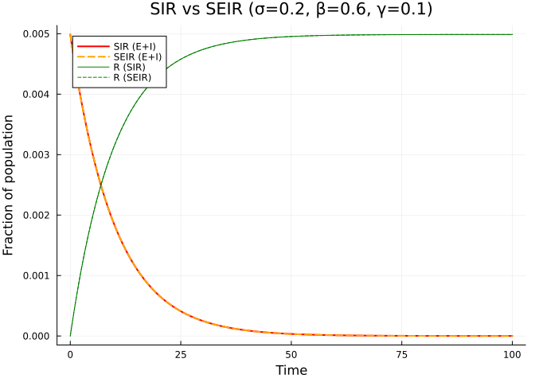
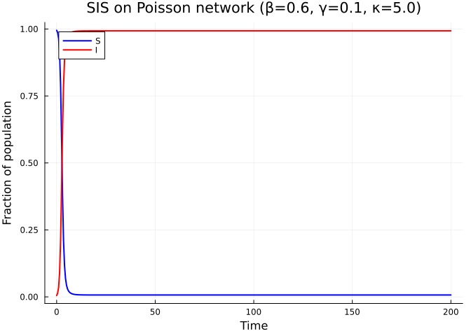
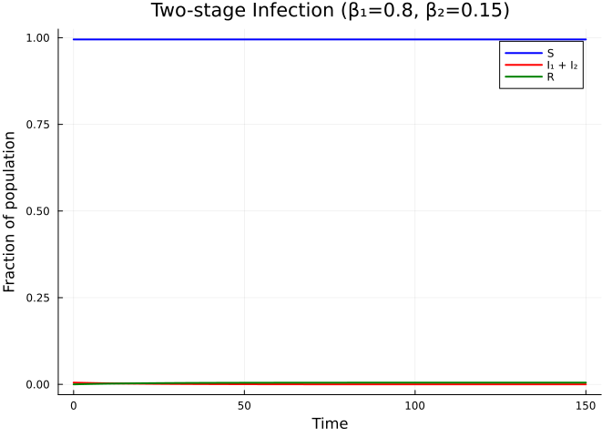
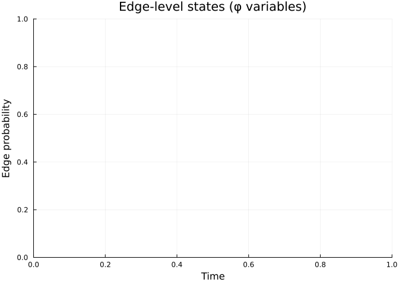

# Complex Disease Models
Simon Frost
2026-03-27

- [Introduction](#introduction)
- [Setup](#setup)
- [SEIR model](#seir-model)
- [Comparing SIR and SEIR](#comparing-sir-and-seir)
- [SIS model](#sis-model)
- [Custom multi-stage infection](#custom-multi-stage-infection)
- [Edge-level dynamics](#edge-level-dynamics)
- [Summary](#summary)

## Introduction

The expanded edge-based formulation is not limited to SIR — it handles
arbitrary disease progression graphs. Each disease stage that can
transmit infection gets its own edge-level probability $\varphi$, and
the package automatically constructs the full system of ODEs.

This vignette demonstrates:

- **SEIR**: adding a latent (exposed) period
- **SIS**: endemic dynamics without lasting immunity
- **Multi-stage infections**: acute and chronic infectious periods with
  different transmission rates

## Setup

``` julia
using EdgeBasedModels
using ModelingToolkit
using OrdinaryDiffEq
using Symbolics
using Plots
```

``` julia
@parameters β γ κ
pgf = poisson_pgf(κ)
κ_val = 5.0
ψ(x) = exp(κ_val * (x - 1))
tspan = (0.0, 100.0)
β_val = 0.6
γ_val = 0.1
```

    0.1

## SEIR model

The SEIR model adds an exposed (latent) class $E$ between $S$ and $I$.
Exposed individuals are infected but not yet infectious. The transition
rate from $E$ to $I$ is $\sigma$ (so the mean latent period is
$1/\sigma$).

$$S \xrightarrow{\text{infection}} E \xrightarrow{\sigma} I \xrightarrow{\gamma} R$$

``` julia
@parameters σ
model_seir = build_seir(pgf, σ, β, γ)
eqs = ModelingToolkit.equations(model_seir.system)
println("SEIR: $(length(eqs)) ODEs")
for eq in eqs
    println("  ", eq)
end
```

    SEIR: 5 ODEs
      Differential(t, 1)(R(t)) ~ (1 - exp((-1 + θ(t))*κ) - R(t))*γ
      Differential(t, 1)(phi_R(t)) ~ phi_I(t)*γ
      Differential(t, 1)(phi_I(t)) ~ phi_E(t)*σ - phi_I(t)*(β + γ)
      Differential(t, 1)(phi_E(t)) ~ -phi_E(t)*σ + phi_S(t)*phi_I(t)*β*κ
      Differential(t, 1)(θ(t)) ~ -phi_I(t)*β

The SEIR model has 5 ODEs: $\theta$, $\varphi_E$, $\varphi_I$,
$\varphi_R$, and $R$.

> [!NOTE]
>
> At the population level, the model tracks $S = \psi(\theta)$, $R$, and
> the combined “infected” fraction $E + I = 1 - S - R$. The edge-level
> variables $\varphi_E$ and $\varphi_I$ track the probability that a
> random neighbor is in each stage, providing more granular information
> than the population-level quantities.

``` julia
σ_val = 0.2  # mean latent period = 5 days
ic_seir = default_initial_conditions(model_seir)
prob_seir = ODEProblem(
    model_seir.system,
    merge(ic_seir, Dict(β => β_val, γ => γ_val, σ => σ_val, κ => κ_val)),
    tspan,
)
sol_seir = solve(prob_seir, Tsit5(); saveat = 0.5)
```

    retcode: Success
    Interpolation: 1st order linear
    t: 201-element Vector{Float64}:
       0.0
       0.5
       1.0
       1.5
       2.0
       2.5
       3.0
       3.5
       4.0
       4.5
       ⋮
      96.0
      96.5
      97.0
      97.5
      98.0
      98.5
      99.0
      99.5
     100.0
    u: 201-element Vector{Vector{Float64}}:
     [0.0, 0.0, 0.0, 0.0, 0.999]
     [0.00024324428013871243, 0.0, 0.0, 0.0, 0.999]
     [0.0004746253588545431, 0.0, 0.0, 0.0, 0.999]
     [0.0006947219569257883, 0.0, 0.0, 0.0, 0.999]
     [0.0009040848354296193, 0.0, 0.0, 0.0, 0.999]
     [0.001103236427058306, 0.0, 0.0, 0.0, 0.999]
     [0.0012926747660069941, 0.0, 0.0, 0.0, 0.999]
     [0.001472874223437038, 0.0, 0.0, 0.0, 0.999]
     [0.00164428586646736, 0.0, 0.0, 0.0, 0.999]
     [0.0018073391173944393, 0.0, 0.0, 0.0, 0.999]
     ⋮
     [0.004987161984882988, 0.0, 0.0, 0.0, 0.999]
     [0.004987173298408951, 0.0, 0.0, 0.0, 0.999]
     [0.004987184194619575, 0.0, 0.0, 0.0, 0.999]
     [0.004987194874168247, 0.0, 0.0, 0.0, 0.999]
     [0.004987205545469677, 0.0, 0.0, 0.0, 0.999]
     [0.004987216424699895, 0.0, 0.0, 0.0, 0.999]
     [0.004987227735796254, 0.0, 0.0, 0.0, 0.999]
     [0.0049872397104574265, 0.0, 0.0, 0.0, 0.999]
     [0.004987252588143407, 0.0, 0.0, 0.0, 0.999]

``` julia
# Extract θ and R to compute population-level quantities
state_names = string.(ModelingToolkit.unknowns(model_seir.system))
θ_idx = findfirst(s -> startswith(s, "θ"), state_names)
R_idx = findfirst(s -> startswith(s, "R"), state_names)
θ_seir = sol_seir[θ_idx, :]
R_seir = sol_seir[R_idx, :]
S_seir = ψ.(θ_seir)
EI_seir = 1.0 .- S_seir .- R_seir  # E + I combined
```

    201-element Vector{Float64}:
     0.00498752080731768
     0.0047442765271789675
     0.0045128954484631376
     0.004292798850391892
     0.004083435971888061
     0.0038842843802593743
     0.003694846041310686
     0.0035146465838806424
     0.00334323494085032
     0.0031801816899232407
     ⋮
     3.588224346921798e-7
     3.4750890872889406e-7
     3.366126981050113e-7
     3.259331494333967e-7
     3.152618480032135e-7
     3.043826177851275e-7
     2.930715214261026e-7
     2.810968602537378e-7
     2.682191742727977e-7

## Comparing SIR and SEIR

``` julia
# Build SIR for comparison
model_sir = build_sir(pgf, β, γ; form = :expanded)
ic_sir = default_initial_conditions(model_sir)
prob_sir = ODEProblem(
    model_sir.system,
    merge(ic_sir, Dict(β => β_val, γ => γ_val, κ => κ_val)),
    tspan,
)
sol_sir = solve(prob_sir, Tsit5(); saveat = 0.5)

state_names_sir = string.(ModelingToolkit.unknowns(model_sir.system))
θ_idx_sir = findfirst(s -> startswith(s, "θ"), state_names_sir)
R_idx_sir = findfirst(s -> startswith(s, "R"), state_names_sir)
θ_sir = sol_sir[θ_idx_sir, :]
R_sir = sol_sir[R_idx_sir, :]
S_sir = ψ.(θ_sir)
I_sir = 1.0 .- S_sir .- R_sir
```

    201-element Vector{Float64}:
     0.00498752080731768
     0.0047442765291545504
     0.0045128954494401685
     0.004292798828178263
     0.004083436019791223
     0.00388428450359447
     0.0036948461339441543
     0.0035146465844452203
     0.003343234715160879
     0.0031801816282027466
     ⋮
     3.867773241076483e-7
     3.72129876973111e-7
     3.566131188065605e-7
     3.399542532383018e-7
     3.233744299393007e-7
     3.076032473198903e-7
     2.926012945001291e-7
     2.783310036596348e-7
     2.6475665003845156e-7

``` julia
plot(sol_sir.t, I_sir, label = "SIR (E+I)", linewidth = 2, color = :red)
plot!(sol_seir.t, EI_seir, label = "SEIR (E+I)", linewidth = 2, color = :orange,
      linestyle = :dash)
plot!(sol_sir.t, R_sir, label = "R (SIR)", linewidth = 1, color = :green)
plot!(sol_seir.t, R_seir, label = "R (SEIR)", linewidth = 1, color = :green,
      linestyle = :dash)
xlabel!("Time")
ylabel!("Fraction of population")
title!("SIR vs SEIR (σ=$σ_val, β=$β_val, γ=$γ_val)")
```

<div id="fig-sir-vs-seir">



Figure 1: SIR vs SEIR: the exposed period delays and flattens the
epidemic peak.

</div>

The exposed period delays the epidemic peak but does not change the
final size (since $R_0$ depends only on the infectious period and
transmission rate, not the latent period).

## SIS model

In the SIS model, individuals recover to the susceptible state — there
is no lasting immunity. This leads to an endemic equilibrium where
$I > 0$ persists indefinitely.

``` julia
model_sis = build_sis(pgf, β, γ)
eqs_sis = ModelingToolkit.equations(model_sis.system)
println("SIS: $(length(eqs_sis)) ODE")
for eq in eqs_sis
    println("  ", eq)
end
```

    SIS: 1 ODE
      Differential(t, 1)(θ(t)) ~ (-exp((-1 + θ(t))*κ)*β + exp((-1 + θ(t))*κ)*γ + θ(t)*exp(0)*β - θ(t)*exp(0)*γ) / (-exp(0))

The SIS model has just 1 ODE for $\theta$, with $S$ and $I$ as
observables.

``` julia
prob_sis = ODEProblem(
    model_sis.system,
    merge(
        Dict(model_sis.variables[:θ] => 1 - 1e-3),
        Dict(β => β_val, γ => γ_val, κ => κ_val),
    ),
    (0.0, 200.0),
)
sol_sis = solve(prob_sis, Tsit5(); saveat = 0.5)

θ_sis = sol_sis[1, :]
S_sis = ψ.(θ_sis)
I_sis = 1.0 .- S_sis
```

    401-element Vector{Float64}:
     0.00498752080731768
     0.01342573933383684
     0.035565925171179735
     0.09047168737206257
     0.20946797820994156
     0.4069869322692615
     0.6270216152497419
     0.7904367211164158
     0.8835505085559424
     0.9316147277289705
     ⋮
     0.9930229130944842
     0.9930229036188507
     0.993022884649078
     0.9930228584381829
     0.9930228284139994
     0.9930227991792236
     0.9930227765114468
     0.993022767363143
     0.9930227784083487

``` julia
plot(sol_sis.t, S_sis, label = "S", linewidth = 2, color = :blue)
plot!(sol_sis.t, I_sis, label = "I", linewidth = 2, color = :red)
xlabel!("Time")
ylabel!("Fraction of population")
title!("SIS on Poisson network (β=$β_val, γ=$γ_val, κ=$κ_val)")
```

<div id="fig-sis">



Figure 2: SIS model showing endemic equilibrium.

</div>

Unlike SIR, the infection reaches an endemic equilibrium where a
constant fraction of the population remains infected.

## Custom multi-stage infection

For diseases with multiple infectious stages (e.g., acute followed by
chronic), we build a `DiseaseProgression` directly. Each stage can have
a different transmission rate.

Consider a model where infection proceeds:
$I_1 \xrightarrow{\gamma_1} I_2 \xrightarrow{\gamma_2} R$, with $I_1$
(acute) having transmission rate $\beta_1 = 0.8$ and $I_2$ (chronic)
having $\beta_2 = 0.15$.

``` julia
@parameters β₁ β₂ γ₁ γ₂

progression = DiseaseProgression(
    [
        DiseaseStage(:I1; transmission_rate = β₁),
        DiseaseStage(:I2; transmission_rate = β₂),
        DiseaseStage(:R; transmission_rate = 0),
    ],
    [
        DiseaseTransition(:I1, :I2, γ₁),
        DiseaseTransition(:I2, :R, γ₂),
    ];
    entry = :I1,
)

model_multi = build_edge_system(
    StaticConfigurationModel(pgf, progression);
    form = :expanded,
)
eqs_multi = ModelingToolkit.equations(model_multi.system)
println("Two-stage infection: $(length(eqs_multi)) ODEs")
for eq in eqs_multi
    println("  ", eq)
end
```

    Two-stage infection: 5 ODEs
      Differential(t, 1)(R(t)) ~ (1 - exp((-1 + θ(t))*κ) - R(t))*γ₂
      Differential(t, 1)(phi_R(t)) ~ phi_I2(t)*γ₂
      Differential(t, 1)(phi_I2(t)) ~ phi_I1(t)*γ₁ - phi_I2(t)*(β₂ + γ₂)
      Differential(t, 1)(phi_I1(t)) ~ -phi_I1(t)*β₁ - phi_I1(t)*γ₁ + (phi_I1(t)*β₁ + phi_I2(t)*β₂)*phi_S(t)*κ
      Differential(t, 1)(θ(t)) ~ -phi_I1(t)*β₁ - phi_I2(t)*β₂

``` julia
ic_multi = default_initial_conditions(model_multi)
prob_multi = ODEProblem(
    model_multi.system,
    merge(ic_multi, Dict(β₁ => 0.8, β₂ => 0.15, γ₁ => 0.5, γ₂ => 0.05, κ => κ_val)),
    (0.0, 150.0),
)
sol_multi = solve(prob_multi, Tsit5(); saveat = 0.5)
```

    retcode: Success
    Interpolation: 1st order linear
    t: 301-element Vector{Float64}:
       0.0
       0.5
       1.0
       1.5
       2.0
       2.5
       3.0
       3.5
       4.0
       4.5
       ⋮
     146.0
     146.5
     147.0
     147.5
     148.0
     148.5
     149.0
     149.5
     150.0
    u: 301-element Vector{Vector{Float64}}:
     [0.0, 0.0, 0.0, 0.0, 0.999]
     [0.00012314233235613328, 0.0, 0.0, 0.0, 0.999]
     [0.00024324426828615446, 0.0, 0.0, 0.0, 0.999]
     [0.0003603808670106396, 0.0, 0.0, 0.0, 0.999]
     [0.00047462535684238957, 0.0, 0.0, 0.0, 0.999]
     [0.0005860492155753315, 0.0, 0.0, 0.0, 0.999]
     [0.0006947221917503548, 0.0, 0.0, 0.0, 0.999]
     [0.0008007119868937341, 0.0, 0.0, 0.0, 0.999]
     [0.0009040847375609787, 0.0, 0.0, 0.0, 0.999]
     [0.0010049050507670847, 0.0, 0.0, 0.0, 0.999]
     ⋮
     [0.0049841261528685964, 0.0, 0.0, 0.0, 0.999]
     [0.004984208248387895, 0.0, 0.0, 0.0, 0.999]
     [0.004984288432258729, 0.0, 0.0, 0.0, 0.999]
     [0.004984366784020614, 0.0, 0.0, 0.0, 0.999]
     [0.004984443382789354, 0.0, 0.0, 0.0, 0.999]
     [0.0049845183072570395, 0.0, 0.0, 0.0, 0.999]
     [0.004984591635692049, 0.0, 0.0, 0.0, 0.999]
     [0.004984663445939049, 0.0, 0.0, 0.0, 0.999]
     [0.004984733815418989, 0.0, 0.0, 0.0, 0.999]

``` julia
state_names_multi = string.(ModelingToolkit.unknowns(model_multi.system))
θ_idx_m = findfirst(s -> startswith(s, "θ"), state_names_multi)
R_idx_m = findfirst(s -> startswith(s, "R"), state_names_multi)
θ_multi = sol_multi[θ_idx_m, :]
R_multi = sol_multi[R_idx_m, :]
S_multi = ψ.(θ_multi)
I_multi = 1.0 .- S_multi .- R_multi
```

    301-element Vector{Float64}:
     0.00498752080731768
     0.004864378474961547
     0.0047442765390315255
     0.00462713994030704
     0.004512895450475291
     0.004401471591742348
     0.004292798615567325
     0.004186808820423946
     0.0040834360697567015
     0.003982615756550596
     ⋮
     3.394654449083781e-6
     3.312558929785374e-6
     3.232375058951492e-6
     3.154023297066537e-6
     3.0774245283263224e-6
     3.002500060640678e-6
     2.929171625630847e-6
     2.8573613786312194e-6
     2.7869918986910686e-6

``` julia
plot(sol_multi.t, S_multi, label = "S", linewidth = 2, color = :blue)
plot!(sol_multi.t, I_multi, label = "I₁ + I₂", linewidth = 2, color = :red)
plot!(sol_multi.t, R_multi, label = "R", linewidth = 2, color = :green)
xlabel!("Time")
ylabel!("Fraction of population")
title!("Two-stage Infection (β₁=0.8, β₂=0.15)")
```

<div id="fig-multistage">



Figure 3: Two-stage infection with acute (high β) and chronic (low β)
phases.

</div>

## Edge-level dynamics

One of the unique features of edge-based models is access to the
edge-level variables. These show the probability that a random neighbor
is in each disease stage.

``` julia
# Extract φ variables from the multi-stage solution
φ_idxs = Dict{String,Int}()
for (i, s) in enumerate(state_names_multi)
    if startswith(s, "φ")
        φ_idxs[s] = i
    end
end
println("Edge-level variables:")
for (name, idx) in sort(collect(φ_idxs); by = first)
    println("  [$idx] $name")
end
```

    Edge-level variables:

``` julia
p = plot(xlabel = "Time", ylabel = "Edge probability",
         title = "Edge-level states (φ variables)")
for (name, idx) in sort(collect(φ_idxs); by = first)
    short = replace(name, r"\(t\)" => "")
    plot!(p, sol_multi.t, sol_multi[idx, :], label = short, linewidth = 2)
end
p
```

<div id="fig-edge-level">



Figure 4: Edge-level probabilities for the two-stage infection model.

</div>

## Summary

- **SEIR**: 5 ODEs — the exposed period delays but doesn’t change the
  final epidemic size.
- **SIS**: 1 ODE — produces endemic equilibria.
- **Multi-stage**: arbitrary disease graphs via `DiseaseProgression`
  with per-stage transmission rates.
- The package automates all the bookkeeping for edge-level variables,
  regardless of disease complexity.
