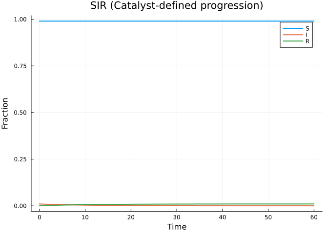
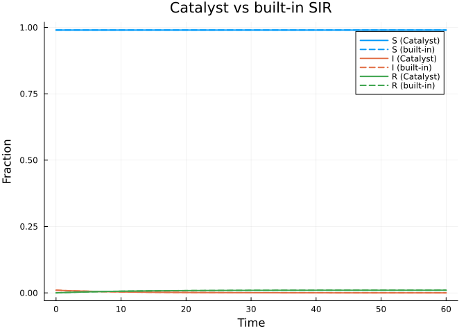
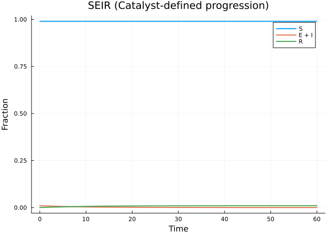
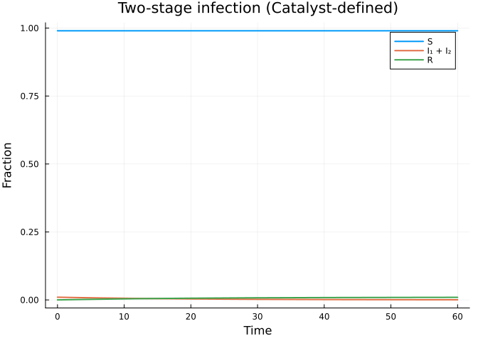

# Catalyst.jl Integration
Simon Frost
2026-03-27

- [Introduction](#introduction)
- [Setup](#setup)
- [SIR via Catalyst](#sir-via-catalyst)
  - [Building and solving the model](#building-and-solving-the-model)
  - [Comparison with `build_sir`](#comparison-with-build_sir)
- [SEIR via Catalyst](#seir-via-catalyst)
- [Custom multi-stage model via
  Catalyst](#custom-multi-stage-model-via-catalyst)
  - [Symbolic $R_0$](#symbolic-r_0)
- [Benefits of the Catalyst adapter](#benefits-of-the-catalyst-adapter)

## Introduction

For users already familiar with
[Catalyst.jl](https://github.com/SciML/Catalyst.jl)’s reaction network
DSL, EdgeBasedModels.jl provides a convenient bridge: the
`progression_from_catalyst` function converts a Catalyst
`ReactionSystem` into a `DiseaseProgression` that can be plugged
directly into any edge-based configuration model. This lets you leverage
Catalyst’s expressive chemical kinetics notation for specifying disease
compartment transitions, while EdgeBasedModels handles the network
epidemic equations automatically.

## Setup

``` julia
using EdgeBasedModels
using ModelingToolkit
using Symbolics
using OrdinaryDiffEq
using Plots
import Catalyst
```

We use `import Catalyst` rather than `using Catalyst` to avoid namespace
collisions with ModelingToolkit (both packages export symbols like
`@parameters`).

## SIR via Catalyst

In the standard edge-based SIR model, the disease progression is simply
$I \xrightarrow{\gamma} R$. We can express this as a Catalyst reaction
network:

``` julia
@parameters β γ γ_cat
rn = Catalyst.@reaction_network begin
    γ_cat, I --> R
end; nothing
```

Now we convert this `ReactionSystem` into a `DiseaseProgression`. The
`transmission_rates` dictionary specifies which compartments can
transmit infection across an edge, and at what rate:

``` julia
progression = progression_from_catalyst(
    rn;
    transmission_rates = Dict(:I => β, :R => 0),
    entry = :I
)
```

    DiseaseProgression(:S, :I, DiseaseStage[DiseaseStage(:I, β), DiseaseStage(:R, 0)], DiseaseTransition[DiseaseTransition(:I, :R, γ_cat)])

The `entry = :I` argument tells the model that newly infected nodes
enter the $I$ compartment (as opposed to an exposed class).

### Building and solving the model

We pair the progression with a Poisson degree distribution to build a
`StaticConfigurationModel`:

``` julia
@parameters κ
pgf = poisson_pgf(κ)
scm = StaticConfigurationModel(pgf, progression)
result = build_edge_system(scm)
```

    EdgeModelSystem(Model edge_based_model:
    Equations (4):
      4 standard: see equations(edge_based_model)
    Unknowns (4): see unknowns(edge_based_model)
      R(t)
      phi_R(t)
      phi_I(t)
      θ(t)
    Parameters (3): see parameters(edge_based_model)
      κ
      β
      γ_cat
    Observed (3): see observed(edge_based_model), Dict{Symbol, Any}(:R => R(t), :φ_I => phi_I(t), :φ_R => phi_R(t), :θ => θ(t)), Dict{Symbol, Any}(:I => I(t), :φ_S => phi_S(t), :S => S(t), :edge_hazard => phi_I(t)*β, :excess_hazard => phi_I(t)*β*κ))

Set up numeric parameters and solve:

``` julia
κ_val = 10.0
β_val = 0.3
γ_val = 0.1
ε = 1e-3
tspan = (0.0, 60.0)

ic = default_initial_conditions(result; ε = ε)
params = Dict(κ => κ_val, β => β_val, γ_cat => γ_val)
prob = ODEProblem(result.system, merge(ic, params), tspan)
sol = solve(prob, Tsit5())
```

    retcode: Success
    Interpolation: specialized 4th order "free" interpolation
    t: 13-element Vector{Float64}:
      0.0
      0.1149846669687547
      1.1453555759290637
      3.3093544087899778
      6.277636082342079
     10.093600437608155
     14.892521711527422
     20.752768249844607
     27.819328055198635
     36.25472601016414
     46.31849676619453
     58.378360502541526
     60.0
    u: 13-element Vector{Vector{Float64}}:
     [0.0, 0.0, 0.0, 0.999]
     [0.0001137563898801053, 0.0, 0.0, 0.999]
     [0.0010768047193339735, 0.0, 0.0, 0.999]
     [0.00280344396729007, 0.0, 0.0, 0.999]
     [0.004638923994414818, 0.0, 0.0, 0.999]
     [0.006323804614469981, 0.0, 0.0, 0.999]
     [0.007705985929513047, 0.0, 0.0, 0.999]
     [0.00870118687171644, 0.0, 0.0, 0.999]
     [0.00933402918342347, 0.0, 0.0, 0.999]
     [0.009685070100829373, 0.0, 0.0, 0.999]
     [0.009853202055395397, 0.0, 0.0, 0.999]
     [0.009921060678003154, 0.0, 0.0, 0.999]
     [0.009925417730223271, 0.0, 0.0, 0.999]

``` julia
κ_val_num = 10.0
ψ(x) = exp(κ_val_num * (x - 1))
θ_vals = sol[result.variables[:θ]]
S_vals = ψ.(θ_vals)
R_vals = sol[result.variables[:R]]
I_vals = 1.0 .- S_vals .- R_vals

plot(sol.t, S_vals, label="S", lw=2)
plot!(sol.t, I_vals, label="I", lw=2)
plot!(sol.t, R_vals, label="R", lw=2)
xlabel!("Time")
ylabel!("Fraction")
title!("SIR (Catalyst-defined progression)")
```

<div id="fig-sir-catalyst">



Figure 1: SIR epidemic on a Poisson network, defined via Catalyst.jl.

</div>

### Comparison with `build_sir`

To verify that the Catalyst pathway produces identical results, we can
compare against the built-in `build_sir`:

``` julia
result_builtin = build_sir(pgf, β, γ)
ic_builtin = default_initial_conditions(result_builtin; ε = ε)
params_builtin = Dict(κ => κ_val, β => β_val, γ => γ_val)
prob_builtin = ODEProblem(result_builtin.system, merge(ic_builtin, params_builtin), tspan)
sol_builtin = solve(prob_builtin, Tsit5())

θ_builtin = sol_builtin[result_builtin.variables[:θ]]
S_builtin = ψ.(θ_builtin)
```

    13-element Vector{Float64}:
     0.990049833749168
     0.990049833749168
     0.990049833749168
     0.990049833749168
     0.990049833749168
     0.990049833749168
     0.990049833749168
     0.990049833749168
     0.990049833749168
     0.990049833749168
     0.990049833749168
     0.990049833749168
     0.990049833749168

``` julia
R_builtin = sol_builtin[result_builtin.variables[:R]]
I_builtin = 1.0 .- S_builtin .- R_builtin

plot(sol.t, S_vals, label="S (Catalyst)", lw=2, color=1)
plot!(sol_builtin.t, S_builtin, label="S (built-in)", lw=2, ls=:dash, color=1)
plot!(sol.t, I_vals, label="I (Catalyst)", lw=2, color=2)
plot!(sol_builtin.t, I_builtin, label="I (built-in)", lw=2, ls=:dash, color=2)
plot!(sol.t, R_vals, label="R (Catalyst)", lw=2, color=3)
plot!(sol_builtin.t, R_builtin, label="R (built-in)", lw=2, ls=:dash, color=3)
xlabel!("Time")
ylabel!("Fraction")
title!("Catalyst vs built-in SIR")
```

<div id="fig-sir-comparison">



Figure 2: Comparison of Catalyst-defined SIR (solid) and built-in
build_sir (dashed). The curves overlap exactly.

</div>

The solid and dashed lines overlap perfectly, confirming that both
approaches produce the same ODE system.

## SEIR via Catalyst

The SEIR model adds a latent (exposed) period before infectiousness. The
compartment transitions are:

$$E \xrightarrow{\sigma} I \xrightarrow{\gamma} R$$

In Catalyst notation:

``` julia
@parameters σ_cat
rn_seir = Catalyst.@reaction_network begin
    σ_cat, E --> I
    γ_cat, I --> R
end; nothing
```

Converting to a `DiseaseProgression`, we specify that the $E$ and $R$
compartments do not transmit ($\beta = 0$), only $I$ does:

``` julia
progression_seir = progression_from_catalyst(
    rn_seir;
    transmission_rates = Dict(:E => 0, :I => β, :R => 0),
    entry = :E
)
```

    DiseaseProgression(:S, :E, DiseaseStage[DiseaseStage(:E, 0), DiseaseStage(:I, β), DiseaseStage(:R, 0)], DiseaseTransition[DiseaseTransition(:E, :I, σ_cat), DiseaseTransition(:I, :R, γ_cat)])

``` julia
scm_seir = StaticConfigurationModel(pgf, progression_seir)
result_seir = build_edge_system(scm_seir)
```

    EdgeModelSystem(Model edge_based_model:
    Equations (5):
      5 standard: see equations(edge_based_model)
    Unknowns (5): see unknowns(edge_based_model)
      R(t)
      phi_R(t)
      phi_I(t)
      phi_E(t)
      ⋮
    Parameters (4): see parameters(edge_based_model)
      κ
      β
      σ_cat
      γ_cat
    Observed (3): see observed(edge_based_model), Dict{Symbol, Any}(:R => R(t), :φ_I => phi_I(t), :φ_R => phi_R(t), :θ => θ(t), :φ_E => phi_E(t)), Dict{Symbol, Any}(:I => I(t), :φ_S => phi_S(t), :S => S(t), :edge_hazard => phi_I(t)*β, :excess_hazard => phi_I(t)*β*κ))

Let’s inspect the system. The SEIR edge-based model has 5
differential/algebraic equations: $\theta$, $\phi_E$, $\phi_I$,
$\phi_R$, $R$, plus algebraic observables for $\phi_S$, $S$, and $I$:

``` julia
println("Number of equations: ", length(ModelingToolkit.equations(result_seir.system)))
println("\nVariables: ", keys(result_seir.variables))
println("\nObservables: ", keys(result_seir.observables))
```

    Number of equations: 5

    Variables: [:R, :φ_I, :φ_R, :θ, :φ_E]

    Observables: [:I, :φ_S, :S, :edge_hazard, :excess_hazard]

Solve and plot:

``` julia
σ_val = 0.2

ic_seir = default_initial_conditions(result_seir; ε = ε)
params_seir = Dict(κ => κ_val, β => β_val, σ_cat => σ_val, γ_cat => γ_val)
prob_seir = ODEProblem(result_seir.system, merge(ic_seir, params_seir), tspan)
sol_seir = solve(prob_seir, Tsit5())
```

    retcode: Success
    Interpolation: specialized 4th order "free" interpolation
    t: 12-element Vector{Float64}:
      0.0
      0.11757931697091627
      1.1715249844156064
      3.3878151371771787
      6.431020226283485
     10.344436981423689
     15.270027203353665
     21.290006916933947
     28.55883975953962
     37.2507865347041
     47.6455227231921
     60.0
    u: 12-element Vector{Vector{Float64}}:
     [0.0, 0.0, 0.0, 0.0, 0.999]
     [0.0001163082628916211, 0.0, 0.0, 0.0, 0.999]
     [0.0010999954238880096, 0.0, 0.0, 0.0, 0.999]
     [0.0028592982524565705, 0.0, 0.0, 0.0, 0.999]
     [0.004719768331719389, 0.0, 0.0, 0.0, 0.999]
     [0.006413635237555346, 0.0, 0.0, 0.0, 0.999]
     [0.007789124391058306, 0.0, 0.0, 0.0, 0.999]
     [0.008766512694865487, 0.0, 0.0, 0.0, 0.999]
     [0.00937794174423167, 0.0, 0.0, 0.0, 0.999]
     [0.009710189733536547, 0.0, 0.0, 0.0, 0.999]
     [0.009865232481424095, 0.0, 0.0, 0.0, 0.999]
     [0.00992539853681541, 0.0, 0.0, 0.0, 0.999]

``` julia
θ_seir = sol_seir[result_seir.variables[:θ]]
S_seir = ψ.(θ_seir)
R_seir = sol_seir[result_seir.variables[:R]]
I_seir = 1.0 .- S_seir .- R_seir

plot(sol_seir.t, S_seir, label="S", lw=2)
plot!(sol_seir.t, I_seir, label="E + I", lw=2)
plot!(sol_seir.t, R_seir, label="R", lw=2)
xlabel!("Time")
ylabel!("Fraction")
title!("SEIR (Catalyst-defined progression)")
```

<div id="fig-seir-catalyst">



Figure 3: SEIR epidemic on a Poisson network, defined via Catalyst.jl.
The exposed class delays the onset of infectiousness.

</div>

## Custom multi-stage model via Catalyst

Catalyst’s flexibility really shines when defining non-standard disease
progressions. Consider a model with two sequential infectious stages,
$I_1$ and $I_2$, each with different transmission rates:

$$I_1 \xrightarrow{\gamma_1} I_2 \xrightarrow{\gamma_2} R$$

This could represent an initial acute phase ($I_1$, high transmission)
followed by a chronic phase ($I_2$, lower transmission).

``` julia
@parameters β₁ β₂ γ₁_cat γ₂_cat
rn_multi = Catalyst.@reaction_network begin
    γ₁_cat, I1 --> I2
    γ₂_cat, I2 --> R
end; nothing
```

``` julia
progression_multi = progression_from_catalyst(
    rn_multi;
    transmission_rates = Dict(:I1 => β₁, :I2 => β₂, :R => 0),
    entry = :I1
)
```

    DiseaseProgression(:S, :I1, DiseaseStage[DiseaseStage(:I1, β₁), DiseaseStage(:I2, β₂), DiseaseStage(:R, 0)], DiseaseTransition[DiseaseTransition(:I1, :I2, γ₁_cat), DiseaseTransition(:I2, :R, γ₂_cat)])

``` julia
scm_multi = StaticConfigurationModel(pgf, progression_multi)
result_multi = build_edge_system(scm_multi)
println("Number of equations: ", length(ModelingToolkit.equations(result_multi.system)))
println("Variables: ", keys(result_multi.variables))
```

    Number of equations: 5
    Variables: [:R, :φ_I2, :φ_R, :θ, :φ_I1]

Solve with the acute phase having higher transmissibility:

``` julia
β₁_val = 0.5   # high transmission in acute phase
β₂_val = 0.1   # lower transmission in chronic phase
γ₁_val = 0.3   # fast progression out of acute phase
γ₂_val = 0.05  # slow recovery from chronic phase

ic_multi = default_initial_conditions(result_multi; ε = ε)
params_multi = Dict(
    κ => κ_val,
    β₁ => β₁_val, β₂ => β₂_val,
    γ₁_cat => γ₁_val, γ₂_cat => γ₂_val
)
prob_multi = ODEProblem(result_multi.system, merge(ic_multi, params_multi), tspan)
sol_multi = solve(prob_multi, Tsit5())
```

    retcode: Success
    Interpolation: specialized 4th order "free" interpolation
    t: 10-element Vector{Float64}:
      0.0
      0.1350631679861665
      1.9090979606352791
      6.062028669414884
     11.959400546165027
     19.485109508413892
     29.063072754543047
     40.75922430373629
     54.93624389058368
     60.0
    u: 10-element Vector{Vector{Float64}}:
     [0.0, 0.0, 0.0, 0.0, 0.999]
     [6.696866926616628e-5, 0.0, 0.0, 0.0, 0.999]
     [0.0009058695372674699, 0.0, 0.0, 0.0, 0.999]
     [0.0026017278038896682, 0.0, 0.0, 0.0, 0.999]
     [0.004478302237420225, 0.0, 0.0, 0.0, 0.999]
     [0.0061942421468976295, 0.0, 0.0, 0.0, 0.999]
     [0.007623494574961357, 0.0, 0.0, 0.0, 0.999]
     [0.008653700288771958, 0.0, 0.0, 0.0, 0.999]
     [0.009312005118276536, 0.0, 0.0, 0.0, 0.999]
     [0.009454747663562146, 0.0, 0.0, 0.0, 0.999]

``` julia
θ_multi = sol_multi[result_multi.variables[:θ]]
S_multi = ψ.(θ_multi)
R_multi = sol_multi[result_multi.variables[:R]]
I_multi = 1.0 .- S_multi .- R_multi

plot(sol_multi.t, S_multi, label="S", lw=2)
plot!(sol_multi.t, I_multi, label="I₁ + I₂", lw=2)
plot!(sol_multi.t, R_multi, label="R", lw=2)
xlabel!("Time")
ylabel!("Fraction")
title!("Two-stage infection (Catalyst-defined)")
```

<div id="fig-multistage-catalyst">



Figure 4: Two-stage infectious disease on a Poisson network. The acute
phase (I₁) has higher transmissibility than the chronic phase (I₂).

</div>

### Symbolic $R_0$

We can also compute the basic reproduction number symbolically for the
multi-stage model:

``` julia
R0_multi = basic_reproduction_number(scm_multi)
println("R₀ = ", R0_multi)
```

    R₀ = (((β₁ + γ₁_cat)*(β₂ + γ₂_cat) - γ₁_cat*γ₂_cat)*κ) / ((β₁ + γ₁_cat)*(β₂ + γ₂_cat))

For two infectious stages with transmission rates $\beta_1, \beta_2$ and
progression rates $\gamma_1, \gamma_2$, the transmissibility across an
edge is:

$$T = 1 - \frac{\gamma_1}{\beta_1 + \gamma_1} \cdot \frac{\gamma_2}{\beta_2 + \gamma_2}$$

and $R_0 = T \cdot \psi''(1) / \psi'(1)$, where the excess degree ratio
$\psi''(1)/\psi'(1) = \kappa$ for a Poisson distribution.

## Benefits of the Catalyst adapter

The `progression_from_catalyst` function provides several advantages:

1.  **Familiar syntax**: Users of Catalyst.jl can specify disease
    compartment transitions using the same `@reaction_network` macro
    they use for chemical kinetics.
2.  **Validation**: Catalyst’s reaction parsing catches malformed
    transitions (e.g., bimolecular reactions, which are not supported in
    the edge-based framework).
3.  **Ecosystem integration**: Models defined in Catalyst can be
    analyzed with Catalyst’s own tools (e.g., species graphs,
    conservation laws) before converting to edge-based form.
4.  **Rapid prototyping**: Complex multi-stage progressions can be
    written in a few lines of Catalyst DSL, rather than manually
    constructing `DiseaseStage` and `DiseaseTransition` vectors.

The key constraint is that only **unimolecular** reactions are supported
— each reaction must have exactly one substrate and one product,
representing the progression of a single individual between disease
compartments.
