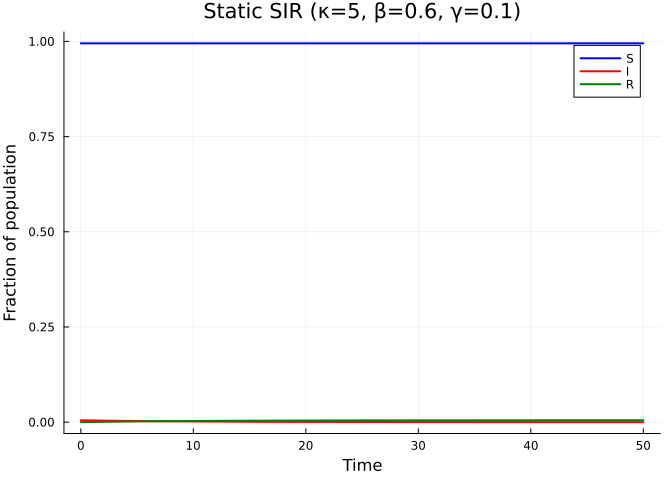
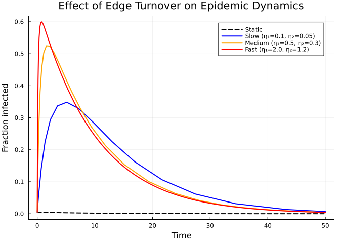
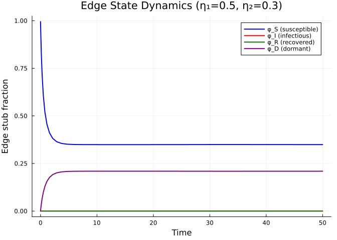

# Dynamic Networks
Simon Frost
2026-03-27

- [Introduction](#introduction)
- [Setup](#setup)
- [Static SIR Baseline](#static-sir-baseline)
- [Dynamic SIR Model](#dynamic-sir-model)
- [Effect of Edge Dynamics](#effect-of-edge-dynamics)
- [Inspecting Edge States](#inspecting-edge-states)
- [Dynamic SEIR](#dynamic-seir)

## Introduction

Real contact networks are not static — edges form and break over time as
individuals change partners, move between workplaces, or alter social
behaviour during an epidemic. The `DynamicConfigurationModel` in
EdgeBasedModels.jl extends the static EBCM by introducing **dormant edge
stubs** that capture this turnover.

In the dynamic model, active edges break at rate $\eta_2$ (becoming
dormant) and dormant edges form at rate $\eta_1$ (becoming active). This
yields an additional state variable $\varphi_D$ for dormant edges. The
key equations are:

$$\frac{d\theta}{dt} = -\underbrace{\beta \varphi_I}_{\text{transmission}} - \underbrace{\eta_2(\varphi_S + \varphi_I + \varphi_R)}_{\text{edge breaking}} + \underbrace{\eta_1 \varphi_D}_{\text{edge forming}}$$

$$\frac{d\varphi_D}{dt} = \eta_2(\varphi_S + \varphi_I + \varphi_R) - \eta_1 \varphi_D$$

When $\eta_1$ and $\eta_2$ are both zero, the model reduces to the
static EBCM. When edge turnover is fast, the network approaches
mean-field mixing. This framework can model partnership dynamics,
workplace contacts, or **serosorting** — where contact patterns change
based on disease status.

## Setup

``` julia
using EdgeBasedModels
using ModelingToolkit
using Symbolics
using OrdinaryDiffEq
using Plots
```

We define all symbolic parameters used throughout this vignette.

``` julia
@parameters β γ κ η₁ η₂ σ
pgf = poisson_pgf(κ)
```

    DegreePGF(z, exp((-1 + z)*κ))

We also define a helper function to extract population-level
trajectories from an ODE solution, given a Poisson PGF.

``` julia
function extract_SIR(sol, result, κ_val)
    ψ(x) = exp(κ_val * (x - 1))
    θ_vals = sol[result.variables[:θ]]
    S = ψ.(θ_vals)
    R = sol[result.variables[:R]]
    I = 1.0 .- S .- R
    return S, I, R
end
```

    extract_SIR (generic function with 1 method)

## Static SIR Baseline

Before introducing edge dynamics, we build a standard static SIR on a
Poisson network with mean degree $\kappa = 5$, transmission rate
$\beta = 0.6$, and recovery rate $\gamma = 0.1$.

``` julia
static_result = build_sir(pgf, β, γ; form=:expanded)
```

    EdgeModelSystem(Model sir_ebm:
    Equations (4):
      4 standard: see equations(sir_ebm)
    Unknowns (4): see unknowns(sir_ebm)
      R(t)
      phi_R(t)
      phi_I(t)
      θ(t)
    Parameters (3): see parameters(sir_ebm)
      κ
      β
      γ
    Observed (3): see observed(sir_ebm), Dict{Symbol, Any}(:R => R(t), :φ_I => phi_I(t), :φ_R => phi_R(t), :θ => θ(t)), Dict{Symbol, Any}(:I => I(t), :φ_S => phi_S(t), :S => S(t), :edge_hazard => phi_I(t)*β, :excess_hazard => phi_I(t)*β*κ))

``` julia
ic_static = default_initial_conditions(static_result)
p_static = Dict(β => 0.6, γ => 0.1, κ => 5.0)
tspan = (0.0, 50.0)
prob_static = ODEProblem(static_result.system, merge(ic_static, p_static), tspan)
sol_static = solve(prob_static, Tsit5())
```

    retcode: Success
    Interpolation: specialized 4th order "free" interpolation
    t: 12-element Vector{Float64}:
      0.0
      0.13201675546593844
      1.3075818200591436
      3.6996776301495866
      6.887959837063908
     10.986588149593288
     16.087104054988156
     22.306123493500458
     29.781190803169206
     38.71085239820593
     49.38003526806907
     50.0
    u: 12-element Vector{Vector{Float64}}:
     [0.0, 0.0, 0.0, 0.999]
     [6.541091463910264e-5, 0.0, 0.0, 0.999]
     [0.0006113207881628033, 0.0, 0.0, 0.999]
     [0.0015423578270798864, 0.0, 0.0, 0.999]
     [0.002482885489224155, 0.0, 0.0, 0.999]
     [0.0033250895015305404, 0.0, 0.0, 0.999]
     [0.003989285607154888, 0.0, 0.0, 0.999]
     [0.004451536987651915, 0.0, 0.0, 0.999]
     [0.004733691218979458, 0.0, 0.0, 0.999]
     [0.004883566887883839, 0.0, 0.0, 0.999]
     [0.004951718437546417, 0.0, 0.0, 0.999]
     [0.004953870653985607, 0.0, 0.0, 0.999]

``` julia
S_s, I_s, R_s = extract_SIR(sol_static, static_result, 5.0)
plot(sol_static.t, S_s, label="S", lw=2, color=:blue)
plot!(sol_static.t, I_s, label="I", lw=2, color=:red)
plot!(sol_static.t, R_s, label="R", lw=2, color=:green)
xlabel!("Time")
ylabel!("Fraction of population")
title!("Static SIR (κ=5, β=0.6, γ=0.1)")
```

<div id="fig-static-sir">



Figure 1: SIR epidemic on a static Poisson network with mean degree κ =
5.

</div>

## Dynamic SIR Model

Now we build an SIR model on a **dynamic network** where edges break at
rate $\eta_2 = 0.3$ and form at rate $\eta_1 = 0.5$. At equilibrium
(before the epidemic), the fraction of dormant edges would be
$\eta_2/\eta_1 = 0.6$. Since we start with all edges active
($\varphi_D(0) = 0$), the dormant population builds up as edges break.

``` julia
progression = DiseaseProgression(
    [DiseaseStage(:I; transmission_rate=β), DiseaseStage(:R)],
    [DiseaseTransition(:I, :R, γ)];
    entry=:I
)
dyn_model = DynamicConfigurationModel(pgf, progression, η₁, η₂)
dyn_result = build_edge_system(dyn_model)
```

    EdgeModelSystem(Model dynamic_ebm:
    Equations (5):
      5 standard: see equations(dynamic_ebm)
    Unknowns (5): see unknowns(dynamic_ebm)
      R(t)
      φ_R(t)
      φ_I(t)
      φ_D(t)
      ⋮
    Parameters (5): see parameters(dynamic_ebm)
      κ
      η₂
      β
      η₁
      ⋮
    Observed (3): see observed(dynamic_ebm), Dict{Symbol, Any}(:φ_D => φ_D(t), :R => R(t), :φ_I => φ_I(t), :φ_R => φ_R(t), :θ => θ(t)), Dict{Symbol, Any}(:I => I(t), :φ_S => φ_S(t), :S => S(t), :edge_hazard => φ_I(t)*β, :excess_hazard => φ_I(t)*β*κ))

The dynamic SIR model has 5 ODEs — the standard $\theta$, $\varphi_I$,
$\varphi_R$, $R$ plus the dormant edge state $\varphi_D$:

``` julia
eqs = ModelingToolkit.equations(dyn_result.system)
println("Number of ODEs: ", length(eqs))
for eq in eqs
    println(eq)
end
```

    Number of ODEs: 5
    Differential(t, 1)(R(t)) ~ (1 - exp((-1 + θ(t))*κ) - R(t))*γ
    Differential(t, 1)(φ_R(t)) ~ φ_I(t)*γ - φ_R(t)*η₂
    Differential(t, 1)(φ_I(t)) ~ -φ_I(t)*(β + γ + η₂) + φ_I(t)*φ_S(t)*β*κ
    Differential(t, 1)(φ_D(t)) ~ (φ_I(t) + φ_S(t) + φ_R(t))*η₂ - φ_D(t)*η₁
    Differential(t, 1)(θ(t)) ~ -φ_I(t)*β - (φ_I(t) + φ_S(t) + φ_R(t))*η₂ + φ_D(t)*η₁

We can also inspect the state variables and observables:

``` julia
println("State variables: ", keys(dyn_result.variables))
println("Observables: ", keys(dyn_result.observables))
```

    State variables: [:φ_D, :R, :φ_I, :φ_R, :θ]
    Observables: [:I, :φ_S, :S, :edge_hazard, :excess_hazard]

Now solve the dynamic model:

``` julia
ic_dyn = default_initial_conditions(dyn_result)
p_dyn = Dict(β => 0.6, γ => 0.1, κ => 5.0, η₁ => 0.5, η₂ => 0.3)
prob_dyn = ODEProblem(dyn_result.system, merge(ic_dyn, p_dyn), tspan)
sol_dyn = solve(prob_dyn, Tsit5())
```

    retcode: Success
    Interpolation: specialized 4th order "free" interpolation
    t: 28-element Vector{Float64}:
      0.0
      0.003346685349642247
      0.04444060183951506
      0.13618988970292162
      0.27706657174331034
      0.4933091703118275
      0.7719607945784808
      1.1346818536549335
      1.5930357500504793
      2.1644523209006454
      ⋮
     23.92606783649931
     28.17598470967762
     31.91292264335682
     35.303507856713914
     38.56249293726557
     41.832956673336646
     45.174868066106676
     48.59171838989552
     50.0
    u: 28-element Vector{Vector{Float64}}:
     [0.0, 0.0, 0.0, 0.0, 0.999]
     [2.497238933878743e-6, 0.0, 0.0, 0.0009956787927283043, 0.9980043212072717]
     [0.0001613802318808246, 0.0, 0.0, 0.012704087558585476, 0.9862959124414145]
     [0.001252588996562788, 0.0, 0.0, 0.03581036371474714, 0.9631896362852528]
     [0.004424706279088665, 0.0, 0.0, 0.06485722156769573, 0.9341427784323042]
     [0.011630673489064243, 0.0, 0.0, 0.09866543772757466, 0.9003345622724253]
     [0.02339801703409781, 0.0, 0.0, 0.12948237982117616, 0.8695176201788237]
     [0.04091290967461618, 0.0, 0.0, 0.15618669016057893, 0.8428133098394209]
     [0.06458885510069766, 0.0, 0.0, 0.17703123270495083, 0.8219687672950491]
     [0.0946465078306875, 0.0, 0.0, 0.19173656667917435, 0.8072634333208255]
     ⋮
     [0.587387929823767, 0.0, 0.0, 0.2094269625551149, 0.789573037444885]
     [0.6093982658206429, 0.0, 0.0, 0.20929969653833697, 0.789700303461663]
     [0.6223641597914386, 0.0, 0.0, 0.20918765900049652, 0.7898123409995035]
     [0.6305731674583838, 0.0, 0.0, 0.2092215857159971, 0.7897784142840029]
     [0.6362202960850933, 0.0, 0.0, 0.20929663789087963, 0.7897033621091203]
     [0.6403104164013086, 0.0, 0.0, 0.2093445847433252, 0.7896554152566747]
     [0.64331666622918, 0.0, 0.0, 0.20936546673990264, 0.7896345332600972]
     [0.6455115075927703, 0.0, 0.0, 0.20936958937253544, 0.7896304106274644]
     [0.6462052414318383, 0.0, 0.0, 0.20944592579399143, 0.7895540742060084]

``` julia
_, I_static, _ = extract_SIR(sol_static, static_result, 5.0)
_, I_dynamic, _ = extract_SIR(sol_dyn, dyn_result, 5.0)

plot(sol_static.t, I_static, label="Static", lw=2, linestyle=:dash, color=:grey)
plot!(sol_dyn.t, I_dynamic, label="Dynamic (η₁=0.5, η₂=0.3)", lw=2, color=:red)
xlabel!("Time")
ylabel!("Fraction infected")
title!("Static vs Dynamic Network")
```

<div id="fig-dynamic-comparison">


Figure 2: Comparison of the infected fraction I(t) on static versus
dynamic networks.

</div>

Edge dynamics alter the epidemic because edges breaking during an
epidemic can interrupt transmission chains, while new edges forming can
create new pathways for infection.

## Effect of Edge Dynamics

We now compare three scenarios to see how the rate of edge turnover
affects the epidemic:

1.  **Static network** — no edge dynamics ($\eta_1 = \eta_2 = 0$)
2.  **Slow turnover** — $\eta_1 = 0.1$, $\eta_2 = 0.05$
3.  **Fast turnover** — $\eta_1 = 2.0$, $\eta_2 = 1.2$

``` julia
# Slow edge dynamics
p_slow = Dict(β => 0.6, γ => 0.1, κ => 5.0, η₁ => 0.1, η₂ => 0.05)
prob_slow = ODEProblem(dyn_result.system, merge(ic_dyn, p_slow), tspan)
sol_slow = solve(prob_slow, Tsit5())

# Fast edge dynamics
p_fast = Dict(β => 0.6, γ => 0.1, κ => 5.0, η₁ => 2.0, η₂ => 1.2)
prob_fast = ODEProblem(dyn_result.system, merge(ic_dyn, p_fast), tspan)
sol_fast = solve(prob_fast, Tsit5())
```

    retcode: Success
    Interpolation: specialized 4th order "free" interpolation
    t: 71-element Vector{Float64}:
      0.0
      0.000836672432287364
      0.013028606287373833
      0.041376897777791535
      0.08353094310521621
      0.1443461297938675
      0.222710202539843
      0.32346871085425544
      0.4496709582851959
      0.605641086886264
      ⋮
     43.48723768727746
     44.34743301831281
     45.207628342792084
     46.067823654159184
     46.928018952414114
     47.78821417199602
     48.64840937846575
     49.50860463738417
     50.0
    u: 71-element Vector{Vector{Float64}}:
     [0.0, 0.0, 0.0, 0.0, 0.999]
     [6.243805269359667e-7, 0.0, 0.0, 0.000995680091355227, 0.9980043199086448]
     [5.402261958053962e-5, 0.0, 0.0, 0.014789820560637051, 0.984210179439363]
     [0.0004472813554802546, 0.0, 0.0, 0.04243242144600511, 0.9565675785539949]
     [0.0015384052425917556, 0.0, 0.0, 0.07486912744536665, 0.9241308725546333]
     [0.003799153872024858, 0.0, 0.0, 0.10921101658924659, 0.8897889834107534]
     [0.007423198787910748, 0.0, 0.0, 0.13957920814573274, 0.8594207918542672]
     [0.012732992383121464, 0.0, 0.0, 0.16469777417657597, 0.8343022258234241]
     [0.019909308486880602, 0.0, 0.0, 0.1834046605911373, 0.8155953394088628]
     [0.029132157709297245, 0.0, 0.0, 0.1959271152377086, 0.8030728847622914]
     ⋮
     [0.6423431513391442, 0.0, 0.0, 0.2093513758070742, 0.7896486241929257]
     [0.6430474568508828, 0.0, 0.0, 0.2093513757468145, 0.7896486242531854]
     [0.6436937108971544, 0.0, 0.0, 0.20935137569386444, 0.7896486243061355]
     [0.6442866982902662, 0.0, 0.0, 0.20935137565366027, 0.7896486243463396]
     [0.6448308094658087, 0.0, 0.0, 0.20935137562584802, 0.7896486243741518]
     [0.6453300729444194, 0.0, 0.0, 0.20935137566646508, 0.7896486243335348]
     [0.6457881852816878, 0.0, 0.0, 0.20935137571723136, 0.7896486242827685]
     [0.6462085383403903, 0.0, 0.0, 0.20935137572148427, 0.7896486242785156]
     [0.6464285943090579, 0.0, 0.0, 0.20945123842141797, 0.7895487615785819]

``` julia
_, I_static, _ = extract_SIR(sol_static, static_result, 5.0)
_, I_slow, _ = extract_SIR(sol_slow, dyn_result, 5.0)
_, I_fast, _ = extract_SIR(sol_fast, dyn_result, 5.0)

plot(sol_static.t, I_static, label="Static", lw=2, color=:black, linestyle=:dash)
plot!(sol_slow.t, I_slow, label="Slow (η₁=0.1, η₂=0.05)", lw=2, color=:blue)
plot!(sol_dyn.t, I_dynamic, label="Medium (η₁=0.5, η₂=0.3)", lw=2, color=:orange)
plot!(sol_fast.t, I_fast, label="Fast (η₁=2.0, η₂=1.2)", lw=2, color=:red)
xlabel!("Time")
ylabel!("Fraction infected")
title!("Effect of Edge Turnover on Epidemic Dynamics")
```

<div id="fig-edge-turnover">



Figure 3: Effect of edge turnover rate on the epidemic curve. Faster
edge dynamics alter the timing and magnitude of the peak.

</div>

The plot shows that edge dynamics modify both the peak and timing of the
epidemic. The ratio $\eta_2/\eta_1$ controls the equilibrium fraction of
dormant edges, while the absolute magnitudes of $\eta_1$ and $\eta_2$
control how quickly the network responds to population-level changes.

## Inspecting Edge States

The dynamic model tracks four types of edge stubs: susceptible
($\varphi_S$), infectious ($\varphi_I$), recovered ($\varphi_R$), and
dormant ($\varphi_D$). The susceptible fraction is computed
algebraically as $\varphi_S = \psi'(\theta)/\psi'(1)$, while the others
are ODE states.

``` julia
κ_val = 5.0
θ_vals = sol_dyn[dyn_result.variables[:θ]]
φ_S_vals = exp.(κ_val .* (θ_vals .- 1.0))
φ_I_vals = sol_dyn[dyn_result.variables[:φ_I]]
φ_R_vals = sol_dyn[dyn_result.variables[:φ_R]]
φ_D_vals = sol_dyn[dyn_result.variables[:φ_D]]

plot(sol_dyn.t, φ_S_vals, label="φ_S (susceptible)", lw=2, color=:blue)
plot!(sol_dyn.t, φ_I_vals, label="φ_I (infectious)", lw=2, color=:red)
plot!(sol_dyn.t, φ_R_vals, label="φ_R (recovered)", lw=2, color=:green)
plot!(sol_dyn.t, φ_D_vals, label="φ_D (dormant)", lw=2, color=:purple)
xlabel!("Time")
ylabel!("Edge stub fraction")
title!("Edge State Dynamics (η₁=0.5, η₂=0.3)")
```

<div id="fig-edge-states">



Figure 4: Edge-level state dynamics during the epidemic on a dynamic
network (η₁=0.5, η₂=0.3). The dormant edge fraction (φ_D) grows as
active edges break.

</div>

Initially, all edges are active and connected to susceptible neighbours
($\varphi_S \approx 1$). As the epidemic progresses, $\varphi_S$
decreases while $\varphi_I$ and $\varphi_R$ grow. The dormant edge
fraction $\varphi_D$ builds up from zero as active edges break,
eventually reaching an equilibrium determined by the ratio
$\eta_2/\eta_1$.

## Dynamic SEIR

The dynamic network framework also works with complex disease
progressions. Here we build a dynamic **SEIR** model, which adds an
exposed (latent) stage $E$ that is non-infectious.

``` julia
seir_progression = DiseaseProgression(
    [
        DiseaseStage(:E; transmission_rate=0),
        DiseaseStage(:I; transmission_rate=β),
        DiseaseStage(:R)
    ],
    [
        DiseaseTransition(:E, :I, σ),
        DiseaseTransition(:I, :R, γ)
    ];
    entry=:E
)
dyn_seir_model = DynamicConfigurationModel(pgf, seir_progression, η₁, η₂)
dyn_seir_result = build_edge_system(dyn_seir_model)
```

    EdgeModelSystem(Model dynamic_ebm:
    Equations (6):
      6 standard: see equations(dynamic_ebm)
    Unknowns (6): see unknowns(dynamic_ebm)
      R(t)
      φ_R(t)
      φ_I(t)
      φ_E(t)
      ⋮
    Parameters (6): see parameters(dynamic_ebm)
      κ
      η₂
      β
      η₁
      ⋮
    Observed (3): see observed(dynamic_ebm), Dict{Symbol, Any}(:φ_D => φ_D(t), :R => R(t), :φ_I => φ_I(t), :φ_R => φ_R(t), :θ => θ(t), :φ_E => φ_E(t)), Dict{Symbol, Any}(:I => I(t), :φ_S => φ_S(t), :S => S(t), :edge_hazard => φ_I(t)*β, :excess_hazard => φ_I(t)*β*κ))

The dynamic SEIR model has 6 ODEs — adding $\varphi_E$ to the dynamic
SIR’s set:

``` julia
seir_eqs = ModelingToolkit.equations(dyn_seir_result.system)
println("Number of ODEs: ", length(seir_eqs))
for eq in seir_eqs
    println(eq)
end
```

    Number of ODEs: 6
    Differential(t, 1)(R(t)) ~ (1 - exp((-1 + θ(t))*κ) - R(t))*γ
    Differential(t, 1)(φ_R(t)) ~ φ_I(t)*γ - φ_R(t)*η₂
    Differential(t, 1)(φ_I(t)) ~ -φ_I(t)*(β + γ + η₂) + φ_E(t)*σ
    Differential(t, 1)(φ_E(t)) ~ -φ_E(t)*(η₂ + σ) + φ_I(t)*φ_S(t)*β*κ
    Differential(t, 1)(φ_D(t)) ~ (φ_I(t) + φ_E(t) + φ_S(t) + φ_R(t))*η₂ - φ_D(t)*η₁
    Differential(t, 1)(θ(t)) ~ -φ_I(t)*β - (φ_I(t) + φ_E(t) + φ_S(t) + φ_R(t))*η₂ + φ_D(t)*η₁

``` julia
println("State variables: ", keys(dyn_seir_result.variables))
```

    State variables: [:φ_D, :R, :φ_I, :φ_R, :θ, :φ_E]

The dynamic framework is fully composable — any disease progression
supported by `EdgeBasedModels.jl` can be combined with edge formation
and breaking dynamics, simply by wrapping it in a
`DynamicConfigurationModel` instead of a `StaticConfigurationModel`.
