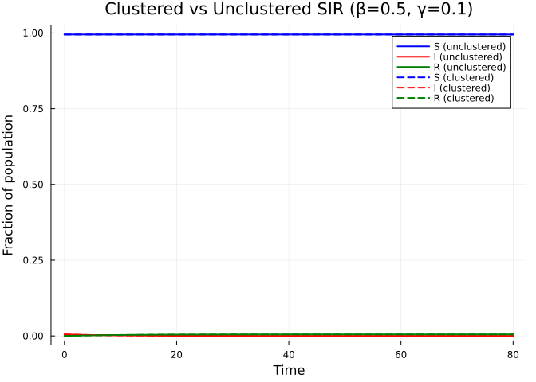
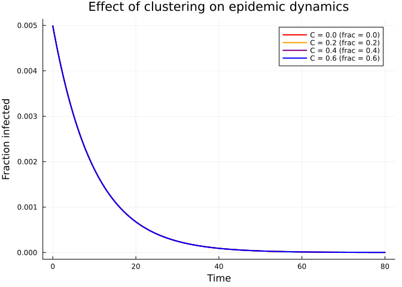
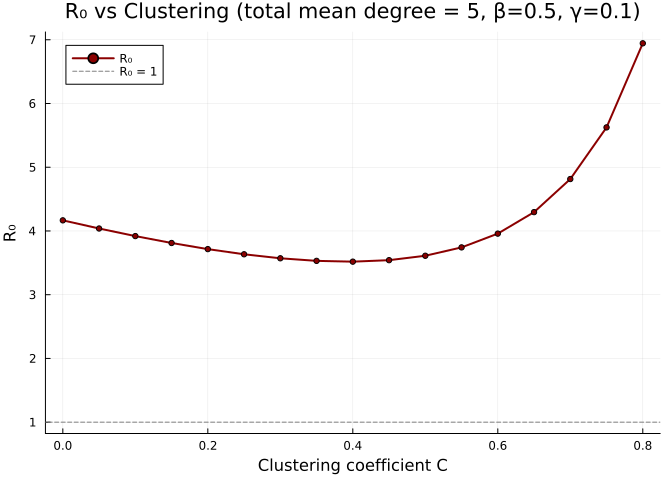
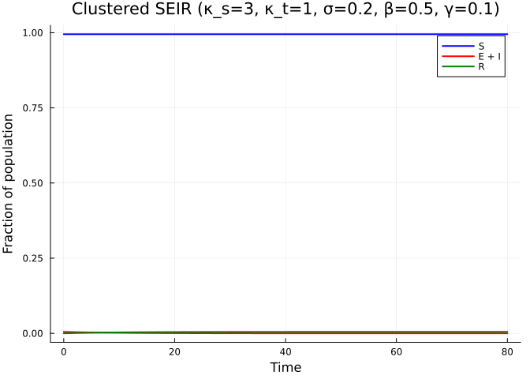

# Clustering and Triangle Motifs
Simon Frost
2026-03-30

- [Introduction](#introduction)
- [Setup](#setup)
- [Clustered networks](#clustered-networks)
- [Building a clustered SIR model](#building-a-clustered-sir-model)
- [Comparing clustered vs unclustered
  epidemics](#comparing-clustered-vs-unclustered-epidemics)
- [Varying the clustering
  coefficient](#varying-the-clustering-coefficient)
- [Clustering coefficient and $R_0$](#clustering-coefficient-and-r_0)
- [SEIR with clustering](#seir-with-clustering)
- [Summary](#summary)

## Introduction

Real contact networks exhibit **clustering** — the tendency for two
people who share a mutual contact to also be connected to each other,
forming triangles. This property, also called triadic closure, is
ubiquitous in social networks but absent from the standard configuration
model in the large-$N$ limit.

Clustering has important epidemiological consequences. When transmission
can travel around a triangle, one of the three edges is “redundant”: if
$A$ infects $B$ and $B$ infects $C$, the edge from $A$ to $C$ cannot
cause a *new* infection. This correlation means that clustering
**reduces** epidemic severity compared to a tree-like network with the
same degree distribution.

The edge-based compartmental model framework handles clustering by
introducing a **bivariate probability generating function** $g(x, y)$
where $x$ tracks single-edge stubs and $y$ tracks triangle-edge stubs.
This approach follows Volz (2011) and Miller (2009).

In this vignette we show how to:

1.  Build clustered network models using `ClusteredPGF`
2.  Compare clustered and unclustered epidemics
3.  Explore how increasing clustering reduces $R_0$ and epidemic
    severity

## Setup

``` julia
using EdgeBasedModels
using ModelingToolkit
using OrdinaryDiffEq
using Symbolics
using Plots
```

## Clustered networks

In a clustered network each node has two types of half-edges:

- **Single-edge stubs** ($s$): connect to a random partner (tree-like)
- **Triangle-edge stubs** ($t$): connect in groups of three to form
  triangles

The joint degree distribution is encoded by a bivariate PGF:

$$g(x, y) = \sum_{s,t} p_{s,t}\, x^s\, y^t$$

where $p_{s,t}$ is the probability that a node has $s$ single-edge stubs
and $t$ triangle-edge stubs. The mean single degree is
$\langle s \rangle = g_x(1,1)$ and the mean triangle degree is
$\langle t \rangle = g_y(1,1)$.

The **clustering coefficient** measures the fraction of connected
triples that are closed into triangles:

$$C = \frac{2\langle t \rangle}{2\langle t \rangle + \langle s \rangle}$$

For a Poisson clustered network with mean single-edge degree $\kappa_s$
and mean triangle-edge degree $\kappa_t$:

$$g(x, y) = e^{\kappa_s(x - 1) + \kappa_t(y - 1)}$$

``` julia
κ_s = 3.0
κ_t = 1.0
cpgf = clustered_poisson_pgf(κ_s, κ_t)
println("Mean single-edge degree: ", mean_single_degree(cpgf))
println("Mean triangle-edge degree: ", mean_triangle_degree(cpgf))
println("Clustering coefficient: ", clustering_coefficient(cpgf))
```

    Mean single-edge degree: 3.0exp(0.0)
    Mean triangle-edge degree: exp(0.0)
    Clustering coefficient: 0.4

Each triangle-edge stub participates in one triangle with two partners,
so the total mean degree (number of distinct neighbours) is
$\langle s \rangle + 2\langle t \rangle$.

## Building a clustered SIR model

The key insight of the clustered EBCM is that we need **two** survival
probabilities:

- $\theta_2(t)$: probability a single-edge partner has not transmitted
  infection
- $\theta_3(t)$: probability a triangle-edge partner has not transmitted
  infection

The susceptible fraction is then $S(t) = g(\theta_2, \theta_3^2)$, where
the square on $\theta_3$ accounts for the two triangle partners per
triangle stub.

Let us build both an unclustered and a clustered SIR model with
comparable mean degrees.

``` julia
@parameters β γ

# Unclustered: all edges are single-stubs, mean degree 5
pgf_unclustered = poisson_pgf(5.0)
model_unclustered = build_sir(pgf_unclustered, β, γ; form = :expanded)

# Clustered: κ_s=3, κ_t=1 → total mean degree = 3 + 2(1) = 5
cpgf = clustered_poisson_pgf(3.0, 1.0)
model_clustered = build_clustered_sir(cpgf, β, γ)
```

    EdgeModelSystem(Model clustered_sir:
    Equations (7):
      7 standard: see equations(clustered_sir)
    Unknowns (7): see unknowns(clustered_sir)
      R(t)
      φ3_R(t)
      φ3_I(t)
      φ2_R(t)
      ⋮
    Parameters (2): see parameters(clustered_sir)
      β
      γ
    Observed (4): see observed(clustered_sir), Dict{Symbol, Any}(:θ₃ => θ₃(t), :R => R(t), :φ3_I => φ3_I(t), :φ2_I => φ2_I(t), :φ3_R => φ3_R(t), :φ2_R => φ2_R(t), :θ₂ => θ₂(t)), Dict{Symbol, Any}(:I => I(t), :φ2_S => φ2_S(t), :edge_hazard3 => φ3_I(t)*β, :edge_hazard2 => φ2_I(t)*β, :S => S(t), :φ3_S => φ3_S(t)))

The clustered model tracks more state variables due to the separate
single-edge and triangle-edge dynamics:

``` julia
println("Unclustered variables: ", keys(model_unclustered.variables))
println("Clustered variables:   ", keys(model_clustered.variables))
```

    Unclustered variables: [:R, :φ_I, :φ_R, :θ]
    Clustered variables:   [:θ₃, :R, :φ3_I, :φ2_I, :φ3_R, :φ2_R, :θ₂]

## Comparing clustered vs unclustered epidemics

We now solve both models with $\beta = 0.5$ and $\gamma = 0.1$, and
compare the epidemic curves.

``` julia
tspan = (0.0, 80.0)
params = Dict(β => 0.5, γ => 0.1)

# Unclustered
ic1 = merge(default_initial_conditions(model_unclustered), params)
prob1 = ODEProblem(model_unclustered.system, ic1, tspan)
sol1 = solve(prob1, Tsit5(); saveat = 0.5)

# Clustered
ic2 = merge(default_initial_conditions(model_clustered), params)
prob2 = ODEProblem(model_clustered.system, ic2, tspan)
sol2 = solve(prob2, Tsit5(); saveat = 0.5)
```

    retcode: Success
    Interpolation: 1st order linear
    t: 161-element Vector{Float64}:
      0.0
      0.5
      1.0
      1.5
      2.0
      2.5
      3.0
      3.5
      4.0
      4.5
      ⋮
     76.0
     76.5
     77.0
     77.5
     78.0
     78.5
     79.0
     79.5
     80.0
    u: 161-element Vector{Vector{Float64}}:
     [0.0, 0.0, 0.0, 0.0, 0.0, 0.999, 0.999]
     [0.0002431957560684242, 0.0, 0.0, 0.0, 0.0, 0.999, 0.999]
     [0.0004745306730125682, 0.0, 0.0, 0.0, 0.0, 0.999, 0.999]
     [0.0006945833236978189, 0.0, 0.0, 0.0, 0.0, 0.999, 0.999]
     [0.0009039045332629401, 0.0, 0.0, 0.0, 0.0, 0.999, 0.999]
     [0.0011030165387228002, 0.0, 0.0, 0.0, 0.0, 0.999, 0.999]
     [0.00129241706385169, 0.0, 0.0, 0.0, 0.0, 0.999, 0.999]
     [0.0014725804157114946, 0.0, 0.0, 0.0, 0.0, 0.999, 0.999]
     [0.0016439575443004536, 0.0, 0.0, 0.0, 0.0, 0.999, 0.999]
     [0.001806978287275114, 0.0, 0.0, 0.0, 0.0, 0.999, 0.999]
     ⋮
     [0.004984008157522823, 0.0, 0.0, 0.0, 0.0, 0.999, 0.999]
     [0.004984128806400702, 0.0, 0.0, 0.0, 0.0, 0.999, 0.999]
     [0.0049842434089595235, 0.0, 0.0, 0.0, 0.0, 0.999, 0.999]
     [0.004984352369595421, 0.0, 0.0, 0.0, 0.0, 0.999, 0.999]
     [0.004984456088802677, 0.0, 0.0, 0.0, 0.0, 0.999, 0.999]
     [0.004984554963173728, 0.0, 0.0, 0.0, 0.0, 0.999, 0.999]
     [0.0049846493853991595, 0.0, 0.0, 0.0, 0.0, 0.999, 0.999]
     [0.004984739744267712, 0.0, 0.0, 0.0, 0.0, 0.999, 0.999]
     [0.004984826424666275, 0.0, 0.0, 0.0, 0.0, 0.999, 0.999]

Extract the epidemic compartments using the PGFs:

``` julia
# Unclustered: S = ψ(θ)
ψ(x) = exp(5.0 * (x - 1))
θ_idx1 = findfirst(v -> startswith(string(v), "θ"),
                   string.(ModelingToolkit.unknowns(model_unclustered.system)))
R_idx1 = findfirst(v -> startswith(string(v), "R"),
                   string.(ModelingToolkit.unknowns(model_unclustered.system)))
S1 = ψ.(sol1[θ_idx1, :])
R1 = sol1[R_idx1, :]
I1 = 1.0 .- S1 .- R1

# Clustered: S = g(θ₂, θ₃²)
g_clust(θ2, θ3) = exp(3.0 * (θ2 - 1) + 1.0 * (θ3^2 - 1))
vars2 = string.(ModelingToolkit.unknowns(model_clustered.system))
θ2_idx = findfirst(v -> startswith(v, "θ₂"), vars2)
θ3_idx = findfirst(v -> startswith(v, "θ₃"), vars2)
R_idx2 = findfirst(v -> startswith(v, "R"), vars2)
S2 = g_clust.(sol2[θ2_idx, :], sol2[θ3_idx, :])
R2 = sol2[R_idx2, :]
I2 = 1.0 .- S2 .- R2
```

    161-element Vector{Float64}:
     0.004986525794341001
     0.004743330038272577
     0.004511995121328433
     0.004291942470643182
     0.004082621261078061
     0.0038835092556182014
     0.003694108730489311
     0.0035139453786295067
     0.003342568250040548
     0.003179547507065887
     ⋮
     2.5176368181785425e-6
     2.3969879402990085e-6
     2.28238538147775e-6
     2.1734247455801325e-6
     2.0697055383243207e-6
     1.970831167273472e-6
     1.876408941841809e-6
     1.7860500732894136e-6
     1.6993696747265655e-6

``` julia
plot(sol1.t, S1, label = "S (unclustered)", linewidth = 2, color = :blue)
plot!(sol1.t, I1, label = "I (unclustered)", linewidth = 2, color = :red)
plot!(sol1.t, R1, label = "R (unclustered)", linewidth = 2, color = :green)
plot!(sol2.t, S2, label = "S (clustered)", linewidth = 2, color = :blue, linestyle = :dash)
plot!(sol2.t, I2, label = "I (clustered)", linewidth = 2, color = :red, linestyle = :dash)
plot!(sol2.t, R2, label = "R (clustered)", linewidth = 2, color = :green, linestyle = :dash)
xlabel!("Time")
ylabel!("Fraction of population")
title!("Clustered vs Unclustered SIR (β=0.5, γ=0.1)")
```

<div id="fig-clustered-vs-unclustered">



Figure 1: Clustering reduces peak prevalence and delays the epidemic
peak. Both networks have mean degree 5.

</div>

The dashed (clustered) epidemic has a lower peak prevalence and a
delayed peak compared to the solid (unclustered) curves. The final
epidemic size is also smaller with clustering.

## Varying the clustering coefficient

We fix the total mean degree at 5 and vary the fraction of edges that
come from triangles. As clustering increases, more edges are “wasted” on
redundant triangle paths.

``` julia
fracs = [0.0, 0.2, 0.4, 0.6]
results = []

for frac in fracs
    κ_s_i = 5.0 * (1 - frac)
    κ_t_i = 5.0 * frac / 2  # each triangle stub contributes 2 neighbours
    cpgf_i = clustered_poisson_pgf(κ_s_i, κ_t_i)
    model_i = build_clustered_sir(cpgf_i, β, γ)
    ic_i = merge(default_initial_conditions(model_i), params)
    prob_i = ODEProblem(model_i.system, ic_i, tspan)
    sol_i = solve(prob_i, Tsit5(); saveat = 0.5)

    vars_i = string.(ModelingToolkit.unknowns(model_i.system))
    θ2_i = findfirst(v -> startswith(v, "θ₂"), vars_i)
    θ3_i = findfirst(v -> startswith(v, "θ₃"), vars_i)
    R_i = findfirst(v -> startswith(v, "R"), vars_i)

    g_i(θ2, θ3) = exp(κ_s_i * (θ2 - 1) + κ_t_i * (θ3^2 - 1))
    S_i = g_i.(sol_i[θ2_i, :], sol_i[θ3_i, :])
    R_i_vals = sol_i[R_i, :]
    I_i = 1.0 .- S_i .- R_i_vals
    C_i = 2κ_t_i / (2κ_t_i + κ_s_i)

    push!(results, (frac = frac, C = C_i, t = sol_i.t, I = I_i, S = S_i, R = R_i_vals))
end
```

``` julia
p = plot(xlabel = "Time", ylabel = "Fraction infected",
         title = "Effect of clustering on epidemic dynamics")
colors = [:red, :orange, :purple, :blue]
for (i, res) in enumerate(results)
    plot!(p, res.t, res.I,
          label = "C = $(round(res.C; digits=2)) (frac = $(res.frac))",
          linewidth = 2, color = colors[i])
end
p
```

<div id="fig-varying-clustering">



Figure 2: Increasing the fraction of triangle edges reduces epidemic
severity while keeping total mean degree = 5.

</div>

As the clustering coefficient $C$ increases, the peak prevalence
decreases and the epidemic is delayed.

## Clustering coefficient and $R_0$

The basic reproduction number $R_0$ for a clustered network accounts for
the redundant transmission paths within triangles. We can compute it
using `basic_reproduction_number`:

``` julia
using EdgeBasedModels: ClusteredConfigurationModel, DiseaseProgression, DiseaseStage, DiseaseTransition

fracs_fine = 0.0:0.05:0.8
C_vals = Float64[]
R0_vals = Float64[]

for frac in fracs_fine
    κ_s_i = 5.0 * (1 - frac)
    κ_t_i = 5.0 * frac / 2
    cpgf_i = clustered_poisson_pgf(κ_s_i, κ_t_i)
    C_i = 2κ_t_i / (2κ_t_i + κ_s_i)
    push!(C_vals, C_i)

    prog = DiseaseProgression(
        [DiseaseStage(:I; transmission_rate = 0.5),
         DiseaseStage(:R; transmission_rate = 0)],
        [DiseaseTransition(:I, :R, 0.1)]; entry = :I)
    cm = ClusteredConfigurationModel(cpgf_i, prog)
    R0_i = basic_reproduction_number(cm)
    push!(R0_vals, Float64(Symbolics.value(R0_i)))
end
```

``` julia
plot(C_vals, R0_vals, linewidth = 2, color = :darkred, marker = :circle, markersize = 3,
     label = "R₀")
xlabel!("Clustering coefficient C")
ylabel!("R₀")
title!("R₀ vs Clustering (total mean degree = 5, β=0.5, γ=0.1)")
hline!([1.0], linestyle = :dash, color = :gray, label = "R₀ = 1")
```

<div id="fig-clustering-r0">



Figure 3: R₀ decreases as the clustering coefficient increases,
reflecting the redundancy of triangle edges.

</div>

As the clustering coefficient rises from 0 toward 1, $R_0$ decreases.
This quantifies the protective effect of clustering: triangles create
correlated transmission paths that reduce the effective number of
secondary infections.

## SEIR with clustering

The clustered EBCM framework extends to arbitrary disease progressions.
Here we add a latent (exposed) period using `build_clustered_seir`:

``` julia
@parameters σ

cpgf_seir = clustered_poisson_pgf(3.0, 1.0)
model_seir = build_clustered_seir(cpgf_seir, σ, β, γ)
println("SEIR clustered variables: ", keys(model_seir.variables))
```

    SEIR clustered variables: [:θ₃, :R, :φ2_E, :φ2_I, :φ3_I, :φ3_R, :φ3_E, :φ2_R, :θ₂]

``` julia
params_seir = Dict(β => 0.5, γ => 0.1, σ => 0.2)
ic_seir = merge(default_initial_conditions(model_seir), params_seir)
prob_seir = ODEProblem(model_seir.system, ic_seir, tspan)
sol_seir = solve(prob_seir, Tsit5(); saveat = 0.5)

vars_seir = string.(ModelingToolkit.unknowns(model_seir.system))
θ2_seir = findfirst(v -> startswith(v, "θ₂"), vars_seir)
θ3_seir = findfirst(v -> startswith(v, "θ₃"), vars_seir)
R_seir = findfirst(v -> startswith(v, "R"), vars_seir)

g_seir(θ2, θ3) = exp(3.0 * (θ2 - 1) + 1.0 * (θ3^2 - 1))
S_seir = g_seir.(sol_seir[θ2_seir, :], sol_seir[θ3_seir, :])
R_seir_vals = sol_seir[R_seir, :]
I_seir = 1.0 .- S_seir .- R_seir_vals
```

    161-element Vector{Float64}:
     0.004986525794341001
     0.004743330035562729
     0.004511995119063036
     0.004291942496184397
     0.004082621223812449
     0.0038835090851018763
     0.0036941085498487683
     0.003513945319605133
     0.0033425683276788873
     0.003179547837786834
     ⋮
     2.532387244169425e-6
     2.4093739113108595e-6
     2.292451321591303e-6
     2.1812850676235576e-6
     2.07555045214549e-6
     1.9749324880269717e-6
     1.8791258982655407e-6
     1.7878351159864025e-6
     1.7007742844450321e-6

``` julia
plot(sol_seir.t, S_seir, label = "S", linewidth = 2, color = :blue)
plot!(sol_seir.t, I_seir, label = "E + I", linewidth = 2, color = :red)
plot!(sol_seir.t, R_seir_vals, label = "R", linewidth = 2, color = :green)
xlabel!("Time")
ylabel!("Fraction of population")
title!("Clustered SEIR (κ_s=3, κ_t=1, σ=0.2, β=0.5, γ=0.1)")
```

<div id="fig-seir-clustered">



Figure 4: SEIR epidemic on a clustered network with a latent period
(σ=0.2).

</div>

The latent period further delays and flattens the epidemic curve on top
of the clustering effect.

## Summary

- **Clustering** (triadic closure) is a key structural property of real
  contact networks that is absent from the standard configuration model.
- Triangles create **redundant transmission paths**: if two of three
  triangle edges transmit, the third cannot cause a new infection.
- The clustered EBCM uses a **bivariate PGF** $g(x, y)$ and tracks
  separate survival probabilities for single-edge ($\theta_2$) and
  triangle-edge ($\theta_3$) partners.
- Increasing clustering **reduces $R_0$** and lowers epidemic peak
  prevalence while keeping the mean degree fixed.
- The `EdgeBasedModels.jl` package provides `clustered_poisson_pgf`,
  `build_clustered_sir`, and `build_clustered_seir` for modelling
  clustered networks with arbitrary disease progressions.
