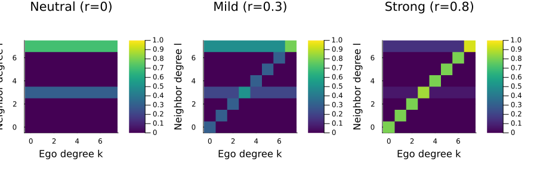
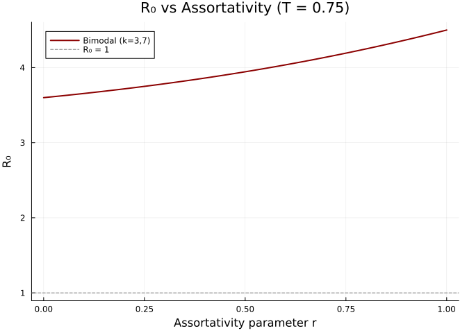
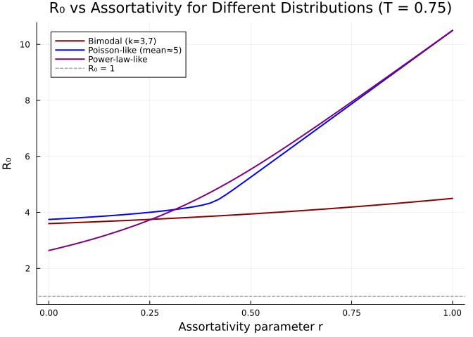
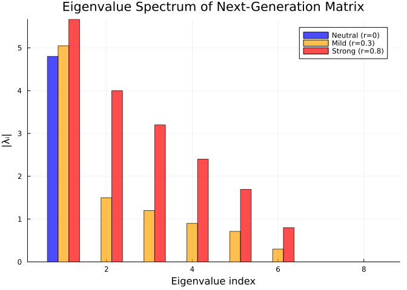
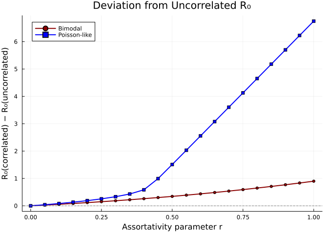
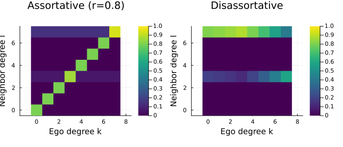

# Degree Correlation and Assortative Mixing
Simon Frost
2026-03-30

- [Introduction](#introduction)
- [Setup](#setup)
- [Mixing Matrices](#mixing-matrices)
- [Building Correlated Networks](#building-correlated-networks)
  - [Visualising mixing matrices](#visualising-mixing-matrices)
- [R₀ and Assortativity](#r₀-and-assortativity)
  - [Comparing degree distributions](#comparing-degree-distributions)
- [Spectral Analysis](#spectral-analysis)
- [Comparison with Uncorrelated
  Model](#comparison-with-uncorrelated-model)
  - [Divergence with assortativity](#divergence-with-assortativity)
- [Custom Mixing Matrices](#custom-mixing-matrices)
- [Summary](#summary)

## Introduction

In the standard configuration model, the degree of a node’s neighbor is
independent of its own degree — the network is **neutral**
(uncorrelated). Real networks, however, exhibit degree correlations:

- **Assortative** mixing: high-degree nodes preferentially connect to
  other high-degree nodes (common in social networks).
- **Disassortative** mixing: high-degree nodes preferentially connect to
  low-degree nodes (common in biological and technological networks).

These correlations profoundly affect epidemic dynamics. Assortative
mixing tends to confine epidemics within degree classes, while
disassortative mixing facilitates cross-class transmission.

The key quantity is the **mixing matrix** $Q(l|k)$: the probability that
a neighbor of a degree-$k$ node has degree $l$. The `CorrelatedPGF` type
in EdgeBasedModels.jl captures this structure and enables computation of
$R_0$ via the spectral radius of the next-generation matrix.

**References:** Newman (2002) *Phys. Rev. Lett.* 89, 208701; Wang et
al. (2019) *J. Math. Biol.* 78, 1923–1951.

## Setup

``` julia
using EdgeBasedModels
using LinearAlgebra
using Plots
```

## Mixing Matrices

The conditional probability $Q(l|k)$ defines the degree correlation
structure. For a network with maximum degree $K$ and degree distribution
$\{p_k\}$:

- **Neutral mixing:** $Q(l|k) = \frac{l\, p_l}{\langle k \rangle}$,
  independent of $k$. A degree-$l$ neighbor is chosen proportional to
  $l\, p_l$ (excess degree distribution).
- **Assortative mixing (Newman):**
  $Q_r(l|k) = r\,\delta_{k,l} + (1-r)\,Q_{\text{neutral}}(l|k)$ where
  $r \in [0,1]$.
  - $r = 0$: neutral (uncorrelated)
  - $r = 1$: perfectly assortative (every neighbor has the same degree
    as the ego node)

The next-generation matrix for disease spread on a degree-correlated
network is:

$$C_{k,l} = (k - 1)\, Q(l|k)$$

and $R_0 = T \cdot \rho(C)$, where $T$ is the transmissibility and
$\rho$ denotes the spectral radius.

## Building Correlated Networks

We use a **bimodal** degree distribution — 50% degree-3 and 50% degree-7
— to make the degree correlation structure clearly visible.

``` julia
# Degree distribution: p_k for k = 0, 1, ..., 7
probs = zeros(8)
probs[4] = 0.5   # k = 3 (index = k+1)
probs[8] = 0.5   # k = 7

# Verify
mean_k = sum((k - 1) * probs[k] for k in eachindex(probs))
var_k = sum((k - 1)^2 * probs[k] for k in eachindex(probs)) - mean_k^2
println("Mean degree: ", mean_k)
println("Variance:    ", var_k)
```

    Mean degree: 5.0
    Variance:    4.0

Now construct neutral, mildly assortative, and strongly assortative
networks:

``` julia
neutral = neutral_correlated_pgf(probs)
mild    = assortative_correlated_pgf(probs, 0.3)
strong  = assortative_correlated_pgf(probs, 0.8)
```

    CorrelatedPGF(DegreePGF(z, 0.5(z^3 + z^7)), 7, [0.0, 0.0, 0.0, 0.5, 0.0, 0.0, 0.0, 0.5], [0.8 0.0 … 0.0 0.13999999999999996; 0.0 0.8 … 0.0 0.13999999999999996; … ; 0.0 0.0 … 0.8 0.13999999999999996; 0.0 0.0 … 0.0 0.9400000000000001])

### Visualising mixing matrices

Each row of the mixing matrix $Q$ gives the neighbor-degree distribution
for nodes of a given degree. For the bimodal distribution, only rows and
columns for $k=3$ and $k=7$ carry weight.

``` julia
degrees = 0:7
p1 = heatmap(degrees, degrees, neutral.mixing_matrix',
             xlabel = "Ego degree k", ylabel = "Neighbor degree l",
             title = "Neutral (r=0)", clims = (0, 1), color = :viridis, aspect_ratio = 1)
p2 = heatmap(degrees, degrees, mild.mixing_matrix',
             xlabel = "Ego degree k", ylabel = "Neighbor degree l",
             title = "Mild (r=0.3)", clims = (0, 1), color = :viridis, aspect_ratio = 1)
p3 = heatmap(degrees, degrees, strong.mixing_matrix',
             xlabel = "Ego degree k", ylabel = "Neighbor degree l",
             title = "Strong (r=0.8)", clims = (0, 1), color = :viridis, aspect_ratio = 1)
plot(p1, p2, p3, layout = (1, 3), size = (900, 300))
```

<div id="fig-mixing-matrices">



Figure 1: Mixing matrices Q(l\|k) for neutral (r=0), mild (r=0.3), and
strong (r=0.8) assortativity. Only degrees 3 and 7 are present.

</div>

In the neutral case, the neighbor-degree distribution is the same
regardless of ego degree. As $r$ increases, mass concentrates on the
diagonal — degree-3 nodes increasingly connect to degree-3 nodes and
degree-7 nodes to degree-7 nodes.

## R₀ and Assortativity

How does assortativity affect $R_0$? We sweep $r$ from 0 to 1 for a
fixed transmissibility $T = 0.75$ ($\beta = 0.3$, $\gamma = 0.1$).

``` julia
T = 0.75
r_vals = 0.0:0.02:1.0
R0_bimodal = [correlated_R0(assortative_correlated_pgf(probs, r), T) for r in r_vals]
```

    51-element Vector{Float64}:
     3.599999999999999
     3.610610198112615
     3.621444106815887
     3.6325067452299065
     3.6438031925820478
     3.655338583677548
     3.667118103903502
     3.6791469837509574
     3.691430492841646
     3.703973933448026
     ⋮
     4.296241915818795
     4.320362858982983
     4.344870712990218
     4.369765082152217
     4.395045270942502
     4.420710286693302
     4.446758843425922
     4.473189366780302
     4.5

``` julia
plot(r_vals, R0_bimodal, linewidth = 2, color = :darkred, label = "Bimodal (k=3,7)",
     xlabel = "Assortativity parameter r", ylabel = "R₀",
     title = "R₀ vs Assortativity (T = $T)")
hline!([1.0], linestyle = :dash, color = :gray, label = "R₀ = 1")
```

<div id="fig-r0-vs-r">



Figure 2: R₀ as a function of assortativity parameter r for a bimodal
degree distribution. Assortativity reduces R₀.

</div>

For the bimodal distribution, increasing assortativity **decreases**
$R_0$. Intuitively, assortative mixing isolates the high-degree nodes
into a cluster that saturates quickly, reducing their ability to seed
the epidemic into the broader network.

### Comparing degree distributions

The effect of assortativity depends on the shape of the degree
distribution. We compare three distributions with similar mean degrees:

``` julia
# Poisson-like (truncated at k=15) with mean ≈ 5
poisson_probs = zeros(16)
for k in 0:15
    poisson_probs[k + 1] = exp(-5.0) * 5.0^k / factorial(k)
end
poisson_probs ./= sum(poisson_probs)

# Power-law-like (truncated): p_k ∝ k^(-2) for k = 1..15
pl_probs = zeros(16)
for k in 1:15
    pl_probs[k + 1] = k^(-2.0)
end
pl_probs ./= sum(pl_probs)

println("Poisson-like mean: ", round(sum((k - 1) * poisson_probs[k] for k in eachindex(poisson_probs)); digits = 2))
println("Power-law-like mean: ", round(sum((k - 1) * pl_probs[k] for k in eachindex(pl_probs)); digits = 2))
```

    Poisson-like mean: 5.0
    Power-law-like mean: 2.1

``` julia
R0_poisson = [correlated_R0(assortative_correlated_pgf(poisson_probs, r), T) for r in r_vals]
R0_pl = [correlated_R0(assortative_correlated_pgf(pl_probs, r), T) for r in r_vals]
```

    51-element Vector{Float64}:
      2.640362757650594
      2.708689352348886
      2.7797268170247955
      2.8536217704533557
      2.930528246790755
      3.0106076766308525
      3.09402873842283
      3.180967041511214
      3.271604592810858
      3.3661289879000647
      ⋮
      8.860027066869815
      9.064129459101377
      9.268550191887073
      9.473252006413386
      9.678202940233419
      9.883375470169886
     10.088745805968028
     10.294293307086896
     10.5

``` julia
plot(r_vals, R0_bimodal, linewidth = 2, label = "Bimodal (k=3,7)", color = :darkred,
     xlabel = "Assortativity parameter r", ylabel = "R₀",
     title = "R₀ vs Assortativity for Different Distributions (T = $T)")
plot!(r_vals, R0_poisson, linewidth = 2, label = "Poisson-like (mean≈5)", color = :blue)
plot!(r_vals, R0_pl, linewidth = 2, label = "Power-law-like", color = :purple)
hline!([1.0], linestyle = :dash, color = :gray, label = "R₀ = 1")
```

<div id="fig-r0-distributions">



Figure 3: R₀ vs assortativity for different degree distributions. The
effect depends on the shape of the distribution.

</div>

## Spectral Analysis

$R_0$ is determined by the spectral radius of the next-generation matrix
$C_{k,l} = (k-1)\, Q(l|k)$. Examining the eigenvalue spectrum reveals
how assortativity reshapes transmission pathways.

``` julia
function next_gen_matrix(cpgf::CorrelatedPGF)
    K = cpgf.max_degree
    C = zeros(K + 1, K + 1)
    for k in 0:K, l in 0:K
        C[k + 1, l + 1] = max(k - 1, 0) * cpgf.mixing_matrix[k + 1, l + 1]
    end
    return C
end

C_neutral = next_gen_matrix(neutral)
C_mild    = next_gen_matrix(mild)
C_strong  = next_gen_matrix(strong)

eig_neutral = sort(abs.(eigvals(C_neutral)); rev = true)
eig_mild    = sort(abs.(eigvals(C_mild)); rev = true)
eig_strong  = sort(abs.(eigvals(C_strong)); rev = true)
```

    8-element Vector{Float64}:
     5.665547783358538
     4.0
     3.2
     2.4000000000000004
     1.6944522166414628
     0.8
     0.0
     0.0

``` julia
bar_width = 0.25
n = length(eig_neutral)
xs = 1:n
bar(xs .- bar_width, eig_neutral, bar_width = bar_width, label = "Neutral (r=0)", color = :blue, alpha = 0.7)
bar!(xs, eig_mild, bar_width = bar_width, label = "Mild (r=0.3)", color = :orange, alpha = 0.7)
bar!(xs .+ bar_width, eig_strong, bar_width = bar_width, label = "Strong (r=0.8)", color = :red, alpha = 0.7)
xlabel!("Eigenvalue index")
ylabel!("|λᵢ|")
title!("Eigenvalue Spectrum of Next-Generation Matrix")
```

<div id="fig-eigenvalues">



Figure 4: Eigenvalue spectrum of the next-generation matrix for
different levels of assortativity.

</div>

The leading eigenvalue (spectral radius) decreases with assortativity.
For the bimodal distribution, assortative mixing splits the single
dominant eigenvalue into two smaller ones corresponding to within-class
transmission for each degree class.

``` julia
println("Spectral radius (neutral): ", round(eig_neutral[1]; digits = 4))
println("Spectral radius (mild):    ", round(eig_mild[1]; digits = 4))
println("Spectral radius (strong):  ", round(eig_strong[1]; digits = 4))
```

    Spectral radius (neutral): 4.8
    Spectral radius (mild):    5.0467
    Spectral radius (strong):  5.6655

## Comparison with Uncorrelated Model

For neutral mixing, the correlated model should recover the standard
(uncorrelated) $R_0$:

$$R_0 = T \cdot \frac{\langle k^2 \rangle - \langle k \rangle}{\langle k \rangle}$$

Let us verify this numerically.

``` julia
# Standard uncorrelated R₀ from moments
function uncorrelated_R0(degree_probs, T)
    mean_k = sum((k - 1) * degree_probs[k] for k in eachindex(degree_probs))
    mean_k2 = sum((k - 1)^2 * degree_probs[k] for k in eachindex(degree_probs))
    return T * (mean_k2 - mean_k) / mean_k
end

for (name, dp) in [("Bimodal", probs), ("Poisson-like", poisson_probs), ("Power-law-like", pl_probs)]
    r0_corr = correlated_R0(neutral_correlated_pgf(dp), T)
    r0_uncorr = uncorrelated_R0(dp, T)
    println("$name:")
    println("  Correlated (neutral): ", round(r0_corr; digits = 6))
    println("  Uncorrelated formula: ", round(r0_uncorr; digits = 6))
    println("  Difference:           ", round(abs(r0_corr - r0_uncorr); digits = 10))
    println()
end
```

    Bimodal:
      Correlated (neutral): 3.6
      Uncorrelated formula: 3.6
      Difference:           0.0

    Poisson-like:
      Correlated (neutral): 3.748231
      Uncorrelated formula: 3.748231
      Difference:           0.0

    Power-law-like:
      Correlated (neutral): 2.640363
      Uncorrelated formula: 2.640363
      Difference:           0.0

The agreement is exact (up to floating-point precision), confirming that
neutral `CorrelatedPGF` is consistent with the standard uncorrelated
theory.

### Divergence with assortativity

As $r$ increases, the correlated $R_0$ diverges from the uncorrelated
value:

``` julia
r_sweep = 0.0:0.05:1.0
r0_uncorr_bimodal = uncorrelated_R0(probs, T)

diff_bimodal = [correlated_R0(assortative_correlated_pgf(probs, r), T) - r0_uncorr_bimodal
                for r in r_sweep]
diff_poisson = [correlated_R0(assortative_correlated_pgf(poisson_probs, r), T) - uncorrelated_R0(poisson_probs, T)
                for r in r_sweep]
```

    21-element Vector{Float64}:
     4.440892098500626e-16
     0.03931160621469676
     0.0831088666368176
     0.13242433129557485
     0.1887175206846914
     0.25419300928923505
     0.33257105263211884
     0.4317339708090353
     0.5856212229478546
     0.9949742024831396
     ⋮
     2.555491891405655
     3.0795566713283176
     3.603895283533646
     4.128386459108504
     4.652971283055713
     5.177617701529076
     5.7023067855073
     6.227026639075639
     6.751769411471962

``` julia
plot(r_sweep, diff_bimodal, linewidth = 2, label = "Bimodal", color = :darkred,
     marker = :circle, markersize = 3,
     xlabel = "Assortativity parameter r",
     ylabel = "R₀(correlated) − R₀(uncorrelated)",
     title = "Deviation from Uncorrelated R₀")
plot!(r_sweep, diff_poisson, linewidth = 2, label = "Poisson-like", color = :blue,
      marker = :square, markersize = 3)
hline!([0.0], linestyle = :dash, color = :gray, label = nothing)
```

<div id="fig-r0-difference">



Figure 5: Difference between correlated R₀ and the standard uncorrelated
R₀ as assortativity increases.

</div>

The uncorrelated formula **overestimates** $R_0$ for assortative
networks — degree correlations matter, and ignoring them leads to overly
pessimistic epidemic predictions.

## Custom Mixing Matrices

Not all mixing patterns follow the simple assortative interpolation.
**Disassortative** networks, where high-degree nodes preferentially
connect to low-degree nodes, are common in sexual contact networks and
bipartite-like structures.

We construct a disassortative mixing matrix by flipping the assortative
pattern — concentrating off-diagonal mass:

``` julia
function disassortative_mixing(degree_probs, r_disassort)
    K = length(degree_probs) - 1
    neutral_cpgf = neutral_correlated_pgf(degree_probs)
    Q_neutral = neutral_cpgf.mixing_matrix

    # Anti-diagonal concentration: prefer neighbors of maximally different degree
    Q = copy(Q_neutral)
    for k in 1:K+1, l in 1:K+1
        # Weight toward opposite end of degree spectrum
        anti_diag = abs(k - l) / K
        Q[k, l] = (1 - r_disassort) * Q_neutral[k, l] + r_disassort * anti_diag * Q_neutral[k, l]
    end
    # Re-normalise rows
    for k in 1:K+1
        s = sum(Q[k, :])
        if s > 1e-12
            Q[k, :] ./= s
        end
    end
    return correlated_pgf(degree_probs, Q)
end
```

    disassortative_mixing (generic function with 1 method)

``` julia
disassort = disassortative_mixing(probs, 0.8)
```

    CorrelatedPGF(DegreePGF(z, 0.5(z^3 + z^7)), 7, [0.0, 0.0, 0.0, 0.5, 0.0, 0.0, 0.0, 0.5], [0.0 0.0 … 0.0 0.8112582781456954; 0.0 0.0 … 0.0 0.8282442748091603; … ; 0.0 0.0 … 0.0 0.5746268656716418; 0.0 0.0 … 0.0 0.41525423728813554])

``` julia
degrees = 0:7
p1 = heatmap(degrees, degrees, strong.mixing_matrix',
             xlabel = "Ego degree k", ylabel = "Neighbor degree l",
             title = "Assortative (r=0.8)", clims = (0, 1), color = :viridis, aspect_ratio = 1)
p2 = heatmap(degrees, degrees, disassort.mixing_matrix',
             xlabel = "Ego degree k", ylabel = "Neighbor degree l",
             title = "Disassortative", clims = (0, 1), color = :viridis, aspect_ratio = 1)
plot(p1, p2, layout = (1, 2), size = (700, 300))
```

<div id="fig-disassortative-matrix">



Figure 6: Mixing matrix for a disassortative network — high-degree nodes
preferentially connect to low-degree nodes.

</div>

``` julia
println("R₀ (neutral):       ", round(correlated_R0(neutral, T); digits = 4))
println("R₀ (assortative):   ", round(correlated_R0(strong, T); digits = 4))
println("R₀ (disassortative):", round(correlated_R0(disassort, T); digits = 4))
```

    R₀ (neutral):       3.6
    R₀ (assortative):   4.2492
    R₀ (disassortative):3.0728

Disassortative mixing can **increase** $R_0$ relative to neutral mixing
because high-degree nodes efficiently bridge to many low-degree nodes,
creating broad transmission cascades. This is relevant for modelling
sexually transmitted infections, where highly active individuals connect
to less active ones.

## Summary

- **Degree correlations** (who connects to whom based on degree)
  fundamentally alter epidemic dynamics beyond what the degree
  distribution alone predicts.
- The **mixing matrix** $Q(l|k)$ captures the conditional
  neighbor-degree distribution and is the core input to `CorrelatedPGF`.
- **Assortative** mixing ($r > 0$) tends to **reduce** $R_0$ by
  confining epidemics within degree classes.
- **Disassortative** mixing can **increase** $R_0$ by enabling efficient
  cross-class transmission.
- For **neutral** mixing ($r = 0$), the correlated $R_0$ exactly
  recovers the standard formula
  $R_0 = T(\langle k^2 \rangle - \langle k \rangle)/\langle k \rangle$.
- `EdgeBasedModels.jl` provides `neutral_correlated_pgf`,
  `assortative_correlated_pgf`, `correlated_pgf` (custom matrix), and
  `correlated_R0` for analysing degree-correlated networks.
