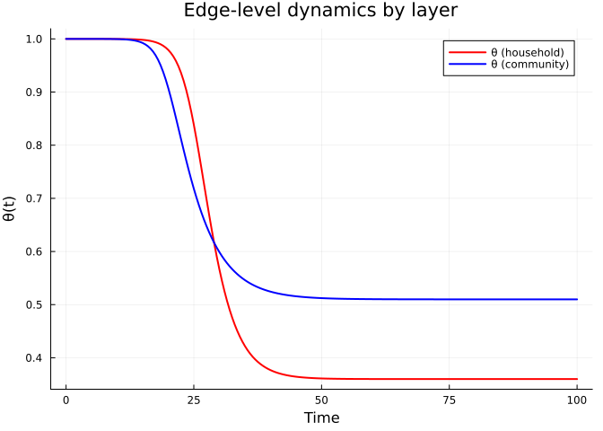
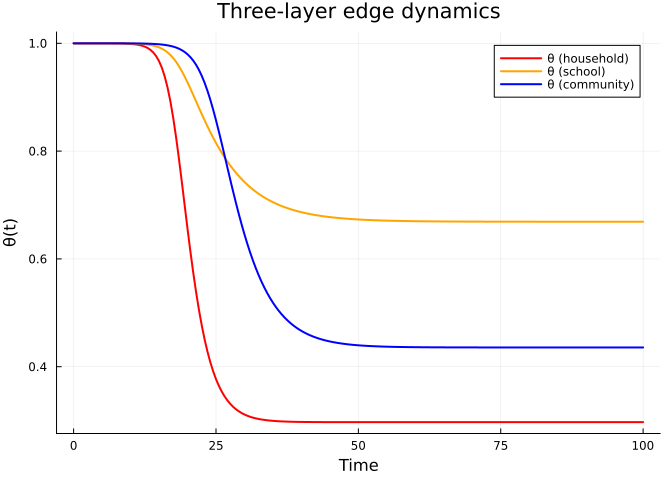
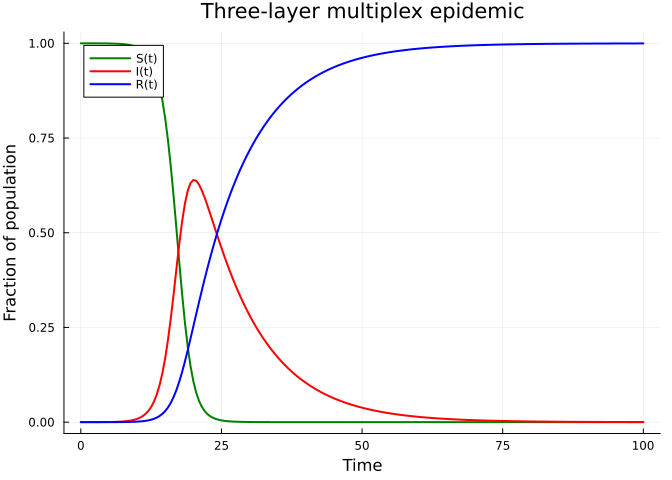
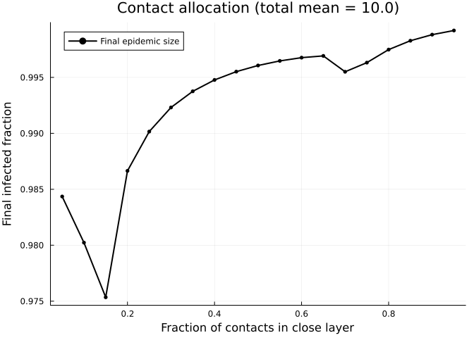
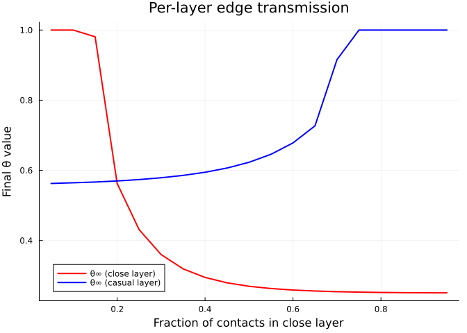
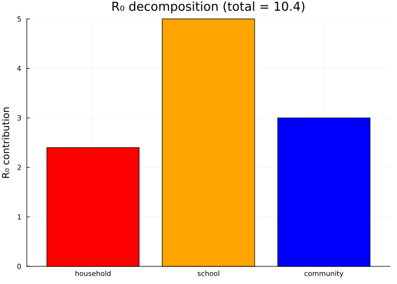
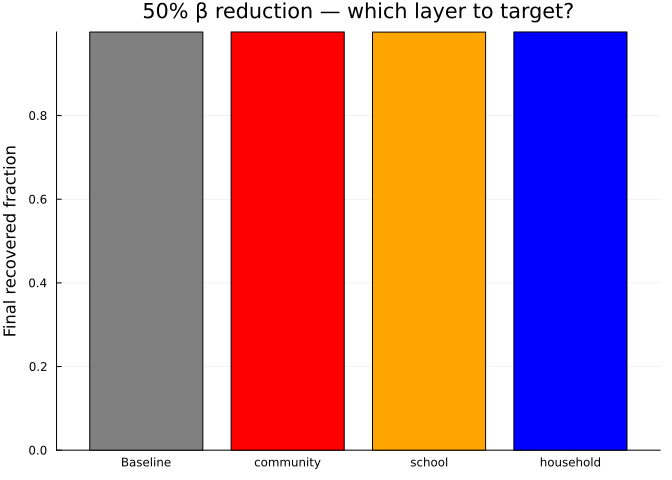

# Multiplex Networks
Simon Frost
2026-03-30

- [Introduction](#introduction)
- [Setup](#setup)
- [Two-Layer Model](#two-layer-model)
  - [Layer dynamics](#layer-dynamics)
  - [Population-level epidemic](#population-level-epidemic)
- [Layer Contributions](#layer-contributions)
- [Three-Layer Example](#three-layer-example)
- [Varying Layer Structure](#varying-layer-structure)
- [R₀ Decomposition](#r₀-decomposition)
  - [Intervention targeting](#intervention-targeting)
- [Summary](#summary)

## Introduction

Real populations do not interact through a single homogeneous contact
network. Instead, individuals maintain several distinct **contact
layers** — households, workplaces, schools, community settings — each
with its own degree distribution and transmission characteristics. A
household layer may be dense (few contacts, high transmission
probability), while a community layer may be sparse (many weak
contacts).

The **multiplex EBCM** extends the edge-based compartmental model to
handle this structure. Each layer $i$ has its own probability generating
function $\psi_i$, transmission rate $\beta_i$, and recovery rate
$\gamma_i$. The key insight is that layers are independent conditional
on a node’s infection status, so each layer gets its own edge-level
variable $\theta_i(t)$. The population-level susceptible fraction is
then:

$$S(t) = \prod_{i} \psi_i\bigl(\theta_i(t)\bigr)$$

Each $\theta_i$ evolves according to the standard EBCM equations for its
layer, but the coupling arises because the infection of a node through
*any* layer removes it from the susceptible pool across *all* layers.

This approach was described by Jacobsen et al. (2016) and builds on the
single-layer framework of Volz (2008) and Miller, Slim & Volz (2012).

## Setup

``` julia
using EdgeBasedModels
using ModelingToolkit
using OrdinaryDiffEq
using Plots
```

We define helper functions to extract trajectories from multiplex ODE
solutions.

``` julia
"""
Extract θ values from a multiplex solution by matching variable names.
"""
function extract_θ(sol, sys, layer_names)
    state_names = string.(ModelingToolkit.unknowns(sys))
    θ_vals = Dict{Symbol,Vector{Float64}}()
    for name in layer_names
        idx = findfirst(s -> startswith(s, "θ_$name"), state_names)
        θ_vals[name] = sol[idx, :]
    end
    return θ_vals
end

"""
Extract the R trajectory from a multiplex solution.
"""
function extract_R(sol, sys)
    state_names = string.(ModelingToolkit.unknowns(sys))
    idx = findfirst(s -> startswith(s, "R"), state_names)
    return sol[idx, :]
end

"""
Compute S(t) = ∏ψᵢ(θᵢ) for Poisson layers with given mean degrees.
"""
function compute_S(θ_dict, mean_degrees)
    layer_names = collect(keys(θ_dict))
    n = length(first(values(θ_dict)))
    S = ones(n)
    for name in layer_names
        κ = mean_degrees[name]
        S .*= exp.(κ .* (θ_dict[name] .- 1))
    end
    return S
end
```

    Main.Notebook.compute_S

## Two-Layer Model

We start with two contact layers representing distinct social settings:

- **Household**: dense contacts (Poisson mean degree 3), moderate
  per-contact transmission rate $\beta = 0.3$, recovery rate
  $\gamma = 0.1$.
- **Community**: more contacts (Poisson mean degree 8), lower
  per-contact transmission rate $\beta = 0.1$, same recovery rate.

``` julia
pgf_hh = poisson_pgf(3.0)
pgf_cm = poisson_pgf(8.0)

layers_2 = [
    (:household, pgf_hh, 0.3, 0.1),
    (:community, pgf_cm, 0.1, 0.1),
]

(sys_2, u0_2, tspan_2, p_2) = build_multiplex_sir(layers_2; tspan = (0.0, 100.0))
```

    (Model multiplex_sir:
    Equations (3):
      3 standard: see equations(multiplex_sir)
    Unknowns (3): see unknowns(multiplex_sir)
      R(t)
      θ_community(t)
      θ_household(t)
    Parameters (4): see parameters(multiplex_sir)
      β_household
      γ_household
      γ_community
      β_community, Dict{Any, Float64}(θ_community(t) => 0.999999, θ_household(t) => 0.999999, R(t) => 0.0), (0.0, 100.0), Dict{Any, Float64}(β_household => 0.3, γ_community => 0.1, β_community => 0.1, γ_household => 0.1))

``` julia
prob_2 = ODEProblem(sys_2, u0_2, tspan_2, p_2)
sol_2 = solve(prob_2, Tsit5(); saveat = 0.5)
```

    ┌ Warning: `SciMLBase.ODEProblem(sys, u0, tspan, p; kw...)` is deprecated. Use
    │ `SciMLBase.ODEProblem(sys, merge(u0, p), tspan)` instead.
    └ @ ModelingToolkitBase ~/.julia/packages/ModelingToolkitBase/uIKoY/src/deprecations.jl:53

    retcode: Success
    Interpolation: 1st order linear
    t: 201-element Vector{Float64}:
       0.0
       0.5
       1.0
       1.5
       2.0
       2.5
       3.0
       3.5
       4.0
       4.5
       ⋮
      96.0
      96.5
      97.0
      97.5
      98.0
      98.5
      99.0
      99.5
     100.0
    u: 201-element Vector{Vector{Float64}}:
     [0.0, 0.999999, 0.999999]
     [6.219741856945646e-7, 0.9999986501405761, 0.99999871597426]
     [1.4201509783168174e-6, 0.9999981779666525, 0.9999983513025449]
     [2.455096840822563e-6, 0.9999975406673682, 0.9999978830853186]
     [3.8083362541588263e-6, 0.9999966800054225, 0.99999728174823]
     [5.586749628987006e-6, 0.9999955190043286, 0.999996509818433]
     [7.932103652967323e-6, 0.9999939546798479, 0.9999955194783418]
     [1.1044008404559285e-5, 0.9999918403433965, 0.999994247098352]
     [1.5184999075923482e-5, 0.9999889816933508, 0.9999926120068571]
     [2.0693763521015157e-5, 0.9999851265588449, 0.9999905134731729]
     ⋮
     [0.9965703086147586, 0.5099145246427083, 0.35993327827918603]
     [0.9965957552389907, 0.509914461469118, 0.359933375947381]
     [0.9966199439977695, 0.5099144067995671, 0.3599335029308076]
     [0.9966429427898412, 0.5099143590999289, 0.35993364608686457]
     [0.9966648173951071, 0.5099143167058449, 0.3599337899203347]
     [0.9966856314746239, 0.509914277822725, 0.35993391658338486]
     [0.9967054465706032, 0.5099142405257477, 0.359934005875566]
     [0.9967243221064122, 0.5099142027598601, 0.35993403524381307]
     [0.9967423153865728, 0.5099141623397774, 0.3599339797824451]

### Layer dynamics

Each layer has its own $\theta_i(t)$, representing the probability that
a random edge in layer $i$ has not yet transmitted infection. These
evolve at different rates depending on the layer’s transmission
parameters.

``` julia
layer_names_2 = [:household, :community]
θ_2 = extract_θ(sol_2, sys_2, layer_names_2)

plot(sol_2.t, θ_2[:household], label = "θ (household)", linewidth = 2, color = :red)
plot!(sol_2.t, θ_2[:community], label = "θ (community)", linewidth = 2, color = :blue)
xlabel!("Time")
ylabel!("θ(t)")
title!("Edge-level dynamics by layer")
```

<div id="fig-two-layer-theta">



Figure 1: Edge-level probabilities θ for household and community layers.
The household layer (higher β) drops faster despite having fewer
contacts.

</div>

### Population-level epidemic

The susceptible fraction is the product
$S(t) = \psi_{\mathrm{hh}}(\theta_{\mathrm{hh}}) \cdot \psi_{\mathrm{cm}}(\theta_{\mathrm{cm}})$.

``` julia
mean_degrees_2 = Dict(:household => 3.0, :community => 8.0)
S_2 = compute_S(θ_2, mean_degrees_2)
R_2 = extract_R(sol_2, sys_2)
I_2 = 1.0 .- S_2 .- R_2

plot(sol_2.t, S_2, label = "S(t)", linewidth = 2, color = :green)
plot!(sol_2.t, I_2, label = "I(t)", linewidth = 2, color = :red)
plot!(sol_2.t, R_2, label = "R(t)", linewidth = 2, color = :blue)
xlabel!("Time")
ylabel!("Fraction of population")
title!("Two-layer multiplex epidemic")
```

<div id="fig-two-layer-sir">


Figure 2: Two-layer multiplex SIR epidemic. S, I, and R trajectories
computed from per-layer θ values and the shared recovery variable.

</div>

## Layer Contributions

Which layer drives the epidemic? We can answer this by comparing the
full two-layer model to single-layer models where one layer is “switched
off” (by setting its $\beta = 0$).

``` julia
layers_hh_only = [
    (:household, pgf_hh, 0.3, 0.1),
    (:community, pgf_cm, 0.0, 0.1),  # community switched off
]
layers_cm_only = [
    (:household, pgf_hh, 0.0, 0.1),  # household switched off
    (:community, pgf_cm, 0.1, 0.1),
]

(sys_hh, u0_hh, ts_hh, p_hh) = build_multiplex_sir(layers_hh_only; tspan = (0.0, 100.0))
(sys_cm, u0_cm, ts_cm, p_cm) = build_multiplex_sir(layers_cm_only; tspan = (0.0, 100.0))

sol_hh = solve(ODEProblem(sys_hh, u0_hh, ts_hh, p_hh), Tsit5(); saveat = 0.5)
sol_cm = solve(ODEProblem(sys_cm, u0_cm, ts_cm, p_cm), Tsit5(); saveat = 0.5)
```

    ┌ Warning: `SciMLBase.ODEProblem(sys, u0, tspan, p; kw...)` is deprecated. Use
    │ `SciMLBase.ODEProblem(sys, merge(u0, p), tspan)` instead.
    └ @ ModelingToolkitBase ~/.julia/packages/ModelingToolkitBase/uIKoY/src/deprecations.jl:53
    ┌ Warning: `SciMLBase.ODEProblem(sys, u0, tspan, p; kw...)` is deprecated. Use
    │ `SciMLBase.ODEProblem(sys, merge(u0, p), tspan)` instead.
    └ @ ModelingToolkitBase ~/.julia/packages/ModelingToolkitBase/uIKoY/src/deprecations.jl:53

    retcode: Success
    Interpolation: 1st order linear
    t: 201-element Vector{Float64}:
       0.0
       0.5
       1.0
       1.5
       2.0
       2.5
       3.0
       3.5
       4.0
       4.5
       ⋮
      96.0
      96.5
      97.0
      97.5
      98.0
      98.5
      99.0
      99.5
     100.0
    u: 201-element Vector{Vector{Float64}}:
     [0.0, 0.999999, 0.999999]
     [5.982605815622534e-7, 0.9999986501403602, 0.9999990487705762]
     [1.3196666374294752e-6, 0.9999981779721098, 0.9999990951625962]
     [2.2142689715282507e-6, 0.9999975407072056, 0.9999991392920259]
     [3.3497787969588627e-6, 0.9999966800423467, 0.9999991812692467]
     [4.815307711278623e-6, 0.9999955188898603, 0.9999992211992869]
     [6.728674585323984e-6, 0.999993954984259, 0.9999992591818612]
     [9.258225947554969e-6, 0.9999918417983619, 0.9999992953119325]
     [1.2628935452313803e-5, 0.999988983209987, 0.9999993296799442]
     [1.7129773773290123e-5, 0.9999851270554299, 0.9999993623718739]
     ⋮
     [0.9796156024648774, 0.5099150580238094, 0.9999999999317287]
     [0.979642726084037, 0.509914942790121, 0.9999999999350543]
     [0.9796685162526234, 0.509914840197405, 0.9999999999382162]
     [0.9796930415784549, 0.5099147486264316, 0.9999999999412229]
     [0.9797163681108341, 0.5099146663693246, 0.9999999999440825]
     [0.9797385593405477, 0.5099145916295617, 0.9999999999468029]
     [0.9797596761998663, 0.5099145225219742, 0.9999999999493915]
     [0.9797797770625449, 0.5099144570727476, 0.9999999999518556]
     [0.9797989177438227, 0.5099143932194211, 0.9999999999542021]

``` julia
θ_hh_only = extract_θ(sol_hh, sys_hh, layer_names_2)
θ_cm_only = extract_θ(sol_cm, sys_cm, layer_names_2)

S_hh_only = compute_S(θ_hh_only, mean_degrees_2)
S_cm_only = compute_S(θ_cm_only, mean_degrees_2)
R_hh_only = extract_R(sol_hh, sys_hh)
R_cm_only = extract_R(sol_cm, sys_cm)

plot(sol_2.t, R_2, label = "Both layers", linewidth = 2.5, color = :black)
plot!(sol_hh.t, R_hh_only, label = "Household only", linewidth = 2,
      color = :red, linestyle = :dash)
plot!(sol_cm.t, R_cm_only, label = "Community only", linewidth = 2,
      color = :blue, linestyle = :dash)
xlabel!("Time")
ylabel!("Cumulative recovered fraction")
title!("Layer contributions to the epidemic")
```

<div id="fig-layer-contributions">


Figure 3: Epidemic curves with individual layers vs both layers active.
The combined epidemic is larger than either layer alone, since R₀ is
additive across layers.

</div>

The total $R_0$ for a multiplex model is the sum of per-layer
contributions:

``` julia
R0_total = multiplex_R0(layers_2)
R0_hh = multiplex_R0(layers_hh_only)
R0_cm = multiplex_R0(layers_cm_only)
println("R₀ (both layers):     $(round(R0_total; digits = 3))")
println("R₀ (household only):  $(round(R0_hh; digits = 3))")
println("R₀ (community only):  $(round(R0_cm; digits = 3))")
println("Sum of single layers: $(round(R0_hh + R0_cm; digits = 3))")
```

    R₀ (both layers):     6.25
    R₀ (household only):  2.25
    R₀ (community only):  4.0
    Sum of single layers: 6.25

## Three-Layer Example

Adding more layers is straightforward — each layer introduces three
additional ODEs ($\theta_i$, $\varphi_{S,i}$, $\varphi_{I,i}$) but the
framework remains the same.

Consider a population with household, school, and community contacts:

- **Household**: Poisson(3), $\beta = 0.4$, $\gamma = 0.1$ — few but
  intense contacts.
- **School**: Poisson(15), $\beta = 0.05$, $\gamma = 0.1$ — many
  contacts, low per-contact transmission.
- **Community**: Poisson(5), $\beta = 0.15$, $\gamma = 0.1$ — moderate
  in both dimensions.

``` julia
pgf_school = poisson_pgf(15.0)
pgf_cm3 = poisson_pgf(5.0)
pgf_hh3 = poisson_pgf(3.0)

layers_3 = [
    (:household, pgf_hh3,  0.4,  0.1),
    (:school,    pgf_school, 0.05, 0.1),
    (:community, pgf_cm3,  0.15, 0.1),
]

(sys_3, u0_3, ts_3, p_3) = build_multiplex_sir(layers_3; tspan = (0.0, 100.0))
sol_3 = solve(ODEProblem(sys_3, u0_3, ts_3, p_3), Tsit5(); saveat = 0.5)
```

    ┌ Warning: `SciMLBase.ODEProblem(sys, u0, tspan, p; kw...)` is deprecated. Use
    │ `SciMLBase.ODEProblem(sys, merge(u0, p), tspan)` instead.
    └ @ ModelingToolkitBase ~/.julia/packages/ModelingToolkitBase/uIKoY/src/deprecations.jl:53

    retcode: Success
    Interpolation: 1st order linear
    t: 201-element Vector{Float64}:
       0.0
       0.5
       1.0
       1.5
       2.0
       2.5
       3.0
       3.5
       4.0
       4.5
       ⋮
      96.0
      96.5
      97.0
      97.5
      98.0
      98.5
      99.0
      99.5
     100.0
    u: 201-element Vector{Vector{Float64}}:
     [0.0, 0.999999, 0.999999, 0.999999]
     [1.3069716084704117e-6, 0.9999987159738477, 0.9999986501407894, 0.9999985809241361]
     [3.0010837379793955e-6, 0.9999983513007429, 0.9999981779560427, 0.9999979864197013]
     [5.221597997059272e-6, 0.9999978830295312, 0.9999975404993163, 0.9999971425564683]
     [8.156503048880308e-6, 0.9999972817185844, 0.9999966799424477, 0.9999959448644071]
     [1.205589478429764e-5, 0.9999965099856941, 0.9999955195587308, 0.999994248828838]
     [1.7269432373657304e-5, 0.9999955189471307, 0.9999939527573284, 0.9999918405576004]
     [2.4271999849291748e-5, 0.9999942457701311, 0.9999918356051426, 0.9999884164880697]
     [3.368820753337926e-5, 0.9999926114705301, 0.9999889797327198, 0.9999835634274397]
     [4.6368429339386275e-5, 0.9999905143751526, 0.9999851303743506, 0.9999766958129686]
     ⋮
     [0.9995629079881888, 0.43571353843246574, 0.6689983945399941, 0.2971223323377981]
     [0.9995817483873989, 0.4357134074041665, 0.6689979776282202, 0.29712265228158985]
     [0.999599662400825, 0.43571329445798224, 0.6689975914491482, 0.29712309917024665]
     [0.9996166974925245, 0.4357131968900636, 0.6689972334927187, 0.29712362962395744]
     [0.9996328993321811, 0.4357131117509704, 0.6689969012848063, 0.2971241881191976]
     [0.9996483117951052, 0.43571303584567206, 0.6689965923872194, 0.2971247069887297]
     [0.9996629769622333, 0.43571296573354734, 0.6689963043977001, 0.2971251064216028]
     [0.9996769351201283, 0.4357128977283844, 0.6689960349499243, 0.2971252944631529]
     [0.9996902247609797, 0.435712827898381, 0.6689957817135018, 0.29712516701500274]

``` julia
layer_names_3 = [:household, :school, :community]
θ_3 = extract_θ(sol_3, sys_3, layer_names_3)

plot(sol_3.t, θ_3[:household], label = "θ (household)", linewidth = 2, color = :red)
plot!(sol_3.t, θ_3[:school], label = "θ (school)", linewidth = 2, color = :orange)
plot!(sol_3.t, θ_3[:community], label = "θ (community)", linewidth = 2, color = :blue)
xlabel!("Time")
ylabel!("θ(t)")
title!("Three-layer edge dynamics")
```

<div id="fig-three-layer-theta">



Figure 4: Per-layer θ dynamics in the three-layer model. Each layer
decays at its own rate, reflecting different transmission
characteristics.

</div>

``` julia
mean_degrees_3 = Dict(:household => 3.0, :school => 15.0, :community => 5.0)
S_3 = compute_S(θ_3, mean_degrees_3)
R_3 = extract_R(sol_3, sys_3)
I_3 = 1.0 .- S_3 .- R_3

plot(sol_3.t, S_3, label = "S(t)", linewidth = 2, color = :green)
plot!(sol_3.t, I_3, label = "I(t)", linewidth = 2, color = :red)
plot!(sol_3.t, R_3, label = "R(t)", linewidth = 2, color = :blue)
xlabel!("Time")
ylabel!("Fraction of population")
title!("Three-layer multiplex epidemic")
```

<div id="fig-three-layer-sir">



Figure 5: Three-layer multiplex epidemic. The product formula S(t) =
∏ψᵢ(θᵢ) combines contributions from all layers.

</div>

Despite having the highest mean degree, the school layer has the lowest
per-contact transmission rate. The household layer, with few contacts
but high $\beta$, may contribute more to overall transmission. We
quantify this next.

## Varying Layer Structure

How does the distribution of contacts across layers affect epidemic
outcomes? We fix the **total mean contacts** at 10 and vary the
allocation between a “close” layer (high $\beta = 0.3$) and a “casual”
layer (low $\beta = 0.08$), both with $\gamma = 0.1$.

``` julia
close_fracs = 0.05:0.05:0.95
final_infected = Float64[]
final_θ_close = Float64[]
final_θ_casual = Float64[]

total_contacts = 10.0
β_close = 0.3
β_casual = 0.08
γ_val = 0.1

for f in close_fracs
    k_close = f * total_contacts
    k_casual = (1 - f) * total_contacts
    pgf_c = poisson_pgf(k_close)
    pgf_a = poisson_pgf(k_casual)

    layers_v = [
        (:close,  pgf_c, β_close, γ_val),
        (:casual, pgf_a, β_casual, γ_val),
    ]

    (sys_v, u0_v, ts_v, p_v) = build_multiplex_sir(layers_v; tspan = (0.0, 200.0))
    sol_v = solve(ODEProblem(sys_v, u0_v, ts_v, p_v), Tsit5())

    R_v = extract_R(sol_v, sys_v)
    θ_v = extract_θ(sol_v, sys_v, [:close, :casual])
    θ_c_end = θ_v[:close][end]
    θ_a_end = θ_v[:casual][end]
    push!(final_infected, R_v[end])
    push!(final_θ_close, θ_c_end)
    push!(final_θ_casual, θ_a_end)
end

plot(collect(close_fracs), final_infected,
     label = "Final epidemic size", linewidth = 2, color = :black,
     marker = :circle, markersize = 3)
xlabel!("Fraction of contacts in close layer")
ylabel!("Final infected fraction")
title!("Contact allocation (total mean = $total_contacts)")
```

    ┌ Warning: `SciMLBase.ODEProblem(sys, u0, tspan, p; kw...)` is deprecated. Use
    │ `SciMLBase.ODEProblem(sys, merge(u0, p), tspan)` instead.
    └ @ ModelingToolkitBase ~/.julia/packages/ModelingToolkitBase/uIKoY/src/deprecations.jl:53
    ┌ Warning: `SciMLBase.ODEProblem(sys, u0, tspan, p; kw...)` is deprecated. Use
    │ `SciMLBase.ODEProblem(sys, merge(u0, p), tspan)` instead.
    └ @ ModelingToolkitBase ~/.julia/packages/ModelingToolkitBase/uIKoY/src/deprecations.jl:53
    ┌ Warning: `SciMLBase.ODEProblem(sys, u0, tspan, p; kw...)` is deprecated. Use
    │ `SciMLBase.ODEProblem(sys, merge(u0, p), tspan)` instead.
    └ @ ModelingToolkitBase ~/.julia/packages/ModelingToolkitBase/uIKoY/src/deprecations.jl:53
    ┌ Warning: `SciMLBase.ODEProblem(sys, u0, tspan, p; kw...)` is deprecated. Use
    │ `SciMLBase.ODEProblem(sys, merge(u0, p), tspan)` instead.
    └ @ ModelingToolkitBase ~/.julia/packages/ModelingToolkitBase/uIKoY/src/deprecations.jl:53
    ┌ Warning: `SciMLBase.ODEProblem(sys, u0, tspan, p; kw...)` is deprecated. Use
    │ `SciMLBase.ODEProblem(sys, merge(u0, p), tspan)` instead.
    └ @ ModelingToolkitBase ~/.julia/packages/ModelingToolkitBase/uIKoY/src/deprecations.jl:53
    ┌ Warning: `SciMLBase.ODEProblem(sys, u0, tspan, p; kw...)` is deprecated. Use
    │ `SciMLBase.ODEProblem(sys, merge(u0, p), tspan)` instead.
    └ @ ModelingToolkitBase ~/.julia/packages/ModelingToolkitBase/uIKoY/src/deprecations.jl:53
    ┌ Warning: `SciMLBase.ODEProblem(sys, u0, tspan, p; kw...)` is deprecated. Use
    │ `SciMLBase.ODEProblem(sys, merge(u0, p), tspan)` instead.
    └ @ ModelingToolkitBase ~/.julia/packages/ModelingToolkitBase/uIKoY/src/deprecations.jl:53
    ┌ Warning: `SciMLBase.ODEProblem(sys, u0, tspan, p; kw...)` is deprecated. Use
    │ `SciMLBase.ODEProblem(sys, merge(u0, p), tspan)` instead.
    └ @ ModelingToolkitBase ~/.julia/packages/ModelingToolkitBase/uIKoY/src/deprecations.jl:53
    ┌ Warning: `SciMLBase.ODEProblem(sys, u0, tspan, p; kw...)` is deprecated. Use
    │ `SciMLBase.ODEProblem(sys, merge(u0, p), tspan)` instead.
    └ @ ModelingToolkitBase ~/.julia/packages/ModelingToolkitBase/uIKoY/src/deprecations.jl:53
    ┌ Warning: `SciMLBase.ODEProblem(sys, u0, tspan, p; kw...)` is deprecated. Use
    │ `SciMLBase.ODEProblem(sys, merge(u0, p), tspan)` instead.
    └ @ ModelingToolkitBase ~/.julia/packages/ModelingToolkitBase/uIKoY/src/deprecations.jl:53
    ┌ Warning: `SciMLBase.ODEProblem(sys, u0, tspan, p; kw...)` is deprecated. Use
    │ `SciMLBase.ODEProblem(sys, merge(u0, p), tspan)` instead.
    └ @ ModelingToolkitBase ~/.julia/packages/ModelingToolkitBase/uIKoY/src/deprecations.jl:53
    ┌ Warning: `SciMLBase.ODEProblem(sys, u0, tspan, p; kw...)` is deprecated. Use
    │ `SciMLBase.ODEProblem(sys, merge(u0, p), tspan)` instead.
    └ @ ModelingToolkitBase ~/.julia/packages/ModelingToolkitBase/uIKoY/src/deprecations.jl:53
    ┌ Warning: `SciMLBase.ODEProblem(sys, u0, tspan, p; kw...)` is deprecated. Use
    │ `SciMLBase.ODEProblem(sys, merge(u0, p), tspan)` instead.
    └ @ ModelingToolkitBase ~/.julia/packages/ModelingToolkitBase/uIKoY/src/deprecations.jl:53
    ┌ Warning: `SciMLBase.ODEProblem(sys, u0, tspan, p; kw...)` is deprecated. Use
    │ `SciMLBase.ODEProblem(sys, merge(u0, p), tspan)` instead.
    └ @ ModelingToolkitBase ~/.julia/packages/ModelingToolkitBase/uIKoY/src/deprecations.jl:53
    ┌ Warning: `SciMLBase.ODEProblem(sys, u0, tspan, p; kw...)` is deprecated. Use
    │ `SciMLBase.ODEProblem(sys, merge(u0, p), tspan)` instead.
    └ @ ModelingToolkitBase ~/.julia/packages/ModelingToolkitBase/uIKoY/src/deprecations.jl:53
    ┌ Warning: `SciMLBase.ODEProblem(sys, u0, tspan, p; kw...)` is deprecated. Use
    │ `SciMLBase.ODEProblem(sys, merge(u0, p), tspan)` instead.
    └ @ ModelingToolkitBase ~/.julia/packages/ModelingToolkitBase/uIKoY/src/deprecations.jl:53
    ┌ Warning: `SciMLBase.ODEProblem(sys, u0, tspan, p; kw...)` is deprecated. Use
    │ `SciMLBase.ODEProblem(sys, merge(u0, p), tspan)` instead.
    └ @ ModelingToolkitBase ~/.julia/packages/ModelingToolkitBase/uIKoY/src/deprecations.jl:53
    ┌ Warning: `SciMLBase.ODEProblem(sys, u0, tspan, p; kw...)` is deprecated. Use
    │ `SciMLBase.ODEProblem(sys, merge(u0, p), tspan)` instead.
    └ @ ModelingToolkitBase ~/.julia/packages/ModelingToolkitBase/uIKoY/src/deprecations.jl:53
    ┌ Warning: `SciMLBase.ODEProblem(sys, u0, tspan, p; kw...)` is deprecated. Use
    │ `SciMLBase.ODEProblem(sys, merge(u0, p), tspan)` instead.
    └ @ ModelingToolkitBase ~/.julia/packages/ModelingToolkitBase/uIKoY/src/deprecations.jl:53

<div id="fig-allocation">



Figure 6: Effect of redistributing fixed total contacts between a high-β
(close) and low-β (casual) layer. The final epidemic size (1 − S(∞))
varies with the allocation.

</div>

``` julia
plot(collect(close_fracs), final_θ_close,
     label = "θ∞ (close layer)", linewidth = 2, color = :red)
plot!(collect(close_fracs), final_θ_casual,
      label = "θ∞ (casual layer)", linewidth = 2, color = :blue)
xlabel!("Fraction of contacts in close layer")
ylabel!("Final θ value")
title!("Per-layer edge transmission")
```

<div id="fig-allocation-theta">



Figure 7: Final θ values for each layer as the contact allocation
changes. The close layer (high β) shows more transmission per edge when
it has fewer contacts.

</div>

The final epidemic size depends on how contacts are partitioned. Even
with the same total contacts, concentrating more contacts in the
high-$\beta$ layer can increase the overall epidemic size — the
nonlinear coupling between layers means that the distribution matters,
not just the total.

## R₀ Decomposition

For a multiplex model,
$R_0 = \sum_i T_i \cdot \langle k_i^2 - k_i \rangle / \langle k_i \rangle$,
where $T_i = \beta_i / (\beta_i + \gamma_i)$ is the transmissibility of
layer $i$. This additive structure makes it easy to identify which layer
contributes most — and where interventions would be most effective.

``` julia
function layer_R0(name, pgf, β, γ)
    T = β / (β + γ)
    ψ_fn = x -> EdgeBasedModels._build_pgf_fn(pgf)(x)
    ψ1_fn = x -> EdgeBasedModels._build_pgf_deriv_fn(pgf, 1)(x)
    ψ2_fn = x -> EdgeBasedModels._build_pgf_deriv_fn(pgf, 2)(x)
    mean_k = ψ1_fn(1.0)
    excess = ψ2_fn(1.0) / mean_k
    return T * excess
end

r0_contributions = [(String(l[1]), layer_R0(l...)) for l in layers_3]
names_bar = [c[1] for c in r0_contributions]
vals_bar = [c[2] for c in r0_contributions]

bar(names_bar, vals_bar,
    label = "Layer R₀",
    color = [:red, :orange, :blue],
    ylabel = "R₀ contribution",
    title = "R₀ decomposition (total = $(round(sum(vals_bar); digits = 2)))",
    legend = false)
```

<div id="fig-r0-decomposition">



Figure 8: Per-layer R₀ contributions for the three-layer model.
Targeting the layer with the largest R₀ contribution yields the greatest
reduction.

</div>

### Intervention targeting

Suppose we can reduce $\beta$ in one layer by 50%. Which layer should we
target?

``` julia
interventions = Dict{String,Float64}()

for (i, (name, pgf_l, β_l, γ_l)) in enumerate(layers_3)
    modified = collect(layers_3)
    modified[i] = (name, pgf_l, β_l * 0.5, γ_l)

    (sys_int, u0_int, ts_int, p_int) = build_multiplex_sir(modified; tspan = (0.0, 200.0))
    sol_int = solve(ODEProblem(sys_int, u0_int, ts_int, p_int), Tsit5())

    R_int = extract_R(sol_int, sys_int)
    interventions[String(name)] = R_int[end]
end

# Baseline
baseline_final = R_3[end]

bar_names = ["Baseline"; collect(keys(interventions))]
bar_vals = [baseline_final; collect(values(interventions))]
bar_colors = [:gray, :red, :orange, :blue]

bar(bar_names, bar_vals,
    label = false,
    color = bar_colors,
    ylabel = "Final recovered fraction",
    title = "50% β reduction — which layer to target?")
```

    ┌ Warning: `SciMLBase.ODEProblem(sys, u0, tspan, p; kw...)` is deprecated. Use
    │ `SciMLBase.ODEProblem(sys, merge(u0, p), tspan)` instead.
    └ @ ModelingToolkitBase ~/.julia/packages/ModelingToolkitBase/uIKoY/src/deprecations.jl:53
    ┌ Warning: `SciMLBase.ODEProblem(sys, u0, tspan, p; kw...)` is deprecated. Use
    │ `SciMLBase.ODEProblem(sys, merge(u0, p), tspan)` instead.
    └ @ ModelingToolkitBase ~/.julia/packages/ModelingToolkitBase/uIKoY/src/deprecations.jl:53
    ┌ Warning: `SciMLBase.ODEProblem(sys, u0, tspan, p; kw...)` is deprecated. Use
    │ `SciMLBase.ODEProblem(sys, merge(u0, p), tspan)` instead.
    └ @ ModelingToolkitBase ~/.julia/packages/ModelingToolkitBase/uIKoY/src/deprecations.jl:53

<div id="fig-intervention">



Figure 9: Effect of a 50% reduction in β on each layer. Targeting the
layer with the highest R₀ contribution produces the largest reduction in
epidemic size.

</div>

The layer with the largest $R_0$ contribution is the most impactful
intervention target. This decomposition provides a principled basis for
allocating limited resources across contact settings.

## Summary

- **Multiplex EBCM** extends the edge-based framework to populations
  with multiple independent contact layers, each with its own degree
  distribution and transmission dynamics.
- Each layer has its own $\theta_i(t)$; the susceptible fraction is
  $S(t) = \prod_i \psi_i(\theta_i)$.
- `build_multiplex_sir(layers)` constructs the ODE system from a vector
  of `(name, pgf, β, γ)` tuples.
- `multiplex_R0(layers)` computes the total $R_0 = \sum_i R_{0,i}$, with
  each layer contributing independently.
- `susceptible_fraction(pgfs, θ_values)` evaluates the product formula
  at any time point.
- **Contact allocation matters**: redistributing fixed total contacts
  across layers with different transmission rates changes epidemic
  outcomes.
- **Intervention targeting**: the per-layer $R_0$ decomposition
  identifies which layer to prioritise for control measures.
