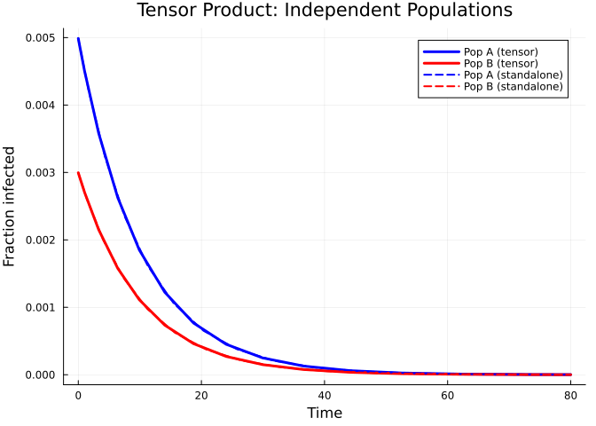
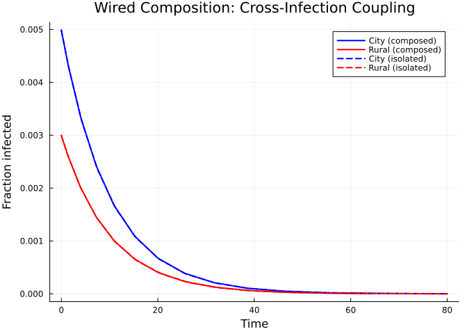
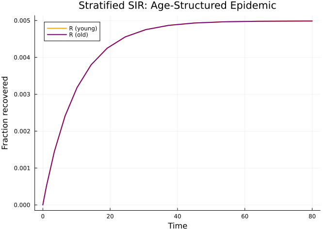
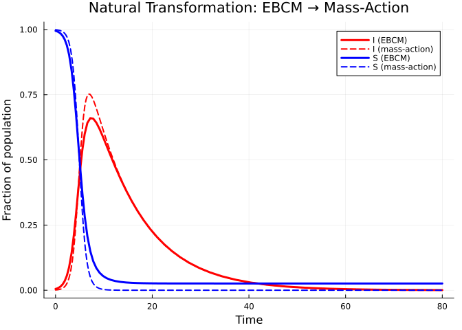
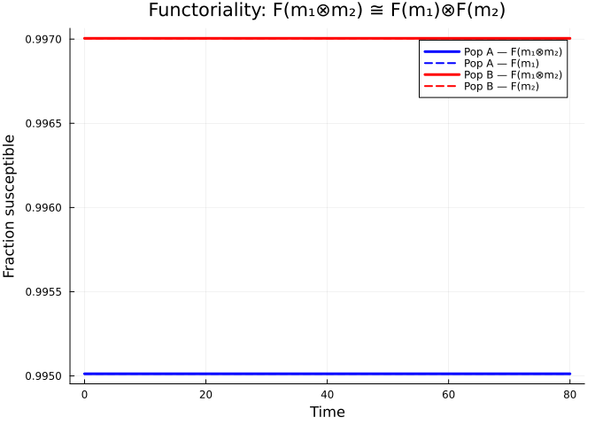

# Categorical Composition
Simon Frost
2026-03-30

- [Introduction](#introduction)
- [Setup](#setup)
- [Open systems and ports](#open-systems-and-ports)
- [Tensor product — independent
  populations](#tensor-product--independent-populations)
- [Composition via wiring — coupled
  populations](#composition-via-wiring--coupled-populations)
- [Stratification — age-structured
  populations](#stratification--age-structured-populations)
- [Natural transformations — EBCM to
  mass-action](#natural-transformations--ebcm-to-mass-action)
- [Functor and functoriality](#functor-and-functoriality)
  - [Verifying functoriality](#verifying-functoriality)
- [Summary](#summary)

## Introduction

Epidemiological models are often built by combining simpler pieces — two
populations coupled by travel, or a base model stratified by age.
**Categorical composition** gives this idea a formal algebraic backbone.
Each submodel is an *open system* with typed *ports* that can be wired
together. The wiring determines how infection pressure flows between
components, and a *functor* maps the resulting network description to a
concrete ODE system.

Key benefits:

1.  **Composability** — build complex multi-population models from
    reusable parts.
2.  **Formal guarantees** — the functor preserves composition, so the
    combined ODE faithfully represents the wired network.
3.  **Natural transformations** — relate EBCM network models to simpler
    mass-action approximations and quantify the difference.

## Setup

``` julia
using EdgeBasedModels
using ModelingToolkit
using OrdinaryDiffEq
using Plots
```

## Open systems and ports

An `OpenEBCM` wraps an edge-based compartmental model together with
named **ports** — typed boundary interfaces through which systems can
interact. Convenience constructors `open_sir` and `open_seir` create
open systems directly from a PGF and rate parameters.

``` julia
pgf_a = poisson_pgf(5.0)
m_sir = open_sir(pgf_a, 0.3, 0.1; name = :pop_a)
```

    OpenEBCM(:pop_a, StaticConfigurationModel(DegreePGF(z, exp(5.0(-1 + z))), DiseaseProgression(:S, :I, DiseaseStage[DiseaseStage(:I, 0.3), DiseaseStage(:R, 0)], DiseaseTransition[DiseaseTransition(:I, :R, 0.1)])), Port[Port(:S, :susceptible), Port(:I, :infectious), Port(:R, :recovered)])

Each port has a name and a type (`:susceptible`, `:infectious`, or
`:recovered`):

``` julia
for p in m_sir.ports
    println("  Port $(p.name) — type $(p.type)")
end
```

      Port S — type susceptible
      Port I — type infectious
      Port R — type recovered

An SEIR model has four ports (S, E, I, R), where the exposed and
recovered stages are both non-infectious:

``` julia
m_seir = open_seir(pgf_a, 0.2, 0.3, 0.1; name = :seir)
println("SEIR ports: ", length(m_seir.ports))
for p in m_seir.ports
    println("  Port $(p.name) — type $(p.type)")
end
```

    SEIR ports: 4
      Port S — type susceptible
      Port E — type recovered
      Port I — type infectious
      Port R — type recovered

## Tensor product — independent populations

The tensor product $m_1 \otimes m_2$ places two open systems side by
side with **no interaction**. Each component evolves independently,
giving block-diagonal dynamics.

``` julia
pgf_b = poisson_pgf(3.0)
m1 = open_sir(pgf_a, 0.3, 0.1; name = :pop_a)
m2 = open_sir(pgf_b, 0.2, 0.1; name = :pop_b)

tp = tensor(m1, m2)
println("Tensor product ports: ", length(tp.ports))
```

    Tensor product ports: 6

Build the ODE system and solve:

``` julia
sys_tp = build_edge_system(tp.model)
ic_tp = default_initial_conditions(sys_tp)
prob_tp = ODEProblem(sys_tp.system, ic_tp, (0.0, 80.0))
sol_tp = solve(prob_tp; abstol = 1e-8, reltol = 1e-8)
```

    retcode: Success
    Interpolation: 3rd order Hermite
    t: 16-element Vector{Float64}:
      0.0
      0.12534610285200976
      1.0243229268130767
      3.318655827417821
      6.419406336725807
      9.91813540968653
     14.055304510014803
     18.722108945890884
     24.02029433382974
     29.957643274473135
     36.62428169107676
     44.11260555587357
     52.58299615227192
     62.282834145005424
     73.69893657259783
     80.0
    u: 16-element Vector{Vector{Float64}}:
     [0.0, 0.0, 0.0, 0.999, 0.0, 0.0, 0.0, 0.999]
     [3.7313140096891756e-5, 0.0, 0.0, 0.999, 6.212645076285548e-5, 0.0, 0.0, 0.999]
     [0.00029164452557355416, 0.0, 0.0, 0.999, 0.0004855887017616859, 0.0, 0.0, 0.999]
     [0.0008459790808421709, 0.0, 0.0, 0.999, 0.0014085568133871487, 0.0, 0.0, 0.999]
     [0.0014190599411111199, 0.0, 0.0, 0.999, 0.0023627375592632973, 0.0, 0.0, 0.999]
     [0.0018844615976829654, 0.0, 0.0, 0.999, 0.0031376322217570338, 0.0, 0.0, 0.999]
     [0.0022608961524729723, 0.0, 0.0, 0.999, 0.003764396486915914, 0.0, 0.0, 0.999]
     [0.0025348459681863588, 0.0, 0.0, 0.999, 0.0042205234623785915, 0.0, 0.0, 0.999]
     [0.0027243093899765843, 0.0, 0.0, 0.999, 0.004535980427797386, 0.0, 0.0, 0.999]
     [0.002845734071413811, 0.0, 0.0, 0.999, 0.004738152758325376, 0.0, 0.0, 0.999]
     [0.0029186095784315925, 0.0, 0.0, 0.999, 0.004859490619111182, 0.0, 0.0, 0.999]
     [0.0029591394730700874, 0.0, 0.0, 0.999, 0.004926972972436093, 0.0, 0.0, 0.999]
     [0.002979915452386442, 0.0, 0.0, 0.999, 0.004961565018366673, 0.0, 0.0, 0.999]
     [0.0029895948593387767, 0.0, 0.0, 0.999, 0.004977681249750014, 0.0, 0.0, 0.999]
     [0.002993617526197874, 0.0, 0.0, 0.999, 0.004984378997886718, 0.0, 0.0, 0.999]
     [0.002994499618508045, 0.0, 0.0, 0.999, 0.0049858476832971, 0.0, 0.0, 0.999]

We can also solve each population in isolation and confirm the tensor
product does not alter trajectories:

``` julia
sys_a = build_edge_system(m1.model)
ic_a = default_initial_conditions(sys_a)
sol_a = solve(ODEProblem(sys_a.system, ic_a, (0.0, 80.0)); abstol = 1e-8, reltol = 1e-8)

sys_b = build_edge_system(m2.model)
ic_b = default_initial_conditions(sys_b)
sol_b = solve(ODEProblem(sys_b.system, ic_b, (0.0, 80.0)); abstol = 1e-8, reltol = 1e-8)
```

    retcode: Success
    Interpolation: 3rd order Hermite
    t: 15-element Vector{Float64}:
      0.0
      0.13115784989239607
      1.4031404147404007
      4.03880935260986
      7.398224448213996
     11.234759302164559
     15.721016125429543
     20.798323934907025
     26.556547426236328
     33.034050958637344
     40.33947173610018
     48.61018212574763
     58.07915759111301
     69.17400704249691
     80.0
    u: 15-element Vector{Vector{Float64}}:
     [0.0, 0.0, 0.0, 0.999]
     [3.90318665944542e-5, 0.0, 0.0, 0.999]
     [0.0003921556811967658, 0.0, 0.0, 0.999]
     [0.000995335393765675, 0.0, 0.0, 0.999]
     [0.001566053833340117, 0.0, 0.0, 0.999]
     [0.002021523285838442, 0.0, 0.0, 0.999]
     [0.0023736125670668225, 0.0, 0.0, 0.999]
     [0.002621212754863492, 0.0, 0.0, 0.999]
     [0.002785061838911563, 0.0, 0.0, 0.999]
     [0.002885396369051372, 0.0, 0.0, 0.999]
     [0.002942471155240747, 0.0, 0.0, 0.999]
     [0.002972311513612726, 0.0, 0.0, 0.999]
     [0.0029865069480502666, 0.0, 0.0, 0.999]
     [0.0029925377494319223, 0.0, 0.0, 0.999]
     [0.0029944996186895257, 0.0, 0.0, 0.999]

``` julia
# Extract S = ψ(θ) for each population
κ_a, κ_b = 5.0, 3.0
ψ_a(x) = exp(κ_a * (x - 1))
ψ_b(x) = exp(κ_b * (x - 1))

# Tensor system
θ_a_tp = sol_tp[sys_tp.variables[:θ_pop_a]]
θ_b_tp = sol_tp[sys_tp.variables[:θ_pop_b]]
R_a_tp = sol_tp[sys_tp.variables[:R_pop_a]]
R_b_tp = sol_tp[sys_tp.variables[:R_pop_b]]
S_a_tp = ψ_a.(θ_a_tp)
S_b_tp = ψ_b.(θ_b_tp)
I_a_tp = 1.0 .- S_a_tp .- R_a_tp
I_b_tp = 1.0 .- S_b_tp .- R_b_tp

# Standalone systems
θ_a_solo = sol_a[sys_a.variables[:θ]]
R_a_solo = sol_a[sys_a.variables[:R]]
S_a_solo = ψ_a.(θ_a_solo)
I_a_solo = 1.0 .- S_a_solo .- R_a_solo

θ_b_solo = sol_b[sys_b.variables[:θ]]
R_b_solo = sol_b[sys_b.variables[:R]]
S_b_solo = ψ_b.(θ_b_solo)
I_b_solo = 1.0 .- S_b_solo .- R_b_solo

plot(sol_tp.t, I_a_tp, label = "Pop A (tensor)", lw = 3, color = :blue)
plot!(sol_tp.t, I_b_tp, label = "Pop B (tensor)", lw = 3, color = :red)
plot!(sol_a.t, I_a_solo, label = "Pop A (standalone)", lw = 2, ls = :dash, color = :blue)
plot!(sol_b.t, I_b_solo, label = "Pop B (standalone)", lw = 2, ls = :dash, color = :red)
xlabel!("Time")
ylabel!("Fraction infected")
title!("Tensor Product: Independent Populations")
```

<div id="fig-tensor">



Figure 1: Tensor product: two independent SIR populations evolve without
interaction.

</div>

The solid (tensor) and dashed (standalone) curves overlap perfectly —
the tensor product preserves each component’s dynamics.

## Composition via wiring — coupled populations

The `compose` combinator connects ports between two open systems. When
an infectious port of one system is wired to a susceptible port of the
other, cross-infection pressure is injected into the partner’s $\theta$
equation.

``` julia
m_city  = open_sir(pgf_a, 0.3, 0.1; name = :city)
m_rural = open_sir(pgf_b, 0.2, 0.1; name = :rural)

# Wire city's infectious port (I) to rural's susceptible port (S)
cp = EdgeBasedModels.compose(m_city, m_rural, [:I => :S])
println("Composed ports: ", length(cp.ports))
for p in cp.ports
    println("  Port $(p.name) — type $(p.type)")
end
```

    Composed ports: 4
      Port city_S — type susceptible
      Port city_R — type recovered
      Port rural_I — type infectious
      Port rural_R — type recovered

Notice that the wired ports (`:I` from city, `:S` from rural) are
consumed — only the remaining boundary ports appear.

``` julia
sys_cp = build_edge_system(cp.model)
ic_cp = default_initial_conditions(sys_cp)
prob_cp = ODEProblem(sys_cp.system, ic_cp, (0.0, 80.0))
sol_cp = solve(prob_cp; abstol = 1e-8, reltol = 1e-8)
```

    retcode: Success
    Interpolation: 3rd order Hermite
    t: 16-element Vector{Float64}:
      0.0
      0.12534610285200976
      1.4024603358111967
      3.9588948873581797
      7.181534394436193
     10.867745596112517
     15.157912347382673
     20.003294556100553
     25.477130717010105
     31.61055169000253
     38.49211607878841
     46.230916857594096
     55.00453458335909
     65.10240052357511
     77.15238410481442
     80.0
    u: 16-element Vector{Vector{Float64}}:
     [0.0, 0.0, 0.0, 0.999, 0.0, 0.0, 0.0, 0.999]
     [3.731314009689195e-5, 0.0, 0.0, 0.999, 6.212645076285507e-5, 0.0, 0.0, 0.999]
     [0.00039197862690881286, 0.0, 0.0, 0.999, 0.0006526451754396932, 0.0, 0.0, 0.999]
     [0.0009792871102509261, 0.0, 0.0, 0.999, 0.0016305149413777292, 0.0, 0.0, 0.999]
     [0.0015347410257843135, 0.0, 0.0, 0.999, 0.0025553467900190203, 0.0, 0.0, 0.999]
     [0.0019851127695600735, 0.0, 0.0, 0.999, 0.003305216618503291, 0.0, 0.0, 0.999]
     [0.002337588861824015, 0.0, 0.0, 0.999, 0.0038920899970036273, 0.0, 0.0, 0.999]
     [0.0025902405849256463, 0.0, 0.0, 0.999, 0.004312755606884352, 0.0, 0.0, 0.999]
     [0.0027610750031427764, 0.0, 0.0, 0.999, 0.004597195245156757, 0.0, 0.0, 0.999]
     [0.0028685520241896905, 0.0, 0.0, 0.999, 0.004776144694033767, 0.0, 0.0, 0.999]
     [0.002931710674344815, 0.0, 0.0, 0.999, 0.004881303969262858, 0.0, 0.0, 0.999]
     [0.0029660815079452863, 0.0, 0.0, 0.999, 0.004938531473992106, 0.0, 0.0, 0.999]
     [0.0029832681038413503, 0.0, 0.0, 0.999, 0.004967147189553575, 0.0, 0.0, 0.999]
     [0.00299104682005943, 0.0, 0.0, 0.999, 0.004980098767171161, 0.0, 0.0, 0.999]
     [0.0029941685689307642, 0.0, 0.0, 0.999, 0.004985296485107666, 0.0, 0.0, 0.999]
     [0.002994499620412207, 0.0, 0.0, 0.999, 0.004985847686467521, 0.0, 0.0, 0.999]

``` julia
θ_city  = sol_cp[sys_cp.variables[:θ_city]]
θ_rural = sol_cp[sys_cp.variables[:θ_rural]]
R_city  = sol_cp[sys_cp.variables[:R_city]]
R_rural = sol_cp[sys_cp.variables[:R_rural]]
S_city  = ψ_a.(θ_city)
S_rural = ψ_b.(θ_rural)
I_city  = 1.0 .- S_city  .- R_city
I_rural = 1.0 .- S_rural .- R_rural

plot(sol_cp.t, I_city,  label = "City (composed)", lw = 2, color = :blue)
plot!(sol_cp.t, I_rural, label = "Rural (composed)", lw = 2, color = :red)
plot!(sol_a.t, I_a_solo, label = "City (isolated)", lw = 2, ls = :dash, color = :blue)
plot!(sol_b.t, I_b_solo, label = "Rural (isolated)", lw = 2, ls = :dash, color = :red)
xlabel!("Time")
ylabel!("Fraction infected")
title!("Wired Composition: Cross-Infection Coupling")
```

<div id="fig-composed">



Figure 2: Composed system: city infection spills over into the rural
population.

</div>

The coupling accelerates and amplifies the epidemic in the rural
population compared to its isolated trajectory.

## Stratification — age-structured populations

`stratify` crosses a base model with population strata. Given a base SIR
on a Poisson network and a row-stochastic mixing matrix, it creates a
`MultiTypeConfigurationModel` internally.

``` julia
pgf_base = poisson_pgf(5.0)
base = open_sir(pgf_base, 0.3, 0.1; name = :base)

# Two age groups with assortative mixing
mixing = [0.7 0.3;
          0.3 0.7]
strat = stratify(base, [:young, :old], mixing)
println("Stratified ports: ", length(strat.ports))
```

    Stratified ports: 6

``` julia
sys_strat = build_edge_system(strat.model)
ic_strat = default_initial_conditions(sys_strat)
prob_strat = ODEProblem(sys_strat.system, ic_strat, (0.0, 80.0))
sol_strat = solve(prob_strat; abstol = 1e-8, reltol = 1e-8)
```

    retcode: Success
    Interpolation: 3rd order Hermite
    t: 16-element Vector{Float64}:
      0.0
      0.126918073520107
      1.0798229439157903
      3.4360885688951575
      6.592615004894431
     10.147126444844996
     14.355062900790962
     19.101649371674565
     24.49524859689849
     30.544870032722148
     37.34685108064656
     45.00100796721176
     53.68166608359522
     63.66505158532895
     75.53562475116841
     80.0
    u: 16-element Vector{Vector{Float64}}:
     [0.0, 0.0, 0.0, 0.0, 0.0, 0.0, 0.0, 0.0, 0.0, 0.0, 0.999, 0.999, 0.999, 0.999]
     [6.290064745626799e-5, 6.290064745626774e-5, 0.0, 0.0, 0.0, 0.0, 0.0, 0.0, 0.0, 0.0, 0.999, 0.999, 0.999, 0.999]
     [0.0005105052253152694, 0.00051050522531527, 0.0, 0.0, 0.0, 0.0, 0.0, 0.0, 0.0, 0.0, 0.999, 0.999, 0.999, 0.999]
     [0.0014503397542951304, 0.0014503397542951332, 0.0, 0.0, 0.0, 0.0, 0.0, 0.0, 0.0, 0.0, 0.999, 0.999, 0.999, 0.999]
     [0.0024078096099747997, 0.0024078096099748023, 0.0, 0.0, 0.0, 0.0, 0.0, 0.0, 0.0, 0.0, 0.999, 0.999, 0.999, 0.999]
     [0.0031795116808959406, 0.00317951168089595, 0.0, 0.0, 0.0, 0.0, 0.0, 0.0, 0.0, 0.0, 0.999, 0.999, 0.999, 0.999]
     [0.0038005165947652794, 0.003800516594765302, 0.0, 0.0, 0.0, 0.0, 0.0, 0.0, 0.0, 0.0, 0.999, 0.999, 0.999, 0.999]
     [0.00424908860192838, 0.004249088601928395, 0.0, 0.0, 0.0, 0.0, 0.0, 0.0, 0.0, 0.0, 0.999, 0.999, 0.999, 0.999]
     [0.004556925202761168, 0.004556925202761173, 0.0, 0.0, 0.0, 0.0, 0.0, 0.0, 0.0, 0.0, 0.999, 0.999, 0.999, 0.999]
     [0.004752374656598566, 0.004752374656598574, 0.0, 0.0, 0.0, 0.0, 0.0, 0.0, 0.0, 0.0, 0.999, 0.999, 0.999, 0.999]
     [0.0048684153680878025, 0.004868415368087793, 0.0, 0.0, 0.0, 0.0, 0.0, 0.0, 0.0, 0.0, 0.999, 0.999, 0.999, 0.999]
     [0.004932120038343397, 0.004932120038343397, 0.0, 0.0, 0.0, 0.0, 0.0, 0.0, 0.0, 0.0, 0.999, 0.999, 0.999, 0.999]
     [0.00496426563275451, 0.004964265632754499, 0.0, 0.0, 0.0, 0.0, 0.0, 0.0, 0.0, 0.0, 0.999, 0.999, 0.999, 0.999]
     [0.004978951482772821, 0.004978951482772803, 0.0, 0.0, 0.0, 0.0, 0.0, 0.0, 0.0, 0.0, 0.999, 0.999, 0.999, 0.999]
     [0.004984906160994033, 0.004984906160994045, 0.0, 0.0, 0.0, 0.0, 0.0, 0.0, 0.0, 0.0, 0.999, 0.999, 0.999, 0.999]
     [0.0049858476853633, 0.004985847685363297, 0.0, 0.0, 0.0, 0.0, 0.0, 0.0, 0.0, 0.0, 0.999, 0.999, 0.999, 0.999]

With $K=2$ types and $M=2$ stages (I, R), the multi-type system has
$K^2(1+M)+K = 14$ equations:

``` julia
n_eqs = length(ModelingToolkit.equations(sys_strat.system))
println("Number of equations: $n_eqs")
```

    Number of equations: 14

``` julia
R_young = sol_strat[sys_strat.variables[:R_young]]
R_old   = sol_strat[sys_strat.variables[:R_old]]

plot(sol_strat.t, R_young, label = "R (young)", lw = 2, color = :orange)
plot!(sol_strat.t, R_old,  label = "R (old)",   lw = 2, color = :purple)
xlabel!("Time")
ylabel!("Fraction recovered")
title!("Stratified SIR: Age-Structured Epidemic")
```

<div id="fig-stratified">



Figure 3: Stratified SIR: young and old populations with assortative
contact mixing.

</div>

Both age groups experience a similar epidemic because the base network
is Poisson with mean degree 5 and the mixing is moderately assortative.
The young group has slightly higher within-group mixing (70% of contacts
are with other young people), producing a marginally faster epidemic
wave.

## Natural transformations — EBCM to mass-action

A **natural transformation** relates the EBCM network model to a simpler
mass-action approximation. On a Poisson network the excess degree
distribution equals the degree distribution, so the EBCM and mass-action
SIR are closely related. The `to_mass_action` function extracts
$\beta_\text{eff} = \beta \langle k \rangle$ and $\gamma$:

``` julia
pgf_poisson = poisson_pgf(5.0)
prog_sir = DiseaseProgression(
    [DiseaseStage(:I; transmission_rate = 0.3),
     DiseaseStage(:R; transmission_rate = 0)],
    [DiseaseTransition(:I, :R, 0.1)]; entry = :I,
)
sir_model = StaticConfigurationModel(pgf_poisson, prog_sir)

ma = to_mass_action(sir_model)
println("β_eff = ", ma.β_eff, "  (expected: 0.3 × 5 = 1.5)")
println("γ     = ", ma.γ)
```

    β_eff = 1.5exp(0.0)  (expected: 0.3 × 5 = 1.5)
    γ     = 0.1

The `compare_models` function solves both the EBCM and the mass-action
approximation and returns the solutions for direct comparison:

``` julia
result = compare_models(sir_model; tspan = (0.0, 80.0))
println("β_eff = ", result.β_eff)
println("γ     = ", result.γ)
```

    β_eff = 1.5
    γ     = 0.1

``` julia
# EBCM solution
S_ebcm = result.ebcm[result.ebcm_system.observables[:S]]
I_ebcm = result.ebcm[result.ebcm_system.observables[:I]]

# Mass-action solution
S_ma = result.mass_action[result.ma_vars.S]
I_ma = result.mass_action[result.ma_vars.I]

plot(result.ebcm.t, I_ebcm, label = "I (EBCM)", lw = 3, color = :red)
plot!(result.mass_action.t, I_ma, label = "I (mass-action)", lw = 2, ls = :dash, color = :red)
plot!(result.ebcm.t, S_ebcm, label = "S (EBCM)", lw = 3, color = :blue)
plot!(result.mass_action.t, S_ma, label = "S (mass-action)", lw = 2, ls = :dash, color = :blue)
xlabel!("Time")
ylabel!("Fraction of population")
title!("Natural Transformation: EBCM → Mass-Action")
```

<div id="fig-natural-transformation">



Figure 4: EBCM vs mass-action approximation on a Poisson(5) network.

</div>

On the Poisson network the two curves are close — the Poisson
distribution’s lack of degree heterogeneity makes mass-action a
reasonable approximation. Differences arise primarily because the EBCM
tracks the exact depletion of susceptible edges, while mass-action
assumes homogeneous mixing.

We can record the natural transformation as metadata:

``` julia
nt = NaturalTransformation(
    :ebcm_to_mass_action,
    StaticConfigurationModel,
    Nothing,
    "EBCM → mass-action; valid when network is Poisson",
)
println("Transform: ", nt.name, " (", nt.source_type, " → ", nt.target_type, ")")
println("  ", nt.description)
```

    Transform: ebcm_to_mass_action (StaticConfigurationModel → Nothing)
      EBCM → mass-action; valid when network is Poisson

## Functor and functoriality

The `EBCMFunctor` is a callable that maps an open system (in the network
category) to an `EdgeModelSystem` (in the ODE category) via
`build_edge_system`. Categorically, a functor must preserve composition:

$$F(m_1 \otimes m_2) \cong F(m_1) \otimes F(m_2)$$

meaning the ODE system obtained by first composing and then applying $F$
should match the one obtained by applying $F$ to each component and then
combining.

``` julia
F = EBCMFunctor(:F)

# Apply functor to a single open system
sys_single = F(m1)
println("Variables: ", keys(sys_single.variables))
println("Observables: ", keys(sys_single.observables))
```

    Variables: [:R, :φ_I, :φ_R, :θ]
    Observables: [:I, :φ_S, :S, :edge_hazard, :excess_hazard]

``` julia
ic_single = default_initial_conditions(sys_single)
sol_single = solve(ODEProblem(sys_single.system, ic_single, (0.0, 80.0));
                   abstol = 1e-8, reltol = 1e-8)
println("Final S = ", sol_single[sys_single.observables[:S]][end])
```

    Final S = 0.9950124791926823

### Verifying functoriality

`verify_functoriality` checks the functor equation by solving both paths
— compose-then-map vs map-then-combine — and comparing the trajectories:

``` julia
m_fa = open_sir(pgf_a, 0.3, 0.1; name = :fa)
m_fb = open_sir(pgf_b, 0.2, 0.1; name = :fb)

vf = verify_functoriality(m_fa, m_fb, Pair{Symbol,Symbol}[];
                           tspan = (0.0, 80.0), atol = 1e-4)
println("Is functorial: ", vf.is_functorial)
println("Max trajectory difference: ", vf.max_difference)
println("Composed retcode: ", vf.composed_retcode)
```

    Is functorial: true
    Max trajectory difference: 0.0
    Composed retcode: Success

``` julia
# Build systems for correct variable keys
sys_fab = build_edge_system(tensor(m_fa, m_fb).model)
sys_fa = build_edge_system(m_fa.model)
sys_fb = build_edge_system(m_fb.model)

κ_fa, κ_fb = 5.0, 3.0
ψ_fa(x) = exp(κ_fa * (x - 1))
ψ_fb(x) = exp(κ_fb * (x - 1))

θ1_comp = vf.composed_solution[sys_fab.variables[:θ_fa]]
θ2_comp = vf.composed_solution[sys_fab.variables[:θ_fb]]
S1_comp = ψ_fa.(θ1_comp)
S2_comp = ψ_fb.(θ2_comp)

θ1_ind = vf.individual_solutions[1][sys_fa.variables[:θ]]
θ2_ind = vf.individual_solutions[2][sys_fb.variables[:θ]]
S1_ind = ψ_fa.(θ1_ind)
S2_ind = ψ_fb.(θ2_ind)

plot(vf.composed_solution.t, S1_comp, label = "Pop A — F(m₁⊗m₂)", lw = 3, color = :blue)
plot!(vf.individual_solutions[1].t, S1_ind, label = "Pop A — F(m₁)", lw = 2, ls = :dash, color = :blue)
plot!(vf.composed_solution.t, S2_comp, label = "Pop B — F(m₁⊗m₂)", lw = 3, color = :red)
plot!(vf.individual_solutions[2].t, S2_ind, label = "Pop B — F(m₂)", lw = 2, ls = :dash, color = :red)
xlabel!("Time")
ylabel!("Fraction susceptible")
title!("Functoriality: F(m₁⊗m₂) ≅ F(m₁)⊗F(m₂)")
```

<div id="fig-functoriality">



Figure 5: Functoriality check: F(m₁⊗m₂) matches F(m₁),F(m₂) to machine
precision.

</div>

The solid (composed) and dashed (individual) curves coincide, confirming
that the EBCM functor preserves the tensor product.

## Summary

| Concept | Implementation | Epidemiological meaning |
|----|----|----|
| **Open system** | `OpenEBCM`, `Port` | A model with named boundary interfaces |
| **Tensor product** | `tensor(m1, m2)` | Independent parallel populations |
| **Composition** | `compose(m1, m2, wiring)` | Cross-infection coupling between populations |
| **Stratification** | `stratify(base, strata, mixing)` | Age/risk structured populations |
| **Natural transformation** | `to_mass_action`, `NaturalTransformation` | Relating network and mean-field models |
| **Functor** | `EBCMFunctor` | Systematic mapping from network to ODE |
| **Functoriality** | `verify_functoriality` | Composition commutes with ODE construction |

The categorical framework turns model construction from ad-hoc equation
manipulation into a principled algebraic workflow: define small open
systems, compose them via explicit wiring diagrams, and let the functor
produce the correct coupled ODE system automatically.
