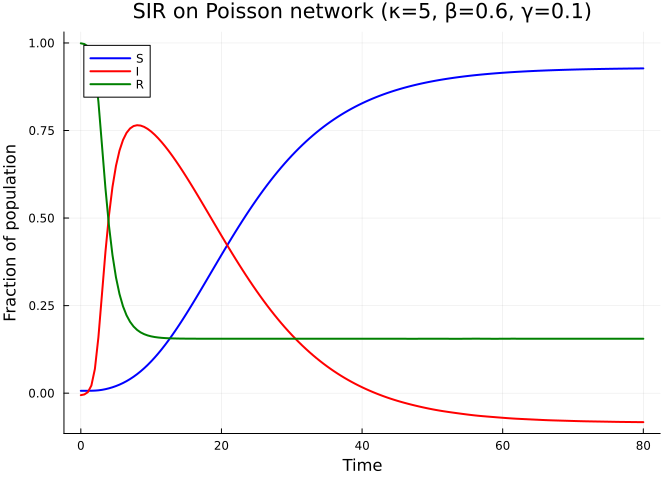
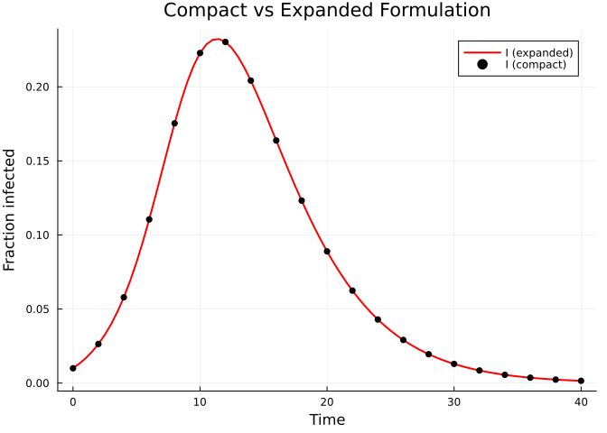
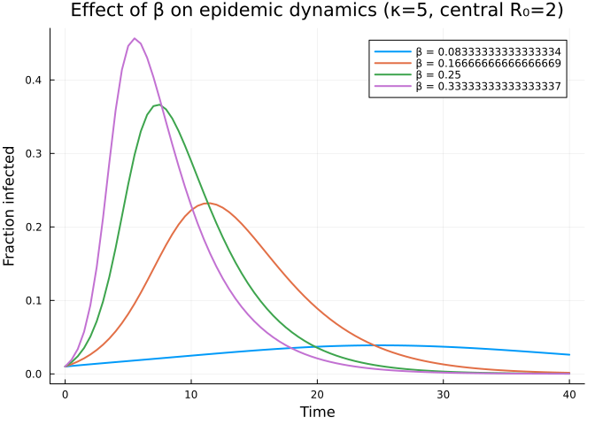
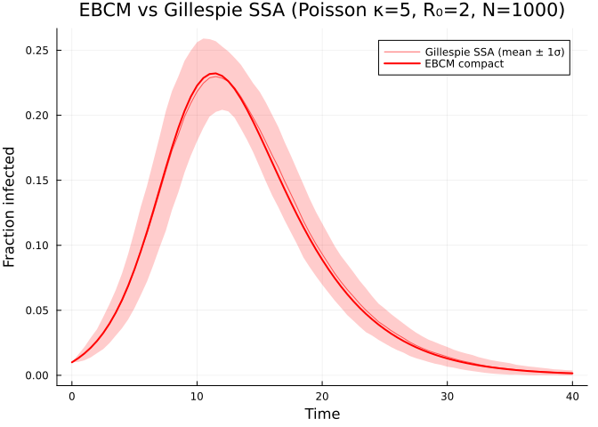

- [SIR Model on a Network](#sir-model-on-a-network)
  - [Introduction](#introduction)
  - [Setup](#setup)
  - [Defining the network](#defining-the-network)
  - [Building the compact SIR model](#building-the-compact-sir-model)
  - [Solving the ODE](#solving-the-ode)
  - [Expanded formulation](#expanded-formulation)
  - [Effect of transmission rate](#effect-of-transmission-rate)
  - [Simulation validation](#simulation-validation)
  - [Summary](#summary)

# SIR Model on a Network

Simon Frost 2026-05-14

- [Introduction](#introduction)
- [Setup](#setup)
- [Defining the network](#defining-the-network)
- [Building the compact SIR model](#building-the-compact-sir-model)
- [Solving the ODE](#solving-the-ode)
- [Expanded formulation](#expanded-formulation)
- [Effect of transmission rate](#effect-of-transmission-rate)
- [Simulation validation](#simulation-validation)
- [Summary](#summary)

## Introduction

Edge-based compartmental models (EBCMs) provide an exact, deterministic
framework for tracking epidemics on configuration-model networks.
Instead of simulating individual transmission events, we track the
probability $\theta(t)$ that a random edge in the network has *not*
transmitted infection by time $t$.

Combined with the network’s **probability generating function (PGF)**
$\psi(x) = \sum_k p_k x^k$ — which encodes the degree distribution — we
can derive the fraction susceptible as $S(t) = \psi(\theta(t))$ and the
fraction recovered $R(t)$ from a small system of ODEs.

The **compact formulation** (Miller 2011) for SIR on a configuration
model network requires just two ODEs:

$$\dot{\theta} = -\beta\theta + \beta\frac{\psi'(\theta)}{\psi'(1)} + \gamma(1 - \theta)$$

$$\dot{R} = \gamma\left(1 - \psi(\theta) - R\right)$$

where $\beta$ is the per-edge transmission rate and $\gamma$ is the
recovery rate.

## Setup

``` julia
using EdgeBasedModels
using ModelingToolkit
using OrdinaryDiffEq
using Symbolics
using Plots
```

## Defining the network

We model a Poisson (Erdős–Rényi) network with mean degree $\kappa = 5$.
The PGF is $\psi(x) = e^{\kappa(x-1)}$.

``` julia
@parameters β γ κ
pgf = poisson_pgf(κ)
```

    DegreePGF(z, exp((-1 + z)*κ))

We can verify the mean degree:

``` julia
md = mean_degree(pgf)
println("Mean degree: ", md)
```

    Mean degree: exp(0)*κ

## Building the compact SIR model

The `build_sir` function constructs the edge-based ODE system. The
`:compact` form produces just 2 ODEs.

``` julia
model_compact = build_sir(pgf, β, γ; form = :compact)
eqs = ModelingToolkit.equations(model_compact.system)
println("Number of ODEs: ", length(eqs))
for eq in eqs
    println("  ", eq)
end
```

    Number of ODEs: 2
      Differential(t, 1)(R(t)) ~ (1 - R(t) - exp((-1 + θ(t))*κ)*(1 - ρ))*γ
      Differential(t, 1)(θ(t)) ~ (θ(t)*exp(0)*β - (1 - θ(t))*exp(0)*γ - exp((-1 + θ(t))*κ)*β*(1 - ρ)) / (-exp(0))

The model returns an `EdgeModelSystem` with the compiled system, a
dictionary of state variables, and a dictionary of observables:

``` julia
println("State variables: ", keys(model_compact.variables))
println("Observables:     ", keys(model_compact.observables))
```

    State variables: [:R, :θ]
    Observables:     [:I, :ψ_θ, :S]

## Solving the ODE

We anchor this network example to the well-mixed reference $R_0 = 2$
with $\gamma = 0.25$ and 1% initial infection. For a Poisson
configuration model, $\kappa_{\mathrm{excess}} = \kappa$, so
$T = R_0/\kappa$ and $\beta = T\gamma/(1-T)$.

> \[!NOTE\]
>
> **$R_0=2$ anchor.** Here $\kappa=5$, so $T=2/5$ and the comparable
> per-edge transmission rate is $\beta=1/6 \approx 0.1667$, not the
> well-mixed mass-action value 0.5.

``` julia
γ_val = 0.25
R0_target = 2.0
seed_fraction = 0.01
κ_val = 5.0
κ_excess = κ_val
T_val = R0_target / κ_excess
β_val = T_val * γ_val / (1 - T_val)
tspan = (0.0, 40.0)
prob = ODEProblem(
    model_compact.system,
    merge(
        default_initial_conditions(model_compact; seed_fraction = seed_fraction),
        Dict(β => β_val, γ => γ_val, κ => κ_val),
    ),
    tspan,
)
sol = solve(prob, Tsit5(); saveat = 0.5)
```

    retcode: Success
    Interpolation: 1st order linear
    t: 81-element Vector{Float64}:
      0.0
      0.5
      1.0
      1.5
      2.0
      2.5
      3.0
      3.5
      4.0
      4.5
      ⋮
     36.0
     36.5
     37.0
     37.5
     38.0
     38.5
     39.0
     39.5
     40.0
    u: 81-element Vector{Vector{Float64}}:
     [0.0, 1.0]
     [0.0014399022179882608, 0.999075792702776]
     [0.00330479052210804, 0.9979444829456798]
     [0.0056728644346913685, 0.996562885045385]
     [0.00863739812055364, 0.9948803888053457]
     [0.012307957084511942, 0.9928384407788843]
     [0.016811022635182794, 0.9903704200407923]
     [0.022289888351670357, 0.9874019493657514]
     [0.028902800006613685, 0.9838523020427158]
     [0.03681937099827079, 0.9796367017029504]
     ⋮
     [0.7960875142237877, 0.6804095336702449]
     [0.7965164504916639, 0.6803518307408477]
     [0.7969001315406488, 0.6803019558484034]
     [0.797243362317418, 0.6802588294883605]
     [0.7975506516640795, 0.6802213207016677]
     [0.7978262123181731, 0.6801882470747744]
     [0.798073960912671, 0.6801583747396305]
     [0.7982973825194334, 0.6801305764435367]
     [0.7984980206635619, 0.6801056384400187]

Now we extract the population-level quantities using the model’s named
variables and observables rather than assuming a positional ordering in
the ODE state vector. For a Poisson PGF,
$S(t) = \psi(\theta(t)) = e^{\kappa(\theta - 1)}$:

``` julia
S_vals = compartment(sol, model_compact, :S)
I_vals = compartment(sol, model_compact, :I)
R_vals = compartment(sol, model_compact, :R)
```

    81-element Vector{Float64}:
     0.0
     0.0014399022179882608
     0.00330479052210804
     0.0056728644346913685
     0.00863739812055364
     0.012307957084511942
     0.016811022635182794
     0.022289888351670357
     0.028902800006613685
     0.03681937099827079
     ⋮
     0.7960875142237877
     0.7965164504916639
     0.7969001315406488
     0.797243362317418
     0.7975506516640795
     0.7978262123181731
     0.798073960912671
     0.7982973825194334
     0.7984980206635619

``` julia
plot(sol.t, S_vals, label = "S", linewidth = 2, color = :blue)
plot!(sol.t, I_vals, label = "I", linewidth = 2, color = :red)
plot!(sol.t, R_vals, label = "R", linewidth = 2, color = :green)
xlabel!("Time")
ylabel!("Fraction of population")
title!("SIR on Poisson network (κ=5, R₀=2, γ=0.25)")
```

<div id="fig-sir-compact">



Figure 1: Figure 1: SIR epidemic on a Poisson network (compact
formulation).

</div>

## Expanded formulation

The **expanded** form tracks edge-level probabilities $\varphi_I$ and
$\varphi_R$ explicitly, plus the population-level $R$. This form
generalises to arbitrary disease progression graphs.

``` julia
model_expanded = build_sir(pgf, β, γ; form = :expanded)
eqs_exp = ModelingToolkit.equations(model_expanded.system)
println("Number of ODEs: ", length(eqs_exp))
for eq in eqs_exp
    println("  ", eq)
end
```

    Number of ODEs: 5
      Differential(t, 1)(pop_R(t)) ~ pop_I(t)*γ
      Differential(t, 1)(pop_I(t)) ~ -pop_I(t)*γ + exp((-1 + θ(t))*κ)*phi_I(t)*β*κ*(1 - ρ)
      Differential(t, 1)(phi_R(t)) ~ phi_I(t)*γ
      Differential(t, 1)(phi_I(t)) ~ (exp(0)*phi_I(t)*(β + γ) - exp((-1 + θ(t))*κ)*phi_I(t)*β*κ*(1 - ρ)) / (-exp(0))
      Differential(t, 1)(θ(t)) ~ -phi_I(t)*β

``` julia
println("State variables: ", keys(model_expanded.variables))
println("Observables:     ", keys(model_expanded.observables))
```

    State variables: [:R, :φ_I, :pop_I, :pop_R, :φ_R, :θ]
    Observables:     [:I, :φ_S, :S, :edge_hazard, :excess_hazard]

Let us solve the expanded model and verify it gives the same epidemic
curve:

``` julia
ic_exp = default_initial_conditions(model_expanded; seed_fraction = seed_fraction)
prob_exp = ODEProblem(
    model_expanded.system,
    merge(ic_exp, Dict(β => β_val, γ => γ_val, κ => κ_val)),
    tspan,
)
sol_exp = solve(prob_exp, Tsit5(); saveat = 0.5)
```

    retcode: Success
    Interpolation: 1st order linear
    t: 81-element Vector{Float64}:
      0.0
      0.5
      1.0
      1.5
      2.0
      2.5
      3.0
      3.5
      4.0
      4.5
      ⋮
     36.0
     36.5
     37.0
     37.5
     38.0
     38.5
     39.0
     39.5
     40.0
    u: 81-element Vector{Vector{Float64}}:
     [0.0, 0.01, 0.0, 0.010000000000000009, 1.0]
     [0.0014399021800027027, 0.013124369819446343, 0.0013863109159751282, 0.012253753806157173, 0.9990757927226832]
     [0.0033047901645029336, 0.01681791158651909, 0.0030832753103818126, 0.01498390956705235, 0.9979444831264122]
     [0.005672864702126067, 0.021195490791553893, 0.005155672162749445, 0.018275568555764236, 0.9965628852248337]
     [0.00863740207248379, 0.0263830776965177, 0.007679420099055623, 0.022221446270575464, 0.9948803866006296]
     [0.012307952116939545, 0.03251456778473225, 0.010742331291598753, 0.026918634415673885, 0.9928384458056009]
     [0.016811057190712315, 0.03972614363734476, 0.014444399387922628, 0.032463201848186046, 0.9903704004080516]
     [0.022289842075696027, 0.04814678864155626, 0.018897010509642164, 0.03894161320118203, 0.9874019929935719]
     [0.02890284518272257, 0.057886865488587506, 0.02422158315342181, 0.04642040541560708, 0.9838522778977188]
     [0.0368194963915917, 0.06901747344189575, 0.030545014622238725, 0.054928612129756256, 0.9796366569185075]
     ⋮
     [0.7960656312947881, 0.0036319120902206232, 0.47937294990871615, 0.0007426268704818869, 0.6804180333941892]
     [0.7964958825820977, 0.003259850023623062, 0.4794601169114641, 0.0006555377532806318, 0.680359922059024]
     [0.7968821762595986, 0.0029250032926672886, 0.47953720557188295, 0.0005785035991277056, 0.6803085296187447]
     [0.797228794589716, 0.0026237977994360245, 0.47960526939140097, 0.0005104767368171542, 0.680263153739066]
     [0.797539615221106, 0.002353022268818482, 0.4796653014059664, 0.00045046847998050015, 0.6802231323960224]
     [0.7978182242985102, 0.0021097070007974703, 0.47971822088616284, 0.0003975631557031039, 0.6801878527425581]
     [0.7980679164627564, 0.00189112387044939, 0.479764873337209, 0.00035091810452416296, 0.6801567511085274]
     [0.7982916948507572, 0.0016947863279442395, 0.4798060304989589, 0.0003097636804367131, 0.680129313000694]
     [0.7984922710955112, 0.001518449398545614, 0.4798423903459016, 0.0002734032508876271, 0.6801050731027323]

``` julia
S_exp = compartment(sol_exp, model_expanded, :S)
I_exp = compartment(sol_exp, model_expanded, :I)
```

    81-element Vector{Float64}:
     0.01
     0.013124369819446343
     0.01681791158651909
     0.021195490791553893
     0.0263830776965177
     0.03251456778473225
     0.03972614363734476
     0.04814678864155626
     0.057886865488587506
     0.06901747344189575
     ⋮
     0.0036319120902206232
     0.003259850023623062
     0.0029250032926672886
     0.0026237977994360245
     0.002353022268818482
     0.0021097070007974703
     0.00189112387044939
     0.0016947863279442395
     0.001518449398545614

``` julia
plot(sol_exp.t, I_exp, label = "I (expanded)", linewidth = 2, color = :red)
scatter!(sol.t[1:4:end], I_vals[1:4:end], label = "I (compact)",
         markershape = :circle, markersize = 4, markerstrokewidth = 0,
         color = :black)
xlabel!("Time")
ylabel!("Fraction infected")
title!("Compact vs Expanded Formulation")
```

<div id="fig-sir-comparison">



Figure 2: Figure 2: Expanded (line) and compact (markers) formulations
overlap exactly.

</div>

The two formulations give identical epidemic curves, confirming that the
compact form (2 ODEs) is an exact reduction of the expanded form (5 ODEs
after `mtkcompile`) for SIR.

## Effect of transmission rate

``` julia
betas = β_val .* [0.5, 1.0, 1.5, 2.0]
p = plot(xlabel = "Time", ylabel = "Fraction infected",
         title = "Effect of β on epidemic dynamics (κ=5, central R₀=2)")

for b in betas
    prob_b = ODEProblem(
        model_compact.system,
        merge(
            default_initial_conditions(model_compact; seed_fraction = seed_fraction),
            Dict(β => b, γ => γ_val, κ => κ_val),
        ),
        tspan,
    )
    sol_b = solve(prob_b, Tsit5(); saveat = 0.5)
    I_b = compartment(sol_b, model_compact, :I)
    plot!(p, sol_b.t, I_b, label = "β = $b", linewidth = 2)
end
p
```

<div id="fig-sir-beta">



Figure 3: Figure 3: Effect of transmission rate β on the epidemic curve.

</div>

## Simulation validation

To check that the deterministic EBCM is consistent with stochastic
dynamics on a finite network, we simulate the same SIR process with the
Gillespie SSA provided by
[`NetworkOutbreaks.jl`](https://github.com/sdwfrost/NetworkOutbreaks.jl)
on Erdős–Rényi graphs with the same mean degree $\kappa = 5$, and
overlay the ensemble mean and $\pm 1\sigma$ band on the EBCM prediction.

To reduce conditioning on a single graph realisation, we average across
several independent host graphs as well as across stochastic epidemic
realisations on each.

``` julia
using NetworkOutbreaks
using Graphs
using StableRNGs
using Statistics

N = 1000
n_graphs = 5
nsims_per_graph = 20
rng_host = StableRNG(20240501)

prog = sir_model()
no_model = OutbreakModel(prog, Dict(:β => β_val, :γ => γ_val))

tgrid = collect(0.0:0.5:40.0)
I_idx = no_model.index_of[:I]

I_runs = Matrix{Float64}(undef, n_graphs * nsims_per_graph, length(tgrid))
row = 1
for gi in 1:n_graphs
    g = erdos_renyi(N, κ_val / (N - 1); rng = rng_host)
    spec = OutbreakSpec(model = no_model, network = g,
                        initial = SeedFraction(:I => seed_fraction),
                        tspan   = (0.0, 40.0))
    ens = simulate_ensemble(spec; nsims = nsims_per_graph,
                            seed = 20240501 + 1000 * gi,
                            parallel = true)
    for traj in ens.trajectories
        for (j, t) in enumerate(tgrid)
            I_runs[row, j] = Float64(state_at(traj, t)[I_idx])
        end
        row += 1
    end
end

μI = vec(mean(I_runs; dims = 1)) ./ N
σI = vec(std(I_runs;  dims = 1)) ./ N
```

    81-element Vector{Float64}:
     0.0
     0.0027703152283894456
     0.00512644165483272
     0.0075654985081465495
     0.009203968182421661
     0.012363595142533778
     0.015003110788544266
     0.017516776950896953
     0.02104821545255972
     0.025202330740379444
     ⋮
     0.003592627130244621
     0.003355742853826869
     0.003159257680359279
     0.0028562177434467073
     0.0026376259604179485
     0.0023066657908563763
     0.002279819237916848
     0.0020581446975272647
     0.0019847906537954927

``` julia
plot(tgrid, μI, ribbon = σI, label = "Gillespie SSA (mean ± 1σ)",
     color = :red, fillalpha = 0.2, linealpha = 0.6, linewidth = 1)
plot!(sol.t, I_vals, label = "EBCM compact",
      color = :red, linewidth = 2)
xlabel!("Time")
ylabel!("Fraction infected")
title!("EBCM vs Gillespie SSA (Poisson κ=5, R₀=2, N=$N)")
```

<div id="fig-sir-validation">



Figure 4: Figure 4: EBCM prediction (red line) versus Gillespie SSA on
Erdős–Rényi graphs (red ribbon: mean ± 1σ across \$n_graphs ×
\$nsims_per_graph runs at N=1000).

</div>

The deterministic EBCM curve sits inside the stochastic ribbon
throughout the epidemic, confirming that the configuration-model closure
correctly predicts the mean prevalence on this network ensemble.

## Summary

- The **compact** formulation produces 2 ODEs and is the most efficient
  for SIR on static networks.
- The **expanded** formulation produces $1 + 2M$ ODEs (where $M$ is the
  number of non-susceptible stages, so 5 ODEs for SIR) but generalises
  to arbitrary disease progression graphs (SEIR, multi-stage, etc.).
- Both formulations give identical results for SIR.
- The PGF encodes the network’s degree distribution — we used a Poisson
  PGF here, but the package supports arbitrary degree distributions via
  `polynomial_pgf`.
- The EBCM ODE prediction agrees with Gillespie SSA on finite
  Erdős–Rényi graphs with matching mean degree.
