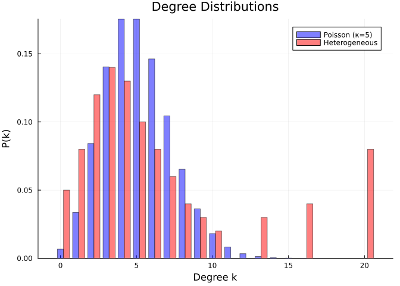
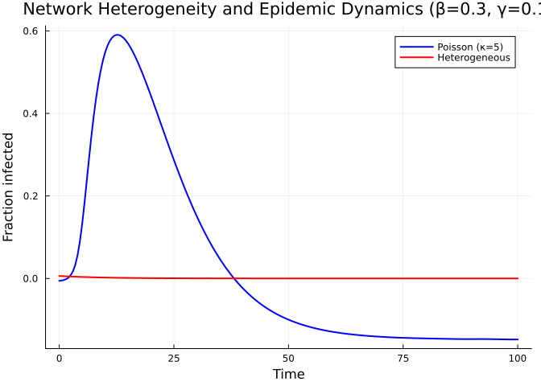
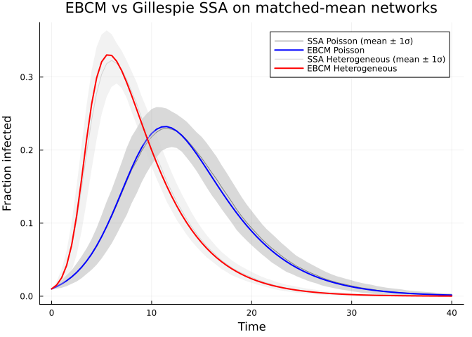

- [Effect of Network Structure](#effect-of-network-structure)
  - [Introduction](#introduction)
  - [Setup](#setup)
  - [Poisson network](#poisson-network)
  - [Heterogeneous network](#heterogeneous-network)
  - [Visualising the degree
    distributions](#visualising-the-degree-distributions)
  - [R₀ comparison](#r₀-comparison)
  - [Epidemic dynamics comparison](#epidemic-dynamics-comparison)
  - [Why does variance matter?](#why-does-variance-matter)
  - [Simulation validation](#simulation-validation)
  - [Summary](#summary)

# Effect of Network Structure

Simon Frost 2026-05-14

- [Introduction](#introduction)
- [Setup](#setup)
- [Poisson network](#poisson-network)
- [Heterogeneous network](#heterogeneous-network)
- [Visualising the degree
  distributions](#visualising-the-degree-distributions)
- [R₀ comparison](#r₀-comparison)
- [Epidemic dynamics comparison](#epidemic-dynamics-comparison)
- [Why does variance matter?](#why-does-variance-matter)
- [Simulation validation](#simulation-validation)
- [Summary](#summary)

## Introduction

The degree distribution of a contact network fundamentally shapes
epidemic dynamics. In a homogeneous (mass-action) model, every
individual has the same contact rate. On a network, individuals vary in
their number of connections (degree), and this heterogeneity has
profound effects.

The key quantity linking network structure to epidemic threshold is the
**excess degree ratio**:

$$\frac{\psi''(1)}{\psi'(1)} = \frac{\langle k^2 \rangle}{\langle k \rangle} - 1 = \frac{\text{Var}(k)}{\langle k \rangle} + \langle k \rangle - 1$$

Higher degree variance lowers the epidemic threshold and increases
$R_0$, even when mean degree is held constant.

## Setup

``` julia
using EdgeBasedModels
using ModelingToolkit
using OrdinaryDiffEq
using Symbolics
using Plots
```

## Poisson network

A Poisson (Erdős–Rényi) network with mean degree $\kappa$ has PGF
$\psi(x) = e^{\kappa(x-1)}$. Its degree distribution has
$\text{Var}(k) = \kappa$, so the excess degree equals $\kappa$.

``` julia
@parameters β γ κ
pgf_poisson = poisson_pgf(κ)
println("PGF expression: ", pgf_poisson.expression)
println("Mean degree:     ", mean_degree(pgf_poisson))
```

    PGF expression: exp((-1 + z)*κ)
    Mean degree:     exp(0)*κ

``` julia
# Excess degree at z=1: ψ''(1)/ψ'(1)
d1 = pgf_derivative(pgf_poisson, 1)
d2 = pgf_derivative(pgf_poisson, 2)
println("ψ'(z) = ", d1)
println("ψ''(z) = ", d2)
```

    ψ'(z) = exp((-1 + z)*κ)*κ
    ψ''(z) = exp((-1 + z)*κ)*(κ^2)

## Heterogeneous network

We construct a polynomial PGF with the **same mean degree**
($\langle k \rangle = 5$) but **higher variance**. This mimics a network
with a mix of low-degree and high-degree nodes.

``` julia
# Degree distribution: p_k for k = 0, 1, 2, ..., 20
# Designed to have mean 5 but with a heavy tail
probs = zeros(21)
probs[1] = 0.05   # k=0
probs[2] = 0.08   # k=1
probs[3] = 0.12   # k=2
probs[4] = 0.14   # k=3
probs[5] = 0.13   # k=4
probs[6] = 0.10   # k=5
probs[7] = 0.08   # k=6
probs[8] = 0.06   # k=7
probs[9] = 0.04   # k=8
probs[10] = 0.03  # k=9
probs[11] = 0.02  # k=10
probs[14] = 0.03  # k=13
probs[17] = 0.04  # k=16
probs[21] = 0.08  # k=20

# Normalise and verify
probs ./= sum(probs)
mean_k = sum((i - 1) * probs[i] for i in eachindex(probs))
var_k = sum((i - 1)^2 * probs[i] for i in eachindex(probs)) - mean_k^2
println("Sum: ", round(sum(probs); digits = 6))
println("Mean degree: ", round(mean_k; digits = 2))
println("Variance: ", round(var_k; digits = 2))
```

    Sum: 1.0
    Mean degree: 6.08
    Variance: 29.55

``` julia
pgf_hetero = polynomial_pgf(probs)
println("Mean degree (from PGF): ", Symbolics.value(mean_degree(pgf_hetero)))
```

    Mean degree (from PGF): 6.08

## Visualising the degree distributions

``` julia
ks = 0:20
poisson_probs = [exp(-5.0) * 5.0^k / factorial(k) for k in ks]

bar(ks, poisson_probs, alpha = 0.5, label = "Poisson (κ=5)", bar_width = 0.4,
    color = :blue)
bar!(ks .+ 0.4, probs, alpha = 0.5, label = "Heterogeneous", bar_width = 0.4,
     color = :red)
xlabel!("Degree k")
ylabel!("P(k)")
title!("Degree Distributions")
```

<div id="fig-degree-dist">



Figure 1: Figure 1: Poisson vs heterogeneous degree distributions with
the same mean (≈5).

</div>

## R₀ comparison

For the edge-based model,
$R_0 = \frac{\beta}{\beta + \gamma} \cdot \frac{\psi''(1)}{\psi'(1)}$.
The excess degree ratio $\psi''(1)/\psi'(1)$ is the key
network-dependent factor.

> \[!NOTE\]
>
> **$R_0=2$ anchor.** We choose $\gamma=0.25$ and compute the per-edge
> $\beta$ from the Poisson $\kappa=5$ baseline: $T=2/5$ and $\beta=1/6$.
> Reusing that $\beta$ on the heterogeneous network demonstrates how
> degree variance changes $R_0$.

``` julia
# Poisson: excess degree = κ
poisson_excess = 5.0  # ψ''(1)/ψ'(1) = κ for Poisson

# Heterogeneous: compute numerically
d1_het = pgf_derivative(pgf_hetero, 1)
d2_het = pgf_derivative(pgf_hetero, 2)
d1_at_1 = Symbolics.value(Symbolics.substitute(d1_het, Dict(pgf_hetero.variable => 1)))
d2_at_1 = Symbolics.value(Symbolics.substitute(d2_het, Dict(pgf_hetero.variable => 1)))
hetero_excess = d2_at_1 / d1_at_1

println("Poisson excess degree:       ", poisson_excess)
println("Heterogeneous excess degree:  ", round(hetero_excess; digits = 2))

γ_val = 0.25
R0_target = 2.0
seed_fraction = 0.01
T_pois = R0_target / poisson_excess
β_val = T_pois * γ_val / (1 - T_pois)
T = β_val / (β_val + γ_val)
println("\nR₀=2 anchor uses β = ", round(β_val; digits = 4), " for the Poisson κ=5 baseline")
println("Transmissibility T = β/(β+γ) = ", round(T; digits = 4))
println("R₀ (Poisson):       ", round(T * poisson_excess; digits = 2))
println("R₀ (Heterogeneous, same β): ", round(T * hetero_excess; digits = 2))
```

    Poisson excess degree:       5.0
    Heterogeneous excess degree:  9.94

    R₀=2 anchor uses β = 0.1667 for the Poisson κ=5 baseline
    Transmissibility T = β/(β+γ) = 0.4
    R₀ (Poisson):       2.0
    R₀ (Heterogeneous, same β): 3.98

The heterogeneous network has a higher $R_0$ despite having the same
mean degree, because its higher degree variance increases the excess
degree ratio.

## Epidemic dynamics comparison

``` julia
tspan = (0.0, 40.0)
ψ_poisson(x) = exp(5.0 * (x - 1))

# Poisson model
model_pois = build_sir(pgf_poisson, β, γ; form = :compact)
prob_pois = ODEProblem(
    model_pois.system,
    merge(
        default_initial_conditions(model_pois; seed_fraction = seed_fraction),
        Dict(β => β_val, γ => γ_val, κ => 5.0),
    ),
    tspan,
)
sol_pois = solve(prob_pois, Tsit5(); saveat = 0.5)
S_pois = compartment(sol_pois, model_pois, :S)
I_pois = compartment(sol_pois, model_pois, :I)
R_pois = compartment(sol_pois, model_pois, :R)
```

    81-element Vector{Float64}:
     0.0
     0.0014399022179882608
     0.00330479052210804
     0.0056728644346913685
     0.00863739812055364
     0.012307957084511942
     0.016811022635182794
     0.022289888351670357
     0.028902800006613685
     0.03681937099827079
     ⋮
     0.7960875142237877
     0.7965164504916639
     0.7969001315406488
     0.797243362317418
     0.7975506516640795
     0.7978262123181731
     0.798073960912671
     0.7982973825194334
     0.7984980206635619

``` julia
# Heterogeneous model — use the polynomial PGF directly
model_het = build_sir(pgf_hetero, β, γ; form = :expanded)

# Get initial conditions
ic_het = default_initial_conditions(model_het; seed_fraction = seed_fraction)

prob_het = ODEProblem(
    model_het.system,
    merge(ic_het, Dict(β => β_val, γ => γ_val)),
    tspan,
)
sol_het = solve(prob_het, Tsit5(); saveat = 0.5)

S_het = compartment(sol_het, model_het, :S)
I_het = compartment(sol_het, model_het, :I)
R_het = compartment(sol_het, model_het, :R)
```

    81-element Vector{Float64}:
     0.0
     0.0015469452452715098
     0.0040152679412769786
     0.008131500123859041
     0.015010000737345595
     0.02612349374898912
     0.04297471726756036
     0.066473173160712
     0.09644763945236783
     0.1317156875580321
     ⋮
     0.7647485136079386
     0.7648087141384224
     0.7648619732856607
     0.7649090423607134
     0.7649506169931144
     0.7649873371308716
     0.7650197870404674
     0.765048495306858
     0.7650739060197903

``` julia
plot(sol_pois.t, I_pois, label = "Poisson (κ=5)", linewidth = 2, color = :blue)
plot!(sol_het.t, I_het, label = "Heterogeneous", linewidth = 2, color = :red)
xlabel!("Time")
ylabel!("Fraction infected")
title!("Network Heterogeneity and Dynamics (Poisson baseline R₀=2)")
```

<div id="fig-epidemic-comparison">



Figure 2: Figure 2: Epidemic curves for Poisson vs heterogeneous
networks with the same mean degree.

</div>

<div id="fig-finalsize-comparison">

``` julia
plot(sol_pois.t, R_pois, label = "R (Poisson)", linewidth = 2, color = :blue)
plot!(sol_het.t, R_het, label = "R (Heterogeneous)", linewidth = 2, color = :red)
xlabel!("Time")
ylabel!("Fraction recovered (final size)")
title!("Cumulative Infections")

println("Final size (Poisson):       ", round(R_pois[end]; digits = 3))
println("Final size (Heterogeneous): ", round(R_het[end]; digits = 3))
```

<div class="cell-output cell-output-stdout">

    Final size (Poisson):       0.798
    Final size (Heterogeneous): 0.765

</div>

Figure 3: Figure 3

</div>

## Why does variance matter?

The excess degree ratio can be decomposed as:

$$\frac{\psi''(1)}{\psi'(1)} = \frac{\langle k(k-1) \rangle}{\langle k \rangle} = \frac{\langle k^2 \rangle - \langle k \rangle}{\langle k \rangle} = \frac{\text{Var}(k) + \langle k \rangle^2 - \langle k \rangle}{\langle k \rangle}$$

For fixed mean degree $\langle k \rangle$, increasing the variance
increases the excess degree ratio and therefore $R_0$. Intuitively,
high-degree nodes act as superspreaders: they are more likely to be
reached by the epidemic (since they have more edges) and can transmit to
many contacts.

This is a key result from network epidemiology: **heterogeneity in the
number of contacts always makes epidemics worse**, even when the average
number of contacts is the same.

## Simulation validation

We validate both ODE predictions against Gillespie SSA on host graphs
drawn from the matching degree distributions, using
`NetworkOutbreaks.jl`.

``` julia
include("../_validation.jl")

prog = sir_model()
params = Dict(:β => β_val, :γ => γ_val)

t_pois, μ_pois, σ_pois = gillespie_ribbon(
    prog, params, poisson_graph_builder(1000, 5.0);
    N = 1000, n_graphs = 5, nsims_per_graph = 20,
    tspan = tspan, seed_fraction = seed_fraction)

t_het, μ_het, σ_het = gillespie_ribbon(
    prog, params, configuration_graph_builder(1000, probs);
    N = 1000, n_graphs = 5, nsims_per_graph = 20,
    tspan = tspan, seed_fraction = seed_fraction)
```

    ([0.0, 0.5, 1.0, 1.5, 2.0, 2.5, 3.0, 3.5, 4.0, 4.5  …  35.5, 36.0, 36.5, 37.0, 37.5, 38.0, 38.5, 39.0, 39.5, 40.0], Dict(:I => [0.01, 0.01534, 0.02569, 0.04178, 0.06856, 0.10556, 0.15128, 0.19955, 0.24389, 0.2811  …  0.00067, 0.0005899999999999999, 0.0005, 0.00046, 0.00041999999999999996, 0.0004, 0.00035, 0.00032, 0.0003, 0.00028000000000000003], :R => [0.0, 0.0017, 0.00428, 0.00857, 0.01506, 0.02572, 0.04143, 0.06359000000000001, 0.09178, 0.12508  …  0.76573, 0.76581, 0.7659, 0.7659400000000001, 0.76598, 0.766, 0.76605, 0.7660800000000001, 0.7661, 0.76612], :S => [0.99, 0.9829600000000001, 0.97003, 0.94965, 0.91638, 0.86872, 0.80729, 0.73686, 0.6643300000000001, 0.59382  …  0.2336, 0.2336, 0.2336, 0.2336, 0.2336, 0.2336, 0.2336, 0.2336, 0.2336, 0.2336]), Dict(:I => [0.0, 0.004413523753101588, 0.010833631697523032, 0.019882269650737725, 0.03224317953091206, 0.046674311062203294, 0.057428933685403076, 0.0635721772253532, 0.06351900932362331, 0.05722761571129799  …  0.0008294454761946671, 0.0007666666666666668, 0.0007453559924999299, 0.0007023769168568493, 0.0006541244437251889, 0.0006356417261637283, 0.0006256309946079569, 0.0006175873552900363, 0.0005773502691896258, 0.0005140451577852126], :R => [0.0, 0.0012512619892159139, 0.0021559408173882715, 0.0040082112688526765, 0.007110697588986626, 0.011426603726710432, 0.017733296308915555, 0.024834439674359356, 0.03191325996535235, 0.03918247392171994  …  0.016877966630366278, 0.016864100295831932, 0.01685259923602591, 0.016844397803831915, 0.016858280344139973, 0.016861886973978692, 0.016821327852077277, 0.016822711920604135, 0.01681419554177873, 0.01679603127725912], :S => [0.0, 0.004421983649216649, 0.011566631735166885, 0.02225625550470944, 0.03771819484310221, 0.05653944363777104, 0.07319757337149059, 0.08609672972120874, 0.09269784247758953, 0.09205634857592013  …  0.016801875797155218, 0.016801875797155218, 0.016801875797155218, 0.016801875797155218, 0.016801875797155218, 0.016801875797155218, 0.016801875797155218, 0.016801875797155218, 0.016801875797155218, 0.016801875797155218]))

``` julia
plot(t_pois, μ_pois[:I], ribbon = σ_pois[:I],
     label = "SSA Poisson (mean ± 1σ)", color = :blue, fillalpha = 0.2,
     linealpha = 0.6)
plot!(sol_pois.t, I_pois, label = "EBCM Poisson", color = :blue, linewidth = 2)
plot!(t_het, μ_het[:I], ribbon = σ_het[:I],
     label = "SSA Heterogeneous (mean ± 1σ)", color = :red, fillalpha = 0.2,
     linealpha = 0.6)
plot!(sol_het.t, I_het, label = "EBCM Heterogeneous", color = :red, linewidth = 2)
xlabel!("Time")
ylabel!("Fraction infected")
title!("EBCM vs Gillespie SSA on matched-mean networks")
```

<div id="fig-net-validation">



Figure 4: Figure 4: Gillespie SSA mean ± 1σ ribbon (gray) on each
network type, overlaid with the EBCM I-trajectory (line).

</div>

The deterministic EBCM curves track the SSA ensemble means closely on
both networks, with the heterogeneous-degree variant reaching a higher
peak exactly as predicted by the excess degree ratio.

## Summary

- Networks with higher degree variance have higher $R_0$ and larger
  final epidemic sizes.
- The PGF framework captures this effect exactly through the excess
  degree ratio $\psi''(1)/\psi'(1)$.
- `polynomial_pgf` supports arbitrary degree distributions, while
  `poisson_pgf` provides the Poisson case.
