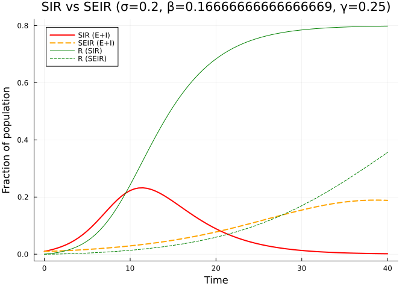
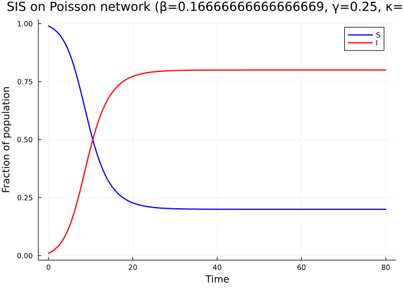
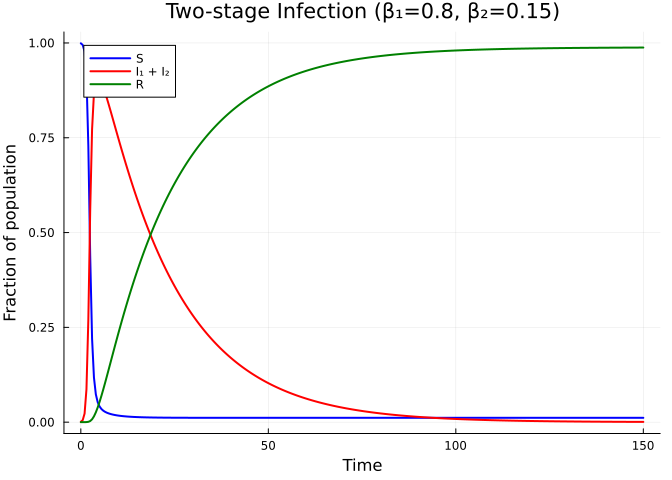
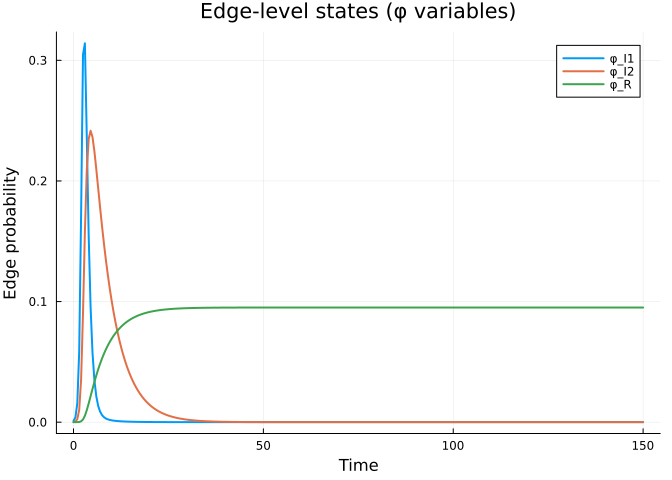
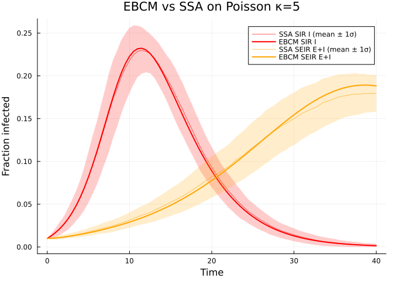
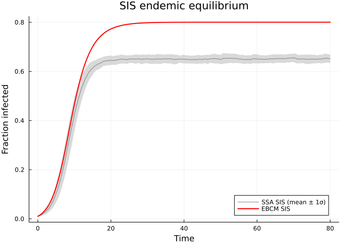

# Complex Disease Models
Simon Frost
2026-05-14

- [Introduction](#introduction)
- [Setup](#setup)
- [SEIR model](#seir-model)
- [Comparing SIR and SEIR](#comparing-sir-and-seir)
- [SIS model](#sis-model)
- [Custom multi-stage infection](#custom-multi-stage-infection)
- [Edge-level dynamics](#edge-level-dynamics)
- [Simulation validation](#simulation-validation)
- [Summary](#summary)

## Introduction

The expanded edge-based formulation is not limited to SIR — it handles
arbitrary disease progression graphs. Each disease stage that can
transmit infection gets its own edge-level probability $\varphi$, and
the package automatically constructs the full system of ODEs.

This vignette demonstrates:

- **SEIR**: adding a latent (exposed) period
- **SIS**: endemic dynamics without lasting immunity
- **Multi-stage infections**: acute and chronic infectious periods with
  different transmission rates

## Setup

``` julia
using EdgeBasedModels
using ModelingToolkit
using OrdinaryDiffEq
using Symbolics
using Plots
```

``` julia
@parameters β γ κ
pgf = poisson_pgf(κ)
κ_val = 5.0
ψ(x) = exp(κ_val * (x - 1))
tspan = (0.0, 40.0)
γ_val = 0.25
R0_target = 2.0
seed_fraction = 0.001
T_val = R0_target / κ_val
β_val = T_val * γ_val / (1 - T_val)
```

    0.16666666666666669

## SEIR model

> [!NOTE]
>
> **$R_0=2$ anchor.** Generic SIR/SIS comparisons use $\gamma=0.25$, 1%
> seeding, and Poisson $\kappa=5$, giving $T=2/5$ and per-edge
> $\beta=1/6$. The SEIR latent period changes timing but not this
> transmissibility-based $R_0$.

The SEIR model adds an exposed (latent) class $E$ between $S$ and $I$.
Exposed individuals are infected but not yet infectious. The transition
rate from $E$ to $I$ is $\sigma$ (so the mean latent period is
$1/\sigma$).

$$S \xrightarrow{\text{infection}} E \xrightarrow{\sigma} I \xrightarrow{\gamma} R$$

``` julia
@parameters σ
model_seir = build_seir(pgf, σ, β, γ)
eqs = ModelingToolkit.equations(model_seir.system)
println("SEIR: $(length(eqs)) ODEs")
for eq in eqs
    println("  ", eq)
end
```

    SEIR: 7 ODEs
      Differential(t, 1)(pop_R(t)) ~ pop_I(t)*γ
      Differential(t, 1)(pop_I(t)) ~ -pop_I(t)*γ + pop_E(t)*σ
      Differential(t, 1)(pop_E(t)) ~ -pop_E(t)*σ + exp((-1 + θ(t))*κ)*phi_I(t)*β*κ*(1 - ρ)
      Differential(t, 1)(phi_R(t)) ~ phi_I(t)*γ
      Differential(t, 1)(phi_I(t)) ~ phi_E(t)*σ - phi_I(t)*(β + γ)
      Differential(t, 1)(phi_E(t)) ~ (phi_E(t)*exp(0)*σ - exp((-1 + θ(t))*κ)*phi_I(t)*β*κ*(1 - ρ)) / (-exp(0))
      Differential(t, 1)(θ(t)) ~ -phi_I(t)*β

The SEIR model has 5 ODEs: $\theta$, $\varphi_E$, $\varphi_I$,
$\varphi_R$, and $R$.

> [!NOTE]
>
> At the population level, the model tracks $S = \psi(\theta)$, $R$, and
> the combined “infected” fraction $E + I = 1 - S - R$. The edge-level
> variables $\varphi_E$ and $\varphi_I$ track the probability that a
> random neighbor is in each stage, providing more granular information
> than the population-level quantities.

``` julia
σ_val = 0.2  # mean latent period = 5 days
ic_seir = default_initial_conditions(model_seir; seed_fraction = seed_fraction)
prob_seir = ODEProblem(
    model_seir.system,
    merge(ic_seir, Dict(β => β_val, γ => γ_val, σ => σ_val, κ => κ_val)),
    tspan,
)
sol_seir = solve(prob_seir, Tsit5(); saveat = 0.5)
```

    retcode: Success
    Interpolation: 1st order linear
    t: 81-element Vector{Float64}:
      0.0
      0.5
      1.0
      1.5
      2.0
      2.5
      3.0
      3.5
      4.0
      4.5
      ⋮
     36.0
     36.5
     37.0
     37.5
     38.0
     38.5
     39.0
     39.5
     40.0
    u: 81-element Vector{Vector{Float64}}:
     [0.0, 0.0, 0.001, 0.0, 0.0, 0.0010000000000000009, 1.0]
     [5.8200364307346075e-6, 8.99705968330323e-5, 0.0009230697834180086, 5.663842297643895e-6, 8.635089610102721e-5, 0.0009230697834180094, 0.9999962241051349]
     [2.18314325313768e-5, 0.00016400937567599238, 0.0008830927823605071, 2.07014922602537e-5, 0.00015133832110694653, 0.0008830927823605078, 0.9999861990051598]
     [4.636044975931468e-5, 0.00022692692884363448, 0.000869543283927657, 4.289515741281265e-5, 0.00020179544958159485, 0.0008695432839276577, 0.9999714032283915]
     [7.824361807906523e-5, 0.0002821423933500482, 0.0008751673942443981, 7.074509961754959e-5, 0.0002424775120665311, 0.0008751673942443988, 0.999952836600255]
     [0.00011667807861464834, 0.00033211410936684533, 0.0008949602883127553, 0.00010324673647809853, 0.0002767142938513299, 0.0008949602883127558, 0.999931168842348]
     [0.00016112776718106626, 0.00037860858997201753, 0.0009255298102396815, 0.00013975211651067729, 0.0003068161629686222, 0.000925529810239682, 0.9999068319223263]
     [0.00021124001260316587, 0.0004229393363750747, 0.0009645323057965187, 0.00017984718757251821, 0.0003344340363573775, 0.0009645323057965191, 0.9998801018749517]
     [0.0002668123134918069, 0.0004660609768358678, 0.0010104535944071172, 0.0002233043749039335, 0.0003606993321544528, 0.0010104535944071178, 0.9998511304167308]
     [0.00032773669029270035, 0.0005087280154649843, 0.0010622363823610292, 0.000270001672470533, 0.00038646191830679687, 0.0010622363823610296, 0.9998199988850197]
     ⋮
     [0.04209952161527771, 0.01835329596155925, 0.03199549851290603, 0.028801255352652547, 0.012450725322416065, 0.03199549851290603, 0.9807991630982317]
     [0.04445145497653023, 0.01927646583398836, 0.0335335755885897, 0.03039657277245678, 0.013066966189757305, 0.0335335755885897, 0.9797356181516955]
     [0.04692138012043531, 0.020237863294278204, 0.03512601408046231, 0.03207077367609244, 0.01370795395455946, 0.03512601408046231, 0.9786194842159384]
     [0.0495138648894706, 0.02123883493460671, 0.036771277070619834, 0.03382658646298627, 0.014375055719100206, 0.036771277070619834, 0.9774489423580092]
     [0.052233663264166126, 0.022280239990147745, 0.0384683520045597, 0.035666956399050015, 0.015068975922563866, 0.0384683520045597, 0.9762220290673]
     [0.055085715363104346, 0.023362450339071136, 0.04021675069118072, 0.03759504561668045, 0.015789756341041412, 0.04021675069118072, 0.9749366362555464]
     [0.05807514744292003, 0.024485350502542625, 0.04201650930278311, 0.039614233114759326, 0.016536776087530448, 0.04201650930278311, 0.9735905112568272]
     [0.06120727189830044, 0.025648337644723938, 0.043868188375068534, 0.04172811475865349, 0.017308751611935246, 0.043868188375068534, 0.9721812568275644]
     [0.06448758726198532, 0.026850321572772777, 0.04577287280714011, 0.04394050328021482, 0.01810373670106674, 0.04577287280714011, 0.9707063311465235]

``` julia
S_seir = compartment(sol_seir, model_seir, :S)
R_seir = compartment(sol_seir, model_seir, :R)
EI_seir = 1.0 .- S_seir .- R_seir  # E + I combined
```

    81-element Vector{Float64}:
     0.0010000000000000009
     0.0010130403803825818
     0.0010471021582875667
     0.0010964702129421737
     0.0011573097888067933
     0.0012270743982618103
     0.0013041384024985025
     0.0013874716430698805
     0.0014765145737077742
     0.0015709644003748869
     ⋮
     0.050348723998371016
     0.052810091799670014
     0.055364020496628946
     0.05801025300421772
     0.060748648293320155
     0.06357914666347099
     0.06650173278380472
     0.0695163964701957
     0.07262309117428513

## Comparing SIR and SEIR

``` julia
# Build SIR for comparison
model_sir = build_sir(pgf, β, γ; form = :expanded)
ic_sir = default_initial_conditions(model_sir; seed_fraction = seed_fraction)
prob_sir = ODEProblem(
    model_sir.system,
    merge(ic_sir, Dict(β => β_val, γ => γ_val, κ => κ_val)),
    tspan,
)
sol_sir = solve(prob_sir, Tsit5(); saveat = 0.5)

S_sir = compartment(sol_sir, model_sir, :S)
I_sir = compartment(sol_sir, model_sir, :I)
R_sir = compartment(sol_sir, model_sir, :R)
```

    81-element Vector{Float64}:
     0.0
     0.00014430664466060414
     0.0003321821817661868
     0.0005724278469447895
     0.0008759755245426545
     0.0012563423418836285
     0.0017301607135635916
     0.0023178504578487834
     0.003044381011402437
     0.0039401158105192065
     ⋮
     0.782710296293347
     0.7841668534879456
     0.7854803945031333
     0.7866641867434654
     0.7877305246909642
     0.7886907299051198
     0.7895551510228892
     0.7903331637586972
     0.7910331565859934

``` julia
plot(sol_sir.t, I_sir, label = "SIR (E+I)", linewidth = 2, color = :red)
plot!(sol_seir.t, EI_seir, label = "SEIR (E+I)", linewidth = 2, color = :orange,
      linestyle = :dash)
plot!(sol_sir.t, R_sir, label = "R (SIR)", linewidth = 1, color = :green)
plot!(sol_seir.t, R_seir, label = "R (SEIR)", linewidth = 1, color = :green,
      linestyle = :dash)
xlabel!("Time")
ylabel!("Fraction of population")
title!("SIR vs SEIR (σ=$σ_val, β=$β_val, γ=$γ_val)")
```

<div id="fig-sir-vs-seir">



Figure 1: SIR vs SEIR: the exposed period delays and flattens the
epidemic peak.

</div>

The exposed period delays the epidemic peak but does not change the
final size (since $R_0$ depends only on the infectious period and
transmission rate, not the latent period).

## SIS model

In the SIS model, individuals recover to the susceptible state — there
is no lasting immunity. This leads to an endemic equilibrium where
$I > 0$ persists indefinitely.

``` julia
model_sis = build_sis(pgf, β, γ)
eqs_sis = ModelingToolkit.equations(model_sis.system)
println("SIS: $(length(eqs_sis)) ODE")
for eq in eqs_sis
    println("  ", eq)
end
```

    SIS: 1 ODE
      Differential(t, 1)(θ(t)) ~ ((θ(t)*exp(0) - exp((-1 + θ(t))*κ)*(1 - ρ))*β - (1 - θ(t))*exp(0)*γ) / (-exp(0))

The SIS model has just 1 ODE for $\theta$, with $S$ and $I$ as
observables.

``` julia
prob_sis = ODEProblem(
    model_sis.system,
    merge(
        default_initial_conditions(model_sis; seed_fraction = seed_fraction),
        Dict(β => β_val, γ => γ_val, κ => κ_val),
    ),
    (0.0, 80.0),
)
sol_sis = solve(prob_sis, Tsit5(); saveat = 0.5)

S_sis = compartment(sol_sis, model_sis, :S)
I_sis = compartment(sol_sis, model_sis, :I)
```

    161-element Vector{Float64}:
     0.0010000000000000009
     0.0014625622654802495
     0.002031625609419052
     0.0027311333255954917
     0.0035910214282975916
     0.004648064969066779
     0.0059458640238653215
     0.007536096359087363
     0.009481434778641162
     0.011861746221835667
     ⋮
     0.7971497465482709
     0.7971500498197466
     0.7971505217642417
     0.7971509389180316
     0.7971513072764642
     0.7971516323867274
     0.7971519193478652
     0.7971521728107928
     0.7971523969783065

``` julia
plot(sol_sis.t, S_sis, label = "S", linewidth = 2, color = :blue)
plot!(sol_sis.t, I_sis, label = "I", linewidth = 2, color = :red)
xlabel!("Time")
ylabel!("Fraction of population")
title!("SIS on Poisson network (β=$β_val, γ=$γ_val, κ=$κ_val)")
```

<div id="fig-sis">



Figure 2: SIS model showing endemic equilibrium.

</div>

Unlike SIR, the infection reaches an endemic equilibrium where a
constant fraction of the population remains infected.

## Custom multi-stage infection

For diseases with multiple infectious stages (e.g., acute followed by
chronic), we build a `DiseaseProgression` directly. Each stage can have
a different transmission rate.

Consider a model where infection proceeds:
$I_1 \xrightarrow{\gamma_1} I_2 \xrightarrow{\gamma_2} R$, with $I_1$
(acute) having transmission rate $\beta_1 = 0.8$ and $I_2$ (chronic)
having $\beta_2 = 0.15$.

``` julia
@parameters β₁ β₂ γ₁ γ₂

progression = DiseaseProgression(
    [
        DiseaseStage(:I1; transmission_rate = β₁),
        DiseaseStage(:I2; transmission_rate = β₂),
        DiseaseStage(:R; transmission_rate = 0),
    ],
    [
        DiseaseTransition(:I1, :I2, γ₁),
        DiseaseTransition(:I2, :R, γ₂),
    ];
    entry = :I1,
)

model_multi = build_edge_system(
    StaticConfigurationModel(pgf, progression);
    form = :expanded,
)
eqs_multi = ModelingToolkit.equations(model_multi.system)
println("Two-stage infection: $(length(eqs_multi)) ODEs")
for eq in eqs_multi
    println("  ", eq)
end
```

    Two-stage infection: 7 ODEs
      Differential(t, 1)(pop_R(t)) ~ pop_I2(t)*γ₂
      Differential(t, 1)(pop_I2(t)) ~ pop_I1(t)*γ₁ - pop_I2(t)*γ₂
      Differential(t, 1)(pop_I1(t)) ~ -pop_I1(t)*γ₁ + (phi_I1(t)*β₁ + phi_I2(t)*β₂)*exp((-1 + θ(t))*κ)*κ*(1 - ρ)
      Differential(t, 1)(phi_R(t)) ~ phi_I2(t)*γ₂
      Differential(t, 1)(phi_I2(t)) ~ phi_I1(t)*γ₁ - phi_I2(t)*(β₂ + γ₂)
      Differential(t, 1)(phi_I1(t)) ~ (phi_I1(t)*exp(0)*β₁ + phi_I1(t)*exp(0)*γ₁ - (phi_I1(t)*β₁ + phi_I2(t)*β₂)*exp((-1 + θ(t))*κ)*κ*(1 - ρ)) / (-exp(0))
      Differential(t, 1)(θ(t)) ~ -phi_I1(t)*β₁ - phi_I2(t)*β₂

``` julia
ic_multi = default_initial_conditions(model_multi)
prob_multi = ODEProblem(
    model_multi.system,
    merge(ic_multi, Dict(β₁ => 0.8, β₂ => 0.15, γ₁ => 0.5, γ₂ => 0.05, κ => κ_val)),
    (0.0, 150.0),
)
sol_multi = solve(prob_multi, Tsit5(); saveat = 0.5)
```

    retcode: Success
    Interpolation: 1st order linear
    t: 301-element Vector{Float64}:
       0.0
       0.5
       1.0
       1.5
       2.0
       2.5
       3.0
       3.5
       4.0
       4.5
       ⋮
     146.0
     146.5
     147.0
     147.5
     148.0
     148.5
     149.0
     149.5
     150.0
    u: 301-element Vector{Vector{Float64}}:
     [0.0, 0.0, 0.001, 0.0, 0.0, 0.0010000000000000009, 1.0]
     [5.738048418178316e-6, 0.0006074289067175093, 0.004733973840844085, 5.0558085954101205e-6, 0.0005154203843888395, 0.003954467387176526, 0.999127802784181]
     [4.583505833618453e-5, 0.003185453329591618, 0.019448339327681252, 3.7474245116546296e-5, 0.0025223625185648566, 0.015731753018128344, 0.9956119620662007]
     [0.00022441652068990175, 0.01325916696019162, 0.07333240253099463, 0.00017613199019476857, 0.010192229913510365, 0.05848441553872362, 0.9820367914305526]
     [0.000903170729240297, 0.04711914583859462, 0.222428951980947, 0.0006899272561738214, 0.03523633727418294, 0.17166154817169865, 0.9371365441532734]
     [0.002978249120317911, 0.1274379239796133, 0.43151521543140076, 0.0021974886392826976, 0.09014279901911114, 0.3047062292331032, 0.835115128360165]
     [0.007601579914419535, 0.24587525195305465, 0.5265440350163625, 0.005309001970863346, 0.1579646041553656, 0.3140992755829075, 0.6973520148252996]
     [0.015296837221577958, 0.36801177168754307, 0.4989659119019572, 0.009946689205931517, 0.2088608207429018, 0.23579081913784572, 0.5723238082756009]
     [0.02585967658645855, 0.4735555994579351, 0.4270722425810196, 0.015541075593219558, 0.23485927070661672, 0.1542262286187264, 0.47813905629314946]
     [0.03879525727657989, 0.5577611702201124, 0.3508731402089691, 0.021528908396735817, 0.2416043930994839, 0.09535749832095076, 0.4110612321115092]
     ⋮
     [0.9876738885352342, 0.0008468190786031996, 3.0861654490440233e-8, 0.09505005870732507, 2.6450816624407566e-7, -5.598019209810437e-7, 0.10652902493807835]
     [0.9876947964949997, 0.000825920504400283, 7.244536215166301e-9, 0.09505006675152178, 6.208463092386091e-8, -1.3139193068841724e-7, 0.10652927320028574]
     [0.9877151880319962, 0.0008055430867335452, -2.8284168709941615e-8, 0.09505007885308271, -2.424387725918524e-7, 5.131033097261013e-7, 0.10652964668305866]
     [0.9877350766291072, 0.0007856555527632234, -3.095757752557716e-8, 0.0950500797639488, -2.6535873257492223e-7, 5.616119301540433e-7, 0.10652967479285336]
     [0.9877544746957445, 0.0007662460153893808, -2.091010479392662e-9, 0.09505006993190139, -1.7943231613681883e-8, 3.7980751213520235e-8, 0.10652937134929744]
     [0.9877733936424823, 0.0007473201691063296, 1.5272067452544512e-8, 0.09505006401786578, 1.3087921184979418e-7, -2.7698809874620345e-7, 0.10652918882532265]
     [0.9877918450906275, 0.0007288712835294047, 8.824507847667446e-9, 0.09505006621383649, 7.562096921618518e-8, -1.6003975474731168e-7, 0.10652925659638614]
     [0.9878098407147983, 0.0007108843556161479, -1.305778032012976e-8, 0.09505007366701898, -1.1193010796222155e-7, 2.3689391747473266e-7, 0.1065294866181943]
     [0.9878273922429245, 0.0006933361096663089, -2.1315830680503827e-8, 0.09505007647982956, -1.8271068798162344e-7, 3.8669432147142813e-7, 0.10652957342670286]

``` julia
S_multi = compartment(sol_multi, model_multi, :S)
I_multi = compartment(sol_multi, model_multi, :I)
R_multi = compartment(sol_multi, model_multi, :R)
```

    301-element Vector{Float64}:
     0.0
     5.738048418178316e-6
     4.583505833618453e-5
     0.00022441652068990175
     0.000903170729240297
     0.002978249120317911
     0.007601579914419535
     0.015296837221577958
     0.02585967658645855
     0.03879525727657989
     ⋮
     0.9876738885352342
     0.9876947964949997
     0.9877151880319962
     0.9877350766291072
     0.9877544746957445
     0.9877733936424823
     0.9877918450906275
     0.9878098407147983
     0.9878273922429245

``` julia
plot(sol_multi.t, S_multi, label = "S", linewidth = 2, color = :blue)
plot!(sol_multi.t, I_multi, label = "I₁ + I₂", linewidth = 2, color = :red)
plot!(sol_multi.t, R_multi, label = "R", linewidth = 2, color = :green)
xlabel!("Time")
ylabel!("Fraction of population")
title!("Two-stage Infection (β₁=0.8, β₂=0.15)")
```

<div id="fig-multistage">



Figure 3: Two-stage infection with acute (high β) and chronic (low β)
phases.

</div>

## Edge-level dynamics

One of the unique features of edge-based models is access to the
edge-level variables. These show the probability that a random neighbor
is in each disease stage.

``` julia
# Extract φ variables from the multi-stage solution
φ_vars = Dict{String,Any}()
for (name, var) in model_multi.variables
    if startswith(String(name), "φ")
        φ_vars[String(name)] = var
    end
end
println("Edge-level variables:")
for (name, _) in sort(collect(φ_vars); by = first)
    println("  $name")
end
```

    Edge-level variables:
      φ_I1
      φ_I2
      φ_R

``` julia
p = plot(xlabel = "Time", ylabel = "Edge probability",
         title = "Edge-level states (φ variables)")
for (name, var) in sort(collect(φ_vars); by = first)
    short = replace(name, r"\(t\)" => "")
    plot!(p, sol_multi.t, sol_multi[var], label = short, linewidth = 2)
end
p
```

<div id="fig-edge-level">



Figure 4: Edge-level probabilities for the two-stage infection model.

</div>

## Simulation validation

We compare each ODE prediction (SIR, SEIR, SIS) against Gillespie SSA on
a Poisson network with the same mean degree $\kappa = 5$ via
`NetworkOutbreaks.jl`.

``` julia
include("../_validation.jl")

builder = poisson_graph_builder(1000, κ_val)

# SIR ribbon (epidemic, t ∈ [0,40])
t_sir, μ_sir, σ_sir = gillespie_ribbon(
    sir_model(), Dict(:β => β_val, :γ => γ_val), builder;
    N = 1000, n_graphs = 5, nsims_per_graph = 20,
    tspan = (0.0, 40.0), seed_fraction = seed_fraction)

# SEIR ribbon
t_seir, μ_seir, σ_seir = gillespie_ribbon(
    seir_model(), Dict(:β => β_val, :γ => γ_val, :σ => σ_val), builder;
    N = 1000, n_graphs = 5, nsims_per_graph = 20,
    tspan = (0.0, 40.0), seed_fraction = seed_fraction, infected = :E)

# SIS ribbon (endemic, longer horizon)
t_sis_g, μ_sis_g, σ_sis_g = gillespie_ribbon(
    sis_model(), Dict(:β => β_val, :γ => γ_val), builder;
    N = 1000, n_graphs = 5, nsims_per_graph = 20,
    tspan = (0.0, 80.0), seed_fraction = seed_fraction)
```

    ([0.0, 0.5, 1.0, 1.5, 2.0, 2.5, 3.0, 3.5, 4.0, 4.5  …  75.5, 76.0, 76.5, 77.0, 77.5, 78.0, 78.5, 79.0, 79.5, 80.0], Dict(:I => [0.001, 0.00135, 0.00173, 0.0023, 0.0029, 0.00392, 0.005019999999999999, 0.00636, 0.0083, 0.01027  …  0.40525, 0.40542, 0.40426, 0.40566, 0.40388999999999997, 0.40408999999999995, 0.40273000000000003, 0.40227999999999997, 0.40368, 0.40326], :S => [0.999, 0.9986499999999999, 0.99827, 0.9977, 0.9971, 0.9960800000000001, 0.99498, 0.99364, 0.9917, 0.98973  …  0.59475, 0.59458, 0.59574, 0.59434, 0.59611, 0.5959099999999999, 0.59727, 0.59772, 0.5963200000000001, 0.59674]), Dict(:I => [0.0, 0.0009987365756167878, 0.001734119868167053, 0.002626592830834254, 0.003677669442085915, 0.005260256935768731, 0.006837182951118881, 0.008650941444651438, 0.011726254751840016, 0.014379316655347273  …  0.31910744762746157, 0.31918587029813805, 0.31838524469642754, 0.31946594387028066, 0.3181125172582237, 0.31824112880111216, 0.31711881133898456, 0.3167823099846201, 0.3179068499616283, 0.31762030632486177], :S => [0.0, 0.0009987365756167878, 0.0017341198681670531, 0.002626592830834254, 0.003677669442085915, 0.005260256935768731, 0.006837182951118882, 0.008650941444651436, 0.011726254751840014, 0.014379316655347274  …  0.31910744762746157, 0.31918587029813805, 0.31838524469642754, 0.31946594387028066, 0.3181125172582237, 0.31824112880111216, 0.31711881133898456, 0.3167823099846201, 0.3179068499616283, 0.31762030632486177]))

``` julia
EI_ssa = μ_seir[:E] .+ μ_seir[:I]
σEI_ssa = sqrt.(σ_seir[:E].^2 .+ σ_seir[:I].^2)
plot(t_sir, μ_sir[:I], ribbon = σ_sir[:I],
     label = "SSA SIR I (mean ± 1σ)", color = :red, fillalpha = 0.2, linealpha = 0.6)
plot!(sol_sir.t, I_sir, label = "EBCM SIR I", color = :red, linewidth = 2)
plot!(t_seir, EI_ssa, ribbon = σEI_ssa,
     label = "SSA SEIR E+I (mean ± 1σ)", color = :orange, fillalpha = 0.2, linealpha = 0.6)
plot!(sol_seir.t, EI_seir, label = "EBCM SEIR E+I", color = :orange, linewidth = 2)
xlabel!("Time"); ylabel!("Fraction infected")
title!("EBCM vs SSA on Poisson κ=5")
```

<div id="fig-validation-sir-seir">



Figure 5: Gillespie SSA mean ± 1σ ribbons (matched line colors) versus
EBCM I/(E+I) curve for SIR and SEIR.

</div>

``` julia
plot(t_sis_g, μ_sis_g[:I], ribbon = σ_sis_g[:I],
     label = "SSA SIS (mean ± 1σ)", color = :red, fillalpha = 0.2, linealpha = 0.6)
plot!(sol_sis.t, I_sis, label = "EBCM SIS", color = :red, linewidth = 2)
xlabel!("Time"); ylabel!("Fraction infected")
title!("SIS endemic equilibrium")
```

<div id="fig-validation-sis">



Figure 6: SIS on Poisson κ=5: EBCM endemic equilibrium versus SSA mean ±
1σ (red ribbon).

</div>

The deterministic EBCM curves track the SSA ensemble means well across
SIR, SEIR, and SIS, confirming that the configuration-model closure
recovers the correct large-network limit.

## Summary

- **SIS**: 1 ODE — produces endemic equilibria.
- **Multi-stage**: arbitrary disease graphs via `DiseaseProgression`
  with per-stage transmission rates.
- The package automates all the bookkeeping for edge-level variables,
  regardless of disease complexity.
