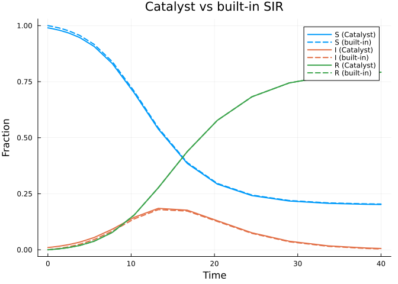
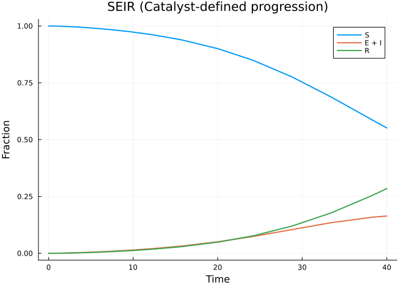
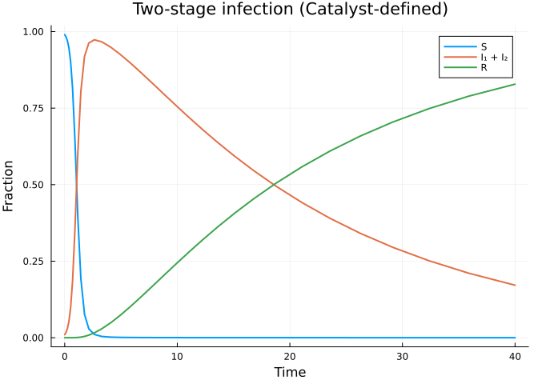
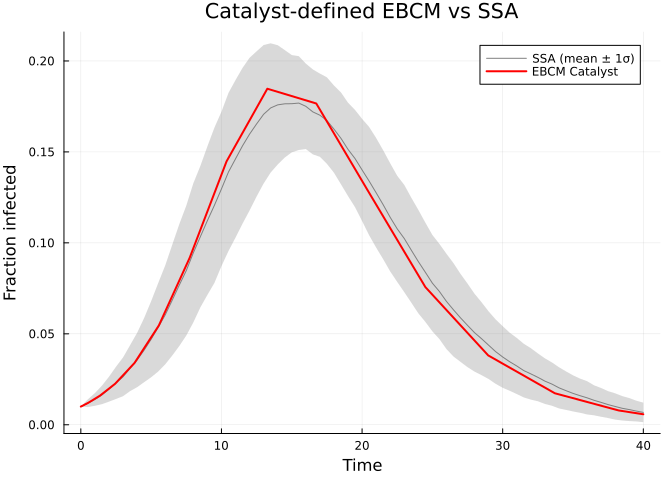

# Catalyst.jl Integration
Simon Frost
2026-05-14

- [Introduction](#introduction)
- [Setup](#setup)
- [SIR via Catalyst](#sir-via-catalyst)
  - [Building and solving the model](#building-and-solving-the-model)
  - [Comparison with `build_sir`](#comparison-with-build_sir)
- [SEIR via Catalyst](#seir-via-catalyst)
- [Custom multi-stage model via
  Catalyst](#custom-multi-stage-model-via-catalyst)
  - [Symbolic $R_0$](#symbolic-r_0)
- [Simulation validation](#simulation-validation)
- [Benefits of the Catalyst adapter](#benefits-of-the-catalyst-adapter)

## Introduction

For users already familiar with
[Catalyst.jl](https://github.com/SciML/Catalyst.jl)’s reaction network
DSL, EdgeBasedModels.jl provides a convenient bridge: the
`progression_from_catalyst` function converts a Catalyst
`ReactionSystem` into a `DiseaseProgression` that can be plugged
directly into any edge-based configuration model. This lets you leverage
Catalyst’s expressive chemical kinetics notation for specifying disease
compartment transitions, while EdgeBasedModels handles the network
epidemic equations automatically.

## Setup

``` julia
using EdgeBasedModels
using ModelingToolkit
using Symbolics
using OrdinaryDiffEq
using Plots
import Catalyst
```

We use `import Catalyst` rather than `using Catalyst` to avoid namespace
collisions with ModelingToolkit (both packages export symbols like
`@parameters`).

## SIR via Catalyst

In the standard edge-based SIR model, the disease progression is simply
$I \xrightarrow{\gamma} R$. We can express this as a Catalyst reaction
network:

``` julia
@parameters β γ γ_cat
rn = Catalyst.@reaction_network begin
    γ_cat, I --> R
end; nothing
```

Now we convert this `ReactionSystem` into a `DiseaseProgression`. The
`transmission_rates` dictionary specifies which compartments can
transmit infection across an edge, and at what rate:

``` julia
progression = progression_from_catalyst(
    rn;
    transmission_rates = Dict(:I => β, :R => 0),
    entry = :I
)
```

    DiseaseProgression(:S, :I, DiseaseStage[DiseaseStage(:I, β), DiseaseStage(:R, 0)], DiseaseTransition[DiseaseTransition(:I, :R, γ_cat)])

The `entry = :I` argument tells the model that newly infected nodes
enter the $I$ compartment (as opposed to an exposed class).

### Building and solving the model

We pair the progression with a Poisson degree distribution to build a
`StaticConfigurationModel`:

``` julia
@parameters κ
pgf = poisson_pgf(κ)
scm = StaticConfigurationModel(pgf, progression)
result = build_edge_system(scm)
```

    EdgeModelSystem(Model edge_based_model:
    Equations (5):
      5 standard: see equations(edge_based_model)
    Unknowns (5): see unknowns(edge_based_model)
      pop_R(t)
      pop_I(t)
      phi_R(t)
      phi_I(t)
      ⋮
    Parameters (4): see parameters(edge_based_model)
      κ
      ρ
      β
      γ_cat
    Observed (3): see observed(edge_based_model), Dict{Symbol, Any}(:R => pop_R(t), :φ_I => phi_I(t), :pop_I => pop_I(t), :pop_R => pop_R(t), :φ_R => phi_R(t), :θ => θ(t)), Dict{Symbol, Any}(:I => I(t), :φ_S => phi_S(t), :S => S(t), :edge_hazard => phi_I(t)*β, :excess_hazard => phi_I(t)*β*κ), Dict{Symbol, Any}(:seed_groups => Any[(entry = pop_I(t), susceptible_expr = exp((-1 + θ(t))*κ))], :rho_param => ρ, :edge_seed_groups => Any[(entry = phi_I(t), theta = θ(t), phi_S_expr = (exp((-1 + θ(t))*κ)*(1 - ρ)) / exp(0))]))

Set up numeric parameters and solve:

> [!NOTE]
>
> **$R_0=2$ anchor.** For the Poisson($\kappa=10$) SIR example, $T=2/10$
> and with $\gamma=0.25$ the comparable per-edge rate is $\beta=0.0625$.
> We seed 1% of the population.

``` julia
κ_val = 10.0
γ_val = 0.25
R0_target = 2.0
T_val = R0_target / κ_val
β_val = T_val * γ_val / (1 - T_val)
ε = 0.001
tspan = (0.0, 40.0)

ic = default_initial_conditions(result; ε = ε)
params = Dict(κ => κ_val, β => β_val, γ_cat => γ_val)
prob = ODEProblem(result.system, merge(ic, params), tspan)
sol = solve(prob, Tsit5())
```

    retcode: Success
    Interpolation: specialized 4th order "free" interpolation
    t: 17-element Vector{Float64}:
      0.0
      0.13910135194928805
      0.7934475769879635
      1.860389932156775
      3.116396208533559
      4.675956941087338
      6.474177973429059
      8.539035769590395
     10.86502252940332
     13.508843513796641
     16.6325527366216
     20.117814388345924
     23.897317691439458
     27.93889670476307
     32.50146326920048
     37.24099758319997
     40.0
    u: 17-element Vector{Vector{Float64}}:
     [0.0, 0.001, 0.0, 0.0010000000000000009, 1.0]
     [3.5692254628371004e-5, 0.0010530665393326554, 3.554063551525515e-5, 0.0010443329995669583, 0.9999911148411211]
     [0.00023007092154663704, 0.0013318347914273027, 0.00022505057022450612, 0.0012805925001933079, 0.9999437373574438]
     [0.0006589459062908662, 0.0019137399900481442, 0.000630200239298163, 0.0017849355972163077, 0.9998424499401753]
     [0.0014019537446062027, 0.0028786016216350127, 0.0013156971140657434, 0.002635933973659038, 0.9996710757214835]
     [0.0028534387156879705, 0.0047091782721589565, 0.002636343103371392, 0.004267188108632689, 0.999340914224157]
     [0.0056866851393438155, 0.00820551643881826, 0.005195639069916711, 0.007397652740766191, 0.9987010902325207]
     [0.011572047291637773, 0.015293030334830815, 0.01049280663697351, 0.013749069330251707, 0.9973767983407565]
     [0.024297868870993236, 0.029967971849563003, 0.021917246519485917, 0.026869282571198853, 0.9945206883701284]
     [0.05317413134365906, 0.06021982723941671, 0.047741275802411574, 0.05371736383006132, 0.988064681049397]
     [0.12095212107927708, 0.11610596879146957, 0.10782823444499595, 0.1022727968145017, 0.9730429413887509]
     [0.24957450427379946, 0.17347860776486215, 0.21959981389699162, 0.14855334466742204, 0.945100046525752]
     [0.42016970522000197, 0.1759947140571007, 0.36228528316948416, 0.14330781531524736, 0.9094286792076288]
     [0.5753670738893534, 0.12727521472911588, 0.48472732733809765, 0.09673312944584704, 0.8788181681654754]
     [0.6866791828975831, 0.07081467639081336, 0.5662882785729862, 0.04963351107216348, 0.8584279303567532]
     [0.7467123370184704, 0.03422098074719225, 0.6069522759917183, 0.02224297277601459, 0.8482619310020703]
     [0.765720953017894, 0.021759511269806863, 0.619089248849319, 0.013618903226051936, 0.8452276877876701]

``` julia
κ_val_num = 10.0
ψ(x) = exp(κ_val_num * (x - 1))
θ_vals = compartment(sol, result, :θ)
S_vals = compartment(sol, result, :S)
R_vals = compartment(sol, result, :R)
I_vals = compartment(sol, result, :I)

plot(sol.t, S_vals, label="S", lw=2)
plot!(sol.t, I_vals, label="I", lw=2)
plot!(sol.t, R_vals, label="R", lw=2)
xlabel!("Time")
ylabel!("Fraction")
title!("SIR (Catalyst-defined progression)")
```

<div id="fig-sir-catalyst">


Figure 1: SIR epidemic on a Poisson network, defined via Catalyst.jl.

</div>

### Comparison with `build_sir`

To verify that the Catalyst pathway produces identical results, we can
compare against the built-in `build_sir`:

``` julia
result_builtin = build_sir(pgf, β, γ)
ic_builtin = default_initial_conditions(result_builtin; ε = ε)
params_builtin = Dict(κ => κ_val, β => β_val, γ => γ_val)
prob_builtin = ODEProblem(result_builtin.system, merge(ic_builtin, params_builtin), tspan)
sol_builtin = solve(prob_builtin, Tsit5())

θ_builtin = compartment(sol_builtin, result_builtin, :θ)
S_builtin = ψ.(θ_builtin)
```

    17-element Vector{Float64}:
     1.0
     0.9999111523583968
     0.9994375318190064
     0.9984257398512925
     0.9967161608476413
     0.9934308143059295
     0.9870948965911975
     0.9741090539243975
     0.9466809805606917
     0.8874942917306587
     0.7637073704854087
     0.5775273174608195
     0.40425346548889285
     0.2976555545096365
     0.2427506008988106
     0.21928551211246103
     0.21273178712560806

``` julia
R_builtin = compartment(sol_builtin, result_builtin, :R)
I_builtin = 1.0 .- S_builtin .- R_builtin

plot(sol.t, S_vals, label="S (Catalyst)", lw=2, color=1)
plot!(sol_builtin.t, S_builtin, label="S (built-in)", lw=2, ls=:dash, color=1)
plot!(sol.t, I_vals, label="I (Catalyst)", lw=2, color=2)
plot!(sol_builtin.t, I_builtin, label="I (built-in)", lw=2, ls=:dash, color=2)
plot!(sol.t, R_vals, label="R (Catalyst)", lw=2, color=3)
plot!(sol_builtin.t, R_builtin, label="R (built-in)", lw=2, ls=:dash, color=3)
xlabel!("Time")
ylabel!("Fraction")
title!("Catalyst vs built-in SIR")
```

<div id="fig-sir-comparison">



Figure 2: Comparison of Catalyst-defined SIR (solid) and built-in
build_sir (dashed). The curves overlap exactly.

</div>

The solid and dashed lines overlap perfectly, confirming that both
approaches produce the same ODE system.

## SEIR via Catalyst

The SEIR model adds a latent (exposed) period before infectiousness. The
compartment transitions are:

$$E \xrightarrow{\sigma} I \xrightarrow{\gamma} R$$

In Catalyst notation:

``` julia
@parameters σ_cat
rn_seir = Catalyst.@reaction_network begin
    σ_cat, E --> I
    γ_cat, I --> R
end; nothing
```

Converting to a `DiseaseProgression`, we specify that the $E$ and $R$
compartments do not transmit ($\beta = 0$), only $I$ does:

``` julia
progression_seir = progression_from_catalyst(
    rn_seir;
    transmission_rates = Dict(:E => 0, :I => β, :R => 0),
    entry = :E
)
```

    DiseaseProgression(:S, :E, DiseaseStage[DiseaseStage(:E, 0), DiseaseStage(:I, β), DiseaseStage(:R, 0)], DiseaseTransition[DiseaseTransition(:E, :I, σ_cat), DiseaseTransition(:I, :R, γ_cat)])

``` julia
scm_seir = StaticConfigurationModel(pgf, progression_seir)
result_seir = build_edge_system(scm_seir)
```

    EdgeModelSystem(Model edge_based_model:
    Equations (7):
      7 standard: see equations(edge_based_model)
    Unknowns (7): see unknowns(edge_based_model)
      pop_R(t)
      pop_I(t)
      pop_E(t)
      phi_R(t)
      ⋮
    Parameters (5): see parameters(edge_based_model)
      κ
      ρ
      β
      σ_cat
      ⋮
    Observed (3): see observed(edge_based_model), Dict{Symbol, Any}(:R => pop_R(t), :φ_I => phi_I(t), :pop_I => pop_I(t), :pop_R => pop_R(t), :φ_R => phi_R(t), :θ => θ(t), :φ_E => phi_E(t), :pop_E => pop_E(t)), Dict{Symbol, Any}(:I => I(t), :φ_S => phi_S(t), :S => S(t), :edge_hazard => phi_I(t)*β, :excess_hazard => phi_I(t)*β*κ), Dict{Symbol, Any}(:seed_groups => Any[(entry = pop_E(t), susceptible_expr = exp((-1 + θ(t))*κ))], :rho_param => ρ, :edge_seed_groups => Any[(entry = phi_E(t), theta = θ(t), phi_S_expr = (exp((-1 + θ(t))*κ)*(1 - ρ)) / exp(0))]))

Let’s inspect the system. The SEIR edge-based model has 7 differential
equations: $\theta$, $\phi_E$, $\phi_I$, $\phi_R$, plus per-stage
population trackers ($\mathrm{pop}_E$, $\mathrm{pop}_I$,
$\mathrm{pop}_R$), plus algebraic observables for $\phi_S$, $S$, $E$,
$I$, and $R$:

``` julia
println("Number of equations: ", length(ModelingToolkit.equations(result_seir.system)))
println("\nVariables: ", keys(result_seir.variables))
println("\nObservables: ", keys(result_seir.observables))
```

    Number of equations: 7

    Variables: [:R, :φ_I, :pop_I, :pop_R, :φ_R, :θ, :φ_E, :pop_E]

    Observables: [:I, :φ_S, :S, :edge_hazard, :excess_hazard]

Solve and plot:

``` julia
σ_val = 0.2

ic_seir = default_initial_conditions(result_seir; ε = ε)
params_seir = Dict(κ => κ_val, β => β_val, σ_cat => σ_val, γ_cat => γ_val)
prob_seir = ODEProblem(result_seir.system, merge(ic_seir, params_seir), tspan)
sol_seir = solve(prob_seir, Tsit5())
```

    retcode: Success
    Interpolation: specialized 4th order "free" interpolation
    t: 17-element Vector{Float64}:
      0.0
      0.152936027064522
      0.64349338690379
      1.3445914715284575
      2.1988694944572162
      3.282792112176137
      4.591867282721296
      6.199174244359496
      8.157875770719697
     10.59484997079258
     13.68879177786621
     17.804388625756822
     23.255782187365377
     28.627595568107367
     34.31829740724162
     39.93596075140407
     40.0
    u: 17-element Vector{Vector{Float64}}:
     [0.0, 0.0, 0.001, 0.0, 0.0, 0.0010000000000000009, 1.0]
     [5.716320606785936e-7, 2.9567009987684497e-5, 0.0009712844878947393, 5.698222049205534e-7, 2.9426364292212436e-5, 0.00097128448789474, 0.9999998575444488]
     [9.444785676853656e-6, 0.00011230840177256893, 0.0009015273450150443, 9.321643157782865e-6, 0.00011010113350219404, 0.000901527345015045, 0.9999976695892105]
     [3.770372187179559e-5, 0.00020615971627962914, 0.000847817125096481, 3.67106189322532e-5, 0.0001979751644861084, 0.0008478171250964816, 0.9999908223452669]
     [9.162025601818047e-5, 0.00029516256790721465, 0.0008325924185955709, 8.784758112662653e-5, 0.0002769733475171122, 0.0008325924185955715, 0.9999780381047183]
     [0.00018425378825639175, 0.00038558722705535456, 0.0008636444016635161, 0.00017360540340348858, 0.00035283426105738594, 0.0008636444016635166, 0.9999565986491491]
     [0.00032612164740247637, 0.0004799188056846442, 0.0009473233073355706, 0.0003017609483886633, 0.0004288392676012918, 0.000947323307335571, 0.9999245597629028]
     [0.000541356908774147, 0.0005917859642169183, 0.0010947429440008442, 0.000491948366476419, 0.0005182074148955422, 0.0010947429440008444, 0.9998770129083809]
     [0.0008664517728570345, 0.0007391094405623342, 0.0013262648562785881, 0.0007742527836436643, 0.0006377452338647888, 0.0013262648562785886, 0.9998064368040891]
     [0.0013807618094231484, 0.0009569680819426959, 0.0016937319958001884, 0.0012156439206277329, 0.0008181749905811788, 0.0016937319958001884, 0.9996960890198431]
     [0.0022525504474967552, 0.0013148899308097362, 0.002312819806521039, 0.0019588466534646927, 0.0011188820614756259, 0.002312819806521039, 0.9995102883366338]
     [0.0039311151677741555, 0.001993575688233569, 0.0034945794360946984, 0.003385364622764418, 0.0016929850775522024, 0.0034945794360946984, 0.9991536588443088]
     [0.007545330900608262, 0.0034379319654517103, 0.006003767576798166, 0.006452984252243756, 0.002917032550755276, 0.006003767576798166, 0.998386753936939]
     [0.013634279655796158, 0.005832890284832118, 0.010129793822469544, 0.011617311539703974, 0.004945530515998307, 0.010129793822469544, 0.9970956721150739]
     [0.024685714117534546, 0.01006286993745493, 0.01730194543698106, 0.020981413151688773, 0.008521817615378501, 0.01730194543698106, 0.9947546467120777]
     [0.04320029230676159, 0.016815213177834944, 0.028434774032099774, 0.03664341259326816, 0.014211239743011316, 0.028434774032099774, 0.9908391468516828]
     [0.043470262232602676, 0.01691042105391133, 0.02858939370037411, 0.036871571590099725, 0.01429121879888933, 0.02858939370037411, 0.9907821071024749]

``` julia
θ_seir = compartment(sol_seir, result_seir, :θ)
S_seir = ψ.(θ_seir)
R_seir = compartment(sol_seir, result_seir, :R)
I_seir = 1.0 .- S_seir .- R_seir

plot(sol_seir.t, S_seir, label="S", lw=2)
plot!(sol_seir.t, I_seir, label="E + I", lw=2)
plot!(sol_seir.t, R_seir, label="R", lw=2)
xlabel!("Time")
ylabel!("Fraction")
title!("SEIR (Catalyst-defined progression)")
```

<div id="fig-seir-catalyst">



Figure 3: SEIR epidemic on a Poisson network, defined via Catalyst.jl.
The exposed class delays the onset of infectiousness.

</div>

## Custom multi-stage model via Catalyst

Catalyst’s flexibility really shines when defining non-standard disease
progressions. Consider a model with two sequential infectious stages,
$I_1$ and $I_2$, each with different transmission rates:

$$I_1 \xrightarrow{\gamma_1} I_2 \xrightarrow{\gamma_2} R$$

This could represent an initial acute phase ($I_1$, high transmission)
followed by a chronic phase ($I_2$, lower transmission).

``` julia
@parameters β₁ β₂ γ₁_cat γ₂_cat
rn_multi = Catalyst.@reaction_network begin
    γ₁_cat, I1 --> I2
    γ₂_cat, I2 --> R
end; nothing
```

``` julia
progression_multi = progression_from_catalyst(
    rn_multi;
    transmission_rates = Dict(:I1 => β₁, :I2 => β₂, :R => 0),
    entry = :I1
)
```

    DiseaseProgression(:S, :I1, DiseaseStage[DiseaseStage(:I1, β₁), DiseaseStage(:I2, β₂), DiseaseStage(:R, 0)], DiseaseTransition[DiseaseTransition(:I1, :I2, γ₁_cat), DiseaseTransition(:I2, :R, γ₂_cat)])

``` julia
scm_multi = StaticConfigurationModel(pgf, progression_multi)
result_multi = build_edge_system(scm_multi)
println("Number of equations: ", length(ModelingToolkit.equations(result_multi.system)))
println("Variables: ", keys(result_multi.variables))
```

    Number of equations: 7
    Variables: [:R, :pop_I2, :φ_I2, :pop_I1, :pop_R, :φ_R, :θ, :φ_I1]

Solve with the acute phase having higher transmissibility:

``` julia
β₁_val = 0.5   # high transmission in acute phase
β₂_val = 0.1   # lower transmission in chronic phase
γ₁_val = 0.3   # fast progression out of acute phase
γ₂_val = 0.05  # slow recovery from chronic phase

ic_multi = default_initial_conditions(result_multi; ε = ε)
params_multi = Dict(
    κ => κ_val,
    β₁ => β₁_val, β₂ => β₂_val,
    γ₁_cat => γ₁_val, γ₂_cat => γ₂_val
)
prob_multi = ODEProblem(result_multi.system, merge(ic_multi, params_multi), tspan)
sol_multi = solve(prob_multi, Tsit5())
```

    retcode: Success
    Interpolation: specialized 4th order "free" interpolation
    t: 36-element Vector{Float64}:
      0.0
      0.07221505633112481
      0.17164998934568393
      0.2894760913432517
      0.42973616294583195
      0.5886071437873984
      0.7657551786996984
      0.9598435414033647
      1.1730462397620993
      1.41456977153802
      ⋮
     17.96376771398558
     20.06425903639986
     22.433762726255402
     24.98372300804928
     27.741914416815494
     30.73313781123839
     34.03664524041226
     37.74965102100452
     40.0
    u: 36-element Vector{Vector{Float64}}:
     [0.0, 0.0, 0.001, 0.0, 0.0, 0.0010000000000000009, 1.0]
     [4.384036234781953e-8, 2.569703677360923e-5, 0.001396446140948816, 4.323341524212565e-8, 2.5180356739298078e-5, 0.0013546935327913752, 0.9999577301048611]
     [2.9209384439267297e-7, 7.802869688119589e-5, 0.0021838268432146316, 2.8303722574497677e-7, 7.466383192764525e-5, 0.002060779784327207, 0.9998735790195403]
     [1.0224502037953682e-6, 0.000178508480883014, 0.0036651312947435168, 9.727190625842816e-7, 0.0001670088680060891, 0.0033915234919800813, 0.9997148428532184]
     [2.937739345983008e-6, 0.0003887413961433046, 0.006717022949948937, 2.74357772194001e-6, 0.0003564922400440422, 0.0061361074902119275, 0.9993866412225397]
     [7.624811080374049e-6, 0.0008419793413386871, 0.0132098293901211, 7.001808038307339e-6, 0.0007601140667536334, 0.011976448233557348, 0.9986841305658092]
     [1.9087567232077527e-5, 0.0018723635756044206, 0.027725445731644573, 1.72795625866404e-5, 0.0016712518196373475, 0.02502198885475502, 0.997093623362498]
     [4.753668957393992e-5, 0.004306830648894955, 0.06095177654396458, 4.25506945679915e-5, 0.003813401960760678, 0.054796666430527746, 0.9933464752034229]
     [0.0001210182738032285, 0.010271615123501023, 0.1366325764873295, 0.00010735012997203087, 0.0090304219211011, 0.12208528372192128, 0.9841978458883606]
     [0.0003239868925266475, 0.025232910804333642, 0.2952053522264803, 0.00028479060487655026, 0.02195000502088693, 0.2599505783619633, 0.9614231240643859]
     ⋮
     [0.4707952263209215, 0.5213780455974942, 0.007602349192436457, 0.11163933598530082, 0.039991726308121076, 1.6329740122985464e-5, 0.1518717709226926]
     [0.5229742478953786, 0.47275688439875146, 0.00405891389419033, 0.11524252760982001, 0.029190050438241466, 9.690807783142214e-6, 0.14465222266752426]
     [0.5759248766263234, 0.4218745269289338, 0.002001555939852376, 0.11815332518391462, 0.020463110943527617, 6.0621743857027865e-6, 0.13882153880671844]
     [0.6264989083443238, 0.3723730458639724, 0.0009367298671138012, 0.1203215595396475, 0.013962127470089255, 3.867837991968917e-6, 0.13447887077231885]
     [0.6745084088827552, 0.32489255929204824, 0.00041312687035704825, 0.1218986036777647, 0.009233556515801957, 2.448247571051532e-6, 0.13132051339597728]
     [0.7196606141857129, 0.2799863780052826, 0.0001708194364324247, 0.12301146332881234, 0.005896720165944771, 1.5178877432400055e-6, 0.12909188975507244]
     [0.7622997263596654, 0.23745563110275558, 6.497150046554699e-5, 0.12377959587770762, 0.0035934956624673123, 9.068413128170558e-7, 0.12755366941860127]
     [0.8025377924126014, 0.1972618880486186, 2.2303700002091224e-5, 0.12429118560395636, 0.0020594947395777743, 5.133573640021045e-7, 0.12652920953967606]
     [0.8235307220282455, 0.17628008804589573, 1.1805945756091136e-5, 0.12448787278157, 0.0014697262541609022, 3.6375624174883143e-7, 0.1261353467720753]

``` julia
θ_multi = compartment(sol_multi, result_multi, :θ)
S_multi = compartment(sol_multi, result_multi, :S)
R_multi = compartment(sol_multi, result_multi, :R)
I_multi = compartment(sol_multi, result_multi, :I)

plot(sol_multi.t, S_multi, label="S", lw=2)
plot!(sol_multi.t, I_multi, label="I₁ + I₂", lw=2)
plot!(sol_multi.t, R_multi, label="R", lw=2)
xlabel!("Time")
ylabel!("Fraction")
title!("Two-stage infection (Catalyst-defined)")
```

<div id="fig-multistage-catalyst">



Figure 4: Two-stage infectious disease on a Poisson network. The acute
phase (I₁) has higher transmissibility than the chronic phase (I₂).

</div>

### Symbolic $R_0$

We can also compute the basic reproduction number symbolically for the
multi-stage model:

``` julia
R0_multi = basic_reproduction_number(scm_multi)
println("R₀ = ", R0_multi)
```

    R₀ = (((β₁ + γ₁_cat)*(β₂ + γ₂_cat) - γ₁_cat*γ₂_cat)*κ) / ((β₁ + γ₁_cat)*(β₂ + γ₂_cat))

For two infectious stages with transmission rates $\beta_1, \beta_2$ and
progression rates $\gamma_1, \gamma_2$, the transmissibility across an
edge is:

$$T = 1 - \frac{\gamma_1}{\beta_1 + \gamma_1} \cdot \frac{\gamma_2}{\beta_2 + \gamma_2}$$

and $R_0 = T \cdot \psi''(1) / \psi'(1)$, where the excess degree ratio
$\psi''(1)/\psi'(1) = \kappa$ for a Poisson distribution.

## Simulation validation

We verify the ODE prediction against Gillespie SSA on Erdős–Rényi
networks with mean degree $\kappa = 10$, using `NetworkOutbreaks.jl`.

``` julia
include("../_validation.jl")

t_g, μ_g, σ_g = gillespie_ribbon(
    sir_model(), Dict(:β => β_val, :γ => γ_val),
    poisson_graph_builder(1000, κ_val);
    N = 1000, n_graphs = 5, nsims_per_graph = 20,
    tspan = tspan, seed_fraction = ε)
```

    ([0.0, 0.5, 1.0, 1.5, 2.0, 2.5, 3.0, 3.5, 4.0, 4.5  …  35.5, 36.0, 36.5, 37.0, 37.5, 38.0, 38.5, 39.0, 39.5, 40.0], Dict(:I => [0.001, 0.0011899999999999999, 0.00131, 0.00151, 0.00185, 0.00215, 0.00257, 0.00312, 0.00382, 0.0045  …  0.0207, 0.01889, 0.01756, 0.01597, 0.014839999999999999, 0.013779999999999999, 0.012320000000000001, 0.011439999999999999, 0.010369999999999999, 0.009609999999999999], :R => [0.0, 0.00017999999999999998, 0.00044, 0.00064, 0.00079, 0.0011200000000000001, 0.00141, 0.00173, 0.00211, 0.00262  …  0.34392, 0.34661000000000003, 0.34878, 0.35106, 0.35298, 0.35474, 0.35679, 0.35816000000000003, 0.35958999999999997, 0.36085], :S => [0.999, 0.99863, 0.99825, 0.99785, 0.99736, 0.99673, 0.99602, 0.99515, 0.99407, 0.99288  …  0.63538, 0.6345, 0.63366, 0.63297, 0.63218, 0.63148, 0.63089, 0.6304, 0.6300399999999999, 0.62954]), Dict(:I => [0.0, 0.000928722376453401, 0.0011694339475044144, 0.0015858910760359632, 0.002095570123239531, 0.002606809265261758, 0.003143873310733019, 0.004013311184877976, 0.005193974753247626, 0.006425171459410892  …  0.029657131596724836, 0.026995283912849548, 0.025315512072939618, 0.02317367672444951, 0.0219654089859304, 0.020241761012542582, 0.018548260829468078, 0.017295599954259402, 0.015586613655715129, 0.014475960567210535], :R => [0.0, 0.00038612291966536917, 0.0005915226030330456, 0.0006893123494842632, 0.0008444112167838032, 0.001121687041104522, 0.0015115381155457097, 0.001911448760400436, 0.0024407938764825572, 0.0030009426128562613  …  0.366908203640897, 0.36952896293043724, 0.37167830067400925, 0.3739523769171954, 0.3758885494613552, 0.37762606751744093, 0.37974311612249706, 0.38113389359709915, 0.3825745083567964, 0.3838585696778848], :S => [0.0, 0.0008122173167921069, 0.0012821619998812138, 0.0018167292177165672, 0.0024924937818428462, 0.003387007260372818, 0.004235444474785368, 0.005426040839499753, 0.006976519059088006, 0.008652996211390795  …  0.38779667118455025, 0.3887013212888749, 0.3895637866105933, 0.3902751801775592, 0.3910914378086955, 0.3918240555466835, 0.3924443959841877, 0.39295901552043294, 0.39333217565315, 0.39385810960934964]))

``` julia
plot(t_g, μ_g[:I], ribbon = σ_g[:I], label = "SSA (mean ± 1σ)",
     color = :red, fillalpha = 0.2, linealpha = 0.6)
plot!(sol.t, I_vals, label = "EBCM Catalyst",
      color = :red, linewidth = 2)
xlabel!("Time"); ylabel!("Fraction infected")
title!("Catalyst-defined EBCM vs SSA")
```

<div id="fig-sir-validation-04">



Figure 5: Catalyst-defined EBCM (red line) vs Gillespie SSA mean ± 1σ
(red ribbon) on Poisson κ=10.

</div>

## Benefits of the Catalyst adapter

The `progression_from_catalyst` function provides several advantages:

1.  **Familiar syntax**: Users of Catalyst.jl can specify disease
    compartment transitions using the same `@reaction_network` macro
    they use for chemical kinetics.
2.  **Validation**: Catalyst’s reaction parsing catches malformed
    transitions (e.g., bimolecular reactions, which are not supported in
    the edge-based framework).
3.  **Ecosystem integration**: Models defined in Catalyst can be
    analyzed with Catalyst’s own tools (e.g., species graphs,
    conservation laws) before converting to edge-based form.
4.  **Rapid prototyping**: Complex multi-stage progressions can be
    written in a few lines of Catalyst DSL, rather than manually
    constructing `DiseaseStage` and `DiseaseTransition` vectors.

The key constraint is that only **unimolecular** reactions are supported
— each reaction must have exactly one substrate and one product,
representing the progression of a single individual between disease
compartments.
