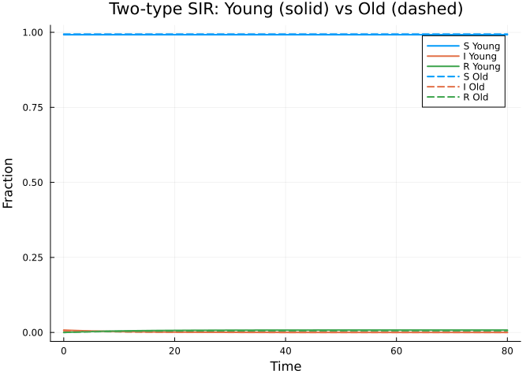
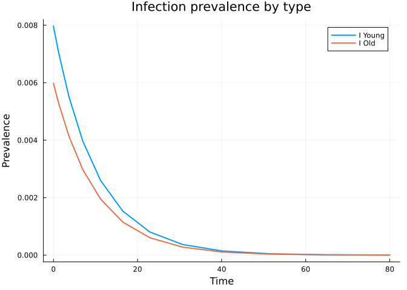
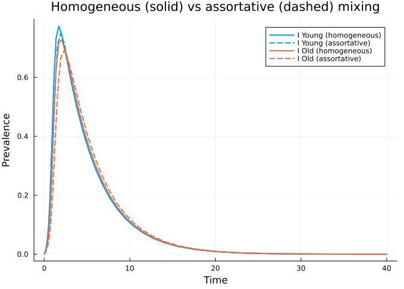
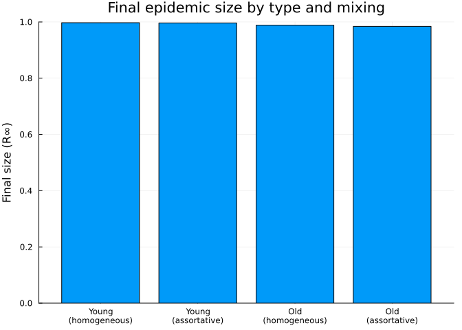

# Multi-type Populations
Simon Frost
2026-05-14

- [Introduction](#introduction)
- [Setup](#setup)
- [Multivariate PGFs](#multivariate-pgfs)
  - [PGF properties](#pgf-properties)
- [Two-type SIR model](#two-type-sir-model)
  - [Building the model](#building-the-model)
- [Solving the two-type model](#solving-the-two-type-model)
  - [Extracting population
    trajectories](#extracting-population-trajectories)
- [Assortative mixing with a contact
  matrix](#assortative-mixing-with-a-contact-matrix)
- [Scaling to more types](#scaling-to-more-types)
- [Summary](#summary)
- [Simulation validation](#simulation-validation)

## Introduction

Real populations are rarely homogeneous. Age groups, risk groups,
spatial patches, and other forms of heterogeneity lead to structured
contact patterns where individuals of different types mix at different
rates. Multi-type edge-based compartmental models extend the EBCM
framework to track the epidemic on each type of edge separately.

For $K$ population types and $M$ disease stages, the package
automatically generates $K^2(1 + M) + K M$ ODEs — the $K^2$ comes from
tracking $\theta_{jl}$ (probability that an edge from type $l$ to type
$j$ has not transmitted) for every ordered pair of types, $K^2 M$ from
the $\phi$ variables for each disease stage and type pair, and $K M$
from the per-stage population trackers (one per stage and type). This
automates what would be extremely tedious bookkeeping by hand.

## Setup

``` julia
using EdgeBasedModels
using ModelingToolkit
using Symbolics
using OrdinaryDiffEq
using Plots
```

## Multivariate PGFs

In a multi-type network, each type $l$ has its own probability
generating function $\psi_l(x_1, \ldots, x_K)$ that describes its
connections to all $K$ types. For a type-$l$ node, the variable $x_k$
corresponds to edges connecting to type-$k$ neighbors. The PGF encodes
the joint degree distribution — the probability that a randomly chosen
type-$l$ node has $d_1$ type-1 neighbors, $d_2$ type-2 neighbors, etc.

For Poisson degree distributions (the simplest case), the multivariate
PGF takes the form:

$$\psi_l(x_1, \ldots, x_K) = \exp\!\left(\sum_{k=1}^K \kappa_{lk}(x_k - 1)\right)$$

where $\kappa_{lk}$ is the mean number of type-$k$ neighbors that a
type-$l$ node has.

Let’s define a two-type network with “Young” and “Old” populations:

``` julia
@parameters κ_YY κ_YO κ_OY κ_OO
pgf_Y = multivariate_poisson_pgf([:Young, :Old], Dict(:Young => κ_YY, :Old => κ_YO))
pgf_O = multivariate_poisson_pgf([:Young, :Old], Dict(:Young => κ_OY, :Old => κ_OO))
```

    MultivariatePGF([:Young, :Old], Any[z_Young, z_Old], exp((-1 + z_Old)*κ_OO + (-1 + z_Young)*κ_OY))

Here `κ_YY` is the mean number of Young neighbors a Young individual
has, `κ_YO` is the mean number of Old neighbors a Young individual has,
and so on.

### PGF properties

We can compute mean degrees and partial derivatives symbolically:

``` julia
println("Mean Young neighbors of a Young node: ", mean_degree(pgf_Y, :Young))
println("Mean Old neighbors of a Young node:   ", mean_degree(pgf_Y, :Old))
println("Mean Young neighbors of an Old node:  ", mean_degree(pgf_O, :Young))
println("Mean Old neighbors of an Old node:    ", mean_degree(pgf_O, :Old))
```

    Mean Young neighbors of a Young node: κ_YY
    Mean Old neighbors of a Young node:   κ_YO
    Mean Young neighbors of an Old node:  κ_OY
    Mean Old neighbors of an Old node:    κ_OO

Partial derivatives describe higher-order degree structure:

``` julia
println("∂ψ_Y/∂x_Young = ", partial_derivative(pgf_Y, :Young, 1))
println("∂²ψ_Y/∂x_Young² = ", partial_derivative(pgf_Y, :Young, 2))
println("∂²ψ_Y/(∂x_Young ∂x_Old) = ", mixed_partial(pgf_Y, :Young, :Old))
```

    ∂ψ_Y/∂x_Young = exp((-1 + z_Old)*κ_YO + (-1 + z_Young)*κ_YY)*κ_YY
    ∂²ψ_Y/∂x_Young² = exp((-1 + z_Old)*κ_YO + (-1 + z_Young)*κ_YY)*(κ_YY^2)
    ∂²ψ_Y/(∂x_Young ∂x_Old) = exp((-1 + z_Old)*κ_YO + (-1 + z_Young)*κ_YY)*κ_YO*κ_YY

We can also evaluate the PGF at specific points:

``` julia
println("ψ_Y(1, 1) = ", eval_multivariate_pgf(pgf_Y, Dict(:Young => 1, :Old => 1)))
```

    ψ_Y(1, 1) = 1

## Two-type SIR model

Now we combine the multivariate PGFs with a disease progression to build
a multi-type edge-based model. We’ll use a standard SIR progression:

``` julia
@parameters β γ
progression = DiseaseProgression(
    [
        DiseaseStage(:I; transmission_rate = β),
        DiseaseStage(:R; transmission_rate = 0),
    ],
    [DiseaseTransition(:I, :R, γ)];
    entry = :I,
)
```

    DiseaseProgression(:S, :I, DiseaseStage[DiseaseStage(:I, β), DiseaseStage(:R, 0)], DiseaseTransition[DiseaseTransition(:I, :R, γ)])

### Building the model

The `MultiTypeConfigurationModel` constructor takes the list of types,
one PGF per type, and the disease progression:

``` julia
model = MultiTypeConfigurationModel(
    types = [:Young, :Old],
    pgfs = Dict(:Young => pgf_Y, :Old => pgf_O),
    progression = progression,
)
result = build_edge_system(model)
```

    EdgeModelSystem(Model multitype_ebm:
    Equations (16):
      16 standard: see equations(multitype_ebm)
    Unknowns (16): see unknowns(multitype_ebm)
      pop_R_Old(t)
      pop_I_Old(t)
      pop_R_Young(t)
      pop_I_Young(t)
      ⋮
    Parameters (8): see parameters(multitype_ebm)
      κ_YY
      κ_YO
      ρ_Young
      κ_OO
      ⋮
    Observed (8): see observed(multitype_ebm), Dict{Symbol, Any}(:φ_I_Old_Old => φ_I_Old_Old(t), :θ_Young_Young => θ_Young_Young(t), :R_Young => pop_R_Young(t), :φ_I_Old_Young => φ_I_Old_Young(t), :θ_Old_Young => θ_Old_Young(t), :φ_R_Young_Young => φ_R_Young_Young(t), :pop_I_Old => pop_I_Old(t), :pop_R_Old => pop_R_Old(t), :pop_R_Young => pop_R_Young(t), :R_Old => pop_R_Old(t)…), Dict{Symbol, Any}(:edge_hazard_Young_Young => φ_I_Young_Young(t)*β, :excess_hazard_Young_Young => φ_I_Young_Young(t)*β*κ_YY + φ_I_Old_Young(t)*β*κ_YO, :φ_S_Young_Young => φ_S_Young_Young(t), :edge_hazard_Old_Old => φ_I_Old_Old(t)*β, :φ_S_Young_Old => φ_S_Young_Old(t), :excess_hazard_Old_Old => φ_I_Young_Old(t)*β*κ_OY + φ_I_Old_Old(t)*β*κ_OO, :excess_hazard_Young_Old => φ_I_Young_Young(t)*β*κ_YY + φ_I_Old_Young(t)*β*κ_YO, :I_Old => I_Old(t), :I_Young => I_Young(t), :S_Old => S_Old(t)…), Dict{Symbol, Any}(:rho_params => Any[ρ_Young, ρ_Old], :seed_groups => Any[(entry = pop_I_Young(t), susceptible_expr = exp((-1 + θ_Old_Young(t))*κ_YO + (-1 + θ_Young_Young(t))*κ_YY)), (entry = pop_I_Old(t), susceptible_expr = exp((-1 + θ_Old_Old(t))*κ_OO + (-1 + θ_Young_Old(t))*κ_OY))], :edge_seed_groups => Any[(entry = φ_I_Young_Young(t), phi_S_expr = exp((-1 + θ_Old_Young(t))*κ_YO + (-1 + θ_Young_Young(t))*κ_YY)*(1 - ρ_Young)), (entry = φ_I_Young_Old(t), phi_S_expr = exp((-1 + θ_Old_Young(t))*κ_YO + (-1 + θ_Young_Young(t))*κ_YY)*(1 - ρ_Young)), (entry = φ_I_Old_Young(t), phi_S_expr = exp((-1 + θ_Old_Old(t))*κ_OO + (-1 + θ_Young_Old(t))*κ_OY)*(1 - ρ_Old)), (entry = φ_I_Old_Old(t), phi_S_expr = exp((-1 + θ_Old_Old(t))*κ_OO + (-1 + θ_Young_Old(t))*κ_OY)*(1 - ρ_Old))]))

Let’s inspect what the model builder generated:

``` julia
n_eqs = length(ModelingToolkit.equations(result.system))
println("Number of equations: ", n_eqs)
```

    Number of equations: 16

With $K = 2$ types and $M = 2$ disease stages (I, R), we expect
$K^2(1 + M) + K M = 4 \times 3 + 2 \times 2 = 16$ equations.

``` julia
println("State variables:")
for (name, var) in sort(collect(result.variables), by = x -> string(x[1]))
    println("  ", name, " → ", var)
end
```

    State variables:
      R_Old → pop_R_Old(t)
      R_Young → pop_R_Young(t)
      pop_I_Old → pop_I_Old(t)
      pop_I_Young → pop_I_Young(t)
      pop_R_Old → pop_R_Old(t)
      pop_R_Young → pop_R_Young(t)
      θ_Old_Old → θ_Old_Old(t)
      θ_Old_Young → θ_Old_Young(t)
      θ_Young_Old → θ_Young_Old(t)
      θ_Young_Young → θ_Young_Young(t)
      φ_I_Old_Old → φ_I_Old_Old(t)
      φ_I_Old_Young → φ_I_Old_Young(t)
      φ_I_Young_Old → φ_I_Young_Old(t)
      φ_I_Young_Young → φ_I_Young_Young(t)
      φ_R_Old_Old → φ_R_Old_Old(t)
      φ_R_Old_Young → φ_R_Old_Young(t)
      φ_R_Young_Old → φ_R_Young_Old(t)
      φ_R_Young_Young → φ_R_Young_Young(t)

``` julia
println("\nObservable quantities:")
for (name, obs) in sort(collect(result.observables), by = x -> string(x[1]))
    println("  ", name)
end
```


    Observable quantities:
      I_Old
      I_Young
      S_Old
      S_Young
      edge_hazard_Old_Old
      edge_hazard_Old_Young
      edge_hazard_Young_Old
      edge_hazard_Young_Young
      excess_hazard_Old_Old
      excess_hazard_Old_Young
      excess_hazard_Young_Old
      excess_hazard_Young_Young
      φ_S_Old_Old
      φ_S_Old_Young
      φ_S_Young_Old
      φ_S_Young_Young

The variables follow a naming convention:

- **$\theta_{jl}$** (`θ_Young_Young`, `θ_Old_Young`, etc.): probability
  that an edge from type $l$ to type $j$ has not transmitted infection
- **$\phi_{m,jl}$** (`φ_I_Young_Young`, `φ_R_Old_Young`, etc.):
  probability that a type-$j$ neighbor reached via a type-$l$ edge is in
  disease stage $m$
- **$R_l$** (`R_Young`, `R_Old`): fraction of type-$l$ population that
  has recovered

## Solving the two-type model

We assign numeric parameter values representing a contact structure
where Young individuals have more contacts (especially with each other),
and Old individuals have fewer contacts overall:

| Parameter     | Value | Meaning                                     |
|---------------|-------|---------------------------------------------|
| $\kappa_{YY}$ | 6     | Young → Young contacts                      |
| $\kappa_{YO}$ | 2     | Young → Old contacts                        |
| $\kappa_{OY}$ | 2     | Old → Young contacts                        |
| $\kappa_{OO}$ | 4     | Old → Old contacts                          |
| $\gamma$      | 0.25  | Recovery rate                               |
| $T$           | 0.75  | Edge transmissibility                       |
| $\beta$       | 0.75  | Transmission rate ($\beta = T\gamma/(1-T)$) |

**Canonical anchor.** This vignette uses $\gamma = 0.25$ and per-edge
transmissibility $T = \beta/(\beta+\gamma) = 0.75$, giving
$\beta = T\gamma/(1-T) = 0.75$. $R_0 = T\,\rho(M)$ where $M$ is the
next-generation matrix derived from the contact structure; preserving
$T$ preserves $R_0$.

``` julia
κ_YY_val = 6.0
κ_YO_val = 2.0
κ_OY_val = 2.0
κ_OO_val = 4.0
γ_val = 0.25
T_val = 0.75
β_val = T_val * γ_val / (1 - T_val)
ε = 1e-2
tspan = (0.0, 40.0)
```

    (0.0, 40.0)

Set up initial conditions and parameters:

``` julia
ic = default_initial_conditions(result; ε = ε)
params = Dict(
    κ_YY => κ_YY_val, κ_YO => κ_YO_val,
    κ_OY => κ_OY_val, κ_OO => κ_OO_val,
    β => β_val, γ => γ_val,
)

prob = ODEProblem(result.system, merge(ic, params), tspan)
sol = solve(prob, Tsit5())
```

    retcode: Success
    Interpolation: specialized 4th order "free" interpolation
    t: 36-element Vector{Float64}:
      0.0
      0.060039765733896515
      0.14282733861586347
      0.24274986797517914
      0.36408603488411534
      0.5060709234989873
      0.673489120962293
      0.8786865142897695
      1.1186608510604406
      1.3823346306463933
      ⋮
     17.59921342279818
     19.977440508787414
     22.658507728824542
     25.55605117361315
     28.683405108036986
     32.036573484418106
     35.67004371256627
     39.666961217933
     40.0
    u: 36-element Vector{Vector{Float64}}:
     [0.0, 0.01, 0.0, 0.01, 0.0, 0.0, 0.0, 0.0, 0.010000000000000009, 0.010000000000000009, 0.010000000000000009, 0.010000000000000009, 1.0, 1.0, 1.0, 1.0]
     [0.000170616740808346, 0.012845098375940186, 0.00017817679932437828, 0.013914202290208478, 0.0001670064698431459, 0.0001670064698431459, 0.00017445804509715927, 0.00017445804509715927, 0.012347689237375958, 0.012347689237375958, 0.013394546909144229, 0.013394546909144229, 0.9994989805904706, 0.9994989805904706, 0.9994766258647085, 0.9994766258647085]
     [0.0004874181802830444, 0.01805149383853212, 0.0005381318344922485, 0.021310924520375907, 0.0004648926984831153, 0.0004648926984831153, 0.0005139771650819494, 0.0005139771650819494, 0.01667934122488271, 0.01667934122488271, 0.019793147694540363, 0.019793147694540363, 0.9986053219045506, 0.9986053219045506, 0.9984580685047542, 0.9984580685047542]
     [0.0010438042331261492, 0.027086560409221153, 0.0012240373299151064, 0.034526609396907985, 0.0009698261768624904, 0.0009698261768624904, 0.0011408918939812152, 0.0011408918939812152, 0.024251059934897345, 0.024251059934897345, 0.031187079150898238, 0.031187079150898238, 0.9970905214694126, 0.9970905214694126, 0.9965773243180563, 0.9965773243180563]
     [0.002102689877925381, 0.04405112773890065, 0.002624533778474403, 0.059844243356546555, 0.0019050889311387363, 0.0019050889311387363, 0.0023902391143651672, 0.0023902391143651672, 0.03853346189227107, 0.03853346189227107, 0.05290782067756032, 0.0529078206775603, 0.9942847332065838, 0.9942847332065838, 0.9928292826569045, 0.9928292826569045]
     [0.004196161695303761, 0.07669902699762712, 0.005543600956025058, 0.10876767644465228, 0.0037191630880606713, 0.0037191630880606713, 0.004945784595156059, 0.004945784595156056, 0.06601853634068816, 0.06601853634068816, 0.09452813902005315, 0.09452813902005316, 0.9888425107358181, 0.9888425107358181, 0.9851626462145319, 0.9851626462145319]
     [0.008650402251937245, 0.14174441242062438, 0.011929811113655204, 0.20391628139757084, 0.007523316117623314, 0.007523316117623314, 0.010442122320927547, 0.010442122320927547, 0.12030155020206831, 0.12030155020206831, 0.17407760322751595, 0.17407760322751595, 0.9774300516471301, 0.9774300516471301, 0.9686736330372174, 0.9686736330372174]
     [0.018991040255172533, 0.27015146649169414, 0.02662605965825947, 0.3774741588597058, 0.01620210744708383, 0.01620210744708383, 0.02280094073875716, 0.02280094073875716, 0.22433407695853122, 0.22433407695853122, 0.31289645556293666, 0.3128964555629367, 0.9513936776587486, 0.9513936776587486, 0.9315971777837286, 0.9315971777837286]
     [0.04087378864614523, 0.4607441795006191, 0.0559795624620785, 0.5940321030249053, 0.03397390080396215, 0.03397390080396215, 0.04644220434980215, 0.04644220434980218, 0.36572236493091553, 0.36572236493091553, 0.46424284808777505, 0.464242848087775, 0.8980782975881136, 0.8980782975881136, 0.8606733869505936, 0.8606733869505936]
     [0.07727110008239296, 0.6298674744023615, 0.10050970223097717, 0.7362109014896945, 0.06172463229957566, 0.06172463229957566, 0.07954656639954884, 0.07954656639954884, 0.4602400452864516, 0.4602400452864516, 0.5185343381224762, 0.5185343381224763, 0.8148261031012731, 0.8148261031012731, 0.7613603008013535, 0.7613603008013536]
     ⋮
     [0.9720360711767358, 0.016531014065338384, 0.9816043537589656, 0.015860885962118, 0.24714172541565121, 0.24714172541565121, 0.24936628443870934, 0.2493662844387094, 1.8357946915521578e-7, 1.8357946915521578e-7, 1.0196624573053671e-7, 1.019662457305337e-7, 0.2585748237530466, 0.2585748237530466, 0.251901146683872, 0.2519011466838719]
     [0.9794450453183347, 0.009122046962477304, 0.9887129837717261, 0.008752257551576702, 0.24714176587272665, 0.24714176587272665, 0.2493663062046477, 0.24936630620464775, 2.878990513160996e-8, 2.878990513160996e-8, 1.6504711554936675e-8, 1.650471155493419e-8, 0.25857470238182023, 0.25857470238182023, 0.25190108138605694, 0.2519010813860569]
     [0.9839003710770736, 0.004666722257965245, 0.9929876992341905, 0.004477542330296816, 0.24714177191618483, 0.24714177191618483, 0.24936630949664565, 0.2493663094966457, 5.670299339180299e-9, 5.670299339180299e-9, 3.577904269818757e-9, 3.577904269818334e-9, 0.2585746842514457, 0.2585746842514457, 0.2519010715100631, 0.251901071510063]
     [0.986305378693601, 0.00226171483499365, 0.9952952123924849, 0.0021700292174692626, 0.2471417730101143, 0.2471417730101143, 0.24936631013235272, 0.24936631013235278, 1.4881372525058022e-9, 1.4881372525058022e-9, 1.08054284334654e-9, 1.0805428433464995e-9, 0.25857468096965724, 0.25857468096965724, 0.2519010696029419, 0.25190106960294184]
     [0.9875321189343048, 0.0010349746377994516, 0.9964722228907477, 0.000993018729704927, 0.24714177325235018, 0.24714177325235018, 0.24936631028259248, 0.24936631028259254, 5.627033088227304e-10, 5.627033088227304e-10, 4.900822681310389e-10, 4.900822681310184e-10, 0.2585746802429496, 0.2585746802429496, 0.2519010691522226, 0.25190106915222255]
     [0.988119450808836, 0.00044764277499854694, 0.9970357454332898, 0.0004294961899349136, 0.2471417733184276, 0.2471417733184276, 0.2493663103215573, 0.24936631032155734, 3.1012386314504056e-10, 3.1012386314504056e-10, 3.369951221056154e-10, 3.3699512210560484e-10, 0.2585746800447173, 0.2585746800447173, 0.25190106903532816, 0.2519010690353281]
     [0.9883865606029006, 0.00018053298146526495, 0.9972920270965161, 0.00017321452631120408, 0.24714177332832366, 0.24714177332832366, 0.24936631030951628, 0.24936631030951634, 2.71070970897244e-10, 2.71070970897244e-10, 3.847617880566309e-10, 3.84761788056609e-10, 0.2585746800150291, 0.2585746800150291, 0.25190106907145116, 0.2519010690714511]
     [0.9885005886193388, 6.650495217327618e-5, 0.9974014326281286, 6.380898913797419e-5, 0.247141773289224, 0.247141773289224, 0.24936631020020492, 0.24936631020020497, 4.146157442885559e-10, 4.146157442885559e-10, 8.16446548029776e-10, 8.164465480297159e-10, 0.2585746801323281, 0.2585746801323281, 0.2519010693993852, 0.25190106939938517]
     [0.9885059015561807, 6.119202337161467e-5, 0.9974065301901152, 5.8711430234317364e-5, 0.24714177331890028, 0.24714177331890028, 0.24936631025814215, 0.2493663102581422, 3.0395083113494153e-10, 3.0395083113494153e-10, 5.877804586669322e-10, 5.877804586668892e-10, 0.25857468004329925, 0.25857468004329925, 0.2519010692255735, 0.2519010692255734]

### Extracting population trajectories

For Poisson PGFs, we can compute the susceptible fraction of each type
from the $\theta$ values. For type $l$:

$$S_l(t) = \psi_l\!\big(\theta_{1l}(t), \ldots, \theta_{Kl}(t)\big) = \exp\!\left(\sum_{k=1}^K \kappa_{lk}\big(\theta_{kl}(t) - 1\big)\right)$$

``` julia
# Extract θ trajectories
θ_YY = compartment(sol, result, :θ_Young_Young)
θ_OY = compartment(sol, result, :θ_Old_Young)
θ_YO = compartment(sol, result, :θ_Young_Old)
θ_OO = compartment(sol, result, :θ_Old_Old)

# Compute S for each type using the Poisson PGF formula
S_Young = exp.(κ_YY_val .* (θ_YY .- 1) .+ κ_YO_val .* (θ_OY .- 1))
S_Old   = exp.(κ_OY_val .* (θ_YO .- 1) .+ κ_OO_val .* (θ_OO .- 1))

# Extract R for each type
R_Young = compartment(sol, result, :R_Young)
R_Old   = compartment(sol, result, :R_Old)

# I = 1 - S - R
I_Young = 1.0 .- S_Young .- R_Young
I_Old   = 1.0 .- S_Old .- R_Old
```

    36-element Vector{Float64}:
      0.0
      0.002875560127535618
      0.008137745191994101
      0.017269693266252235
      0.03441630122532625
      0.06741503478371005
      0.13316197368578953
      0.2629696294017455
      0.45571102831179244
      0.6269002820387681
      ⋮
      0.016423494838608388
      0.009014527806844086
      0.0045592031129805255
      0.002154195691964067
      0.0009274554952092284
      0.0003401236325267787
      7.301383899893654e-5
     -4.101419042290555e-5
     -4.632711914343002e-5

``` julia
plot(sol.t, S_Young, label="S Young", lw=2, color=1)
plot!(sol.t, I_Young, label="I Young", lw=2, color=2)
plot!(sol.t, R_Young, label="R Young", lw=2, color=3)
plot!(sol.t, S_Old, label="S Old", lw=2, ls=:dash, color=1)
plot!(sol.t, I_Old, label="I Old", lw=2, ls=:dash, color=2)
plot!(sol.t, R_Old, label="R Old", lw=2, ls=:dash, color=3)
xlabel!("Time")
ylabel!("Fraction")
title!("Two-type SIR: Young (solid) vs Old (dashed)")
```

<div id="fig-two-type-sir">



Figure 1: SIR dynamics in a two-type (Young/Old) population. Young
individuals have more contacts and experience a faster, larger epidemic.

</div>

The Young population (solid lines) experiences a faster epidemic wave
because they have more total contacts ($\kappa_{YY} + \kappa_{YO} = 8$)
compared to the Old population ($\kappa_{OY} + \kappa_{OO} = 6$, dashed
lines).

``` julia
plot(sol.t, I_Young, label="I Young", lw=2, color=1)
plot!(sol.t, I_Old, label="I Old", lw=2, color=2)
xlabel!("Time")
ylabel!("Prevalence")
title!("Infection prevalence by type")
```

<div id="fig-two-type-prevalence">



Figure 2: Prevalence (infected fraction) comparison between Young and
Old populations.

</div>

## Assortative mixing with a contact matrix

By default, the multi-type model assumes homogeneous mixing — the
transmission rate across an edge depends only on the disease state of
the infector. In reality, mixing is often **assortative**: individuals
preferentially contact others of the same type.

The `contact_matrix` parameter scales the transmission rate on each type
of edge. A value of 1.0 means the baseline transmission rate applies;
values less than 1.0 reduce cross-group transmission:

``` julia
model_assort = MultiTypeConfigurationModel(
    types = [:Young, :Old],
    pgfs = Dict(:Young => pgf_Y, :Old => pgf_O),
    progression = progression,
    contact_matrix = Dict(
        (:Young, :Young) => 1.0,
        (:Old, :Old) => 1.0,
        (:Young, :Old) => 0.5,
        (:Old, :Young) => 0.5,
    ),
)
result_assort = build_edge_system(model_assort)
```

    EdgeModelSystem(Model multitype_ebm:
    Equations (16):
      16 standard: see equations(multitype_ebm)
    Unknowns (16): see unknowns(multitype_ebm)
      pop_R_Old(t)
      pop_I_Old(t)
      pop_R_Young(t)
      pop_I_Young(t)
      ⋮
    Parameters (8): see parameters(multitype_ebm)
      κ_YY
      κ_YO
      ρ_Young
      κ_OO
      ⋮
    Observed (8): see observed(multitype_ebm), Dict{Symbol, Any}(:φ_I_Old_Old => φ_I_Old_Old(t), :θ_Young_Young => θ_Young_Young(t), :R_Young => pop_R_Young(t), :φ_I_Old_Young => φ_I_Old_Young(t), :θ_Old_Young => θ_Old_Young(t), :φ_R_Young_Young => φ_R_Young_Young(t), :pop_I_Old => pop_I_Old(t), :pop_R_Old => pop_R_Old(t), :pop_R_Young => pop_R_Young(t), :R_Old => pop_R_Old(t)…), Dict{Symbol, Any}(:edge_hazard_Young_Young => φ_I_Young_Young(t)*β, :excess_hazard_Young_Young => φ_I_Young_Young(t)*β*κ_YY + 0.5φ_I_Old_Young(t)*β*κ_YO, :φ_S_Young_Young => φ_S_Young_Young(t), :edge_hazard_Old_Old => φ_I_Old_Old(t)*β, :φ_S_Young_Old => φ_S_Young_Old(t), :excess_hazard_Old_Old => 0.5φ_I_Young_Old(t)*β*κ_OY + φ_I_Old_Old(t)*β*κ_OO, :excess_hazard_Young_Old => φ_I_Young_Young(t)*β*κ_YY + 0.5φ_I_Old_Young(t)*β*κ_YO, :I_Old => I_Old(t), :I_Young => I_Young(t), :S_Old => S_Old(t)…), Dict{Symbol, Any}(:rho_params => Any[ρ_Young, ρ_Old], :seed_groups => Any[(entry = pop_I_Young(t), susceptible_expr = exp((-1 + θ_Old_Young(t))*κ_YO + (-1 + θ_Young_Young(t))*κ_YY)), (entry = pop_I_Old(t), susceptible_expr = exp((-1 + θ_Old_Old(t))*κ_OO + (-1 + θ_Young_Old(t))*κ_OY))], :edge_seed_groups => Any[(entry = φ_I_Young_Young(t), phi_S_expr = exp((-1 + θ_Old_Young(t))*κ_YO + (-1 + θ_Young_Young(t))*κ_YY)*(1 - ρ_Young)), (entry = φ_I_Young_Old(t), phi_S_expr = exp((-1 + θ_Old_Young(t))*κ_YO + (-1 + θ_Young_Young(t))*κ_YY)*(1 - ρ_Young)), (entry = φ_I_Old_Young(t), phi_S_expr = exp((-1 + θ_Old_Old(t))*κ_OO + (-1 + θ_Young_Old(t))*κ_OY)*(1 - ρ_Old)), (entry = φ_I_Old_Old(t), phi_S_expr = exp((-1 + θ_Old_Old(t))*κ_OO + (-1 + θ_Young_Old(t))*κ_OY)*(1 - ρ_Old))]))

The contact matrix entry $c_{jl} = 0.5$ for cross-type edges means that
a Young infector transmits to an Old neighbor at half the baseline rate
(and vice versa). This models reduced cross-group transmission
efficiency due to shorter or less intimate contacts.

``` julia
ic_assort = default_initial_conditions(result_assort; ε = ε)
prob_assort = ODEProblem(result_assort.system, merge(ic_assort, params), tspan)
sol_assort = solve(prob_assort, Tsit5())
```

    retcode: Success
    Interpolation: specialized 4th order "free" interpolation
    t: 35-element Vector{Float64}:
      0.0
      0.0630919429358846
      0.1551811444688565
      0.2650483578237709
      0.4008407688826301
      0.5601325273621376
      0.7489955757295332
      0.9795372155732934
      1.2560479793654475
      1.5541195967806887
      ⋮
     17.293558431035066
     19.137298981334574
     21.2622804409332
     23.748545480062635
     26.58264043738462
     29.64666803245556
     32.97412240481457
     36.598354566819594
     40.0
    u: 35-element Vector{Vector{Float64}}:
     [0.0, 0.01, 0.0, 0.01, 0.0, 0.0, 0.0, 0.0, 0.010000000000000009, 0.010000000000000009, 0.010000000000000009, 0.010000000000000009, 1.0, 1.0, 1.0, 1.0]
     [0.00017611162505556203, 0.012407883336372851, 0.000184510845865112, 0.013541225922849556, 0.0001721762373543996, 0.0001741287685406697, 0.00018246443531959596, 0.00018044907988680237, 0.011895290012010822, 0.012148673040076744, 0.013269575680415688, 0.013003940449167471, 0.9994834712879368, 0.999738806847189, 0.9997263033470206, 0.9994586527603396]
     [0.0005107899557458589, 0.016879317428765098, 0.0005720843695279234, 0.020539035480131706, 0.00048493510343480855, 0.0004976259904307928, 0.0005578447596360542, 0.0005441073274019221, 0.01545036697077173, 0.016146042408433984, 0.019716507950569496, 0.018934690540051945, 0.9985451946896956, 0.9992535610143538, 0.999163232860546, 0.9983676780177942]
     [0.0010692971439301498, 0.024211200050781104, 0.0012929847631462804, 0.03278414963090179, 0.0009853897452458652, 0.0010260890430180195, 0.00124350836453129, 0.001196816111307153, 0.0213389382137278, 0.022715274587166216, 0.03096836348271986, 0.029289869948819474, 0.9970438307642624, 0.9984608664354729, 0.9981347374532031, 0.9964095516660786]
     [0.0021024060233171176, 0.03760710801929747, 0.002775927743783891, 0.05646155281665531, 0.0018806166721928648, 0.001986779613300742, 0.002633902359759554, 0.002502990625658071, 0.032187047353843125, 0.03474256500936273, 0.052652724661040304, 0.049225518057806915, 0.9943581499834214, 0.9970198305800488, 0.9960491464603607, 0.9924910281230258]
     [0.004056461702881914, 0.06254535808368339, 0.005857211581186529, 0.10212640008988663, 0.0035334939489685166, 0.0037804752292859008, 0.005490359902482071, 0.005159932276547355, 0.05246784399069119, 0.05715063171335052, 0.09425771191486795, 0.08734388256488371, 0.9893995181530945, 0.994329287156071, 0.991764460146277, 0.9845202031703579]
     [0.008070871303609539, 0.11172454282785142, 0.01261948566644359, 0.19142256374115293, 0.00687201713708684, 0.007430801197078287, 0.011695346640464154, 0.01088138287005649, 0.09230734558311358, 0.10121841113876519, 0.17480368280643616, 0.16051651792737054, 0.9793839485887395, 0.9888537982043825, 0.9824569800393038, 0.9673558513898305]
     [0.01714729408959921, 0.210867029668486, 0.02812481056842404, 0.3549562329206101, 0.014294871089321247, 0.015607522177113113, 0.02573300859793562, 0.023674563192204928, 0.17083483940080016, 0.18899551831530223, 0.318748521994195, 0.2883827907202143, 0.9571153867320362, 0.9765887167343302, 0.9614004871030967, 0.9289763104233851]
     [0.03730766231676618, 0.3776272464395356, 0.060265257368735746, 0.5689113617611308, 0.03030228884649389, 0.03348395355678808, 0.054118848843019, 0.048973733975117444, 0.2937257533703262, 0.3312250248643313, 0.493879497022319, 0.4332816832293967, 0.9090931334605182, 0.9497740696648178, 0.9188217267354716, 0.8530787980746476]
     [0.07215815800862198, 0.5495222777183065, 0.10868321144904904, 0.7106012854472002, 0.05641782659706987, 0.06345684840008572, 0.094979470014844, 0.08390907300995919, 0.3960091293386491, 0.4630383147267141, 0.5818358218591392, 0.48364820485641247, 0.8307465202087904, 0.9048147273998713, 0.8575307949777341, 0.7482727809701224]
     ⋮
     [0.9651606818955324, 0.019208179931967915, 0.9787315479670324, 0.017827537430031393, 0.2460917253287178, 0.3937216479680424, 0.3986049240084046, 0.24913962211724755, 1.9605126292264027e-6, 6.47419073940612e-5, 4.677537605221808e-5, 5.969280734310425e-7, 0.2617248240138468, 0.4094175280479363, 0.4020926139873932, 0.25258113364825757]
     [0.9722545255135842, 0.01211503476849723, 0.9853153947834559, 0.011243883569034255, 0.24609224444160147, 0.3937394815722047, 0.3986177494986791, 0.2491397768987385, 5.82515675551542e-7, 2.0856351569388908e-5, 1.4904605792079806e-5, 1.707575359135982e-7, 0.26172326667519574, 0.40939077764169285, 0.4020733757519814, 0.25258066930378476]
     [0.9772474909758396, 0.007122306313599758, 0.9899492915192241, 0.006610053276603022, 0.24609241178850513, 0.3937456518517677, 0.3986221369534276, 0.2491398253445293, 1.5013541881871287e-7, 5.667660019809683e-6, 4.0024122579756234e-6, 4.341770979614041e-8, 0.2617227646344847, 0.4093815222223483, 0.4020667945698587, 0.2525805239664124]
     [0.980544345215211, 0.003825519854317441, 0.9930090143998356, 0.003550349676589282, 0.24609245822026718, 0.3937474467561915, 0.3986233974114102, 0.24913983867204526, 3.2188459729782035e-8, 1.2481790494737626e-6, 8.705478993593792e-7, 9.388243764086626e-9, 0.2617226253391985, 0.4093788298657126, 0.40206490388288485, 0.2525804839838645]
     [0.9824862140385832, 0.0018836664197423307, 0.9948112007259444, 0.001748167790085232, 0.246092468631304, 0.39374786041233434, 0.39862368411003907, 0.24913984168170905, 5.933109446753248e-9, 2.2942748940776265e-7, 1.5824093194521427e-7, 1.7891933595110384e-9, 0.26172259410608806, 0.4093782093814984, 0.40206447383494154, 0.2525804749548731]
     [0.9834941606175711, 0.0008757226945516662, 0.995746641497499, 0.0008127278515293335, 0.24609247056704178, 0.39374793799820046, 0.39862373725710976, 0.24913984225108946, 1.0439555545107307e-9, 3.831662140917099e-8, 2.6206253902880067e-8, 3.446704456599356e-10, 0.2617225882988747, 0.40937809300269923, 0.40206439411433553, 0.25258047324673194]
     [0.9839886803253611, 0.0003812034660831985, 0.996205587944916, 0.00035378154523539205, 0.2460924708958591, 0.39374795113142214, 0.3986237461688817, 0.24913984234939068, 2.0800788270653722e-10, 5.96288874290566e-9, 4.067947060166406e-9, 9.258850515909816e-11, 0.26172258731242276, 0.4093780733028667, 0.40206438074667766, 0.2525804729518283]
     [0.984215790985113, 0.00015409288056566096, 0.9964163613444531, 0.00014300816754160702, 0.24609247094613954, 0.39374795317911215, 0.3986237475516605, 0.2491398423621221, 8.112039422744083e-11, 9.178980210823231e-10, 6.328432534052335e-10, 6.350610019835083e-11, 0.26172258716158137, 0.40937807023133166, 0.4020643786725094, 0.252580472913634]
     [0.9843040379567248, 6.584592161778044e-5, 0.9964982602418264, 6.11092737876293e-5, 0.24609247095965614, 0.3937479534962059, 0.3986237477677981, 0.24913984236793088, 3.971790124122233e-11, 1.3782765486211145e-10, 9.611862474386626e-11, 4.389031924004457e-11, 0.2617225871210315, 0.4093780697556911, 0.40206437834830305, 0.2525804728962077]

``` julia
# Extract trajectories for the assortative model
θ_YY_a = compartment(sol_assort, result_assort, :θ_Young_Young)
θ_OY_a = compartment(sol_assort, result_assort, :θ_Old_Young)
θ_YO_a = compartment(sol_assort, result_assort, :θ_Young_Old)
θ_OO_a = compartment(sol_assort, result_assort, :θ_Old_Old)

S_Young_a = exp.(κ_YY_val .* (θ_YY_a .- 1) .+ κ_YO_val .* (θ_OY_a .- 1))
S_Old_a   = exp.(κ_OY_val .* (θ_YO_a .- 1) .+ κ_OO_val .* (θ_OO_a .- 1))
R_Young_a = compartment(sol_assort, result_assort, :R_Young)
R_Old_a   = compartment(sol_assort, result_assort, :R_Old)
I_Young_a = 1.0 .- S_Young_a .- R_Young_a
I_Old_a   = 1.0 .- S_Old_a .- R_Old_a
```

    35-element Vector{Float64}:
      0.0
      0.002433984290005555
      0.006953964849552543
      0.01436554760616001
      0.02790719660020925
      0.05311704446697314
      0.10283329119624426
      0.20306804944113782
      0.3717187849980246
      0.5456957597410435
      ⋮
      0.019057795456768
      0.011964657348942365
      0.006971931288184852
      0.0036751455135708433
      0.0017332922344397428
      0.0007253485380752656
      0.00023082931444851074
      3.718729680746158e-6
     -8.452822913918023e-5

``` julia
plot(sol.t, I_Young, label="I Young (homogeneous)", lw=2, color=1)
plot!(sol_assort.t, I_Young_a, label="I Young (assortative)", lw=2, ls=:dash, color=1)
plot!(sol.t, I_Old, label="I Old (homogeneous)", lw=2, color=2)
plot!(sol_assort.t, I_Old_a, label="I Old (assortative)", lw=2, ls=:dash, color=2)
xlabel!("Time")
ylabel!("Prevalence")
title!("Homogeneous (solid) vs assortative (dashed) mixing")
```

<div id="fig-assortative-comparison">



Figure 3: Effect of assortative mixing on epidemic dynamics. Assortative
mixing (dashed) slows the epidemic and reduces final size compared to
homogeneous mixing (solid).

</div>

Assortative mixing tends to slow the epidemic because cross-group
transmission is a major driver of epidemic spread — reducing it isolates
the two populations, making the overall dynamics more like two separate,
smaller epidemics.

``` julia
final_R_Young_hom = R_Young[end]
final_R_Old_hom = R_Old[end]
final_R_Young_assort = R_Young_a[end]
final_R_Old_assort = R_Old_a[end]

bar_labels = ["Young\n(homogeneous)", "Young\n(assortative)", "Old\n(homogeneous)", "Old\n(assortative)"]
bar_vals = [final_R_Young_hom, final_R_Young_assort, final_R_Old_hom, final_R_Old_assort]
bar(bar_labels, bar_vals, legend=false, ylabel="Final size (R∞)",
    title="Final epidemic size by type and mixing", color=[1 1 2 2],
    ylim=(0, 1))
```

<div id="fig-final-size-comparison">



Figure 4: Final epidemic size (recovered fraction) under homogeneous vs
assortative mixing.

</div>

## Scaling to more types

The multi-type framework scales to any number of population types. For
example, consider a three-type (Young/Middle/Old) SEIR model:

``` julia
@parameters σ

progression_seir = DiseaseProgression(
    [
        DiseaseStage(:E; transmission_rate = 0),
        DiseaseStage(:I; transmission_rate = β),
        DiseaseStage(:R; transmission_rate = 0),
    ],
    [
        DiseaseTransition(:E, :I, σ),
        DiseaseTransition(:I, :R, γ),
    ];
    entry = :E,
)
```

    DiseaseProgression(:S, :E, DiseaseStage[DiseaseStage(:E, 0), DiseaseStage(:I, β), DiseaseStage(:R, 0)], DiseaseTransition[DiseaseTransition(:E, :I, σ), DiseaseTransition(:I, :R, γ)])

``` julia
@parameters κ_YY3 κ_YM κ_YO3 κ_MY κ_MM κ_MO κ_OY3 κ_OM κ_OO3
types_3 = [:Y, :M, :O]

pgf_Y3 = multivariate_poisson_pgf(types_3, Dict(:Y => κ_YY3, :M => κ_YM, :O => κ_YO3))
pgf_M3 = multivariate_poisson_pgf(types_3, Dict(:Y => κ_MY, :M => κ_MM, :O => κ_MO))
pgf_O3 = multivariate_poisson_pgf(types_3, Dict(:Y => κ_OY3, :M => κ_OM, :O => κ_OO3))

model_3type = MultiTypeConfigurationModel(
    types = types_3,
    pgfs = Dict(:Y => pgf_Y3, :M => pgf_M3, :O => pgf_O3),
    progression = progression_seir,
)
result_3type = build_edge_system(model_3type)

n_eqs_3 = length(ModelingToolkit.equations(result_3type.system))
println("Three-type SEIR: $n_eqs_3 equations automatically generated")
```

    Three-type SEIR: 45 equations automatically generated

With $K = 3$ types and $M = 3$ stages (E, I, R), we expect
$K^2(1 + M) + K M = 9 \times 4 + 3 \times 3 = 45$ equations. Writing
these by hand would be impractical and error-prone — the package handles
all the symbolic bookkeeping automatically.

``` julia
println("\nState variables (", length(result_3type.variables), " total):")
for (name, _) in sort(collect(result_3type.variables), by = x -> string(x[1]))
    println("  ", name)
end
```


    State variables (48 total):
      R_M
      R_O
      R_Y
      pop_E_M
      pop_E_O
      pop_E_Y
      pop_I_M
      pop_I_O
      pop_I_Y
      pop_R_M
      pop_R_O
      pop_R_Y
      θ_M_M
      θ_M_O
      θ_M_Y
      θ_O_M
      θ_O_O
      θ_O_Y
      θ_Y_M
      θ_Y_O
      θ_Y_Y
      φ_E_M_M
      φ_E_M_O
      φ_E_M_Y
      φ_E_O_M
      φ_E_O_O
      φ_E_O_Y
      φ_E_Y_M
      φ_E_Y_O
      φ_E_Y_Y
      φ_I_M_M
      φ_I_M_O
      φ_I_M_Y
      φ_I_O_M
      φ_I_O_O
      φ_I_O_Y
      φ_I_Y_M
      φ_I_Y_O
      φ_I_Y_Y
      φ_R_M_M
      φ_R_M_O
      φ_R_M_Y
      φ_R_O_M
      φ_R_O_O
      φ_R_O_Y
      φ_R_Y_M
      φ_R_Y_O
      φ_R_Y_Y

## Summary

Multi-type edge-based models capture the essential features of
heterogeneous populations:

- **Structured contact patterns**: Different types can have different
  degree distributions and mixing preferences.
- **Type-specific dynamics**: Each population type experiences its own
  epidemic trajectory, determined by both its own contact structure and
  cross-group transmission.
- **Contact matrices**: Assortative or disassortative mixing can be
  specified to modulate cross-group transmission rates.
- **Automatic scaling**: The package generates $K^2(1+M) + K M$
  equations for any number of types $K$ and disease stages $M$, handling
  all the symbolic algebra and bookkeeping automatically.

## Simulation validation

We validate the deterministic two-type EBCM against direct stochastic
simulation on a stochastic block model whose within- and between-type
mean degrees match $\kappa_{YY}, \kappa_{YO}, \kappa_{OY}, \kappa_{OO}$.
Each node is assigned a type (1000 Young, 1000 Old). Within-type edges
are sampled at probability $\kappa_{ll}/(N_l-1)$ and between-type edges
at $\kappa_{lk}/N_k$, giving the prescribed mixing matrix in
expectation. We then run an ensemble of `NetworkOutbreaks.jl`
`DirectSSA` epidemics with the type-aware compartments
$\{S_l, I_l, R_l\}$ for $l \in \{Y, O\}$.

``` julia
include("../_validation.jl")

sbm = sbm_typed_graph_builder(
    [:Young => 1000, :Old => 1000],
    Dict((:Young, :Young) => κ_YY_val, (:Young, :Old) => κ_YO_val,
         (:Old,   :Young) => κ_OY_val, (:Old,   :Old) => κ_OO_val))

tgrid_v, mean_v, std_v = gillespie_multitype_ribbon(
    [:Young, :Old], sbm;
    β = β_val, γ = γ_val, n_graphs = 3, nsims_per_graph = 12,
    tspan = tspan, seed_fraction = ε,
    tgrid = collect(0.0:1.0:40.0))
```

    ([0.0, 1.0, 2.0, 3.0, 4.0, 5.0, 6.0, 7.0, 8.0, 9.0  …  31.0, 32.0, 33.0, 34.0, 35.0, 36.0, 37.0, 38.0, 39.0, 40.0], Dict((:I, :Old) => [0.010000000000000002, 0.32516666666666666, 0.7236666666666667, 0.6234444444444445, 0.4922777777777778, 0.38683333333333336, 0.3020277777777778, 0.23750000000000002, 0.18711111111111112, 0.14772222222222223  …  0.0006666666666666666, 0.00044444444444444447, 0.00025, 0.00016666666666666666, 8.333333333333333e-5, 5.555555555555556e-5, 2.777777777777778e-5, 0.0, 0.0, 0.0], (:S, :Old) => [0.99, 0.6479444444444444, 0.09794444444444445, 0.03005555555555555, 0.018916666666666672, 0.015722222222222224, 0.014861111111111111, 0.014555555555555556, 0.014361111111111111, 0.014333333333333333  …  0.014305555555555556, 0.014305555555555556, 0.014305555555555556, 0.014305555555555556, 0.014305555555555556, 0.014305555555555556, 0.014305555555555556, 0.014305555555555556, 0.014305555555555556, 0.014305555555555556], (:R, :Young) => [0.0, 0.036833333333333336, 0.21363888888888888, 0.38836111111111116, 0.5224166666666668, 0.6271111111111111, 0.7082222222222222, 0.7715833333333334, 0.8199444444444446, 0.8599444444444445  …  0.997527777777778, 0.9976111111111111, 0.9977500000000001, 0.9978888888888888, 0.9980277777777778, 0.9980833333333334, 0.9980833333333334, 0.9981111111111112, 0.9981111111111112, 0.9981111111111112], (:S, :Young) => [0.99, 0.5079444444444445, 0.034444444444444444, 0.006277777777777778, 0.0030000000000000005, 0.0023888888888888896, 0.002027777777777778, 0.0019166666666666668, 0.0018611111111111111, 0.0018611111111111111  …  0.0018611111111111111, 0.0018611111111111111, 0.0018611111111111111, 0.0018611111111111111, 0.0018611111111111111, 0.0018611111111111111, 0.0018611111111111111, 0.0018611111111111111, 0.0018611111111111111, 0.0018611111111111111], (:I, :Young) => [0.010000000000000002, 0.4552222222222222, 0.7519166666666667, 0.6053611111111111, 0.47458333333333325, 0.3705, 0.28975, 0.2265, 0.17819444444444446, 0.13819444444444445  …  0.0006111111111111112, 0.0005277777777777777, 0.0003888888888888889, 0.00025, 0.00011111111111111112, 5.555555555555556e-5, 5.555555555555556e-5, 2.777777777777778e-5, 2.777777777777778e-5, 2.777777777777778e-5], (:R, :Old) => [0.0, 0.02688888888888889, 0.17838888888888887, 0.34650000000000003, 0.4888055555555555, 0.5974444444444444, 0.6831111111111112, 0.7479444444444445, 0.7985277777777777, 0.8379444444444445  …  0.9850277777777777, 0.9852499999999998, 0.9854444444444442, 0.9855277777777776, 0.9856111111111109, 0.9856388888888886, 0.9856666666666665, 0.9856944444444442, 0.9856944444444442, 0.9856944444444442]), Dict((:I, :Old) => [1.7593307117990882e-18, 0.050430999536849506, 0.015061777546396806, 0.01666723808544253, 0.014252039675802028, 0.013220114544565361, 0.012814023815695309, 0.013493913972073272, 0.01226790883979773, 0.011274778708277823  …  0.0008280786712108251, 0.0006946507630023036, 0.0005, 0.00044721359549995795, 0.00028030595529069405, 0.0002323106841457232, 0.00016666666666666666, 0.0, 0.0, 0.0], (:S, :Old) => [0.0, 0.053113863912189065, 0.016297141632716623, 0.006251602969042394, 0.004544227107000705, 0.004082094078226525, 0.0038704210016687756, 0.003783002922429629, 0.0038556287445594426, 0.003861901826080735  …  0.0038605657945394813, 0.0038605657945394813, 0.0038605657945394813, 0.0038605657945394813, 0.0038605657945394813, 0.0038605657945394813, 0.0038605657945394813, 0.0038605657945394813, 0.0038605657945394813, 0.0038605657945394813], (:R, :Young) => [0.0, 0.008195817748792892, 0.015824308204744057, 0.016137184703619467, 0.016374850053839103, 0.016550835590089075, 0.01628691167973511, 0.013904521361259244, 0.010580155128337302, 0.009727558626160883  …  0.0017152444409073294, 0.0016261747890200639, 0.0015743479375828688, 0.0015816406992700035, 0.0015943849886597328, 0.001574347937582869, 0.001574347937582869, 0.0015816406992700035, 0.0015816406992700035, 0.0015816406992700035], (:S, :Young) => [0.0, 0.06608563468039866, 0.00841238693643213, 0.0028845510778342824, 0.0017888543819998318, 0.0016261747890200624, 0.001576363103767858, 0.0015923926292577108, 0.001606287250201137, 0.001606287250201137  …  0.001606287250201137, 0.001606287250201137, 0.001606287250201137, 0.001606287250201137, 0.001606287250201137, 0.001606287250201137, 0.001606287250201137, 0.001606287250201137, 0.001606287250201137, 0.001606287250201137], (:I, :Young) => [1.7593307117990882e-18, 0.059583368298358044, 0.014468438557277514, 0.016246586943157868, 0.016808798716318612, 0.01721710113313422, 0.01686479850373044, 0.014225731213945684, 0.010745947925864745, 0.009653480333003351  …  0.0006877614942811738, 0.0006540472290116195, 0.0005491696473652759, 0.0005, 0.0003187276291558383, 0.00023231068414572318, 0.00023231068414572318, 0.0001666666666666667, 0.0001666666666666667, 0.0001666666666666667], (:R, :Old) => [0.0, 0.006102822662051097, 0.014541129407458157, 0.016298115579065305, 0.014103331813935608, 0.01281393091119293, 0.012523755205386428, 0.012974578318376395, 0.012150217190559906, 0.010846841395261961  …  0.00391689462355876, 0.0040098094005290895, 0.004031621045431761, 0.003938717058064985, 0.003937205519348378, 0.003921754547413538, 0.003906039280030717, 0.0038605657945394844, 0.0038605657945394844, 0.0038605657945394844]))

``` julia
plot(sol.t, I_Young, label="I Young (EBM)", lw=2, color=:red)
plot!(tgrid_v, mean_v[(:I, :Young)],
      ribbon = std_v[(:I, :Young)],
      label = "I Young (SSA mean ± 1σ)",
      color = :red, fillalpha = 0.2, linealpha = 0.6, lw = 1)
plot!(sol.t, I_Old, label="I Old (EBM)", lw=2, color=:blue)
plot!(tgrid_v, mean_v[(:I, :Old)],
      ribbon = std_v[(:I, :Old)],
      label = "I Old (SSA mean ± 1σ)",
      color = :blue, fillalpha = 0.2, linealpha = 0.6, lw = 1)
xlabel!("Time")
ylabel!("Prevalence")
title!("Multi-type SIR: EBM vs SSA on SBM")
```

<div id="fig-multitype-validation">


Figure 5: EBM (lines) versus DirectSSA on a stochastic block model with
prescribed mixing matrix (ribbons = mean ± 1σ across 36 simulations on 3
graphs, N=2000).

</div>

The deterministic curves track the SSA ensemble means closely across
both populations, with the Young population peaking earlier and higher
because of its larger total mean degree ($\kappa_{YY} + \kappa_{YO} = 8$
vs. $\kappa_{OY} + \kappa_{OO} = 6$).
