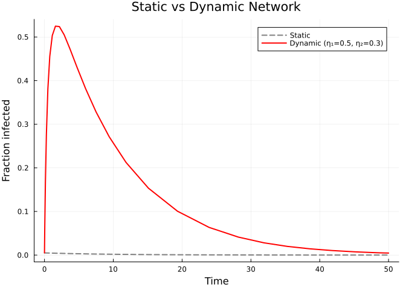
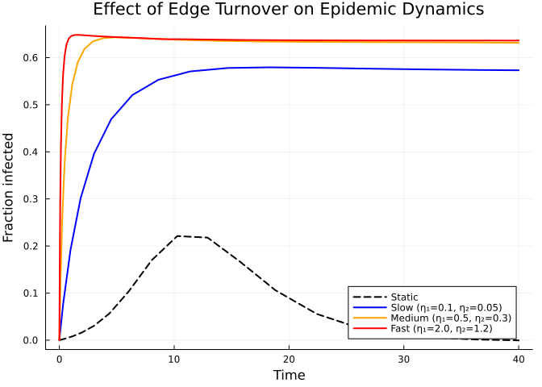
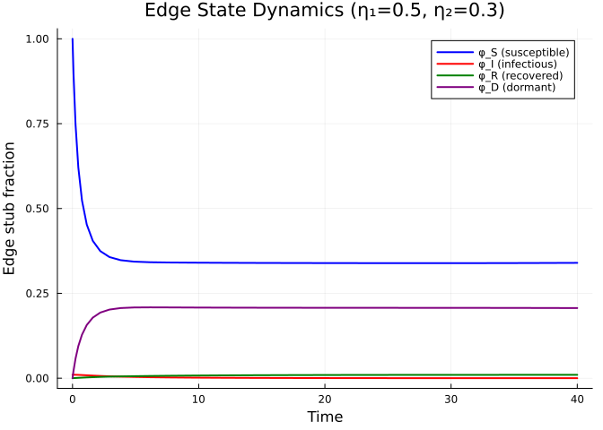

# Dynamic Networks
Simon Frost
2026-05-13

- [Introduction](#introduction)
- [Setup](#setup)
- [Static SIR Baseline](#static-sir-baseline)
- [Dynamic SIR Model](#dynamic-sir-model)
- [Effect of Edge Dynamics](#effect-of-edge-dynamics)
- [Inspecting Edge States](#inspecting-edge-states)
- [Dynamic SEIR](#dynamic-seir)
- [Simulation validation](#simulation-validation)

## Introduction

Real contact networks are not static — edges form and break over time as
individuals change partners, move between workplaces, or alter social
behaviour during an epidemic. The `DynamicConfigurationModel` in
EdgeBasedModels.jl extends the static EBCM by introducing **dormant edge
stubs** that capture this turnover.

In the dynamic model, active edges break at rate $\eta_2$ (becoming
dormant) and dormant edges form at rate $\eta_1$ (becoming active). This
yields an additional state variable $\varphi_D$ for dormant edges. The
key equations are:

$$\frac{d\theta}{dt} = -\underbrace{\beta \varphi_I}_{\text{transmission}} - \underbrace{\eta_2(\varphi_S + \varphi_I + \varphi_R)}_{\text{edge breaking}} + \underbrace{\eta_1 \varphi_D}_{\text{edge forming}}$$

$$\frac{d\varphi_D}{dt} = \eta_2(\varphi_S + \varphi_I + \varphi_R) - \eta_1 \varphi_D$$

When $\eta_1$ and $\eta_2$ are both zero, the model reduces to the
static EBCM. When edge turnover is fast, the network approaches
mean-field mixing. This framework can model partnership dynamics,
workplace contacts, or **serosorting** — where contact patterns change
based on disease status.

## Setup

``` julia
using EdgeBasedModels
using ModelingToolkit
using Symbolics
using OrdinaryDiffEq
using Plots
```

We define all symbolic parameters used throughout this vignette.

``` julia
@parameters β γ κ η₁ η₂ σ
pgf = poisson_pgf(κ)
```

    DegreePGF(z, exp((-1 + z)*κ))

We also define a helper function to extract population-level
trajectories from an ODE solution, given a Poisson PGF.

``` julia
function extract_SIR(sol, result, κ_val)
    ψ(x) = exp(κ_val * (x - 1))
    θ_vals = compartment(sol, result, :θ)
    S = ψ.(θ_vals)
    R = compartment(sol, result, :R)
    I = 1.0 .- S .- R
    return S, I, R
end
```

    extract_SIR (generic function with 1 method)

## Static SIR Baseline

Before introducing edge dynamics, we build a standard static SIR on a
Poisson network with mean degree $\kappa = 5$.

> [!NOTE]
>
> **$R_0=2$ anchor.** We use $\gamma=0.25$, $\kappa=5$, $T=2/5$, and
> per-edge $\beta=1/6$ with 1% initial infection. Dynamic variants reuse
> these disease parameters so changes reflect edge turnover.

``` julia
static_result = build_sir(pgf, β, γ; form=:expanded)
γ_val = 0.25
R0_target = 2.0
seed_fraction = 0.01
κ_val = 5.0
T_val = R0_target / κ_val
β_val = T_val * γ_val / (1 - T_val)
```

    0.16666666666666669

``` julia
ic_static = default_initial_conditions(static_result; seed_fraction = seed_fraction)
p_static = Dict(β => β_val, γ => γ_val, κ => κ_val)
tspan = (0.0, 40.0)
prob_static = ODEProblem(static_result.system, merge(ic_static, p_static), tspan)
sol_static = solve(prob_static, Tsit5())
```

    retcode: Success
    Interpolation: specialized 4th order "free" interpolation
    t: 19-element Vector{Float64}:
      0.0
      0.09094961414630146
      0.4737685765271724
      1.1194667152434108
      1.943336414785521
      3.0120992575199015
      4.3439876075151584
      6.05162312862639
      8.038814788576333
     10.264632085858668
     12.902851341979162
     15.66880091646387
     18.811957922393077
     22.414052919409702
     25.809916966093233
     29.309945524416857
     32.83684495305802
     36.47307124210958
     40.0
    u: 19-element Vector{Vector{Float64}}:
     [0.0, 0.01, 0.0, 0.010000000000000009, 1.0]
     [0.00023337834911741072, 0.010530760492159199, 0.00023164663522085038, 0.010378061115908534, 0.9998455689098528]
     [0.0013544160177506501, 0.01294725683909643, 0.001306377474706858, 0.012124377065668988, 0.9991290816835288]
     [0.0038216092166684697, 0.01779710582741937, 0.003541646111455431, 0.01571597152499546, 0.9976389025923631]
     [0.00826815878360295, 0.025750307125295316, 0.00736806717602735, 0.02173835394885269, 0.9950879552159818]
     [0.016931507064416706, 0.03991514565742511, 0.014542814343354742, 0.032608628816250596, 0.9903047904377635]
     [0.034198855349653626, 0.06539292529465034, 0.028456992743610618, 0.0521634594049529, 0.9810286715042597]
     [0.07156004503309873, 0.11210297116402176, 0.05786323287091837, 0.08722429474558972, 0.9614245114193878]
     [0.14329259869188982, 0.1765382954970999, 0.11260914561193824, 0.13214898483575904, 0.9249272362587079]
     [0.25738218473111046, 0.22623468104112848, 0.1952542213714452, 0.15819316348649662, 0.8698305190857032]
     [0.4086328748271095, 0.2215275872313541, 0.29539037360385617, 0.1378431727187032, 0.8030730842640958]
     [0.5455176684818525, 0.17071879580911803, 0.37487302776437914, 0.09144808468367187, 0.7500846481570805]
     [0.6543987751513448, 0.1083619596200926, 0.428594586836113, 0.04843642337791569, 0.7142702754425913]
     [0.7273715284102071, 0.057840790305424696, 0.4584244270936046, 0.021171606892957457, 0.6943837152709302]
     [0.7636170366723546, 0.030210903469530388, 0.47070750486957147, 0.009315432025932468, 0.686194996753619]
     [0.7826292310256151, 0.01491927681194623, 0.4761712214885132, 0.003929805356705884, 0.6825525190076578]
     [0.791955844161402, 0.007143850397691981, 0.4784788195388368, 0.0016349953276991072, 0.681014120307442]
     [0.7964738721524174, 0.003278904718640857, 0.47945568860335824, 0.0006599625321276558, 0.6803628742644278]
     [0.7984922710955114, 0.001518449398545614, 0.4798423903459015, 0.0002734032508876299, 0.6801050731027323]

``` julia
S_s, I_s, R_s = extract_SIR(sol_static, static_result, 5.0)
plot(sol_static.t, S_s, label="S", lw=2, color=:blue)
plot!(sol_static.t, I_s, label="I", lw=2, color=:red)
plot!(sol_static.t, R_s, label="R", lw=2, color=:green)
xlabel!("Time")
ylabel!("Fraction of population")
title!("Static SIR (κ=5, R₀=2, γ=0.25)")
```

<div id="fig-static-sir">


Figure 1: SIR epidemic on a static Poisson network with mean degree κ =
5.

</div>

## Dynamic SIR Model

Now we build an SIR model on a **dynamic network** where edges break at
rate $\eta_2 = 0.3$ and form at rate $\eta_1 = 0.5$. At equilibrium
(before the epidemic), the fraction of dormant edges would be
$\eta_2/\eta_1 = 0.6$. Since we start with all edges active
($\varphi_D(0) = 0$), the dormant population builds up as edges break.

``` julia
progression = DiseaseProgression(
    [DiseaseStage(:I; transmission_rate=β), DiseaseStage(:R)],
    [DiseaseTransition(:I, :R, γ)];
    entry=:I
)
dyn_model = DynamicConfigurationModel(pgf, progression, η₁, η₂)
dyn_result = build_edge_system(dyn_model)
```

    EdgeModelSystem(Model dynamic_ebm:
    Equations (6):
      6 standard: see equations(dynamic_ebm)
    Unknowns (6): see unknowns(dynamic_ebm)
      pop_R(t)
      pop_I(t)
      φ_R(t)
      φ_I(t)
      ⋮
    Parameters (6): see parameters(dynamic_ebm)
      κ
      ρ
      η₂
      β
      ⋮
    Observed (3): see observed(dynamic_ebm), Dict{Symbol, Any}(:φ_D => φ_D(t), :R => pop_R(t), :φ_I => φ_I(t), :pop_I => pop_I(t), :pop_R => pop_R(t), :φ_R => φ_R(t), :θ => θ(t)), Dict{Symbol, Any}(:I => I(t), :φ_S => φ_S(t), :S => S(t), :edge_hazard => φ_I(t)*β, :excess_hazard => φ_I(t)*β*κ), Dict{Symbol, Any}(:seed_groups => Any[(entry = pop_I(t), susceptible_expr = exp((-1 + θ(t))*κ))], :rho_param => ρ, :edge_seed_groups => Any[(entry = φ_I(t), theta = θ(t), phi_S_expr = (exp((-1 + θ(t))*κ)*(1 - ρ)) / exp(0))]))

The dynamic SIR model has 5 ODEs — the standard $\theta$, $\varphi_I$,
$\varphi_R$, $R$ plus the dormant edge state $\varphi_D$:

``` julia
eqs = ModelingToolkit.equations(dyn_result.system)
println("Number of ODEs: ", length(eqs))
for eq in eqs
    println(eq)
end
```

    Number of ODEs: 6
    Differential(t, 1)(pop_R(t)) ~ pop_I(t)*γ
    Differential(t, 1)(pop_I(t)) ~ -pop_I(t)*γ + φ_I(t)*exp((-1 + θ(t))*κ)*β*κ*(1 - ρ)
    Differential(t, 1)(φ_R(t)) ~ φ_I(t)*γ - φ_R(t)*η₂ + φ_D(t)*pop_R(t)*η₁
    Differential(t, 1)(φ_I(t)) ~ -φ_I(t)*(β + γ + η₂) + pop_I(t)*φ_D(t)*η₁ + φ_I(t)*φ_S(t)*β*κ
    Differential(t, 1)(φ_D(t)) ~ (φ_I(t) + φ_S(t) + φ_R(t))*η₂ - φ_D(t)*η₁
    Differential(t, 1)(θ(t)) ~ -φ_I(t)*β - (φ_I(t) + φ_S(t) + φ_R(t))*η₂ + φ_D(t)*η₁

We can also inspect the state variables and observables:

``` julia
println("State variables: ", keys(dyn_result.variables))
println("Observables: ", keys(dyn_result.observables))
```

    State variables: [:φ_D, :R, :φ_I, :pop_I, :pop_R, :φ_R, :θ]
    Observables: [:I, :φ_S, :S, :edge_hazard, :excess_hazard]

Now solve the dynamic model:

``` julia
ic_dyn = default_initial_conditions(dyn_result; seed_fraction = seed_fraction)
p_dyn = Dict(β => β_val, γ => γ_val, κ => κ_val, η₁ => 0.5, η₂ => 0.3)
prob_dyn = ODEProblem(dyn_result.system, merge(ic_dyn, p_dyn), tspan)
sol_dyn = solve(prob_dyn, Tsit5())
```

    retcode: Success
    Interpolation: specialized 4th order "free" interpolation
    t: 23-element Vector{Float64}:
      0.0
      0.005426802233448098
      0.07623338948392797
      0.2368716258384217
      0.4585606033643804
      0.7500161282253746
      1.1286286449133054
      1.607001832246569
      2.2017864493186488
      2.9286792727618853
      ⋮
      9.565754242707344
     11.777177543376528
     14.397670765121521
     17.52417251643269
     21.27470058210549
     25.688358055893378
     30.687619817862505
     36.03710015387654
     40.0
    u: 23-element Vector{Vector{Float64}}:
     [0.0, 0.01, 0.0, 0.010000000000000009, 0.0, 1.0]
     [1.3588086731059805e-5, 0.010031013798094185, 1.355990182872345e-5, 0.010005720629467663, 0.001619300412039356, 0.9983716523067084]
     [0.00019453238290120816, 0.010403007406963538, 0.0001890684984721557, 0.010053744787657993, 0.021261509780108625, 0.9786110347139766]
     [0.000626284460240841, 0.011060667938833087, 0.0005756446256386184, 0.01002093915551844, 0.05754972934422453, 0.9420537162199788]
     [0.0012573010698518137, 0.011661707636353753, 0.0010780416015207259, 0.009775573396525444, 0.09445424890933361, 0.9047829533642145]
     [0.0021248508609547673, 0.012097555932978224, 0.0016800296493909453, 0.009281788504503655, 0.12818074752126368, 0.8705930995265131]
     [0.0032816823442852927, 0.012291674610161302, 0.00236716127232518, 0.008545531238987327, 0.15673428448328347, 0.8414768980905032]
     [0.004748263438237318, 0.01218557700716699, 0.00310223947647874, 0.0076297321735073545, 0.17849481418962154, 0.8190719962501817]
     [0.006531225454865408, 0.011756793706305505, 0.003850979063333109, 0.006618622552238603, 0.1933497233408061, 0.8035122014469293]
     [0.008602807423858178, 0.01101727107150938, 0.004582007429281047, 0.005599666101226999, 0.2021960007442932, 0.7939281011904303]
     ⋮
     [0.021012280895385062, 0.004558060622212068, 0.007771068909757127, 0.0016989824064454258, 0.20818004974643214, 0.78445456163217]
     [0.02316572638155159, 0.0032973238456388662, 0.008316017541665714, 0.0012079686268441747, 0.2078810831594766, 0.7842233688394598]
     [0.024957048831204805, 0.002238269828523634, 0.008797350968891742, 0.0008125882934927725, 0.2076475286770015, 0.7840215767080938]
     [0.0263566236791059, 0.001406558686368854, 0.009195396291639298, 0.0005084028964489052, 0.20747722988847117, 0.7838539580263246]
     [0.027367131122695575, 0.0008044717136025721, 0.009496322456985397, 0.00029018443963686784, 0.20736094601684898, 0.7837270243576333]
     [0.02801744012053802, 0.0004164776673186458, 0.009696447881921253, 0.0001500880174358271, 0.20728802890268272, 0.7836436479107011]
     [0.028384235863705545, 0.00019748438565136552, 0.009811937263949546, 7.113812124633724e-5, 0.20723373644092993, 0.7836098463373519]
     [0.028566122836071545, 8.884806973558364e-5, 0.009874855960700729, 3.200297089006071e-5, 0.20696139589054507, 0.7838385174052107]
     [0.028632569550637307, 4.9155392162206266e-5, 0.00990278521725284, 1.771018007129297e-5, 0.2066499075036966, 0.7841340551905939]

``` julia
_, I_static, _ = extract_SIR(sol_static, static_result, 5.0)
_, I_dynamic, _ = extract_SIR(sol_dyn, dyn_result, 5.0)

plot(sol_static.t, I_static, label="Static", lw=2, linestyle=:dash, color=:grey)
plot!(sol_dyn.t, I_dynamic, label="Dynamic (η₁=0.5, η₂=0.3)", lw=2, color=:red)
xlabel!("Time")
ylabel!("Fraction infected")
title!("Static vs Dynamic Network")
```

<div id="fig-dynamic-comparison">



Figure 2: Comparison of the infected fraction I(t) on static versus
dynamic networks.

</div>

Edge dynamics alter the epidemic because edges breaking during an
epidemic can interrupt transmission chains, while new edges forming can
create new pathways for infection.

## Effect of Edge Dynamics

We now compare three scenarios to see how the rate of edge turnover
affects the epidemic:

1.  **Static network** — no edge dynamics ($\eta_1 = \eta_2 = 0$)
2.  **Slow turnover** — $\eta_1 = 0.1$, $\eta_2 = 0.05$
3.  **Fast turnover** — $\eta_1 = 2.0$, $\eta_2 = 1.2$

``` julia
# Slow edge dynamics
p_slow = Dict(β => β_val, γ => γ_val, κ => κ_val, η₁ => 0.1, η₂ => 0.05)
prob_slow = ODEProblem(dyn_result.system, merge(ic_dyn, p_slow), tspan)
sol_slow = solve(prob_slow, Tsit5())

# Fast edge dynamics
p_fast = Dict(β => β_val, γ => γ_val, κ => κ_val, η₁ => 2.0, η₂ => 1.2)
prob_fast = ODEProblem(dyn_result.system, merge(ic_dyn, p_fast), tspan)
sol_fast = solve(prob_fast, Tsit5())
```

    retcode: Success
    Interpolation: specialized 4th order "free" interpolation
    t: 58-element Vector{Float64}:
      0.0
      0.0013567906468560595
      0.02469581107242221
      0.07217171937915491
      0.13476199546640538
      0.2169157800399697
      0.3217500655181623
      0.4532122297782899
      0.6149206588827364
      0.8114494130399637
      ⋮
     33.57952276535734
     34.447551959193355
     35.31558531439189
     36.18362360504327
     37.05166618943433
     37.91971198918165
     38.787760031743915
     39.65580956951739
     40.0
    u: 58-element Vector{Vector{Float64}}:
     [0.0, 0.01, 0.0, 0.010000000000000009, 0.0, 1.0]
     [3.393293789294786e-6, 0.010007748904225962, 3.387399065715611e-6, 0.009989241231924314, 0.001619412804164557, 0.9983783270938853]
     [6.214449365606628e-5, 0.010126180469954739, 6.025419259720881e-5, 0.009799975348664478, 0.026991726235163955, 0.9729675230626209]
     [0.00018344260097193584, 0.010301003929580622, 0.00016827678997537163, 0.00940589290648003, 0.06733894547000528, 0.9325443179461069]
     [0.0003458496936977078, 0.010444277113621964, 0.0002968560479007847, 0.008899291634399517, 0.1051653818017329, 0.8946224278798756]
     [0.0005615092946343718, 0.01054343174902125, 0.0004457198838605809, 0.008285960966503374, 0.13856811055467141, 0.8611021212784612]
     [0.0008385447342894379, 0.010585461270752508, 0.0006096040265685995, 0.007599686745635567, 0.1653866704001695, 0.8341449360838279]
     [0.0011862332273959834, 0.010562201797849807, 0.0007838484626908446, 0.0068780098774796124, 0.1849225432933902, 0.8144507166056009]
     [0.001611516513890308, 0.010468340000806584, 0.0009638095315703899, 0.006161729234056487, 0.19757556766631001, 0.8016223461343784]
     [0.0021218962934148136, 0.010300072645327027, 0.0011476666708578529, 0.005482150301368035, 0.204737274841877, 0.7942704304489739]
     ⋮
     [0.019887265956125916, 7.924699491242265e-5, 0.006904746735950331, 2.7908301172269494e-5, 0.20813859180015581, 0.7864682788517069]
     [0.019903389611116366, 6.956059804243304e-5, 0.006910282712398204, 2.4496844312009458e-5, 0.2081372658471671, 0.7864658201223602]
     [0.01991754251577107, 6.10580319533487e-5, 0.006915141978298272, 2.150237012674606e-5, 0.20813610177231334, 0.7864636621332867]
     [0.019929965532298914, 5.359463607230295e-5, 0.006919407271785487, 1.8873913438457015e-5, 0.2081350786746836, 0.7864617692386559]
     [0.019940870071397155, 4.7043432414086915e-5, 0.006923151193630896, 1.6566741309060043e-5, 0.20813417939400414, 0.7864601089676934]
     [0.0199504417089643, 4.129295544345219e-5, 0.0069264374632675265, 1.4541587634391356e-5, 0.20813338931502665, 0.786458652370706]
     [0.019958843348468095, 3.624535426669747e-5, 0.006929322012921653, 1.276398389026971e-5, 0.20813269561653353, 0.7864573740272907]
     [0.01996621799029598, 3.181473045308955e-5, 0.006931853941051403, 1.1203673058006343e-5, 0.20813208693670848, 0.7864562517305467]
     [0.019968886036787325, 3.021222599758533e-5, 0.006931482969601551, 1.0637617361912958e-5, 0.20822302584811925, 0.7863646865062369]

``` julia
_, I_static, _ = extract_SIR(sol_static, static_result, 5.0)
_, I_slow, _ = extract_SIR(sol_slow, dyn_result, 5.0)
_, I_fast, _ = extract_SIR(sol_fast, dyn_result, 5.0)

plot(sol_static.t, I_static, label="Static", lw=2, color=:black, linestyle=:dash)
plot!(sol_slow.t, I_slow, label="Slow (η₁=0.1, η₂=0.05)", lw=2, color=:blue)
plot!(sol_dyn.t, I_dynamic, label="Medium (η₁=0.5, η₂=0.3)", lw=2, color=:orange)
plot!(sol_fast.t, I_fast, label="Fast (η₁=2.0, η₂=1.2)", lw=2, color=:red)
xlabel!("Time")
ylabel!("Fraction infected")
title!("Effect of Edge Turnover on Epidemic Dynamics")
```

<div id="fig-edge-turnover">



Figure 3: Effect of edge turnover rate on the epidemic curve. Faster
edge dynamics alter the timing and magnitude of the peak.

</div>

The plot shows that edge dynamics modify both the peak and timing of the
epidemic. The ratio $\eta_2/\eta_1$ controls the equilibrium fraction of
dormant edges, while the absolute magnitudes of $\eta_1$ and $\eta_2$
control how quickly the network responds to population-level changes.

## Inspecting Edge States

The dynamic model tracks four types of edge stubs: susceptible
($\varphi_S$), infectious ($\varphi_I$), recovered ($\varphi_R$), and
dormant ($\varphi_D$). The susceptible fraction is computed
algebraically as $\varphi_S = \psi'(\theta)/\psi'(1)$, while the others
are ODE states.

``` julia
κ_val = 5.0
θ_vals = compartment(sol_dyn, dyn_result, :θ)
φ_S_vals = exp.(κ_val .* (θ_vals .- 1.0))
φ_I_vals = compartment(sol_dyn, dyn_result, :φ_I)
φ_R_vals = compartment(sol_dyn, dyn_result, :φ_R)
φ_D_vals = compartment(sol_dyn, dyn_result, :φ_D)

plot(sol_dyn.t, φ_S_vals, label="φ_S (susceptible)", lw=2, color=:blue)
plot!(sol_dyn.t, φ_I_vals, label="φ_I (infectious)", lw=2, color=:red)
plot!(sol_dyn.t, φ_R_vals, label="φ_R (recovered)", lw=2, color=:green)
plot!(sol_dyn.t, φ_D_vals, label="φ_D (dormant)", lw=2, color=:purple)
xlabel!("Time")
ylabel!("Edge stub fraction")
title!("Edge State Dynamics (η₁=0.5, η₂=0.3)")
```

<div id="fig-edge-states">



Figure 4: Edge-level state dynamics during the epidemic on a dynamic
network (η₁=0.5, η₂=0.3). The dormant edge fraction (φ_D) grows as
active edges break.

</div>

Initially, all edges are active and connected to susceptible neighbours
($\varphi_S \approx 1$). As the epidemic progresses, $\varphi_S$
decreases while $\varphi_I$ and $\varphi_R$ grow. The dormant edge
fraction $\varphi_D$ builds up from zero as active edges break,
eventually reaching an equilibrium determined by the ratio
$\eta_2/\eta_1$.

## Dynamic SEIR

The dynamic network framework also works with complex disease
progressions. Here we build a dynamic **SEIR** model, which adds an
exposed (latent) stage $E$ that is non-infectious.

``` julia
seir_progression = DiseaseProgression(
    [
        DiseaseStage(:E; transmission_rate=0),
        DiseaseStage(:I; transmission_rate=β),
        DiseaseStage(:R)
    ],
    [
        DiseaseTransition(:E, :I, σ),
        DiseaseTransition(:I, :R, γ)
    ];
    entry=:E
)
dyn_seir_model = DynamicConfigurationModel(pgf, seir_progression, η₁, η₂)
dyn_seir_result = build_edge_system(dyn_seir_model)
```

    EdgeModelSystem(Model dynamic_ebm:
    Equations (8):
      8 standard: see equations(dynamic_ebm)
    Unknowns (8): see unknowns(dynamic_ebm)
      pop_R(t)
      pop_I(t)
      pop_E(t)
      φ_R(t)
      ⋮
    Parameters (7): see parameters(dynamic_ebm)
      κ
      ρ
      η₂
      β
      ⋮
    Observed (3): see observed(dynamic_ebm), Dict{Symbol, Any}(:φ_D => φ_D(t), :R => pop_R(t), :φ_I => φ_I(t), :pop_I => pop_I(t), :pop_R => pop_R(t), :φ_R => φ_R(t), :θ => θ(t), :φ_E => φ_E(t), :pop_E => pop_E(t)), Dict{Symbol, Any}(:I => I(t), :φ_S => φ_S(t), :S => S(t), :edge_hazard => φ_I(t)*β, :excess_hazard => φ_I(t)*β*κ), Dict{Symbol, Any}(:seed_groups => Any[(entry = pop_E(t), susceptible_expr = exp((-1 + θ(t))*κ))], :rho_param => ρ, :edge_seed_groups => Any[(entry = φ_E(t), theta = θ(t), phi_S_expr = (exp((-1 + θ(t))*κ)*(1 - ρ)) / exp(0))]))

The dynamic SEIR model has 6 ODEs — adding $\varphi_E$ to the dynamic
SIR’s set:

``` julia
seir_eqs = ModelingToolkit.equations(dyn_seir_result.system)
println("Number of ODEs: ", length(seir_eqs))
for eq in seir_eqs
    println(eq)
end
```

    Number of ODEs: 8
    Differential(t, 1)(pop_R(t)) ~ pop_I(t)*γ
    Differential(t, 1)(pop_I(t)) ~ -pop_I(t)*γ + pop_E(t)*σ
    Differential(t, 1)(pop_E(t)) ~ -pop_E(t)*σ + φ_I(t)*exp((-1 + θ(t))*κ)*β*κ*(1 - ρ)
    Differential(t, 1)(φ_R(t)) ~ φ_I(t)*γ - φ_R(t)*η₂ + φ_D(t)*pop_R(t)*η₁
    Differential(t, 1)(φ_I(t)) ~ -φ_I(t)*(β + γ + η₂) + φ_E(t)*σ + pop_I(t)*φ_D(t)*η₁
    Differential(t, 1)(φ_E(t)) ~ -φ_E(t)*(η₂ + σ) + pop_E(t)*φ_D(t)*η₁ + φ_I(t)*φ_S(t)*β*κ
    Differential(t, 1)(φ_D(t)) ~ (φ_I(t) + φ_E(t) + φ_S(t) + φ_R(t))*η₂ - φ_D(t)*η₁
    Differential(t, 1)(θ(t)) ~ -φ_I(t)*β - (φ_I(t) + φ_E(t) + φ_S(t) + φ_R(t))*η₂ + φ_D(t)*η₁

``` julia
println("State variables: ", keys(dyn_seir_result.variables))
```

    State variables: [:φ_D, :R, :φ_I, :pop_I, :pop_R, :φ_R, :θ, :φ_E, :pop_E]

The dynamic framework is fully composable — any disease progression
supported by `EdgeBasedModels.jl` can be combined with edge formation
and breaking dynamics, simply by wrapping it in a
`DynamicConfigurationModel` instead of a `StaticConfigurationModel`.

## Simulation validation

This vignette focuses on a scenario for which `NetworkOutbreaks.jl` does
not yet provide an out-of-the-box stochastic ground truth (multi-type
host graphs with prescribed mixing matrices, time-varying networks via
the EBCM rewiring schedule, multiplex layers, degree-correlated
configuration models, clustered graphs with prescribed triangle counts,
or final-size sweeps over $R_0$).

A future revision will add the missing primitives to NetworkOutbreaks.jl
and overlay the corresponding Gillespie SSA ribbon here. Until then, see
[vignette 01](../01_sir_basics/index.html) for the validation pattern on
a single-layer Poisson configuration-model network with the same
canonical parameters.
