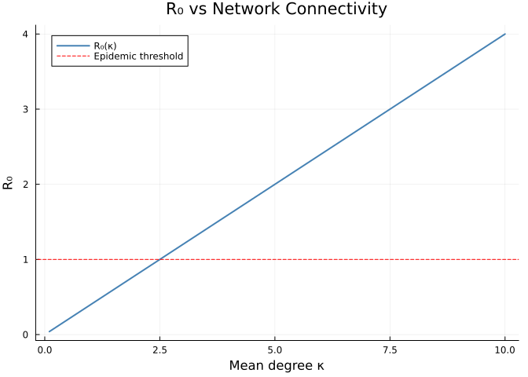
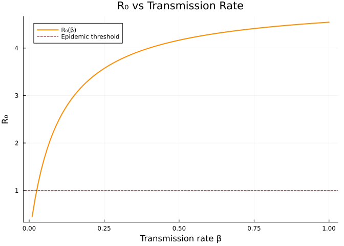
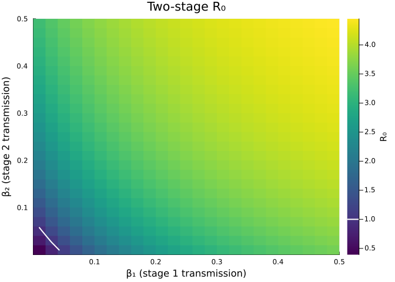
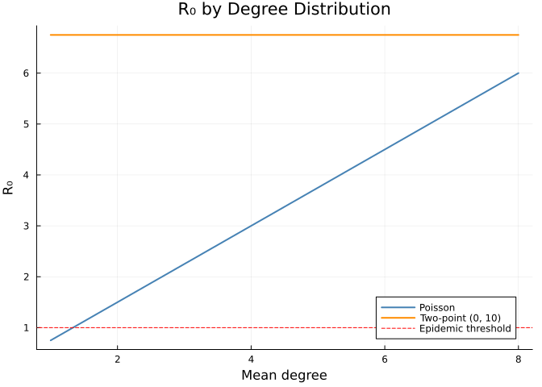

# Symbolic Analysis
Simon Frost
2026-05-14

- [Introduction](#introduction)
- [Setup](#setup)
- [Symbolic $R_0$ for SIR](#symbolic-r_0-for-sir)
- [Numeric $R_0$ Evaluation](#numeric-r_0-evaluation)
- [$R_0$ for SEIR](#r_0-for-seir)
- [Multi-stage $R_0$](#multi-stage-r_0)
- [Inspecting Model Equations](#inspecting-model-equations)
  - [Compact form](#compact-form)
  - [Expanded form](#expanded-form)
  - [SEIR equations](#seir-equations)
- [Parameter Sensitivity of $R_0$](#parameter-sensitivity-of-r_0)
  - [$R_0$ versus mean degree $\kappa$](#r_0-versus-mean-degree-kappa)
  - [$R_0$ versus transmission rate
    $\beta$](#r_0-versus-transmission-rate-beta)
  - [Multi-stage $R_0$ sensitivity](#multi-stage-r_0-sensitivity)
- [PGF Analysis](#pgf-analysis)
  - [Poisson PGF derivatives](#poisson-pgf-derivatives)
  - [Polynomial PGF](#polynomial-pgf)
  - [Comparing $R_0$ across degree
    distributions](#comparing-r_0-across-degree-distributions)
- [Summary](#summary)
- [Simulation validation](#simulation-validation)

## Introduction

One of the key strengths of EdgeBasedModels.jl is that all model
equations are generated **symbolically** using
[Symbolics.jl](https://github.com/JuliaSymbolics/Symbolics.jl) and
[ModelingToolkit.jl](https://github.com/SciML/ModelingToolkit.jl). This
means we can inspect, simplify, and analyse model equations before
running any simulation.

This vignette demonstrates:

- Computing $R_0$ symbolically for SIR, SEIR, and multi-stage models
- Evaluating symbolic expressions numerically
- Inspecting the ODE equations generated by model builders
- Sensitivity analysis of $R_0$ to model parameters
- Working with probability generating functions (PGFs) symbolically

## Setup

``` julia
using EdgeBasedModels
using ModelingToolkit
using Symbolics
using Plots
```

## Symbolic $R_0$ for SIR

The basic reproduction number $R_0$ for an edge-based model on a
configuration-model network is:

$$R_0 = T \cdot \frac{\psi''(1)}{\psi'(1)}$$

where $T$ is the **transmissibility** (probability of transmission
across a single edge before recovery) and $\psi''(1)/\psi'(1)$ is the
**excess degree ratio** — the expected number of additional edges a
neighbour has beyond the one connecting it to the focal node.

For a single-stage SIR with transmission rate $\beta$ and recovery rate
$\gamma$, the transmissibility is $T = \beta/(\beta + \gamma)$. For a
Poisson network with mean degree $\kappa$, the excess degree ratio
equals $\kappa$, giving:

$$R_0 = \frac{\beta \kappa}{\beta + \gamma}$$

Let us compute this symbolically with `basic_reproduction_number`:

``` julia
@parameters β γ κ
pgf = poisson_pgf(κ)

sir_prog = DiseaseProgression(
    [DiseaseStage(:I; transmission_rate=β), DiseaseStage(:R)],
    [DiseaseTransition(:I, :R, γ)];
    entry=:I
)
scm = StaticConfigurationModel(pgf, sir_prog)
R0_sir = basic_reproduction_number(scm); nothing
```

``` julia
println("Symbolic R₀ (SIR): ", R0_sir)
```

    Symbolic R₀ (SIR): (β*κ) / (β + γ)

The result is a symbolic expression in terms of $\beta$, $\gamma$, and
$\kappa$ that can be manipulated, simplified, or evaluated numerically.

## Numeric $R_0$ Evaluation

We evaluate $R_0$ at the universal anchor ($\gamma = 0.25$, $R_0 = 2$)
by deriving the Poisson configuration-model transmission rate for
$\kappa = 5$:

``` julia
# Universal anchors: γ=0.25, R₀=2, β derived per scenario (see plan.md)
γ_anchor = 0.25
R0_anchor = 2.0
κ_anchor = 5.0
T_anchor = R0_anchor / κ_anchor
β_anchor = T_anchor * γ_anchor / (1 - T_anchor)

R0_val = Symbolics.value(
    Symbolics.substitute(R0_sir, Dict(β => β_anchor, γ => γ_anchor, κ => κ_anchor))
)
println("R₀ = ", R0_val)
println("Expected anchor R₀ = ", R0_anchor)
```

    R₀ = 2.0000000000000004
    Expected anchor R₀ = 2.0

With $\beta = 1/6$, $\gamma = 0.25$, and $\kappa = 5$, we get $R_0 = 2$,
confirming the analytic formula at the shared anchor.

## $R_0$ for SEIR

Adding a non-infectious exposed stage $E$ does **not** change $R_0$,
because $E$ does not contribute to transmission. The transmissibility
$T$ depends only on the infectious stages.

``` julia
@parameters σ

seir_prog = DiseaseProgression(
    [
        DiseaseStage(:E; transmission_rate=0),
        DiseaseStage(:I; transmission_rate=β),
        DiseaseStage(:R)
    ],
    [
        DiseaseTransition(:E, :I, σ),
        DiseaseTransition(:I, :R, γ)
    ];
    entry=:E
)
scm_seir = StaticConfigurationModel(pgf, seir_prog)
R0_seir = basic_reproduction_number(scm_seir)
println("Symbolic R₀ (SEIR): ", R0_seir)
```

    Symbolic R₀ (SEIR): (β*κ) / (β + γ)

``` julia
R0_seir_val = Symbolics.value(
    Symbolics.substitute(R0_seir, Dict(β => β_anchor, γ => γ_anchor, σ => 0.2, κ => κ_anchor))
)
println("SEIR R₀ = ", R0_seir_val)
println("SIR  R₀ = ", R0_val)
println("Equal? ", R0_seir_val ≈ R0_val)
```

    SEIR R₀ = 2.0000000000000004
    SIR  R₀ = 2.0000000000000004
    Equal? true

As expected, the SEIR $R_0$ equals the SIR $R_0$ because the latent
period affects the epidemic *timing* but not the *threshold*.

## Multi-stage $R_0$

For diseases with **multiple infectious stages** (e.g., acute and
chronic phases with different transmission rates), the transmissibility
becomes:

$$T = 1 - \prod_{m \in \text{infectious}} \frac{\gamma_m}{\beta_m + \gamma_m}$$

where the product is over all infectious stages. Each factor
$\gamma_m/(\beta_m + \gamma_m)$ is the probability of progressing
*without* transmitting in stage $m$, so $T$ is the probability of
transmitting in at least one stage.

``` julia
@parameters β₁ β₂ γ₁ γ₂

twostage_prog = DiseaseProgression(
    [
        DiseaseStage(:I1; transmission_rate=β₁),
        DiseaseStage(:I2; transmission_rate=β₂),
        DiseaseStage(:R)
    ],
    [
        DiseaseTransition(:I1, :I2, γ₁),
        DiseaseTransition(:I2, :R, γ₂)
    ];
    entry=:I1
)
scm_twostage = StaticConfigurationModel(pgf, twostage_prog)
R0_twostage = basic_reproduction_number(scm_twostage)
println("Symbolic R₀ (two-stage): ", R0_twostage)
```

    Symbolic R₀ (two-stage): (((β₁ + γ₁)*(β₂ + γ₂) - γ₁*γ₂)*κ) / ((β₁ + γ₁)*(β₂ + γ₂))

``` julia
R0_twostage_val = Symbolics.value(
    Symbolics.substitute(R0_twostage,
        Dict(β₁ => 0.3, γ₁ => 0.2, β₂ => 0.1, γ₂ => 0.3, κ => 5.0))
)
expected_T = 1 - (0.2 / (0.3 + 0.2)) * (0.3 / (0.1 + 0.3))
expected_R0 = expected_T * 5.0
println("Computed R₀  = ", R0_twostage_val)
println("Expected T   = ", expected_T)
println("Expected R₀  = ", expected_R0)
println("Match? ", R0_twostage_val ≈ expected_R0)
```

    Computed R₀  = 3.5
    Expected T   = 0.7
    Expected R₀  = 3.5
    Match? true

## Inspecting Model Equations

EdgeBasedModels.jl generates ODE systems using ModelingToolkit.jl. We
can inspect these equations symbolically before solving.

### Compact form

The compact (Miller) formulation uses just 2 ODEs for SIR:

``` julia
compact_model = build_sir(pgf, β, γ; form=:compact)
compact_eqs = ModelingToolkit.equations(compact_model.system)
println("Compact SIR: ", length(compact_eqs), " ODEs")
for eq in compact_eqs
    println("  ", eq)
end
```

    Compact SIR: 2 ODEs
      Differential(t, 1)(R(t)) ~ (1 - R(t) - exp((-1 + θ(t))*κ)*(1 - ρ))*γ
      Differential(t, 1)(θ(t)) ~ (θ(t)*exp(0)*β - (1 - θ(t))*exp(0)*γ - exp((-1 + θ(t))*κ)*β*(1 - ρ)) / (-exp(0))

### Expanded form

The expanded formulation introduces explicit $\varphi$ variables for
each edge state:

``` julia
expanded_model = build_sir(pgf, β, γ; form=:expanded)
expanded_eqs = ModelingToolkit.equations(expanded_model.system)
println("Expanded SIR: ", length(expanded_eqs), " ODEs")
for eq in expanded_eqs
    println("  ", eq)
end
```

    Expanded SIR: 5 ODEs
      Differential(t, 1)(pop_R(t)) ~ pop_I(t)*γ
      Differential(t, 1)(pop_I(t)) ~ -pop_I(t)*γ + exp((-1 + θ(t))*κ)*phi_I(t)*β*κ*(1 - ρ)
      Differential(t, 1)(phi_R(t)) ~ phi_I(t)*γ
      Differential(t, 1)(phi_I(t)) ~ (exp(0)*phi_I(t)*(β + γ) - exp((-1 + θ(t))*κ)*phi_I(t)*β*κ*(1 - ρ)) / (-exp(0))
      Differential(t, 1)(θ(t)) ~ -phi_I(t)*β

We can also inspect the state variables and observables:

``` julia
println("\nState variables (unknowns):")
for u in ModelingToolkit.unknowns(expanded_model.system)
    println("  ", u)
end
```


    State variables (unknowns):
      pop_R(t)
      pop_I(t)
      phi_R(t)
      phi_I(t)
      θ(t)

``` julia
println("Observed (algebraic) variables:")
for obs in ModelingToolkit.observed(expanded_model.system)
    println("  ", obs)
end
```

    Observed (algebraic) variables:
      S(t) ~ exp((-1 + θ(t))*κ)*(1 - ρ)
      phi_S(t) ~ (exp((-1 + θ(t))*κ)*(1 - ρ)) / exp(0)
      I(t) ~ pop_I(t)

The expanded form makes the edge-level dynamics explicit: each $\varphi$
variable tracks the probability that a random test edge connects to a
neighbour in a given disease stage. The compact form combines these into
a single $\theta$ equation using the PGF.

### SEIR equations

For more complex diseases, the number of equations grows with the number
of disease stages:

``` julia
seir_model = build_seir(pgf, σ, β, γ)
seir_eqs = ModelingToolkit.equations(seir_model.system)
println("Expanded SEIR: ", length(seir_eqs), " ODEs")
for eq in seir_eqs
    println("  ", eq)
end
```

    Expanded SEIR: 7 ODEs
      Differential(t, 1)(pop_R(t)) ~ pop_I(t)*γ
      Differential(t, 1)(pop_I(t)) ~ -pop_I(t)*γ + pop_E(t)*σ
      Differential(t, 1)(pop_E(t)) ~ -pop_E(t)*σ + exp((-1 + θ(t))*κ)*phi_I(t)*β*κ*(1 - ρ)
      Differential(t, 1)(phi_R(t)) ~ phi_I(t)*γ
      Differential(t, 1)(phi_I(t)) ~ phi_E(t)*σ - phi_I(t)*(β + γ)
      Differential(t, 1)(phi_E(t)) ~ (phi_E(t)*exp(0)*σ - exp((-1 + θ(t))*κ)*phi_I(t)*β*κ*(1 - ρ)) / (-exp(0))
      Differential(t, 1)(θ(t)) ~ -phi_I(t)*β

## Parameter Sensitivity of $R_0$

Because $R_0$ is a symbolic expression, we can evaluate it over
parameter ranges to study sensitivity. This is much faster than sweeping
parameters through ODE solutions.

### $R_0$ versus mean degree $\kappa$

``` julia
κ_range = 0.1:0.1:10.0
R0_vs_κ = [
    Symbolics.value(Symbolics.substitute(R0_sir, Dict(β => β_anchor, γ => γ_anchor, κ => κ_v)))
    for κ_v in κ_range
]

plot(κ_range, R0_vs_κ, lw=2, color=:steelblue, label="R₀(κ)")
hline!([1.0], linestyle=:dash, color=:red, label="Epidemic threshold")
xlabel!("Mean degree κ")
ylabel!("R₀")
title!("R₀ vs Network Connectivity")
```

<div id="fig-r0-vs-kappa">



Figure 1: R₀ as a function of mean network degree κ, for anchored β =
1/6 and γ = 0.25. The dashed line marks the epidemic threshold R₀ = 1.

</div>

For a Poisson network with $R_0 = \beta\kappa/(\beta + \gamma)$, the
epidemic threshold $R_0 = 1$ occurs at
$\kappa^* = (\beta + \gamma)/\beta$. With the anchored values
$\beta = 1/6$ and $\gamma = 0.25$, this gives $\kappa^* = 2.5$.

### $R_0$ versus transmission rate $\beta$

``` julia
β_range = 0.01:0.01:1.0
R0_vs_β = [
    Symbolics.value(Symbolics.substitute(R0_sir, Dict(β => β_v, γ => γ_anchor, κ => κ_anchor)))
    for β_v in β_range
]

plot(β_range, R0_vs_β, lw=2, color=:darkorange, label="R₀(β)")
hline!([1.0], linestyle=:dash, color=:red, label="Epidemic threshold")
xlabel!("Transmission rate β")
ylabel!("R₀")
title!("R₀ vs Transmission Rate")
```

<div id="fig-r0-vs-beta">



Figure 2: R₀ as a function of transmission rate β, for fixed κ = 5 and
anchored γ = 0.25.

</div>

$R_0$ increases with $\beta$ but saturates at $\kappa = 5$ as
$\beta \to \infty$ (since $\beta/(\beta + \gamma) \to 1$).

### Multi-stage $R_0$ sensitivity

We can also examine how $R_0$ depends on the relative transmission rates
in a two-stage model:

``` julia
β₁_range = 0.01:0.02:0.5
β₂_range = 0.01:0.02:0.5
R0_matrix = [
    Symbolics.value(Symbolics.substitute(R0_twostage,
        Dict(β₁ => b1, β₂ => b2, γ₁ => 0.2, γ₂ => 0.3, κ => 5.0)))
    for b1 in β₁_range, b2 in β₂_range
]

heatmap(collect(β₁_range), collect(β₂_range), R0_matrix',
    xlabel="β₁ (stage 1 transmission)",
    ylabel="β₂ (stage 2 transmission)",
    title="Two-stage R₀",
    colorbar_title="R₀",
    color=:viridis)
contour!(collect(β₁_range), collect(β₂_range), R0_matrix',
    levels=[1.0], linewidth=2, linecolor=:white, label="")
```

<div id="fig-r0-twostage-heatmap">



Figure 3: Two-stage R₀ as a function of β₁ and β₂, with γ₁ = 0.2, γ₂ =
0.3, κ = 5. The white contour marks R₀ = 1.

</div>

## PGF Analysis

The probability generating function (PGF) encodes the network’s degree
distribution and plays a central role in edge-based models.
EdgeBasedModels.jl provides tools for symbolic manipulation of PGFs.

### Poisson PGF derivatives

For a Poisson network with mean degree $\kappa$, the PGF is
$\psi(z) = e^{\kappa(z-1)}$:

``` julia
pgf_poisson = poisson_pgf(κ)
println("ψ(z) = ", pgf_poisson.expression)
```

    ψ(z) = exp((-1 + z)*κ)

The first and second derivatives are:

``` julia
d1 = pgf_derivative(pgf_poisson, 1)
println("ψ'(z) = ", d1)

d2 = pgf_derivative(pgf_poisson, 2)
println("ψ''(z) = ", d2)
```

    ψ'(z) = exp((-1 + z)*κ)*κ
    ψ''(z) = exp((-1 + z)*κ)*(κ^2)

The **mean degree** is $\psi'(1)$ and the **excess degree ratio** is
$\psi''(1)/\psi'(1)$:

``` julia
mean_deg = mean_degree(pgf_poisson)
println("Mean degree ψ'(1) = ", mean_deg)

excess = Symbolics.simplify(
    Symbolics.substitute(d2, Dict(pgf_poisson.variable => 1)) /
    Symbolics.substitute(d1, Dict(pgf_poisson.variable => 1))
)
println("Excess degree ψ''(1)/ψ'(1) = ", excess)
```

    Mean degree ψ'(1) = exp(0)*κ
    Excess degree ψ''(1)/ψ'(1) = κ

For a Poisson distribution, the excess degree equals the mean degree — a
special property that simplifies the $R_0$ expression.

### Polynomial PGF

For non-Poisson networks, the excess degree differs from the mean
degree. Consider a network with degree distribution $P(k=0) = 0.2$,
$P(k=1) = 0.3$, $P(k=2) = 0.5$:

``` julia
pgf_poly = polynomial_pgf([0.2, 0.3, 0.5])
println("ψ(z) = ", pgf_poly.expression)
println("Mean degree: ", Symbolics.value(mean_degree(pgf_poly)))
```

    ψ(z) = 0.2 + 0.3z + 0.5(z^2)
    Mean degree: 1.3

``` julia
d1_poly = pgf_derivative(pgf_poly, 1)
d2_poly = pgf_derivative(pgf_poly, 2)

d1_at_1 = Symbolics.value(Symbolics.substitute(d1_poly, Dict(pgf_poly.variable => 1)))
d2_at_1 = Symbolics.value(Symbolics.substitute(d2_poly, Dict(pgf_poly.variable => 1)))

println("ψ'(1)  = ", d1_at_1, "  (mean degree)")
println("ψ''(1) = ", d2_at_1)
println("Excess degree ratio ψ''(1)/ψ'(1) = ", d2_at_1 / d1_at_1)
```

    ψ'(1)  = 1.3  (mean degree)
    ψ''(1) = 1
    Excess degree ratio ψ''(1)/ψ'(1) = 0.7692307692307692

For this distribution, the mean degree is 1.3 but the excess degree
ratio is $1.0/1.3 \approx 0.77$ — neighbours tend to have *fewer*
additional contacts than the mean degree suggests. This is because the
degree distribution is concentrated on low values ($k \leq 2$).

### Comparing $R_0$ across degree distributions

We can use the symbolic framework to compare $R_0$ for different network
structures with the same mean degree:

``` julia
@parameters β_plot γ_plot

# Poisson R₀ for varying mean degree
κ_vals = 1.0:0.1:8.0
R0_poisson = [
    Symbolics.value(Symbolics.substitute(R0_sir, Dict(β => 0.3, γ => 0.1, κ => k)))
    for k in κ_vals
]

# Polynomial PGF R₀: for each mean degree, construct a degree distribution
# with P(0) = 1 - μ/k_max, ..., concentrated on {0, k_max}
# Using a simple two-point distribution: P(0) = 1-μ/k_max, P(k_max) = μ/k_max
k_max = 10
R0_poly = Float64[]
for μ in κ_vals
    if μ > k_max
        push!(R0_poly, NaN)
        continue
    end
    probs = zeros(k_max + 1)
    probs[1] = 1.0 - μ / k_max       # P(k=0)
    probs[k_max + 1] = μ / k_max      # P(k=k_max)
    pgf_p = polynomial_pgf(probs)
    prog_p = DiseaseProgression(
        [DiseaseStage(:I; transmission_rate=β_plot), DiseaseStage(:R)],
        [DiseaseTransition(:I, :R, γ_plot)]; entry=:I
    )
    R0_p = basic_reproduction_number(StaticConfigurationModel(pgf_p, prog_p))
    push!(R0_poly, Symbolics.value(Symbolics.substitute(R0_p, Dict(β_plot => 0.3, γ_plot => 0.1))))
end

plot(κ_vals, R0_poisson, lw=2, label="Poisson", color=:steelblue)
plot!(κ_vals, R0_poly, lw=2, label="Two-point (0, $k_max)", color=:darkorange)
hline!([1.0], linestyle=:dash, color=:red, label="Epidemic threshold")
xlabel!("Mean degree")
ylabel!("R₀")
title!("R₀ by Degree Distribution")
```

<div id="fig-r0-comparison">



Figure 4: R₀ for Poisson and polynomial degree distributions, both with
the same mean degree. The Poisson network always has higher R₀ because
its excess degree equals its mean degree.

</div>

## Summary

The symbolic nature of EdgeBasedModels.jl enables powerful analytical
workflows:

- **$R_0$ computation**: Exact symbolic expressions for the basic
  reproduction number, valid for arbitrary disease progressions and
  degree distributions.
- **Equation inspection**: Full visibility into the ODE systems before
  solving, useful for verification and teaching.
- **Parameter sensitivity**: Fast evaluation of $R_0$ across parameter
  ranges without running ODE solvers.
- **PGF analysis**: Symbolic derivatives of the degree distribution’s
  PGF reveal how network structure affects epidemic thresholds.

These capabilities complement the numerical simulation workflow shown in
earlier vignettes, providing analytical insight that guides parameter
choices and model validation.

## Simulation validation

This vignette focuses on a scenario for which `NetworkOutbreaks.jl` does
not yet provide an out-of-the-box stochastic ground truth (multi-type
host graphs with prescribed mixing matrices, time-varying networks via
the EBCM rewiring schedule, multiplex layers, degree-correlated
configuration models, clustered graphs with prescribed triangle counts,
or final-size sweeps over $R_0$).

A future revision will add the missing primitives to NetworkOutbreaks.jl
and overlay the corresponding Gillespie SSA ribbon here. Until then, see
[vignette 01](../01_sir_basics/index.html) for the validation pattern on
a single-layer Poisson configuration-model network with the same
canonical parameters.
