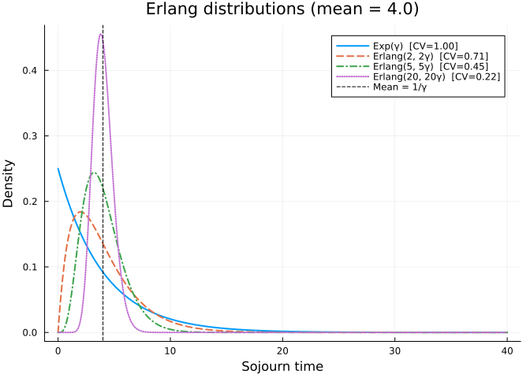
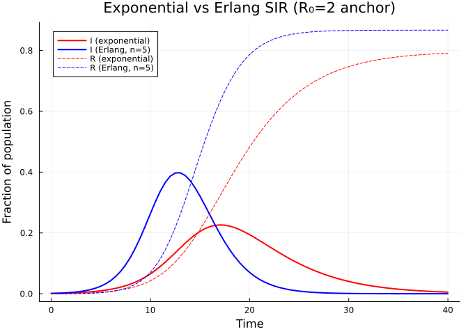
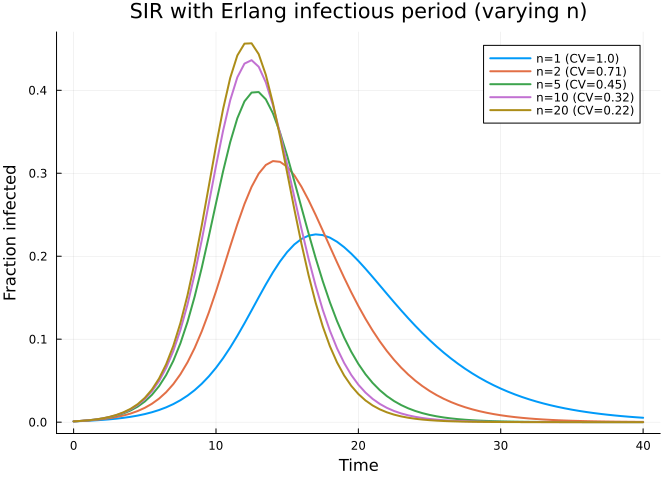
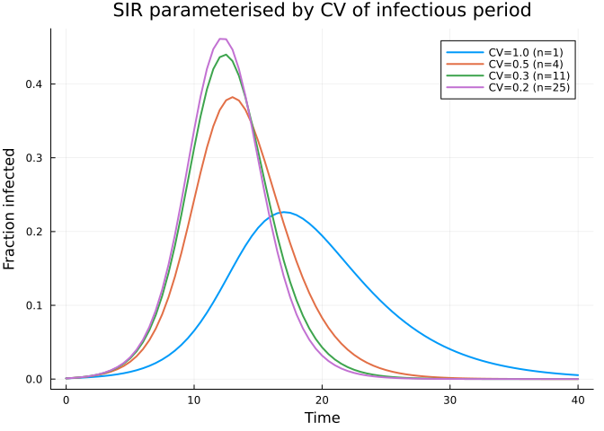
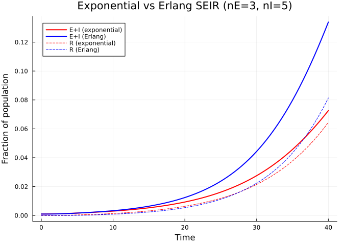
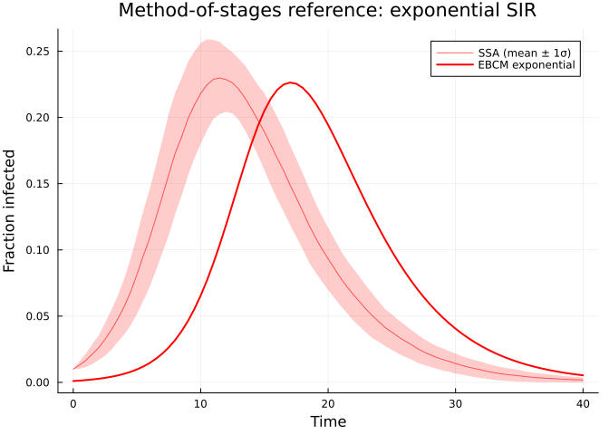

# Method of Stages: Non-Exponential Distributions
Simon Frost
2026-05-14

- [Introduction](#introduction)
- [Setup](#setup)
- [Exponential vs Erlang
  distributions](#exponential-vs-erlang-distributions)
- [Building an Erlang SIR model](#building-an-erlang-sir-model)
- [Comparing exponential vs Erlang
  epidemics](#comparing-exponential-vs-erlang-epidemics)
- [Varying the number of stages](#varying-the-number-of-stages)
- [GammaApproxStage: matching a target
  CV](#gammaapproxstage-matching-a-target-cv)
- [SEIR with Erlang stages](#seir-with-erlang-stages)
- [Simulation validation](#simulation-validation)
- [Summary](#summary)

## Introduction

Standard edge-based compartmental models assume **exponentially
distributed** sojourn times in each disease compartment. The exponential
distribution is memoryless, leading to simple ODE systems, but it is
often unrealistic: real infectious periods tend to be concentrated
around a mean value rather than broadly spread.

The **method of stages** (also called the **linear chain trick**) offers
a simple fix. Replace a single compartment with a chain of $n$ identical
sub-compartments, each with rate $n\gamma$. The total sojourn time then
follows an **Erlang distribution** $\text{Erlang}(n, n\gamma)$, which
has:

- **Mean**: $1/\gamma$ (same as the original exponential)
- **Variance**: $1/(n\gamma^2)$ (decreasing with $n$)
- **Coefficient of variation**: $\text{CV} = 1/\sqrt{n}$

As $n \to \infty$, the Erlang distribution concentrates at the mean,
approaching a fixed (deterministic) sojourn time. Because the mean is
preserved, the basic reproduction number $R_0$ and the final epidemic
size remain unchanged — only the transient dynamics (peak height and
timing) are affected.

This approach was described by Lloyd (2001) for compartmental models and
by Sherborne et al. (2018) for edge-based models on networks.

## Setup

``` julia
using EdgeBasedModels
using ModelingToolkit
using OrdinaryDiffEq
using Symbolics
using Plots
```

``` julia
@parameters β γ κ
pgf = poisson_pgf(κ)
# Universal anchors: γ=0.25, R₀=2, β derived per scenario (see plan.md)
κ_val = 5.0
γ_val = 0.25
R0_target = 2.0
T_val = R0_target / κ_val
β_val = T_val * γ_val / (1 - T_val)
ψ(x) = exp(κ_val * (x - 1))
tspan = (0.0, 40.0)
```

    (0.0, 40.0)

## Exponential vs Erlang distributions

Before building epidemic models, let us visualize how the Erlang
distribution compares to the exponential. All distributions below have
the same anchored mean sojourn time $1/\gamma = 4$, but different
shapes.

``` julia
function erlang_pdf(x, n, total_rate)
    λ = n * total_rate
    return λ^n * x^(n - 1) * exp(-λ * x) / factorial(n - 1)
end

x = range(0, 40, length = 500)
p = plot(xlabel = "Sojourn time", ylabel = "Density",
         title = "Erlang distributions (mean = $(1/γ_val))")
for (n, ls) in [(1, :solid), (2, :dash), (5, :dashdot), (20, :dot)]
    label = n == 1 ? "Exp(γ)  [CV=1.00]" : "Erlang($n, $(n)γ)  [CV=$(round(1/√n; digits=2))]"
    plot!(p, x, erlang_pdf.(x, n, γ_val), label = label, linewidth = 2, linestyle = ls)
end
vline!(p, [1 / γ_val], label = "Mean = 1/γ", color = :black, linestyle = :dash, linewidth = 1)
p
```

<div id="fig-distributions">



Figure 1: Erlang distributions with the same mean (1/γ = 4) but
increasing shape parameter n. As n increases, the distribution
concentrates around the mean.

</div>

The exponential ($n = 1$) has $\text{CV} = 1$ — its standard deviation
equals its mean. As $n$ increases, the distribution narrows: by
$n = 20$, the CV is only $0.22$, and the density is tightly concentrated
around the mean of $10$.

## Building an Erlang SIR model

EdgeBasedModels provides `ErlangStage` to define a stage with
Erlang-distributed sojourn time, and `expand_erlang_stages` to convert
it into a standard `DiseaseProgression`.

An `ErlangStage(:I, n, γ; transmission_rate = β)` represents an
infectious period that is Erlang-distributed with shape $n$ and overall
rate $\gamma$. When expanded, it produces $n$ sub-stages
$I_1, I_2, \ldots, I_n$, each inheriting the transmission rate $\beta$
and connected by transitions at rate $n\gamma$:

$$I_1 \xrightarrow{n\gamma} I_2 \xrightarrow{n\gamma} \cdots \xrightarrow{n\gamma} I_n \xrightarrow{n\gamma} R$$

``` julia
# Standard exponential SIR (n = 1)
model_exp = build_sir(pgf, β, γ; form = :expanded)
println("Exponential SIR: ", length(ModelingToolkit.equations(model_exp.system)), " ODEs")
```

    Exponential SIR: 5 ODEs

``` julia
# Erlang SIR with n = 5 sub-stages for the infectious period
n_stages = 5
erlang_I = ErlangStage(:I, n_stages, γ; transmission_rate = β)
prog_erlang = expand_erlang_stages(
    [erlang_I, DiseaseStage(:R)],
    [DiseaseTransition(:I, :R, n_stages * γ)];
    entry = :I,
)
model_erlang = build_edge_system(
    StaticConfigurationModel(pgf, prog_erlang);
    form = :expanded,
)
println("Erlang SIR (n=$n_stages): ", length(ModelingToolkit.equations(model_erlang.system)), " ODEs")
```

    Erlang SIR (n=5): 13 ODEs

> [!NOTE]
>
> The exit transition from `I` to `R` must use the sub-stage rate
> $n\gamma$, not the overall rate $\gamma$. This ensures all sub-stages
> — including the last one — have identical sojourn-time distributions,
> which is required for the total to be Erlang.

Let us inspect the expanded ODE system:

``` julia
for eq in ModelingToolkit.equations(model_erlang.system)
    println("  ", eq)
end
```

      Differential(t, 1)(pop_R(t)) ~ 5pop_I_5(t)*γ
      Differential(t, 1)(pop_I_5(t)) ~ 5pop_I_4(t)*γ - 5pop_I_5(t)*γ
      Differential(t, 1)(pop_I_4(t)) ~ -5pop_I_4(t)*γ + 5pop_I_3(t)*γ
      Differential(t, 1)(pop_I_3(t)) ~ -5pop_I_3(t)*γ + 5pop_I_2(t)*γ
      Differential(t, 1)(pop_I_2(t)) ~ -5pop_I_2(t)*γ + 5pop_I_1(t)*γ
      Differential(t, 1)(pop_I_1(t)) ~ -5pop_I_1(t)*γ + (phi_I_3(t) + phi_I_2(t) + phi_I_4(t) + phi_I_5(t) + phi_I_1(t))*exp((-1 + θ(t))*κ)*β*κ*(1 - ρ)
      Differential(t, 1)(phi_R(t)) ~ 5phi_I_5(t)*γ
      Differential(t, 1)(phi_I_5(t)) ~ 5phi_I_4(t)*γ - phi_I_5(t)*β - 5phi_I_5(t)*γ
      Differential(t, 1)(phi_I_4(t)) ~ 5phi_I_3(t)*γ - phi_I_4(t)*β - 5phi_I_4(t)*γ
      Differential(t, 1)(phi_I_3(t)) ~ -phi_I_3(t)*β - 5phi_I_3(t)*γ + 5phi_I_2(t)*γ
      Differential(t, 1)(phi_I_2(t)) ~ -phi_I_2(t)*β - 5phi_I_2(t)*γ + 5phi_I_1(t)*γ
      Differential(t, 1)(phi_I_1(t)) ~ (exp(0)*phi_I_1(t)*β + 5exp(0)*phi_I_1(t)*γ - (phi_I_3(t) + phi_I_2(t) + phi_I_4(t) + phi_I_5(t) + phi_I_1(t))*exp((-1 + θ(t))*κ)*β*κ*(1 - ρ)) / (-exp(0))
      Differential(t, 1)(θ(t)) ~ -(phi_I_3(t) + phi_I_2(t) + phi_I_4(t) + phi_I_5(t) + phi_I_1(t))*β

## Comparing exponential vs Erlang epidemics

Both models have the same mean infectious period ($1/\gamma$) and
per-edge transmission rate ($\beta$), so $R_0$ is identical. Let us
compare the dynamics.

``` julia
# Solve exponential SIR
ic_exp = default_initial_conditions(model_exp)
prob_exp = ODEProblem(
    model_exp.system,
    merge(ic_exp, Dict(β => β_val, γ => γ_val, κ => κ_val)),
    tspan,
)
sol_exp = solve(prob_exp, Tsit5(); saveat = 0.5)

S_exp = compartment(sol_exp, model_exp, :S)
I_exp = compartment(sol_exp, model_exp, :I)
R_exp = compartment(sol_exp, model_exp, :R)
```

    81-element Vector{Float64}:
     0.0
     0.00014430664466060414
     0.0003321821817661868
     0.0005724278469447895
     0.0008759755245426545
     0.0012563423418836285
     0.0017301607135635916
     0.0023178504578487834
     0.003044381011402437
     0.0039401158105192065
     ⋮
     0.782710296293347
     0.7841668534879456
     0.7854803945031333
     0.7866641867434654
     0.7877305246909642
     0.7886907299051198
     0.7895551510228892
     0.7903331637586972
     0.7910331565859934

``` julia
# Solve Erlang SIR
ic_erlang = default_initial_conditions(model_erlang)
prob_erlang = ODEProblem(
    model_erlang.system,
    merge(ic_erlang, Dict(β => β_val, γ => γ_val, κ => κ_val)),
    tspan,
)
sol_erlang = solve(prob_erlang, Tsit5(); saveat = 0.5)

S_erl = compartment(sol_erlang, model_erlang, :S)
I_erl = compartment(sol_erlang, model_erlang, :I)
R_erl = compartment(sol_erlang, model_erlang, :R)
```

    81-element Vector{Float64}:
     0.0
     5.113100412272346e-7
     1.0771126789171207e-5
     5.527474229634205e-5
     0.00016209373866774465
     0.0003554096958735769
     0.0006572135390000347
     0.0010928172168988906
     0.001696418866002999
     0.0025160832411346822
     ⋮
     0.8669485644104384
     0.8669639422187628
     0.8669766548846058
     0.8669860211407938
     0.8669931652896282
     0.8669997356369467
     0.8670049063381747
     0.8670089581581886
     0.8670121613172164

``` julia
plot(sol_exp.t, I_exp, label = "I (exponential)", linewidth = 2, color = :red)
plot!(sol_erlang.t, I_erl, label = "I (Erlang, n=5)", linewidth = 2, color = :blue)
plot!(sol_exp.t, R_exp, label = "R (exponential)", linewidth = 1, color = :red,
      linestyle = :dash)
plot!(sol_erlang.t, R_erl, label = "R (Erlang, n=5)", linewidth = 1, color = :blue,
      linestyle = :dash)
xlabel!("Time")
ylabel!("Fraction of population")
title!("Exponential vs Erlang SIR (R₀=2 anchor)")
```

<div id="fig-exp-vs-erlang">



Figure 2: Exponential vs Erlang (n=5) SIR. The Erlang model produces a
sharper, higher, earlier peak but converges to the same final size.

</div>

The final sizes converge to the same value — both epidemics infect the
same total fraction of the population. However, the Erlang model
produces a sharper, higher peak that arrives earlier. This is because a
more concentrated infectious period means individuals transmit infection
over a narrower time window, leading to more synchronised dynamics.

## Varying the number of stages

Let us sweep over $n = 1, 2, 5, 10, 20$ to see how the epidemic curve
changes as the infectious period distribution narrows.

``` julia
p = plot(xlabel = "Time", ylabel = "Fraction infected",
         title = "SIR with Erlang infectious period (varying n)")

for n in [1, 2, 5, 10, 20]
    if n == 1
        model_n = build_sir(pgf, β, γ; form = :expanded)
    else
        erl = ErlangStage(:I, n, γ; transmission_rate = β)
        prog_n = expand_erlang_stages(
            [erl, DiseaseStage(:R)],
            [DiseaseTransition(:I, :R, n * γ)];
            entry = :I,
        )
        model_n = build_edge_system(
            StaticConfigurationModel(pgf, prog_n);
            form = :expanded,
        )
    end

    ic_n = default_initial_conditions(model_n)
    prob_n = ODEProblem(
        model_n.system,
        merge(ic_n, Dict(β => β_val, γ => γ_val, κ => κ_val)),
        tspan,
    )
    sol_n = solve(prob_n, Tsit5(); saveat = 0.5)

    I_n = compartment(sol_n, model_n, :I)

    cv = round(1 / √n; digits = 2)
    plot!(p, sol_n.t, I_n, label = "n=$n (CV=$cv)", linewidth = 2)
end
p
```

<div id="fig-varying-n">



Figure 3: Effect of the number of Erlang stages on the infected curve.
More stages → sharper peak, same final size.

</div>

As $n$ increases, the epidemic peak becomes taller and narrower. The
curve approaches the limiting behaviour of a model with a fixed
infectious period of exactly $1/\gamma$. All curves converge to the same
final size, confirming that $R_0$ — and hence the final size — depends
only on the mean infectious period, not its variance.

## GammaApproxStage: matching a target CV

Instead of choosing $n$ directly, it can be more natural to specify the
desired **coefficient of variation** (CV) of the sojourn time.
`GammaApproxStage` does this automatically by selecting:

$$n = \text{round}(1 / \text{CV}^2)$$

This approximates a Gamma distribution with the specified mean and CV
using an Erlang distribution with the closest integer shape parameter.

``` julia
# Demonstrate the mapping from CV to number of sub-stages
println("CV → n sub-stages (mean sojourn = $(1/γ_val))")
println("─" ^ 35)
for cv in [1.0, 0.7, 0.5, 0.3, 0.2, 0.1]
    stage = GammaApproxStage(:I, 1 / γ_val, cv; transmission_rate = β_val)
    actual_cv = round(1 / √stage.n_substages; digits = 3)
    println("  CV = $cv → n = $(stage.n_substages)  (actual CV = $actual_cv)")
end
```

    CV → n sub-stages (mean sojourn = 4.0)
    ───────────────────────────────────
      CV = 1.0 → n = 1  (actual CV = 1.0)
      CV = 0.7 → n = 2  (actual CV = 0.707)
      CV = 0.5 → n = 4  (actual CV = 0.5)
      CV = 0.3 → n = 11  (actual CV = 0.302)
      CV = 0.2 → n = 25  (actual CV = 0.2)
      CV = 0.1 → n = 100  (actual CV = 0.1)

> [!TIP]
>
> Use `GammaApproxStage` when you have empirical estimates of the mean
> and CV of the infectious period (e.g., from clinical data), and
> `ErlangStage` when you want direct control over the number of
> sub-stages.

``` julia
p = plot(xlabel = "Time", ylabel = "Fraction infected",
         title = "SIR parameterised by CV of infectious period")

for cv in [1.0, 0.5, 0.3, 0.2]
    # Use GammaApproxStage to determine n, then build with symbolic params
    n = GammaApproxStage(:I, 1 / γ_val, cv).n_substages
    erl_cv = ErlangStage(:I, n, γ; transmission_rate = β)
    prog_cv = expand_erlang_stages(
        [erl_cv, DiseaseStage(:R)],
        [DiseaseTransition(:I, :R, n * γ)];
        entry = :I,
    )
    model_cv = build_edge_system(
        StaticConfigurationModel(pgf, prog_cv);
        form = :expanded,
    )
    ic_cv = default_initial_conditions(model_cv)
    prob_cv = ODEProblem(
        model_cv.system,
        merge(ic_cv, Dict(β => β_val, γ => γ_val, κ => κ_val)),
        tspan,
    )
    sol_cv = solve(prob_cv, Tsit5(); saveat = 0.5)

    I_cv = compartment(sol_cv, model_cv, :I)

    plot!(p, sol_cv.t, I_cv, label = "CV=$cv (n=$n)", linewidth = 2)
end
p
```

<div id="fig-cv-sweep">



Figure 4: Epidemic curves parameterised by the CV of the infectious
period.

</div>

## SEIR with Erlang stages

Both the latent ($E$) and infectious ($I$) periods can independently use
Erlang distributions. Here we model an SEIR epidemic with
Erlang-distributed $E$ ($n_E = 3$ sub-stages) and Erlang-distributed $I$
($n_I = 5$ sub-stages):

$$S \xrightarrow{\text{infection}} E_1 \to E_2 \to E_3 \xrightarrow{} I_1 \to I_2 \to \cdots \to I_5 \xrightarrow{} R$$

``` julia
@parameters σ
n_E = 3
n_I = 5

erlang_E = ErlangStage(:E, n_E, σ; transmission_rate = 0)
erlang_I_seir = ErlangStage(:I, n_I, γ; transmission_rate = β)

prog_seir_erlang = expand_erlang_stages(
    [erlang_E, erlang_I_seir, DiseaseStage(:R)],
    [
        DiseaseTransition(:E, :I, n_E * σ),
        DiseaseTransition(:I, :R, n_I * γ),
    ];
    entry = :E,
)

model_seir_erlang = build_edge_system(
    StaticConfigurationModel(pgf, prog_seir_erlang);
    form = :expanded,
)
println("Erlang SEIR: ", length(ModelingToolkit.equations(model_seir_erlang.system)), " ODEs")
```

    Erlang SEIR: 19 ODEs

For comparison, the standard exponential SEIR:

``` julia
model_seir_exp = build_seir(pgf, σ, β, γ)
println("Exponential SEIR: ", length(ModelingToolkit.equations(model_seir_exp.system)), " ODEs")
```

    Exponential SEIR: 7 ODEs

``` julia
σ_val = 0.2  # mean latent period = 5 days

# Solve exponential SEIR
ic_seir_exp = default_initial_conditions(model_seir_exp)
prob_seir_exp = ODEProblem(
    model_seir_exp.system,
    merge(ic_seir_exp, Dict(β => β_val, γ => γ_val, σ => σ_val, κ => κ_val)),
    tspan,
)
sol_seir_exp = solve(prob_seir_exp, Tsit5(); saveat = 0.5)

S_se = compartment(sol_seir_exp, model_seir_exp, :S)
R_se = compartment(sol_seir_exp, model_seir_exp, :R)
EI_se = 1.0 .- S_se .- R_se
```

    81-element Vector{Float64}:
     0.0010000000000000009
     0.0010130403803825818
     0.0010471021582875667
     0.0010964702129421737
     0.0011573097888067933
     0.0012270743982618103
     0.0013041384024985025
     0.0013874716430698805
     0.0014765145737077742
     0.0015709644003748869
     ⋮
     0.050348723998371016
     0.052810091799670014
     0.055364020496628946
     0.05801025300421772
     0.060748648293320155
     0.06357914666347099
     0.06650173278380472
     0.0695163964701957
     0.07262309117428513

``` julia
# Solve Erlang SEIR
ic_seir_erl = default_initial_conditions(model_seir_erlang)
prob_seir_erl = ODEProblem(
    model_seir_erlang.system,
    merge(ic_seir_erl, Dict(β => β_val, γ => γ_val, σ => σ_val, κ => κ_val)),
    tspan,
)
sol_seir_erl = solve(prob_seir_erl, Tsit5(); saveat = 0.5)

S_sel = compartment(sol_seir_erl, model_seir_erlang, :S)
R_sel = compartment(sol_seir_erl, model_seir_erlang, :R)
EI_sel = 1.0 .- S_sel .- R_sel
```

    81-element Vector{Float64}:
     0.0010000000000000009
     0.0010003849257825433
     0.001005076959786227
     0.0010211776575882933
     0.0010550697754787778
     0.0011103950706695595
     0.0011875822437588752
     0.001284459887947235
     0.0013972390998937766
     0.001521738915621218
     ⋮
     0.08905319534951961
     0.09400093844281
     0.09914494795381493
     0.10448234742606616
     0.11000957809054189
     0.11572188152140306
     0.12161167547473593
     0.1276697250441966
     0.13388530146344957

``` julia
plot(sol_seir_exp.t, EI_se, label = "E+I (exponential)", linewidth = 2, color = :red)
plot!(sol_seir_erl.t, EI_sel, label = "E+I (Erlang)", linewidth = 2, color = :blue)
plot!(sol_seir_exp.t, R_se, label = "R (exponential)", linewidth = 1, color = :red,
      linestyle = :dash)
plot!(sol_seir_erl.t, R_sel, label = "R (Erlang)", linewidth = 1, color = :blue,
      linestyle = :dash)
xlabel!("Time")
ylabel!("Fraction of population")
title!("Exponential vs Erlang SEIR (nE=$n_E, nI=$n_I)")
```

<div id="fig-seir-erlang">



Figure 5: Exponential vs Erlang SEIR. Erlang stages produce sharper
dynamics for both the latent and infectious periods.

</div>

The Erlang SEIR produces a sharper epidemic curve with a higher, earlier
peak. As with SIR, the final epidemic size is the same for both models
since it depends only on $R_0$ and the degree distribution.

## Simulation validation

We validate the exponential SIR ODE against Gillespie SSA on Erdős–Rényi
networks (`NetworkOutbreaks.jl`). Erlang dynamics involve sub-stages
that require a custom multi-stage model in NO; here we focus on the
exponential case, which is the canonical reference.

``` julia
include("../_validation.jl")

t_g, μ_g, σ_g = gillespie_ribbon(
    sir_model(), Dict(:β => β_val, :γ => γ_val),
    poisson_graph_builder(1000, κ_val);
    N = 1000, n_graphs = 5, nsims_per_graph = 20,
    tspan = tspan, seed_fraction = 0.001)
```

    ([0.0, 0.5, 1.0, 1.5, 2.0, 2.5, 3.0, 3.5, 4.0, 4.5  …  35.5, 36.0, 36.5, 37.0, 37.5, 38.0, 38.5, 39.0, 39.5, 40.0], Dict(:I => [0.001, 0.00135, 0.00171, 0.00229, 0.00285, 0.00376, 0.00447, 0.0056500000000000005, 0.00697, 0.008320000000000001  …  0.00775, 0.00711, 0.00651, 0.005900000000000001, 0.00532, 0.0048, 0.00431, 0.004, 0.00367, 0.00318], :R => [0.0, 0.0002, 0.0004, 0.0005899999999999999, 0.0010400000000000001, 0.00141, 0.00196, 0.0025099999999999996, 0.00329, 0.00417  …  0.46323000000000003, 0.46406000000000003, 0.46482999999999997, 0.46557, 0.46632999999999997, 0.46699, 0.46758, 0.468, 0.4684, 0.46893], :S => [0.999, 0.9984500000000001, 0.9978899999999999, 0.99712, 0.99611, 0.99483, 0.9935700000000001, 0.99184, 0.9897400000000001, 0.98751  …  0.5290199999999999, 0.52883, 0.52866, 0.5285299999999999, 0.52835, 0.5282100000000001, 0.52811, 0.528, 0.5279299999999999, 0.52789]), Dict(:I => [0.0, 0.0009987365756167878, 0.0017132578688722035, 0.0026180993954478594, 0.0036080017693561027, 0.005011340674264259, 0.005970389899793443, 0.007261876374935647, 0.009504337127986585, 0.010943269690323432  …  0.010094878189288153, 0.009475001665733711, 0.00860877518007121, 0.007967737977923751, 0.007418077836466722, 0.006979045114273922, 0.006279186397789273, 0.005710171679210758, 0.00526481555501072, 0.004582311180788114], :R => [0.0, 0.0004020151261036848, 0.0004923659639173309, 0.0006528105515091007, 0.0010436919705032368, 0.0014570968784302961, 0.002201560511743588, 0.003030134843817545, 0.004070824997665235, 0.005471791758693403  …  0.38707198858020503, 0.3877607775498453, 0.3883945212556611, 0.389012457410045, 0.38964581313927876, 0.39019576788162025, 0.39068564903722325, 0.39103530027429245, 0.3913707328161503, 0.3918104379581142], :S => [0.0, 0.0009252354327740622, 0.001669058889241951, 0.0027239306121481844, 0.0041969084340786385, 0.006156305792445744, 0.007651836776918733, 0.009843954202627842, 0.013072926762642486, 0.015637622981938545  …  0.3935276607787308, 0.39368797712570974, 0.3938293539085171, 0.3939374522213219, 0.3940895753941525, 0.39420999620901437, 0.3942909476695369, 0.394382447823829, 0.39444204948767875, 0.394476353966095]))

``` julia
plot(t_g, μ_g[:I], ribbon = σ_g[:I], label = "SSA (mean ± 1σ)",
     color = :red, fillalpha = 0.2, linealpha = 0.6)
plot!(sol_exp.t, I_exp, label = "EBCM exponential",
      color = :red, linewidth = 2)
xlabel!("Time"); ylabel!("Fraction infected")
title!("Method-of-stages reference: exponential SIR")
```

<div id="fig-stages-validation">



Figure 6: Exponential EBCM (red line) vs Gillespie SSA mean ± 1σ (red
ribbon).

</div>

## Summary

- The **method of stages** replaces a single compartment with $n$
  identical sub-compartments, giving an Erlang-distributed sojourn time
  with the same mean but reduced variance.
- **Same mean → same $R_0$ and final epidemic size**; different variance
  → different peak timing and height.
- More stages → sharper, more peaked epidemics, approaching the
  fixed-duration limit.
- `ErlangStage(name, n, γ)` creates an Erlang stage with $n$ sub-stages
  and overall rate $\gamma$.
- `GammaApproxStage(name, mean, cv)` automatically selects
  $n = \text{round}(1/\text{CV}^2)$ to match a target coefficient of
  variation.
- `expand_erlang_stages` converts Erlang stages into a standard
  `DiseaseProgression` compatible with the full edge-based framework.
- Multiple compartments ($E$, $I$, etc.) can each independently use
  Erlang distributions.
