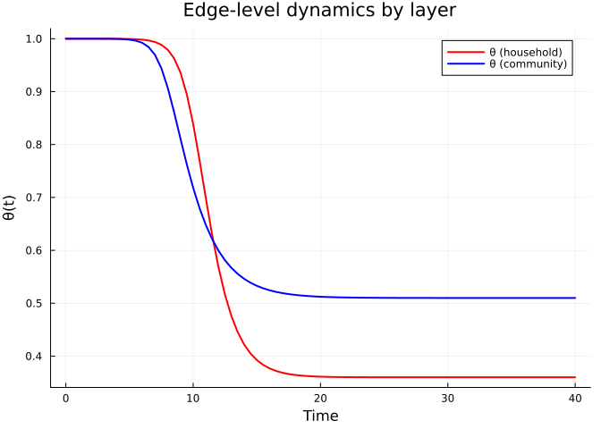
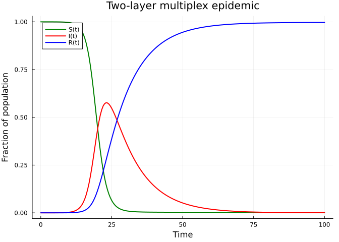
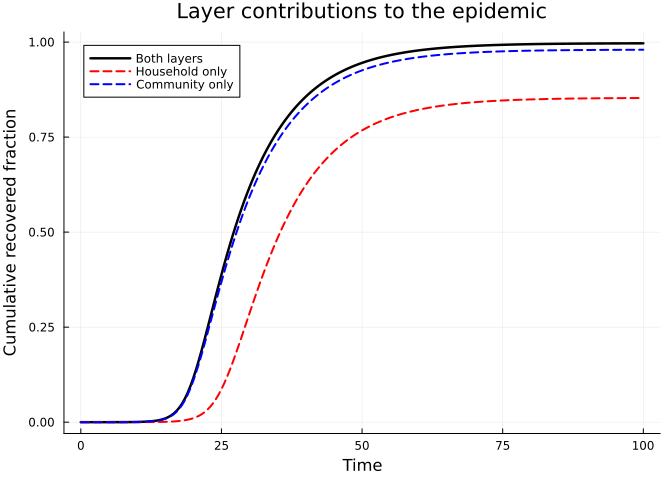
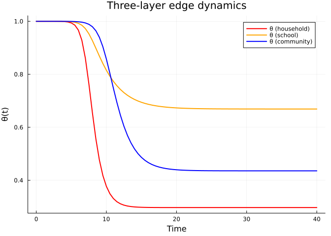
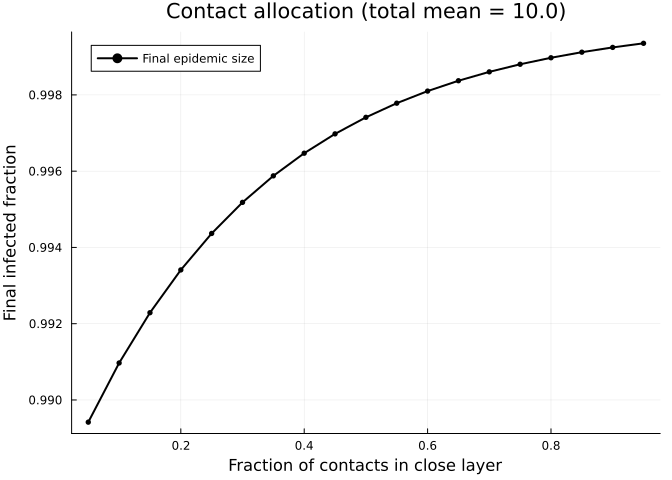
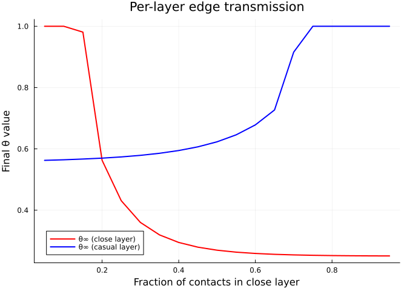
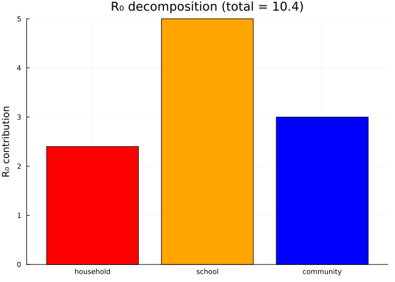
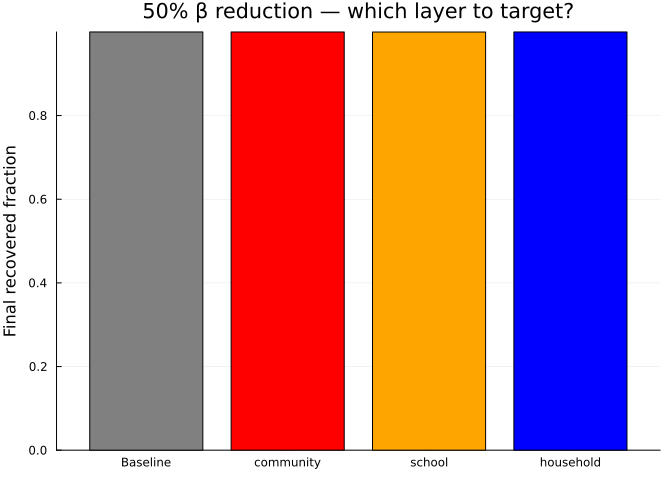
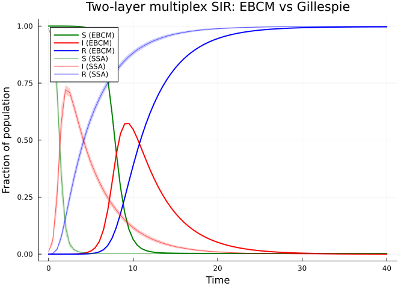

# Multiplex Networks
Simon Frost
2026-05-14

- [Introduction](#introduction)
- [Setup](#setup)
- [Two-Layer Model](#two-layer-model)
  - [Layer dynamics](#layer-dynamics)
  - [Population-level epidemic](#population-level-epidemic)
- [Layer Contributions](#layer-contributions)
- [Three-Layer Example](#three-layer-example)
- [Varying Layer Structure](#varying-layer-structure)
- [R₀ Decomposition](#r₀-decomposition)
  - [Intervention targeting](#intervention-targeting)
- [Summary](#summary)
- [Simulation validation](#simulation-validation)

## Introduction

Real populations do not interact through a single homogeneous contact
network. Instead, individuals maintain several distinct **contact
layers** — households, workplaces, schools, community settings — each
with its own degree distribution and transmission characteristics. A
household layer may be dense (few contacts, high transmission
probability), while a community layer may be sparse (many weak
contacts).

The **multiplex EBCM** extends the edge-based compartmental model to
handle this structure. Each layer $i$ has its own probability generating
function $\psi_i$, transmission rate $\beta_i$, and recovery rate
$\gamma_i$. The key insight is that layers are independent conditional
on a node’s infection status, so each layer gets its own edge-level
variable $\theta_i(t)$. The population-level susceptible fraction is
then:

$$S(t) = \prod_{i} \psi_i\bigl(\theta_i(t)\bigr)$$

Each $\theta_i$ evolves according to the standard EBCM equations for its
layer, but the coupling arises because the infection of a node through
*any* layer removes it from the susceptible pool across *all* layers.

This approach was described by Jacobsen et al. (2016) and builds on the
single-layer framework of Volz (2008) and Miller, Slim & Volz (2012).

## Setup

``` julia
using EdgeBasedModels
using ModelingToolkit
using OrdinaryDiffEq
using Plots
```

We define helper functions to extract trajectories from multiplex ODE
solutions.

``` julia
"""
Extract a named trajectory from a multiplex solution.
"""
function named_trajectory(sol, sys, name::Symbol)
    target = string(name) * "(t)"
    var = findfirst(v -> string(v) == target || endswith(string(v), target), ModelingToolkit.unknowns(sys))
    var === nothing && throw(ArgumentError("unknown trajectory: $name"))
    return sol[ModelingToolkit.unknowns(sys)[var]]
end

"""
Extract θ values from a multiplex solution by matching variable names.
"""
function extract_θ(sol, sys, layer_names)
    θ_vals = Dict{Symbol,Vector{Float64}}()
    for name in layer_names
        θ_vals[name] = named_trajectory(sol, sys, Symbol("θ_$name"))
    end
    return θ_vals
end

"""
Extract the R trajectory from a multiplex solution.
"""
function extract_R(sol, sys)
    return named_trajectory(sol, sys, :R)
end

"""
Compute S(t) = ∏ψᵢ(θᵢ) for Poisson layers with given mean degrees.
"""
function compute_S(θ_dict, mean_degrees)
    layer_names = collect(keys(θ_dict))
    n = length(first(values(θ_dict)))
    S = ones(n)
    for name in layer_names
        κ = mean_degrees[name]
        S .*= exp.(κ .* (θ_dict[name] .- 1))
    end
    return S
end
```

    Main.Notebook.compute_S

## Two-Layer Model

We start with two contact layers representing distinct social settings:

- **Household**: dense contacts (Poisson mean degree 3), per-edge
  transmissibility $T = 0.75$ ($\beta = 0.75$), recovery rate
  $\gamma = 0.25$.
- **Community**: more contacts (Poisson mean degree 8), per-edge
  transmissibility $T = 0.5$ ($\beta = 0.25$), same recovery rate.

``` julia
pgf_hh = poisson_pgf(3.0)
pgf_cm = poisson_pgf(8.0)

layers_2 = [
    (:household, pgf_hh, 0.75, 0.25),
    (:community, pgf_cm, 0.25, 0.25),
]

(sys_2, u0_2, tspan_2, p_2) = build_multiplex_sir(layers_2; tspan = (0.0, 40.0))
```

    (Model multiplex_sir:
    Equations (3):
      3 standard: see equations(multiplex_sir)
    Unknowns (3): see unknowns(multiplex_sir)
      R(t)
      θ_community(t)
      θ_household(t)
    Parameters (4): see parameters(multiplex_sir)
      β_household
      γ_household
      γ_community
      β_community, Dict{Any, Float64}(θ_community(t) => 0.999999, θ_household(t) => 0.999999, R(t) => 0.0), (0.0, 40.0), Dict{Any, Float64}(β_household => 0.75, γ_community => 0.25, β_community => 0.25, γ_household => 0.25))

``` julia
prob_2 = ODEProblem(sys_2, merge(u0_2, p_2), tspan_2)
sol_2 = solve(prob_2, Tsit5(); saveat = 0.5)
```

    retcode: Success
    Interpolation: 1st order linear
    t: 81-element Vector{Float64}:
      0.0
      0.5
      1.0
      1.5
      2.0
      2.5
      3.0
      3.5
      4.0
      4.5
      ⋮
     36.0
     36.5
     37.0
     37.5
     38.0
     38.5
     39.0
     39.5
     40.0
    u: 81-element Vector{Vector{Float64}}:
     [0.0, 0.999999, 0.999999]
     [3.63279446628779e-6, 0.999995742264062, 0.9999897915403911]
     [2.422259667017793e-5, 0.9999765605470764, 0.9999382828010519]
     [0.00014213475595432605, 0.9998661230469152, 0.999643560035654]
     [0.0008158107420174954, 0.999234796551605, 0.9979606301411036]
     [0.004546433575994476, 0.9957424583906558, 0.9886719572364643]
     [0.022311257119507554, 0.979211827512088, 0.9451808429462397]
     [0.07572686335067384, 0.9306173065698817, 0.8224450832543508]
     [0.16023638595115797, 0.8577967265479756, 0.6557695976706662]
     [0.2506693936188328, 0.7863253926489508, 0.5161292964972096]
     ⋮
     [0.997756473556317, 0.5009767458991977, 0.2516374960942665]
     [0.9977905840619087, 0.500976313043348, 0.2517821580952215]
     [0.997820466090964, 0.5009764647141596, 0.251721918244749]
     [0.9978466768797258, 0.5009769516341833, 0.25154493193008315]
     [0.9978698572079168, 0.5009773098758451, 0.2514139455614775]
     [0.997890472508553, 0.5009773717545006, 0.25138705707824005]
     [0.99790884218409, 0.5009771438441062, 0.25146188562276606]
     [0.997925139606422, 0.5009768069772188, 0.2515755715405377]
     [0.997939392116882, 0.5009767162449962, 0.25160477638012474]

### Layer dynamics

Each layer has its own $\theta_i(t)$, representing the probability that
a random edge in layer $i$ has not yet transmitted infection. These
evolve at different rates depending on the layer’s transmission
parameters.

``` julia
layer_names_2 = [:household, :community]
θ_2 = extract_θ(sol_2, sys_2, layer_names_2)

plot(sol_2.t, θ_2[:household], label = "θ (household)", linewidth = 2, color = :red)
plot!(sol_2.t, θ_2[:community], label = "θ (community)", linewidth = 2, color = :blue)
xlabel!("Time")
ylabel!("θ(t)")
title!("Edge-level dynamics by layer")
```

<div id="fig-two-layer-theta">



Figure 1: Edge-level probabilities θ for household and community layers.
The household layer (higher β) drops faster despite having fewer
contacts.

</div>

### Population-level epidemic

The susceptible fraction is the product
$S(t) = \psi_{\mathrm{hh}}(\theta_{\mathrm{hh}}) \cdot \psi_{\mathrm{cm}}(\theta_{\mathrm{cm}})$.

``` julia
mean_degrees_2 = Dict(:household => 3.0, :community => 8.0)
S_2 = compute_S(θ_2, mean_degrees_2)
R_2 = extract_R(sol_2, sys_2)
I_2 = 1.0 .- S_2 .- R_2

plot(sol_2.t, S_2, label = "S(t)", linewidth = 2, color = :green)
plot!(sol_2.t, I_2, label = "I(t)", linewidth = 2, color = :red)
plot!(sol_2.t, R_2, label = "R(t)", linewidth = 2, color = :blue)
xlabel!("Time")
ylabel!("Fraction of population")
title!("Two-layer multiplex epidemic")
```

<div id="fig-two-layer-sir">



Figure 2: Two-layer multiplex SIR epidemic. S, I, and R trajectories
computed from per-layer θ values and the shared recovery variable.

</div>

## Layer Contributions

Which layer drives the epidemic? We can answer this by comparing the
full two-layer model to single-layer models where one layer is “switched
off” (by setting its $\beta = 0$).

``` julia
layers_hh_only = [
    (:household, pgf_hh, 0.75, 0.25),
    (:community, pgf_cm, 0.0, 0.25),  # community switched off
]
layers_cm_only = [
    (:household, pgf_hh, 0.0, 0.25),  # household switched off
    (:community, pgf_cm, 0.25, 0.25),
]

(sys_hh, u0_hh, ts_hh, p_hh) = build_multiplex_sir(layers_hh_only; tspan = (0.0, 40.0))
(sys_cm, u0_cm, ts_cm, p_cm) = build_multiplex_sir(layers_cm_only; tspan = (0.0, 40.0))

sol_hh = solve(ODEProblem(sys_hh, merge(u0_hh, p_hh), ts_hh), Tsit5(); saveat = 0.5)
sol_cm = solve(ODEProblem(sys_cm, merge(u0_cm, p_cm), ts_cm), Tsit5(); saveat = 0.5)
```

    retcode: Success
    Interpolation: 1st order linear
    t: 81-element Vector{Float64}:
      0.0
      0.5
      1.0
      1.5
      2.0
      2.5
      3.0
      3.5
      4.0
      4.5
      ⋮
     36.0
     36.5
     37.0
     37.5
     38.0
     38.5
     39.0
     39.5
     40.0
    u: 81-element Vector{Vector{Float64}}:
     [0.0, 0.999999, 0.999999]
     [1.9682069851703285e-6, 0.9999973539570957, 0.9999991175031212]
     [5.960822364933464e-6, 0.9999939324789047, 0.9999992211992138]
     [1.4244389589973176e-5, 0.9999867522749707, 0.9999993127107802]
     [3.1654318794299666e-5, 0.9999715824689565, 0.999999393469343]
     [6.827212703831255e-5, 0.9999396022922835, 0.9999994647386083]
     [0.00014581210139864354, 0.9998718143451505, 0.9999995276334621]
     [0.00030920178586646066, 0.9997289171760659, 0.9999995831379876]
     [0.0006549410705557083, 0.9994265237111511, 0.9999996321205747]
     [0.0013819926810231594, 0.9987907420501887, 0.9999996753475187]
     ⋮
     [0.9792306230573605, 0.5099140076194297, 0.9999999998775039]
     [0.9793402265924366, 0.5099140910202603, 0.999999999891754]
     [0.9794355347944357, 0.5099145179106217, 0.9999999999041369]
     [0.9795186881804505, 0.5099151325160176, 0.9999999999149347]
     [0.9795918648460826, 0.5099157223677209, 0.9999999999244357]
     [0.9796572804654428, 0.5099160183027741, 0.9999999999329348]
     [0.979717052162368, 0.5099157333625755, 0.999999999940714]
     [0.9797705466170944, 0.5099153154117279, 0.9999999999476803]
     [0.97981776202141, 0.5099149834325335, 0.999999999953828]

``` julia
θ_hh_only = extract_θ(sol_hh, sys_hh, layer_names_2)
θ_cm_only = extract_θ(sol_cm, sys_cm, layer_names_2)

S_hh_only = compute_S(θ_hh_only, mean_degrees_2)
S_cm_only = compute_S(θ_cm_only, mean_degrees_2)
R_hh_only = extract_R(sol_hh, sys_hh)
R_cm_only = extract_R(sol_cm, sys_cm)

plot(sol_2.t, R_2, label = "Both layers", linewidth = 2.5, color = :black)
plot!(sol_hh.t, R_hh_only, label = "Household only", linewidth = 2,
      color = :red, linestyle = :dash)
plot!(sol_cm.t, R_cm_only, label = "Community only", linewidth = 2,
      color = :blue, linestyle = :dash)
xlabel!("Time")
ylabel!("Cumulative recovered fraction")
title!("Layer contributions to the epidemic")
```

<div id="fig-layer-contributions">



Figure 3: Epidemic curves with individual layers vs both layers active.
The combined epidemic is larger than either layer alone, since R₀ is
additive across layers.

</div>

The total $R_0$ for a multiplex model is the sum of per-layer
contributions:

``` julia
R0_total = multiplex_R0(layers_2)
R0_hh = multiplex_R0(layers_hh_only)
R0_cm = multiplex_R0(layers_cm_only)
println("R₀ (both layers):     $(round(R0_total; digits = 3))")
println("R₀ (household only):  $(round(R0_hh; digits = 3))")
println("R₀ (community only):  $(round(R0_cm; digits = 3))")
println("Sum of single layers: $(round(R0_hh + R0_cm; digits = 3))")
```

    R₀ (both layers):     6.25
    R₀ (household only):  2.25
    R₀ (community only):  4.0
    Sum of single layers: 6.25

## Three-Layer Example

Adding more layers is straightforward. In the compact multiplex
implementation used here, each additional layer introduces one
additional edge-survival equation $\theta_i$, together with the shared
recovery equation $R$. So an $L$-layer model has $L + 1$ ODEs in total.

Consider a population with household, school, and community contacts:

- **Household**: Poisson(3), $T = 0.8$ ($\beta = 1.0$), $\gamma = 0.25$
  — few but intense contacts.
- **School**: Poisson(15), $T = 1/3$ ($\beta = 0.125$), $\gamma = 0.25$
  — many contacts, low per-contact transmission.
- **Community**: Poisson(5), $T = 0.6$ ($\beta = 0.375$),
  $\gamma = 0.25$ — moderate in both dimensions.

``` julia
pgf_school = poisson_pgf(15.0)
pgf_cm3 = poisson_pgf(5.0)
pgf_hh3 = poisson_pgf(3.0)

layers_3 = [
    (:household, pgf_hh3,    1.0,   0.25),
    (:school,    pgf_school, 0.125, 0.25),
    (:community, pgf_cm3,    0.375, 0.25),
]

(sys_3, u0_3, ts_3, p_3) = build_multiplex_sir(layers_3; tspan = (0.0, 40.0))
sol_3 = solve(ODEProblem(sys_3, merge(u0_3, p_3), ts_3), Tsit5(); saveat = 0.5)
```

    retcode: Success
    Interpolation: 1st order linear
    t: 81-element Vector{Float64}:
      0.0
      0.5
      1.0
      1.5
      2.0
      2.5
      3.0
      3.5
      4.0
      4.5
      ⋮
     36.0
     36.5
     37.0
     37.5
     38.0
     38.5
     39.0
     39.5
     40.0
    u: 81-element Vector{Vector{Float64}}:
     [0.0, 0.999999, 0.999999, 0.999999]
     [1.783810622744761e-5, 0.9999738293319783, 0.9999904026667394, 0.9999368546517261]
     [0.00036165574780582514, 0.9994876881811198, 0.9998220269174593, 0.9987529907087456]
     [0.006487649656226426, 0.9908470081169506, 0.9968225207246775, 0.9778010042627571]
     [0.057432350354192675, 0.9208477192841362, 0.9720990503295311, 0.81473544654546]
     [0.15585921429416905, 0.7974321028858508, 0.9257960497877081, 0.5648926152428037]
     [0.25329408669449993, 0.6931119100724087, 0.8823363202573526, 0.40048708405130645]
     [0.34063657104773704, 0.6149797281028747, 0.8456547921111012, 0.3084937698010898]
     [0.4179777923194391, 0.5574665291676003, 0.8151187083133106, 0.2584953174724962]
     [0.4863054196310205, 0.515288933556277, 0.7897676005269574, 0.2315047862852041]
     ⋮
     [0.9997740028941887, 0.40001827298798553, 0.6666777551677318, 0.19992754090982262]
     [0.999796979079336, 0.40001826884456937, 0.6666775938090409, 0.19999323313184483]
     [0.9998172545940696, 0.4000182609174536, 0.6666774591857255, 0.20013218249756473]
     [0.9998351490716251, 0.40001826013125386, 0.666677348722546, 0.20014089011600394]
     [0.9998509439627565, 0.40001826596435003, 0.666677258367058, 0.20002838298341405]
     [0.9998648825118841, 0.4000182692878587, 0.6666771831213587, 0.19996321735418415]
     [0.999877181371112, 0.40001826764499177, 0.6666771198453879, 0.1999905053746088]
     [0.9998880343962171, 0.4000182628616879, 0.6666770666848597, 0.20007644320698464]
     [0.9998976126466488, 0.4000182610466125, 0.6666770230712625, 0.20010831102961008]

``` julia
layer_names_3 = [:household, :school, :community]
θ_3 = extract_θ(sol_3, sys_3, layer_names_3)

plot(sol_3.t, θ_3[:household], label = "θ (household)", linewidth = 2, color = :red)
plot!(sol_3.t, θ_3[:school], label = "θ (school)", linewidth = 2, color = :orange)
plot!(sol_3.t, θ_3[:community], label = "θ (community)", linewidth = 2, color = :blue)
xlabel!("Time")
ylabel!("θ(t)")
title!("Three-layer edge dynamics")
```

<div id="fig-three-layer-theta">



Figure 4: Per-layer θ dynamics in the three-layer model. Each layer
decays at its own rate, reflecting different transmission
characteristics.

</div>

``` julia
mean_degrees_3 = Dict(:household => 3.0, :school => 15.0, :community => 5.0)
S_3 = compute_S(θ_3, mean_degrees_3)
R_3 = extract_R(sol_3, sys_3)
I_3 = 1.0 .- S_3 .- R_3

plot(sol_3.t, S_3, label = "S(t)", linewidth = 2, color = :green)
plot!(sol_3.t, I_3, label = "I(t)", linewidth = 2, color = :red)
plot!(sol_3.t, R_3, label = "R(t)", linewidth = 2, color = :blue)
xlabel!("Time")
ylabel!("Fraction of population")
title!("Three-layer multiplex epidemic")
```

<div id="fig-three-layer-sir">


Figure 5: Three-layer multiplex epidemic. The product formula S(t) =
∏ψᵢ(θᵢ) combines contributions from all layers.

</div>

Despite having the highest mean degree, the school layer has the lowest
per-contact transmission rate. The household layer, with few contacts
but high $\beta$, may contribute more to overall transmission. We
quantify this next.

## Varying Layer Structure

How does the distribution of contacts across layers affect epidemic
outcomes? We fix the **total mean contacts** at 10 and vary the
allocation between a “close” layer ($T = 0.75$, $\beta = 0.75$) and a
“casual” layer ($T = 4/9 \approx 0.44$, $\beta = 0.2$), both with
$\gamma = 0.25$.

``` julia
close_fracs = 0.05:0.05:0.95
final_infected = Float64[]
final_θ_close = Float64[]
final_θ_casual = Float64[]

total_contacts = 10.0
β_close = 0.75
β_casual = 0.2
γ_val = 0.25

for f in close_fracs
    k_close = f * total_contacts
    k_casual = (1 - f) * total_contacts
    pgf_c = poisson_pgf(k_close)
    pgf_a = poisson_pgf(k_casual)

    layers_v = [
        (:close,  pgf_c, β_close, γ_val),
        (:casual, pgf_a, β_casual, γ_val),
    ]

    (sys_v, u0_v, ts_v, p_v) = build_multiplex_sir(layers_v; tspan = (0.0, 80.0))
    sol_v = solve(ODEProblem(sys_v, merge(u0_v, p_v), ts_v), Tsit5())

    R_v = extract_R(sol_v, sys_v)
    θ_v = extract_θ(sol_v, sys_v, [:close, :casual])
    θ_c_end = θ_v[:close][end]
    θ_a_end = θ_v[:casual][end]
    push!(final_infected, R_v[end])
    push!(final_θ_close, θ_c_end)
    push!(final_θ_casual, θ_a_end)
end

plot(collect(close_fracs), final_infected,
     label = "Final epidemic size", linewidth = 2, color = :black,
     marker = :circle, markersize = 3)
xlabel!("Fraction of contacts in close layer")
ylabel!("Final infected fraction")
title!("Contact allocation (total mean = $total_contacts)")
```

<div id="fig-allocation">



Figure 6: Effect of redistributing fixed total contacts between a high-β
(close) and low-β (casual) layer. The final epidemic size (1 − S(∞))
varies with the allocation.

</div>

``` julia
plot(collect(close_fracs), final_θ_close,
     label = "θ∞ (close layer)", linewidth = 2, color = :red)
plot!(collect(close_fracs), final_θ_casual,
      label = "θ∞ (casual layer)", linewidth = 2, color = :blue)
xlabel!("Fraction of contacts in close layer")
ylabel!("Final θ value")
title!("Per-layer edge transmission")
```

<div id="fig-allocation-theta">



Figure 7: Final θ values for each layer as the contact allocation
changes. The close layer (high β) shows more transmission per edge when
it has fewer contacts.

</div>

The final epidemic size depends on how contacts are partitioned. Even
with the same total contacts, concentrating more contacts in the
high-$\beta$ layer can increase the overall epidemic size — the
nonlinear coupling between layers means that the distribution matters,
not just the total.

## R₀ Decomposition

For a multiplex model,
$R_0 = \sum_i T_i \cdot \langle k_i^2 - k_i \rangle / \langle k_i \rangle$,
where $T_i = \beta_i / (\beta_i + \gamma_i)$ is the transmissibility of
layer $i$. This additive structure makes it easy to identify which layer
contributes most — and where interventions would be most effective.

``` julia
function layer_R0(name, pgf, β, γ)
    T = β / (β + γ)
    ψ_fn = x -> EdgeBasedModels._build_pgf_fn(pgf)(x)
    ψ1_fn = x -> EdgeBasedModels._build_pgf_deriv_fn(pgf, 1)(x)
    ψ2_fn = x -> EdgeBasedModels._build_pgf_deriv_fn(pgf, 2)(x)
    mean_k = ψ1_fn(1.0)
    excess = ψ2_fn(1.0) / mean_k
    return T * excess
end

r0_contributions = [(String(l[1]), layer_R0(l...)) for l in layers_3]
names_bar = [c[1] for c in r0_contributions]
vals_bar = [c[2] for c in r0_contributions]

bar(names_bar, vals_bar,
    label = "Layer R₀",
    color = [:red, :orange, :blue],
    ylabel = "R₀ contribution",
    title = "R₀ decomposition (total = $(round(sum(vals_bar); digits = 2)))",
    legend = false)
```

<div id="fig-r0-decomposition">



Figure 8: Per-layer R₀ contributions for the three-layer model.
Targeting the layer with the largest R₀ contribution yields the greatest
reduction.

</div>

### Intervention targeting

Suppose we can reduce $\beta$ in one layer by 50%. Which layer should we
target?

``` julia
interventions = Dict{String,Float64}()

for (i, (name, pgf_l, β_l, γ_l)) in enumerate(layers_3)
    modified = collect(layers_3)
    modified[i] = (name, pgf_l, β_l * 0.5, γ_l)

    (sys_int, u0_int, ts_int, p_int) = build_multiplex_sir(modified; tspan = (0.0, 40.0))
    sol_int = solve(ODEProblem(sys_int, merge(u0_int, p_int), ts_int), Tsit5())

    R_int = extract_R(sol_int, sys_int)
    interventions[String(name)] = R_int[end]
end

# Baseline
baseline_final = R_3[end]

bar_names = ["Baseline"; collect(keys(interventions))]
bar_vals = [baseline_final; collect(values(interventions))]
bar_colors = [:gray, :red, :orange, :blue]

bar(bar_names, bar_vals,
    label = false,
    color = bar_colors,
    ylabel = "Final recovered fraction",
    title = "50% β reduction — which layer to target?")
```

<div id="fig-intervention">



Figure 9: Effect of a 50% reduction in β on each layer. Targeting the
layer with the highest R₀ contribution produces the largest reduction in
epidemic size.

</div>

The layer with the largest $R_0$ contribution is the most impactful
intervention target. This decomposition provides a principled basis for
allocating limited resources across contact settings.

## Summary

- **Multiplex EBCM** extends the edge-based framework to populations
  with multiple independent contact layers, each with its own degree
  distribution and transmission dynamics.
- Each layer has its own $\theta_i(t)$; the susceptible fraction is
  $S(t) = \prod_i \psi_i(\theta_i)$.
- `build_multiplex_sir(layers)` constructs the ODE system from a vector
  of `(name, pgf, β, γ)` tuples.
- `multiplex_R0(layers)` computes the total $R_0 = \sum_i R_{0,i}$, with
  each layer contributing independently.
- `susceptible_fraction(pgfs, θ_values)` evaluates the product formula
  at any time point.
- **Contact allocation matters**: redistributing fixed total contacts
  across layers with different transmission rates changes epidemic
  outcomes.
- **Intervention targeting**: the per-layer $R_0$ decomposition
  identifies which layer to prioritise for control measures.

## Simulation validation

We validate the two-layer ODE prediction against a stochastic Gillespie
SSA on `MultiplexNetwork` from `NetworkOutbreaks.jl`. Each layer is
sampled as an independent Poisson(κᵢ) Erdős–Rényi graph; the per-layer
transmission rate βᵢ enters as the layer’s `layer_rate` weight on a
unit-rate infection transition.

Note: the default initial conditions returned by `build_multiplex_sir`
correspond to an infinitesimal seed (`θᵢ(0) = 1 - 10⁻⁶`). For a fair
comparison with a finite-population SSA seeded at fraction `f`, we
re-solve the multiplex ODE with matched ICs: each layer’s
`θᵢ(0) = ψᵢ⁻¹((1 - f)^{1/n})` so that `S(0) = ∏ ψᵢ(θᵢ) = 1 - f`. For
Poisson(κ) PGFs the inverse is `θ = 1 + log((1-f)^{1/n}) / κ`.

``` julia
include("../_validation.jl")

const N_sim = 1000
const seed_fraction_val = 0.001
const tgrid_val = collect(0.0:0.5:40.0)

# --- Re-solve the EBCM with seed-fraction-matched ICs -------------------
# For Poisson(κ) PGF ψ(x) = exp(κ(x-1)), the inverse is ψ⁻¹(y) = 1 + log(y)/κ.
# We want S(0) = ∏ψᵢ(θᵢ) = 1 - f, so set θᵢ(0) = 1 + log((1-f)^{1/n}) / κᵢ.
function poisson_θ0(κ, f, n)
    1.0 + log((1 - f)^(1 / n)) / κ
end
const κ_hh, κ_cm = 3.0, 8.0
θ0_hh = poisson_θ0(κ_hh, seed_fraction_val, 2)
θ0_cm = poisson_θ0(κ_cm, seed_fraction_val, 2)

(sys_v, u0_v_default, ts_v, p_v) = build_multiplex_sir(layers_2; tspan=(0.0, 40.0))
u0_v = Dict(u0_v_default)
for var in collect(keys(u0_v))
    s = string(var)
    if occursin("θ_household", s)
        u0_v[var] = θ0_hh
    elseif occursin("θ_community", s)
        u0_v[var] = θ0_cm
    end
end
sol_v = solve(ODEProblem(sys_v, merge(u0_v, p_v), ts_v), Tsit5(); saveat = 0.5)
θ_v = extract_θ(sol_v, sys_v, layer_names_2)
S_v = compute_S(θ_v, mean_degrees_2)
R_v = extract_R(sol_v, sys_v)
I_v = 1.0 .- S_v .- R_v

# --- Gillespie SSA on MultiplexNetwork ----------------------------------
no_model_mp = OutbreakModel(
    [:S, :I, :R], [false, true, false],
    [OutbreakTransition(:S, :I, 1.0, :infection; via=[:I]),
     OutbreakTransition(:I, :R, 0.25, :spontaneous)];
    name = :SIR_multiplex)

builder = multiplex_graph_builder(N_sim, [
    (0.75, poisson_layer(3.0)),  # household weight = β_hh
    (0.25, poisson_layer(8.0)),  # community  weight = β_cm
])

n_graphs_val   = 5
nsims_per_g    = 20
nsamples       = n_graphs_val * nsims_per_g
S_runs = Matrix{Float64}(undef, nsamples, length(tgrid_val))
I_runs = similar(S_runs); R_runs = similar(S_runs)
rng = StableRNG(20240501)
row = 1
for gi in 1:n_graphs_val
    net = builder(rng)
    spec = OutbreakSpec(model = no_model_mp, network = net,
                        initial = SeedFraction(:I => seed_fraction_val),
                        tspan = (0.0, 40.0))
    ens = simulate_ensemble(spec; nsims = nsims_per_g,
                            seed = 20240501 + 1000 * gi,
                            algorithm = DirectSSA(),
                            parallel = true)
    for traj in ens.trajectories
        for (j, t) in enumerate(tgrid_val)
            st = state_at(traj, t)
            S_runs[row, j] = st[no_model_mp.index_of[:S]] / N_sim
            I_runs[row, j] = st[no_model_mp.index_of[:I]] / N_sim
            R_runs[row, j] = st[no_model_mp.index_of[:R]] / N_sim
        end
        row += 1
    end
end
S_mean = vec(mean(S_runs; dims=1)); S_std = vec(std(S_runs; dims=1))
I_mean = vec(mean(I_runs; dims=1)); I_std = vec(std(I_runs; dims=1))
R_mean = vec(mean(R_runs; dims=1)); R_std = vec(std(R_runs; dims=1))
nothing
```

``` julia
plt = plot(sol_v.t, S_v, color=:green, linewidth=2, label="S (EBCM)")
plot!(plt, sol_v.t, I_v, color=:red,   linewidth=2, label="I (EBCM)")
plot!(plt, sol_v.t, R_v, color=:blue,  linewidth=2, label="R (EBCM)")
plot!(plt, tgrid_val, S_mean, ribbon = S_std, color=:green,
      fillalpha=0.2, linealpha=0.6, linewidth=1, label="S (SSA)")
plot!(plt, tgrid_val, I_mean, ribbon = I_std, color=:red,
      fillalpha=0.2, linealpha=0.6, linewidth=1, label="I (SSA)")
plot!(plt, tgrid_val, R_mean, ribbon = R_std, color=:blue,
      fillalpha=0.2, linealpha=0.6, linewidth=1, label="R (SSA)")
xlabel!(plt, "Time"); ylabel!(plt, "Fraction of population")
title!(plt, "Two-layer multiplex SIR: EBCM vs Gillespie")
plt
```

<div id="fig-multiplex-validation">



Figure 10: Two-layer multiplex EBCM (lines, IC matched to a 1% seed) vs
Gillespie SSA on a MultiplexNetwork host graph (mean ± 1σ ribbons across
5 graphs × 20 sims). Layers: Poisson(3) household with β=0.75 and
Poisson(8) community with β=0.25; shared γ=0.25; N=1000.

</div>

With the IC matched, the deterministic EBCM trajectories track the
stochastic ribbon means closely across all three compartments,
validating both the per-layer θ closure and the new `MultiplexNetwork`
Direct SSA in `NetworkOutbreaks.jl`.
