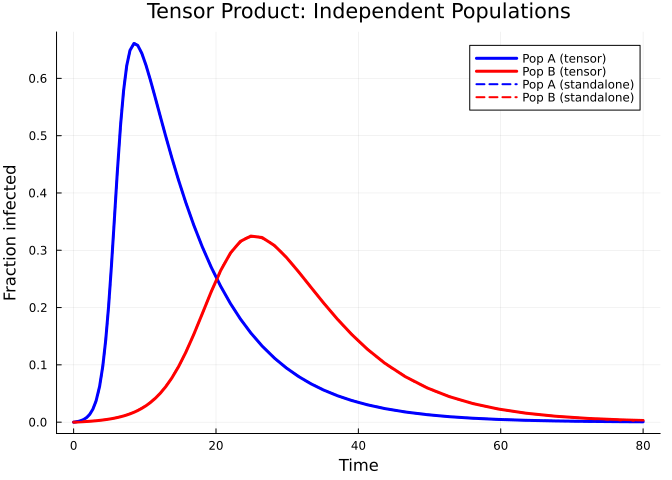
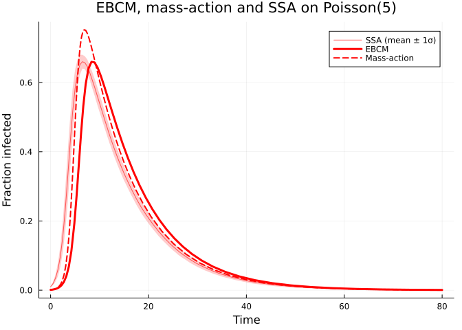

# Categorical Composition
Simon Frost
2026-05-14

- [Introduction](#introduction)
- [Setup](#setup)
- [Open systems and ports](#open-systems-and-ports)
- [Tensor product — independent
  populations](#tensor-product--independent-populations)
- [Composition via wiring — current
  limitations](#composition-via-wiring--current-limitations)
- [Stratification — age-structured
  populations](#stratification--age-structured-populations)
- [Natural transformations — EBCM to
  mass-action](#natural-transformations--ebcm-to-mass-action)
- [Functor and functoriality](#functor-and-functoriality)
  - [Verifying functoriality](#verifying-functoriality)
- [Simulation validation](#simulation-validation)
- [Summary](#summary)

## Introduction

Epidemiological models are often built by combining simpler pieces — two
populations coupled by travel, or a base model stratified by age.
**Categorical composition** gives this idea a formal algebraic backbone.
Each submodel is an *open system* with typed *ports* that can be wired
together. The wiring determines how infection pressure flows between
components, and a *functor* maps the resulting network description to a
concrete ODE system.

Key benefits:

1.  **Composability** — build complex multi-population models from
    reusable parts.
2.  **Formal guarantees** — the functor preserves composition, so the
    combined ODE faithfully represents the wired network.
3.  **Natural transformations** — relate EBCM network models to simpler
    mass-action approximations and quantify the difference.

## Setup

``` julia
using EdgeBasedModels
using ModelingToolkit
using OrdinaryDiffEq
using Plots
```

## Open systems and ports

An `OpenEBCM` wraps an edge-based compartmental model together with
named **ports** — typed boundary interfaces through which systems can
interact. Convenience constructors `open_sir` and `open_seir` create
open systems directly from a PGF and rate parameters.

``` julia
pgf_a = poisson_pgf(5.0)
m_sir = open_sir(pgf_a, 0.3, 0.1; name = :pop_a)
```

    OpenEBCM(:pop_a, StaticConfigurationModel(DegreePGF(z, exp(5.0(-1 + z))), DiseaseProgression(:S, :I, DiseaseStage[DiseaseStage(:I, 0.3), DiseaseStage(:R, 0)], DiseaseTransition[DiseaseTransition(:I, :R, 0.1)])), Port[Port(:S, :susceptible), Port(:I, :infectious), Port(:R, :recovered)])

Each port has a name and a type (`:susceptible`, `:infectious`, or
`:recovered`):

``` julia
for p in m_sir.ports
    println("  Port $(p.name) — type $(p.type)")
end
```

      Port S — type susceptible
      Port I — type infectious
      Port R — type recovered

An SEIR model has four ports (S, E, I, R), where the exposed and
recovered stages are both non-infectious:

``` julia
m_seir = open_seir(pgf_a, 0.2, 0.3, 0.1; name = :seir)
println("SEIR ports: ", length(m_seir.ports))
for p in m_seir.ports
    println("  Port $(p.name) — type $(p.type)")
end
```

    SEIR ports: 4
      Port S — type susceptible
      Port E — type latent
      Port I — type infectious
      Port R — type recovered

## Tensor product — independent populations

The tensor product $m_1 \otimes m_2$ places two open systems side by
side with **no interaction**. Each component evolves independently,
giving block-diagonal dynamics.

``` julia
pgf_b = poisson_pgf(3.0)
m1 = open_sir(pgf_a, 0.3, 0.1; name = :pop_a)
m2 = open_sir(pgf_b, 0.2, 0.1; name = :pop_b)

tp = tensor(m1, m2)
println("Tensor product ports: ", length(tp.ports))
```

    Tensor product ports: 6

Build the ODE system and solve:

``` julia
sys_tp = build_edge_system(tp.model)
ic_tp = default_initial_conditions(sys_tp)
prob_tp = ODEProblem(sys_tp.system, ic_tp, (0.0, 80.0))
sol_tp = solve(prob_tp; abstol = 1e-8, reltol = 1e-8)
```

    retcode: Success
    Interpolation: 3rd order Hermite
    t: 59-element Vector{Float64}:
      0.0
      0.10727110776953308
      0.3652049129865391
      0.6942629719274616
      1.047066555061856
      1.4378112327765944
      1.845990123008631
      2.2714120773240487
      2.7069156957882394
      3.1565216068570168
      ⋮
     49.650148014932604
     52.74538938238149
     56.08153446485713
     59.627998723142305
     63.47700300633278
     67.6767549375804
     72.2788404578111
     77.2428984216221
     80.0
    u: 59-element Vector{Vector{Float64}}:
     [0.0, 0.001, 0.0, 0.0010000000000000009, 1.0, 0.0, 0.001, 0.0, 0.0010000000000000009, 1.0]
     [1.1017122407082515e-5, 0.0010543226735000965, 1.0901223353620376e-5, 0.0010326361258463188, 0.9999781975532928, 1.1563616226468695e-5, 0.0011590209487017265, 1.1384660039863026e-5, 0.001125045924768744, 0.9999658460198804]
     [3.995875977722658e-5, 0.0011913324449059316, 3.859158882244906e-5, 0.0011155164382158117, 0.9999228168223551, 4.7200116581292385e-5, 0.0016258440317793552, 4.4929661072833806e-5, 0.0014933255040693134, 0.9998652110167815]
     [8.22228234857732e-5, 0.0013802056689779514, 7.716642518944634e-5, 0.0012309292168953862, 0.9998456671496211, 0.00011338627530524338, 0.0024454757141947, 0.00010410940926309073, 0.002142424352447581, 0.9996876717722107]
     [0.00013476812398208757, 0.0016020294935233123, 0.00012296787758536408, 0.0013678939847493084, 0.9997540642448293, 0.00022068068622344272, 0.0037177528208689535, 0.0001963806150959912, 0.0031529110467084323, 0.9994108581547121]
     [0.0002025809971522291, 0.0018737444851435066, 0.00017966395014809526, 0.0015373336318514506, 0.9996406720997038, 0.00040428002826664366, 0.005827765518673733, 0.00035006969793607677, 0.00483176675519607, 0.9989497909061918]
     [0.0002854053081370352, 0.002190425279740242, 0.00024640003183099056, 0.0017366304923843061, 0.999507199936338, 0.0007063551571843113, 0.009220665309731287, 0.0005984081024433571, 0.00753338805714217, 0.99820477569267]
     [0.0003863154141068419, 0.0025608819783040997, 0.0003251747661767065, 0.0019716730938808226, 0.9993496504676466, 0.0012073250128208403, 0.014746091032447731, 0.0010054360866050428, 0.011931671698848402, 0.9969836917401849]
     [0.0005069668391785466, 0.002988601921694865, 0.00041686536710903993, 0.002244972659546292, 0.9991662692657819, 0.0020287861565381586, 0.023650224073761973, 0.0016675980674921756, 0.01900861796033143, 0.9949972057975235]
     [0.0006523423443722197, 0.0034887754929356298, 0.0005248692796288734, 0.002566509998421229, 0.9989502614407422, 0.0033931882829244925, 0.038134564381943556, 0.002760944723167377, 0.030483973772198542, 0.9917171658304978]
     ⋮
     [0.7347625917019021, 0.060073738836281095, 0.2638244551624925, 0.003362965050705511, 0.4723510896750147, 0.9610005199025115, 0.01310987819558985, 0.24352755870206186, 1.6328985379468676e-7, 0.26941732389381406]
     [0.7509041442538028, 0.04491621080801845, 0.26462576006982597, 0.0019430748523431786, 0.4707484798603478, 0.9644904230731312, 0.009619986841927742, 0.24352758913116504, 5.33903986111891e-8, 0.26941723260650446]
     [0.7637434347613136, 0.032675221982348936, 0.26511485550316005, 0.001074090234182153, 0.4697702889936796, 0.9672193267201793, 0.006891087215049833, 0.24352759948325547, 1.6002207132215212e-8, 0.26941720155023313]
     [0.773559422905268, 0.023203993504956937, 0.26539734039103163, 0.0005713952371298669, 0.46920531921793646, 0.9692768581008983, 0.004833557076983579, 0.24352760268313337, 4.445348238282685e-9, 0.2694171919505995]
     [0.7810091428640352, 0.015948292543740947, 0.2655565240568358, 0.00028786323726862485, 0.4688869518863282, 0.9708210907555884, 0.003289324781243076, 0.2435276036074425, 1.1070613794929201e-9, 0.2694171891776721]
     [0.7864995960532367, 0.010561500367773107, 0.26564163550788156, 0.00013618989736500096, 0.46871672898423666, 0.9719491215557863, 0.0021612940739657006, 0.2435276038467162, 2.4288698896102006e-10, 0.26941718845985096]
     [0.7904068061921223, 0.006706354600778668, 0.265684399652459, 5.996183552390066e-5, 0.46863120069508185, 0.9727463105484989, 0.0013641051024152469, 0.2435276039012095, 4.607594540946328e-11, 0.26941718829637107]
     [0.7930366738723464, 0.004100530821848369, 0.26570415231049616, 2.4747762706208726e-5, 0.4685916953790075, 0.9732800649908587, 0.000830350664185349, 0.24352760391184414, 7.667309137785176e-12, 0.26941718826446714]
     [0.7940256579300172, 0.0031181076254110105, 0.265709542626418, 1.5137676174098225e-5, 0.46858091474716385, 0.9734801521836053, 0.000630263471958688, 0.2435276039131828, 2.8326005596089955e-12, 0.26941718826045125]

We can also solve each population in isolation and confirm the tensor
product does not alter trajectories:

``` julia
sys_a = build_edge_system(m1.model)
ic_a = default_initial_conditions(sys_a)
sol_a = solve(ODEProblem(sys_a.system, ic_a, (0.0, 80.0)); abstol = 1e-8, reltol = 1e-8)

sys_b = build_edge_system(m2.model)
ic_b = default_initial_conditions(sys_b)
sol_b = solve(ODEProblem(sys_b.system, ic_b, (0.0, 80.0)); abstol = 1e-8, reltol = 1e-8)
```

    retcode: Success
    Interpolation: 3rd order Hermite
    t: 40-element Vector{Float64}:
      0.0
      0.12047769762501717
      0.7568962993519851
      1.7927759397082332
      2.9655086492825644
      4.268582065041739
      5.66670782518709
      7.147132809239019
      8.70580795889803
     10.414075107267514
      ⋮
     50.68467195079408
     53.792749092686634
     57.04407022601451
     60.539301816531655
     64.30628711675523
     68.417663936223
     72.90443065526266
     77.729989314524
     80.0
    u: 40-element Vector{Vector{Float64}}:
     [0.0, 0.001, 0.0, 0.0010000000000000009, 1.0]
     [1.2414006238649571e-5, 0.0010611157789729546, 1.2267682910422132e-5, 0.0010367267364803385, 0.9999754646341792]
     [9.098575113679013e-5, 0.0014180677121343236, 8.494881627609888e-5, 0.0012542070144428176, 0.9998301023674478]
     [0.00027386472282101167, 0.002147090622021336, 0.00023723171033557554, 0.0017092602138356213, 0.9995255365793289]
     [0.0005878249494948238, 0.0032684976728077283, 0.00047721284538967913, 0.002424684086133515, 0.9990455743092207]
     [0.0011219247026160559, 0.0050380517680569245, 0.000863087844658239, 0.0035707129366982643, 0.9982738243106836]
     [0.0020085985913259655, 0.007830973334526386, 0.0014813000147600622, 0.005395671881572165, 0.9970373999704799]
     [0.0034748591526304207, 0.012288170927469364, 0.002481347916669295, 0.0083189863300919, 0.9950373041666615]
     [0.005910233188820857, 0.01947641292684316, 0.004118991069961179, 0.01302967290578048, 0.9917620178600777]
     [0.010207282111954272, 0.03175362537357181, 0.006977699188144182, 0.02102780992109353, 0.9860446016237117]
     ⋮
     [0.7406868372979549, 0.054540467788720716, 0.2641423702535552, 0.002800194326009897, 0.47171525949288984]
     [0.7553823646791533, 0.040665371318949234, 0.26481146895250707, 0.0016133291405812206, 0.4703770620949861]
     [0.766747480826728, 0.02978720692901414, 0.2652098742731783, 0.0009050649362069268, 0.4695802514536435]
     [0.7755831796297152, 0.02123884062488322, 0.26544540629253455, 0.0004858013769945267, 0.469109187414931]
     [0.7822794719733321, 0.014704996944492853, 0.26557871604747485, 0.00024832077540020597, 0.46884256790505047]
     [0.7872542462339445, 0.009818359263151773, 0.2656510879461244, 0.0001193416587228538, 0.46869782410775135]
     [0.7908136299626811, 0.0063038513819528895, 0.26568794908590115, 5.363408693040769e-5, 0.46862410182819786]
     [0.7932316544311875, 0.0039069552498477685, 0.26570530678040366, 2.2689339824149624e-5, 0.4685893864391929]
     [0.7940256575881501, 0.003118107626782065, 0.26570954251283285, 1.513767643355954e-5, 0.4685809149743345]

``` julia
# Extract S = ψ(θ) for each population
κ_a, κ_b = 5.0, 3.0
ψ_a(x) = exp(κ_a * (x - 1))
ψ_b(x) = exp(κ_b * (x - 1))

# Tensor system
θ_a_tp = compartment(sol_tp, sys_tp, :θ_pop_a)
θ_b_tp = compartment(sol_tp, sys_tp, :θ_pop_b)
R_a_tp = compartment(sol_tp, sys_tp, :R_pop_a)
R_b_tp = compartment(sol_tp, sys_tp, :R_pop_b)
S_a_tp = ψ_a.(θ_a_tp)
S_b_tp = ψ_b.(θ_b_tp)
I_a_tp = 1.0 .- S_a_tp .- R_a_tp
I_b_tp = 1.0 .- S_b_tp .- R_b_tp

# Standalone systems
θ_a_solo = compartment(sol_a, sys_a, :θ)
R_a_solo = compartment(sol_a, sys_a, :R)
S_a_solo = ψ_a.(θ_a_solo)
I_a_solo = 1.0 .- S_a_solo .- R_a_solo

θ_b_solo = compartment(sol_b, sys_b, :θ)
R_b_solo = compartment(sol_b, sys_b, :R)
S_b_solo = ψ_b.(θ_b_solo)
I_b_solo = 1.0 .- S_b_solo .- R_b_solo

plot(sol_tp.t, I_a_tp, label = "Pop A (tensor)", lw = 3, color = :blue)
plot!(sol_tp.t, I_b_tp, label = "Pop B (tensor)", lw = 3, color = :red)
plot!(sol_a.t, I_a_solo, label = "Pop A (standalone)", lw = 2, ls = :dash, color = :blue)
plot!(sol_b.t, I_b_solo, label = "Pop B (standalone)", lw = 2, ls = :dash, color = :red)
xlabel!("Time")
ylabel!("Fraction infected")
title!("Tensor Product: Independent Populations")
```

<div id="fig-tensor">



Figure 1: Tensor product: two independent SIR populations evolve without
interaction.

</div>

The solid (tensor) and dashed (standalone) curves overlap perfectly —
the tensor product preserves each component’s dynamics.

## Composition via wiring — current limitations

The `compose` combinator records port wiring at the categorical level,
but `build_edge_system` does not yet emit a coupled ODE system from a
`ComposedModel` whose wiring is non-empty: it raises an `ArgumentError`
because injecting cross-system transmission pressure requires extra
closure assumptions that have not been formalised in the package. The
wiring metadata is still useful for bookkeeping and for downstream
tools.

``` julia
m_city  = open_sir(pgf_a, 0.3, 0.1; name = :city)
m_rural = open_sir(pgf_b, 0.2, 0.1; name = :rural)

# Wire city's infectious port (I) to rural's susceptible port (S)
cp = EdgeBasedModels.compose(m_city, m_rural, [:I => :S])
println("Composed ports: ", length(cp.ports))
for p in cp.ports
    println("  Port $(p.name) — type $(p.type)")
end
```

    Composed ports: 4
      Port city_S — type susceptible
      Port city_R — type recovered
      Port rural_I — type infectious
      Port rural_R — type recovered

Notice that the wired ports (`:I` from city, `:S` from rural) are
consumed — only the remaining boundary ports appear.

``` julia
# Confirm that wired composition is rejected by the ODE builder
try
    build_edge_system(cp.model)
catch err
    println(typeof(err), ": ", err.msg)
end
```

    ArgumentError: cross-system wiring is not yet supported by build_edge_system; use tensor(...) for independent composition or stratify/multi-type models for coupled populations

To couple two populations dynamically, use `stratify` (below) or build a
`MultiTypeConfigurationModel` directly — both produce fully coupled ODE
systems.

## Stratification — age-structured populations

`stratify` crosses a base model with population strata. Given a base SIR
on a Poisson network and a row-stochastic mixing matrix, it creates a
`MultiTypeConfigurationModel` internally.

``` julia
pgf_base = poisson_pgf(5.0)
base = open_sir(pgf_base, 0.3, 0.1; name = :base)

# Two age groups with assortative mixing
mixing = [0.7 0.3;
          0.3 0.7]
strat = stratify(base, [:young, :old], mixing)
println("Stratified ports: ", length(strat.ports))
```

    Stratified ports: 6

``` julia
sys_strat = build_edge_system(strat.model)
ic_strat = default_initial_conditions(sys_strat)
prob_strat = ODEProblem(sys_strat.system, ic_strat, (0.0, 80.0))
sol_strat = solve(prob_strat; abstol = 1e-8, reltol = 1e-8)
```

    retcode: Success
    Interpolation: 3rd order Hermite
    t: 56-element Vector{Float64}:
      0.0
      0.10314357939403586
      0.35113788635269233
      0.6677259986061641
      1.0074575590151282
      1.3841208520908095
      1.7779734771453213
      2.1887267578642233
      2.609020969844318
      3.0412239029619603
      ⋮
     44.905881444696526
     48.63606356491767
     52.68898397276162
     57.04857572280902
     61.75182725378137
     66.81815835974737
     72.28984464261507
     78.21406908190617
     80.0
    u: 56-element Vector{Vector{Float64}}:
     [0.0, 0.001, 0.0, 0.001, 0.0, 0.0, 0.0, 0.0, 0.0010000000000000009, 0.0010000000000000009, 0.0010000000000000009, 0.0010000000000000009, 1.0, 1.0, 1.0, 1.0]
     [1.1086562162678604e-5, 0.0011525563890368122, 1.1086562162678606e-5, 0.0011525563890368122, 1.0921345049981857e-5, 1.0921345049981859e-5, 1.0921345049981857e-5, 1.0921345049981855e-5, 0.0011199575709995642, 0.0011199575709995642, 0.0011199575709995642, 0.0011199575709995642, 0.99996723596485, 0.99996723596485, 0.99996723596485, 0.99996723596485]
     [4.493345072393726e-5, 0.0015968945366260602, 4.4933450723937257e-5, 0.0015968945366260606, 4.284512869280496e-5, 4.284512869280497e-5, 4.284512869280499e-5, 4.284512869280499e-5, 0.0014704474725787786, 0.0014704474725787784, 0.0014704474725787786, 0.0014704474725787786, 0.9998714646139216, 0.9998714646139216, 0.9998714646139216, 0.9998714646139216]
     [0.00010699998484205036, 0.002368021827821315, 0.00010699998484205036, 0.002368021827821315, 9.850596058262072e-5, 9.85059605826207e-5, 9.850596058262072e-5, 9.850596058262071e-5, 0.0020809979703328833, 0.0020809979703328833, 0.0020809979703328833, 0.0020809979703328833, 0.9997044821182521, 0.9997044821182521, 0.9997044821182521, 0.9997044821182521]
     [0.0002062905906978881, 0.0035495240128198546, 0.00020629059069788812, 0.0035495240128198546, 0.00018415900343418648, 0.00018415900343418648, 0.0001841590034341865, 0.0001841590034341865, 0.0030191785897809974, 0.0030191785897809974, 0.0030191785897809974, 0.0030191785897809974, 0.9994475229896974, 0.9994475229896974, 0.9994475229896974, 0.9994475229896974]
     [0.0003739264898809176, 0.0054824503487300325, 0.0003739264898809176, 0.0054824503487300325, 0.0003248728218429316, 0.00032487282184293147, 0.0003248728218429315, 0.00032487282184293163, 0.004556885551239224, 0.004556885551239224, 0.0045568855512392245, 0.0045568855512392245, 0.9990253815344712, 0.9990253815344712, 0.9990253815344712, 0.9990253815344712]
     [0.000645957297918704, 0.008547240029424003, 0.0006459572979187043, 0.008547240029424003, 0.0005490143478977492, 0.0005490143478977491, 0.0005490143478977492, 0.0005490143478977494, 0.006997139935751708, 0.006997139935751708, 0.00699713993575171, 0.006997139935751709, 0.9983529569563068, 0.9983529569563068, 0.9983529569563068, 0.9983529569563068]
     [0.001090755854284817, 0.01346836690206648, 0.0010907558542848177, 0.013468366902066483, 0.0009110431003287248, 0.000911043100328725, 0.0009110431003287248, 0.0009110431003287252, 0.010914950355036394, 0.010914950355036394, 0.010914950355036403, 0.0109149503550364, 0.9972668706990139, 0.9972668706990139, 0.9972668706990139, 0.9972668706990139]
     [0.0018090418262287724, 0.021283647956286296, 0.0018090418262287744, 0.0212836479562863, 0.00149086686269908, 0.0014908668626990801, 0.0014908668626990806, 0.001490866862699081, 0.017129222331718742, 0.017129222331718742, 0.017129222331718753, 0.01712922233171875, 0.9955273994119028, 0.9955273994119028, 0.9955273994119028, 0.9955273994119028]
     [0.002979118153108979, 0.03377486983917972, 0.0029791181531089814, 0.033774869839179725, 0.002429729019485334, 0.0024297290194853337, 0.0024297290194853346, 0.0024297290194853355, 0.027035071914347356, 0.02703507191434736, 0.02703507191434737, 0.027035071914347366, 0.9927108129415441, 0.9927108129415441, 0.9927108129415441, 0.9927108129415441]
     ⋮
     [0.9530416268525741, 0.02106869147205639, 0.9530416268525742, 0.021068691472056377, 0.2435273530930563, 0.24352735309305626, 0.24352735309305631, 0.24352735309305631, 9.059524049100101e-7, 9.059524049100176e-7, 9.059524049100296e-7, 9.059524049100289e-7, 0.2694179407208312, 0.26941794072083136, 0.26941794072083114, 0.2694179407208311]
     [0.9596013215843769, 0.01450906882969041, 0.959601321584377, 0.014509068829690403, 0.24352753872566799, 0.24352753872566796, 0.243527538725668, 0.243527538725668, 2.355113949695935e-7, 2.3551139496959086e-7, 2.3551139496959718e-7, 2.3551139496959665e-7, 0.2694173838229961, 0.2694173838229963, 0.26941738382299607, 0.269417383822996]
     [0.9644360078990994, 0.009674401979757353, 0.9644360078990996, 0.009674401979757349, 0.24352758884821374, 0.2435275888482137, 0.24352758884821377, 0.24352758884821377, 5.4486001471779305e-8, 5.448600147177886e-8, 5.448600147177993e-8, 5.4486001471779345e-8, 0.2694172334553589, 0.26941723345535906, 0.26941723345535884, 0.2694172334553588]
     [0.9678545157603684, 0.0062558987638800245, 0.9678545157603685, 0.006255898763880021, 0.24352760081027303, 0.243527600810273, 0.24352760081027305, 0.24352760081027305, 1.1283156013633979e-8, 1.1283156013633789e-8, 1.1283156013633938e-8, 1.1283156013633918e-8, 0.26941719756918103, 0.2694171975691812, 0.269417197569181, 0.2694171975691809]
     [0.9702017349792376, 0.003908680536353938, 0.9702017349792377, 0.003908680536353935, 0.2435276033630193, 0.24352760336301926, 0.24352760336301932, 0.24352760336301932, 2.063514012315284e-9, 2.0635140123153157e-9, 2.063514012315305e-9, 2.063514012315357e-9, 0.2694171899109422, 0.2694171899109424, 0.26941718991094216, 0.2694171899109421]
     [0.9717553542842375, 0.0023550614176551603, 0.9717553542842376, 0.0023550614176551603, 0.2435276038427521, 0.24352760384275207, 0.24352760384275213, 0.24352760384275213, 3.3088405533836704e-10, 3.3088405533836776e-10, 3.3088405533836564e-10, 3.3088405533837795e-10, 0.26941718847174384, 0.269417188471744, 0.2694171884717438, 0.26941718847174373]
     [0.9727478108848678, 0.0013626048476799114, 0.972747810884868, 0.0013626048476799114, 0.24352760392168993, 0.2435276039216899, 0.24352760392168996, 0.24352760392168996, 4.5787741704267156e-11, 4.578774170426576e-11, 4.578774170426449e-11, 4.5787741704267137e-11, 0.2694171882349303, 0.2694171882349305, 0.26941718823493027, 0.2694171882349302]
     [0.9733569142129619, 0.0007535015239321396, 0.973356914212962, 0.0007535015239321396, 0.24352760393288173, 0.2435276039328817, 0.24352760393288175, 0.24352760393288175, 5.366861006220682e-12, 5.366861006220617e-12, 5.36686100622044e-12, 5.3668610062207445e-12, 0.26941718820135496, 0.26941718820135513, 0.2694171882013549, 0.26941718820135485]
     [0.9734801522603547, 0.0006302634768136258, 0.9734801522603548, 0.0006302634768136258, 0.24352760393358808, 0.24352760393358805, 0.2435276039335881, 0.2435276039335881, 2.815743501422975e-12, 2.8157435014229396e-12, 2.815743501422853e-12, 2.8157435014229993e-12, 0.2694171881992359, 0.26941718819923605, 0.2694171881992358, 0.26941718819923577]

With $K=2$ types and $M=2$ stages (I, R), the multi-type system has
$K^2(1+M)+K M = 16$ equations:

``` julia
n_eqs = length(ModelingToolkit.equations(sys_strat.system))
println("Number of equations: $n_eqs")
```

    Number of equations: 16

``` julia
R_young = compartment(sol_strat, sys_strat, :R_young)
R_old   = compartment(sol_strat, sys_strat, :R_old)

plot(sol_strat.t, R_young, label = "R (young)", lw = 2, color = :orange)
plot!(sol_strat.t, R_old,  label = "R (old)",   lw = 2, color = :purple)
xlabel!("Time")
ylabel!("Fraction recovered")
title!("Stratified SIR: Age-Structured Epidemic")
```

<div id="fig-stratified">


Figure 2: Stratified SIR: young and old populations with assortative
contact mixing.

</div>

Both age groups experience a similar epidemic because the base network
is Poisson with mean degree 5 and the mixing is moderately assortative.
The young group has slightly higher within-group mixing (70% of contacts
are with other young people), producing a marginally faster epidemic
wave.

## Natural transformations — EBCM to mass-action

A **natural transformation** relates the EBCM network model to a simpler
mass-action approximation. On a Poisson network the excess degree
distribution equals the degree distribution, so the EBCM and mass-action
SIR are closely related. The `to_mass_action` function extracts
$\beta_\text{eff} = \beta \cdot \psi''(1)/\psi'(1)$ (the excess-degree
ratio, *not* the mean degree) and $\gamma$. For a Poisson network this
ratio equals $\langle k \rangle$, but for non-Poisson networks the two
differ.

``` julia
pgf_poisson = poisson_pgf(5.0)
prog_sir = DiseaseProgression(
    [DiseaseStage(:I; transmission_rate = 0.3),
     DiseaseStage(:R; transmission_rate = 0)],
    [DiseaseTransition(:I, :R, 0.1)]; entry = :I,
)
sir_model = StaticConfigurationModel(pgf_poisson, prog_sir)

ma = to_mass_action(sir_model)
println("β_eff = ", ma.β_eff, "  (expected: 0.3 × 5 = 1.5)")
println("γ     = ", ma.γ)
```

    β_eff = 1.5  (expected: 0.3 × 5 = 1.5)
    γ     = 0.1

The `compare_models` function solves both the EBCM and the mass-action
approximation and returns the solutions for direct comparison:

``` julia
result = compare_models(sir_model; tspan = (0.0, 80.0))
println("β_eff = ", result.β_eff)
println("γ     = ", result.γ)
```

    β_eff = 1.5
    γ     = 0.1

``` julia
# EBCM solution
S_ebcm = compartment(result.ebcm, result.ebcm_system, :S)
I_ebcm = compartment(result.ebcm, result.ebcm_system, :I)

# Mass-action solution
S_ma = result.mass_action[result.ma_vars.S]
I_ma = result.mass_action[result.ma_vars.I]

plot(result.ebcm.t, I_ebcm, label = "I (EBCM)", lw = 3, color = :red)
plot!(result.mass_action.t, I_ma, label = "I (mass-action)", lw = 2, ls = :dash, color = :red)
plot!(result.ebcm.t, S_ebcm, label = "S (EBCM)", lw = 3, color = :blue)
plot!(result.mass_action.t, S_ma, label = "S (mass-action)", lw = 2, ls = :dash, color = :blue)
xlabel!("Time")
ylabel!("Fraction of population")
title!("Natural Transformation: EBCM → Mass-Action")
```

<div id="fig-natural-transformation">


Figure 3: EBCM vs mass-action approximation on a Poisson(5) network.

</div>

On the Poisson network the two curves are close — the Poisson
distribution’s lack of degree heterogeneity makes mass-action a
reasonable approximation. Differences arise primarily because the EBCM
tracks the exact depletion of susceptible edges, while mass-action
assumes homogeneous mixing.

We can record the natural transformation as metadata:

``` julia
nt = NaturalTransformation(
    :ebcm_to_mass_action,
    StaticConfigurationModel,
    Nothing,
    "EBCM → mass-action; valid when network is Poisson",
)
println("Transform: ", nt.name, " (", nt.source_type, " → ", nt.target_type, ")")
println("  ", nt.description)
```

    Transform: ebcm_to_mass_action (StaticConfigurationModel → Nothing)
      EBCM → mass-action; valid when network is Poisson

## Functor and functoriality

The `EBCMFunctor` is a callable that maps an open system (in the network
category) to an `EdgeModelSystem` (in the ODE category) via
`build_edge_system`. Categorically, a functor must preserve composition:

$$F(m_1 \otimes m_2) \cong F(m_1) \otimes F(m_2)$$

meaning the ODE system obtained by first composing and then applying $F$
should match the one obtained by applying $F$ to each component and then
combining.

``` julia
F = EBCMFunctor(:F)

# Apply functor to a single open system
sys_single = F(m1)
println("Variables: ", keys(sys_single.variables))
println("Observables: ", keys(sys_single.observables))
```

    Variables: [:R, :φ_I, :pop_I, :pop_R, :φ_R, :θ]
    Observables: [:I, :φ_S, :S, :edge_hazard, :excess_hazard]

``` julia
ic_single = default_initial_conditions(sys_single)
sol_single = solve(ODEProblem(sys_single.system, ic_single, (0.0, 80.0));
                   abstol = 1e-8, reltol = 1e-8)
println("Final S = ", compartment(sol_single, sys_single, :S)[end])
```

    Final S = 0.025889583837423555

### Verifying functoriality

`verify_functoriality` checks the functor equation by solving both paths
— compose-then-map vs map-then-combine — and comparing the trajectories:

``` julia
m_fa = open_sir(pgf_a, 0.3, 0.1; name = :fa)
m_fb = open_sir(pgf_b, 0.2, 0.1; name = :fb)

vf = verify_functoriality(m_fa, m_fb, Pair{Symbol,Symbol}[];
                           tspan = (0.0, 80.0), atol = 1e-4)
println("Is functorial: ", vf.is_functorial)
println("Max trajectory difference: ", vf.max_difference)
println("Composed retcode: ", vf.composed_retcode)
```

    Is functorial: true
    Max trajectory difference: 4.055173974393256e-10
    Composed retcode: Success

``` julia
# Build systems for correct variable keys
sys_fab = build_edge_system(tensor(m_fa, m_fb).model)
sys_fa = build_edge_system(m_fa.model)
sys_fb = build_edge_system(m_fb.model)

κ_fa, κ_fb = 5.0, 3.0
ψ_fa(x) = exp(κ_fa * (x - 1))
ψ_fb(x) = exp(κ_fb * (x - 1))

θ1_comp = compartment(vf.composed_solution, sys_fab, :θ_fa)
θ2_comp = compartment(vf.composed_solution, sys_fab, :θ_fb)
S1_comp = ψ_fa.(θ1_comp)
S2_comp = ψ_fb.(θ2_comp)

θ1_ind = compartment(vf.individual_solutions[1], sys_fa, :θ)
θ2_ind = compartment(vf.individual_solutions[2], sys_fb, :θ)
S1_ind = ψ_fa.(θ1_ind)
S2_ind = ψ_fb.(θ2_ind)

plot(vf.composed_solution.t, S1_comp, label = "Pop A — F(m₁⊗m₂)", lw = 3, color = :blue)
plot!(vf.individual_solutions[1].t, S1_ind, label = "Pop A — F(m₁)", lw = 2, ls = :dash, color = :blue)
plot!(vf.composed_solution.t, S2_comp, label = "Pop B — F(m₁⊗m₂)", lw = 3, color = :red)
plot!(vf.individual_solutions[2].t, S2_ind, label = "Pop B — F(m₂)", lw = 2, ls = :dash, color = :red)
xlabel!("Time")
ylabel!("Fraction susceptible")
title!("Functoriality: F(m₁⊗m₂) ≅ F(m₁)⊗F(m₂)")
```

<div id="fig-functoriality">


Figure 4: Functoriality check: F(m₁⊗m₂) matches F(m₁),F(m₂) to machine
precision.

</div>

The solid (composed) and dashed (individual) curves coincide, confirming
that the EBCM functor preserves the tensor product.

## Simulation validation

We validate the EBCM SIR prediction (Poisson κ=5) used in the
natural-transformation section against Gillespie SSA via
`NetworkOutbreaks.jl`.

``` julia
include("../_validation.jl")

# Note: the SIR progression in this vignette uses β=0.3, γ=0.1, κ=5 (R₀≈3 on
# Poisson). We validate at those parameters, not the canonical (γ=0.25, R₀=2)
# anchor used elsewhere.
import EdgeBasedModels: sir_model as ebm_sir_model
prog_for_no = ebm_sir_model()  # avoids local `sir_model` rebinding above

t_g, μ_g, σ_g = gillespie_ribbon(
    prog_for_no, Dict(:β => 0.3, :γ => 0.1),
    poisson_graph_builder(1000, 5.0);
    N = 1000, n_graphs = 5, nsims_per_graph = 20,
    tspan = (0.0, 80.0), seed_fraction = 0.01)
```

    ([0.0, 0.5, 1.0, 1.5, 2.0, 2.5, 3.0, 3.5, 4.0, 4.5  …  75.5, 76.0, 76.5, 77.0, 77.5, 78.0, 78.5, 79.0, 79.5, 80.0], Dict(:I => [0.01, 0.019129999999999998, 0.03499, 0.059539999999999996, 0.09867000000000001, 0.1561, 0.23392, 0.32766, 0.42519, 0.5147  …  0.00074, 0.0007099999999999999, 0.00069, 0.00068, 0.00061, 0.00058, 0.0005600000000000001, 0.0005600000000000001, 0.00055, 0.00054], :R => [0.0, 0.00082, 0.00218, 0.00455, 0.00821, 0.01416, 0.024390000000000002, 0.038299999999999994, 0.05796, 0.08206999999999999  …  0.97419, 0.97422, 0.97424, 0.97425, 0.9743200000000001, 0.97435, 0.97437, 0.97437, 0.97438, 0.97439], :S => [0.99, 0.98005, 0.9628300000000001, 0.93591, 0.89312, 0.82974, 0.7416900000000001, 0.6340399999999999, 0.51685, 0.40323000000000003  …  0.025070000000000002, 0.025070000000000002, 0.025070000000000002, 0.025070000000000002, 0.025070000000000002, 0.025070000000000002, 0.025070000000000002, 0.025070000000000002, 0.025070000000000002, 0.025070000000000002]), Dict(:I => [0.0, 0.0048234590882226406, 0.01014789125728577, 0.019002083883595294, 0.03033351814795513, 0.04525405277905276, 0.060143041613685076, 0.0732207427694992, 0.07463807555954483, 0.06776720401044992  …  0.0008482900209220662, 0.000844411216783803, 0.0008127146181194542, 0.0008025212794938238, 0.0007371114795831995, 0.0006989169110021938, 0.0006863753427324667, 0.0006863753427324667, 0.0006871842709362769, 0.00068784541368778], :R => [0.0, 0.0008689945426477173, 0.001591517921020462, 0.002302282573991527, 0.003288470830650685, 0.004906643609959003, 0.007959360159046337, 0.010640593133008245, 0.01403021270996519, 0.0182619851333337  …  0.00657619674556378, 0.006531323129212167, 0.006535250182624606, 0.006538734625678772, 0.0065379699070162835, 0.006499999999999999, 0.00651285442239213, 0.00651285442239213, 0.006517699290424808, 0.006527169324748622], :S => [0.0, 0.004759626078174672, 0.01023270158942309, 0.01967005363747161, 0.03188910076303105, 0.048433776510516995, 0.06589028146790081, 0.08140470291430132, 0.08605147332036833, 0.08318700546832948  …  0.006356822470322097, 0.006356822470322097, 0.006356822470322097, 0.006356822470322097, 0.006356822470322097, 0.006356822470322097, 0.006356822470322097, 0.006356822470322097, 0.006356822470322097, 0.006356822470322097]))

``` julia
plot(t_g, μ_g[:I], ribbon = σ_g[:I], label = "SSA (mean ± 1σ)",
     color = :red, fillalpha = 0.2, linealpha = 0.6)
plot!(result.ebcm.t, I_ebcm, label = "EBCM", lw = 3, color = :red)
plot!(result.mass_action.t, I_ma, label = "Mass-action", lw = 2,
      ls = :dash, color = :red)
xlabel!("Time"); ylabel!("Fraction infected")
title!("EBCM, mass-action and SSA on Poisson(5)")
```

<div id="fig-categorical-validation">



Figure 5: EBCM (red) and mass-action approximation (red dashed) versus
Gillespie SSA mean ± 1σ (red ribbon).

</div>

The EBCM tracks the SSA mean closely; the mass-action curve diverges in
the expected direction because it ignores the depletion of susceptible
neighbours.

## Summary

\|———\|—————\|————————\| \| **Open system** \| `OpenEBCM`, `Port` \| A
model with named boundary interfaces \| \| **Tensor product** \|
`tensor(m1, m2)` \| Independent parallel populations \| \|
**Composition** \| `compose(m1, m2, wiring)` \| Cross-infection coupling
between populations \| \| **Stratification** \|
`stratify(base, strata, mixing)` \| Age/risk structured populations \|
\| **Natural transformation** \| `to_mass_action`,
`NaturalTransformation` \| Relating network and mean-field models \| \|
**Functor** \| `EBCMFunctor` \| Systematic mapping from network to ODE
\| \| **Functoriality** \| `verify_functoriality` \| Composition
commutes with ODE construction \|

The categorical framework turns model construction from ad-hoc equation
manipulation into a principled algebraic workflow: define small open
systems, compose them via explicit wiring diagrams, and let the functor
produce the correct coupled ODE system automatically.
