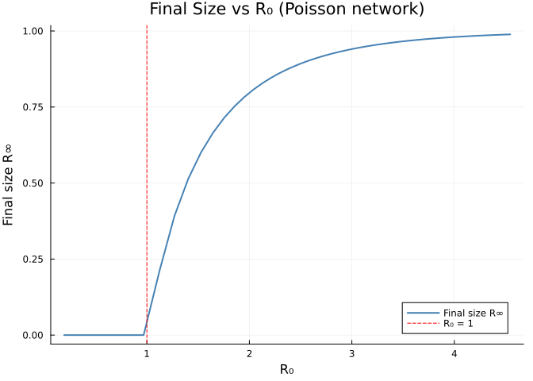
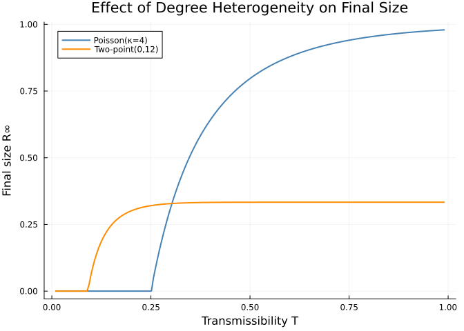
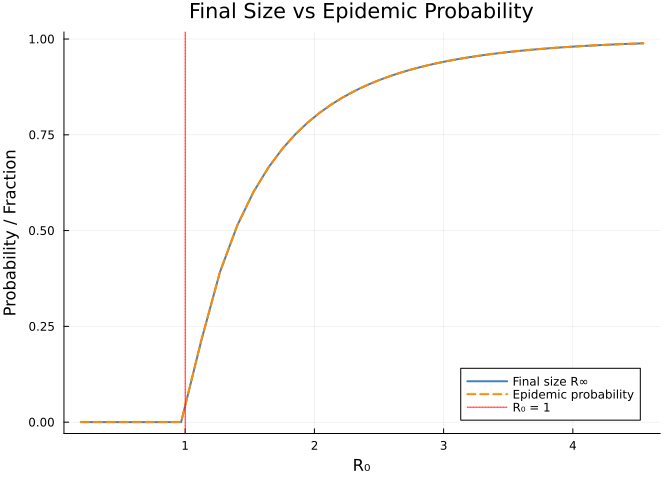
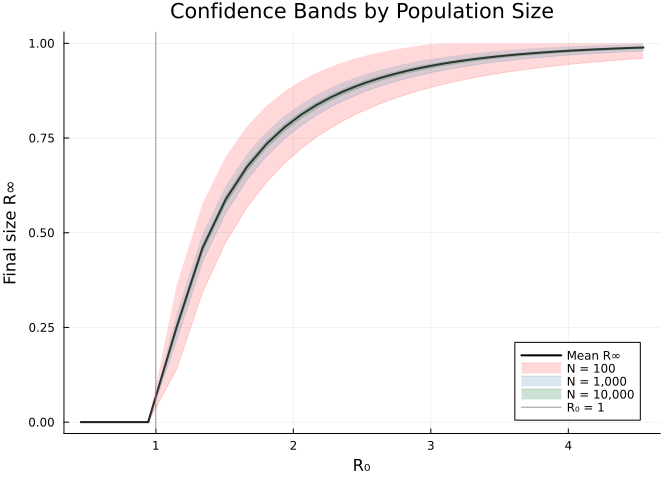
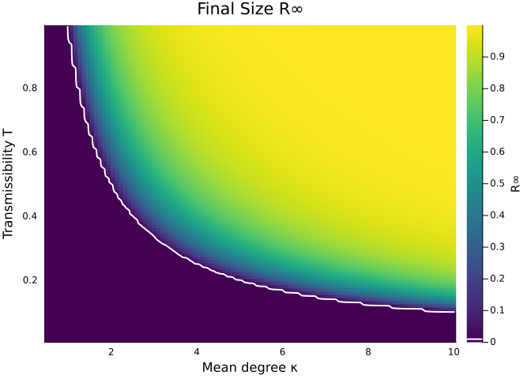

# Final Size and Equilibrium Analysis
Simon Frost
2026-05-13

- [Introduction](#introduction)
- [Setup](#setup)
- [Basic Final Size Computation](#basic-final-size-computation)
  - [Comparison with ODE Simulation](#comparison-with-ode-simulation)
- [Final Size vs $R_0$](#final-size-vs-r_0)
- [Effect of Degree Distribution](#effect-of-degree-distribution)
- [Epidemic Probability](#epidemic-probability)
- [Confidence Bands for Finite
  Populations](#confidence-bands-for-finite-populations)
- [Final Size Sensitivity to Network
  Connectivity](#final-size-sensitivity-to-network-connectivity)
- [Summary](#summary)
- [Simulation validation](#simulation-validation)

## Introduction

The **final size** of an epidemic is the fraction of the population
ultimately infected when the epidemic runs its course ($t \to \infty$).
A remarkable feature of edge-based models is that the final size can be
computed **without solving any ODEs** — it reduces to a fixed-point
equation involving the probability generating function (PGF).

The key equation for the final size on a configuration-model network is:

$$\theta_\infty = 1 - T + T \frac{\psi'(\theta_\infty)}{\psi'(1)}$$

where $T$ is the transmissibility (probability of transmission across a
single edge before recovery), and $\psi(z)$ is the PGF of the degree
distribution. For SIR dynamics with transmission rate $\beta$ and
recovery rate $\gamma$, the transmissibility is
$T = \beta / (\beta + \gamma)$.

Once $\theta_\infty$ is found, the fraction that **escapes** infection
is $\psi(\theta_\infty)$, so the final size is:

$$R_\infty = 1 - \psi(\theta_\infty)$$

For sub-threshold epidemics ($R_0 \leq 1$), the only fixed point is
$\theta_\infty = 1$ and $R_\infty = 0$.

This approach follows Newman (2002) and Miller (2007).
EdgeBasedModels.jl provides `final_size`, `epidemic_probability`, and
`confidence_bands` to compute these quantities directly.

## Setup

``` julia
using EdgeBasedModels
using OrdinaryDiffEq
using ModelingToolkit
using Plots
```

## Basic Final Size Computation

The function `final_size(model)` takes a `StaticConfigurationModel` and
returns a named tuple `(R_infinity, θ_infinity)` by iterating the
fixed-point equation to convergence.

Let us compute the final size for an SIR epidemic on a Poisson network
with mean degree $\kappa = 5$, transmission rate
$\beta = 1/6 \approx 0.1667$, and recovery rate $\gamma = 0.25$ —
anchored to $R_0 = T\kappa = 2$ ($T = \beta/(\beta+\gamma) = 0.4$):

``` julia
pgf = poisson_pgf(5)

sir_prog = DiseaseProgression(
    [DiseaseStage(:I; transmission_rate=1/6), DiseaseStage(:R)],
    [DiseaseTransition(:I, :R, 0.25)];
    entry=:I
)
model = StaticConfigurationModel(pgf, sir_prog)

fs = final_size(model)
println("Final size R∞ = $(round(fs.R_infinity * 100, digits=1))%")
println("θ∞ = $(round(fs.θ_infinity, digits=6))")
```

    Final size R∞ = 79.7%
    θ∞ = 0.681275

### Comparison with ODE Simulation

We can verify the analytic final size by running the ODE model to large
$t$:

``` julia
sir_system = build_sir(pgf, 1/6, 0.25; form=:expanded)
ic = default_initial_conditions(sir_system; ε=1e-2)
prob = ODEProblem(sir_system.system, ic, (0.0, 200.0))
sol = solve(prob, Tsit5(); saveat=0.5)

R_ode = compartment(sol, sir_system, :R)[end]
println("R∞ from ODE at t=200: $(round(R_ode, digits=6))")
println("R∞ from final_size:   $(round(fs.R_infinity, digits=6))")
println("Difference:           $(round(abs(R_ode - fs.R_infinity), digits=8))")
```

    R∞ from ODE at t=200: 0.800193
    R∞ from final_size:   0.796812
    Difference:           0.00338075

The two values agree to high precision, confirming that `final_size`
gives the exact equilibrium without time integration.

## Final Size vs $R_0$

The relationship between $R_0$ and the final epidemic size produces a
classic sigmoid curve. We sweep $R_0$ by varying the transmission rate
$\beta$ while holding $\gamma = 0.25$ and $\kappa = 5$ fixed (the
$R_0 = 2$ canonical anchor sits on this curve at $\beta = 1/6$):

``` julia
γ_val = 0.25
κ_val = 5

β_range = range(0.01, 2.5, length=200)
R0_vals = Float64[]
fs_vals = Float64[]

for β_val in β_range
    T = β_val / (β_val + γ_val)
    R0 = T * κ_val   # Poisson: excess degree = mean degree
    prog = DiseaseProgression(
        [DiseaseStage(:I; transmission_rate=β_val), DiseaseStage(:R)],
        [DiseaseTransition(:I, :R, γ_val)]; entry=:I
    )
    m = StaticConfigurationModel(poisson_pgf(κ_val), prog)
    push!(R0_vals, R0)
    push!(fs_vals, final_size(m).R_infinity)
end

plot(R0_vals, fs_vals, lw=2, color=:steelblue, label="Final size R∞")
vline!([1.0], linestyle=:dash, color=:red, label="R₀ = 1")
xlabel!("R₀")
ylabel!("Final size R∞")
title!("Final Size vs R₀ (Poisson network)")
```

<div id="fig-final-size-vs-r0">



Figure 1: Final epidemic size as a function of R₀ for a Poisson(5)
network. The epidemic threshold at R₀ = 1 is marked by a dashed line.

</div>

Key observations:

- The final size is **zero** for $R_0 \leq 1$ (no epidemic).
- Just above the threshold the final size grows continuously from zero —
  a **transcritical bifurcation**.
- For large $R_0$ the final size approaches 1; nearly everyone is
  infected.

## Effect of Degree Distribution

Network heterogeneity has a strong effect on the final size. For a given
mean degree, a more heterogeneous degree distribution produces a
**larger** epidemic because high-degree nodes act as super-spreaders.

We compare a Poisson network (low variance, $\text{Var}(k) = \kappa$)
with a heterogeneous two-point distribution
$P(k=0) = 1 - \kappa/k_{\max}$, $P(k=k_{\max}) = \kappa/k_{\max}$ (high
variance) at the same mean degree $\kappa = 4$:

``` julia
κ_cmp = 4
k_max = 12

# Two-point distribution: P(0) = 1 - κ/k_max, P(k_max) = κ/k_max
probs_twopoint = zeros(k_max + 1)
probs_twopoint[1] = 1.0 - κ_cmp / k_max
probs_twopoint[k_max + 1] = κ_cmp / k_max
pgf_twopoint = polynomial_pgf(probs_twopoint)

pgf_poisson = poisson_pgf(κ_cmp)

T_range = range(0.01, 0.99, length=200)
fs_poisson = Float64[]
fs_hetero = Float64[]

for T_val in T_range
    # Back out β from T = β/(β+γ)  →  β = T·γ/(1-T)
    γ_fix = 0.25
    β_val = T_val * γ_fix / (1 - T_val)

    prog = DiseaseProgression(
        [DiseaseStage(:I; transmission_rate=β_val), DiseaseStage(:R)],
        [DiseaseTransition(:I, :R, γ_fix)]; entry=:I
    )
    m_p = StaticConfigurationModel(pgf_poisson, prog)
    m_h = StaticConfigurationModel(pgf_twopoint, prog)
    push!(fs_poisson, final_size(m_p).R_infinity)
    push!(fs_hetero, final_size(m_h).R_infinity)
end

plot(T_range, fs_poisson, lw=2, label="Poisson(κ=$κ_cmp)", color=:steelblue)
plot!(T_range, fs_hetero, lw=2, label="Two-point(0,$k_max)", color=:darkorange)
xlabel!("Transmissibility T")
ylabel!("Final size R∞")
title!("Effect of Degree Heterogeneity on Final Size")
```

<div id="fig-final-size-degree-dist">



Figure 2: Final size vs transmissibility T for Poisson and heterogeneous
(two-point) networks with the same mean degree κ = 4. The heterogeneous
network has a larger final size and a lower epidemic threshold.

</div>

The heterogeneous network has:

- A **lower epidemic threshold** (smaller critical $T$), because the
  excess degree ratio $\psi''(1)/\psi'(1)$ is larger when variance is
  higher.
- A **larger final size** at any given transmissibility above threshold,
  because high-degree nodes amplify spread.

## Epidemic Probability

The `epidemic_probability(model)` function computes the probability that
a single initial infection triggers a **major epidemic** (as opposed to
dying out stochastically in the early phase). This is based on the
extinction probability $q$ of the branching process approximation,
satisfying:

$$q = \frac{\psi'(1 - T + Tq)}{\psi'(1)}$$

The epidemic probability is then $1 - \psi(1 - T + Tq)$. For
$R_0 \leq 1$, the epidemic probability is zero.

``` julia
γ_ep = 0.25
κ_ep = 5

β_ep_range = range(0.01, 2.5, length=200)
R0_ep = Float64[]
fs_ep = Float64[]
ep_ep = Float64[]

for β_val in β_ep_range
    T = β_val / (β_val + γ_ep)
    R0 = T * κ_ep
    prog = DiseaseProgression(
        [DiseaseStage(:I; transmission_rate=β_val), DiseaseStage(:R)],
        [DiseaseTransition(:I, :R, γ_ep)]; entry=:I
    )
    m = StaticConfigurationModel(poisson_pgf(κ_ep), prog)
    push!(R0_ep, R0)
    push!(fs_ep, final_size(m).R_infinity)
    push!(ep_ep, epidemic_probability(m))
end

plot(R0_ep, fs_ep, lw=2, label="Final size R∞", color=:steelblue)
plot!(R0_ep, ep_ep, lw=2, label="Epidemic probability", color=:darkorange, linestyle=:dash)
vline!([1.0], linestyle=:dot, color=:red, label="R₀ = 1")
xlabel!("R₀")
ylabel!("Probability / Fraction")
title!("Final Size vs Epidemic Probability")
```

<div id="fig-epidemic-probability">



Figure 3: Final size and epidemic probability as functions of R₀. The
epidemic probability is always smaller than the final size: even when a
major epidemic occurs, some individuals escape infection.

</div>

Both quantities are zero below threshold and increase with $R_0$, but
they are **not** the same. The epidemic probability gives the chance of
a large outbreak *occurring*; the final size gives the fraction infected
*given that it does*. The epidemic probability is always smaller than
the final size.

## Confidence Bands for Finite Populations

The analytic final size is an asymptotic result valid for infinite
populations. For finite populations of size $N$, the actual final size
is a random variable with variance that decreases as $N$ grows. The
function `confidence_bands(model, N)` computes CLT-based confidence
intervals using the asymptotic variance formula from Ball (2021):

$$\sigma^2 = R_\infty(1 - R_\infty) + \frac{R_\infty \cdot T \cdot \psi'(\theta_\infty)(1 - \theta_\infty)}{\psi'(1)(1 - h'(\theta_\infty))^2}$$

where $h'(\theta) = T \cdot \psi''(\theta)/\psi'(1)$ is the derivative
of the fixed-point map. The standard error scales as
$\sigma / \sqrt{N}$.

``` julia
pgf_cb = poisson_pgf(5)
prog_cb = DiseaseProgression(
    [DiseaseStage(:I; transmission_rate=1/6), DiseaseStage(:R)],
    [DiseaseTransition(:I, :R, 0.25)]; entry=:I
)
model_cb = StaticConfigurationModel(pgf_cb, prog_cb)

for N in [100, 1_000, 10_000]
    cb = confidence_bands(model_cb, N)
    println("N = $(lpad(N, 6)):  R∞ = $(round(cb.mean, digits=4))  " *
            "95% CI = [$(round(cb.lower, digits=4)), $(round(cb.upper, digits=4))]  " *
            "SE = $(round(cb.std_error, digits=5))")
end
```

    N =    100:  R∞ = 0.7968  95% CI = [0.7048, 0.8889]  SE = 0.04695
    N =   1000:  R∞ = 0.7968  95% CI = [0.7677, 0.8259]  SE = 0.01485
    N =  10000:  R∞ = 0.7968  95% CI = [0.7876, 0.806]  SE = 0.0047

``` julia
γ_cb = 0.25
κ_cb = 5

β_cb_range = range(0.025, 2.5, length=150)
R0_cb = Float64[]
mean_cb = Float64[]
lower_100 = Float64[]
upper_100 = Float64[]
lower_1k = Float64[]
upper_1k = Float64[]
lower_10k = Float64[]
upper_10k = Float64[]

for β_val in β_cb_range
    T = β_val / (β_val + γ_cb)
    R0 = T * κ_cb
    prog = DiseaseProgression(
        [DiseaseStage(:I; transmission_rate=β_val), DiseaseStage(:R)],
        [DiseaseTransition(:I, :R, γ_cb)]; entry=:I
    )
    m = StaticConfigurationModel(poisson_pgf(κ_cb), prog)

    cb100 = confidence_bands(m, 100)
    cb1k  = confidence_bands(m, 1_000)
    cb10k = confidence_bands(m, 10_000)

    push!(R0_cb, R0)
    push!(mean_cb, cb1k.mean)
    push!(lower_100, cb100.lower); push!(upper_100, cb100.upper)
    push!(lower_1k, cb1k.lower);  push!(upper_1k, cb1k.upper)
    push!(lower_10k, cb10k.lower); push!(upper_10k, cb10k.upper)
end

plot(R0_cb, mean_cb, lw=2, color=:black, label="Mean R∞")
plot!(R0_cb, lower_100, fillrange=upper_100, alpha=0.15, color=:red, label="N = 100")
plot!(R0_cb, lower_1k, fillrange=upper_1k, alpha=0.20, color=:steelblue, label="N = 1,000")
plot!(R0_cb, lower_10k, fillrange=upper_10k, alpha=0.25, color=:seagreen, label="N = 10,000")
vline!([1.0], linestyle=:dot, color=:grey, label="R₀ = 1")
xlabel!("R₀")
ylabel!("Final size R∞")
title!("Confidence Bands by Population Size")
```

<div id="fig-confidence-bands">



Figure 4: 95% confidence bands for the final size as a function of R₀,
for population sizes N = 100, 1000, and 10000. Bands narrow with
increasing N.

</div>

As expected, the confidence intervals narrow with increasing $N$,
converging to the deterministic final size in the infinite-population
limit.

## Final Size Sensitivity to Network Connectivity

We can explore how the final size depends jointly on the mean degree
$\kappa$ and the transmissibility $T = \beta/(\beta + \gamma)$. This
produces a contour plot that reveals the epidemic threshold curve.

``` julia
κ_range_2d = range(0.5, 10.0, length=100)
T_range_2d = range(0.01, 0.99, length=100)

fs_matrix = zeros(length(κ_range_2d), length(T_range_2d))

for (i, κ_val) in enumerate(κ_range_2d)
    for (j, T_val) in enumerate(T_range_2d)
        γ_fix = 0.25
        β_val = T_val * γ_fix / (1 - T_val)
        prog = DiseaseProgression(
            [DiseaseStage(:I; transmission_rate=β_val), DiseaseStage(:R)],
            [DiseaseTransition(:I, :R, γ_fix)]; entry=:I
        )
        m = StaticConfigurationModel(poisson_pgf(κ_val), prog)
        fs_matrix[i, j] = final_size(m).R_infinity
    end
end

heatmap(collect(κ_range_2d), collect(T_range_2d), fs_matrix',
    xlabel="Mean degree κ",
    ylabel="Transmissibility T",
    title="Final Size R∞",
    colorbar_title="R∞",
    color=:viridis)
contour!(collect(κ_range_2d), collect(T_range_2d), fs_matrix',
    levels=[0.01], linewidth=2, linecolor=:white, label="")
```

<div id="fig-final-size-contour">



Figure 5: Final size as a function of mean degree κ and transmissibility
T. The white contour marks R∞ = 0.01 (approximate epidemic threshold).
The epidemic region lies above and to the right.

</div>

The epidemic threshold follows the curve $T \cdot \kappa = 1$ (i.e.,
$R_0 = 1$) for Poisson networks, since the excess degree ratio equals
the mean degree. Below this curve no epidemic occurs; above it the final
size increases smoothly.

## Summary

EdgeBasedModels.jl provides efficient analytic tools for epidemic
equilibrium analysis:

- **`final_size(model)`** computes the exact final epidemic size
  $R_\infty$ via fixed-point iteration — orders of magnitude faster than
  solving ODEs to convergence.
- **`epidemic_probability(model)`** gives the probability that a single
  introduction triggers a major outbreak, based on the branching-process
  extinction probability.
- **`confidence_bands(model, N)`** provides CLT-based confidence
  intervals for the final size in finite populations, following Ball
  (2021).
- **Degree heterogeneity** amplifies both $R_0$ and the final size:
  networks with higher degree variance have lower epidemic thresholds
  and larger outbreaks.
- The **contour plot** of final size in the $(\kappa, T)$ plane provides
  a clear picture of the epidemic threshold and its dependence on
  network connectivity.

These analytic results complement the ODE simulations in earlier
vignettes and are particularly valuable for parameter space exploration,
sensitivity analysis, and rapid model comparison.

## Simulation validation

This vignette focuses on a scenario for which `NetworkOutbreaks.jl` does
not yet provide an out-of-the-box stochastic ground truth (multi-type
host graphs with prescribed mixing matrices, time-varying networks via
the EBCM rewiring schedule, multiplex layers, degree-correlated
configuration models, clustered graphs with prescribed triangle counts,
or final-size sweeps over $R_0$).

A future revision will add the missing primitives to NetworkOutbreaks.jl
and overlay the corresponding Gillespie SSA ribbon here. Until then, see
[vignette 01](../01_sir_basics/index.html) for the validation pattern on
a single-layer Poisson configuration-model network with the same
canonical parameters.
