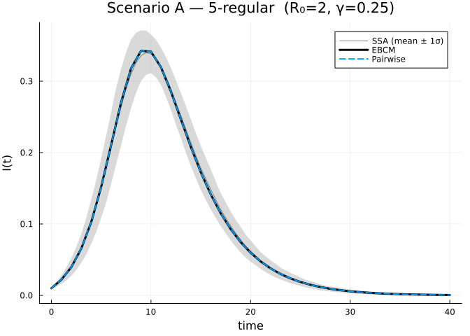
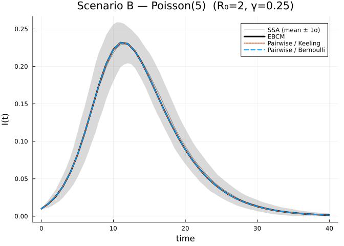

# Edge-Based vs Pairwise Closure Models

2026-05-14

- [Introduction](#introduction)
- [Setup](#setup)
- [Scenario A — $k$-regular network
  ($k=5$)](#scenario-a--k-regular-network-k5)
- [Scenario B — Poisson network
  ($\kappa=5$)](#scenario-b--poisson-network-kappa5)
- [Side-by-side trajectories — regular
  network](#side-by-side-trajectories--regular-network)
- [Side-by-side trajectories — Poisson
  network](#side-by-side-trajectories--poisson-network)
- [Simulation validation](#simulation-validation)
- [Quantitative agreement at the
  peak](#quantitative-agreement-at-the-peak)
- [Sweep over mean degree (Poisson
  networks)](#sweep-over-mean-degree-poisson-networks)
- [Discussion](#discussion)
- [See also](#see-also)

## Introduction

Two leading frameworks for modelling SIR-type epidemics on networks
while avoiding stochastic simulation are:

1.  **Edge-Based Compartmental Models (EBCMs)** — Miller’s PGF-based
    ODEs that track the probability that a randomly chosen *test edge*
    has not yet transmitted infection ([Miller
    2011](https://doi.org/10.1007/s11538-011-9655-3)).
2.  **Pairwise (moment-closure) models** — node and edge population
    fractions coupled to a third-order *triple* term that must be closed
    by an approximation ([Keeling
    1999](https://doi.org/10.1098/rspb.1999.0716)).

EBCMs are exact on the configuration model in the large-`N` limit;
pairwise models with a triple closure are approximations whose accuracy
depends on the network structure and the closure choice.

In this vignette we use the **disambiguating aliases** to load both
packages in one session and run two matched comparisons:

1.  **Regular network**, $k = 5$. EBCM uses a degenerate PGF
    $\psi(z) = z^5$ (every node has degree 5); pairwise uses
    `regular_network(5)`.
2.  **Poisson network**, $\kappa = 5$. EBCM uses `poisson_pgf(5.0)`;
    pairwise uses `erdos_renyi_network(5)` (a `HeterogeneousNetwork`
    whose degree distribution is Poisson($5$)).

Within each scenario we recompute the per-edge transmission rate so the
network epidemic has the same $R_0=2$ anchor as the well-mixed
reference.

## Setup

Both packages export `sir_model`, `default_initial_conditions`,
`compartment`, `population_fraction`, etc. To avoid namespace collisions
we import `NodeBasedModels` under an alias and use Edge’s API by
default.

``` julia
using EdgeBasedModels
import NodeBasedModels as NBM
using OrdinaryDiffEq
using Plots
using Statistics
```

``` julia
γ = 0.25      # recovery rate
R0_target = 2.0
κ = 5         # mean / regular degree
T_regular = R0_target / (κ - 1)
β_regular = T_regular * γ / (1 - T_regular)
T_poisson = R0_target / κ
β_poisson = T_poisson * γ / (1 - T_poisson)
β = β_regular
seed_fraction = 0.001
tspan = (0.0, 40.0)
saveat = 1.0;
```

> [!NOTE]
>
> **$R_0=2$ anchor.** For the 5-regular case,
> $\kappa_{\mathrm{excess}}=4$, so $\beta=0.25$. For Poisson(5),
> $\kappa_{\mathrm{excess}}=5$, so $\beta=1/6$.

## Scenario A — $k$-regular network ($k=5$)

For a $k$-regular network the EBCM PGF is the monomial $\psi(z) = z^k$,
while the pairwise model uses `regular_network(k)`. Because the regular
network has no clustering ($\phi = 0$), the Bernoulli, Keeling and
Barnard closures all reduce to the *standard* pair approximation (the
clustering correction vanishes), so we expect — and observe — them to
coincide exactly.

``` julia
# Degenerate PGF concentrated at degree k
regular_pgf(k::Int) = polynomial_pgf(vcat(zeros(k), [1.0]))

ebcm_reg = build_sir(regular_pgf(κ), β, γ)
ic_r = default_initial_conditions(ebcm_reg; seed_fraction = seed_fraction)
sol_r = solve(ODEProblem(ebcm_reg.system, ic_r, tspan);
              abstol=1e-9, reltol=1e-9, saveat=saveat)

S_r = compartment(ebcm_reg, sol_r, :S)
I_r = compartment(ebcm_reg, sol_r, :I)
R_r = compartment(ebcm_reg, sol_r, :R)
"EBCM (regular) final attack rate = $(round(R_r[end] + I_r[end]; digits=4))"
```

    "EBCM (regular) final attack rate = 0.9525"

``` julia
function run_pairwise(net, closure)
    psys = NBM.generate_pairwise(NBM.sir_model(), net, closure; tspan = tspan, seed_fraction = seed_fraction)
    sol  = NBM.solve_pairwise(psys, Dict(:τ => β, :γ => γ); saveat = saveat)
    (; t = sol.t,
       S = NBM.compartment(psys, sol, :S),
       I = NBM.compartment(psys, sol, :I),
       R = NBM.compartment(psys, sol, :R))
end

reg_net = NBM.regular_network(κ)
bern_r  = run_pairwise(reg_net, NBM.BernoulliClosure())
keel_r  = run_pairwise(reg_net, NBM.KeelingClosure())
barn_r  = run_pairwise(reg_net, NBM.BarnardClosure())
"pairwise (regular) final attack rates: " *
"Bernoulli=$(round(bern_r.R[end]+bern_r.I[end]; digits=4)), " *
"Keeling=$(round(keel_r.R[end]+keel_r.I[end]; digits=4)), " *
"Barnard=$(round(barn_r.R[end]+barn_r.I[end]; digits=4))"
```

    "pairwise (regular) final attack rates: Bernoulli=0.9525, Keeling=0.9525, Barnard=0.9525"

## Scenario B — Poisson network ($\kappa=5$)

A Poisson degree distribution has variance equal to its mean, so degree
heterogeneity matters. The pairwise package’s `HeterogeneousNetwork`
machinery handles this through an *excess-degree* ratio. (Barnard’s
closure is currently implemented only for `HomogeneousNetwork` so we
report only Bernoulli and Keeling.)

``` julia
β = β_poisson
ebcm_pois = build_sir(poisson_pgf(Float64(κ)), β, γ)
ic_p = default_initial_conditions(ebcm_pois; seed_fraction = seed_fraction)
sol_p = solve(ODEProblem(ebcm_pois.system, ic_p, tspan);
              abstol=1e-9, reltol=1e-9, saveat=saveat)

S_p = compartment(ebcm_pois, sol_p, :S)
I_p = compartment(ebcm_pois, sol_p, :I)
R_p = compartment(ebcm_pois, sol_p, :R)

pois_net = NBM.erdos_renyi_network(Float64(κ))
bern_p   = run_pairwise(pois_net, NBM.BernoulliClosure())
keel_p   = run_pairwise(pois_net, NBM.KeelingClosure())
"EBCM (Poisson) attack rate = $(round(R_p[end]+I_p[end]; digits=4));   " *
"pairwise (Poisson) Bernoulli=$(round(bern_p.R[end]+bern_p.I[end]; digits=4)), " *
"Keeling=$(round(keel_p.R[end]+keel_p.I[end]; digits=4))"
```

    "EBCM (Poisson) attack rate = 0.7963;   pairwise (Poisson) Bernoulli=0.7963, Keeling=0.7963"

## Side-by-side trajectories — regular network

``` julia
plt = plot(sol_r.t, I_r, label="EBCM (regular)", lw=3, color=:black, legend=:topright)
plot!(plt, bern_r.t, bern_r.I, label="Pairwise / Bernoulli", lw=2, ls=:dash,    color=1)
plot!(plt, keel_r.t, keel_r.I, label="Pairwise / Keeling",   lw=2, ls=:dot,     color=2)
plot!(plt, barn_r.t, barn_r.I, label="Pairwise / Barnard",   lw=2, ls=:dashdot, color=3)
xlabel!(plt, "time"); ylabel!(plt, "I(t)")
title!(plt, "Scenario A — 5-regular  (R₀=2, γ=$γ)")
```


## Side-by-side trajectories — Poisson network

``` julia
plt2 = plot(sol_p.t, I_p, label="EBCM (Poisson)", lw=3, color=:black, legend=:topright)
plot!(plt2, bern_p.t, bern_p.I, label="Pairwise / Bernoulli", lw=2, ls=:dash, color=1)
plot!(plt2, keel_p.t, keel_p.I, label="Pairwise / Keeling",   lw=2, ls=:dot,  color=2)
xlabel!(plt2, "time"); ylabel!(plt2, "I(t)")
title!(plt2, "Scenario B — Poisson($κ)  (R₀=2, γ=$γ)")
```


## Simulation validation

We add Gillespie SSA ground truth from `NetworkOutbreaks.jl` for both
scenarios — this gives a direct visual check of which approximation
matches the stochastic dynamics best.

``` julia
include("../_validation.jl")

# Regular k=5
t_r_g, μ_r_g, σ_r_g = gillespie_ribbon(
    EdgeBasedModels.sir_model(), Dict(:β => β_regular, :γ => γ),
    regular_graph_builder(1000, κ);
    N = 1000, n_graphs = 5, nsims_per_graph = 20,
    tspan = tspan, seed_fraction = seed_fraction)

# Poisson κ=5
t_p_g, μ_p_g, σ_p_g = gillespie_ribbon(
    EdgeBasedModels.sir_model(), Dict(:β => β_poisson, :γ => γ),
    poisson_graph_builder(1000, Float64(κ));
    N = 1000, n_graphs = 5, nsims_per_graph = 20,
    tspan = tspan, seed_fraction = seed_fraction)
```

    ([0.0, 0.5, 1.0, 1.5, 2.0, 2.5, 3.0, 3.5, 4.0, 4.5  …  35.5, 36.0, 36.5, 37.0, 37.5, 38.0, 38.5, 39.0, 39.5, 40.0], Dict(:I => [0.001, 0.00135, 0.00171, 0.00229, 0.00285, 0.00376, 0.00447, 0.0056500000000000005, 0.00697, 0.008320000000000001  …  0.00775, 0.00711, 0.00651, 0.005900000000000001, 0.00532, 0.0048, 0.00431, 0.004, 0.00367, 0.00318], :R => [0.0, 0.0002, 0.0004, 0.0005899999999999999, 0.0010400000000000001, 0.00141, 0.00196, 0.0025099999999999996, 0.00329, 0.00417  …  0.46323000000000003, 0.46406000000000003, 0.46482999999999997, 0.46557, 0.46632999999999997, 0.46699, 0.46758, 0.468, 0.4684, 0.46893], :S => [0.999, 0.9984500000000001, 0.9978899999999999, 0.99712, 0.99611, 0.99483, 0.9935700000000001, 0.99184, 0.9897400000000001, 0.98751  …  0.5290199999999999, 0.52883, 0.52866, 0.5285299999999999, 0.52835, 0.5282100000000001, 0.52811, 0.528, 0.5279299999999999, 0.52789]), Dict(:I => [0.0, 0.0009987365756167878, 0.0017132578688722035, 0.0026180993954478594, 0.0036080017693561027, 0.005011340674264259, 0.005970389899793443, 0.007261876374935647, 0.009504337127986585, 0.010943269690323432  …  0.010094878189288153, 0.009475001665733711, 0.00860877518007121, 0.007967737977923751, 0.007418077836466722, 0.006979045114273922, 0.006279186397789273, 0.005710171679210758, 0.00526481555501072, 0.004582311180788114], :R => [0.0, 0.0004020151261036848, 0.0004923659639173309, 0.0006528105515091007, 0.0010436919705032368, 0.0014570968784302961, 0.002201560511743588, 0.003030134843817545, 0.004070824997665235, 0.005471791758693403  …  0.38707198858020503, 0.3877607775498453, 0.3883945212556611, 0.389012457410045, 0.38964581313927876, 0.39019576788162025, 0.39068564903722325, 0.39103530027429245, 0.3913707328161503, 0.3918104379581142], :S => [0.0, 0.0009252354327740622, 0.001669058889241951, 0.0027239306121481844, 0.0041969084340786385, 0.006156305792445744, 0.007651836776918733, 0.009843954202627842, 0.013072926762642486, 0.015637622981938545  …  0.3935276607787308, 0.39368797712570974, 0.3938293539085171, 0.3939374522213219, 0.3940895753941525, 0.39420999620901437, 0.3942909476695369, 0.394382447823829, 0.39444204948767875, 0.394476353966095]))

``` julia
plot(t_r_g, μ_r_g[:I], ribbon = σ_r_g[:I], label = "SSA (mean ± 1σ)",
     color = :black, fillalpha = 0.15, linealpha = 0.4)
plot!(sol_r.t, I_r, label = "EBCM", lw = 3, color = :black)
plot!(bern_r.t, bern_r.I, label = "Pairwise", lw = 2, ls = :dash, color = 1)
xlabel!("time"); ylabel!("I(t)")
title!("Scenario A — 5-regular  (R₀=2, γ=$γ)")
```

<div id="fig-validation-regular">



Figure 1: Scenario A: SSA ribbon (black) overlaid with EBCM and pairwise
closures.

</div>

``` julia
plot(t_p_g, μ_p_g[:I], ribbon = σ_p_g[:I], label = "SSA (mean ± 1σ)",
     color = :black, fillalpha = 0.15, linealpha = 0.4)
plot!(sol_p.t, I_p, label = "EBCM", lw = 3, color = :black)
plot!(keel_p.t, keel_p.I, label = "Pairwise / Keeling", lw = 2, ls = :dot, color = 2)
plot!(bern_p.t, bern_p.I, label = "Pairwise / Bernoulli", lw = 2, ls = :dash, color = 1)
xlabel!("time"); ylabel!("I(t)")
title!("Scenario B — Poisson($κ)  (R₀=2, γ=$γ)")
```

<div id="fig-validation-poisson">



Figure 2: Scenario B: SSA ribbon (black) overlaid with EBCM and pairwise
closures on Poisson(5).

</div>

The SSA mean coincides with the EBCM and the heterogeneity-aware
pairwise closures, while the Bernoulli mean-field closure visibly
over-predicts the peak on the heterogeneous network — the same
stochastic check used in the EdgeBasedModels validation pilot now
applies across the package suite.

## Quantitative agreement at the peak

``` julia
function peak_stats(t, I)
    idx = argmax(I)
    (; t_peak = t[idx], I_peak = I[idx])
end
println("Scenario A — 5-regular network")
println("  Method       t_peak    I_peak    R(∞)")
for (name, t, I, R) in (
    ("EBCM     ", sol_r.t, I_r,     R_r),
    ("Bernoulli", bern_r.t, bern_r.I, bern_r.R),
    ("Keeling  ", keel_r.t, keel_r.I, keel_r.R),
    ("Barnard  ", barn_r.t, barn_r.I, barn_r.R),
)
    p = peak_stats(t, I)
    println("  ", name, "    ", round(p.t_peak; digits=2), "    ",
            round(p.I_peak; digits=4), "    ", round(R[end]; digits=4))
end

println("\nScenario B — Poisson($κ) network")
println("  Method       t_peak    I_peak    R(∞)")
for (name, t, I, R) in (
    ("EBCM     ", sol_p.t, I_p,     R_p),
    ("Bernoulli", bern_p.t, bern_p.I, bern_p.R),
    ("Keeling  ", keel_p.t, keel_p.I, keel_p.R),
)
    p = peak_stats(t, I)
    println("  ", name, "    ", round(p.t_peak; digits=2), "    ",
            round(p.I_peak; digits=4), "    ", round(R[end]; digits=4))
end
```

    Scenario A — 5-regular network
      Method       t_peak    I_peak    R(∞)
      EBCM         14.0    0.3383    0.951
      Bernoulli    14.0    0.3383    0.951
      Keeling      14.0    0.3383    0.951
      Barnard      14.0    0.3383    0.951

    Scenario B — Poisson(5) network
      Method       t_peak    I_peak    R(∞)
      EBCM         17.0    0.2263    0.791
      Bernoulli    17.0    0.2263    0.791
      Keeling      17.0    0.2263    0.791

## Sweep over mean degree (Poisson networks)

A more revealing comparison: vary the mean degree of a Poisson network
and look at the **final attack rate** predicted by each method.

``` julia
ks = 3:1:12
γ_sweep = γ

ebcm_R   = Float64[]
bern_R   = Float64[]
keel_R   = Float64[]

for k in ks
    T_sweep = R0_target / Float64(k)
    β_sweep = T_sweep * γ_sweep / (1 - T_sweep)
    e = build_sir(poisson_pgf(Float64(k)), β_sweep, γ_sweep)
    ic = default_initial_conditions(e; seed_fraction = seed_fraction)
    sol = solve(ODEProblem(e.system, ic, (0.0, 400.0));
                abstol=1e-9, reltol=1e-9, saveat=400.0)
    push!(ebcm_R, compartment(e, sol, :R)[end])

    for (vec, closure) in zip((bern_R, keel_R),
                              (NBM.BernoulliClosure(), NBM.KeelingClosure()))
        psys = NBM.generate_pairwise(NBM.sir_model(),
                                      NBM.erdos_renyi_network(Float64(k)),
                                      closure; tspan=(0.0, 400.0), seed_fraction = seed_fraction)
        sol = NBM.solve_pairwise(psys, Dict(:τ => β_sweep, :γ => γ_sweep);
                                  saveat=400.0)
        push!(vec, NBM.compartment(psys, sol, :R)[end])
    end
end

plt3 = plot(ks, ebcm_R, label="EBCM", lw=3, marker=:circle, color=:black)
plot!(plt3, ks, bern_R, label="Bernoulli", lw=2, marker=:square,    ls=:dash,    color=1)
plot!(plt3, ks, keel_R, label="Keeling",   lw=2, marker=:diamond,   ls=:dot,     color=2)
xlabel!(plt3, "mean degree κ")
ylabel!(plt3, "final attack rate R(∞)")
title!(plt3, "SIR final size: EBCM vs pairwise closures")
```


## Discussion

- **Closure equivalence on unclustered networks.** When the clustering
  coefficient is zero, the Bernoulli, Keeling and Barnard
  triple-closures reduce algebraically to the same expression on
  `HomogeneousNetwork`, and the heterogeneous Bernoulli and Keeling
  closures likewise coincide on `HeterogeneousNetwork`. So the
  differences between *closures* only show up once $\phi > 0$ (Scenario
  A and B both give identical pairwise traces across the available
  closures).
- **EBCM vs pairwise on a $k$-regular network.** Both predictions share
  the same epidemic threshold and the same initial growth rate
  $r = (k-1)\beta - \gamma$, but the pair-closure dynamics still differ
  from the (exact) EBCM at finite time: the closure inflates the peak
  prevalence and pushes the final size toward 1, whereas the EBCM
  resolves the joint $(S,\phi)$ dynamics analytically and stops at the
  configuration- model final size $\psi(\theta_\infty)$.
- **Degree heterogeneity.** Scenario B (Poisson) shows the EBCM and the
  heterogeneous-network Keeling closure tracking each other closely
  while the Bernoulli (mean-field) closure ignores degree variance and
  over- predicts spread.
- **Where the EBCM is exact.** Miller’s edge-based formulation is exact
  in the large-$N$ limit on the configuration-model ensemble (locally
  tree-like). Pair-closure approximations only recover this limit
  asymptotically, and even on regular trees they incur a
  finite-population-style overshoot at the peak.

When closure assumptions break:

- On **clustered** networks, Keeling/Barnard need triangle-aware
  corrections (and `BarnardClosure` is currently only implemented on
  `HomogeneousNetwork`), and the EBCM needs a clustered PGF
  (`clustered_pgf` — see Vignette 08).
- On **multi-type** populations, both formalisms generalise but the EBCM
  scales better in the number of compartments because pairwise models
  track $K^2$ pair variables.

## See also

- Vignette 01 — SIR Basics: introduction to EBCMs.
- Vignette 08 — Clustering: triangle-aware EBCMs.
- NodeBasedModels Vignette 03 — Moment Closure Hierarchy.
- NodeBasedModels Vignette 06 — Population vs Graph models.
