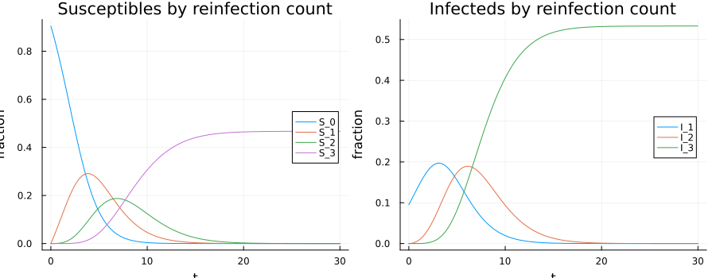
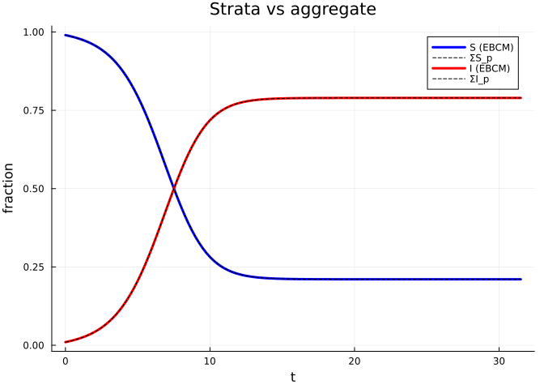
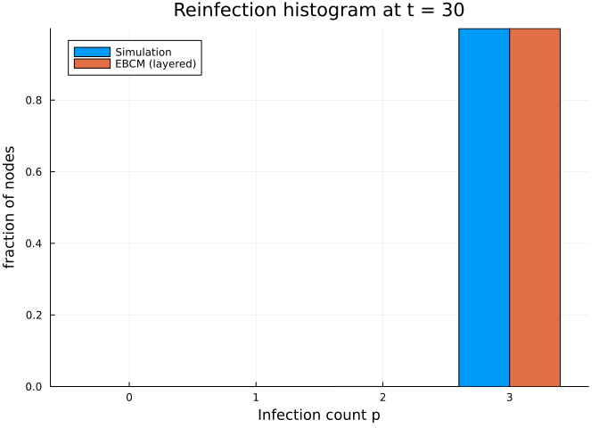

# Counting Reinfections in SIS / SIRS Epidemics
Simon Frost
2026-05-14

- [Motivation](#motivation)
- [Setup](#setup)
- [A reinfection-counted SIS model](#a-reinfection-counted-sis-model)
  - [Stratum-by-stratum susceptibles and
    infecteds](#stratum-by-stratum-susceptibles-and-infecteds)
  - [Aggregate sanity check](#aggregate-sanity-check)
- [Comparison against simulation](#comparison-against-simulation)
- [When does the layered closure work
  well?](#when-does-the-layered-closure-work-well)
- [References](#references)

## Motivation

In endemic diseases (SIS, SIRS), the susceptible class is
**heterogeneous**: some individuals have never been infected, while
others are recovered susceptibles who may already have transmitted the
pathogen to part of their local neighbourhood. Standard EBCM lumps both
into a single `S` compartment, which discards information about
heterogeneous risk and can bias predictions of prevalence,
time-to-equilibrium, and outbreak size in repeated waves.

@KeelingEPS2016 (PLOS Comput Biol 13(6): e1005296) propose a simple
remedy: track the **number of times** each individual has been infected,
and stratify both `S` and `I` by that count. With $L$ strata one obtains
$L+1$ susceptible classes $S_0, S_1, \dots, S_L$ and $L$ infectious
classes $I_1, \dots, I_L$ ($I_L$ is a saturating bucket). The dynamics
are mean-field on the per-capita hazards but the **partition** is
exactly recoverable from the underlying simulation, providing a much
finer-grained picture of risk.

EdgeBasedModels.jl exposes this construction through

| Symbol | Purpose |
|----|----|
| `with_reinfection_counting(prog, L)` | Lift a `DiseaseProgression` into a layered version. |
| `build_sis_reinfection(pgf, β, γ, L)` | Direct builder returning an EBCM SIS system with reinfection strata. |
| `base_compartment_of(:S_2)` → `:S` | Map a lifted name back to its base. |
| `infection_count_of(:I_3)` → `3` | Recover the stratum index from a lifted name. |
| `reinfection_totals(sol, model)` | Aggregate strata back into base compartments. |

The aggregated dynamics agree with the standard `build_sis` to machine
precision (the stratification is layered over the same EBCM closure).

## Setup

``` julia
using EdgeBasedModels
using OrdinaryDiffEq
using ModelingToolkit
using NetworkOutbreaks
using Graphs
using StableRNGs
using StatsPlots
```

## A reinfection-counted SIS model

We build an SIS model on a 5-regular configuration-model network with
transmission rate derived so the baseline has $R_0 = 2$, recovery rate
$\gamma = 0.25$, and $L = 3$ reinfection strata.

``` julia
# Universal anchors: γ=0.25, R₀=2, β derived per scenario (see plan.md)
regular_pgf(k::Int) = polynomial_pgf(vcat(zeros(k), [1.0]))
k = 5
γ = 0.25
R0_target = 2.0
T = R0_target / (k - 1)
β = T * γ / (1 - T)
pgf = regular_pgf(k)
L    = 3

system = build_sis_reinfection(pgf, β, γ, L)
ic     = default_initial_conditions(system; ε = 0.01)
prob   = ODEProblem(system.system, ic, (0.0, 40.0))
sol    = solve(prob, Tsit5(); saveat = 0.25)
ts     = sol.t
```

    127-element Vector{Float64}:
      0.0
      0.25
      0.5
      0.75
      1.0
      1.25
      1.5
      1.75
      2.0
      2.25
      ⋮
     29.5
     29.75
     30.0
     30.25
     30.5
     30.75
     31.0
     31.25
     31.5

`build_sis_reinfection` constructs an `EdgeModelSystem` whose state
contains the standard EBCM variables (`θ`, `S`, `I`) plus the
per-stratum variables `S_0, …, S_L, I_1, …, I_L`.

### Stratum-by-stratum susceptibles and infecteds

``` julia
plt_S = plot(title = "Susceptibles by reinfection count", xlabel = "t",
             ylabel = "fraction", legend = :right)
for p in 0:L
    plot!(plt_S, ts, compartment(sol, system, Symbol("S_$(p)")),
          label = "S_$(p)")
end

plt_I = plot(title = "Infecteds by reinfection count", xlabel = "t",
             ylabel = "fraction", legend = :right)
for p in 1:L
    plot!(plt_I, ts, compartment(sol, system, Symbol("I_$(p)")),
          label = "I_$(p)")
end

plot(plt_S, plt_I, layout = (1, 2), size = (900, 350))
```



Two qualitative observations:

- `S_0` decays monotonically — once infected, an individual never
  returns to the never-infected class.
- The strata `S_p, I_p` for $p \ge 1$ rise and approach a quasi-steady
  state, with most mass eventually accumulating in the saturating bucket
  $S_L + I_L$.

### Aggregate sanity check

The strata sum to the standard EBCM aggregates:

``` julia
S_strata = sum(compartment(sol, system, Symbol("S_$(p)")) for p in 0:L)
I_strata = sum(compartment(sol, system, Symbol("I_$(p)")) for p in 1:L)
S_agg    = compartment(sol, system, :S)
I_agg    = compartment(sol, system, :I)

plt = plot(title = "Strata vs aggregate", xlabel = "t", ylabel = "fraction")
plot!(plt, ts, S_agg,    label = "S (EBCM)", lw = 3, c = :blue)
plot!(plt, ts, S_strata, label = "ΣS_p",     ls = :dash, c = :black)
plot!(plt, ts, I_agg,    label = "I (EBCM)", lw = 3, c = :red)
plot!(plt, ts, I_strata, label = "ΣI_p",     ls = :dash, c = :black)
plt
```



The dashed (strata-summed) and solid (EBCM-aggregate) curves coincide.

## Comparison against simulation

To verify that the layered closure tracks the per-stratum quantities of
the **simulated** epidemic, we run an ensemble of SSA realisations using
the companion package `NetworkOutbreaks.jl`. The simulator internally
counts each per-node S→I event, so the histogram of infection counts is
available “for free”.

``` julia
N = 1000
g = random_regular_graph(N, k; rng = StableRNG(42))

om   = OutbreakModel(sis_model(), Dict(:β => β, :γ => γ))
spec = OutbreakSpec(model = om, network = g,
                    initial = SeedFraction(:I => 0.01),
                    tspan   = (0.0, 40.0))

ens = simulate_ensemble(spec; nsims = 40, seed = 123)
```

    OutbreakEnsemble(OutbreakSpec{StaticNetwork{SimpleGraph{Int64}}}(OutbreakModel([:S, :I], Bool[0, 1], OutbreakTransition[OutbreakTransition(:S, :I, 0.25, :infection, [:I]), OutbreakTransition(:I, :S, 0.25, :spontaneous, Symbol[])], :ebm_outbreak, Dict(:I => 2, :S => 1)), StaticNetwork{SimpleGraph{Int64}}(SimpleGraph{Int64}(2500, [[11, 399, 459, 801, 846], [304, 334, 382, 430, 969], [113, 291, 429, 474, 750], [146, 343, 346, 535, 758], [45, 159, 186, 516, 876], [139, 181, 381, 670, 806], [54, 551, 619, 685, 712], [16, 182, 261, 699, 869], [181, 290, 292, 798, 887], [34, 79, 520, 839, 981]  …  [184, 299, 765, 847, 936], [213, 313, 376, 677, 828], [382, 603, 759, 913, 999], [171, 207, 394, 900, 981], [368, 537, 807, 843, 851], [343, 430, 669, 691, 884], [66, 207, 297, 563, 687], [149, 453, 460, 622, 674], [121, 148, 745, 856, 993], [271, 306, 554, 721, 854]])), SeedFraction([:I => 0.01]), (0.0, 40.0)), OutbreakTrajectory[OutbreakTrajectory(OutbreakModel([:S, :I], Bool[0, 1], OutbreakTransition[OutbreakTransition(:S, :I, 0.25, :infection, [:I]), OutbreakTransition(:I, :S, 0.25, :spontaneous, Symbol[])], :ebm_outbreak, Dict(:I => 2, :S => 1)), [0.0, 0.029107725623404652, 0.22683996115381105, 0.2351940819975739, 0.4001615070163319, 0.4260221456909906, 0.6132307682510577, 0.6376511025417195, 0.6648927775638589, 0.7187965713082731  …  39.98390926781221, 39.98463629716586, 39.984831639212594, 39.986824922604775, 39.98982814413561, 39.990756007622274, 39.991708525178666, 39.99681000554856, 39.99939776881109, 40.0], [990 989 … 217 217; 10 11 … 783 783], [6, 5, 8, 8, 10, 8, 9, 7, 9, 7  …  7, 8, 10, 8, 5, 5, 4, 6, 7, 11], OutbreakEvent[], 0xb4dc9bd462de412b, :DirectSSA), OutbreakTrajectory(OutbreakModel([:S, :I], Bool[0, 1], OutbreakTransition[OutbreakTransition(:S, :I, 0.25, :infection, [:I]), OutbreakTransition(:I, :S, 0.25, :spontaneous, Symbol[])], :ebm_outbreak, Dict(:I => 2, :S => 1)), [0.0, 0.012385869342945771, 0.055367376561923885, 0.09349018122873845, 0.10210887053072092, 0.10845310280234183, 0.16605728873692321, 0.16937144475581115, 0.21583669074577788, 0.2457371230112482  …  39.97733381381074, 39.98807104614894, 39.99348090741747, 39.99363048213036, 39.99526501009936, 39.99602792917535, 39.9976516070063, 39.99828917329331, 39.99993093209446, 40.0], [990 989 … 209 209; 10 11 … 791 791], [7, 8, 6, 8, 9, 3, 6, 9, 9, 5  …  12, 7, 7, 6, 11, 8, 7, 6, 10, 9], OutbreakEvent[], 0xfa023ce9f06fb77c, :DirectSSA), OutbreakTrajectory(OutbreakModel([:S, :I], Bool[0, 1], OutbreakTransition[OutbreakTransition(:S, :I, 0.25, :infection, [:I]), OutbreakTransition(:I, :S, 0.25, :spontaneous, Symbol[])], :ebm_outbreak, Dict(:I => 2, :S => 1)), [0.0, 0.022227936232751117, 0.24153646466156783, 0.24179333288424015, 0.27900663730594033, 0.4906213344404945, 0.5548048297205472, 0.6537253226040916, 0.8897044764197095, 1.0948098724397743  …  39.97443145162804, 39.979730307922836, 39.9800598095759, 39.98754104554375, 39.98899163194504, 39.989378991237245, 39.990303645951975, 39.99722766950102, 39.99900387589852, 40.0], [990 989 … 217 217; 10 11 … 783 783], [3, 8, 9, 4, 6, 8, 4, 6, 8, 7  …  7, 5, 5, 6, 9, 6, 5, 8, 6, 6], OutbreakEvent[], 0xdc12d311d371cbe8, :DirectSSA), OutbreakTrajectory(OutbreakModel([:S, :I], Bool[0, 1], OutbreakTransition[OutbreakTransition(:S, :I, 0.25, :infection, [:I]), OutbreakTransition(:I, :S, 0.25, :spontaneous, Symbol[])], :ebm_outbreak, Dict(:I => 2, :S => 1)), [0.0, 0.04683428482026965, 0.08774660136904579, 0.09973341700099715, 0.16078969227795453, 0.17112841750683058, 0.17359361365653614, 0.18684075921193322, 0.20333508819159066, 0.24825285093619825  …  39.976809869978894, 39.97880325799183, 39.98592437238157, 39.988021664340955, 39.99012511704747, 39.99061741987737, 39.99071350691437, 39.991301287294846, 39.99421426690294, 40.0], [990 989 … 205 205; 10 11 … 795 795], [8, 11, 8, 5, 5, 6, 7, 5, 9, 2  …  6, 8, 7, 6, 7, 7, 7, 8, 6, 8], OutbreakEvent[], 0xafd2040c909881ff, :DirectSSA), OutbreakTrajectory(OutbreakModel([:S, :I], Bool[0, 1], OutbreakTransition[OutbreakTransition(:S, :I, 0.25, :infection, [:I]), OutbreakTransition(:I, :S, 0.25, :spontaneous, Symbol[])], :ebm_outbreak, Dict(:I => 2, :S => 1)), [0.0, 0.08043291008700147, 0.1703532915666576, 0.20516272574110944, 0.2609485172187523, 0.36420120843149417, 0.37434642869405566, 0.44758146460311343, 0.5456273438865035, 0.656259129327105  …  39.9898389841844, 39.990742010023666, 39.99178344822232, 39.99189204924956, 39.99398883686913, 39.99450580269123, 39.996485136869474, 39.99877044307844, 39.999981166982366, 40.0], [990 989 … 220 220; 10 11 … 780 780], [11, 10, 8, 7, 7, 12, 6, 10, 5, 5  …  8, 7, 7, 10, 7, 6, 4, 4, 12, 7], OutbreakEvent[], 0xafa346d4780ee932, :DirectSSA), OutbreakTrajectory(OutbreakModel([:S, :I], Bool[0, 1], OutbreakTransition[OutbreakTransition(:S, :I, 0.25, :infection, [:I]), OutbreakTransition(:I, :S, 0.25, :spontaneous, Symbol[])], :ebm_outbreak, Dict(:I => 2, :S => 1)), [0.0, 0.02518639285285805, 0.10966194153631938, 0.14723893687519024, 0.24150552149078724, 0.26676631982786725, 0.5101656831609818, 0.756901175784433, 0.8022095170516836, 0.8399600358986448  …  39.99009806396306, 39.990313013873134, 39.99410595343423, 39.994334552688215, 39.99667664963081, 39.997066471954625, 39.99867000187479, 39.998810076647736, 39.99903324514972, 40.0], [990 989 … 211 211; 10 11 … 789 789], [8, 8, 4, 6, 8, 4, 4, 8, 9, 7  …  7, 7, 8, 4, 7, 7, 9, 9, 7, 5], OutbreakEvent[], 0xaac67282fc30b210, :DirectSSA), OutbreakTrajectory(OutbreakModel([:S, :I], Bool[0, 1], OutbreakTransition[OutbreakTransition(:S, :I, 0.25, :infection, [:I]), OutbreakTransition(:I, :S, 0.25, :spontaneous, Symbol[])], :ebm_outbreak, Dict(:I => 2, :S => 1)), [0.0, 0.07705401170948914, 0.08367050075837353, 0.14430828452479594, 0.18056404556437305, 0.20406644297623863, 0.2300598382830707, 0.2799470421460013, 0.3756281238348166, 0.43673938458293426  …  39.98667897347248, 39.987219518909285, 39.9873325623211, 39.98935024500412, 39.991951689943754, 39.9937602184458, 39.99575759451155, 39.996388619231595, 39.99767996174361, 40.0], [990 989 … 233 233; 10 11 … 767 767], [12, 8, 6, 9, 7, 10, 7, 10, 5, 4  …  7, 7, 7, 4, 5, 9, 6, 8, 9, 4], OutbreakEvent[], 0xfffc0ae28a58cd1e, :DirectSSA), OutbreakTrajectory(OutbreakModel([:S, :I], Bool[0, 1], OutbreakTransition[OutbreakTransition(:S, :I, 0.25, :infection, [:I]), OutbreakTransition(:I, :S, 0.25, :spontaneous, Symbol[])], :ebm_outbreak, Dict(:I => 2, :S => 1)), [0.0, 0.020681782110513643, 0.03029347890154548, 0.045991678516814696, 0.075353626039261, 0.0798126620414046, 0.19776560169198498, 0.22700534682173448, 0.3379702755861095, 0.44897895741200455  …  39.974844884408526, 39.980282366463115, 39.98143082011734, 39.98227261849591, 39.983194167002104, 39.98386602504331, 39.98908052032197, 39.990041232017234, 39.99299324790198, 40.0], [990 989 … 200 200; 10 11 … 800 800], [6, 8, 9, 7, 8, 7, 11, 6, 8, 8  …  8, 3, 7, 6, 9, 8, 5, 7, 15, 5], OutbreakEvent[], 0x7b7bbe864d91dfb1, :DirectSSA), OutbreakTrajectory(OutbreakModel([:S, :I], Bool[0, 1], OutbreakTransition[OutbreakTransition(:S, :I, 0.25, :infection, [:I]), OutbreakTransition(:I, :S, 0.25, :spontaneous, Symbol[])], :ebm_outbreak, Dict(:I => 2, :S => 1)), [0.0, 0.025112078383571088, 0.09462528774011096, 0.1135434535739851, 0.14561765728207413, 0.2808237132108793, 0.32020416181101086, 0.3512677996291202, 0.4060172182659374, 0.4130724791342061  …  39.98678038007662, 39.986963524674735, 39.98713028653903, 39.9877577829886, 39.987798306367246, 39.99021523144296, 39.990506303479066, 39.99116857711849, 39.995236032082694, 40.0], [990 989 … 204 204; 10 11 … 796 796], [5, 8, 2, 9, 9, 8, 6, 9, 4, 5  …  6, 10, 6, 11, 6, 14, 9, 7, 5, 10], OutbreakEvent[], 0x9eadd9a5bc925ae5, :DirectSSA), OutbreakTrajectory(OutbreakModel([:S, :I], Bool[0, 1], OutbreakTransition[OutbreakTransition(:S, :I, 0.25, :infection, [:I]), OutbreakTransition(:I, :S, 0.25, :spontaneous, Symbol[])], :ebm_outbreak, Dict(:I => 2, :S => 1)), [0.0, 0.06635565754227693, 0.1395988007261874, 0.2524206697499727, 0.32438340659297676, 0.34750754434162673, 0.4227356504271972, 0.45358305856712905, 0.4704955651973264, 0.4983963371290875  …  39.982383538134414, 39.98329068623705, 39.99069588682648, 39.991355231298584, 39.9917680328974, 39.994534704234724, 39.995014966371436, 39.99563575900125, 39.99694286321391, 40.0], [990 989 … 220 220; 10 11 … 780 780], [10, 5, 6, 10, 12, 8, 13, 8, 8, 8  …  9, 6, 7, 7, 7, 10, 5, 8, 6, 3], OutbreakEvent[], 0x24073b7feac7464d, :DirectSSA)  …  OutbreakTrajectory(OutbreakModel([:S, :I], Bool[0, 1], OutbreakTransition[OutbreakTransition(:S, :I, 0.25, :infection, [:I]), OutbreakTransition(:I, :S, 0.25, :spontaneous, Symbol[])], :ebm_outbreak, Dict(:I => 2, :S => 1)), [0.0, 0.020433140928131588, 0.18445111998977468, 0.2438062186959771, 0.26446754853434007, 0.27259685296714203, 0.2911119878603626, 0.32924912781373256, 0.3337925306869537, 0.35957374462508235  …  39.97947543758988, 39.979768762566444, 39.98303245875738, 39.98665261416482, 39.99036414146158, 39.99325092664344, 39.998046343623166, 39.998555954865225, 39.99996425610159, 40.0], [990 989 … 223 223; 10 11 … 777 777], [9, 7, 9, 10, 7, 6, 6, 7, 9, 5  …  6, 12, 5, 6, 4, 14, 6, 6, 7, 7], OutbreakEvent[], 0x5060729b193ea72b, :DirectSSA), OutbreakTrajectory(OutbreakModel([:S, :I], Bool[0, 1], OutbreakTransition[OutbreakTransition(:S, :I, 0.25, :infection, [:I]), OutbreakTransition(:I, :S, 0.25, :spontaneous, Symbol[])], :ebm_outbreak, Dict(:I => 2, :S => 1)), [0.0, 0.10903913411528303, 0.2599268283436583, 0.2639719734011984, 0.2874035279212012, 0.3142386165542881, 0.31934036252671916, 0.34615653603588875, 0.38177837236408213, 0.4249198494463874  …  39.98915106390709, 39.990926502979434, 39.99131621374783, 39.9937093469212, 39.993913269569575, 39.998383738197916, 39.99850932300487, 39.999303391247444, 39.999776971890135, 40.0], [990 989 … 220 220; 10 11 … 780 780], [6, 9, 7, 4, 9, 10, 7, 11, 10, 9  …  4, 9, 7, 6, 11, 4, 6, 8, 5, 8], OutbreakEvent[], 0xaefa7905bc219f91, :DirectSSA), OutbreakTrajectory(OutbreakModel([:S, :I], Bool[0, 1], OutbreakTransition[OutbreakTransition(:S, :I, 0.25, :infection, [:I]), OutbreakTransition(:I, :S, 0.25, :spontaneous, Symbol[])], :ebm_outbreak, Dict(:I => 2, :S => 1)), [0.0, 0.0014038840430728042, 0.12939749499416392, 0.207438886433399, 0.3046423346227508, 0.3416145240616022, 0.3718175584700766, 0.441615342662538, 0.511598243533137, 0.5215146563027471  …  39.95353583531979, 39.95933250731828, 39.96533829804498, 39.96895015980098, 39.970925896874775, 39.97860355041256, 39.978861192098734, 39.99105496781981, 39.99380015926007, 40.0], [990 989 … 205 205; 10 11 … 795 795], [7, 7, 8, 9, 11, 9, 8, 6, 8, 10  …  6, 4, 7, 9, 7, 9, 10, 7, 9, 6], OutbreakEvent[], 0xda6c4433b60d4c13, :DirectSSA), OutbreakTrajectory(OutbreakModel([:S, :I], Bool[0, 1], OutbreakTransition[OutbreakTransition(:S, :I, 0.25, :infection, [:I]), OutbreakTransition(:I, :S, 0.25, :spontaneous, Symbol[])], :ebm_outbreak, Dict(:I => 2, :S => 1)), [0.0, 0.00870903027934823, 0.035025045098845554, 0.19101410901613178, 0.27873348318515734, 0.4344855736029402, 0.44711358560064435, 0.49350839873226754, 0.5285379756461126, 0.5761796999442581  …  39.9787737736085, 39.982793122413035, 39.983034195017595, 39.99123540820298, 39.99494777689957, 39.995588713069225, 39.999068467873556, 39.99919332571945, 39.999719677904054, 40.0], [990 989 … 198 198; 10 11 … 802 802], [4, 9, 8, 6, 6, 7, 6, 6, 9, 5  …  9, 8, 6, 7, 10, 6, 6, 10, 8, 7], OutbreakEvent[], 0x67491c70622928c9, :DirectSSA), OutbreakTrajectory(OutbreakModel([:S, :I], Bool[0, 1], OutbreakTransition[OutbreakTransition(:S, :I, 0.25, :infection, [:I]), OutbreakTransition(:I, :S, 0.25, :spontaneous, Symbol[])], :ebm_outbreak, Dict(:I => 2, :S => 1)), [0.0, 0.07418933497935254, 0.1521447906023704, 0.6602791746906082, 0.6692532187781451, 0.6944022643394989, 0.8399988490776509, 0.8750467554033039, 0.9442916013208711, 0.953374870600969  …  39.964403737052706, 39.96804073814328, 39.977853932761136, 39.9788836153475, 39.984225665828916, 39.988690184076546, 39.99208739097901, 39.994356105187045, 39.998968799403755, 40.0], [990 989 … 221 221; 10 11 … 779 779], [8, 10, 8, 4, 7, 10, 4, 7, 6, 6  …  4, 8, 5, 11, 4, 3, 4, 10, 11, 9], OutbreakEvent[], 0xf5ae4827e7ff80bf, :DirectSSA), OutbreakTrajectory(OutbreakModel([:S, :I], Bool[0, 1], OutbreakTransition[OutbreakTransition(:S, :I, 0.25, :infection, [:I]), OutbreakTransition(:I, :S, 0.25, :spontaneous, Symbol[])], :ebm_outbreak, Dict(:I => 2, :S => 1)), [0.0, 0.01790191576548603, 0.1885523882488778, 0.23922312126136713, 0.3704355652428657, 0.44036670439708425, 0.4534660162168965, 0.45403881299024523, 0.5070756794979774, 0.5772613361692631  …  39.970997100092795, 39.972670151055105, 39.975942989015934, 39.983186443728314, 39.985491346364775, 39.99226435000282, 39.99394979726025, 39.994139483414656, 39.99530214841444, 40.0], [990 989 … 217 217; 10 11 … 783 783], [11, 10, 6, 7, 7, 8, 12, 3, 12, 8  …  9, 6, 3, 6, 9, 4, 6, 8, 6, 6], OutbreakEvent[], 0x463c5ac59b8f1dcc, :DirectSSA), OutbreakTrajectory(OutbreakModel([:S, :I], Bool[0, 1], OutbreakTransition[OutbreakTransition(:S, :I, 0.25, :infection, [:I]), OutbreakTransition(:I, :S, 0.25, :spontaneous, Symbol[])], :ebm_outbreak, Dict(:I => 2, :S => 1)), [0.0, 0.17534403865101483, 0.33638259082839445, 0.3541358277052015, 0.3735154606656004, 0.43292852175747504, 0.4476435657769446, 0.4505219761762525, 0.4618519750388833, 0.4673409922271435  …  39.97501669635263, 39.980557256567174, 39.981531981967706, 39.98284177633982, 39.99220470998111, 39.992291279254815, 39.993055222167634, 39.99801987301422, 39.99870913686244, 40.0], [990 989 … 216 216; 10 11 … 784 784], [3, 11, 6, 6, 5, 5, 7, 6, 3, 8  …  2, 7, 6, 5, 12, 5, 8, 8, 6, 11], OutbreakEvent[], 0x032979cbe6f436b4, :DirectSSA), OutbreakTrajectory(OutbreakModel([:S, :I], Bool[0, 1], OutbreakTransition[OutbreakTransition(:S, :I, 0.25, :infection, [:I]), OutbreakTransition(:I, :S, 0.25, :spontaneous, Symbol[])], :ebm_outbreak, Dict(:I => 2, :S => 1)), [0.0, 0.05043230535412612, 0.06408456595498643, 0.10705177380472061, 0.11936266447041805, 0.17999423797307265, 0.18589312816376943, 0.32365878528518754, 0.35790581858260795, 0.5652524141127948  …  39.978078671606205, 39.979642491045276, 39.98183415648483, 39.98728812442622, 39.98780560251498, 39.98927252936064, 39.992360466680154, 39.995016554745455, 39.99608286931932, 40.0], [990 991 … 230 230; 10 9 … 770 770], [9, 8, 6, 5, 7, 9, 10, 11, 5, 6  …  9, 8, 7, 3, 11, 6, 7, 8, 7, 4], OutbreakEvent[], 0xa57cd1cf2463a6bc, :DirectSSA), OutbreakTrajectory(OutbreakModel([:S, :I], Bool[0, 1], OutbreakTransition[OutbreakTransition(:S, :I, 0.25, :infection, [:I]), OutbreakTransition(:I, :S, 0.25, :spontaneous, Symbol[])], :ebm_outbreak, Dict(:I => 2, :S => 1)), [0.0, 0.09393133320895043, 0.14735395483140656, 0.23023549991477874, 0.36340359304986614, 0.38586873215352263, 0.39319949167114104, 0.3983472017841596, 0.4134257969476044, 0.5255424331803282  …  39.9797401548978, 39.97986954815646, 39.98196943412588, 39.98362839565085, 39.98563596397887, 39.98737554778695, 39.9884099939504, 39.99792956678606, 39.99818466890167, 40.0], [990 989 … 224 224; 10 11 … 776 776], [9, 5, 9, 7, 8, 5, 5, 6, 8, 7  …  6, 7, 11, 7, 8, 6, 6, 7, 5, 12], OutbreakEvent[], 0xd7167e69d485463b, :DirectSSA), OutbreakTrajectory(OutbreakModel([:S, :I], Bool[0, 1], OutbreakTransition[OutbreakTransition(:S, :I, 0.25, :infection, [:I]), OutbreakTransition(:I, :S, 0.25, :spontaneous, Symbol[])], :ebm_outbreak, Dict(:I => 2, :S => 1)), [0.0, 0.07598065586093895, 0.12785828913872957, 0.13913684912960655, 0.24703792223848525, 0.2534094219740203, 0.3020339186207198, 0.3230608884055497, 0.32865161682067695, 0.36636217752876865  …  39.98518033258681, 39.98639902838525, 39.98645646580607, 39.98678030650356, 39.98745413486752, 39.993160259097365, 39.99541983715544, 39.99611782294028, 39.99828979247561, 40.0], [990 989 … 181 181; 10 11 … 819 819], [10, 6, 6, 6, 5, 6, 9, 6, 4, 4  …  7, 14, 10, 9, 7, 8, 11, 5, 7, 4], OutbreakEvent[], 0x45d7eb5e164fb00a, :DirectSSA)])

For each trajectory we histogram the per-node infection counts at
$t = 40$ and saturate counts above $L$:

``` julia
counts = vcat([t.final_infection_counts for t in ens.trajectories]...)
hist   = zeros(Int, L + 1)
for c in counts
    hist[min(c, L) + 1] += 1
end
hist_frac = hist ./ length(counts)

# Predicted partition from the closure at t=30: total fraction of nodes
# whose lifetime infection count equals p (= S_p + I_p, with I_0 ≡ 0).
pred = Float64[]
for p in 0:L
    s_p = compartment(sol, system, Symbol("S_$(p)"))[end]
    i_p = p == 0 ? 0.0 : compartment(sol, system, Symbol("I_$(p)"))[end]
    push!(pred, s_p + i_p)
end

groupedbar([hist_frac pred],
    label = ["Simulation" "EBCM (layered)"],
    xlabel = "Infection count p", ylabel = "fraction of nodes",
    title = "Reinfection histogram at t = 40",
    bar_position = :dodge,
    xticks = (1:(L+1), string.(0:L)))
```



The closure is a mean-field approximation, so we expect agreement only
in the bulk of the distribution; the tail in the saturating bucket is
typically heavier in simulation.

## When does the layered closure work well?

The per-stratum hazards are induced by the EBCM closure
($h(t) = \beta\, \phi_I\, \psi'(\theta) / \psi(\theta)$ for infection
and $r(t) = \gamma\, \psi'(\theta)\, (1-\theta)/(1-\psi(\theta))$ for
recovery), so the same regimes that make EBCM accurate make the
reinfection counting accurate:

- configuration-model-like networks (low clustering, low degree
  correlation),
- large network size ($N \gtrsim 10^3$),
- many independent realisations.

For clustered or assortative networks, see the dedicated multi-type and
clustering vignettes; both extensions can be combined with reinfection
counting since `with_reinfection_counting` operates on the
`DiseaseProgression`, not the network closure.

## References

- Keeling MJ, Eames KTD, Read JM (2016). *Networks and the Epidemiology
  of Infectious Disease*, PLOS Comput Biol 13(6): e1005296.
- Miller JC (2011). *A note on a paper by Erik Volz: SIR dynamics in
  random networks*. J Math Biol 62(3): 349–358.
