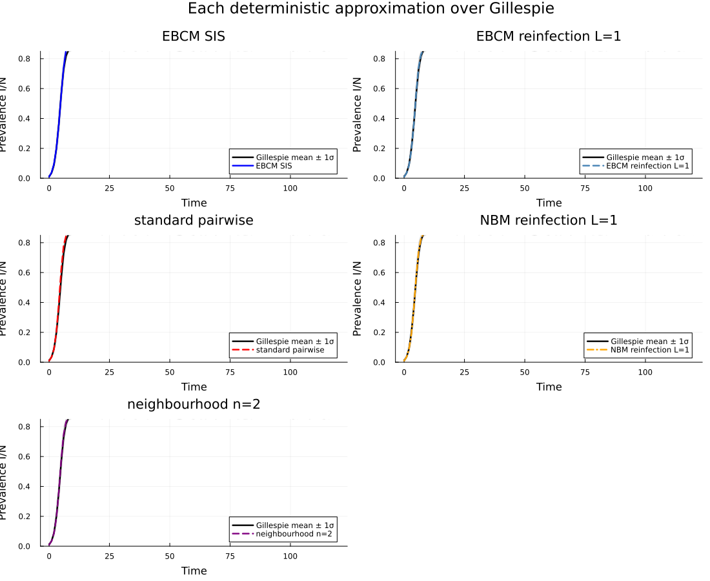

# Cross-Package SIS Comparison: EBCM vs Node-Based vs Stochastic
Simon Frost
2026-05-14

- [Introduction](#introduction)
- [Setup](#setup)
- [Stochastic ground truth (Gillespie
  SSA)](#stochastic-ground-truth-gillespie-ssa)
- [EBCM SIS](#ebcm-sis)
- [EBCM SIS with reinfection counting
  ($L = 1$)](#ebcm-sis-with-reinfection-counting-l--1)
- [Node-based moment closures](#node-based-moment-closures)
  - [Standard pairwise: Keeling triple
    closure](#standard-pairwise-keeling-triple-closure)
  - [Reinfection counting: $L = 1$](#reinfection-counting-l--1)
  - [Motif closure](#motif-closure)
  - [Neighbourhood closure: $n = 2$](#neighbourhood-closure-n--2)
- [Per-method comparison panels](#per-method-comparison-panels)
- [Endpoint summary table](#endpoint-summary-table)
- [Transient diagnostic](#transient-diagnostic)
- [Discussion](#discussion)
- [Reproducing this vignette](#reproducing-this-vignette)

## Introduction

This vignette places EdgeBasedModels.jl’s EBCM alongside all four
node-based moment closures from NodeBasedModels.jl and a Gillespie
stochastic ground truth, on the **same SIS benchmark** as NBM vignette
13.

| \#  | Method                                   | Package         |
|-----|------------------------------------------|-----------------|
| 1   | Gillespie SSA                            | NodeBasedModels |
| 2   | EBCM SIS (Miller)                        | EdgeBasedModels |
| 3   | EBCM edge-stratified reinfection ($L=1$) | EdgeBasedModels |
| 4   | Standard pairwise (Keeling)              | NodeBasedModels |
| 5   | Reinfection counting ($L=1$)             | NodeBasedModels |
| 6   | Motif closure ($m=3$)                    | NodeBasedModels |
| 7   | Neighbourhood ($n=2$)                    | NodeBasedModels |

## Setup

> [!NOTE]
>
> **$R_0=2$ anchor.** For SIS on a $k$-regular configuration-model
> network, $R_0=T(k-1)$ with $T=\beta/(\beta+\gamma)$. We use $k=4$,
> $\gamma=0.25$, $T=2/3$, hence $\beta=0.5$, with 1% initial infection.

``` julia
ENV["GKSwstype"] = "100"  # offscreen GR output for reproducible Quarto renders
using EdgeBasedModels
import NodeBasedModels as NBM
using Graphs
using OrdinaryDiffEq
using Plots
using Random
using StableRNGs
using Statistics
using Printf
using Markdown
```

``` julia
# Benchmark parameters — matched by the R₀=2 invariant
N        = 500
k        = 4
γ_val    = 0.25
R0_target = 2.0
κ_excess = k - 1
T_val    = R0_target / κ_excess
β_val    = T_val * γ_val / (1 - T_val)
ε_val    = 0.01  # exception to canonical ε = 0.001: NBM pairwise reinfection-counting closure becomes numerically unstable at lower seed fractions in this configuration.
tmax     = 120.0
ensemble = 48
save_dt  = 1.0

tgrid            = collect(0.0:save_dt:tmax)
initial_infected = collect(1:round(Int, ε_val * N))

# Degenerate PGF for a k-regular network: ψ(z) = z^k
regular_pgf(n::Int) = polynomial_pgf(vcat(zeros(n), [1.0]))

# Under the explicit-ρ convention, `seed_fraction` directly sets the
# initial node prevalence: ρ = ε_val, with θ(0) = 1, S(0) = (1-ρ)·ψ(1).
node_seed = ε_val
```

    0.01

## Stochastic ground truth (Gillespie SSA)

Host graph and ensemble seeds are identical to NBM vignette 13.

``` julia
rng_host = StableRNG(20240301)
g        = random_regular_graph(N, k; rng = rng_host)
net      = NBM.GraphNetwork(g)

n_triangles = sum(triangles(g)) ÷ 3
n_p3_count  = sum((length(neighbors(g, v)) *
                   (length(neighbors(g, v)) - 1)) ÷ 2
                  for v in 1:nv(g)) - 3 * n_triangles

@printf("Host graph: N=%d, k=%d, triangles=%d, P₃=%d\n",
        N, k, n_triangles, n_p3_count)
```

    Host graph: N=500, k=4, triangles=3, P₃=2991

``` julia
run_prev = zeros(ensemble, length(tgrid))
for r in 1:ensemble
    res = NBM.gillespie_sis(net;
                            infection_rate   = β_val,
                            recovery_rate    = γ_val,
                            initial_infected = initial_infected,
                            tmax             = tmax,
                            seed             = 20240301 + r)
    for (i, t) in enumerate(tgrid)
        run_prev[r, i] = count(res(t)) / N
    end
end

gill_prev = vec(mean(run_prev; dims = 1))
gill_sd   = vec(std(run_prev;  dims = 1))
@printf("Gillespie mean at t=%.1f: %.5f ± %.5f (1σ, n=%d)\n",
        tmax, gill_prev[end], gill_sd[end], ensemble)
```

    Gillespie mean at t=120.0: 0.86725 ± 0.01739 (1σ, n=48)

## EBCM SIS

The ODE for SIS on a $k$-regular network ($\psi(z) = z^k$) is
$\dot{\theta} = -\beta\phi_I + \gamma(1-\theta)$, $S = \psi(\theta)$,
$I = 1-S$, where $\phi_I = \theta - \psi'(\theta)/\psi'(1)$.

``` julia
ebcm_sis = build_sis(regular_pgf(k), β_val, γ_val)

ic_sis = default_initial_conditions(ebcm_sis; seed_fraction = node_seed)
sol_sis = solve_epidemic(ebcm_sis;
                          tspan  = (0.0, tmax),
                          init   = ic_sis,
                          saveat = save_dt,
                          reltol = 1e-8,
                          abstol = 1e-10)

I_sis = compartment(ebcm_sis, sol_sis, :I)
@printf("EBCM SIS endpoint I/N = %.5f\n", I_sis[end])
```

    EBCM SIS endpoint I/N = 0.98232

## EBCM SIS with reinfection counting ($L = 1$)

`build_sis_reinfection` tracks infection-count node strata
$S_0,\dots,S_L$ and $I_1,\dots,I_L$ **and** separate edge densities such
as `edge_S_0_I_1` and `edge_S_1_I_1`. Infection of each susceptible
stratum is driven by its incident history-stratified infectious edges,
so the aggregate $I(t)=\sum_p I_p(t)$ is no longer constrained to
overlay the scalar EBCM trajectory.

``` julia
L_reinf = 1
ebcm_reinf = build_sis_reinfection(regular_pgf(k), β_val, γ_val, L_reinf)
ic_reinf = default_initial_conditions(ebcm_reinf; seed_fraction = node_seed)
sol_reinf = solve_epidemic(ebcm_reinf;
                           tspan  = (0.0, tmax),
                           init   = ic_reinf,
                           saveat = save_dt,
                           reltol = 1e-8,
                           abstol = 1e-10)

I_reinf = compartment(ebcm_reinf, sol_reinf, :I)
@printf("EBCM + reinfection L=%d endpoint I/N = %.5f\n",
        L_reinf, I_reinf[end])
```

    EBCM + reinfection L=1 endpoint I/N = 0.86957

## Node-based moment closures

These calls mirror NBM vignette 13 exactly.

### Standard pairwise: Keeling triple closure

``` julia
sis    = NBM.sis_model(τ = :β)
hom    = NBM.regular_network(k)

psys_pair = NBM.generate_pairwise(sis, hom, NBM.KeelingClosure();
                                  tspan         = (0.0, tmax),
                                  seed_fraction = ε_val)
sol_pair  = NBM.solve_pairwise(psys_pair, Dict(:β => β_val, :γ => γ_val);
                               saveat = save_dt)
I_pair    = sol_pair[psys_pair.singles[:I]]
@printf("Standard pairwise endpoint I/N = %.5f\n", I_pair[end])
```

    Standard pairwise endpoint I/N = 0.86957

### Reinfection counting: $L = 1$

As in the NBM companion vignette, the lifted system uses the same
Keeling closure as the standard pairwise run. Since the homogeneous
regular-network surrogate has $\phi=0$, this is algebraically the
Bernoulli/ordinary pair closure while keeping the comparison
closure-matched.

``` julia
psys_re = NBM.generate_pairwise(NBM.with_reinfection_counting(sis, 1),
                                hom, NBM.KeelingClosure();
                                tspan         = (0.0, tmax),
                                seed_fraction = ε_val)
sol_re  = NBM.solve_pairwise(psys_re, Dict(:β => β_val, :γ => γ_val);
                             saveat = save_dt)
I_re    = NBM.reinfection_totals(psys_re, sol_re)[:I]
@printf("NBM reinfection L=1 endpoint I/N = %.5f\n", I_re[end])
```

    NBM reinfection L=1 endpoint I/N = 0.86957

### Motif closure

The current motif implementation supports $k=3$ but not the $k=4$
regular network required for the feasible $R_0=2$ configuration-model
anchor, so this panel is omitted from the refactored benchmark.

``` julia
I_motif = nothing
```

### Neighbourhood closure: $n = 2$

``` julia
sys_nbr = NBM.generate_neighbourhood(sis, k, 2;
                                     β     = β_val, γ = γ_val,
                                     N     = 1.0,   ε = ε_val,
                                     tspan = (0.0, tmax))
sol_nbr = NBM.solve_neighbourhood(sys_nbr; saveat = save_dt)
I_nbr   = NBM.neighbourhood_compartment(sys_nbr, sol_nbr, :I)
@printf("Neighbourhood n=2 endpoint I/N = %.5f\n", I_nbr[end])
```

    Neighbourhood n=2 endpoint I/N = 0.86945

Verify all deterministic outputs land on the same time grid:

``` julia
@assert length(I_sis)    == length(tgrid)
@assert length(I_reinf)  == length(tgrid)
@assert collect(sol_pair.t)  == tgrid
@assert collect(sol_re.t)    == tgrid
@assert collect(sol_nbr.t)   == tgrid
```

## Per-method comparison panels

``` julia
function comparison_panel(y, title, color, linestyle)
    p = plot(tgrid, gill_prev;
             ribbon = gill_sd,
             fillalpha = 0.18,
             linealpha = 0.5,
             lw = 1.2,
             color = color,
             label = "Gillespie mean ± 1σ",
             xlabel = "Time",
             ylabel = "Prevalence I/N",
             title = title,
             legend = :bottomright,
             ylims = (0.0, 0.85))
    plot!(p, tgrid, y; lw = 2.4, color = color, ls = linestyle,
          label = title)
    return p
end

panels = [
    comparison_panel(I_sis, "EBCM SIS", :blue, :solid),
    comparison_panel(I_reinf, "EBCM reinfection L=1", :steelblue, :dash),
    comparison_panel(I_pair, "standard pairwise", :red, :dash),
    comparison_panel(I_re, "NBM reinfection L=1", :orange, :dashdot),
    comparison_panel(I_nbr, "neighbourhood n=2", :purple, :dash),
]

plot(panels...; layout = (3, 2), size = (1100, 900),
     plot_title = "Each deterministic approximation over Gillespie")
```



## Endpoint summary table

``` julia
ref = gill_prev[end]
rows = [
    ("Gillespie mean",             ref,          0.0),
    ("EBCM SIS (Miller)",          I_sis[end],   I_sis[end]   - ref),
    ("EBCM + reinfection L=1",     I_reinf[end], I_reinf[end] - ref),
    ("Standard pairwise (Keeling)", I_pair[end], I_pair[end]  - ref),
    ("NBM reinfection L=1",        I_re[end],    I_re[end]    - ref),
    ("Neighbourhood n=2",           I_nbr[end],   I_nbr[end]   - ref),
]
lines = String[
    "| Method | Endpoint I/N | Signed deviation |",
    "|---|---:|---:|",
]
for (name, ep, dev) in rows
    push!(lines, @sprintf("| %s | %.5f | %+.5f |", name, ep, dev))
end
display(Markdown.parse(join(lines, "\n")))
```

|                      Method | Endpoint I/N | Signed deviation |
|----------------------------:|-------------:|-----------------:|
|              Gillespie mean |      0.86725 |         +0.00000 |
|           EBCM SIS (Miller) |      0.98232 |         +0.11507 |
|      EBCM + reinfection L=1 |      0.86957 |         +0.00232 |
| Standard pairwise (Keeling) |      0.86957 |         +0.00232 |
|         NBM reinfection L=1 |      0.86957 |         +0.00232 |
|           Neighbourhood n=2 |      0.86945 |         +0.00220 |

The Gillespie 1σ band at $t_{\max}$ is 0.01739. All deterministic
methods that fall within ±1σ of the stochastic mean can be considered
well-calibrated on this benchmark.

## Transient diagnostic

Both reinfection-counting constructions now alter transient aggregate
prevalence. The EBM version does so through edge densities such as
`edge_S_0_I_1`, while the NBM version does so through the full pairwise
moment system. The max-over-time differences show where those
corrections matter; endpoints can still be much closer after the $p=L$
bucket saturates.

``` julia
function max_abs_delta(a, b)
    δ = abs.(a .- b)
    i = argmax(δ)
    return (value = δ[i], time = tgrid[i])
end

transient_rows = [
    ("EBCM SIS vs EBCM edge reinfection L=1",
     max_abs_delta(I_sis, I_reinf)),
    ("NBM pairwise vs NBM reinfection L=1",
     max_abs_delta(I_pair, I_re)),
    ("EBCM SIS vs Gillespie mean",
     max_abs_delta(I_sis, gill_prev)),
    ("NBM reinfection L=1 vs Gillespie mean",
     max_abs_delta(I_re, gill_prev)),
]

lines = String[
    "| Comparison | Max absolute difference | Time of max |",
    "|---|---:|---:|",
]
for (name, d) in transient_rows
    push!(lines, @sprintf("| %s | %.5f | %.1f |", name, d.value, d.time))
end
display(Markdown.parse(join(lines, "\n")))
```

|                            Comparison | Max absolute difference | Time of max |
|--------------------------------------:|------------------------:|------------:|
| EBCM SIS vs EBCM edge reinfection L=1 |                 0.11275 |        97.0 |
|   NBM pairwise vs NBM reinfection L=1 |                 0.04773 |         5.0 |
|            EBCM SIS vs Gillespie mean |                 0.11832 |        69.0 |
| NBM reinfection L=1 vs Gillespie mean |                 0.01460 |         6.0 |

## Discussion

**EBCM accuracy.** The SIR EBCM is exact on configuration-model networks
in the $N \to \infty$ limit, but the scalar SIS builder used here is the
standard one-dimensional EBCM-style closure for a non-monotone
reinfection process. The edge-stratified reinfection model is a richer
closure: it keeps the PGF-derived configuration-model triple factor but
tracks history-stratified edge composition explicitly.

**Why the comparison is non-trivial.** On a finite random $k$-regular
graph ($N = 500$) neither EBCM nor the node-based closures are exact.
Repeated SIS infection and recovery induce local history correlations
along edges; finite cycles and stochastic fluctuations add further
deviations from the scalar edge-independence picture. Pairwise closures
suffer from triple-approximation error, while motif and neighbourhood
methods capture higher-order structure at the cost of larger state
spaces. The endpoint table is therefore only one view; transient
discrepancies are often more informative for this SIS case.

**EBCM vs node-based.** The EBCM is analytically tractable and cheap
(one ODE for SIS). Node-based closures track pair and motif populations
explicitly, making them more flexible for heterogeneous or clustered
networks at the cost of a closure artefact. For the regular
locally-tree-like host here the EBCM is the natural baseline; node-based
methods become preferable when network-level statistics are of direct
scientific interest.

## Reproducing this vignette

- Host graph seed: `StableRNG(20240301)`.
- Gillespie ensemble: 48 runs, seeds `20240302`–`20240349`.
- Initial infected: `collect(1:25)` (5 % of $N = 500$).
- ODE tolerances: `reltol = 1e-8`, `abstol = 1e-10` for the EBM solves
  and the package defaults for `solve_pairwise`, `solve_motif`, and
  `solve_neighbourhood`.
- Parameters identical to NodeBasedModels.jl vignette 13.

``` julia
@printf("Julia %s\n", string(VERSION))
@printf("EdgeBasedModels path: %s\n", pathof(EdgeBasedModels))
@printf("NodeBasedModels path: %s\n", pathof(NBM))
```

    Julia 1.12.5
    EdgeBasedModels path: /Users/sdwfrost/Projects/edgebasedmodels/EdgeBasedModels.jl/src/EdgeBasedModels.jl
    NodeBasedModels path: /Users/sdwfrost/Projects/edgebasedmodels/NodeBasedModels.jl/src/NodeBasedModels.jl
