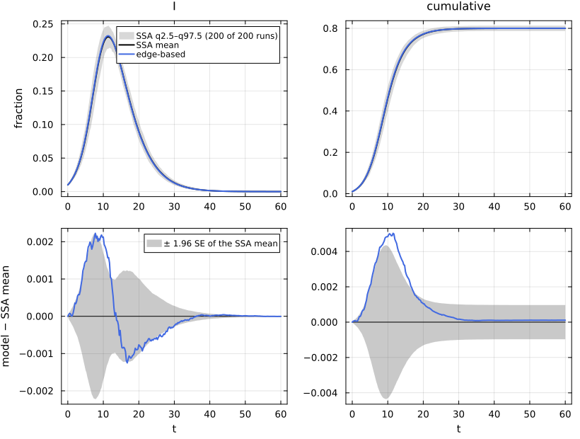
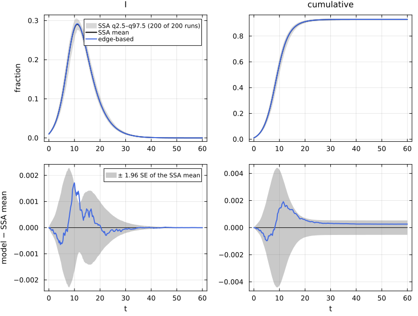

# E01. From a reaction network to an edge-based model


- [The shared first cell](#the-shared-first-cell)
- [The model object and its typing](#the-model-object-and-its-typing)
- [Low level and factory](#low-level-and-factory)
- [The mathematics of the lift](#the-mathematics-of-the-lift)
- [Compact and expanded forms](#compact-and-expanded-forms)
- [Against simulation: Poisson(5)](#against-simulation-poisson5)
- [Against simulation: 6-regular](#against-simulation-6-regular)
- [Why a comparison of trajectories is
  meaningful](#why-a-comparison-of-trajectories-is-meaningful)
- [References](#references)

This page shows the whole pipeline once, on the simplest model. An SIR
model is written as a reaction network, read into NetworkEpiCore’s model
object (`contact_model`), and lifted to an edge-based compartmental
model (EBCM) with `edge_based` (Volz 2008; Miller 2011; Miller et al.
2012). The factory `build_sir` then builds the same system, and the two
vector fields are checked equal. We print the lifted equations, compare
the expanded form with Miller’s two-equation compact form, and compare
the model with a committed NetworkOutbreaks ensemble on a Poisson(5)
network and on a 6-regular network. The NodeBasedModels page N01 starts
with the same first cell and scenario, and lifts to a pairwise model
instead.

## The shared first cell

The cell below is the same, line for line, as the first cell of
NodeBasedModels’ N01, apart from the lines of the `# --- EBM vignette`
section and the lines marked `# back end` (N01 has one more such line,
which checks that the summaries it uses are committed). The contact
`τ, S + I --> 2I` has a **per-contact** rate τ: a susceptible node with
one infectious neighbour is infected at rate τ along that edge. The
scenario `:sir_pois5` fixes τ = 1/6, γ = 1/4, a Poisson(5) configuration
network and 1% of the nodes seeded in I.

``` julia
include(joinpath(@__DIR__, "..", "_shared", "setup.jl"))
using NetworkEpiCore, NetworkOutbreaks, Catalyst, Plots
sir = @reaction_network sir begin
    @parameters τ γ
    τ, S + I --> 2I        # contact: per-contact (per-edge) rate τ; S converted, I unchanged
    γ, I --> R             # node-local transition
end
model = contact_model(sir)          # prints the typing report (B.1)
sc    = scenario(:sir_pois5)        # Poisson(5), τ = 1/6, γ = 1/4, 1% seeds in I, t ∈ [0, 60]
@assert isequivalent(model, sc.model)
ref   = scenario_summary(sc)        # committed NO ensemble: N = 10⁴, 200 runs, a fresh G(N, p) graph per run
# --- EBM vignette ---------------------------------------------------------------
using EdgeBasedModels
sys   = edge_based(model, sc.network)                      # low level
sysF  = build_sir(PoissonDegree(5), :τ, :γ)                # factory (demonstration only; see A.6)
@assert vector_fields_equal(symbolic_ode(sys), symbolic_ode(sysF))
lift_contributions(model, sc.network)                      # table: per-reaction θ̇, φ̇, pop′ terms
# --- both -------------------------------------------------------------------------
sol = solve_epidemic(sys, sc)                              # p, initial, tspan, saveat all from the scenario
det = model_curves(sys, sol; t = sc.tgrid, label = "edge-based")   # back end
comparisonplot(ref, det; observables = [:I, :cumulative])  # top: spread ribbon + mean + curve; bottom: residual ± 1.96 SE
compare(ref, det)                                          # D∞, z∞, ΔR∞ (95% CI), Δpeak, Δt_peak
```

    ComparisonTable :sir_pois5  (scenario 34c89792; conditioned mean of 200 runs)
      curve       observable        D∞     t(D∞)       SE∞        z∞       ΔR∞  95% CI                 Δpeak   Δt_peak  coverage
      edge-based  S            0.00503     11.50   0.00222      2.61   0.00011  [-0.00086,  0.00108]   0.00000      0.00     0.788
      edge-based  I            0.00223      7.75   0.00113      2.59   0.00011  [-0.00086,  0.00108]   0.00157      0.00     0.822
      edge-based  R            0.00387     13.25   0.00168      2.39   0.00011  [-0.00086,  0.00108]   0.00011      0.00     0.784
      edge-based  infectious   0.00223      7.75   0.00113      2.59   0.00011  [-0.00086,  0.00108]   0.00157      0.00     0.822
      edge-based  cumulative   0.00503     11.50   0.00222      2.61   0.00011  [-0.00086,  0.00108]   0.00011      3.50     0.788

The rest of the page takes this cell apart.

## The model object and its typing

`contact_model` classifies each reaction by its stoichiometry.
`S + I --> 2I` has one catalytic substrate, I, so it is a contact
`S + I → I + I` with infector I and entry state I; `I --> R` is a node
transition. The typing report says which back ends accept the model:
every reaction is of a type in the edge-based theory T_EB (no reaction
produces a susceptible node), so `edge_based` is available.

``` julia
model
```

    ContactModel :sir  (source: Catalyst.ReactionSystem; method: stoichiometry; rates: PerContact)
      species       S (Sus)   I   R
      contacts      [1] S + I → I + I    τ    contact     infector I, entry I
      transitions   [2] I → R            γ    progress
      typing        T_EB  ⇒  edge_based ✓  s_anchored ✓  pairwise ✓  individual ✓  pair ✓  stochastic ✓  mass_action ✓
      assumptions   Sus inferred as recipients \ contact products = {S}

The scenario is pure data: model, network, parameters, seeding, time
grid and simulation settings. Its `expected` values (R₀, the
transmissibility T, the growth rate r, the final size) are computed by
NetworkEpiCore when the registry is built, not typed by hand.

``` julia
sc
```

    Scenario :sir_pois5 — SIR on a Poisson(5) configuration network
      model        ContactModel(:sir; 3 species, 1 contact, 1 transition)
      network      ConfigurationNetwork(degrees=PoissonDegree(mean=5))
      params       γ = 0.25, τ = 0.166667
      initial      I 0.01
      time         0.0:0.25:60.0 (241 points)
      observables  S, I, R, infectious, cumulative
      sim          SimConfig(N = 10000, nsims = 200, graphs = :per_run, algorithm = :next_reaction, base_seed = 20260926, condition = MajorOutbreak(0.05), align = NoAlignment())
      backends     edge_based => exact_limit, pairwise_const => exact_limit, pgf_closure => exact_limit
      tags         canonical, ebm, nbm, sir, configuration, pt, n_scaling
      expected     R0 = 2, T = 0.4, closure_constant = 1, excess_degree = 5, final_size = 0.800204, mean_degree = 5, r = 0.416667
      notes        The Poisson isomorphism (EB ≅ MA(5τ, γ + τ) on (S, φ_I), Rempała's quotient) and constant-K pairwise with K = 1. Also run at N = 10³ and 10⁵ (N-scaling).
      hash         34c89792c3f7f8c0e0f9d4b2ce83aaafac299e4c50c06a7a435e42ec746a421f

The typed model is the same object as the scenario’s model
(`isequivalent` compares species, reactions and rates, not names):

``` julia
isequivalent(model, sc.model), isequivalent(model, sir_model())
```

    (true, true)

## Low level and factory

The low-level route is `contact_model` then `edge_based`; the factory
`build_sir` is a one-line wrapper,
`edge_based(sir_model(; τ, γ), ConfigurationNetwork(d))`. The two
systems have the same vector field, and `vector_fields_equal` checks
that symbolically (term by term, after collecting monomials), with
numeric probes only for what the simplifier cannot decide:

``` julia
vector_fields_equal(symbolic_ode(sys), symbolic_ode(sysF))
```

    true

## The mathematics of the lift

For a configuration network with degree probability generating function
(PGF) ψ, the EBCM follows θ, the probability that a random edge into a
test node has not yet transmitted to it, and for every non-susceptible
species X two quantities: φ_X, the probability that the edge has not
transmitted and its partner is in X, and pop_X, the fraction of nodes in
X. The susceptible quantities are closed forms in θ: with the seed
factor q = 1 − ρ (the fraction of nodes that start susceptible),

$$S = q\,\psi(\theta), \qquad \varphi_S = q\,\frac{\psi'(\theta)}{\psi'(1)} .$$

`lift_contributions` lists, reaction by reaction, the terms that each
reaction adds to the time derivatives. The contact `S + I → 2I` uses up
edges at rate τφ_I (so θ̇ = −τφ_I), removes those edges from φ_I, and
creates new φ_I edges from the other ψ″(θ)/ψ′(1) edges of each newly
infected node; the transition `I → R` moves both φ and pop from I to R.

``` julia
lc = lift_contributions(model, sc.network)
```

    LiftContributions :sir on NetworkEpiCore.ConfigurationNetwork(NetworkEpiCore.PoissonDegree(5.0))  (configuration closure)
      coordinates  θ, ξ, φ_I, φ_R, pop_I, pop_R
      seed factors q_S (initially susceptible fraction of S)
      [1] S + I → 2I  (τ)   contact
            θ'      += -φ_I*τ
            φ_I'    += -φ_I*τ
            φ_I'    += 5*q_S*exp(5.0(-1 + θ))*φ_I*ξ*τ
            pop_I'  += 5.0q_S*exp(5.0(-1 + θ))*φ_I*ξ*τ
      [2] I → R  (γ)   progress
            φ_I'    += -φ_I*γ
            φ_R'    += φ_I*γ
            pop_I'  += -pop_I*γ
            pop_R'  += pop_I*γ

The vector field is the sum of these terms. For Poisson(5), ψ(θ) =
e^{5(θ−1)} and ψ″(θ)/ψ′(1) = 5e^{5(θ−1)}:

``` julia
symbolic_ode(sys)
```

    SymbolicODE :edge_based_model_edge_based (5 states)
      dθ/dt = -φ_I(t)*τ
      dφ_I/dt = -φ_I(t)*γ - φ_I(t)*τ + (5//1)*q_S*exp(5.0(-1 + θ(t)))*φ_I(t)*τ
      dφ_R/dt = φ_I(t)*γ
      dpop_I/dt = -pop_I(t)*γ + 5.0q_S*exp(5.0(-1 + θ(t)))*φ_I(t)*τ
      dpop_R/dt = pop_I(t)*γ
      parameters  τ, γ, q_S
      domain      θ ∈ (0.05, 1.0)

The exit factor ξ is dropped from the printed field because no reaction
changes it (SIR has no exit from S), and the cumulative incidence is an
observer of the trajectory, not part of the field. Written out,

$$\dot\theta = -\tau\varphi_I,\qquad
\dot\varphi_I = \tau\varphi_I\,q\,\frac{\psi''(\theta)}{\psi'(1)} - (\tau+\gamma)\varphi_I,\qquad
\dot\varphi_R = \gamma\varphi_I,$$

$$\dot{\mathrm{pop}}_I = \tau\varphi_I\,q\,\psi'(\theta) - \gamma\,\mathrm{pop}_I,\qquad
\dot{\mathrm{pop}}_R = \gamma\,\mathrm{pop}_I .$$

The field of the table and the field of the system are the same object:

``` julia
vector_fields_equal(symbolic_ode(lc), symbolic_ode(sys))
```

    true

Two conservation laws hold along the solution from the scenario’s
initial condition (θ(0) = 1, φ_I(0) = pop_I(0) = ρ): θ = φ_S + φ_I + φ_R
and S + pop_I + pop_R = 1. We check them on the solution of the shared
cell; both hold to the tolerance of the ODE solver:

``` julia
θ  = compartment(sys, sol, :θ)
φS = compartment(sys, sol, :φ_S)
φI = compartment(sys, sol, :φ_I)
φR = compartment(sys, sol, :φ_R)
S  = compartment(sys, sol, :S)
pI = compartment(sys, sol, :pop_I)
pR = compartment(sys, sol, :pop_R)
edge_defect = maximum(abs.(θ .- φS .- φI .- φR))
node_defect = maximum(abs.(S .+ pI .+ pR .- 1))
@printf("max |θ − φ_S − φ_I − φ_R| = %.2e,   max |S + I + R − 1| = %.2e\n", edge_defect, node_defect)
```

    max |θ − φ_S − φ_I − φ_R| = 8.54e-06,   max |S + I + R − 1| = 8.54e-06

## Compact and expanded forms

For an SIR-shaped model (one contact `s + I → 2I`, one transition
`I → R`, seeds in I only) there is a third conserved quantity, τφ_R + γθ
= γ (φ_R grows at γφ_I while θ falls at τφ_I). On the set where all
three hold the expanded system reduces to Miller’s two equations (Miller
2011)

$$\dot\theta = -\tau\theta + \tau\,q\,\frac{\psi'(\theta)}{\psi'(1)} + \gamma(1-\theta),
\qquad
\dot R = \gamma\,(1 - S - R).$$

`form = :compact` builds this system; the factory accepts the same
keyword.

``` julia
sysC  = edge_based(model, sc.network; form = :compact)
sysCF = build_sir(PoissonDegree(5), :τ, :γ; form = :compact)
@assert vector_fields_equal(symbolic_ode(sysC), symbolic_ode(sysCF))
symbolic_ode(sysC)
```

    SymbolicODE :edge_based_model_edge_based_compact (2 states)
      dθ/dt = (1 - θ(t))*γ - θ(t)*τ + q_S*exp(5.0(-1 + θ(t)))*τ
      dpop_R/dt = (1 - pop_R(t) - q_S*exp(5.0(-1 + θ(t))))*γ
      parameters  τ, γ, q_S
      domain      θ ∈ (0.05, 1.0)

The invariant τφ_R + γθ = γ holds along the expanded solution, and the
two forms give the same curves to solver tolerance:

``` julia
W_defect = maximum(abs.(sc.params[:τ] .* φR .+ sc.params[:γ] .* θ .- sc.params[:γ]))
solC = solve_epidemic(sysC, sc)
detC = model_curves(sysC, solC; t = sc.tgrid, label = "edge-based (compact)")
dmax = maximum(maximum(abs.(det[X] .- detC[X])) for X in (:S, :I, :R, :cumulative))
@printf("max |τφ_R + γθ − γ| = %.2e;   max over S, I, R, cumulative of |expanded − compact| = %.2e\n",
        W_defect, dmax)
```

    max |τφ_R + γθ − γ| = 5.55e-17;   max over S, I, R, cumulative of |expanded − compact| = 2.45e-05

That the compact model is exact on this invariant set, and not an
approximation, is a theorem of the NetworkEpi Lean library. It is stated
for every configuration network with ψ(1) = 1 and ψ′(1) ≠ 0, and τ ≠ 0
(Poisson(μ) with μ ≠ 0 is one): a solution of the expanded model from
the design’s initial condition (θ = ξ = 1, φ_I = pop_I = ρ, φ_R = pop_R
= 0, with q = 1 − ρ) stays in the invariant set on its whole time
interval, and its image solves the compact model there:

``` julia
lean_cite("NEP.compact_solution_ic_at")
```

Lean: `NEP.compact_solution_ic_at`

## Against simulation: Poisson(5)

The reference is the committed NetworkOutbreaks ensemble of
`:sir_pois5`, simulated with the next-reaction method on a fresh graph
for every run. For a Poisson law NetworkOutbreaks draws the Erdős–Rényi
graph G(N, 5/(N − 1)), whose degrees are Binomial(N − 1, 5/(N − 1)) and
so Poisson(5) in the limit, rather than an erased configuration-model
graph:

``` julia
reference_note(sc, ref)
```

NetworkOutbreaks reference `:sir_pois5`: N = 10000, 200 runs (a fresh
graph per run), conditioned on MajorOutbreak(0.05); 200 major runs,
P(major) = 1.000 (95% CI 0.981–1.000).

The figure has one column per observable. The top row shows the
pointwise q2.5–q97.5 spread of the individual runs (grey), their mean
and the edge-based curve; the bottom row shows the residual (model minus
ensemble mean) with the ±1.96 SE band of the ensemble mean, the band
inside which a model that is exact in the large-N limit should stay up
to finite-N effects.

``` julia
comparisonplot(ref, det; observables = [:I, :cumulative], legend = :topright)
```



``` julia
cmp = compare(ref, det)
```

    ComparisonTable :sir_pois5  (scenario 34c89792; conditioned mean of 200 runs)
      curve       observable        D∞     t(D∞)       SE∞        z∞       ΔR∞  95% CI                 Δpeak   Δt_peak  coverage
      edge-based  S            0.00503     11.50   0.00222      2.61   0.00011  [-0.00086,  0.00108]   0.00000      0.00     0.788
      edge-based  I            0.00223      7.75   0.00113      2.59   0.00011  [-0.00086,  0.00108]   0.00157      0.00     0.822
      edge-based  R            0.00387     13.25   0.00168      2.39   0.00011  [-0.00086,  0.00108]   0.00011      0.00     0.784
      edge-based  infectious   0.00223      7.75   0.00113      2.59   0.00011  [-0.00086,  0.00108]   0.00157      0.00     0.822
      edge-based  cumulative   0.00503     11.50   0.00222      2.61   0.00011  [-0.00086,  0.00108]   0.00011      3.50     0.788

``` julia
rI = cmp["edge-based", :I]; rC = cmp["edge-based", :cumulative]
@printf("I: D∞ = %.4f (z∞ = %.2f);  final size: model %.4f, ensemble %.4f, ΔR∞ = %+.4f (95%% CI %+.4f to %+.4f)\n",
        rI.D∞, rI.z∞, det[:cumulative][end], det[:cumulative][end] - rC.ΔR∞, rC.ΔR∞, rC.ΔR∞_ci...)
@printf("expected final size from the registry (NetworkEpiCore fixed point): %.4f\n", sc.expected[:final_size])
```

    I: D∞ = 0.0022 (z∞ = 2.59);  final size: model 0.8002, ensemble 0.8001, ΔR∞ = +0.0001 (95% CI -0.0009 to +0.0011)
    expected final size from the registry (NetworkEpiCore fixed point): 0.8002

The largest deviation in prevalence, D∞, is about twice the largest
standard error SE∞ of the 200-run mean (both in the table), and the
final size agrees within its confidence interval. The edge-based model
is the large-N limit of this process; at N = 10⁴ what remains is Monte
Carlo error plus an O(1/N) finite-size effect (E14 shows how the
residual scales with N).

## Against simulation: 6-regular

The same model on a 6-regular network (every node has 6 edges, excess
degree 5, so R₀ is again T·κ_ex = 0.4 × 5 = 2). Only the scenario
changes; the low-level lift and the factory are built again on its
network.

``` julia
sc6   = scenario(:sir_reg6)
@assert isequivalent(model, sc6.model)
ref6  = scenario_summary(sc6)
sys6  = edge_based(model, sc6.network)
sys6F = build_sir(RegularDegree(6), :τ, :γ)
@assert vector_fields_equal(symbolic_ode(sys6), symbolic_ode(sys6F))
symbolic_ode(sys6)
```

    SymbolicODE :edge_based_model_edge_based (5 states)
      dθ/dt = -φ_I(t)*τ
      dφ_I/dt = -φ_I(t)*γ - φ_I(t)*τ + (5//1)*q_S*(θ(t)^4)*φ_I(t)*τ
      dφ_R/dt = φ_I(t)*γ
      dpop_I/dt = -pop_I(t)*γ + 6q_S*(θ(t)^5)*φ_I(t)*τ
      dpop_R/dt = pop_I(t)*γ
      parameters  τ, γ, q_S
      domain      θ ∈ (0.05, 1.0)

For RegularDegree(6), ψ(θ) = θ⁶ and ψ″(θ)/ψ′(1) = 5θ⁴, so the field is
polynomial.

``` julia
reference_note(sc6, ref6)
```

NetworkOutbreaks reference `:sir_reg6`: N = 10000, 200 runs (a fresh
graph per run), conditioned on MajorOutbreak(0.05); 200 major runs,
P(major) = 1.000 (95% CI 0.981–1.000).

``` julia
sol6 = solve_epidemic(sys6, sc6)
det6 = model_curves(sys6, sol6; t = sc6.tgrid, label = "edge-based")
comparisonplot(ref6, det6; observables = [:I, :cumulative], legend = :topright)
```



``` julia
cmp6 = compare(ref6, det6)
```

    ComparisonTable :sir_reg6  (scenario e5443b54; conditioned mean of 200 runs)
      curve       observable        D∞     t(D∞)       SE∞        z∞       ΔR∞  95% CI                 Δpeak   Δt_peak  coverage
      edge-based  S            0.00190     11.50   0.00225      1.67   0.00026  [-0.00027,  0.00079]   0.00000      0.00     1.000
      edge-based  I            0.00171     10.00   0.00117      2.77   0.00026  [-0.00027,  0.00079]   0.00127     -0.25     0.975
      edge-based  R            0.00113     13.50   0.00165      1.49   0.00026  [-0.00027,  0.00079]   0.00026      0.00     1.000
      edge-based  infectious   0.00171     10.00   0.00117      2.77   0.00026  [-0.00027,  0.00079]   0.00127     -0.25     0.975
      edge-based  cumulative   0.00192     11.50   0.00225      1.67   0.00026  [-0.00027,  0.00079]   0.00026      5.50     1.000

The two networks have the same R₀ = 2 and the same early growth rate,
but different epidemics:

``` julia
peak(d) = (v = d[:I]; i = argmax(v); (v[i], d.t[i]))
rows = [(string("`:", s.id, "`"), basic_reproduction_number(s.model, s.network, s.params),
         early_growth_rate(s.model, s.network, s.params), peak(d)[1], peak(d)[2], d[:cumulative][end],
         c["edge-based", :I].D∞, c["edge-based", :cumulative].ΔR∞)
        for (s, d, c) in ((sc, det, cmp), (sc6, det6, cmp6))]
mdtable(["scenario", "R₀", "r", "peak I", "t(peak)", "R(60)", "D∞(I) vs NO", "ΔR∞ vs NO"], rows)
```

|     scenario |  R₀ |      r | peak I | t(peak) |  R(60) | D∞(I) vs NO | ΔR∞ vs NO |
|-------------:|----:|-------:|-------:|--------:|-------:|------------:|----------:|
| `:sir_pois5` |   2 | 0.4167 | 0.2323 |   11.25 | 0.8002 |    0.002226 | 0.0001105 |
|  `:sir_reg6` |   2 | 0.4167 | 0.2918 |      11 | 0.9295 |    0.001712 | 0.0002613 |

``` julia
@printf("fraction of degree-0 nodes: Poisson(5) %.4f, 6-regular %.4f\n",
        pgf(PoissonDegree(5), 0.0), pgf(RegularDegree(6), 0.0))
```

    fraction of degree-0 nodes: Poisson(5) 0.0067, 6-regular 0.0000

The 6-regular network has the larger and earlier-peaking epidemic,
although R₀ and r are the same: a Poisson(5) network has low-degree
nodes that are rarely reached (and some with no edges at all), while on
the regular network every node has six chances to be infected. E03 takes
this comparison to five degree distributions.

## Why a comparison of trajectories is meaningful

The edge-based model maps its solutions to curves of node fractions (S,
I, R, cumulative), and those curves are what the ensemble estimates.
That a map between two models that commutes with their vector fields (a
semiconjugacy) carries solutions to solutions is the basic fact behind
every “same model, other coordinates” statement on these pages (the
compact form above, the mass-action images of E05, the pairwise image of
E06). No Lean theorem is cited here for the general fact. It is checked
numerically: in NetworkEpiCore’s test set “pushforward along a
trajectory” (`test/suites/morphisms.jl`), S(t) and I(t) of the
edge-based solution pushed forward by Rempała’s map match an
independently integrated mass-action solution, and on this page the
compact solution matches the expanded one (printed above). Its
trajectory form is cited for the particular maps that are used: the
compact form above, and Rempała’s quotient on trajectories:

``` julia
lean_cite("NEP.rempala_general_solution_at")
```

Lean: `NEP.rempala_general_solution_at`

## References

<div id="refs" class="references csl-bib-body hanging-indent">

<div id="ref-miller2011note" class="csl-entry">

Miller, Joel C. 2011. “A Note on a Paper by Erik Volz: SIR Dynamics in
Random Networks.” *Journal of Mathematical Biology* 62 (3): 349–58.
<https://doi.org/10.1007/s00285-010-0337-9>.

</div>

<div id="ref-miller2012edge" class="csl-entry">

Miller, Joel C., Anja C. Slim, and Erik M. Volz. 2012. “Edge-Based
Compartmental Modelling for Infectious Disease Spread.” *Journal of the
Royal Society Interface* 9 (70): 890–906.
<https://doi.org/10.1098/rsif.2011.0403>.

</div>

<div id="ref-volz2008sir" class="csl-entry">

Volz, Erik. 2008. “SIR Dynamics in Random Networks with Heterogeneous
Connectivity.” *Journal of Mathematical Biology* 56 (3): 293–310.
<https://doi.org/10.1007/s00285-007-0116-4>.

</div>

</div>
