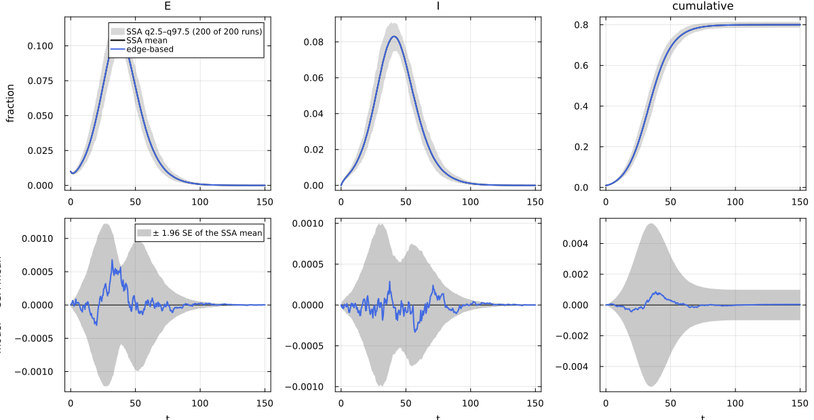
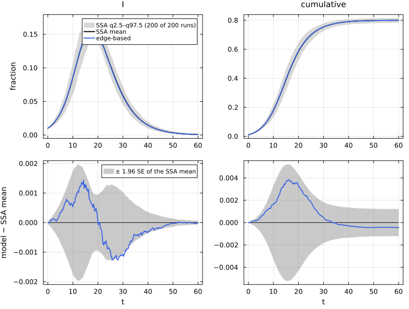

# E02. Writing models: Catalyst, ModelingToolkit, plain Julia


- [SIR three ways](#sir-three-ways)
- [Typing and admissibility](#typing-and-admissibility)
- [SEIR: an entry state that is not an
  infector](#seir-an-entry-state-that-is-not-an-infector)
- [Rate conventions: per-contact τ and mass-action
  β](#rate-conventions-per-contact-τ-and-mass-action-β)
- [Models an edge-based model cannot
  represent](#models-an-edge-based-model-cannot-represent)

Every back end in this family (EdgeBasedModels, NodeBasedModels,
NetworkOutbreaks) takes the same model object, NetworkEpiCore’s
`ContactModel`: a reaction network whose reactions are **contacts**
`s + J → X + J` (a susceptible s meets an infector J along an edge and
becomes X; J is unchanged) and **node transitions** `X → Y` or `X → ∅`.
This page writes the same models in three ways (a Catalyst reaction
network, a ModelingToolkit ODE system, and the direct constructor),
shows what the typing report says about each, explains the two rate
conventions (per-contact τ and mass-action β), and shows the errors for
models that an edge-based model cannot represent.

``` julia
include(joinpath(@__DIR__, "..", "_shared", "setup.jl"))
using NetworkEpiCore, NetworkOutbreaks, Catalyst, Plots
using EdgeBasedModels
using ModelingToolkit
using ModelingToolkit: t_nounits as t, D_nounits as D
sc = scenario(:sir_pois5)            # SIR, Poisson(5), τ = 1/6, γ = 1/4, 1% seeds in I
```

    Scenario :sir_pois5 — SIR on a Poisson(5) configuration network
      model        ContactModel(:sir; 3 species, 1 contact, 1 transition)
      network      ConfigurationNetwork(degrees=PoissonDegree(mean=5))
      params       γ = 0.25, τ = 0.166667
      initial      I 0.01
      time         0.0:0.25:60.0 (241 points)
      observables  S, I, R, infectious, cumulative
      sim          SimConfig(N = 10000, nsims = 200, graphs = :per_run, algorithm = :next_reaction, base_seed = 20260926, condition = MajorOutbreak(0.05), align = NoAlignment())
      backends     edge_based => exact_limit, pairwise_const => exact_limit, pgf_closure => exact_limit
      tags         canonical, ebm, nbm, sir, configuration, pt, n_scaling
      expected     R0 = 2, T = 0.4, closure_constant = 1, excess_degree = 5, final_size = 0.800204, mean_degree = 5, r = 0.416667
      notes        The Poisson isomorphism (EB ≅ MA(5τ, γ + τ) on (S, φ_I), Rempała's quotient) and constant-K pairwise with K = 1. Also run at N = 10³ and 10⁵ (N-scaling).
      hash         34c89792c3f7f8c0e0f9d4b2ce83aaafac299e4c50c06a7a435e42ec746a421f

## SIR three ways

**Catalyst.** Reactions are written with their stoichiometry.
`S + I --> 2I` has one catalytic substrate (I appears on both sides), so
it is a contact with infector I; its rate τ is read as a per-contact
rate (the default, `rates = :per_contact`).

``` julia
sir_rn = @reaction_network sir begin
    @parameters τ γ
    τ, S + I --> 2I
    γ, I --> R
end
m_catalyst = contact_model(sir_rn)
```

    ContactModel :sir  (source: Catalyst.ReactionSystem; method: stoichiometry; rates: PerContact)
      species       S (Sus)   I   R
      contacts      [1] S + I → I + I    τ    contact     infector I, entry I
      transitions   [2] I → R            γ    progress
      typing        T_EB  ⇒  edge_based ✓  s_anchored ✓  pairwise ✓  individual ✓  pair ✓  stochastic ✓  mass_action ✓
      assumptions   Sus inferred as recipients \ contact products = {S}

**ModelingToolkit.** An ODE system is read by *flux pairing*: every term
τ·S·I or γ·I lost by one equation and gained by another becomes a
reaction. The ODE fixes one reaction network compatible with it, not a
unique one, and the report lists every pairing decision.

``` julia
@parameters τ γ
@variables S(t) I(t) R(t)
@named sir_ode = System([D(S) ~ -τ * S * I,
                         D(I) ~ τ * S * I - γ * I,
                         D(R) ~ γ * I], t)
m_mtk = contact_model(sir_ode)
```

    ContactModel :sir_ode  (source: ModelingToolkit.System; method: flux_pairing; rates: PerContact)
      species       S (Sus)   I   R
      contacts      [1] S + I → I + I    τ    contact     infector I, entry I
      transitions   [2] I → R            γ    progress
      typing        T_EB  ⇒  edge_based ✓  s_anchored ✓  pairwise ✓  individual ✓  pair ✓  stochastic ✓  mass_action ✓
      assumptions   flux pairing: the ODE fixes one network compatible with it, not a unique one (F3); Catalyst is the canonical front end
                    τ*S*I leaves D(S) and enters D(I); I is gained, so I is the infector: contact S + I → I + I at τ
                    γ*I leaves D(I) and enters D(R): transition I → R at γ
                    Sus inferred as recipients \ contact products = {S}

**Plain Julia.** The direct constructor takes the contacts and
transitions; rates are numbers, parameter names (Symbols) or arithmetic
expressions over them.

``` julia
m_direct = ContactModel(:sir; contacts    = [Contact(:S, :I, :I, :τ)],
                              transitions = [NodeTransition(:I, :R, :γ)])
```

    ContactModel :sir  (source: ContactModel constructor; method: explicit; rates: PerContact)
      species       S (Sus)   I   R
      contacts      [1] S + I → I + I    τ    contact     infector I, entry I
      transitions   [2] I → R            γ    progress
      typing        T_EB  ⇒  edge_based ✓  s_anchored ✓  pairwise ✓  individual ✓  pair ✓  stochastic ✓  mass_action ✓
      assumptions   Sus inferred as recipients \ contact products = {S}

All three are the same model as the canned `sir_model()` and as the
scenario’s model (`isequivalent` compares species, reactions and rates,
not names or provenance):

``` julia
isequivalent(m_catalyst, m_mtk, m_direct, sir_model(), sc.model)
```

    true

Each lifts to the same edge-based model, which is also what the factory
builds. We check the three low-level lifts against the factory
`build_sir`:

``` julia
sysF = build_sir(PoissonDegree(5), :τ, :γ)
[vector_fields_equal(symbolic_ode(edge_based(m, sc.network)), symbolic_ode(sysF))
 for m in (m_catalyst, m_mtk, m_direct)]
```

    3-element Vector{Bool}:
     1
     1
     1

## Typing and admissibility

The typing gives every reaction one of the transition types of the
network theory T_net. SIR has a `contact` (S becomes I) and a `progress`
(a non-susceptible node moves on). The edge-based theory T_EB is the set
{contact, exit, progress, remove}: no reaction may produce a susceptible
node.

``` julia
typing(m_direct)
```

    Typing over T_EB: S_I_to_I => contact, I_to_R => progress

`admissibility` says which back ends accept the model on a given
network, before any system is built:

``` julia
admissibility(m_direct, sc.network)
```

    AdmissibilityReport: edge_based ✓  s_anchored ✓  pairwise ✓  individual ✓  pair ✓  stochastic ✓  mass_action ✓

## SEIR: an entry state that is not an infector

In SEIR the contact `S + I → E + I` produces E, which is not infectious;
E is the **entry state** and the default seeding rule puts the initial
infections there (scenario `:seir_pois5` seeds 1% of the nodes in E).

``` julia
seir_rn = @reaction_network seir begin
    @parameters τ σ γ
    τ, S + I --> E + I
    σ, E --> I
    γ, I --> R
end
m_seir = contact_model(seir_rn)
```

    ContactModel :seir  (source: Catalyst.ReactionSystem; method: stoichiometry; rates: PerContact)
      species       S (Sus)   E   I   R
      contacts      [1] S + I → E + I    τ    contact     infector I, entry E
      transitions   [2] E → I            σ    progress
                    [3] I → R            γ    progress
      typing        T_EB  ⇒  edge_based ✓  s_anchored ✓  pairwise ✓  individual ✓  pair ✓  stochastic ✓  mass_action ✓
      assumptions   Sus inferred as recipients \ contact products = {S}

``` julia
sc_seir = scenario(:seir_pois5)
@assert isequivalent(m_seir, sc_seir.model)
sys_seir  = edge_based(m_seir, sc_seir.network)                   # low level
sys_seirF = build_seir(PoissonDegree(5), :σ, :τ, :γ)              # factory
@assert vector_fields_equal(symbolic_ode(sys_seir), symbolic_ode(sys_seirF))
lift_contributions(m_seir, sc_seir.network)
```

    LiftContributions :seir on NetworkEpiCore.ConfigurationNetwork(NetworkEpiCore.PoissonDegree(5.0))  (configuration closure)
      coordinates  θ, ξ, φ_E, φ_I, φ_R, pop_E, pop_I, pop_R
      seed factors q_S (initially susceptible fraction of S)
      [1] S + I → E + I  (τ)   contact
            θ'      += -φ_I*τ
            φ_I'    += -φ_I*τ
            φ_E'    += 5*q_S*exp(5.0(-1 + θ))*φ_I*ξ*τ
            pop_E'  += 5.0q_S*exp(5.0(-1 + θ))*φ_I*ξ*τ
      [2] E → I  (σ)   progress
            φ_E'    += -φ_E*σ
            φ_I'    += φ_E*σ
            pop_E'  += -pop_E*σ
            pop_I'  += pop_E*σ
      [3] I → R  (γ)   progress
            φ_I'    += -φ_I*γ
            φ_R'    += φ_I*γ
            pop_I'  += -pop_I*γ
            pop_R'  += pop_I*γ

The contact now feeds φ_E and pop_E: an edge whose partner has just been
infected is not yet able to transmit, and E → I moves it to φ_I at rate
σ. The latent period does not change the transmissibility T = τ/(τ + γ)
(a latent node cannot transmit or recover), so R₀ is the same as for
SIR, while the growth rate is smaller:

``` julia
p_seir = sc_seir.params
@printf("SEIR on Poisson(5): R₀ = %.4f, r = %.4f   (SIR on Poisson(5): R₀ = %.4f, r = %.4f)\n",
        basic_reproduction_number(sys_seir; p = p_seir), early_growth_rate(sys_seir; p = p_seir),
        basic_reproduction_number(sc.model, sc.network, sc.params),
        early_growth_rate(sc.model, sc.network, sc.params))
```

    SEIR on Poisson(5): R₀ = 2.0000, r = 0.1140   (SIR on Poisson(5): R₀ = 2.0000, r = 0.4167)

Against the NetworkOutbreaks ensemble of `:seir_pois5`:

``` julia
ref_seir = scenario_summary(sc_seir)
reference_note(sc_seir, ref_seir)
```

NetworkOutbreaks reference `:seir_pois5`: N = 10000, 200 runs (a fresh
graph per run), conditioned on MajorOutbreak(0.05); 200 major runs,
P(major) = 1.000 (95% CI 0.981–1.000).

``` julia
sol_seir = solve_epidemic(sys_seir, sc_seir)
det_seir = model_curves(sys_seir, sol_seir; t = sc_seir.tgrid, label = "edge-based")
comparisonplot(ref_seir, det_seir; observables = [:E, :I, :cumulative])
```



``` julia
compare(ref_seir, det_seir)
```

    ComparisonTable :seir_pois5  (scenario b3d403ab; conditioned mean of 200 runs)
      curve       observable        D∞     t(D∞)       SE∞        z∞       ΔR∞  95% CI                 Δpeak   Δt_peak  coverage
      edge-based  S            0.00086     38.50   0.00271      0.80   0.00003  [-0.00095,  0.00102]   0.00000      0.00     1.000
      edge-based  E            0.00068     32.00   0.00063      1.84   0.00003  [-0.00095,  0.00102]   0.00051      0.00     1.000
      edge-based  I            0.00033     57.00   0.00051      1.10   0.00003  [-0.00095,  0.00102]  -0.00003      0.00     1.000
      edge-based  R            0.00059     44.50   0.00242      0.79   0.00003  [-0.00095,  0.00102]   0.00003      0.00     1.000
      edge-based  infectious   0.00033     57.00   0.00051      1.10   0.00003  [-0.00095,  0.00102]  -0.00003      0.00     1.000
      edge-based  cumulative   0.00086     38.50   0.00271      0.80   0.00003  [-0.00095,  0.00102]   0.00003      0.50     1.000

## Rate conventions: per-contact τ and mass-action β

A contact rate can mean two different things.

- **Per contact** (`PerContact`, the default): τ is the rate of
  transmission along one edge. A susceptible node with k_I infectious
  neighbours is infected at rate τ·k_I.
- **Frequency dependent** (`FrequencyDependent`, `rates = :frequency`):
  the rate is the mass-action β of β·S·I on population fractions. On a
  network with mean degree ⟨k⟩ the per-contact rate is τ = β/⟨k⟩.

Every back end converts to τ at lift time with
`per_contact_rates(model, network)`, so the same model can be put on
different networks. A well-mixed population `WellMixed(κ)`, in which
every node has κ fleeting contacts per unit time with uniformly random
partners, has ⟨k⟩ = κ:

``` julia
sirβ_rn = @reaction_network sir_beta begin
    @parameters β γ
    β, S + I --> 2I
    γ, I --> R
end
m_freq = contact_model(sirβ_rn; rates = :frequency)
```

    ContactModel :sir_beta  (source: Catalyst.ReactionSystem; method: stoichiometry; rates: FrequencyDependent)
      species       S (Sus)   I   R
      contacts      [1] S + I → I + I    β    contact     infector I, entry I
      transitions   [2] I → R            γ    progress
      typing        T_EB  ⇒  edge_based ✓  s_anchored ✓  pairwise ✓  individual ✓  pair ✓  stochastic ✓  mass_action ✓
      assumptions   contact rates read as frequency-dependent β of β S I/N on population fractions (rates = :frequency, no population parameter)
                    Sus inferred as recipients \ contact products = {S}

``` julia
per_contact_rates(m_freq, WellMixed(5)), per_contact_rates(m_freq, WellMixed(50))
```

    (Any[:(β / 5.0)], Any[:(β / 50.0)])

The **unit law** of the lift: on `WellMixed(κ)` the edge-based model of
a frequency-dependent model *is* its mass-action ODE, for every κ. The
map S = q e^{κ(θ−1)}, I = pop_I, R = pop_R carries the edge-based field
onto the mass-action field, and `verify` checks the identity Dπ·F = G∘π
symbolically:

``` julia
wm5  = edge_based(m_freq, WellMixed(5))
wm50 = edge_based(m_freq, WellMixed(50))
img5, img50 = mass_action(wm5; form = :exact), mass_action(wm50; form = :exact)
verify(img5.morphism), verify(img50.morphism)
```

    (VerificationResult(ok = true, method = :symbolic, residual = 0.0), VerificationResult(ok = true, method = :symbolic, residual = 0.0))

``` julia
img5.ode
```

    SymbolicODE :sir_beta_mass_action_mass_action (3 states)
      dS/dt = -I(t)*S(t)*β
      dI/dt = -I(t)*γ + I(t)*S(t)*β
      dR/dt = I(t)*γ
      parameters  β, γ

The target is β·S·I, γ·I for both values of κ, so the two lifts give the
same curves:

``` julia
sc_wm = scenario(:sir_wm5)          # WellMixed(5), per-contact τ = 1/10 (β = κτ = 1/2), γ = 1/4
pβ = Dict(:β => 0.5, :γ => 0.25)
solve_wm(sys) = solve_epidemic(sys; p = pβ, initial = sc_wm.initial, tspan = sc_wm.tspan,
                               saveat = sc_wm.tgrid)
c5  = model_curves(wm5,  solve_wm(wm5);  t = sc_wm.tgrid, label = "edge-based, WellMixed(5)")
c50 = model_curves(wm50, solve_wm(wm50); t = sc_wm.tgrid, label = "edge-based, WellMixed(50)")
@printf("max_t |I_κ=5 − I_κ=50| = %.2e,  final size %.4f and %.4f\n",
        maximum(abs.(c5[:I] .- c50[:I])), c5[:cumulative][end], c50[:cumulative][end])
```

    max_t |I_κ=5 − I_κ=50| = 6.32e-08,  final size 0.7997 and 0.7997

The scenario `:sir_wm5` writes the same model per contact (τ = 1/10 on κ
= 5), and the NetworkOutbreaks reference for it is the exact count-level
sampler of a well-mixed population (`MassActionSSA`), not a network
simulation:

``` julia
@assert isequivalent(sc_wm.model, sir_model())
ref_wm = scenario_summary(sc_wm)
println("sampler: ", ref_wm.provenance["algorithm"])
reference_note(sc_wm, ref_wm)
```

    sampler: MassActionSSA

NetworkOutbreaks reference `:sir_wm5`: N = 10000, 200 runs (a fresh
graph per run), conditioned on MajorOutbreak(0.05); 200 major runs,
P(major) = 1.000 (95% CI 0.981–1.000).

``` julia
sys_wm = edge_based(sc_wm.model, sc_wm.network)
det_wm = model_curves(sys_wm, solve_epidemic(sys_wm, sc_wm); t = sc_wm.tgrid, label = "edge-based")
@printf("per-contact scenario model vs frequency-dependent β = 1/2: max_t |ΔI| = %.2e\n",
        maximum(abs.(det_wm[:I] .- c5[:I])))
comparisonplot(ref_wm, det_wm; observables = [:I, :cumulative])
```

    per-contact scenario model vs frequency-dependent β = 1/2: max_t |ΔI| = 5.55e-16



``` julia
compare(ref_wm, det_wm)
```

    ComparisonTable :sir_wm5  (scenario 6e8fb963; conditioned mean of 200 runs)
      curve       observable        D∞     t(D∞)       SE∞        z∞       ΔR∞  95% CI                 Δpeak   Δt_peak  coverage
      edge-based  S            0.00384     16.25   0.00267      1.56  -0.00044  [-0.00165,  0.00077]   0.00000      0.00     1.000
      edge-based  I            0.00144     14.25   0.00101      2.22  -0.00044  [-0.00165,  0.00077]   0.00061      0.00     0.929
      edge-based  R            0.00325     20.00   0.00231      1.56  -0.00044  [-0.00165,  0.00077]  -0.00042      0.00     1.000
      edge-based  infectious   0.00144     14.25   0.00101      2.22  -0.00044  [-0.00165,  0.00077]   0.00061      0.00     0.929
      edge-based  cumulative   0.00384     16.25   0.00267      1.57  -0.00044  [-0.00165,  0.00077]  -0.00044      0.00     1.000

The same β means a different τ, and so a different epidemic, on a
network. With β = 1/2 on Poisson(5), τ = β/5 = 1/10 and R₀ falls from 2
(well mixed) to T·κ_ex:

``` julia
@printf("β = 1/2, γ = 1/4:  R₀ on WellMixed(5) = %.4f,  on Poisson(5) = %.4f\n",
        basic_reproduction_number(m_freq, WellMixed(5), pβ),
        basic_reproduction_number(m_freq, ConfigurationNetwork(PoissonDegree(5)), pβ))
```

    β = 1/2, γ = 1/4:  R₀ on WellMixed(5) = 2.0000,  on Poisson(5) = 1.4286

The canonical scenarios therefore fix the per-contact τ (τ = 1/6 on
networks with excess degree 5, so R₀ = τ/(τ + γ)·5 = 2), and quote β
only for the well-mixed hub `:sir_wm5`.

## Models an edge-based model cannot represent

The edge-based model is exact only when no reaction produces a
susceptible node, so it is a *partial* lift. Models outside T_EB are
still valid `ContactModel`s, and other back ends accept them;
`edge_based` refuses them with an error that names the reaction, the
reason and the back ends that do accept the model.

**SIS** (scenario `:sis_reg3`): recovery `I → S` returns a node to the
susceptible class, which breaks the edge-based construction (an edge
that has transmitted is used up for good).

``` julia
sc_sis = scenario(:sis_reg3)
typing(sc_sis.model)
```

    Typing over T_net: S_I_to_I => contact, I_to_S => resus
      resus: I_to_S produces the susceptible species S

``` julia
admissibility(sc_sis.model, sc_sis.network)
```

    AdmissibilityReport: edge_based ✗  s_anchored ✗  pairwise ✓  individual ✓  pair ✓  stochastic ✓  mass_action ✓
      resus: I_to_S produces the susceptible species S

``` julia
err_text(f) = try f(); "no error" catch e; sprint(showerror, e) end
println(err_text(() -> edge_based(sc_sis.model, sc_sis.network)))
```

    AdmissibilityError: edge_based(:sis, ConfigurationNetwork(RegularDegree(3))):
      `γ, I --> S` (type resus: node → sus) produces the susceptible species S.
      The edge-based model is exact only when no reaction produces a susceptible class
      (Miller, Slim & Volz 2012, Part I). Back ends that accept this model: node_based
      (pairwise, individual, pair, motif, neighbourhood), simulate, mass_action.
      Try: NodeBasedModels.node_based(model, net; closure = KeelingClosure()).

E13 treats SIS and SIRS with the pairwise approximations that do accept
them.

**An infector that changes state on transmission.** `S + I --> E + R`
has no catalytic substrate: the infector is used up by the contact. That
is not a network contact (an edge joins two nodes that both persist),
and the Catalyst front end refuses it with the split that is a contact:

``` julia
bad_contact = @reaction_network begin
    τ, S + I --> E + R
end
println(err_text(() -> contact_model(bad_contact)))
```

    ArgumentError: `τ, S + I --> E + R`: the infector changes state on transmission; a network contact must leave the infector unchanged. Split it into `τ, S + I --> E + I` and a transition `I --> R`.

**Births.** A network model has a fixed set of nodes, so a reaction that
creates a node has no network meaning, in either front end:

``` julia
births_rn = @reaction_network begin
    μ, 0 --> S
    τ, S + I --> 2I
    γ, I --> R
end
println(err_text(() -> contact_model(births_rn)))
```

    ArgumentError: `μ, ∅ --> S`: births change the node set; use Catalyst's own ODE for mass action.

``` julia
@parameters μ
@named births_ode = System([D(S) ~ μ - τ * S * I,
                            D(I) ~ τ * S * I - γ * I,
                            D(R) ~ γ * I], t)
println(err_text(() -> contact_model(births_ode)))
```

    ArgumentError: contact_model(:births_ode): the term `μ` of D(S) involves no unknown: births change the node set; use the ODE itself for mass action (a network model has a fixed set of nodes)
