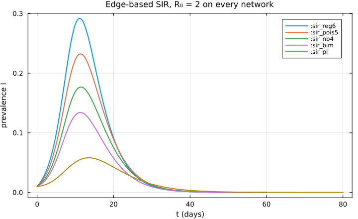
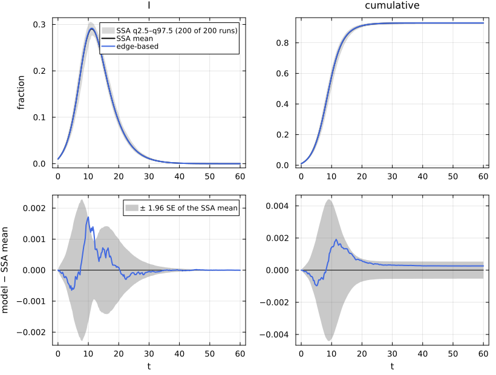
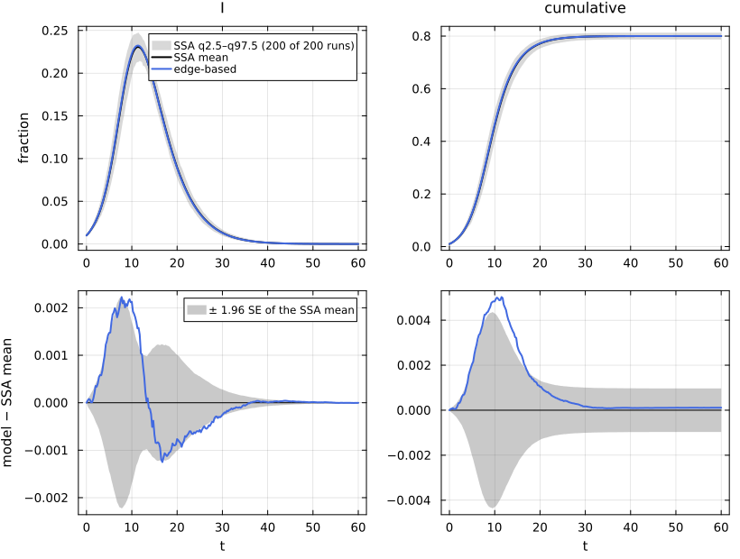
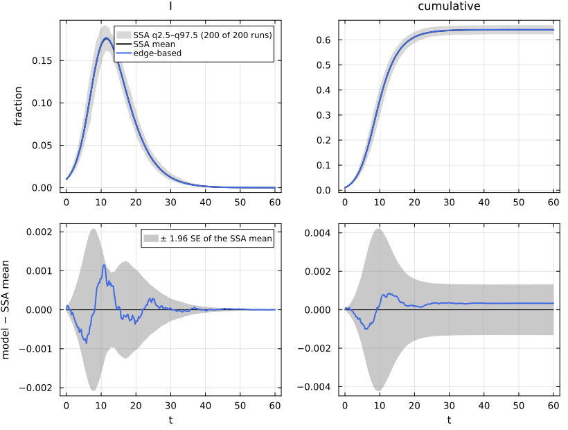
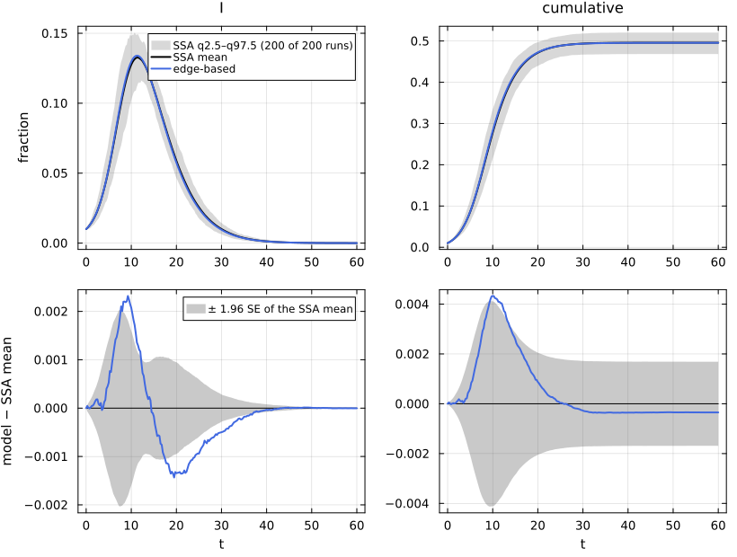
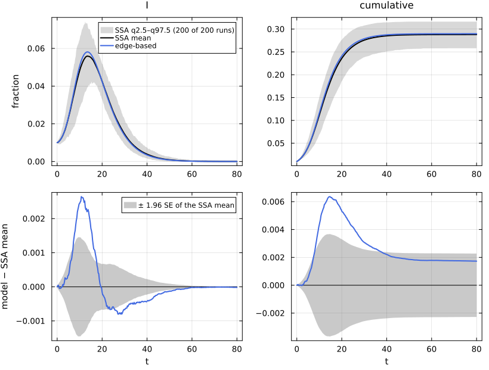
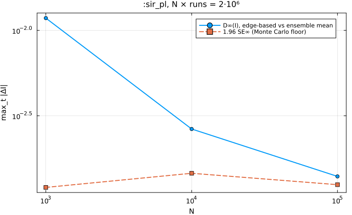

# E03. Degree heterogeneity: same R₀, different epidemics


- [Five networks with R₀ = 2](#five-networks-with-r₀--2)
- [Low level and factory, five times](#low-level-and-factory-five-times)
- [The five epidemics](#the-five-epidemics)
- [Nominal and realised graphs](#nominal-and-realised-graphs)
- [Against simulation](#against-simulation)
- [N-scaling on the power-law
  network](#n-scaling-on-the-power-law-network)
- [References](#references)

R₀ on a configuration network depends on the degree distribution only
through the mean excess degree κ_ex = ⟨k(k−1)⟩/⟨k⟩: for SIR with
per-contact rate τ and recovery rate γ, R₀ = T·κ_ex with T = τ/(τ + γ).
The epidemic itself depends on the whole distribution, through its
probability generating function (PGF) ψ. This page lifts one SIR model
onto five networks that share R₀ = 2 and compares each lift with a
NetworkOutbreaks ensemble. Four of them also share κ_ex = 5, τ = 1/6 and
hence the growth rate r = τ(κ_ex − 1) − γ; the heavy-tailed power law
has κ_ex ≈ 8.66, with τ calibrated to keep R₀ = 2 (Miller et al. 2012).
The formula R₀ = T·κ_ex is from Newman (2002), “Spread of epidemic
disease on networks”, Phys. Rev. E 66, 016128.

``` julia
include(joinpath(@__DIR__, "..", "_shared", "setup.jl"))
using NetworkEpiCore, NetworkOutbreaks, Catalyst, Plots
using EdgeBasedModels
sir = @reaction_network sir begin
    @parameters τ γ
    τ, S + I --> 2I
    γ, I --> R
end
model = contact_model(sir)
ids = [:sir_reg6, :sir_pois5, :sir_nb4, :sir_bim, :sir_pl]
scs = Dict(id => scenario(id) for id in ids)
@assert all(isequivalent(model, scs[id].model) for id in ids)
mdtable(["scenario", "title"], [(string("`:", id, "`"), scs[id].title) for id in ids])
```

| scenario | title |
|---:|---:|
| `:sir_reg6` | SIR on a 6-regular configuration network |
| `:sir_pois5` | SIR on a Poisson(5) configuration network |
| `:sir_nb4` | SIR on a negative binomial (mean 4, variance 8) configuration network |
| `:sir_bim` | SIR on a bimodal {2, 10} configuration network |
| `:sir_pl` | SIR on a truncated power-law (α = 2.5, k = 2…60) configuration network |

## Five networks with R₀ = 2

The five degree laws are 6-regular, Poisson(5), negative binomial with
mean 4 and variance 8, a bimodal law with degree 2 (probability 5/6) or
10 (probability 1/6), and a power law p_k ∝ k^{−2.5} on 2 ≤ k ≤ 60. All
numbers below are computed by NetworkEpiCore from the descriptors:

``` julia
netrow(id) = (sc = scs[id]; net = sc.network; p = sc.params;
    (string("`:", id, "`"), mean_degree(net), excess_degree(net), pgf(net, 0.0),
     closure_constant(net), is_poisson_type(net) === nothing ? "no" : "yes", p[:τ],
     transmissibility(model, net, p), basic_reproduction_number(model, net, p),
     early_growth_rate(model, net, p), final_size(model, net, p; initial = sc.initial)))
mdtable(["scenario", "⟨k⟩", "κ_ex", "P(k = 0)", "K = ψ″(1)/ψ′(1)²", "Poisson type", "τ", "T", "R₀", "r", "R∞"],
        [netrow(id) for id in ids])
```

| scenario | ⟨k⟩ | κ_ex | P(k = 0) | K = ψ″(1)/ψ′(1)² | Poisson type | τ | T | R₀ | r | R∞ |
|---:|---:|---:|---:|---:|---:|---:|---:|---:|---:|---:|
| `:sir_reg6` | 6 | 5 | 0 | 0.8333 | yes | 0.1667 | 0.4 | 2 | 0.4167 | 0.9295 |
| `:sir_pois5` | 5 | 5 | 0.006738 | 1 | yes | 0.1667 | 0.4 | 2 | 0.4167 | 0.8002 |
| `:sir_nb4` | 4 | 5 | 0.0625 | 1.25 | yes | 0.1667 | 0.4 | 2 | 0.4167 | 0.6408 |
| `:sir_bim` | 3.333 | 5 | 0 | 1.5 | no | 0.1667 | 0.4 | 2 | 0.4167 | 0.4956 |
| `:sir_pl` | 3.985 | 8.663 | 0 | 2.174 | no | 0.07504 | 0.2309 | 2 | 0.325 | 0.2898 |

The final sizes (fraction ever infected, from the fixed point θ∞ = 1 −
T + T q ψ′(θ∞)/ψ′(1), R∞ = 1 − q ψ(θ∞), with q = 0.99 the fraction
initially susceptible) range from 0.93 on the regular network to 0.29 on
the power law, at the same R₀. On a heterogeneous network the
high-degree nodes are reached first and the epidemic burns through them,
while the many low-degree nodes are rarely reached; κ_ex is a property
of the nodes reached along edges, not of a typical node.

## Low level and factory, five times

Each network gets the same two constructions: the low-level lift of the
Catalyst model, and the factory `build_sir` on the scenario’s degree
law. The assertion is the same on every row:

``` julia
function lifts(id)
    sc   = scs[id]
    sys  = edge_based(model, sc.network)                       # low level
    sysF = build_sir(sc.network.degrees, :τ, :γ)               # factory
    @assert vector_fields_equal(symbolic_ode(sys), symbolic_ode(sysF))
    return sys
end
systems = Dict(id => lifts(id) for id in ids)
mdtable(["scenario", "states of the lifted field", "vector fields equal"],
        [(string("`:", id, "`"), join(string.("`", state_names(symbolic_ode(systems[id])), "`"), ", "),
          vector_fields_equal(symbolic_ode(systems[id]), symbolic_ode(build_sir(scs[id].network.degrees, :τ, :γ))))
         for id in ids])
```

|     scenario |          states of the lifted field | vector fields equal |
|-------------:|------------------------------------:|--------------------:|
|  `:sir_reg6` | `θ`, `φ_I`, `φ_R`, `pop_I`, `pop_R` |                true |
| `:sir_pois5` | `θ`, `φ_I`, `φ_R`, `pop_I`, `pop_R` |                true |
|   `:sir_nb4` | `θ`, `φ_I`, `φ_R`, `pop_I`, `pop_R` |                true |
|   `:sir_bim` | `θ`, `φ_I`, `φ_R`, `pop_I`, `pop_R` |                true |
|    `:sir_pl` | `θ`, `φ_I`, `φ_R`, `pop_I`, `pop_R` |                true |

The fields differ only in the closure terms ψ′(θ) and ψ″(θ)/ψ′(1). For
the bimodal law, for example, ψ(θ) = (5θ² + θ¹⁰)/6:

``` julia
symbolic_ode(systems[:sir_bim])
```

    SymbolicODE :edge_based_model_edge_based (5 states)
      dθ/dt = -φ_I(t)*τ
      dφ_I/dt = -φ_I(t)*γ - φ_I(t)*τ + 0.30000000000000004q_S*(1.6666666666666667 + 15.0(θ(t)^8))*φ_I(t)*τ
      dφ_R/dt = φ_I(t)*γ
      dpop_I/dt = -pop_I(t)*γ + q_S*(1.6666666666666667θ(t) + 1.6666666666666665(θ(t)^9))*φ_I(t)*τ
      dpop_R/dt = pop_I(t)*γ
      parameters  τ, q_S, γ
      domain      θ ∈ (0.05, 1.0)

## The five epidemics

``` julia
sols = Dict(id => solve_epidemic(systems[id], scs[id]) for id in ids)
dets = Dict(id => model_curves(systems[id], sols[id]; t = scs[id].tgrid, label = "edge-based") for id in ids)
plt = plot(; xlabel = "t (days)", ylabel = "prevalence I", title = "Edge-based SIR, R₀ = 2 on every network",
           legend = :topright)
for id in ids
    plot!(plt, dets[id].t, dets[id][:I]; label = string(":", id))
end
plt
```



``` julia
function peakrow(id)
    d = dets[id]; v = d[:I]; i = argmax(v)
    (string("`:", id, "`"), v[i], d.t[i], d[:cumulative][end])
end
mdtable(["scenario", "peak I", "t(peak)", "R(t_end)"], [peakrow(id) for id in ids])
```

|     scenario |  peak I | t(peak) | R(t_end) |
|-------------:|--------:|--------:|---------:|
|  `:sir_reg6` |  0.2918 |      11 |   0.9295 |
| `:sir_pois5` |  0.2323 |   11.25 |   0.8002 |
|   `:sir_nb4` |  0.1768 |    11.5 |   0.6408 |
|   `:sir_bim` |   0.134 |   11.25 |   0.4956 |
|    `:sir_pl` | 0.05812 |    13.5 |   0.2898 |

The four networks with κ_ex = 5 grow at the same rate at first but peak
at different heights and times; the power law grows more slowly (r =
0.325 against 0.417) and ends with the smallest epidemic.

## Nominal and realised graphs

NetworkOutbreaks draws a fresh graph for every run, but not by the same
sampler for every law. A 6-regular law gets a uniform random 6-regular
simple graph (`Graphs.random_regular_graph`), and the Poisson law gets
the Erdős–Rényi graph G(N, μ/(N − 1)), whose degrees are Binomial(N − 1,
μ/(N − 1)). Neither sampler has anything to erase. The other three laws
use the erased configuration model: N degrees are drawn iid from the
law, the stubs are paired at random, and self-loops and multi-edges are
erased. The summaries store the realised degree statistics of every run,
so the graphs can be checked against the descriptor:

``` julia
refs = Dict(id => scenario_summary(scs[id]) for id in ids)
using Statistics
function realrow(id)
    r = refs[id].realised; net = scs[id].network
    (string("`:", id, "`"), mean_degree(net), mean(r[:mean_degree]), std(r[:mean_degree]),
     excess_degree(net), mean(r[:excess_degree]), std(r[:excess_degree]),
     mean(r[:erased_fraction]), mean(r[:clustering]))
end
mdtable(["scenario", "⟨k⟩ nominal", "⟨k⟩ realised (mean)", "sd", "κ_ex nominal", "κ_ex realised (mean)", "sd",
         "erased edge fraction", "clustering"], [realrow(id) for id in ids])
```

| scenario | ⟨k⟩ nominal | ⟨k⟩ realised (mean) | sd | κ_ex nominal | κ_ex realised (mean) | sd | erased edge fraction | clustering |
|---:|---:|---:|---:|---:|---:|---:|---:|---:|
| `:sir_reg6` | 6 | 6 | 0 | 5 | 5 | 0 | 0 | 0.000412 |
| `:sir_pois5` | 5 | 5.004 | 0.03404 | 5 | 5.006 | 0.036 | 0 | 0.0005045 |
| `:sir_nb4` | 4 | 3.999 | 0.03034 | 5 | 4.997 | 0.05004 | 0.0004313 | 0.00062 |
| `:sir_bim` | 3.333 | 3.331 | 0.03102 | 5 | 4.993 | 0.05582 | 0.0005057 | 0.000751 |
| `:sir_pl` | 3.985 | 3.977 | 0.048 | 8.663 | 8.596 | 0.3295 | 0.001136 | 0.001823 |

The erased fraction is exactly 0 for `:sir_reg6` and `:sir_pois5`, whose
samplers produce simple graphs directly. For the three
erased-configuration laws at N = 10⁴ it is at most about 0.1% of the
edges, and the clustering is of the order of 10⁻³, so the graphs are
locally tree-like, as the edge-based model assumes. The power-law
network has the largest run-to-run spread of κ_ex (its hubs dominate
⟨k²⟩).

## Against simulation

Each comparison uses the committed ensemble of its scenario (N = 10⁴,
200 runs, a fresh graph per run, conditioned on a major outbreak):

``` julia
Markdown.MD([reference_note(scs[id], refs[id]) for id in ids])
```

NetworkOutbreaks reference `:sir_reg6`: N = 10000, 200 runs (a fresh
graph per run), conditioned on MajorOutbreak(0.05); 200 major runs,
P(major) = 1.000 (95% CI 0.981–1.000).

NetworkOutbreaks reference `:sir_pois5`: N = 10000, 200 runs (a fresh
graph per run), conditioned on MajorOutbreak(0.05); 200 major runs,
P(major) = 1.000 (95% CI 0.981–1.000).

NetworkOutbreaks reference `:sir_nb4`: N = 10000, 200 runs (a fresh
graph per run), conditioned on MajorOutbreak(0.05); 200 major runs,
P(major) = 1.000 (95% CI 0.981–1.000).

NetworkOutbreaks reference `:sir_bim`: N = 10000, 200 runs (a fresh
graph per run), conditioned on MajorOutbreak(0.05); 200 major runs,
P(major) = 1.000 (95% CI 0.981–1.000).

NetworkOutbreaks reference `:sir_pl`: N = 10000, 200 runs (a fresh graph
per run), conditioned on MajorOutbreak(0.05); 200 major runs, P(major) =
1.000 (95% CI 0.981–1.000).

``` julia
comparisonplot(refs[:sir_reg6], dets[:sir_reg6]; observables = [:I, :cumulative])
```



``` julia
comparisonplot(refs[:sir_pois5], dets[:sir_pois5]; observables = [:I, :cumulative])
```



``` julia
comparisonplot(refs[:sir_nb4], dets[:sir_nb4]; observables = [:I, :cumulative])
```



``` julia
comparisonplot(refs[:sir_bim], dets[:sir_bim]; observables = [:I, :cumulative])
```



``` julia
comparisonplot(refs[:sir_pl], dets[:sir_pl]; observables = [:I, :cumulative])
```



The metrics, one row per scenario:

``` julia
cmps = Dict(id => compare(refs[id], dets[id]) for id in ids)
function cmprow(id)
    rI = cmps[id]["edge-based", :I]; rC = cmps[id]["edge-based", :cumulative]
    (string("`:", id, "`"), rI.D∞, rI.SE∞, rI.z∞, rI.Δpeak, rI.Δt_peak, rC.ΔR∞,
     @sprintf("[%.4f, %.4f]", rC.ΔR∞_ci...))
end
mdtable(["scenario", "D∞(I)", "SE∞(I)", "z∞(I)", "Δpeak", "Δt_peak", "ΔR∞", "95% CI of ΔR∞"],
        [cmprow(id) for id in ids])
```

| scenario | D∞(I) | SE∞(I) | z∞(I) | Δpeak | Δt_peak | ΔR∞ | 95% CI of ΔR∞ |
|---:|---:|---:|---:|---:|---:|---:|---:|
| `:sir_reg6` | 0.001712 | 0.001166 | 2.769 | 0.001275 | -0.25 | 0.0002613 | \[-0.0003, 0.0008\] |
| `:sir_pois5` | 0.002226 | 0.001135 | 2.587 | 0.001567 | 0 | 0.0001105 | \[-0.0009, 0.0011\] |
| `:sir_nb4` | 0.00115 | 0.001064 | 1.742 | 0.0007551 | 0 | 0.000338 | \[-0.0010, 0.0017\] |
| `:sir_bim` | 0.002319 | 0.001038 | 3.586 | 0.001356 | 0 | -0.0003484 | \[-0.0020, 0.0013\] |
| `:sir_pl` | 0.002645 | 0.000743 | 3.944 | 0.00222 | 0 | 0.001729 | \[-0.0005, 0.0040\] |

On every network the largest prevalence error is below 0.005 and \|ΔR∞\|
is below 0.005, the tolerances of the `:exact_limit` tests. The largest
z∞, on the power law, is the finite-N effect examined next.

## N-scaling on the power-law network

A representation that is exact in the large-N limit should approach the
ensemble mean as N grows, down to the Monte Carlo floor. `:sir_pl` is
also committed at N = 10³ and N = 10⁵, with N × runs held at 2·10⁶ so
that the standard error of the mean stays roughly constant:

``` julia
nids = [:sir_pl_N1000, :sir_pl, :sir_pl_N100000]
nscs = Dict(id => scenario(id) for id in nids)
nrefs = Dict(id => scenario_summary(nscs[id]) for id in nids)
@assert all(canonical_text(nscs[id].model) == canonical_text(scs[:sir_pl].model) for id in nids)
Markdown.MD([reference_note(nscs[id], nrefs[id]) for id in nids])
```

NetworkOutbreaks reference `:sir_pl_N1000`: N = 1000, 2000 runs (a fresh
graph per run), conditioned on MajorOutbreak(0.05); 1712 major runs,
P(major) = 0.856 (95% CI 0.840–0.871).

NetworkOutbreaks reference `:sir_pl`: N = 10000, 200 runs (a fresh graph
per run), conditioned on MajorOutbreak(0.05); 200 major runs, P(major) =
1.000 (95% CI 0.981–1.000).

NetworkOutbreaks reference `:sir_pl_N100000`: N = 100000, 20 runs (a
fresh graph per run), conditioned on MajorOutbreak(0.05); 20 major runs,
P(major) = 1.000 (95% CI 0.839–1.000).

The deterministic curve does not depend on N, so the same
`dets[:sir_pl]` is compared with all three ensembles:

``` julia
function nrow(id)
    ref = nrefs[id]; c = compare(ref, dets[:sir_pl])
    rI = c["edge-based", :I]; rC = c["edge-based", :cumulative]
    (ref.N, ref.nsims, mean(ref.realised[:excess_degree]), mean(ref.realised[:erased_fraction]),
     rI.D∞, rI.SE∞, rI.z∞, rC.ΔR∞)
end
nrows = [nrow(id) for id in nids]
mdtable(["N", "runs", "κ_ex realised (mean)", "erased edge fraction", "D∞(I)", "SE∞(I)", "z∞(I)", "ΔR∞"], nrows)
```

| N | runs | κ_ex realised (mean) | erased edge fraction | D∞(I) | SE∞(I) | z∞(I) | ΔR∞ |
|---:|---:|---:|---:|---:|---:|---:|---:|
| 1000 | 2000 | 8.185 | 0.01099 | 0.0118 | 0.000614 | 20.49 | 0.0148 |
| 10000 | 200 | 8.596 | 0.001136 | 0.002645 | 0.000743 | 3.944 | 0.001729 |
| 100000 | 20 | 8.645 | 0.0001117 | 0.001396 | 0.000637 | 2.974 | -0.0002687 |

``` julia
Ns = [r[1] for r in nrows]; Ds = [r[5] for r in nrows]; SEs = [r[6] for r in nrows]
plot(Ns, Ds; xscale = :log10, yscale = :log10, marker = :circle, label = "D∞(I), edge-based vs ensemble mean",
     xlabel = "N", ylabel = "max_t |ΔI|", title = ":sir_pl, N × runs = 2·10⁶", legend = :topright)
plot!(Ns, 1.96 .* SEs; marker = :square, linestyle = :dash, label = "1.96 SE∞ (Monte Carlo floor)")
```



At N = 10³ the realised graphs lose about 1% of their edges to erasure
and their mean excess degree falls below the nominal 8.66, so the
ensemble has a smaller epidemic than the limit; D∞ is many standard
errors. The error shrinks with N towards the Monte Carlo floor, which is
what a representation that is exact in the limit does (E06 shows the
constant-closure pairwise model on the same network, which plateaus
instead).

## References

<div id="refs" class="references csl-bib-body hanging-indent">

<div id="ref-miller2012edge" class="csl-entry">

Miller, Joel C., Anja C. Slim, and Erik M. Volz. 2012. “Edge-Based
Compartmental Modelling for Infectious Disease Spread.” *Journal of the
Royal Society Interface* 9 (70): 890–906.
<https://doi.org/10.1098/rsif.2011.0403>.

</div>

</div>
