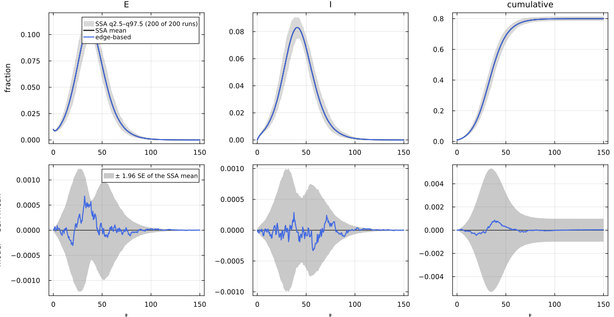
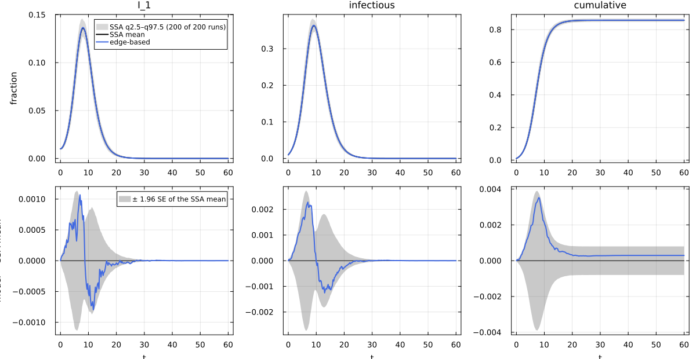
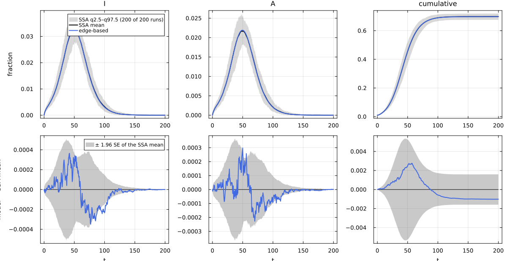
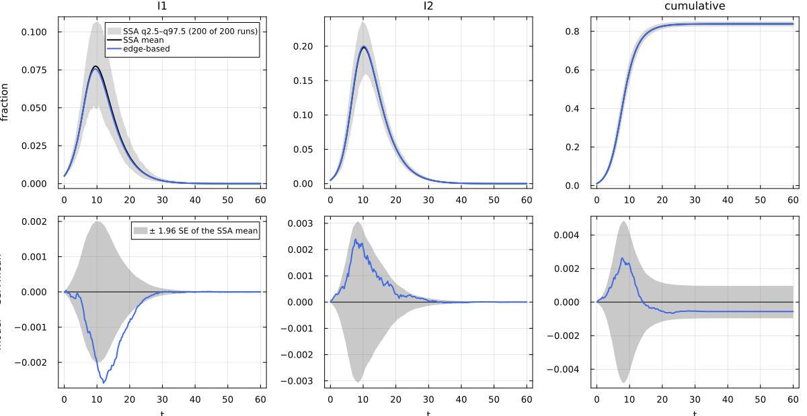
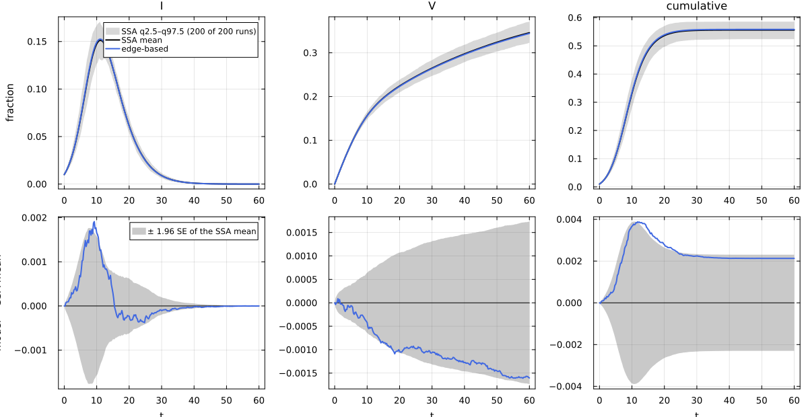

# E04. Natural history: latency, stages, branching, strains, vaccination


- [The transmissibility from an absorption
  formula](#the-transmissibility-from-an-absorption-formula)
- [SEIR: latency](#seir-latency)
- [Erlang stages: the same mean infectious period, a larger
  R₀](#erlang-stages-the-same-mean-infectious-period-a-larger-r₀)
- [SEAIR: branching after latency and two
  infectors](#seair-branching-after-latency-and-two-infectors)
- [Two strains with full
  cross-immunity](#two-strains-with-full-cross-immunity)
- [Vaccination: an exit from the susceptible
  class](#vaccination-an-exit-from-the-susceptible-class)
- [Conservation](#conservation)
- [Summary against simulation](#summary-against-simulation)
- [References](#references)

The edge-based lift works reaction by reaction: every contact,
transition, exit and removal adds its own terms to the lifted field
(Miller et al. 2012; Miller and Volz 2013). So any natural history in
the edge-based theory T_EB (latent periods, staged infectious periods,
branching after infection, several infectors, several strains, exits
from the susceptible class) is lifted exactly, with no special code per
model. This page writes five of them as Catalyst networks (one through
the `erlang_stages` transform), lifts each on Poisson(5), and compares
each with a NetworkOutbreaks ensemble.

Each model is built twice. The low-level route is the Catalyst network,
`contact_model` and `edge_based`. The second route is the canned
constructor: EdgeBasedModels’ factory `build_seir` for SEIR, and
NetworkEpiCore’s canned models (`seair_model`, `twostrain_model`,
`sirv_model`, and `erlang_stages` applied to `sir_model`) lifted by
`edge_based`, for the others, which have no EdgeBasedModels factory.

``` julia
include(joinpath(@__DIR__, "..", "_shared", "setup.jl"))
using NetworkEpiCore, NetworkOutbreaks, Catalyst, Plots
using EdgeBasedModels
using Statistics
net = ConfigurationNetwork(PoissonDegree(5))
err_text(f) = try f(); "no error" catch e; sprint(showerror, e) end
function compare_rows(pairs)       # (scenario, curves) pairs -> one row per scenario
    rows = map(pairs) do (sc, det)
        c = compare(scenario_summary(sc), det)
        obs = :infectious                     # the total prevalence of the infectious stages
        r = c["edge-based", obs]; rc = c["edge-based", :cumulative]
        (string("`:", sc.id, "`"), string(obs), r.D∞, r.SE∞, r.z∞, rc.ΔR∞, @sprintf("[%.4f, %.4f]", rc.ΔR∞_ci...))
    end
    mdtable(["scenario", "observable", "D∞", "SE∞", "z∞", "ΔR∞", "95% CI of ΔR∞"], rows)
end
```

    compare_rows (generic function with 1 method)

## The transmissibility from an absorption formula

For a single entry state E, R₀ on a configuration network is T·κ_ex,
where T is the per-edge transmissibility: the probability that a node
that has just been infected eventually transmits across one given edge
to a susceptible neighbour. In general T is an absorption probability.
Let V be the outflow matrix of the node transitions on the
non-susceptible states (positive exit rates on the diagonal) and B =
diag(Σ_r τ_r) the rate at which transmission along the edge ends the
edge’s usefulness. Then for contact r with infector J_r,

$$T_r(Y) = \tau_r\,\big[(V + B)^{-1} e_Y\big]_{J_r}, \qquad T(Y) = \sum_r T_r(Y),$$

which covers branching, bypasses and cycles. For SIR it is τ/(τ + γ);
`transmissibility` computes it for any model.

## SEIR: latency

``` julia
seir_rn = @reaction_network seir begin
    @parameters τ σ γ
    τ, S + I --> E + I
    σ, E --> I
    γ, I --> R
end
sc_seir   = scenario(:seir_pois5)
m_seir    = contact_model(seir_rn)
@assert isequivalent(m_seir, sc_seir.model)
sys_seir  = edge_based(m_seir, sc_seir.network)             # low level   # back end
sys_seirF = build_seir(PoissonDegree(5), :σ, :τ, :γ)        # factory   # back end
@assert vector_fields_equal(symbolic_ode(sys_seir), symbolic_ode(sys_seirF))
p = sc_seir.params
@printf("SEIR: T = %.4f (τ/(τ + γ) = %.4f), R₀ = %.4f, r = %.4f\n", transmissibility(sys_seir; p),   # back end
        p[:τ] / (p[:τ] + p[:γ]), basic_reproduction_number(sys_seir; p), early_growth_rate(sys_seir; p))   # back end
```

    SEIR: T = 0.4000 (τ/(τ + γ) = 0.4000), R₀ = 2.0000, r = 0.1140

A latent node neither transmits nor recovers, so T and R₀ are those of
SIR (E02 shows the lifted terms); only the growth rate falls, to the
root of (r + σ)(r + τ + γ) = στκ_ex.

``` julia
det_seir = model_curves(sys_seir, solve_epidemic(sys_seir, sc_seir); t = sc_seir.tgrid, label = "edge-based")
ref_seir = scenario_summary(sc_seir)
display(reference_note(sc_seir, ref_seir))
comparisonplot(ref_seir, det_seir; observables = [:E, :I, :cumulative])
```

NetworkOutbreaks reference `:seir_pois5`: N = 10000, 200 runs (a fresh
graph per run), conditioned on MajorOutbreak(0.05); 200 major runs,
P(major) = 1.000 (95% CI 0.981–1.000).



## Erlang stages: the same mean infectious period, a larger R₀

`erlang_stages(model, :I, n)` replaces I by a chain I₁ → … → Iₙ with
every internal rate nγ, so the infectious period is Erlang(n, nγ) with
the same mean 1/γ; every stage transmits at τ and infections enter I₁.
It is a transform of the model (syntax), not of the lifted system:

``` julia
sir_rn = @reaction_network sir begin
    @parameters τ γ
    τ, S + I --> 2I
    γ, I --> R
end
sc_erl = scenario(:sir_erl3_pois5)
m_erl  = erlang_stages(contact_model(sir_rn), :I, 3)          # low level: Catalyst, then the transform
@assert isequivalent(m_erl, sc_erl.model)
m_erl
```

    ContactModel :sir  (source: transform; method: explicit; rates: PerContact)
      species       S (Sus)   I_1   I_2   I_3   R
      contacts      [1] S + I_1 → I_1 + I_1    τ     contact     infector I_1, entry I_1
                    [2] S + I_2 → I_1 + I_2    τ     contact     infector I_2, entry I_1
                    [3] S + I_3 → I_1 + I_3    τ     contact     infector I_3, entry I_1
      transitions   [4] I_1 → I_2              3γ    progress
                    [5] I_2 → I_3              3γ    progress
                    [6] I_3 → R                3γ    progress
      typing        T_EB  ⇒  edge_based ✓  s_anchored ✓  pairwise ✓  individual ✓  pair ✓  stochastic ✓  mass_action ✓
      assumptions   Sus inferred as recipients \ contact products = {S}
                    transform of a catalyst model (method stoichiometry)
                    erlang_stages: I ↦ I_1 → I_2 → I_3; internal rate 3·a_tot with a_tot = γ; exits from I_3 at 3·a_j

``` julia
sys_erl  = edge_based(m_erl, net)
sys_erlC = edge_based(erlang_stages(sir_model(), :I, 3), net)  # canned model, same transform
@assert vector_fields_equal(symbolic_ode(sys_erl), symbolic_ode(sys_erlC))
symbolic_ode(sys_erl)
```

    SymbolicODE :edge_based_model_edge_based (9 states)
      dθ/dt = -φ_I_1(t)*τ - φ_I_2(t)*τ - φ_I_3(t)*τ
      dφ_I_1/dt = -3φ_I_1(t)*γ - φ_I_1(t)*τ + (5//1)*q_S*φ_I_1(t)*exp(5.0(-1 + θ(t)))*τ + (5//1)*q_S*exp(5.0(-1 + θ(t)))*φ_I_2(t)*τ + (5//1)*q_S*exp(5.0(-1 + θ(t)))*φ_I_3(t)*τ
      dφ_I_2/dt = 3φ_I_1(t)*γ - 3φ_I_2(t)*γ - φ_I_2(t)*τ
      dφ_I_3/dt = 3φ_I_2(t)*γ - 3φ_I_3(t)*γ - φ_I_3(t)*τ
      dφ_R/dt = 3φ_I_3(t)*γ
      dpop_I_1/dt = -3pop_I_1(t)*γ + 5.0q_S*φ_I_1(t)*exp(5.0(-1 + θ(t)))*τ + 5.0q_S*exp(5.0(-1 + θ(t)))*φ_I_2(t)*τ + 5.0q_S*exp(5.0(-1 + θ(t)))*φ_I_3(t)*τ
      dpop_I_2/dt = -3pop_I_2(t)*γ + 3pop_I_1(t)*γ
      dpop_I_3/dt = 3pop_I_2(t)*γ - 3pop_I_3(t)*γ
      dpop_R/dt = 3pop_I_3(t)*γ
      parameters  τ, q_S, γ
      domain      θ ∈ (0.05, 1.0)

A less variable infectious period makes transmission along a given edge
more likely (an exponential period often ends early). For n stages the
absorption formula gives T_n = 1 − (nγ/(τ + nγ))ⁿ, which increases
towards 1 − e^{−τ/γ} as n → ∞:

``` julia
pe = Dict(:τ => 1 / 6, :γ => 1 / 4)
erl_row(n) = (mm = n == 1 ? sir_model() : erlang_stages(sir_model(), :I, n);
    Tn = transmissibility(mm, net, pe); (n, Tn, 1 - (n * pe[:γ] / (pe[:τ] + n * pe[:γ]))^n,
    basic_reproduction_number(mm, net, pe), final_size(mm, net, pe; initial = SeedFraction(Symbol(n == 1 ? "I" : "I_1") => 0.01))))
mdtable(["stages n", "T (absorption)", "1 − (nγ/(τ + nγ))ⁿ", "R₀", "R∞ (ρ = 0.01)"],
        [erl_row(n) for n in (1, 2, 3, 5, 10)])
```

| stages n | T (absorption) | 1 − (nγ/(τ + nγ))ⁿ |    R₀ | R∞ (ρ = 0.01) |
|---------:|---------------:|-------------------:|------:|--------------:|
|        1 |            0.4 |                0.4 |     2 |        0.8002 |
|        2 |         0.4375 |             0.4375 | 2.188 |        0.8436 |
|        3 |         0.4523 |             0.4523 | 2.261 |        0.8577 |
|        5 |         0.4652 |             0.4652 | 2.326 |        0.8688 |
|       10 |         0.4755 |             0.4755 | 2.378 |         0.877 |

``` julia
@printf("n → ∞ limit: 1 − exp(−τ/γ) = %.4f, R₀ = %.4f\n", 1 - exp(-pe[:τ] / pe[:γ]), 5 * (1 - exp(-pe[:τ] / pe[:γ])))
```

    n → ∞ limit: 1 − exp(−τ/γ) = 0.4866, R₀ = 2.4329

So at a fixed mean infectious period, the three-stage model has R₀ =
2.26 instead of 2 and a larger epidemic. Against the ensemble, with the
total prevalence `:infectious` = I₁ + I₂ + I₃:

``` julia
det_erl = model_curves(sys_erl, solve_epidemic(sys_erl, sc_erl); t = sc_erl.tgrid, label = "edge-based")
ref_erl = scenario_summary(sc_erl)
display(reference_note(sc_erl, ref_erl))
comparisonplot(ref_erl, det_erl; observables = [:I_1, :infectious, :cumulative])
```

NetworkOutbreaks reference `:sir_erl3_pois5`: N = 10000, 200 runs (a
fresh graph per run), conditioned on MajorOutbreak(0.05); 200 major
runs, P(major) = 1.000 (95% CI 0.981–1.000).



## SEAIR: branching after latency and two infectors

After the latent period a node becomes symptomatic (I, probability p) or
asymptomatic (A, probability 1 − p); both transmit, A at half the rate
of I. The branching rates are expressions in the parameters.

``` julia
seair_rn = @reaction_network seair begin
    @parameters τI τA σ p γ
    τI, S + I --> E + I
    τA, S + A --> E + A
    p * σ, E --> I
    (1 - p) * σ, E --> A
    γ, I --> R
    γ, A --> R
end
sc_seair = scenario(:seair_pois5)
m_seair  = contact_model(seair_rn)
@assert isequivalent(m_seair, sc_seair.model)
sys_seair  = edge_based(m_seair, net)
sys_seairC = edge_based(seair_model(), net)                 # canned model
@assert vector_fields_equal(symbolic_ode(sys_seair), symbolic_ode(sys_seairC))
lift_contributions(m_seair, net)
```

    LiftContributions :seair on NetworkEpiCore.ConfigurationNetwork(NetworkEpiCore.PoissonDegree(5.0))  (configuration closure)
      coordinates  θ, ξ, φ_E, φ_I, φ_A, φ_R, pop_E, pop_I, pop_A, pop_R
      seed factors q_S (initially susceptible fraction of S)
      [1] S + I → E + I  (τI)   contact
            θ'      += -φ_I*τI
            φ_I'    += -φ_I*τI
            φ_E'    += 5*q_S*exp(5.0(-1 + θ))*φ_I*ξ*τI
            pop_E'  += 5.0q_S*exp(5.0(-1 + θ))*φ_I*ξ*τI
      [2] S + A → E + A  (τA)   contact
            θ'      += -φ_A*τA
            φ_A'    += -φ_A*τA
            φ_E'    += 5*q_S*exp(5.0(-1 + θ))*φ_A*ξ*τA
            pop_E'  += 5.0q_S*exp(5.0(-1 + θ))*φ_A*ξ*τA
      [3] E → I  (p*σ)   progress
            φ_E'    += -p*φ_E*σ
            φ_I'    += p*φ_E*σ
            pop_E'  += -p*pop_E*σ
            pop_I'  += p*pop_E*σ
      [4] E → A  ((1 - p)*σ)   progress
            φ_E'    += -(1 - p)*φ_E*σ
            φ_A'    += (1 - p)*φ_E*σ
            pop_E'  += -(1 - p)*pop_E*σ
            pop_A'  += (1 - p)*pop_E*σ
      [5] I → R  (γ)   progress
            φ_I'    += -φ_I*γ
            φ_R'    += φ_I*γ
            pop_I'  += -pop_I*γ
            pop_R'  += pop_I*γ
      [6] A → R  (γ)   progress
            φ_A'    += -φ_A*γ
            φ_R'    += φ_A*γ
            pop_A'  += -pop_A*γ
            pop_R'  += pop_A*γ

Both contacts feed the same entry state E, so the edge hazard is θ̇ =
−τ_Iφ_I − τ_Aφ_A, and the transmissibility is a mixture over the two
infectious routes, which the absorption formula gives contact by
contact:

``` julia
ps = sc_seair.params
Tby = transmissibility(m_seair, net, ps; by_contact = true)
Thand = ps[:p] * ps[:τI] / (ps[:τI] + ps[:γ]) + (1 - ps[:p]) * ps[:τA] / (ps[:τA] + ps[:γ])
@printf("T through I = %.4f, through A = %.4f, total %.4f (pτI/(τI + γ) + (1 − p)τA/(τA + γ) = %.4f); R₀ = %.4f\n",
        Tby[:S_I_to_E], Tby[:S_A_to_E], sum(values(Tby)), Thand, basic_reproduction_number(sys_seair; p = ps))
```

    T through I = 0.2400, through A = 0.1000, total 0.3400 (pτI/(τI + γ) + (1 − p)τA/(τA + γ) = 0.3400); R₀ = 1.7000

``` julia
det_seair = model_curves(sys_seair, solve_epidemic(sys_seair, sc_seair); t = sc_seair.tgrid, label = "edge-based")
ref_seair = scenario_summary(sc_seair)
display(reference_note(sc_seair, ref_seair))
comparisonplot(ref_seair, det_seair; observables = [:I, :A, :cumulative])
```

NetworkOutbreaks reference `:seair_pois5`: N = 10000, 200 runs (a fresh
graph per run), conditioned on MajorOutbreak(0.05); 200 major runs,
P(major) = 1.000 (95% CI 0.981–1.000).



## Two strains with full cross-immunity

Two strains compete for the same susceptibles; a node infected by either
is immune to both.

``` julia
twostrain_rn = @reaction_network twostrain begin
    @parameters τ1 τ2 γ
    τ1, S + I1 --> 2I1
    τ2, S + I2 --> 2I2
    γ, I1 --> R
    γ, I2 --> R
end
sc_two = scenario(:twostrain_pois5)
m_two  = contact_model(twostrain_rn)
@assert isequivalent(m_two, sc_two.model)
sys_two  = edge_based(m_two, net)
sys_twoC = edge_based(twostrain_model(), net)               # canned model
@assert vector_fields_equal(symbolic_ode(sys_two), symbolic_ode(sys_twoC))
symbolic_ode(sys_two)
```

    SymbolicODE :edge_based_model_edge_based (7 states)
      dθ/dt = -φ_I1(t)*τ1 - φ_I2(t)*τ2
      dφ_I1/dt = -φ_I1(t)*γ - φ_I1(t)*τ1 + (5//1)*q_S*φ_I1(t)*exp(5.0(-1 + θ(t)))*τ1
      dφ_I2/dt = -φ_I2(t)*γ - φ_I2(t)*τ2 + (5//1)*q_S*φ_I2(t)*exp(5.0(-1 + θ(t)))*τ2
      dφ_R/dt = φ_I1(t)*γ + φ_I2(t)*γ
      dpop_I1/dt = -pop_I1(t)*γ + 5.0q_S*φ_I1(t)*exp(5.0(-1 + θ(t)))*τ1
      dpop_I2/dt = -pop_I2(t)*γ + 5.0q_S*φ_I2(t)*exp(5.0(-1 + θ(t)))*τ2
      dpop_R/dt = pop_I1(t)*γ + pop_I2(t)*γ
      parameters  τ1, τ2, q_S, γ
      domain      θ ∈ (0.05, 1.0)

The model has two entry states (I1 and I2), so there is no default seed,
and solving without an explicit `initial` is an error:

``` julia
println(err_text(() -> solve_epidemic(sys_two; p = sc_two.params, tspan = sc_two.tspan)))
```

    ArgumentError: model :twostrain has several entry states (I1, I2), so there is no default seed; pass an explicit `initial`, e.g. SeedFraction(:I1 => ρ_I1, :I2 => ρ_I2)

The scenario seeds 0.5% of the nodes in each strain. The next-generation
matrix is diagonal (each strain produces only its own infections), so R₀
is that of the faster strain:

``` julia
K2 = next_generation_matrix(sys_two; p = sc_two.params)
@printf("K = diag(%.4f, %.4f), R₀ = %.4f;  final size (ODE) %.4f\n", K2[1, 1], K2[2, 2],
        basic_reproduction_number(sys_two; p = sc_two.params),
        final_size(sys_two; p = sc_two.params, initial = sc_two.initial))
```

    K = diag(2.0000, 2.2222), R₀ = 2.2222;  final size (ODE) 0.8381

``` julia
sol_two = solve_epidemic(sys_two, sc_two)
det_two = model_curves(sys_two, sol_two; t = sc_two.tgrid, label = "edge-based")
ref_two = scenario_summary(sc_two)
display(reference_note(sc_two, ref_two))
comparisonplot(ref_two, det_two; observables = [:I1, :I2, :cumulative])
```

NetworkOutbreaks reference `:twostrain_pois5`: N = 10000, 200 runs (a
fresh graph per run), conditioned on MajorOutbreak(0.05); 200 major
runs, P(major) = 1.000 (95% CI 0.981–1.000).



``` julia
# every node that passed through I_k: those still in I_k plus those that left it at rate γ
tt = sol_two.t
through(X) = (x = compartment(sys_two, sol_two, X);
              x[end] + sc_two.params[:γ] * sum((x[i] + x[i+1]) / 2 * (tt[i+1] - tt[i]) for i in 1:length(tt)-1))
@printf("ever infected by strain 1: %.4f, by strain 2: %.4f, total %.4f (cumulative observable %.4f)\n",
        through(:pop_I1), through(:pop_I2), through(:pop_I1) + through(:pop_I2), det_two[:cumulative][end])
```

    ever infected by strain 1: 0.2332, by strain 2: 0.6048, total 0.8381 (cumulative observable 0.8381)

## Vaccination: an exit from the susceptible class

`S → V` at rate ν takes susceptible nodes out of the epidemic without
infecting them. It is of the transition type `exit`, which the
edge-based model admits through a survival factor ξ with ξ̇ = −νξ, so
that S = qξψ(θ) and φ_S = qξψ′(θ)/ψ′(1).

``` julia
sirv_rn = @reaction_network sirv begin
    @parameters τ γ ν
    τ, S + I --> 2I
    γ, I --> R
    ν, S --> V
end
sc_vax = scenario(:sir_vax_pois5)
m_vax  = contact_model(sirv_rn)
@assert isequivalent(m_vax, sc_vax.model)
typing(m_vax)
```

    Typing over T_EB: S_I_to_I => contact, I_to_R => progress, S_to_V => exit

``` julia
sys_vax  = edge_based(m_vax, net)
sys_vaxC = edge_based(sirv_model(), net)                    # canned model
@assert vector_fields_equal(symbolic_ode(sys_vax), symbolic_ode(sys_vaxC))
symbolic_ode(sys_vax)
```

    SymbolicODE :edge_based_model_edge_based (8 states)
      dθ/dt = -φ_I(t)*τ
      dξ/dt = -ξ(t)*ν
      dφ_I/dt = -φ_I(t)*γ - φ_I(t)*τ + (5//1)*q_S*exp(5.0(-1 + θ(t)))*φ_I(t)*ξ(t)*τ
      dφ_R/dt = φ_I(t)*γ
      dφ_V/dt = q_S*exp(5.0(-1 + θ(t)))*ξ(t)*ν
      dpop_I/dt = -pop_I(t)*γ + 5.0q_S*exp(5.0(-1 + θ(t)))*φ_I(t)*ξ(t)*τ
      dpop_R/dt = pop_I(t)*γ
      dpop_V/dt = q_S*exp(5.0(-1 + θ(t)))*ξ(t)*ν
      parameters  τ, ν, q_S, γ
      domain      θ ∈ (0.05, 1.0)
      domain      ξ ∈ (0.05, 1.0)

``` julia
sol_vax = solve_epidemic(sys_vax, sc_vax)
ξ = compartment(sys_vax, sol_vax, :ξ)
@printf("max_t |ξ(t) − exp(−νt)| = %.2e\n", maximum(abs.(ξ .- exp.(-sc_vax.params[:ν] .* sol_vax.t))))
```

    max_t |ξ(t) − exp(−νt)| = 7.35e-10

R₀ is computed at the start of the epidemic (ξ = 1), so it is unchanged,
but the final size depends on the course of the epidemic through ξ(t):
there is no fixed-point equation, and `final_size` integrates the lifted
ODE instead.

``` julia
println(err_text(() -> final_size(m_vax, net, sc_vax.params; initial = sc_vax.initial)))
```

    ArgumentError: final_size(:sirv): the model has exits from the susceptible class (S_to_V); the final size then depends on the course of the epidemic (the survival factor ξ(t)), so it has no fixed-point equation; solve the edge-based ODE (EdgeBasedModels.edge_based) to large t instead

``` julia
@printf("R₀ = %.4f; final size with ν = %.2f: %.4f (without vaccination: %.4f)\n",
        basic_reproduction_number(sys_vax; p = sc_vax.params), sc_vax.params[:ν],
        final_size(sys_vax; p = sc_vax.params, initial = sc_vax.initial, method = :ode),
        final_size(sir_model(), net, sc_vax.params; initial = sc_vax.initial))
```

    R₀ = 2.0000; final size with ν = 0.02: 0.5581 (without vaccination: 0.8002)

``` julia
det_vax = model_curves(sys_vax, sol_vax; t = sc_vax.tgrid, label = "edge-based")
ref_vax = scenario_summary(sc_vax)
display(reference_note(sc_vax, ref_vax))
comparisonplot(ref_vax, det_vax; observables = [:I, :V, :cumulative])
```

NetworkOutbreaks reference `:sir_vax_pois5`: N = 10000, 200 runs (a
fresh graph per run), conditioned on MajorOutbreak(0.05); 200 major
runs, P(major) = 1.000 (95% CI 0.981–1.000).



## Conservation

For every one of these models the edge variables satisfy θ = φ_S + Σ_X
φ_X along the solution (an edge that has not transmitted has its partner
in exactly one state), and the node fractions sum to one. Numerically,
on the five solutions, both hold to the tolerance of the ODE solver:

``` julia
function defects(sys, sol, model)
    θ  = compartment(sys, sol, :θ); φS = compartment(sys, sol, :φ_S); S = compartment(sys, sol, :S)
    others = [X for X in species_names(model) if !(X in susceptible_species(model))]
    Σφ = sum(compartment(sys, sol, Symbol("φ_", X)) for X in others)
    Σp = sum(compartment(sys, sol, Symbol("pop_", X)) for X in others)
    (maximum(abs.(θ .- φS .- Σφ)), maximum(abs.(S .+ Σp .- 1)))
end
rows = [(string("`:", sc.id, "`"), defects(sys, solve_epidemic(sys, sc), sc.model)...)
        for (sc, sys) in ((sc_seir, sys_seir), (sc_erl, sys_erl), (sc_seair, sys_seair),
                          (sc_two, sys_two), (sc_vax, sys_vax))]
mdtable(["scenario", "max over t of abs(θ − φ\\_S − Σφ\\_X)", "max over t of abs(S + Σpop\\_X − 1)"], rows)
```

| scenario | max over t of abs(θ − φ_S − Σφ_X) | max over t of abs(S + Σpop_X − 1) |
|---:|---:|---:|
| `:seir_pois5` | 1.457e-06 | 1.457e-06 |
| `:sir_erl3_pois5` | 1.971e-06 | 1.971e-06 |
| `:seair_pois5` | 6.412e-07 | 6.412e-07 |
| `:twostrain_pois5` | 1.381e-05 | 1.381e-05 |
| `:sir_vax_pois5` | 5.432e-06 | 5.432e-06 |

The edge identity is a theorem for every removal-free T_EB reaction list
in the NetworkEpi Lean library: if it holds at t = 0 it holds on the
whole time interval of the solution. The theorem assumes no removals and
says nothing about them. Separately, and outside what is proved in Lean,
the EdgeBasedModels lift gives each removal `X → ∅` an absorbing sink
species, so a model with removals is again removal-free; for such a
model the identity is a numerical check, not a cited result.

``` julia
lean_cite("NEP.conservation_invariant")
```

Lean: `NEP.conservation_invariant`

## Summary against simulation

``` julia
compare_rows([(sc_seir, det_seir), (sc_erl, det_erl), (sc_seair, det_seair), (sc_two, det_two), (sc_vax, det_vax)])
```

| scenario | observable | D∞ | SE∞ | z∞ | ΔR∞ | 95% CI of ΔR∞ |
|---:|---:|---:|---:|---:|---:|---:|
| `:seir_pois5` | infectious | 0.0003316 | 0.000511 | 1.1 | 3.403e-05 | \[-0.0010, 0.0010\] |
| `:sir_erl3_pois5` | infectious | 0.002282 | 0.00139 | 2.263 | 0.0002938 | \[-0.0005, 0.0011\] |
| `:seair_pois5` | infectious | 0.0006045 | 0.000419 | 2.905 | -0.001017 | \[-0.0026, 0.0006\] |
| `:twostrain_pois5` | infectious | 0.00128 | 0.001374 | 1.925 | -0.0005612 | \[-0.0015, 0.0004\] |
| `:sir_vax_pois5` | infectious | 0.00191 | 0.000902 | 2.258 | 0.002127 | \[-0.0002, 0.0044\] |

On all five natural histories the prevalence error is below 0.005 and
the final-size difference is within its 95% interval of 0 or below
0.005; the reaction-by-reaction lift needs no model-specific code.

## References

<div id="refs" class="references csl-bib-body hanging-indent">

<div id="ref-miller2012edge" class="csl-entry">

Miller, Joel C., Anja C. Slim, and Erik M. Volz. 2012. “Edge-Based
Compartmental Modelling for Infectious Disease Spread.” *Journal of the
Royal Society Interface* 9 (70): 890–906.
<https://doi.org/10.1098/rsif.2011.0403>.

</div>

<div id="ref-miller2013incorporating" class="csl-entry">

Miller, Joel C., and Erik M. Volz. 2013. “Incorporating Disease and
Population Structure into Models of SIR Disease in Contact Networks.”
*PLoS ONE* 8 (8): e69162.
<https://doi.org/10.1371/journal.pone.0069162>.

</div>

</div>
