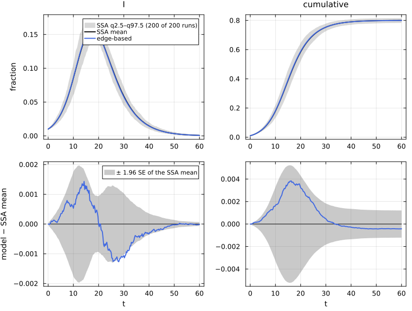
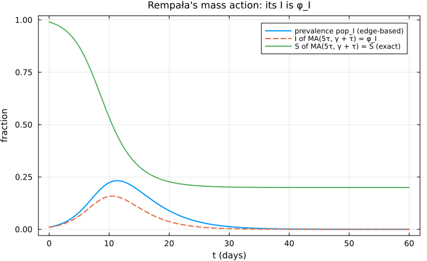
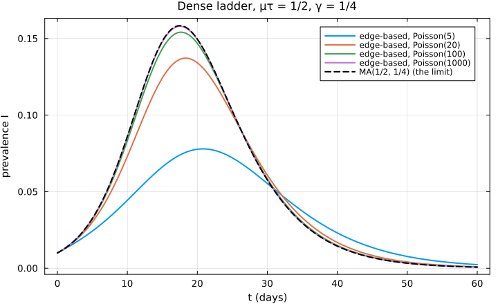
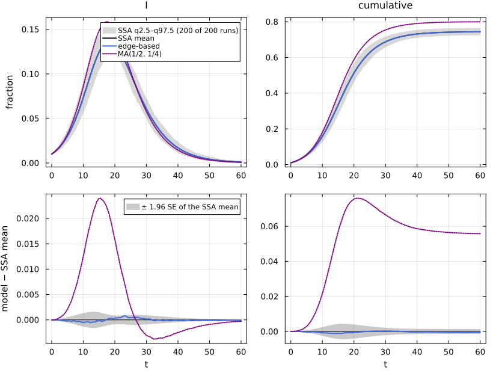
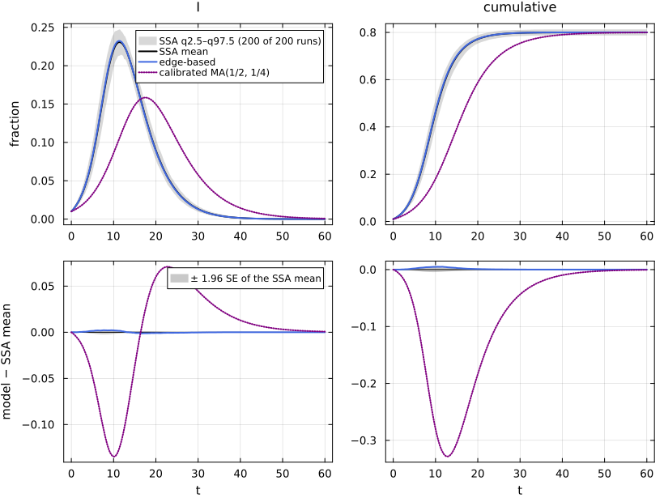

# E05. Three roads back to mass action


- [Road 1: the well-mixed unit](#road-1-the-well-mixed-unit)
- [Road 2: Rempała’s identity on
  Poisson(5)](#road-2-rempałas-identity-on-poisson5)
  - [The old `to_mass_action` was
    wrong](#the-old-to_mass_action-was-wrong)
- [Road 3: the dense limit](#road-3-the-dense-limit)
- [A calibration is not a road](#a-calibration-is-not-a-road)
- [References](#references)

A mass-action model and an edge-based model of the same reaction network
are related in three different ways, and it matters which one is meant.

1.  **The unit law (exact).** On a well-mixed population `WellMixed(κ)`
    the edge-based model *is* mass action with contact rates κτ.
2.  **Rempała’s identity (exact, other coordinates).** On a Poisson(μ)
    network the edge-based model maps onto a mass-action model MA(μτ,
    γ + τ) on (S, φ_I, φ_R): S is exact, but the mass-action “I” is the
    edge variable φ_I, not the prevalence (Jacobsen et al. 2018).
3.  **The dense limit (approximate).** As the mean degree grows with
    ⟨k⟩τ fixed, the edge-based model approaches MA(⟨k⟩τ, γ), with an
    error of order 1/⟨k⟩.

EdgeBasedModels builds each as a map from the lifted system,
`mass_action(sys; form)`, returns the map as a semiconjugacy π with Dπ·F
= G∘π, and labels how exact it is; `verify` checks the identity and
`pushforward` carries an edge-based solution to the target coordinates.
A fourth form, `:calibrated`, is a mass-action model with the same R₀ as
the network: a calibration, not a map, and it gets the dynamics wrong.

``` julia
include(joinpath(@__DIR__, "..", "_shared", "setup.jl"))
using NetworkEpiCore, NetworkOutbreaks, Catalyst, Plots
using EdgeBasedModels
using OrdinaryDiffEq
sir = @reaction_network sir begin
    @parameters τ γ
    τ, S + I --> 2I
    γ, I --> R
end
model = contact_model(sir)
tight = (reltol = 1e-10, abstol = 1e-12)
# solve the mass-action target of a MassActionImage with Catalyst (independently of the lift)
function solve_target(img, u0, tspan, p, tgrid)
    rs = complete(Catalyst.ReactionSystem(img.reaction_data))
    solve(ODEProblem(rs, u0, tspan, p), Tsit5(); saveat = tgrid, tight...)
end
# relabel curves as a mass-action representation (its own plot style)
as_ma(d, label) = ModelCurves(d.t, Dict(k => copy(v) for (k, v) in d.values); label, representation = :mass_action)
```

    as_ma (generic function with 1 method)

## Road 1: the well-mixed unit

`:sir_wm5` is SIR on `WellMixed(5)` with per-contact τ = 1/10, so β = κτ
= 1/2 and γ = 1/4. Low level and factory:

``` julia
sc_wm = scenario(:sir_wm5)
@assert isequivalent(model, sc_wm.model)
sys_wm  = edge_based(model, sc_wm.network)                  # low level   # back end
sys_wmF = build_sir(WellMixed(5), :τ, :γ)                    # factory   # back end
@assert vector_fields_equal(symbolic_ode(sys_wm), symbolic_ode(sys_wmF))
symbolic_ode(sys_wm)
```

    SymbolicODE :edge_based_model_edge_based (3 states)
      dθ/dt = -pop_I(t)*τ
      dpop_I/dt = -pop_I(t)*γ + 5.0q_S*pop_I(t)*exp(5.0(-1 + θ(t)))*τ
      dpop_R/dt = pop_I(t)*γ
      parameters  τ, q_S, γ
      domain      θ ∈ (0.05, 1.0)

The lifted coordinates are θ, the integrated per-contact hazard, and the
node fractions pop_I, pop_R, with S = q e^{κ(θ−1)}. The map S = q
e^{κ(θ−1)}, I = pop_I, R = pop_R is exact:

``` julia
img_wm = mass_action(sys_wm; form = :exact)
```

    MassActionImage  form = :exact  (well_mixed_unit, kinetics :mass_action, exactness :exact)
      target  ReactionNetworkData :sir_mass_action
      species    S   I   R
      reactions  [1] 5τ, S + I --> 2I
                 [2] γ, I --> R
      notes      well-mixed unit M1 on WellMixed(5.0): S = qξe^{κ(θ−1)} and X = pop_X (node fractions); mass action with contact rates κτ; a conjugacy onto S ∈ (0, q]
      π       S = q_S*exp(5.0(-1 + θ))
      π       I = pop_I
      π       R = pop_R

``` julia
verify(img_wm.morphism)
```

    VerificationResult(ok = true, method = :symbolic, residual = 0.0)
      Dπ·F − G∘π simplifies to 0 in all 3 components (S, I, R)

``` julia
lean_cite("NEP.wellmixed_unit")
```

Lean: `NEP.wellmixed_unit`

The Lean theorem states the conjugacy for every exit-free T_EB model on
`WellMixed(κ)` with κ ≠ 0 and q \> 0 (onto the mass-action states with S
\> 0). Numerically, the pushed-forward edge-based solution and the
mass-action solution computed independently by Catalyst agree to solver
tolerance:

``` julia
sol_wm = solve_epidemic(sys_wm, sc_wm; tight...)
q = 1 - 0.01
pf_wm = pushforward(img_wm, sys_wm, sol_wm, sc_wm.tgrid)
ma_wm = solve_target(img_wm, [:S => q, :I => 0.01, :R => 0.0], sc_wm.tspan, [:τ => sc_wm.params[:τ], :γ => sc_wm.params[:γ]], sc_wm.tgrid)
@printf("max_t |S_EB − S_MA| = %.1e, max_t |I_EB − I_MA| = %.1e\n",
        maximum(abs.(pf_wm[:S] .- ma_wm[:S])), maximum(abs.(pf_wm[:I] .- ma_wm[:I])))
```

    max_t |S_EB − S_MA| = 7.1e-12, max_t |I_EB − I_MA| = 6.8e-12

The NetworkOutbreaks reference for this scenario is `MassActionSSA`,
Gillespie’s direct method on the compartment counts of a well-mixed
population (the lumping of the complete-graph process with per-edge rate
κτ/(N − 1)):

``` julia
ref_wm = scenario_summary(sc_wm)
println("sampler: ", ref_wm.provenance["algorithm"])
reference_note(sc_wm, ref_wm)
```

    sampler: MassActionSSA

NetworkOutbreaks reference `:sir_wm5`: N = 10000, 200 runs (a fresh
graph per run), conditioned on MajorOutbreak(0.05); 200 major runs,
P(major) = 1.000 (95% CI 0.981–1.000).

``` julia
det_wm = model_curves(sys_wm, sol_wm; t = sc_wm.tgrid, label = "edge-based")
comparisonplot(ref_wm, det_wm; observables = [:I, :cumulative])
```



``` julia
compare(ref_wm, det_wm)
```

    ComparisonTable :sir_wm5  (scenario 6e8fb963; conditioned mean of 200 runs)
      curve       observable        D∞     t(D∞)       SE∞        z∞       ΔR∞  95% CI                 Δpeak   Δt_peak  coverage
      edge-based  S            0.00384     16.25   0.00267      1.57  -0.00043  [-0.00164,  0.00078]   0.00000      0.00     1.000
      edge-based  I            0.00143     14.25   0.00101      2.22  -0.00043  [-0.00164,  0.00078]   0.00062      0.00     0.929
      edge-based  R            0.00325     20.00   0.00231      1.56  -0.00043  [-0.00164,  0.00078]  -0.00041      0.00     1.000
      edge-based  infectious   0.00143     14.25   0.00101      2.22  -0.00043  [-0.00164,  0.00078]   0.00062      0.00     0.929
      edge-based  cumulative   0.00384     16.25   0.00267      1.57  -0.00043  [-0.00164,  0.00078]  -0.00043      0.00     1.000

## Road 2: Rempała’s identity on Poisson(5)

On a Poisson(μ) network ψ(θ) = e^{μ(θ−1)}, so ψ′(θ)/ψ′(1) = ψ(θ) and φ_S
= S. The edge-based equations then close on (S, φ_I): with S = q
e^{μ(θ−1)},

$$\dot S = \mu S\,\dot\theta = -\mu\tau\,S\varphi_I,\qquad
\dot\varphi_I = \mu\tau\,S\varphi_I - (\gamma + \tau)\varphi_I ,$$

which is mass-action SIR with β = μτ and recovery rate γ + τ, whose “I”
is φ_I (Rempała’s identity). The extra τ is the rate at which an
infectious partner transmits along the edge, after which the edge is
used up. `form = :edge` builds it:

``` julia
sc = scenario(:sir_pois5)
@assert isequivalent(model, sc.model)
sys  = edge_based(model, sc.network)
sysF = build_sir(PoissonDegree(5), :τ, :γ)
@assert vector_fields_equal(symbolic_ode(sys), symbolic_ode(sysF))
img_edge = mass_action(sys; form = :edge)
```

    MassActionImage  form = :edge  (rempala, kinetics :mass_action, exactness :exact)
      target  ReactionNetworkData :sir_rempala
      species    S   I   R
      reactions  [1] 5τ, S + I --> 2I
                 [2] γ, I --> R
                 [3] τ, I --> ∅
      notes      Rempała's quotient M3 on Poisson(5.0): MA(E_μ P) = c_μ P plus J → ∅ at τ for every infector J, on the model's own species. S = qξe^{μ(θ−1)} is exact, but every other species X of the target is the EDGE variable φ_X, not the node fraction (the MA "I" is φ_I, not the prevalence; form = :exact gives the prevalences as the node copies of D_μ)
                 for SIR this is MA(β = μτ, γ_MA = γ + τ) (Rempała 2023, Thm 1); the old to_mass_action map MA(μτ, γ) is not a reduction (verified issue E08)
      π       S = q_S*exp(5.0(-1 + θ))
      π       I = φ_I
      π       R = φ_R

``` julia
verify(img_edge.morphism)
```

    VerificationResult(ok = true, method = :symbolic, residual = 0.0)
      Dπ·F − G∘π simplifies to 0 in all 3 components (S, I, R)

``` julia
lean_cite("NEP.rempala_general_sir")
```

Lean: `NEP.rempala_general_sir`

The Lean theorem is the SIR case of the general quotient: for all real μ
≠ 0, τ, γ and q, the map (θ, ξ, φ, pop) ↦ (qξ e^{μ(θ−1)}, φ_I) is a
semiconjugacy, at every state, from edge-based SIR on Poisson(μ) onto
MA(μτ, γ + τ) (on this page ξ = 1). Pushing the edge-based solution
forward, S agrees with the Catalyst solution of the target and with the
edge-based S, but the target’s I is φ_I, which is **not** the
prevalence:

``` julia
sol = solve_epidemic(sys, sc; tight...)
pf  = pushforward(img_edge, sys, sol, sc.tgrid)
ma  = solve_target(img_edge, [:S => q, :I => 0.01, :R => 0.0], sc.tspan,
                   [:τ => sc.params[:τ], :γ => sc.params[:γ]], sc.tgrid)
prev = compartment(sys, sol, :pop_I)
@printf("max_t |S_MA − S_EB| = %.1e;  max_t |I_MA − φ_I| = %.1e;  max_t |I_MA − prevalence| = %.4f\n",
        maximum(abs.(ma[:S] .- compartment(sys, sol, :S))), maximum(abs.(ma[:I] .- pf[:I])),
        maximum(abs.(ma[:I] .- prev)))
```

    max_t |S_MA − S_EB| = 7.3e-12;  max_t |I_MA − φ_I| = 9.0e-12;  max_t |I_MA − prevalence| = 0.0844

``` julia
plot(sc.tgrid, prev; label = "prevalence pop_I (edge-based)", xlabel = "t (days)", ylabel = "fraction",
     title = "Rempała's mass action: its I is φ_I")
plot!(sc.tgrid, ma[:I]; label = "I of MA(5τ, γ + τ) = φ_I", linestyle = :dash)
plot!(sc.tgrid, ma[:S]; label = "S of MA(5τ, γ + τ) = S (exact)", linestyle = :dot)
```



The prevalence also has a mass-action form, on a larger network: the
**Poisson isomorphism** `form = :exact` keeps an edge copy Φ_X (= φ_X)
next to a node copy X (= pop_X) of every non-susceptible species, with
contacts S + Φ_I → 2Φ_I + I at μτ and Φ_I → ∅ at τ:

``` julia
img_exact = mass_action(sys; form = :exact)
```

    MassActionImage  form = :exact  (poisson_iso, kinetics :mass_action, exactness :exact)
      target  ReactionNetworkData :sir_edge_doubling
      species    S   Φ_I   Φ_R   I   R
      reactions  [1] 5τ, S + Φ_I --> 2Φ_I + I
                 [2] τ, Φ_I --> ∅
                 [3] γ, Φ_I --> Φ_R
                 [4] γ, I --> R
      notes      Sus inferred as recipients \ contact products = {S}
                 edge_doubling D_μ (M2), μ = 5: EB on Poisson(μ) ≅ MA of this network via S = qξe^{μ(θ−1)}, Φ_X = φ_X, X = pop_X
      π       S = q_S*exp(5.0(-1 + θ))
      π       Φ_I = φ_I
      π       Φ_R = φ_R
      π       I = pop_I
      π       R = pop_R
      note    Poisson isomorphism M2 on Poisson(5.0): MA(D_μ P) with S = qξe^{μ(θ−1)}, edge copies Φ_X = φ_X and node copies X = pop_X: the X are the node fractions (prevalences), and S(t) is exact

``` julia
verify(img_exact.morphism)
```

    VerificationResult(ok = true, method = :symbolic, residual = 0.0)
      Dπ·F − G∘π simplifies to 0 in all 5 components (S, Φ_I, Φ_R, I, R)

``` julia
lean_cite("NEP.poisson_iso_sir_iso")
```

Lean: `NEP.poisson_iso_sir_iso`

The theorem states that, for edge-based SIR on Poisson(μ) with μ ≠ 0 and
q \> 0 (on the slice ξ = 1), the map is a semiconjugacy onto this
mass-action network with image in S \> 0, and that it has an inverse on
S \> 0 which is itself a semiconjugacy: an isomorphism onto the states
with S \> 0. The map is also exact in the other direction, so the node
copy I is the prevalence:

``` julia
ma_x = solve_target(img_exact, [:S => q, :Φ_I => 0.01, :Φ_R => 0.0, :I => 0.01, :R => 0.0], sc.tspan,
                    [:τ => sc.params[:τ], :γ => sc.params[:γ]], sc.tgrid)
@printf("max_t |I − prevalence| = %.1e,  max_t |Φ_I − φ_I| = %.1e\n",
        maximum(abs.(ma_x[:I] .- prev)), maximum(abs.(ma_x[:Φ_I] .- compartment(sys, sol, :φ_I))))
```

    max_t |I − prevalence| = 7.1e-12,  max_t |Φ_I − φ_I| = 5.7e-12

### The old `to_mass_action` was wrong

EdgeBasedModels 0.1 mapped the edge-based model to MA(τκ_ex, γ), keeping
the recovery rate γ. That is not a reduction, and 0.2 removes it with a
migration message:

``` julia
err_text(f) = try f(); "no error" catch e; sprint(showerror, e) end
println(err_text(() -> to_mass_action(sys)))
```

    to_mass_action and compare_models are removed (verified issue E08): they mapped the edge-based model to MA(τ·ψ''(1)/ψ'(1), γ), which is not a reduction of it. On a Poisson network the exact reduction (Rempała 2023) is MA(β = μτ, γ + τ): the recovery rate must become γ + τ, and its I is the edge variable φ_I, not the prevalence (the prevalence needs dI/dt = β S φ_I − γ I). Use mass_action(sys; form) on an edge-based system, with form = :exact, :edge (Rempała's quotient, exact on Poisson degree distributions), :general, :limit (the κ → ∞ limit) or :calibrated (an R₀-matched calibration, not a reduction).

The old target, MA(5τ, γ), has R₀ = 5τ/γ = 3.33 instead of 2:

``` julia
rs_old = complete(sir)            # the SIR reaction network itself, with contact rate 5τ below
sol_old = solve(ODEProblem(rs_old, [:S => q, :I => 0.01, :R => 0.0], sc.tspan,
                           [:τ => 5 * sc.params[:τ], :γ => sc.params[:γ]]), Tsit5(); saveat = sc.tgrid, tight...)
@printf("final size: edge-based %.4f, Rempała S-exact %.4f, old MA(5τ, γ) %.4f\n",
        compartment(sys, sol, :cumulative)[end], 1 - ma[:S][end], 1 - sol_old[:S][end])
```

    final size: edge-based 0.8002, Rempała S-exact 0.8002, old MA(5τ, γ) 0.9596

## Road 3: the dense limit

As the mean degree μ of a Poisson network grows with μτ = 1/2 fixed,
each node has more and weaker contacts, and the edge-based model tends
to MA(1/2, 1/4), the model of `:sir_wm5`. The ladder
`:sir_dense_pois{5,20,100}` fixes μτ = 1/2 and γ = 1/4:

``` julia
ladder = [:sir_dense_pois5, :sir_dense_pois20, :sir_dense_pois100]
lsc = Dict(id => scenario(id) for id in ladder)
@assert all(isequivalent(model, lsc[id].model) for id in ladder)
lsys = Dict(id => edge_based(model, lsc[id].network) for id in ladder)          # low level
@assert all(vector_fields_equal(symbolic_ode(lsys[id]), symbolic_ode(build_sir(lsc[id].network.degrees, :τ, :γ)))
            for id in ladder)                                                     # factory
mdtable(["scenario", "μ", "τ", "R₀ on the network", "R∞"],
        [(string("`:", id, "`"), mean_degree(lsc[id].network), lsc[id].params[:τ],
          lsc[id].expected[:R0], lsc[id].expected[:final_size]) for id in ladder])
```

|             scenario |   μ |     τ | R₀ on the network |     R∞ |
|---------------------:|----:|------:|------------------:|-------:|
|   `:sir_dense_pois5` |   5 |   0.1 |             1.429 | 0.5465 |
|  `:sir_dense_pois20` |  20 | 0.025 |             1.818 | 0.7441 |
| `:sir_dense_pois100` | 100 | 0.005 |             1.961 | 0.7894 |

`form = :limit` gives MA(μτ, γ) on the node fractions, labelled a limit:
at every finite μ it is not a morphism, and `verify` fails, with a
residual that shrinks as μ grows:

``` julia
img_lim = mass_action(lsys[:sir_dense_pois20]; form = :limit)
verify(img_lim.morphism)
```

    VerificationResult(ok = false, method = :numeric, residual = 0.11614379143526841)  [16 probes]
      Dπ·F − G∘π ≠ 0: max relative residual 0.11614379143526841 at 16 probes, worst in component S
      residual of dS/dt: 20.0pop_I*q_S*exp(-20.0 + 20.0θ)*τ - 20.0q_S*exp(-20.0 + 20.0θ)*τ*φ_I
      residual of dI/dt: -20.0pop_I*q_S*exp(-20.0 + 20.0θ)*τ + 20.0q_S*exp(-20.0 + 20.0θ)*τ*φ_I

The distance between the edge-based curves and the limit, from μ = 5 to
μ = 1000 (the last one without an ensemble):

``` julia
det_ma = as_ma(model_curves(sys_wm, sol_wm; t = sc_wm.tgrid), "MA(1/2, 1/4)")   # the unit law: exactly MA
function ladder_curves(μ)
    s = edge_based(model, ConfigurationNetwork(PoissonDegree(μ)))
    so = solve_epidemic(s; p = Dict(:τ => 1 / (2μ), :γ => 1 / 4), initial = SeedFraction(:I => 0.01),
                        tspan = sc_wm.tspan, saveat = sc_wm.tgrid, tight...)
    model_curves(s, so; t = sc_wm.tgrid, label = "edge-based, Poisson($μ)")
end
μs = [5, 20, 100, 1000]
lcurves = Dict(μ => ladder_curves(μ) for μ in μs)
ladder_rows = [(μ, maximum(abs.(lcurves[μ][:S] .- det_ma[:S])), maximum(abs.(lcurves[μ][:I] .- det_ma[:I])),
                μ * maximum(abs.(lcurves[μ][:I] .- det_ma[:I])), lcurves[μ][:cumulative][end]) for μ in μs]
@printf("time span of the ladder: %s (the span of `:sir_wm5`); the last column is R at its end, not R∞\n", sc_wm.tspan)
mdtable(["μ", "max_t ΔS", "max_t ΔI", "μ · max_t ΔI", "R(t_end), edge-based"], ladder_rows)
```

    time span of the ladder: (0.0, 60.0) (the span of `:sir_wm5`); the last column is R at its end, not R∞

|    μ | max_t ΔS |  max_t ΔI | μ · max_t ΔI | R(t_end), edge-based |
|-----:|---------:|----------:|-------------:|---------------------:|
|    5 |   0.3088 |   0.08554 |       0.4277 |                0.544 |
|   20 |  0.07644 |   0.02414 |       0.4828 |               0.7434 |
|  100 |  0.01514 |  0.004934 |       0.4934 |               0.7889 |
| 1000 | 0.001511 | 0.0004956 |       0.4956 |               0.7986 |

μ·max\|ΔI\| settles to a constant: the error decreases as O(1/μ).

``` julia
plt = plot(; xlabel = "t (days)", ylabel = "prevalence I", title = "Dense ladder, μτ = 1/2, γ = 1/4")
for μ in μs
    plot!(plt, sc_wm.tgrid, lcurves[μ][:I]; label = "edge-based, Poisson($μ)")
end
plot!(plt, sc_wm.tgrid, det_ma[:I]; label = "MA(1/2, 1/4) (the limit)", color = :black, linestyle = :dash)
plt
```



The three ensembles confirm that the edge-based model, not the limit, is
what the simulation follows at each μ:

``` julia
lref = Dict(id => scenario_summary(lsc[id]) for id in ladder)
Markdown.MD([reference_note(lsc[id], lref[id]) for id in ladder])
```

NetworkOutbreaks reference `:sir_dense_pois5`: N = 10000, 200 runs (a
fresh graph per run), conditioned on MajorOutbreak(0.05); 200 major
runs, P(major) = 1.000 (95% CI 0.981–1.000).

NetworkOutbreaks reference `:sir_dense_pois20`: N = 10000, 200 runs (a
fresh graph per run), conditioned on MajorOutbreak(0.05); 200 major
runs, P(major) = 1.000 (95% CI 0.981–1.000).

NetworkOutbreaks reference `:sir_dense_pois100`: N = 10000, 200 runs (a
fresh graph per run), conditioned on MajorOutbreak(0.05); 200 major
runs, P(major) = 1.000 (95% CI 0.981–1.000).

``` julia
function ladder_cmp(id)
    s = lsc[id]; μ = Int(mean_degree(s.network))
    eb = model_curves(lsys[id], solve_epidemic(lsys[id], s); t = s.tgrid, label = "edge-based")
    c = compare(lref[id], eb, det_ma)
    (μ, c["edge-based", :I].D∞, c["edge-based", :I].z∞, c["edge-based", :cumulative].ΔR∞,
     c["MA(1/2, 1/4)", :I].D∞, c["MA(1/2, 1/4)", :cumulative].ΔR∞)
end
mdtable(["μ", "edge-based D∞(I)", "edge-based z∞(I)", "edge-based ΔR∞", "MA D∞(I)", "MA ΔR∞"],
        [ladder_cmp(id) for id in ladder])
```

|   μ | edge-based D∞(I) | edge-based z∞(I) | edge-based ΔR∞ | MA D∞(I) |  MA ΔR∞ |
|----:|-----------------:|-----------------:|---------------:|---------:|--------:|
|   5 |        0.0008275 |            2.157 |      -0.001767 |  0.08546 |  0.2539 |
|  20 |        0.0007812 |             1.73 |     -0.0005074 |  0.02399 | 0.05579 |
| 100 |         0.001046 |            2.476 |      -5.82e-05 |  0.00528 | 0.01075 |

``` julia
s20 = lsc[:sir_dense_pois20]
eb20 = model_curves(lsys[:sir_dense_pois20], solve_epidemic(lsys[:sir_dense_pois20], s20); t = s20.tgrid, label = "edge-based")
comparisonplot(lref[:sir_dense_pois20], eb20, det_ma; observables = [:I, :cumulative])
```



## A calibration is not a road

`form = :calibrated` chooses the mass-action contact rate so that R₀
matches the network. On `:sir_pois5` it picks κ = 3, which is MA(1/2,
1/4), the `:sir_wm5` model again. It has the same R₀ = 2 and, for SIR,
the same final size, but not the same epidemic:

``` julia
img_cal = mass_action(sys; form = :calibrated, p = sc.params)
println(img_cal.notes[1])
verify(img_cal.morphism)
```

    a calibration (F6), not a morphism: MA with contact rates κτ, κ = 3.0 chosen so that R₀ equals the network's (2.0) at the given parameters; S = qξψ(θ), X = pop_X. Its trajectories differ from the edge-based ones (verify fails), and the calibration does not commute with gluing or stratification

    VerificationResult(ok = false, method = :numeric, residual = 0.7797552702634558)  [16 probes]
      Dπ·F − G∘π ≠ 0: max relative residual 0.7797552702634558 at 16 probes, worst in component S
      residual of dS/dt: 3.0pop_I*q_S*exp(-5.0 + 5.0θ)*τ - 5.0q_S*exp(-5.0 + 5.0θ)*τ*φ_I
      residual of dI/dt: -3.0pop_I*q_S*exp(-5.0 + 5.0θ)*τ + 5.0q_S*exp(-5.0 + 5.0θ)*τ*φ_I

``` julia
ref = scenario_summary(sc)
reference_note(sc, ref)
```

NetworkOutbreaks reference `:sir_pois5`: N = 10000, 200 runs (a fresh
graph per run), conditioned on MajorOutbreak(0.05); 200 major runs,
P(major) = 1.000 (95% CI 0.981–1.000).

``` julia
det_eb  = model_curves(sys, sol; t = sc.tgrid, label = "edge-based")
det_cal = as_ma(det_ma, "calibrated MA(1/2, 1/4)")
comparisonplot(ref, det_eb, det_cal; observables = [:I, :cumulative])
```



``` julia
c = compare(ref, det_eb, det_cal)
pk(d) = (i = argmax(d[:I]); (d[:I][i], d.t[i]))
@printf("peak: edge-based %.3f at t = %.2f, calibrated MA %.3f at t = %.2f;  final size %.4f and %.4f\n",
        pk(det_eb)..., pk(det_cal)..., det_eb[:cumulative][end], det_cal[:cumulative][end])
c
```

    peak: edge-based 0.232 at t = 11.25, calibrated MA 0.158 at t = 17.50;  final size 0.8002 and 0.7997

    ComparisonTable :sir_pois5  (scenario 34c89792; conditioned mean of 200 runs)
      curve                    observable        D∞     t(D∞)       SE∞        z∞       ΔR∞  95% CI                 Δpeak   Δt_peak  coverage
      edge-based               S            0.00503     11.50   0.00222      2.61   0.00012  [-0.00085,  0.00109]   0.00000      0.00     0.788
      edge-based               I            0.00223      7.75   0.00113      2.60   0.00012  [-0.00085,  0.00109]   0.00158      0.00     0.830
      edge-based               R            0.00387     13.25   0.00168      2.39   0.00012  [-0.00085,  0.00109]   0.00012      0.00     0.784
      edge-based               infectious   0.00223      7.75   0.00113      2.60   0.00012  [-0.00085,  0.00109]   0.00158      0.00     0.830
      edge-based               cumulative   0.00503     11.50   0.00222      2.61   0.00012  [-0.00085,  0.00109]   0.00012      3.50     0.788
      calibrated MA(1/2, 1/4)  S            0.32836     12.75   0.00222    290.72  -0.00037  [-0.00134,  0.00060]   0.00000      0.00     0.095
      calibrated MA(1/2, 1/4)  I            0.13465     10.25   0.00113    341.01  -0.00037  [-0.00134,  0.00060]  -0.07228      6.25     0.004
      calibrated MA(1/2, 1/4)  R            0.27454     16.25   0.00168    258.70  -0.00037  [-0.00134,  0.00060]  -0.00110      0.00     0.012
      calibrated MA(1/2, 1/4)  infectious   0.13465     10.25   0.00113    341.01  -0.00037  [-0.00134,  0.00060]  -0.07228      6.25     0.004
      calibrated MA(1/2, 1/4)  cumulative   0.32836     12.75   0.00222    290.72  -0.00037  [-0.00134,  0.00060]  -0.00037      3.50     0.095

The calibrated model matches R₀ and the final size, and misses the peak
by about a third in height and six days in time: it is a summary of the
network, not a representation of the epidemic on it.

## References

<div id="refs" class="references csl-bib-body hanging-indent">

<div id="ref-jacobsen2018large" class="csl-entry">

Jacobsen, Karly A., Mark G. Burch, Joseph H. Tien, and Grzegorz A.
Rempała. 2018. “The Large Graph Limit of a Stochastic Epidemic Model on
a Dynamic Multilayer Network.” *Journal of Biological Dynamics* 12 (1):
746–88. <https://doi.org/10.1080/17513758.2018.1515993>.

</div>

</div>
