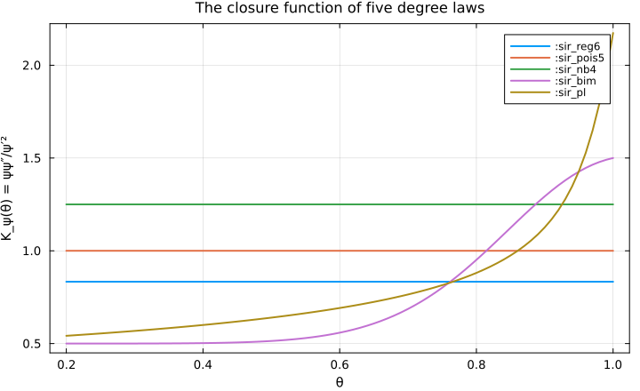
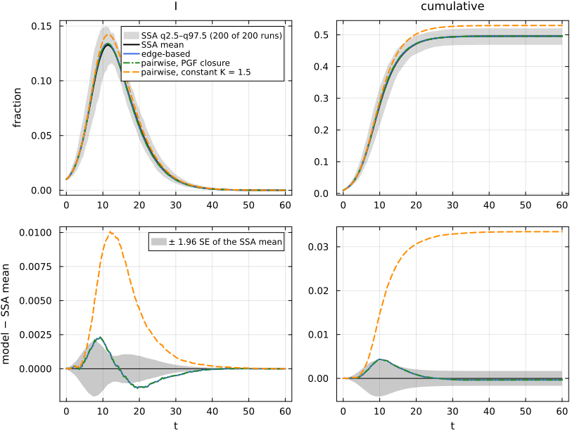
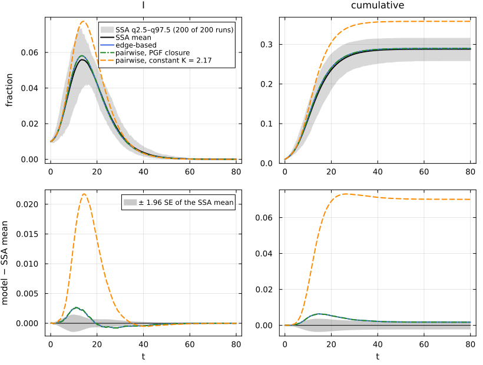
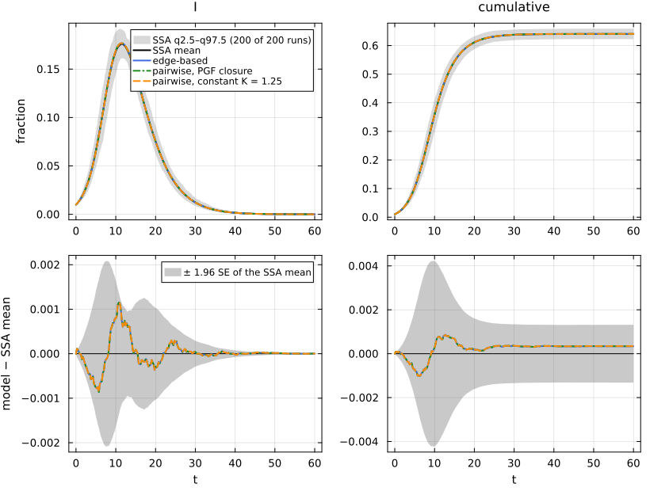
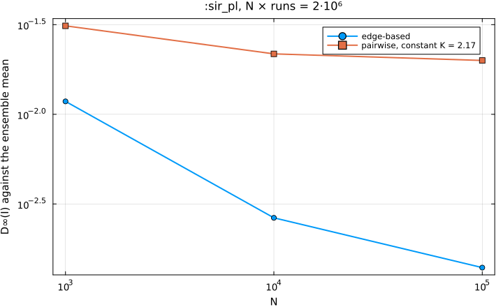

# E06. Edge-based and pairwise


- [The pairwise image, on the bimodal
  network](#the-pairwise-image-on-the-bimodal-network)
- [For every ψ, and beyond SIR](#for-every-ψ-and-beyond-sir)
- [When is the constant closure
  exact?](#when-is-the-constant-closure-exact)
- [Against simulation](#against-simulation)
- [The constant-closure bias does not go away with
  N](#the-constant-closure-bias-does-not-go-away-with-n)
- [References](#references)

A pairwise model follows the numbers of nodes \[X\] and of ordered pairs
of neighbours \[XY\], and closes the triples \[XYZ\] that their
equations need with a closure formula. The edge-based model maps onto a
pairwise model *exactly*, for every degree distribution, if the closure
is chosen right: the map

$$\pi^{PW}(\theta, \xi, \varphi, \mathrm{pop}) =
\Big(\theta,\ [s] = q\xi\psi(\theta),\ [sX] = q\xi\psi'(\theta)\varphi_X,\
[ss] = \frac{q^2\xi^2\psi'(\theta)^2}{\psi'(1)},\ [X] = \mathrm{pop}_X\Big)$$

carries the edge-based field onto the susceptible-anchored pairwise
model PW^S (only the pairs with a susceptible end) with the closure

$$[Z\,s\,J] = K_\psi(\theta)\,\frac{[Zs][sJ]}{[s]},\qquad K_\psi(\theta) = \frac{\psi(\theta)\psi''(\theta)}{\psi'(\theta)^2},$$

and the auxiliary θ̇ = −(ψ(θ)/ψ′(θ)) Σ_r τ_r \[sJ_r\]/\[s\] (the dynamic
survival closure of Kiss, Kenah and Rempała, 2023). The usual
heterogeneous pairwise model uses the constant K = K_ψ(1) =
⟨k(k−1)⟩/⟨k⟩². It is exact exactly when K_ψ is constant, which is when ψ
is of **Poisson type**, ψ′ = αψ^κ: Poisson, regular, binomial and
negative binomial degrees, but not a bimodal or power-law law (Kiss et
al. 2017). The NodeBasedModels page N02 uses the same scenarios and
ensembles.

``` julia
include(joinpath(@__DIR__, "..", "_shared", "setup.jl"))
using NetworkEpiCore, NetworkOutbreaks, Catalyst, Plots
using EdgeBasedModels, NodeBasedModels
using Statistics
sir = @reaction_network sir begin
    @parameters τ γ
    τ, S + I --> 2I
    γ, I --> R
end
model = contact_model(sir)
ids = [:sir_reg6, :sir_pois5, :sir_nb4, :sir_bim, :sir_pl, :seair_pois5]
scs = Dict(id => scenario(id) for id in ids)
mdtable(["scenario", "title"], [(string("`:", id, "`"), scs[id].title) for id in ids])
```

| scenario | title |
|---:|---:|
| `:sir_reg6` | SIR on a 6-regular configuration network |
| `:sir_pois5` | SIR on a Poisson(5) configuration network |
| `:sir_nb4` | SIR on a negative binomial (mean 4, variance 8) configuration network |
| `:sir_bim` | SIR on a bimodal {2, 10} configuration network |
| `:sir_pl` | SIR on a truncated power-law (α = 2.5, k = 2…60) configuration network |
| `:seair_pois5` | SEAIR (branching after latency, two infectors) on Poisson(5) |

## The pairwise image, on the bimodal network

Low level and factory as always, then `pairwise_image`, which returns
the target ODE and the map as a semiconjugacy:

``` julia
sc = scs[:sir_bim]
@assert isequivalent(model, sc.model)
sys  = edge_based(model, sc.network)
sysF = build_sir(sc.network.degrees, :τ, :γ)
@assert vector_fields_equal(symbolic_ode(sys), symbolic_ode(sysF))
pw = pairwise_image(sys)
pw.morphism
```

    Semiconjugacy :eb_to_pws  (kind :semiconjugacy, exactness :exact)
      source  SymbolicODE(:edge_based_model_edge_based; 5 states, 3 parameters)
      target  SymbolicODE(:sir_s_anchored_pairwise; 7 states, 2 parameters)
      map     θ = θ(t)
      map     S = q_S*(0.8333333333333334(θ(t)^2) + 0.16666666666666666(θ(t)^10))
      map     SI = q_S*(1.6666666666666667θ(t) + 1.6666666666666665(θ(t)^9))*φ_I(t)
      map     SR = q_S*φ_R(t)*(1.6666666666666667θ(t) + 1.6666666666666665(θ(t)^9))
      map     SS = 0.30000000000000004(q_S^2)*((1.6666666666666667θ(t) + 1.6666666666666665(θ(t)^9))^2)
      map     I = pop_I(t)
      map     R = pop_R(t)
      evidence Evidence(:paper, "Kiss, Kenah & Rempała 2023 (the dynamic-survival-analysis closure)")
      evidence Evidence(:symbolic, "EdgeBasedModels test/suites/reverse.jl")

``` julia
pw.ode
```

    SymbolicODE :sir_s_anchored_pairwise (7 states)
      dθ/dt = (-SI(t)*(0.8333333333333334(θ(t)^2) + 0.16666666666666666(θ(t)^10))*τ) / (S(t)*(1.6666666666666667θ(t) + 1.6666666666666665(θ(t)^9)))
      dS/dt = -SI(t)*τ
      dSI/dt = (SS(t)*SI(t)*(1.6666666666666667 + 15.0(θ(t)^8))*(0.8333333333333334(θ(t)^2) + 0.16666666666666666(θ(t)^10))*τ) / (S(t)*((1.6666666666666667θ(t) + 1.6666666666666665(θ(t)^9))^2)) + (-(SI(t)^2)*(1.6666666666666667 + 15.0(θ(t)^8))*(0.8333333333333334(θ(t)^2) + 0.16666666666666666(θ(t)^10))*τ) / (S(t)*((1.6666666666666667θ(t) + 1.6666666666666665(θ(t)^9))^2)) - SI(t)*γ - SI(t)*τ
      dSR/dt = (-SR(t)*SI(t)*(1.6666666666666667 + 15.0(θ(t)^8))*(0.8333333333333334(θ(t)^2) + 0.16666666666666666(θ(t)^10))*τ) / (S(t)*((1.6666666666666667θ(t) + 1.6666666666666665(θ(t)^9))^2)) + SI(t)*γ
      dSS/dt = (-2SS(t)*SI(t)*(1.6666666666666667 + 15.0(θ(t)^8))*(0.8333333333333334(θ(t)^2) + 0.16666666666666666(θ(t)^10))*τ) / (S(t)*((1.6666666666666667θ(t) + 1.6666666666666665(θ(t)^9))^2))
      dI/dt = -I(t)*γ + SI(t)*τ
      dR/dt = I(t)*γ
      parameters  τ, γ
      domain      θ ∈ (0.05, 1.0)

`verify` checks Dπ·F = G∘π, here symbolically:

``` julia
verify(pw.morphism)
```

    VerificationResult(ok = true, method = :symbolic, residual = 0.0)
      Dπ·F − G∘π simplifies to 0 in all 7 components (θ, S, SI, SR, SS, I, R)

NodeBasedModels builds the same pairwise model directly from the
reaction network, as
`node_based(model, net; closure = PGFClosure(), level = :s_anchored)`;
its field is the image above, up to the names of the coordinates:

``` julia
pgf_sys = node_based(model, sc.network; closure = PGFClosure(), level = :s_anchored)
vector_fields_equal(pw.ode, symbolic_ode(pgf_sys))
```

    true

## For every ψ, and beyond SIR

The map is exact for every degree PGF and every T_EB model. On all six
scenarios (the five SIR networks of E03, and SEAIR with branching and
two infectors):

``` julia
function lift(id)
    s = scs[id]
    sysx = edge_based(s.model, s.network)                          # low level (the scenario's model)
    second = isequivalent(s.model, model) ? build_sir(s.network.degrees, :τ, :γ) :   # factory (SIR)
                                            edge_based(seair_model(), s.network)     # canned model (SEAIR)
    @assert vector_fields_equal(symbolic_ode(sysx), symbolic_ode(second))
    sysx
end
eb = Dict(id => lift(id) for id in ids)
function image_row(id)
    s = scs[id]; img = pairwise_image(eb[id]); v = verify(img.morphism)
    nb = node_based(s.model, s.network; closure = PGFClosure(), level = :s_anchored)
    (string("`:", id, "`"), length(img.ode.states), v.ok, string(v.method), v.max_residual,
     vector_fields_equal(img.ode, symbolic_ode(nb)))
end
mdtable(["scenario", "pairwise states", "verify ok", "method", "residual", "equals NBM PGFClosure"],
        [image_row(id) for id in ids])
```

| scenario | pairwise states | verify ok | method | residual | equals NBM PGFClosure |
|---:|---:|---:|---:|---:|---:|
| `:sir_reg6` | 7 | true | symbolic | 0 | true |
| `:sir_pois5` | 7 | true | symbolic | 0 | true |
| `:sir_nb4` | 7 | true | numeric | 3.307e-16 | true |
| `:sir_bim` | 7 | true | symbolic | 0 | true |
| `:sir_pl` | 7 | true | symbolic | 0 | true |
| `:seair_pois5` | 11 | true | symbolic | 0 | true |

(Where the simplifier does not reduce every component to 0, here for the
negative binomial PGF, `verify` falls back to numeric probes, and the
largest relative residual is printed.)

``` julia
lean_cite("NEP.eb_to_pws")
```

Lean: `NEP.eb_to_pws`

The theorem is the general statement: for any T_EB reaction list
(contacts, exits, progressions, removals), any configuration network and
q ≠ 0, π^PW is a local semiconjugacy onto PW^S with the closure K_ψ, on
the set where ψ(θ), ψ′(θ) and ξ are non-zero.

## When is the constant closure exact?

K_ψ(θ) is constant exactly for Poisson-type ψ. We evaluate it along θ ∈
\[0.2, 1\] for the five degree laws:

``` julia
Kψ(d, θ) = pgf(d, θ) * pgf_derivative(d, θ, 2) / pgf_derivative(d, θ, 1)^2
θs = range(0.2, 1.0; length = 81)
sir_ids = ids[1:5]
plt = plot(; xlabel = "θ", ylabel = "K_ψ(θ) = ψψ″/ψ′²", title = "The closure function of five degree laws",
           legend = :topright)
for id in sir_ids
    d = scs[id].network.degrees
    plot!(plt, θs, [Kψ(d, θ) for θ in θs]; label = string(":", id))
end
plt
```



``` julia
function pt_row(id)
    d = scs[id].network.degrees; ks = [Kψ(d, θ) for θ in θs]; pt = is_poisson_type(scs[id].network)
    (string("`:", id, "`"), closure_constant(scs[id].network), minimum(ks), maximum(ks),
     pt === nothing ? "no" : @sprintf("yes: α = %.4g, κ = %.4g", pt.α, pt.κ))
end
mdtable(["scenario", "K = K_ψ(1)", "min K_ψ on [0.2, 1]", "max K_ψ on [0.2, 1]", "Poisson type (ψ′ = αψ^κ)"],
        [pt_row(id) for id in sir_ids])
```

| scenario | K = K_ψ(1) | min K_ψ on \[0.2, 1\] | max K_ψ on \[0.2, 1\] | Poisson type (ψ′ = αψ^κ) |
|---:|---:|---:|---:|---:|
| `:sir_reg6` | 0.8333 | 0.8333 | 0.8333 | yes: α = 6, κ = 0.8333 |
| `:sir_pois5` | 1 | 1 | 1 | yes: α = 5, κ = 1 |
| `:sir_nb4` | 1.25 | 1.25 | 1.25 | yes: α = 4, κ = 1.25 |
| `:sir_bim` | 1.5 | 0.5 | 1.5 | no |
| `:sir_pl` | 2.174 | 0.5418 | 2.174 | no |

The equivalence “K_ψ ≡ κ on an interval ⇔ ψ′ = αψ^κ there” (for ψ \> 0
with the stated derivatives) is a theorem, and so is the dynamic
consequence in one direction: for a Poisson-type ψ (ψ′ = αψ^κ, ψ \> 0 on
a convex set of θ with non-empty interior), and for every T_EB reaction
list, π^PW is a local semiconjugacy from the edge-based model onto the
pairwise model with the constant closure κ.

``` julia
lean_cite("NEP.pt_iff_const_closure")
```

Lean: `NEP.pt_iff_const_closure`

``` julia
lean_cite("NEP.eb_to_pws_pt_any")
```

Lean: `NEP.eb_to_pws_pt_any`

The converse for the dynamics (a non-Poisson-type ψ makes the constant
closure inexact along some trajectory) is not formalised; the numbers
below show it on the two non-PT networks.

## Against simulation

For each scenario we solve three models: the edge-based model, the
S-anchored pairwise model with the PGF closure, and the full
heterogeneous pairwise model with the constant closure K (the
NodeBasedModels default on a configuration network):

``` julia
function three_curves(id)
    s = scs[id]
    e  = model_curves(eb[id], solve_epidemic(eb[id], s); t = s.tgrid, label = "edge-based")
    ps = node_based(s.model, s.network; closure = PGFClosure(), level = :s_anchored)
    p  = model_curves(ps, solve_epidemic(ps, s); t = s.tgrid, label = "pairwise, PGF closure")
    pc = node_based(s.model, s.network)                                  # constant K
    c  = model_curves(pc, solve_epidemic(pc, s); t = s.tgrid,
                      label = @sprintf("pairwise, constant K = %.3g", closure_constant(s.network)))
    (e, p, c)
end
curves3 = Dict(id => three_curves(id) for id in ids)
refs = Dict(id => scenario_summary(scs[id]) for id in ids)
Markdown.MD([reference_note(scs[id], refs[id]) for id in ids])
```

NetworkOutbreaks reference `:sir_reg6`: N = 10000, 200 runs (a fresh
graph per run), conditioned on MajorOutbreak(0.05); 200 major runs,
P(major) = 1.000 (95% CI 0.981–1.000).

NetworkOutbreaks reference `:sir_pois5`: N = 10000, 200 runs (a fresh
graph per run), conditioned on MajorOutbreak(0.05); 200 major runs,
P(major) = 1.000 (95% CI 0.981–1.000).

NetworkOutbreaks reference `:sir_nb4`: N = 10000, 200 runs (a fresh
graph per run), conditioned on MajorOutbreak(0.05); 200 major runs,
P(major) = 1.000 (95% CI 0.981–1.000).

NetworkOutbreaks reference `:sir_bim`: N = 10000, 200 runs (a fresh
graph per run), conditioned on MajorOutbreak(0.05); 200 major runs,
P(major) = 1.000 (95% CI 0.981–1.000).

NetworkOutbreaks reference `:sir_pl`: N = 10000, 200 runs (a fresh graph
per run), conditioned on MajorOutbreak(0.05); 200 major runs, P(major) =
1.000 (95% CI 0.981–1.000).

NetworkOutbreaks reference `:seair_pois5`: N = 10000, 200 runs (a fresh
graph per run), conditioned on MajorOutbreak(0.05); 200 major runs,
P(major) = 1.000 (95% CI 0.981–1.000).

``` julia
comparisonplot(refs[:sir_bim], curves3[:sir_bim]...; observables = [:I, :cumulative])
```



``` julia
comparisonplot(refs[:sir_pl], curves3[:sir_pl]...; observables = [:I, :cumulative])
```



``` julia
comparisonplot(refs[:sir_nb4], curves3[:sir_nb4]...; observables = [:I, :cumulative])
```



``` julia
function cmp_rows(id)
    c = compare(refs[id], curves3[id]...)
    rows = map(collect(curves3[id])) do d     # a vector of rows (curves3[id] is a tuple)
        r = c[d.label, :cumulative]
        lo, hi = r.ΔR∞_ci
        se = (hi - lo) / (2 * 1.96)          # SE of the ensemble mean, read off its 95% CI
        (string("`:", id, "`"), d.label, c[d.label, :I].D∞, c[d.label, :I].z∞, r.ΔR∞,
         @sprintf("[%.4f, %.4f]", lo, hi), r.ΔR∞ / se)
    end
    return rows
end
mdtable(["scenario", "model", "D∞(I)", "z∞(I)", "ΔR∞", "95% CI of ΔR∞", "ΔR∞ / SE"],
        reduce(vcat, [cmp_rows(id) for id in ids]))
```

| scenario | model | D∞(I) | z∞(I) | ΔR∞ | 95% CI of ΔR∞ | ΔR∞ / SE |
|---:|---:|---:|---:|---:|---:|---:|
| `:sir_reg6` | edge-based | 0.001712 | 2.769 | 0.0002613 | \[-0.0003, 0.0008\] | 0.963 |
| `:sir_reg6` | pairwise, PGF closure | 0.001709 | 2.736 | 0.0002649 | \[-0.0003, 0.0008\] | 0.9763 |
| `:sir_reg6` | pairwise, constant K = 0.833 | 0.001709 | 2.736 | 0.0002649 | \[-0.0003, 0.0008\] | 0.9763 |
| `:sir_pois5` | edge-based | 0.002226 | 2.587 | 0.0001105 | \[-0.0009, 0.0011\] | 0.2236 |
| `:sir_pois5` | pairwise, PGF closure | 0.002228 | 2.596 | 0.0001227 | \[-0.0008, 0.0011\] | 0.2484 |
| `:sir_pois5` | pairwise, constant K = 1 | 0.002228 | 2.596 | 0.0001227 | \[-0.0008, 0.0011\] | 0.2484 |
| `:sir_nb4` | edge-based | 0.00115 | 1.742 | 0.000338 | \[-0.0010, 0.0017\] | 0.5031 |
| `:sir_nb4` | pairwise, PGF closure | 0.001145 | 1.736 | 0.0003432 | \[-0.0010, 0.0017\] | 0.5109 |
| `:sir_nb4` | pairwise, constant K = 1.25 | 0.001145 | 1.736 | 0.0003432 | \[-0.0010, 0.0017\] | 0.5109 |
| `:sir_bim` | edge-based | 0.002319 | 3.586 | -0.0003484 | \[-0.0020, 0.0013\] | -0.4048 |
| `:sir_bim` | pairwise, PGF closure | 0.00232 | 3.57 | -0.000345 | \[-0.0020, 0.0013\] | -0.4008 |
| `:sir_bim` | pairwise, constant K = 1.5 | 0.01006 | 20.29 | 0.03344 | \[0.0317, 0.0351\] | 38.85 |
| `:sir_pl` | edge-based | 0.002645 | 3.944 | 0.001729 | \[-0.0005, 0.0040\] | 1.491 |
| `:sir_pl` | pairwise, PGF closure | 0.002645 | 3.943 | 0.001731 | \[-0.0005, 0.0040\] | 1.492 |
| `:sir_pl` | pairwise, constant K = 2.17 | 0.02173 | 51.14 | 0.07013 | \[0.0679, 0.0724\] | 60.45 |
| `:seair_pois5` | edge-based | 0.0003645 | 2.448 | -0.001017 | \[-0.0026, 0.0006\] | -1.251 |
| `:seair_pois5` | pairwise, PGF closure | 0.0003658 | 2.454 | -0.001017 | \[-0.0026, 0.0006\] | -1.252 |
| `:seair_pois5` | pairwise, constant K = 1 | 0.0003658 | 2.454 | -0.001017 | \[-0.0026, 0.0006\] | -1.252 |

On the four Poisson-type scenarios (including SEAIR on Poisson(5)) the
three models coincide and all agree with the ensembles. On `:sir_bim`
and `:sir_pl` the edge-based and PGF-closure models still agree with the
ensembles, while the constant closure overestimates the final size by
tens of standard errors of the ensemble mean (the last column, with SE
read off the 95% CI). The deterministic differences, without simulation
noise:

``` julia
bias_rows = [(string("`:", id, "`"), maximum(abs.(curves3[id][2][:I] .- curves3[id][1][:I])),
              maximum(abs.(curves3[id][3][:I] .- curves3[id][1][:I])),
              curves3[id][3][:cumulative][end] - curves3[id][1][:cumulative][end]) for id in ids]
mdtable(["scenario", "max ΔI, PGF closure − EB", "max ΔI, constant K − EB", "ΔR∞, constant K − EB"], bias_rows)
```

| scenario | max ΔI, PGF closure − EB | max ΔI, constant K − EB | ΔR∞, constant K − EB |
|---:|---:|---:|---:|
| `:sir_reg6` | 2.181e-05 | 2.181e-05 | 3.62e-06 |
| `:sir_pois5` | 1.07e-05 | 1.07e-05 | 1.223e-05 |
| `:sir_nb4` | 1.013e-05 | 1.013e-05 | 5.216e-06 |
| `:sir_bim` | 9.928e-06 | 0.009397 | 0.03379 |
| `:sir_pl` | 4.089e-06 | 0.01983 | 0.06841 |
| `:seair_pois5` | 7.818e-06 | 7.818e-06 | -6.702e-07 |

Differences of 10⁻⁵ or less are the tolerance of the two ODE solvers. On
the two non-PT networks the constant closure is off by 0.034 and 0.068
in the final size.

## The constant-closure bias does not go away with N

On the power-law network the edge-based error shrinks with N towards the
Monte Carlo floor (E03), while the constant closure’s error stays put,
because it is a property of the closure, not of the finite graph:

``` julia
nids = [:sir_pl_N1000, :sir_pl, :sir_pl_N100000]
nrefs = Dict(id => scenario_summary(scenario(id)) for id in nids)
Markdown.MD([reference_note(scenario(id), nrefs[id]) for id in nids])
```

NetworkOutbreaks reference `:sir_pl_N1000`: N = 1000, 2000 runs (a fresh
graph per run), conditioned on MajorOutbreak(0.05); 1712 major runs,
P(major) = 0.856 (95% CI 0.840–0.871).

NetworkOutbreaks reference `:sir_pl`: N = 10000, 200 runs (a fresh graph
per run), conditioned on MajorOutbreak(0.05); 200 major runs, P(major) =
1.000 (95% CI 0.981–1.000).

NetworkOutbreaks reference `:sir_pl_N100000`: N = 100000, 20 runs (a
fresh graph per run), conditioned on MajorOutbreak(0.05); 20 major runs,
P(major) = 1.000 (95% CI 0.839–1.000).

``` julia
e_pl, _, c_pl = curves3[:sir_pl]
nrows = map(nids) do id
    c = compare(nrefs[id], e_pl, c_pl)
    (nrefs[id].N, c[e_pl.label, :I].D∞, c[c_pl.label, :I].D∞, c[e_pl.label, :cumulative].ΔR∞, c[c_pl.label, :cumulative].ΔR∞)
end
mdtable(["N", "D∞(I) edge-based", "D∞(I) constant K", "ΔR∞ edge-based", "ΔR∞ constant K"], nrows)
```

|      N | D∞(I) edge-based | D∞(I) constant K | ΔR∞ edge-based | ΔR∞ constant K |
|-------:|-----------------:|-----------------:|---------------:|---------------:|
|   1000 |           0.0118 |          0.03114 |         0.0148 |         0.0832 |
|  10000 |         0.002645 |          0.02173 |       0.001729 |        0.07013 |
| 100000 |         0.001396 |          0.01997 |     -0.0002687 |        0.06814 |

``` julia
Ns = [r[1] for r in nrows]
plot(Ns, [r[2] for r in nrows]; xscale = :log10, yscale = :log10, marker = :circle, label = "edge-based",
     xlabel = "N", ylabel = "D∞(I) against the ensemble mean", title = ":sir_pl, N × runs = 2·10⁶")
plot!(Ns, [r[3] for r in nrows]; marker = :square, label = c_pl.label)
```



## References

<div id="refs" class="references csl-bib-body hanging-indent">

<div id="ref-kiss2017mathematics" class="csl-entry">

Kiss, István Z., Joel C. Miller, and Péter L. Simon. 2017. *Mathematics
of Epidemics on Networks: From Exact to Approximate Models*. Springer.
<https://doi.org/10.1007/978-3-319-50806-1>.

</div>

</div>
