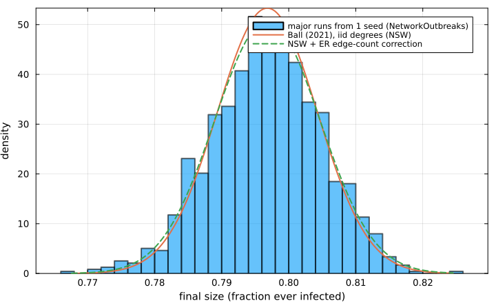
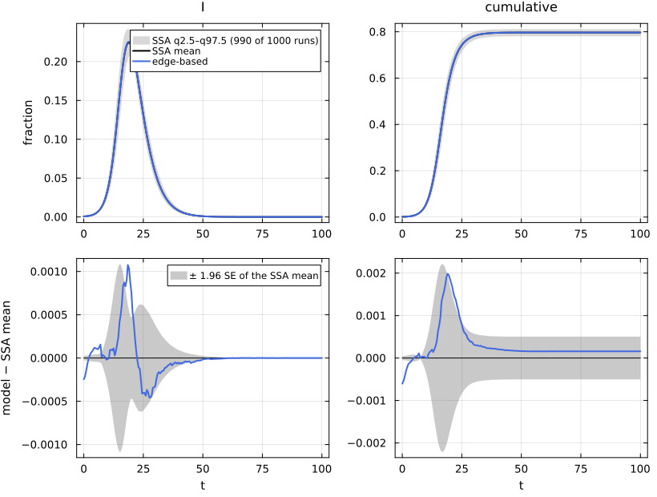
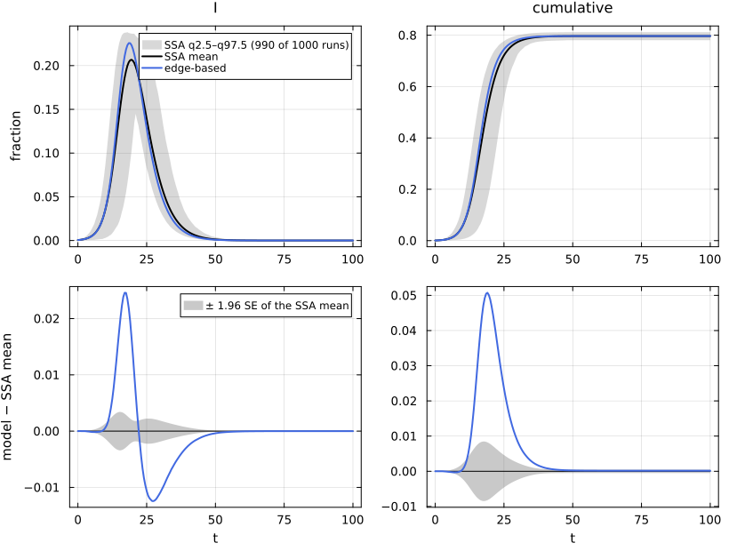
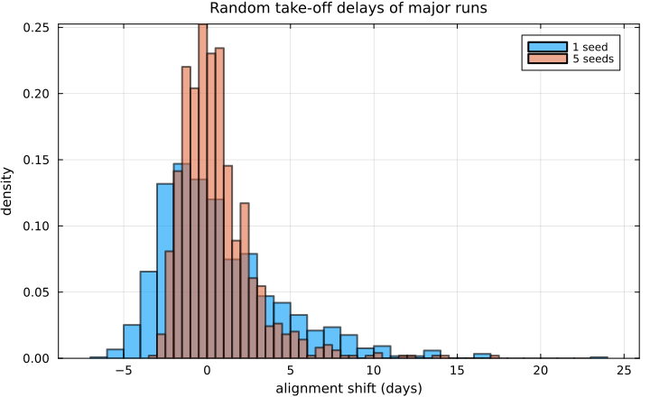

# E07. Final size, R₀ and the probability of a major outbreak


- [The final size with a seed
  fraction](#the-final-size-with-a-seed-fraction)
- [The probability of a major
  outbreak](#the-probability-of-a-major-outbreak)
- [The spread of the final size: Ball’s central limit
  theorem](#the-spread-of-the-final-size-balls-central-limit-theorem)
- [Small seeds: aligned and unaligned
  ensembles](#small-seeds-aligned-and-unaligned-ensembles)
- [References](#references)

Three summaries of an SIR epidemic are often confused. The **final
size** R∞ is the fraction of nodes ever infected in a large outbreak.
The **probability of a major outbreak** P is the chance that a single
infected node starts one. **R₀** is the mean number of secondary
infections early on. On a configuration network R₀ = T·κ_ex, and the
final size depends on the infectious period only through the
transmissibility T. The probability of a major outbreak does not: it is
not R∞, and it is not the bond-percolation formula unless the infectious
period is constant (Miller et al. 2012; Ball 2021). This page computes
all three and checks each against NetworkOutbreaks ensembles, including
two small-seed ensembles that start from 5 nodes and from 1 node.

``` julia
include(joinpath(@__DIR__, "..", "_shared", "setup.jl"))
using NetworkEpiCore, NetworkOutbreaks, Catalyst, Plots
using EdgeBasedModels
using Statistics
sir = @reaction_network sir begin
    @parameters τ γ
    τ, S + I --> 2I
    γ, I --> R
end
model = contact_model(sir)
sc = scenario(:sir_pois5)
@assert isequivalent(model, sc.model)
sys  = edge_based(model, sc.network)                        # low level
sysF = build_sir(PoissonDegree(5), :τ, :γ)                  # factory
@assert vector_fields_equal(symbolic_ode(sys), symbolic_ode(sysF))
p = sc.params;
```

## The final size with a seed fraction

For a single entry state on a configuration network with PGF ψ, the
fraction θ∞ of edges that never transmit solves

$$\theta_\infty = 1 - T + T\,q\,\frac{\psi'(\theta_\infty)}{\psi'(1)}, \qquad R_\infty = 1 - q\,\psi(\theta_\infty),$$

with q = 1 − ρ the fraction initially susceptible. The limit of the
edge-based `:cumulative` curve is the same number, and `final_size` is
the fraction ever infected *including* the seeds. With
`initial = nothing` it is the limit of a vanishing seed.

``` julia
T = transmissibility(model, sc.network, p)
fs(ρ) = final_size(model, sc.network, p; initial = ρ == 0 ? nothing : SeedFraction(:I => ρ))
sol = solve_epidemic(sys, sc)
@printf("T = %.4f, R₀ = %.4f;  R∞ at ρ → 0: %.4f;  at ρ = 0.01: fixed point %.4f, edge-based ODE %.4f\n",
        T, basic_reproduction_number(sys; p), fs(0), fs(0.01), compartment(sys, sol, :cumulative)[end])
```

    T = 0.4000, R₀ = 2.0000;  R∞ at ρ → 0: 0.7968;  at ρ = 0.01: fixed point 0.8002, edge-based ODE 0.8002

``` julia
ρs = [0.0, 1e-4, 1e-3, 0.01, 0.05, 0.1]
mdtable(["ρ", "R∞ (fixed point)", "R∞ − ρ (infected by transmission)"], [(ρ, fs(ρ), fs(ρ) - ρ) for ρ in ρs])
```

|      ρ | R∞ (fixed point) | R∞ − ρ (infected by transmission) |
|-------:|-----------------:|----------------------------------:|
|      0 |           0.7968 |                            0.7968 |
| 0.0001 |           0.7968 |                            0.7967 |
|  0.001 |           0.7972 |                            0.7962 |
|   0.01 |           0.8002 |                            0.7902 |
|   0.05 |           0.8132 |                            0.7632 |
|    0.1 |           0.8283 |                            0.7283 |

Against the ensembles on three scenarios (the final size of each major
run, including the seeds, is stored in the summary). SEAIR has two
infectors and branching, so its low-level model is its Catalyst network
and its second route the canned `seair_model()`:

``` julia
seair_rn = @reaction_network seair begin
    @parameters τI τA σ p γ
    τI, S + I --> E + I
    τA, S + A --> E + A
    p * σ, E --> I
    (1 - p) * σ, E --> A
    γ, I --> R
    γ, A --> R
end
sc_bim, sc_seair = scenario(:sir_bim), scenario(:seair_pois5)
@assert isequivalent(model, sc_bim.model) && isequivalent(contact_model(seair_rn), sc_seair.model)
sys_bim   = edge_based(model, sc_bim.network)
@assert vector_fields_equal(symbolic_ode(sys_bim), symbolic_ode(build_sir(sc_bim.network.degrees, :τ, :γ)))
sys_seair = edge_based(contact_model(seair_rn), sc_seair.network)
@assert vector_fields_equal(symbolic_ode(sys_seair), symbolic_ode(edge_based(seair_model(), sc_seair.network)))
fs_scs = [(sc, sys), (sc_bim, sys_bim), (sc_seair, sys_seair)]
Markdown.MD([reference_note(s, scenario_summary(s)) for (s, _) in fs_scs])
```

NetworkOutbreaks reference `:sir_pois5`: N = 10000, 200 runs (a fresh
graph per run), conditioned on MajorOutbreak(0.05); 200 major runs,
P(major) = 1.000 (95% CI 0.981–1.000).

NetworkOutbreaks reference `:sir_bim`: N = 10000, 200 runs (a fresh
graph per run), conditioned on MajorOutbreak(0.05); 200 major runs,
P(major) = 1.000 (95% CI 0.981–1.000).

NetworkOutbreaks reference `:seair_pois5`: N = 10000, 200 runs (a fresh
graph per run), conditioned on MajorOutbreak(0.05); 200 major runs,
P(major) = 1.000 (95% CI 0.981–1.000).

``` julia
function fs_row(s, y)
    ref = scenario_summary(s); x = ref.final_size[ref.major]
    m = mean(x); se = std(x) / sqrt(length(x))
    (string("`:", s.id, "`"), final_size(y; p = s.params, initial = s.initial), m,
     @sprintf("[%.4f, %.4f]", m - 1.96se, m + 1.96se), std(x), length(x))
end
mdtable(["scenario", "R∞ (edge-based)", "ensemble mean", "95% CI", "sd over runs", "major runs"],
        [fs_row(s, y) for (s, y) in fs_scs])
```

| scenario | R∞ (edge-based) | ensemble mean | 95% CI | sd over runs | major runs |
|---:|---:|---:|---:|---:|---:|
| `:sir_pois5` | 0.8002 | 0.8001 | \[0.7991, 0.8010\] | 0.006989 | 200 |
| `:sir_bim` | 0.4956 | 0.4959 | \[0.4942, 0.4976\] | 0.01217 | 200 |
| `:seair_pois5` | 0.6976 | 0.6986 | \[0.6970, 0.7002\] | 0.01149 | 200 |

## The probability of a major outbreak

An infected node’s transmissions along its edges are **not**
independent: they all depend on how long it stays infectious.
Conditioned on its infectious path, the probability that it does not
transmit along a given edge is W = e^{−Λ}, with Λ the path’s cumulative
per-edge hazard, so its number of offspring is a mixed binomial. For SIR
with an exponential infectious period, E\[W^j\] = γ/(γ + jτ). Let η be
the probability that the line of descent started along one edge dies out
(the extinction probability of the forward branching process; E04’s exit
factor ξ is a different quantity). Then (Ball 2021)

$$\eta = \frac{E[\psi'(\eta + (1 - \eta)W)]}{\psi'(1)}\ \text{(least root)},\qquad P = 1 - E[\psi(\eta + (1-\eta)W)],$$

and P, the probability that a single infected node starts a major
outbreak, is the survival probability of the infector-side branching
process.

Bond percolation instead treats every edge independently with
probability T. Its “probability” 1 − ψ(u), with u = 1 − T +
Tψ′(u)/ψ′(1), is the final size at ρ → 0, and it is the right answer
only for a constant infectious period.

``` julia
P = epidemic_probability(sys; p)
ψ(x) = pgf(sc.network, x); ψ1(x) = pgf_derivative(sc.network, x, 1)
u = let u = 0.5; for _ in 1:10_000; u = 1 - T + T * ψ1(u) / ψ1(1.0); end; u end   # bond percolation fixed point
P_bond = 1 - ψ(u)
@printf("infector-side P = %.4f;  bond percolation 1 − ψ(u) = %.4f;  R∞ (ρ → 0) = %.4f\n", P, P_bond, fs(0))
```

    infector-side P = 0.6094;  bond percolation 1 − ψ(u) = 0.7968;  R∞ (ρ → 0) = 0.7968

The single-seed ensemble `:sir_pois5_1seed` estimates P directly: 2000
runs, each from one infected node, of which the ones that infect at
least 5% of the population are major.

``` julia
sc1 = scenario(:sir_pois5_1seed)
@assert isequivalent(model, sc1.model)
ref1 = scenario_summary(sc1)
reference_note(sc1, ref1)
```

NetworkOutbreaks reference `:sir_pois5_1seed`: N = 10000, 2000 runs (a
fresh graph per run), conditioned on MajorOutbreak(0.05); time-aligned
by CumulativeCrossing(0.02); 1191 major runs, P(major) = 0.596 (95% CI
0.574–0.617).

With k seeds a major outbreak fails only if every seed’s line dies out,
so P_k = 1 − (1 − P)^k; `:sir_pois5_5seeds` (1000 runs from 5 nodes)
tests that:

``` julia
sc5 = scenario(:sir_pois5_5seeds)
@assert isequivalent(model, sc5.model)
ref5 = scenario_summary(sc5)
reference_note(sc5, ref5)
```

NetworkOutbreaks reference `:sir_pois5_5seeds`: N = 10000, 1000 runs (a
fresh graph per run), conditioned on MajorOutbreak(0.05); time-aligned
by CumulativeCrossing(0.02); 990 major runs, P(major) = 0.990 (95% CI
0.982–0.995).

``` julia
Pk(P, k) = 1 - (1 - P)^k
inside(x, ci) = ci[1] <= x <= ci[2] ? "inside" : "outside"
rows = [(k, @sprintf("%.4f [%.4f, %.4f]", ref.p_major, ref.p_major_ci...), Pk(P, k), inside(Pk(P, k), ref.p_major_ci),
         Pk(P_bond, k), inside(Pk(P_bond, k), ref.p_major_ci)) for (k, ref) in ((1, ref1), (5, ref5))]
mdtable(["seeds", "NetworkOutbreaks P(major) [95% CI]", "infector-side", "in the CI?", "bond percolation", "in the CI?"], rows)
```

| seeds | NetworkOutbreaks P(major) \[95% CI\] | infector-side | in the CI? | bond percolation | in the CI? |
|---:|---:|---:|---:|---:|---:|
| 1 | 0.5955 \[0.5738, 0.6168\] | 0.6094 | inside | 0.7968 | outside |
| 5 | 0.9900 \[0.9817, 0.9946\] | 0.9909 | inside | 0.9997 | outside |

The infector-side value is inside both Wilson intervals and bond
percolation is outside both. For the other two scenarios of the page:

``` julia
mdtable(["scenario", "P (infector side)", "R∞ at ρ → 0"],
        [(string("`:", s.id, "`"), epidemic_probability(y; p = s.params), final_size(y; p = s.params))
         for (s, y) in fs_scs])
```

|       scenario | P (infector side) | R∞ at ρ → 0 |
|---------------:|------------------:|------------:|
|   `:sir_pois5` |            0.6094 |      0.7968 |
|     `:sir_bim` |            0.3743 |       0.486 |
| `:seair_pois5` |            0.4894 |      0.6912 |

## The spread of the final size: Ball’s central limit theorem

Among major outbreaks started by a few seeds in a population of N nodes,
the final size is approximately normal with standard deviation σ/√N.
Ball (2021), Theorem 2.2, proves this for the configuration model with
iid degrees (the Newman–Strogatz–Watts, NSW, construction) or with a
prescribed degree sequence (Molloy–Reed, MR), under a **bounded maximum
degree**. A Poisson law has no maximum degree, so the theorem as proved
does not cover this page’s network; its variance formula is used here as
an approximation. `confidence_bands` computes σ² for both constructions:

``` julia
cb   = confidence_bands(sys, sc1.sim.N; p)                 # iid degrees (NSW), the default
cbMR = confidence_bands(sys, sc1.sim.N; p, graph = :MR)    # a fixed degree sequence
@printf("Ball: mean %.4f;  σ² (NSW) = %.4f, SE = %.5f;  σ² (MR) = %.4f, SE = %.5f\n", cb.mean,
        cb.variance, cb.std_error, cbMR.variance, cbMR.std_error)
```

    Ball: mean 0.7968;  σ² (NSW) = 0.5600, SE = 0.00748;  σ² (MR) = 0.4967, SE = 0.00705

The ensembles, however, are neither: for a Poisson law NetworkOutbreaks
draws the Erdős–Rényi graph G(N, c/(N − 1)) with c = 5 (see E03). Its
number of edges is binomial, so the mean degree 2E/N has variance ≈
2c/N, twice the c/N of N iid Poisson(c) degrees. To first order (the
delta method) the extra c/N in the mean degree adds (dρ/dc)²·c to σ²,
where ρ(c) is the limiting final size of a vanishing seed at fixed T.
For Poisson degrees ρ = 1 − e^{−cTρ}, so dρ/dc = Tρ(1 − ρ)/(1 − cT(1 −
ρ)); it is checked here against a central difference of `final_size`:

``` julia
ρc(c) = final_size(model, ConfigurationNetwork(PoissonDegree(c)), p)
c0 = 5.0; h = 1e-4
dρ_fd = (ρc(c0 + h) - ρc(c0 - h)) / 2h
ρ0 = ρc(c0); dρ_cf = T * ρ0 * (1 - ρ0) / (1 - c0 * T * (1 - ρ0))
σ²_ER = cb.variance + dρ_cf^2 * c0
se_ER = sqrt(σ²_ER / sc1.sim.N)
@printf("dρ/dc: closed form %.4f, central difference %.4f;  σ² (ER, delta method) = %.4f, SE = %.5f\n",
        dρ_cf, dρ_fd, σ²_ER, se_ER)
```

    dρ/dc: closed form 0.1091, central difference 0.1091;  σ² (ER, delta method) = 0.6195, SE = 0.00787

The observed spread of the major runs against the three predicted
standard errors, with the ratio sd / SE and the gap in units of the
sampling error of the sd (SE of the sd ≈ sd/√(2(n − 1))):

``` julia
function spread_row(ref, label)
    x = ref.final_size[ref.major]; s = std(x); n = length(x); ses = s / sqrt(2 * (n - 1))
    (label, n, mean(x), s, ses, s / cb.std_error, (s - cb.std_error) / ses,
     s / se_ER, (s - se_ER) / ses, mean(abs.(x .- cb.mean) .<= 1.96se_ER))
end
spread_rows = [spread_row(ref1, "1 seed"), spread_row(ref5, "5 seeds")]
mdtable(["ensemble", "major runs", "mean final size", "sd", "SE of the sd", "sd / SE (NSW)", "gap / SE of sd (NSW)",
         "sd / SE (ER)", "gap / SE of sd (ER)", "fraction inside the ER 95% band"], spread_rows)
```

| ensemble | major runs | mean final size | sd | SE of the sd | sd / SE (NSW) | gap / SE of sd (NSW) | sd / SE (ER) | gap / SE of sd (ER) | fraction inside the ER 95% band |
|---:|---:|---:|---:|---:|---:|---:|---:|---:|---:|
| 1 seed | 1191 | 0.7966 | 0.008189 | 0.0001679 | 1.094 | 4.205 | 1.04 | 1.896 | 0.9454 |
| 5 seeds | 990 | 0.7968 | 0.008075 | 0.0001816 | 1.079 | 3.26 | 1.026 | 1.125 | 0.9465 |

``` julia
@printf("sd excess over Ball's NSW SE: %.1f%% (1 seed), %.1f%% (5 seeds);  over the ER-corrected SE: %.1f%%, %.1f%%\n",
        100 * (spread_rows[1][6] - 1), 100 * (spread_rows[2][6] - 1), 100 * (spread_rows[1][8] - 1),
        100 * (spread_rows[2][8] - 1))
```

    sd excess over Ball's NSW SE: 9.4% (1 seed), 7.9% (5 seeds);  over the ER-corrected SE: 4.0%, 2.6%

``` julia
x1 = ref1.final_size[ref1.major]
histogram(x1; bins = 40, normalize = :pdf, label = "major runs from 1 seed (NetworkOutbreaks)",
          xlabel = "final size (fraction ever infected)", ylabel = "density", alpha = 0.6)
xs = range(minimum(x1), maximum(x1); length = 200)
normal(x, m, s) = exp(-(x - m)^2 / (2s^2)) / (s * sqrt(2π))
plot!(xs, normal.(xs, cb.mean, cb.std_error); label = "Ball (2021), iid degrees (NSW)", linewidth = 2)
plot!(xs, normal.(xs, cb.mean, se_ER); label = "NSW + ER edge-count correction", linewidth = 2, linestyle = :dash)
```



Against Ball’s NSW variance the observed standard deviations are several
percent too large, and the table shows that the gap is more than the
sampling error of the sd. Most of that gap is the sampler, not N: the
Erdős–Rényi graphs have twice the edge-count variance of iid Poisson
degrees, and with the delta-method correction the remaining excess is
within about two standard errors of the sd (the last two columns). This
is a first-order correction for a law the theorem does not formally
cover, so it explains the gap rather than proving a match.

The committed `:sir_pois5` ensemble seeds 1% of the nodes. That is a
positive initial fraction ε, the setting of Ball’s Theorem 2.1, whose
variance differs from the few-seed σ² above; `confidence_bands` computes
only the few-seed band, so the 1% ensemble is not compared here.

## Small seeds: aligned and unaligned ensembles

From a few seeds, each major outbreak takes off after a random delay, so
the pointwise mean of the runs is a smeared epidemic, lower and wider
than any single run. The small-seed summaries are therefore
**time-aligned**: each run is shifted so that its cumulative incidence
(excluding the seeds) crosses 2% at a common reference time t\*, and the
shifts are stored. The deterministic curve is shifted in the same way
with `aligned_curves` before it is compared; the unaligned summary of
the same runs is loaded with `unaligned_scenario`.

``` julia
sys5 = edge_based(model, sc5.network)
det5 = model_curves(sys5, solve_epidemic(sys5, sc5); t = sc5.tgrid, label = "edge-based")
det5a = aligned_curves(det5, ref5)
ref5u = scenario_summary(unaligned_scenario(sc5))
shifts5 = ref5.shifts[ref5.major]
@printf("5 seeds: reference time t* = %.2f; run shifts: mean %.2f, sd %.2f, range [%.2f, %.2f]; curve shift %.3f\n",
        ref5.extras[:alignment]["reference_time"], mean(shifts5), std(shifts5), extrema(shifts5)...,
        det5a.metadata[:alignment_shift])
```

    5 seeds: reference time t* = 7.50; run shifts: mean 0.54, sd 2.19, range [-3.37, 17.19]; curve shift -0.137

``` julia
comparisonplot(ref5, det5a; observables = [:I, :cumulative])
```



The unaligned mean is the smeared one. The same deterministic curve,
without a shift, lies well outside its mean band:

``` julia
comparisonplot(ref5u, det5; observables = [:I, :cumulative])
```



``` julia
sys1 = edge_based(model, sc1.network)
det1 = model_curves(sys1, solve_epidemic(sys1, sc1); t = sc1.tgrid, label = "edge-based")
det1a = aligned_curves(det1, ref1)
ref1u = scenario_summary(unaligned_scenario(sc1))
function align_rows(label, ref, refu, deta, det)
    ca = compare(ref, deta; observables = [:I, :cumulative]); cu = compare(refu, det; observables = [:I, :cumulative])
    [(label, "aligned", ca["edge-based", :I].D∞, ca["edge-based", :I].z∞, ca["edge-based", :cumulative].ΔR∞),
     (label, "unaligned", cu["edge-based", :I].D∞, cu["edge-based", :I].z∞, cu["edge-based", :cumulative].ΔR∞)]
end
mdtable(["ensemble", "summary", "D∞(I)", "z∞(I)", "ΔR∞"],
        vcat(align_rows("5 seeds", ref5, ref5u, det5a, det5), align_rows("1 seed", ref1, ref1u, det1a, det1)))
```

| ensemble |   summary |    D∞(I) | z∞(I) |       ΔR∞ |
|---------:|----------:|---------:|------:|----------:|
|  5 seeds |   aligned | 0.001076 |  3.71 | 0.0001581 |
|  5 seeds | unaligned |  0.02458 | 17.53 | 0.0001581 |
|   1 seed |   aligned | 0.001533 | 6.034 | 0.0002093 |
|   1 seed | unaligned |  0.04219 | 27.68 | 0.0002093 |

``` julia
histogram(ref1.shifts[ref1.major]; bins = 40, label = "1 seed", alpha = 0.6, normalize = :pdf,
          xlabel = "alignment shift (days)", ylabel = "density", title = "Random take-off delays of major runs")
histogram!(shifts5; bins = 40, label = "5 seeds", alpha = 0.6, normalize = :pdf)
```



Alignment removes the random delay: D∞(I) falls from 0.025 (5 seeds) and
0.042 (1 seed) to 0.0011 and 0.0015. What remains is still several
standard errors of the aligned mean (z∞ of 4 and 6), so the aligned
small-seed comparisons are shown here but are not used as exact-limit
tests. The final size needs no alignment (ΔR∞ is the same in both rows).

## References

<div id="refs" class="references csl-bib-body hanging-indent">

<div id="ref-ball2021clt" class="csl-entry">

Ball, Frank. 2021. “Central Limit Theorems for SIR Epidemics and
Percolation on Configuration Model Random Graphs.” *The Annals of
Applied Probability* 31 (5): 2091–142.

</div>

<div id="ref-miller2012edge" class="csl-entry">

Miller, Joel C., Anja C. Slim, and Erik M. Volz. 2012. “Edge-Based
Compartmental Modelling for Infectious Disease Spread.” *Journal of the
Royal Society Interface* 9 (70): 890–906.
<https://doi.org/10.1098/rsif.2011.0403>.

</div>

</div>
