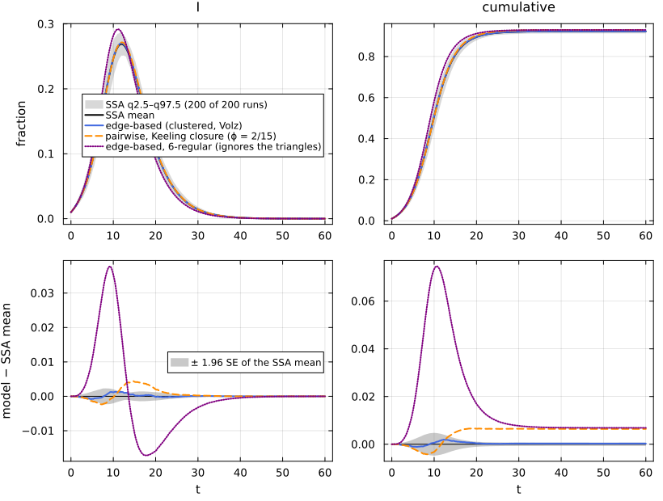
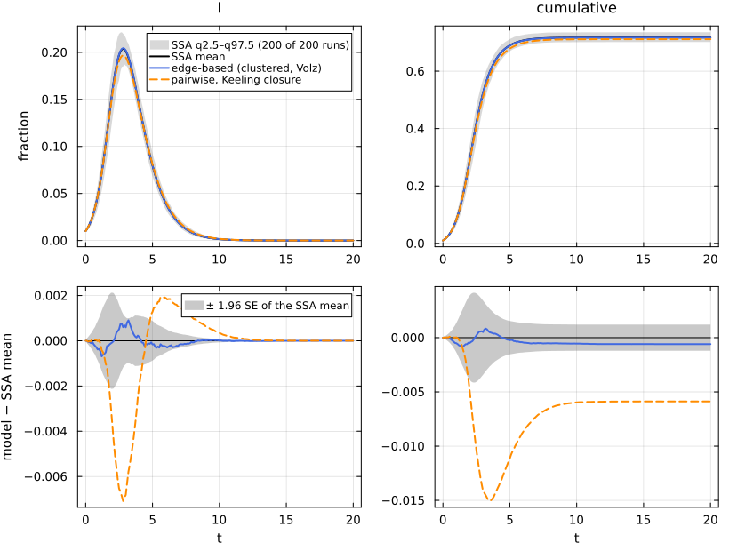
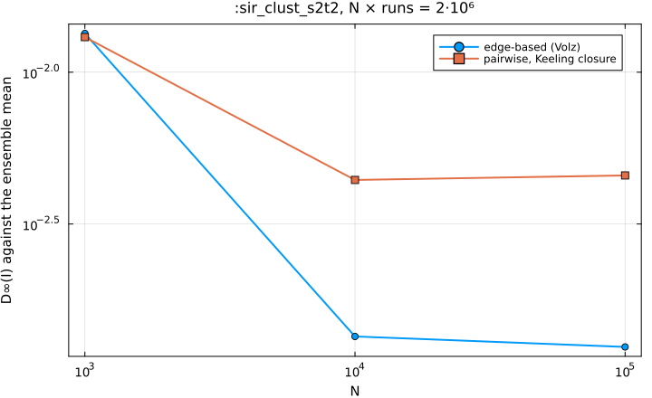
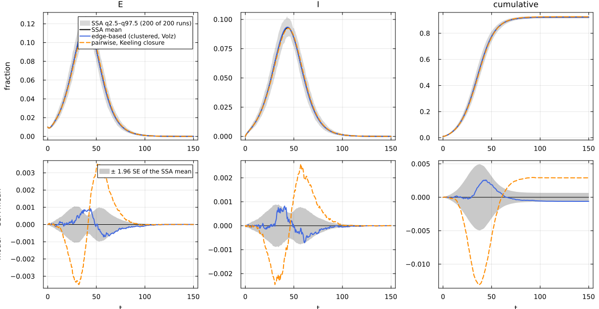
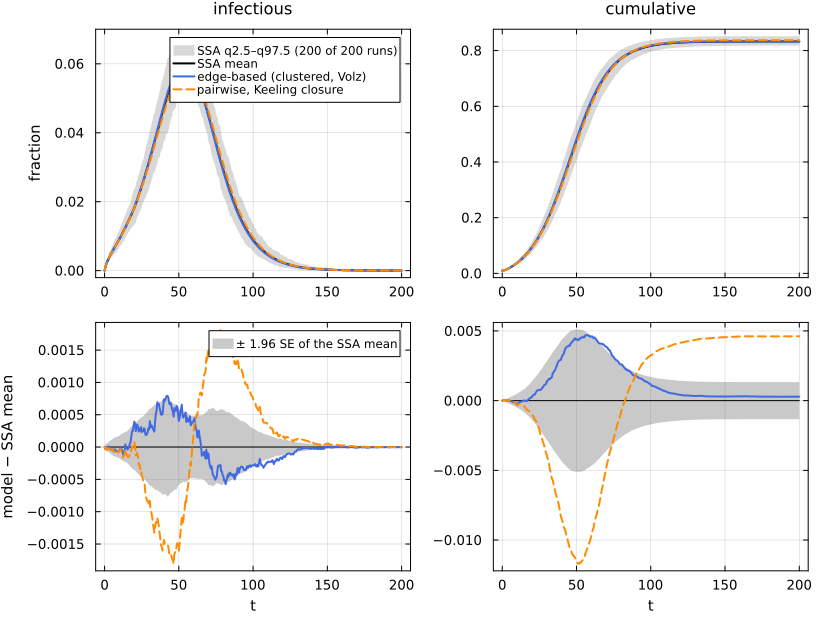

# E08. Clustered networks


- [Same degrees, with and without
  triangles](#same-degrees-with-and-without-triangles)
- [Low level and factory](#low-level-and-factory)
- [Clustering lowers R₀ and the
  epidemic](#clustering-lowers-r₀-and-the-epidemic)
- [Against simulation, and Keeling’s pairwise
  closure](#against-simulation-and-keelings-pairwise-closure)
- [A second clustered network: Poisson singles and
  triangles](#a-second-clustered-network-poisson-singles-and-triangles)
- [N-scaling](#n-scaling)
- [Beyond SIR: SEIR and SEAIR on
  triangles](#beyond-sir-seir-and-seair-on-triangles)
- [References](#references)

A configuration network is locally tree-like: two neighbours of a node
are almost never neighbours of each other. Real contact networks have
triangles. The Newman–Miller clustered configuration model gives each
node s single stubs and t triangle corners, with (s, t) drawn from a
joint law, and joins single stubs in pairs and corners in threes (Newman
2009; Miller 2009). Volz, Miller, Galvani and Ancel Meyers extended the
edge-based model to it (Volz et al. 2011): besides θ₂, the probability
that a single edge has not transmitted to a test node, it follows θ₃,
the probability that neither partner of a triangle has, and the pair
states of the two partners of a triangle, which are what the triangle
couples. This page lifts SIR onto two clustered networks and compares
with NetworkOutbreaks, which samples the same clustered graphs; it
compares with Keeling’s clustered pairwise closure (Keeling 1999); and
it lifts SEIR and SEAIR, whose clustered lift uses the same per-reaction
construction.

``` julia
include(joinpath(@__DIR__, "..", "_shared", "setup.jl"))
using NetworkEpiCore, NetworkOutbreaks, Catalyst, Plots
using EdgeBasedModels, NodeBasedModels
using Statistics
sir = @reaction_network sir begin
    @parameters τ γ
    τ, S + I --> 2I
    γ, I --> R
end
model = contact_model(sir)
sc  = scenario(:sir_clust_s2t2)       # s = 2 single edges and t = 2 triangles per node: degree 6
sc6 = scenario(:sir_reg6)             # the same degree, no triangles
@assert isequivalent(model, sc.model) && isequivalent(model, sc6.model)
sc.network
```

    ClusteredNetwork{Tuple{RegularDegree, RegularDegree}}(ClusteredDegree{Tuple{RegularDegree, RegularDegree}}((RegularDegree(2), RegularDegree(2))))

## Same degrees, with and without triangles

Every node of `:sir_clust_s2t2` has 2 single edges and 2 triangles, so
degree k = s + 2t = 6, the same as the 6-regular network of `:sir_reg6`.
The descriptor gives the clustering coefficient (transitivity) C =
2E\[t\]/E\[k(k − 1)\] and the fraction of edges in triangles; the
NetworkOutbreaks summaries record what the sampled graphs realise:

``` julia
ref  = scenario_summary(sc)
ref6 = scenario_summary(sc6)
netrow(s, r) = (string("`:", s.id, "`"), mean_degree(s.network), excess_degree(s.network),
    s.network isa ClusteredNetwork ? clustering_coefficient(s.network) : 0.0,
    s.network isa ClusteredNetwork ? triangle_edge_fraction(s.network) : 0.0,
    mean(r.realised[:mean_degree]), mean(r.realised[:clustering]))
mdtable(["scenario", "⟨k⟩", "κ_ex", "C (descriptor)", "fraction of edges in triangles", "⟨k⟩ realised",
         "C realised"], [netrow(sc, ref), netrow(sc6, ref6)])
```

| scenario | ⟨k⟩ | κ_ex | C (descriptor) | fraction of edges in triangles | ⟨k⟩ realised | C realised |
|---:|---:|---:|---:|---:|---:|---:|
| `:sir_clust_s2t2` | 6 | 5 | 0.1333 | 0.6667 | 5.998 | 0.1336 |
| `:sir_reg6` | 6 | 5 | 0 | 0 | 6 | 0.000412 |

## Low level and factory

``` julia
sys  = edge_based(model, sc.network)                         # low level
sysF = build_clustered_sir(sc.network, :τ, :γ)               # factory
@assert vector_fields_equal(symbolic_ode(sys), symbolic_ode(sysF))
symbolic_ode(sys)
```

    SymbolicODE :edge_based_model_edge_based (11 states)
      dθ₂/dt = -φ2_I(t)*τ
      dθ₃/dt = -2(φ3_I_I(t) + φ3_I_R(t) / 2 + q_S*χ_I(t)*(θ₂(t)^2)*θ₃(t))*τ
      dφ2_I/dt = -φ2_I(t)*γ - φ2_I(t)*τ + (1//2)*q_S*(2(θ₃(t)^2)*φ2_I(t)*τ + 8(φ3_I_I(t) + φ3_I_R(t) / 2 + q_S*χ_I(t)*(θ₂(t)^2)*θ₃(t))*θ₂(t)*θ₃(t)*τ)
      dφ2_R/dt = φ2_I(t)*γ
      dpop_I/dt = -pop_I(t)*γ + q_S*(2θ₂(t)*(θ₃(t)^2)*φ2_I(t)*τ + 4(φ3_I_I(t) + φ3_I_R(t) / 2 + q_S*χ_I(t)*(θ₂(t)^2)*θ₃(t))*(θ₂(t)^2)*θ₃(t)*τ)
      dpop_R/dt = pop_I(t)*γ
      dχ_I/dt = -χ_I(t)*γ - 2χ_I(t)*τ + (1//2)*q_S*(4θ₂(t)*θ₃(t)*φ2_I(t)*τ + 4(φ3_I_I(t) + φ3_I_R(t) / 2 + q_S*χ_I(t)*(θ₂(t)^2)*θ₃(t))*(θ₂(t)^2)*τ)
      dχ_R/dt = χ_I(t)*γ
      dφ3_I_I/dt = -2φ3_I_I(t)*γ - 2φ3_I_I(t)*τ + (2//1)*q_S*χ_I(t)*(θ₂(t)^2)*θ₃(t)*τ + q_S*(4θ₂(t)*θ₃(t)*φ2_I(t)*τ + 4(φ3_I_I(t) + φ3_I_R(t) / 2 + q_S*χ_I(t)*(θ₂(t)^2)*θ₃(t))*(θ₂(t)^2)*τ)*χ_I(t)
      dφ3_I_R/dt = 2φ3_I_I(t)*γ - φ3_I_R(t)*γ - φ3_I_R(t)*τ + q_S*(4θ₂(t)*θ₃(t)*φ2_I(t)*τ + 4(φ3_I_I(t) + φ3_I_R(t) / 2 + q_S*χ_I(t)*(θ₂(t)^2)*θ₃(t))*(θ₂(t)^2)*τ)*χ_R(t)
      dφ3_R_R/dt = φ3_I_R(t)*γ
      parameters  τ, q_S, γ
      domain      θ₂ ∈ (0.05, 1.0)
      domain      θ₃ ∈ (0.05, 1.0)

The coordinates are θ₂ and θ₃; φ2_X, the single edges whose partner is
in X and has not transmitted; and φ3_X_Y, the triangles whose two
partners are in X and Y, neither having transmitted. The susceptible
node fraction is S = q g(θ₂, θ₃), with g the joint PGF of (s, t) (here
g(x, y) = x²y²). The table of per-reaction contributions shows how one
reaction moves the triangle pair states:

``` julia
lift_contributions(model, sc.network)
```

    LiftContributions :sir on NetworkEpiCore.ClusteredNetwork(NetworkEpiCore.ClusteredDegree((NetworkEpiCore.RegularDegree(2), NetworkEpiCore.RegularDegree(2))))  (clustered closure)
      coordinates  θ₂, θ₃, ξ, φ2_I, φ2_R, pop_I, pop_R, χ_I, χ_R, φ3_I_I, φ3_I_R, φ3_R_R
      seed factors q_S (initially susceptible fraction of S)
      [1] S + I → 2I  (τ)   contact
            θ₂'      += -φ2_I*τ
            φ2_I'    += -φ2_I*τ + (1/2)*q_S*(2(θ₃^2)*φ2_I*τ + 8(φ3_I_I + φ3_I_R / 2 + q_S*χ_I*(θ₂^2)*θ₃*ξ)*θ₂*θ₃*τ)*ξ
            θ₃'      += -2(φ3_I_I + φ3_I_R / 2 + q_S*χ_I*(θ₂^2)*θ₃*ξ)*τ
            pop_I'   += q_S*(2θ₂*(θ₃^2)*φ2_I*τ + 4(φ3_I_I + φ3_I_R / 2 + q_S*χ_I*(θ₂^2)*θ₃*ξ)*(θ₂^2)*θ₃*τ)*ξ
            χ_I'     += -2χ_I*τ + (1/2)*q_S*(4θ₂*θ₃*φ2_I*τ + 4(φ3_I_I + φ3_I_R / 2 + q_S*χ_I*(θ₂^2)*θ₃*ξ)*(θ₂^2)*τ)*ξ
            φ3_I_I'  += -2φ3_I_I*τ + 2*q_S*χ_I*(θ₂^2)*θ₃*ξ*τ + q_S*(4θ₂*θ₃*φ2_I*τ + 4(φ3_I_I + φ3_I_R / 2 + q_S*χ_I*(θ₂^2)*θ₃*ξ)*(θ₂^2)*τ)*χ_I*ξ
            φ3_I_R'  += -φ3_I_R*τ + q_S*(4θ₂*θ₃*φ2_I*τ + 4(φ3_I_I + φ3_I_R / 2 + q_S*χ_I*(θ₂^2)*θ₃*ξ)*(θ₂^2)*τ)*χ_R*ξ
      [2] I → R  (γ)   progress
            φ2_I'    += -φ2_I*γ
            φ2_R'    += φ2_I*γ
            pop_I'   += -pop_I*γ
            pop_R'   += pop_I*γ
            χ_I'     += -χ_I*γ
            χ_R'     += χ_I*γ
            φ3_I_I'  += -2φ3_I_I*γ
            φ3_I_R'  += 2φ3_I_I*γ - φ3_I_R*γ
            φ3_R_R'  += φ3_I_R*γ

The transition I → R moves a partner from I to R in every triangle state
that contains it; this coupling is why the clustered lift is only lax
under gluing (E12). The coordinates still satisfy conservation laws,
which hold along the solution to solver tolerance:

``` julia
# The clustered lifts have 17 (SEIR) to 24 (SEAIR) states; the default tolerances leave solver
# errors of order 1e-4 in the final size, so every clustered solve on this page is tightened.
tight = (reltol = 1e-10, abstol = 1e-12)
sol = solve_epidemic(sys, sc; tight...)
c(X) = compartment(sys, sol, X)
θ2_defect = maximum(abs.(c(:θ₂) .- c(:φ2_S) .- c(:φ2_I) .- c(:φ2_R)))
node_defect = maximum(abs.(c(:S) .+ c(:pop_I) .+ c(:pop_R) .- 1))
@printf("max |θ₂ − φ2_S − φ2_I − φ2_R| = %.1e,  max |S + I + R − 1| = %.1e\n", θ2_defect, node_defect)
```

    max |θ₂ − φ2_S − φ2_I − φ2_R| = 1.3e-15,  max |S + I + R − 1| = 2.4e-15

## Clustering lowers R₀ and the epidemic

In a triangle the two partners of an infected node are also neighbours
of each other, so some of its transmissions are wasted on a node that
its other partner has already infected. The tree-of-triangles branching
process of Volz et al. gives R₀:

``` julia
R0c = basic_reproduction_number(sys; p = sc.params)
R06 = basic_reproduction_number(model, sc6.network, sc6.params)
sys6 = edge_based(model, sc6.network)
@assert vector_fields_equal(symbolic_ode(sys6), symbolic_ode(build_sir(RegularDegree(6), :τ, :γ)))
det  = model_curves(sys, sol; t = sc.tgrid, label = "edge-based (clustered, Volz)")
det6 = model_curves(sys6, solve_epidemic(sys6, sc6; tight...); t = sc6.tgrid, label = "edge-based (6-regular, no triangles)")
pk(d) = (i = argmax(d[:I]); (d[:I][i], d.t[i]))
mdtable(["network", "R₀", "peak I", "t(peak)", "R(60)"],
        [("clustered (2, 2)", R0c, pk(det)..., det[:cumulative][end]),
         ("6-regular", R06, pk(det6)..., det6[:cumulative][end])])
```

|          network |    R₀ | peak I | t(peak) |  R(60) |
|-----------------:|------:|-------:|--------:|-------:|
| clustered (2, 2) | 1.844 | 0.2703 |      12 | 0.9229 |
|        6-regular |     2 | 0.2918 |      11 | 0.9295 |

## Against simulation, and Keeling’s pairwise closure

Keeling’s closure (NodeBasedModels `KeelingClosure`) corrects the
pairwise triple closure with the clustering coefficient ϕ = C of the
descriptor. It is an approximation; the edge-based model is the exact
large-N limit on this network. We also show the unclustered 6-regular
edge-based curve, to see how much of the difference the triangles make.

``` julia
pwk  = node_based(model, sc.network; closure = KeelingClosure())
detK = model_curves(pwk, solve_epidemic(pwk, sc; tight...); t = sc.tgrid, label = "pairwise, Keeling closure (ϕ = 2/15)")
det6x = ModelCurves(det6.t, Dict(k => copy(v) for (k, v) in det6.values);
                    label = "edge-based, 6-regular (ignores the triangles)", representation = :mean_field)
reference_note(sc, ref)
```

NetworkOutbreaks reference `:sir_clust_s2t2`: N = 10000, 200 runs (a
fresh graph per run), conditioned on MajorOutbreak(0.05); 200 major
runs, P(major) = 1.000 (95% CI 0.981–1.000).

``` julia
comparisonplot(ref, det, detK, det6x; observables = [:I, :cumulative], legend = :right)
```



``` julia
function rows_of(ref, curves...)
    cm = compare(ref, curves...; observables = [:I, :cumulative])
    [(d.label, cm[d.label, :I].D∞, cm[d.label, :I].z∞, cm[d.label, :cumulative].ΔR∞,
      @sprintf("[%.4f, %.4f]", cm[d.label, :cumulative].ΔR∞_ci...)) for d in curves]
end
mdtable(["model", "D∞(I)", "z∞(I)", "ΔR∞", "95% CI of ΔR∞"], rows_of(ref, det, detK, det6x))
```

| model | D∞(I) | z∞(I) | ΔR∞ | 95% CI of ΔR∞ |
|---:|---:|---:|---:|---:|
| edge-based (clustered, Volz) | 0.001348 | 2.046 | 0.0002995 | \[-0.0004, 0.0010\] |
| pairwise, Keeling closure (ϕ = 2/15) | 0.004417 | 7.354 | 0.006426 | \[0.0057, 0.0071\] |
| edge-based, 6-regular (ignores the triangles) | 0.03781 | 34.74 | 0.00688 | \[0.0062, 0.0076\] |

``` julia
cm6K = compare(ref, detK, det6x; observables = [:I])
@printf("D∞(I), 6-regular curve / Keeling's closure: %.2f\n", cm6K[det6x.label, :I].D∞ / cm6K[detK.label, :I].D∞)
```

    D∞(I), 6-regular curve / Keeling's closure: 8.56

The Volz model agrees with the ensemble within the `:exact_limit`
tolerances (0.005). Keeling’s closure overestimates the final size (ΔR∞
above, with a confidence interval that excludes 0). Ignoring the
triangles altogether is far worse in the prevalence curve (D∞(I) about
8.6 times Keeling’s, printed above), but not in the final size, where
the 6-regular curve’s ΔR∞ is of the same size as Keeling’s. On the
Poisson clustered network below, Keeling’s closure errs in the other
direction.

## A second clustered network: Poisson singles and triangles

`:sir_clust_pois12` has s ~ Poisson(1) single edges and t ~ Poisson(2)
triangles per node, with τ = 0.6 and γ = 1. It is the setting in which
the EdgeBasedModels 0.1 clustered code was checked and found wrong; the
scenario’s notes record the numbers of that check:

``` julia
scp = scenario(:sir_clust_pois12)
@assert isequivalent(model, scp.model)
sysp  = edge_based(model, scp.network)
sysPF = build_clustered_sir(scp.network, :τ, :γ)
@assert vector_fields_equal(symbolic_ode(sysp), symbolic_ode(sysPF))
refp = scenario_summary(scp)
println(scp.notes)
@printf("C = %.4f (realised %.4f), fraction of edges in triangles %.2f, R₀ (tree of triangles) = %.4f\n",
        clustering_coefficient(scp.network), mean(refp.realised[:clustering]), triangle_edge_fraction(scp.network),
        basic_reproduction_number(sysp; p = scp.params))
@printf("final size at 0.1%% seeds: %.4f\n",
        final_size(sysp; p = scp.params, initial = SeedFraction(:I => 1e-3), method = :ode))
```

    The w1 reference setting (at ρ = 10⁻³: SSA 0.7121 ± 0.0018, Volz 0.7125, the 0.1 code 0.7293); here with the canonical 1% seeds.
    C = 0.1379 (realised 0.1385), fraction of edges in triangles 0.80, R₀ (tree of triangles) = 2.0027
    final size at 0.1% seeds: 0.7125

``` julia
reference_note(scp, refp)
```

NetworkOutbreaks reference `:sir_clust_pois12`: N = 10000, 200 runs (a
fresh graph per run), conditioned on MajorOutbreak(0.05); 200 major
runs, P(major) = 1.000 (95% CI 0.981–1.000).

``` julia
detp  = model_curves(sysp, solve_epidemic(sysp, scp; tight...); t = scp.tgrid, label = "edge-based (clustered, Volz)")
pwkp  = node_based(model, scp.network; closure = KeelingClosure())
detKp = model_curves(pwkp, solve_epidemic(pwkp, scp; tight...); t = scp.tgrid, label = "pairwise, Keeling closure")
comparisonplot(refp, detp, detKp; observables = [:I, :cumulative], legend = :topright)
```



``` julia
mdtable(["model", "D∞(I)", "z∞(I)", "ΔR∞", "95% CI of ΔR∞"], rows_of(refp, detp, detKp))
```

|                        model |     D∞(I) | z∞(I) |        ΔR∞ |        95% CI of ΔR∞ |
|-----------------------------:|----------:|------:|-----------:|---------------------:|
| edge-based (clustered, Volz) | 0.0009024 | 1.769 | -0.0005942 |  \[-0.0018, 0.0006\] |
|    pairwise, Keeling closure |  0.007087 | 12.89 |  -0.005881 | \[-0.0071, -0.0047\] |

## N-scaling

`:sir_clust_s2t2` is also committed at N = 10³ (2000 runs) and N = 10⁵
(20 runs). An exact-in-the-limit model should approach the ensemble mean
as N grows; an approximation should level off at its own bias.

``` julia
nids = [:sir_clust_s2t2_N1000, :sir_clust_s2t2, :sir_clust_s2t2_N100000]
nrefs = Dict(id => scenario_summary(scenario(id)) for id in nids)
Markdown.MD([reference_note(scenario(id), nrefs[id]) for id in nids])
```

NetworkOutbreaks reference `:sir_clust_s2t2_N1000`: N = 1000, 2000 runs
(a fresh graph per run), conditioned on MajorOutbreak(0.05); 2000 major
runs, P(major) = 1.000 (95% CI 0.998–1.000).

NetworkOutbreaks reference `:sir_clust_s2t2`: N = 10000, 200 runs (a
fresh graph per run), conditioned on MajorOutbreak(0.05); 200 major
runs, P(major) = 1.000 (95% CI 0.981–1.000).

NetworkOutbreaks reference `:sir_clust_s2t2_N100000`: N = 100000, 20
runs (a fresh graph per run), conditioned on MajorOutbreak(0.05); 20
major runs, P(major) = 1.000 (95% CI 0.839–1.000).

``` julia
nrows = map(nids) do id
    r = nrefs[id]; cm = compare(r, det, detK; observables = [:I, :cumulative])
    (r.N, r.nsims, mean(r.realised[:clustering]), mean(r.realised[:erased_fraction]),
     cm[det.label, :I].D∞, cm[detK.label, :I].D∞, cm[det.label, :cumulative].ΔR∞, cm[detK.label, :cumulative].ΔR∞)
end
mdtable(["N", "runs", "C realised", "erased edge fraction", "D∞(I) Volz", "D∞(I) Keeling", "ΔR∞ Volz", "ΔR∞ Keeling"], nrows)
```

| N | runs | C realised | erased edge fraction | D∞(I) Volz | D∞(I) Keeling | ΔR∞ Volz | ΔR∞ Keeling |
|---:|---:|---:|---:|---:|---:|---:|---:|
| 1000 | 2000 | 0.1365 | 0.002554 | 0.01341 | 0.01305 | 0.00242 | 0.008547 |
| 10000 | 200 | 0.1336 | 0.0002534 | 0.001348 | 0.004417 | 0.0002995 | 0.006426 |
| 100000 | 20 | 0.1334 | 2.567e-05 | 0.001245 | 0.004571 | 0.000206 | 0.006332 |

``` julia
Ns = [r[1] for r in nrows]
plot(Ns, [r[5] for r in nrows]; xscale = :log10, yscale = :log10, marker = :circle, label = "edge-based (Volz)",
     xlabel = "N", ylabel = "D∞(I) against the ensemble mean", title = ":sir_clust_s2t2, N × runs = 2·10⁶")
plot!(Ns, [r[6] for r in nrows]; marker = :square, label = "pairwise, Keeling closure")
```



From N = 10³ to 10⁵ the Volz model’s error falls by an order of
magnitude, while the Keeling closure’s levels off near 0.0045 in
prevalence and 0.006 in final size.

## Beyond SIR: SEIR and SEAIR on triangles

The clustered lift is built reaction by reaction, like the
configuration-model lift, so latency, branching and several infectors
are handled by the same code. SEIR has a factory; SEAIR is the Catalyst
network of E04, checked against the canned `seair_model()`:

``` julia
seir_rn = @reaction_network seir begin
    @parameters τ σ γ
    τ, S + I --> E + I
    σ, E --> I
    γ, I --> R
end
seair_rn = @reaction_network seair begin
    @parameters τI τA σ p γ
    τI, S + I --> E + I
    τA, S + A --> E + A
    p * σ, E --> I
    (1 - p) * σ, E --> A
    γ, I --> R
    γ, A --> R
end
sce, sca = scenario(:seir_clust_s2t2), scenario(:seair_clust_s2t2)
m_seir, m_seair = contact_model(seir_rn), contact_model(seair_rn)
@assert isequivalent(m_seir, sce.model) && isequivalent(m_seair, sca.model)
sys_e = edge_based(m_seir, sce.network)
@assert vector_fields_equal(symbolic_ode(sys_e), symbolic_ode(build_clustered_seir(sce.network, :σ, :τ, :γ)))
sys_a = edge_based(m_seair, sca.network)
@assert vector_fields_equal(symbolic_ode(sys_a), symbolic_ode(edge_based(seair_model(), sca.network)))
@printf("clustered lift: SEIR %d states, SEAIR %d states\n", length(symbolic_ode(sys_e).states),
        length(symbolic_ode(sys_a).states))
```

    clustered lift: SEIR 17 states, SEAIR 24 states

``` julia
refe, refa = scenario_summary(sce), scenario_summary(sca)
Markdown.MD([reference_note(sce, refe), reference_note(sca, refa)])
```

NetworkOutbreaks reference `:seir_clust_s2t2`: N = 10000, 200 runs (a
fresh graph per run), conditioned on MajorOutbreak(0.05); 200 major
runs, P(major) = 1.000 (95% CI 0.981–1.000).

NetworkOutbreaks reference `:seair_clust_s2t2`: N = 10000, 200 runs (a
fresh graph per run), conditioned on MajorOutbreak(0.05); 200 major
runs, P(major) = 1.000 (95% CI 0.981–1.000).

``` julia
dete  = model_curves(sys_e, solve_epidemic(sys_e, sce; tight...); t = sce.tgrid, label = "edge-based (clustered, Volz)")
pwke  = node_based(m_seir, sce.network; closure = KeelingClosure())
detKe = model_curves(pwke, solve_epidemic(pwke, sce; tight...); t = sce.tgrid, label = "pairwise, Keeling closure")
comparisonplot(refe, dete, detKe; observables = [:E, :I, :cumulative])
```



``` julia
deta  = model_curves(sys_a, solve_epidemic(sys_a, sca; tight...); t = sca.tgrid, label = "edge-based (clustered, Volz)")
pwka  = node_based(m_seair, sca.network; closure = KeelingClosure())
detKa = model_curves(pwka, solve_epidemic(pwka, sca; tight...); t = sca.tgrid, label = "pairwise, Keeling closure")
comparisonplot(refa, deta, detKa; observables = [:infectious, :cumulative])
```



``` julia
function rows_inf(ref, curves...)
    cm = compare(ref, curves...; observables = [:infectious, :cumulative])
    [(d.label, cm[d.label, :infectious].D∞, cm[d.label, :infectious].z∞, cm[d.label, :cumulative].ΔR∞,
      @sprintf("[%.4f, %.4f]", cm[d.label, :cumulative].ΔR∞_ci...)) for d in curves]
end
mdtable(["scenario and model", "D∞(infectious)", "z∞", "ΔR∞", "95% CI of ΔR∞"],
        vcat([(string("`:seir_clust_s2t2`, ", r[1]), r[2:end]...) for r in rows_inf(refe, dete, detKe)],
             [(string("`:seair_clust_s2t2`, ", r[1]), r[2:end]...) for r in rows_inf(refa, deta, detKa)]))
```

| scenario and model | D∞(infectious) | z∞ | ΔR∞ | 95% CI of ΔR∞ |
|---:|---:|---:|---:|---:|
| `:seir_clust_s2t2`, edge-based (clustered, Volz) | 0.0008204 | 2.443 | -0.0006017 | \[-0.0013, 0.0001\] |
| `:seir_clust_s2t2`, pairwise, Keeling closure | 0.002569 | 6.528 | 0.002913 | \[0.0022, 0.0036\] |
| `:seair_clust_s2t2`, edge-based (clustered, Volz) | 0.0007928 | 3.049 | 0.0002833 | \[-0.0010, 0.0016\] |
| `:seair_clust_s2t2`, pairwise, Keeling closure | 0.001819 | 6.234 | 0.004616 | \[0.0033, 0.0059\] |

For SEIR and SEAIR the clustered edge-based model stays within 0.005 of
the ensemble in the prevalence of infectious nodes and in the final
size, and Keeling’s closure again overestimates the final size.

## References

<div id="refs" class="references csl-bib-body hanging-indent">

<div id="ref-keeling1999effects" class="csl-entry">

Keeling, M. J. 1999. “The Effects of Local Spatial Structure on
Epidemiological Invasions.” *Proceedings of the Royal Society B* 266:
859–67. <https://doi.org/10.1098/rspb.1999.0716>.

</div>

<div id="ref-miller2009percolation" class="csl-entry">

Miller, Joel C. 2009. “Percolation and Epidemics in Random Clustered
Networks.” *Physical Review E* 80: 020901.
<https://doi.org/10.1103/PhysRevE.80.020901>.

</div>

<div id="ref-newman2009random" class="csl-entry">

Newman, M. E. J. 2009. “Random Graphs with Clustering.” *Physical Review
Letters* 103: 058701. <https://doi.org/10.1103/PhysRevLett.103.058701>.

</div>

<div id="ref-volz2011effects" class="csl-entry">

Volz, Erik M., Joel C. Miller, Alison Galvani, and Lauren Ancel Meyers.
2011. “Effects of Heterogeneous and Clustered Contact Patterns on
Infectious Disease Dynamics.” *PLoS Computational Biology* 7 (6):
e1002042. <https://doi.org/10.1371/journal.pcbi.1002042>.

</div>

</div>
