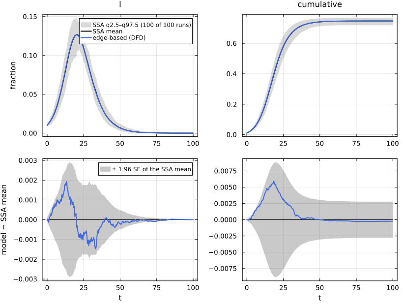
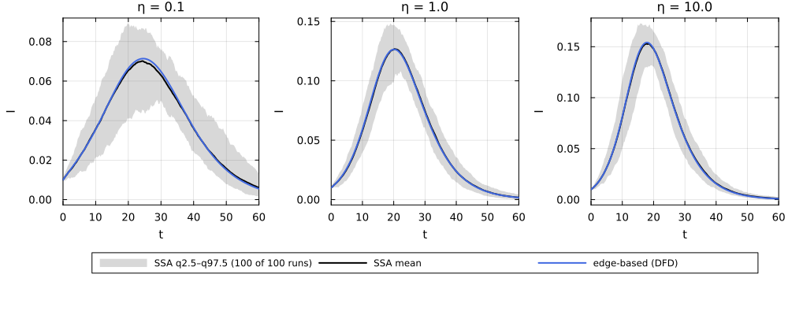
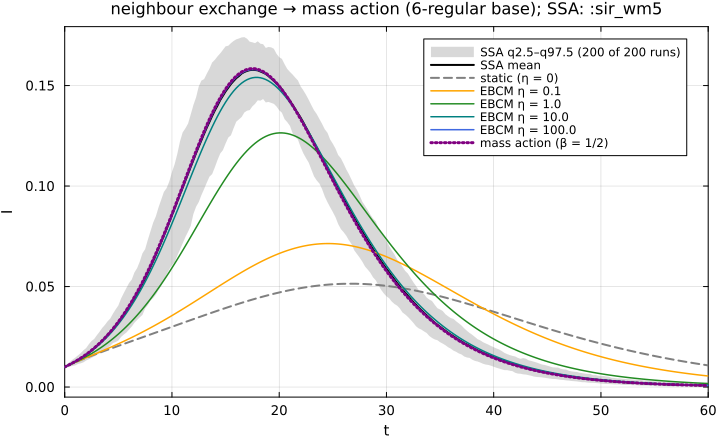
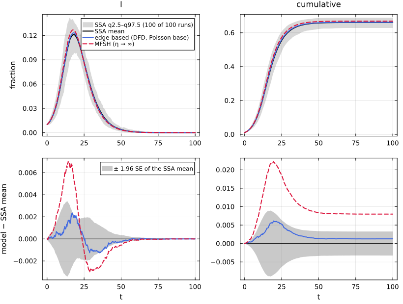

# E09. Dynamic partnerships


- [What this page shows](#what-this-page-shows)
- [The shared first cell](#the-shared-first-cell)
- [The lifted equations](#the-lifted-equations)
- [Against the swap process at η = 1](#against-the-swap-process-at-η--1)
- [The η-sweep](#the-η-sweep)
  - [R₀ as a function of η](#r₀-as-a-function-of-η)
- [The η → ∞ limit on a regular base: mass action,
  `:sir_wm5`](#the-η---limit-on-a-regular-base-mass-action-sir_wm5)
- [A Poisson base tends to MFSH, not to mass
  action](#a-poisson-base-tends-to-mfsh-not-to-mass-action)
- [Lean](#lean)
- [References](#references)

## What this page shows

In a static configuration network an infected node can only reach the
partners it had at the start. If partnerships are **exchanged** while
degrees stay fixed, an infected node keeps meeting new partners, and the
epidemic gets closer to the well-mixed one. Miller, Slim and Volz
(Miller et al. 2012) give an exact edge-based model for this *dynamic
fixed-degree* (DFD) network. Two edges (u, v) and (x, y) break at rate η
and reform as (u, y) and (x, v), so every node keeps its degree.
EdgeBasedModels lifts any T_EB reaction network to it with
`edge_based(model, DynamicNetwork(base, NeighbourExchange(η)))`.

The page:

1.  builds the model twice, from a Catalyst reaction network and with
    the factory, and prints the lifted equations;
2.  compares the EBCM with NetworkOutbreaks’ exact simulation of the
    swap process at η = 0.1, 1 and 10 on a 6-regular base;
3.  shows that as η grows the model tends to mass action with β = 6τ,
    which is the well-mixed scenario `:sir_wm5`;
4.  explains why on a Poisson base it tends to a *different* limit, the
    mean-field social heterogeneity (MFSH) model of
    [E16](../E16_dormant_fleeting/index.md).

## The shared first cell

``` julia
include(joinpath(@__DIR__, "..", "_shared", "setup.jl"))
using Statistics
using NetworkEpiCore, NetworkOutbreaks, Catalyst, Plots
sir = @reaction_network sir begin
    @parameters τ γ
    τ, S + I --> 2I        # contact: per-contact (per-edge) rate τ; S converted, I unchanged
    γ, I --> R             # node-local transition
end
model = contact_model(sir)          # prints the typing report
sc    = scenario(:sir_ne_reg6_eta1) # 6-regular base, neighbour exchange η = 1, τ = 1/12, γ = 1/4
@assert isequivalent(model, sc.model)
ref   = scenario_summary(sc)        # committed NetworkOutbreaks ensemble of the swap process
# --- EBM vignette ---------------------------------------------------------------
using EdgeBasedModels
sys   = edge_based(model, sc.network)                      # low level
sysF  = build_sir(sc.network, :τ, :γ)                      # factory
@assert vector_fields_equal(symbolic_ode(sys), symbolic_ode(sysF))
lift_contributions(model, sc.network)                      # per-reaction terms, plus the exchange process
```

    LiftContributions :sir on NetworkEpiCore.DynamicNetwork(NetworkEpiCore.ConfigurationNetwork(NetworkEpiCore.RegularDegree(6)), NetworkEpiCore.NeighbourExchange(1.0))  (dynamic closure)
      coordinates  θ, ξ, χ, φ_I, φ_R, π_I, π_R, pop_I, pop_R
      seed factors q_S (initially susceptible fraction of S)
      [1] S + I → 2I  (τ)   contact
            θ'      += -φ_I*τ
            φ_I'    += -φ_I*τ
            φ_I'    += 5*q_S*χ*(θ^4)*φ_I*ξ*τ
            π_I'    += 6*q_S*(θ^5)*φ_I*ξ*τ
            pop_I'  += 6q_S*(θ^5)*φ_I*ξ*τ
      [2] I → R  (γ)   progress
            φ_I'    += -φ_I*γ
            φ_R'    += φ_I*γ
            π_I'    += -π_I*γ
            π_R'    += π_I*γ
            pop_I'  += -pop_I*γ
            pop_R'  += pop_I*γ
      [3] neighbour exchange  (1.0)   process
            χ'      += -χ + θ^2
            φ_I'    += -φ_I + π_I*θ
            φ_R'    += -φ_R + π_R*θ

The typing report of the model, and the scenario:

``` julia
model
```

    ContactModel :sir  (source: Catalyst.ReactionSystem; method: stoichiometry; rates: PerContact)
      species       S (Sus)   I   R
      contacts      [1] S + I → I + I    τ    contact     infector I, entry I
      transitions   [2] I → R            γ    progress
      typing        T_EB  ⇒  edge_based ✓  s_anchored ✓  pairwise ✓  individual ✓  pair ✓  stochastic ✓  mass_action ✓
      assumptions   Sus inferred as recipients \ contact products = {S}

``` julia
println(sc.title)
println("network: ", sc.network)
println("parameters: ", sort(collect(sc.params); by = first))
println("seeding: ", sc.initial, ";  t ∈ ", sc.tspan)
```

    SIR on a 6-regular network with neighbour exchange η = 1.0
    network: DynamicNetwork{NeighbourExchange{Float64}}(ConfigurationNetwork{RegularDegree}(RegularDegree(6)), NeighbourExchange{Float64}(1.0))
    parameters: [:γ => 0.25, :τ => 0.08333333333333333]
    seeding: SeedFraction([:I => 0.01], nothing);  t ∈ (0.0, 100.0)

The per-contact rate is τ = 1/12 here, half the canonical 1/6. With τ =
1/6 the η → ∞ limit would be mass action with β = 6τ = 1, R₀ = 4. At τ =
1/12 the limit is β = 1/2, γ = 1/4, which is exactly `:sir_wm5` (R₀ =
2).

## The lifted equations

The table above lists the terms each reaction contributes; the neighbour
exchange appears as a third row of type `process`. The coordinates are:

- θ, the probability that a random partner has not yet transmitted along
  its current edge;
- φ_X, the probability that the partner is in state X and has not
  transmitted;
- χ, which carries the part of φ_S that edges re-formed since t = 0
  contribute (the base-network factor is ψ′(θ)/ψ′(1));
- π_X, the probability that the node at the end of a random *stub* is in
  state X. A stub keeps its node while its partner changes, so after an
  exchange the new partner is in state X with probability π_X.

The expanded vector field, symbolically, is:

``` julia
symbolic_ode(sys)
```

    SymbolicODE :edge_based_model_edge_based (8 states)
      dθ/dt = -φ_I(t)*τ
      dχ/dt = -χ(t) + θ(t)^2
      dφ_I/dt = -φ_I(t) + π_I(t)*θ(t) - φ_I(t)*γ - φ_I(t)*τ + (5//1)*q_S*χ(t)*(θ(t)^4)*φ_I(t)*τ
      dφ_R/dt = -φ_R(t) + π_R(t)*θ(t) + φ_I(t)*γ
      dπ_I/dt = -π_I(t)*γ + (6//1)*q_S*(θ(t)^5)*φ_I(t)*τ
      dπ_R/dt = π_I(t)*γ
      dpop_I/dt = -pop_I(t)*γ + 6q_S*(θ(t)^5)*φ_I(t)*τ
      dpop_R/dt = pop_I(t)*γ
      parameters  τ, γ, q_S
      domain      θ ∈ (0.05, 1.0)

At η = 1 the exchange terms are −χ + θ², −φ_X + θπ_X. A broken edge is
replaced by a new edge whose partner is a random stub, which has not
transmitted with probability θ. This is MSV’s DFD system;
EdgeBasedModels’ test suite checks it symbolically against a hand
transcription of their equations (Part I §3.2). The node observables are
S = q_S ψ(θ), pop_I and pop_R, where the seed factor q_S is the
initially susceptible fraction.

## Against the swap process at η = 1

``` julia
sol = solve_epidemic(sys, sc)                              # p, initial, tspan, saveat from the scenario
det = model_curves(sys, sol; t = sc.tgrid, label = "edge-based (DFD)")
comparisonplot(ref, det; observables = [:I, :cumulative])
```



``` julia
reference_note(sc, ref)
```

NetworkOutbreaks reference `:sir_ne_reg6_eta1`: N = 5000, 100 runs (a
fresh graph per run), conditioned on MajorOutbreak(0.05); 100 major
runs, P(major) = 1.000 (95% CI 0.963–1.000).

``` julia
tab = compare(ref, det)
```

    ComparisonTable :sir_ne_reg6_eta1  (scenario c77453d7; conditioned mean of 100 runs)
      curve             observable        D∞     t(D∞)       SE∞        z∞       ΔR∞  95% CI                 Δpeak   Δt_peak  coverage
      edge-based (DFD)  S            0.00591     18.50   0.00452      1.75  -0.00024  [-0.00302,  0.00254]   0.00000      0.00     1.000
      edge-based (DFD)  I            0.00193     13.25   0.00149      1.64  -0.00024  [-0.00302,  0.00254]  -0.00039      0.00     1.000
      edge-based (DFD)  R            0.00537     19.00   0.00405      1.84  -0.00024  [-0.00302,  0.00254]  -0.00024      1.50     1.000
      edge-based (DFD)  infectious   0.00193     13.25   0.00149      1.64  -0.00024  [-0.00302,  0.00254]  -0.00039      0.00     1.000
      edge-based (DFD)  cumulative   0.00591     18.50   0.00452      1.75  -0.00024  [-0.00302,  0.00254]  -0.00024      1.75     1.000

At η = 1 the largest gap between the EBCM prevalence and the ensemble
mean is D∞(I) = 0.0019 (z∞ = 1.64), and the final-size difference is ΔR∞
= -0.0002 (95% CI -0.0030 to +0.0025).

The shared recipe `comparisonplot` styles every curve by its
representation, so two edge-based curves would come out in the same
colour. `style_curves!` gives each curve of a comparison figure its own
colour and dash, in the order the curves were passed:

``` julia
"""
    style_curves!(p, styles) -> p

Give the model curves of a `comparisonplot` figure `p` their own line colours and styles.
`styles` holds one `(linecolor, linestyle)` pair per curve, in the order the curves were passed.
The recipe draws the curves last in every panel, so they are the last `length(styles)` series of
each subplot; the labels of the first panel are checked against `labels`.
"""
function style_curves!(p, styles, labels)
    n = length(styles)
    first_labels = [s[:label] for s in p.subplots[1].series_list[end-n+1:end]]
    first_labels == collect(labels) ||
        error("style_curves!: the last series of the first panel are $(first_labels), not $(labels)")
    for sp in p.subplots, (k, (lc, ls)) in enumerate(styles)
        s = sp.series_list[end-n+k]
        s[:linecolor] = Plots.plot_color(lc)
        s[:linestyle] = ls
    end
    return p
end
```

    Main.Notebook.style_curves!

## The η-sweep

The three committed scenarios differ only in η. For each we lift the
same `model`, solve, and compare with its own NetworkOutbreaks ensemble.

``` julia
ids = [:sir_ne_reg6_eta01, :sir_ne_reg6_eta1, :sir_ne_reg6_eta10]
sweep = map(ids) do id
    s = scenario(id)
    @assert isequivalent(model, s.model)
    r = scenario_summary(s)
    y = edge_based(model, s.network)
    c = model_curves(y, solve_epidemic(y, s); t = s.tgrid, label = "EBCM η = $(s.network.process.η)")
    (; id, sc = s, ref = r, sys = y, curves = c, table = compare(r, c))
end
plts = map(sweep) do w
    η = w.sc.network.process.η
    p = plot(w.ref, :I; median = false, title = "η = $(η)", legend = false, xlabel = "t", ylabel = "I")
    plot!(p, w.curves, :I; label = "edge-based (DFD)")
    xlims!(p, 0, 60)
end
# one legend for the three panels, in its own strip under them
leg = plot(sweep[1].ref, :I; median = false, framestyle = :none, legend = :top, legend_columns = 3,
           xlims = (-2, -1), ylims = (-2, -1), xlabel = "", ylabel = "")
plot!(leg, sweep[1].curves, :I; label = "edge-based (DFD)")
plot(plts..., leg; layout = @layout([a b c; d{0.12h}]), size = (1000, 400),
     left_margin = 5Plots.mm, bottom_margin = 4Plots.mm)
```



``` julia
for w in sweep
    display(reference_note(w.sc, w.ref))
end
```

NetworkOutbreaks reference `:sir_ne_reg6_eta01`: N = 5000, 100 runs (a
fresh graph per run), conditioned on MajorOutbreak(0.05); 100 major
runs, P(major) = 1.000 (95% CI 0.963–1.000).

NetworkOutbreaks reference `:sir_ne_reg6_eta1`: N = 5000, 100 runs (a
fresh graph per run), conditioned on MajorOutbreak(0.05); 100 major
runs, P(major) = 1.000 (95% CI 0.963–1.000).

NetworkOutbreaks reference `:sir_ne_reg6_eta10`: N = 5000, 100 runs (a
fresh graph per run), conditioned on MajorOutbreak(0.05); 100 major
runs, P(major) = 1.000 (95% CI 0.963–1.000).

``` julia
rows = map(sweep) do w
    η = w.sc.network.process.η
    row = w.table[w.curves.label, :I]
    R∞_eb = w.curves[:cumulative][end]
    R∞_no = mean(w.ref.final_size[w.ref.major])
    (η, w.sc.expected[:R0], R∞_eb, R∞_no, row.D∞, row.z∞, row.ΔR∞)
end
mdtable(["η", "R₀", "R∞ (EBCM)", "R∞ (NO, major runs)", "D∞(I)", "z∞(I)", "ΔR∞"], rows)
```

|   η |    R₀ | R∞ (EBCM) | R∞ (NO, major runs) |    D∞(I) | z∞(I) |        ΔR∞ |
|----:|------:|----------:|--------------------:|---------:|------:|-----------:|
| 0.1 | 1.423 |    0.5835 |              0.5815 | 0.002161 | 2.616 |   0.002023 |
|   1 | 1.812 |    0.7469 |              0.7472 | 0.001927 | 1.636 | -0.0002362 |
|  10 | 1.976 |    0.7939 |              0.7947 | 0.002067 |  3.82 | -0.0007482 |

The `:exact_limit` criteria of the validation protocol are D∞(I) \<
0.005 and \|ΔR∞\| \< 0.005 (see [E14](../E14_validation/index.md)).
Whether every row meets them, and the largest z∞:

``` julia
(; all_pass = all(r -> r[5] < 0.005 && abs(r[7]) < 0.005, rows), max_z = maximum(r -> r[6], rows))
```

    (all_pass = true, max_z = 3.819781544761488)

z∞ divides by the pointwise standard error of a mean of only 100 runs (N
= 5000), so a z∞ of about 3 to 4 at one of 401 grid points corresponds
to an absolute gap of about 0.002.

### R₀ as a function of η

MSV give the reproduction number of the DFD model in closed form
\[Miller et al. (2012); arXiv:1106.6320 §3.2.1\]: R₀ = τ/(τ + η + γ) ·
(η/γ + (η + γ)/γ · κ_ex), with κ_ex = ⟨k(k−1)⟩/⟨k⟩ the excess degree (5
on the 6-regular base). The registry’s R₀ is computed by
NetworkEpiCore’s next-generation engine, and EdgeBasedModels’ is the
next-generation matrix of the lifted ODE:

``` julia
msv_R0(τ, γ, η, κ) = τ / (τ + η + γ) * (η / γ + (η + γ) / γ * κ)
κ = excess_degree(sc.network.base)
rows = map(sweep) do w
    η = w.sc.network.process.η
    (η, msv_R0(w.sc.params[:τ], w.sc.params[:γ], η, κ), w.sc.expected[:R0],
     basic_reproduction_number(w.sys; p = w.sc.params))
end
mdtable(["η", "R₀ (MSV closed form)", "R₀ (NetworkEpiCore NGM)", "R₀ (EBCM)"], rows)
```

|   η | R₀ (MSV closed form) | R₀ (NetworkEpiCore NGM) | R₀ (EBCM) |
|----:|---------------------:|------------------------:|----------:|
| 0.1 |                1.423 |                   1.423 |     1.423 |
|   1 |                1.812 |                   1.812 |     1.812 |
|  10 |                1.976 |                   1.976 |     1.976 |

## The η → ∞ limit on a regular base: mass action, `:sir_wm5`

On a k-regular base every node has the same degree, so once partners are
reshuffled infinitely fast a node’s k contacts are a random sample of
the population. The limit is mass action with β = kτ (MSV Part II; the
Λ3 road in DESIGN §D.5). Here that is β = 6/12 = 1/2 with γ = 1/4, which
is exactly the scenario `:sir_wm5` (a `WellMixed(5)` network with τ =
1/10, i.e. β = 5τ).

We solve the DFD model for larger η (no simulation needed) and measure
its distance from the edge-based model on `WellMixed(5)`, which by the
unit law is mass action:

``` julia
wm = scenario(:sir_wm5)
@assert isequivalent(model, wm.model)
refwm = scenario_summary(wm)
syswm = edge_based(model, wm.network)
detwm = model_curves(syswm, solve_epidemic(syswm, wm; reltol = 1e-10, abstol = 1e-12); t = wm.tgrid,
                     label = "mass action (β = 1/2)")

base = ConfigurationNetwork(RegularDegree(6))
# the settings of `sc` (τ = 1/12, γ = 1/4, 1% seeds in I) on the grid of :sir_wm5
function ne_curves(net, label)
    y = edge_based(model, net)
    s = solve_epidemic(y; p = sc.params, initial = sc.initial, tspan = wm.tspan, saveat = wm.tgrid,
                       reltol = 1e-10, abstol = 1e-12)
    model_curves(y, s; t = wm.tgrid, label)
end
dfd_curves(η) = ne_curves(DynamicNetwork(base, NeighbourExchange(η)), "EBCM η = $(η)")
static = ne_curves(base, "static (η = 0)")
ηs = [0.1, 1.0, 10.0, 100.0, 1000.0]
limit = [dfd_curves(η) for η in ηs]
gap(c) = maximum(abs.(c[:I] .- detwm[:I]))
rows = vcat([(0.0, static[:cumulative][end], gap(static))],
            [(η, c[:cumulative][end], gap(c)) for (η, c) in zip(ηs, limit)])
push!(rows, (Inf, detwm[:cumulative][end], 0.0))
mdtable(["η", "R(60)", "largest gap in I to mass action"], rows)
```

|    η |  R(60) | largest gap in I to mass action |
|-----:|-------:|--------------------------------:|
|    0 | 0.5092 |                          0.1153 |
|  0.1 | 0.5763 |                          0.0997 |
|    1 | 0.7454 |                         0.04457 |
|   10 | 0.7936 |                        0.006803 |
|  100 | 0.7991 |                       0.0007184 |
| 1000 | 0.7996 |                       7.224e-05 |
|  Inf | 0.7997 |                               0 |

The factor by which the gap shrinks per tenfold increase of η (for η =
0.1 → 1, 1 → 10, 10 → 100 and 100 → 1000):

``` julia
[gap(limit[i]) / gap(limit[i + 1]) for i in 1:length(ηs) - 1]
```

    4-element Vector{Float64}:
     2.237106152193629
     6.550796156945916
     9.470086349120622
     9.945000138719085

The factors approach 10 for large η, so the distance to mass action
decays like 1/η. (The solves use tolerances 10⁻¹⁰/10⁻¹² so that the
solver error stays below the η = 1000 gap.)

``` julia
p = plot(refwm, :I; median = false, legend = :topright,
         title = "neighbour exchange → mass action (6-regular base); SSA: :sir_wm5")
plot!(p, static, :I; linecolor = :gray, linestyle = :dash)
for (c, col) in zip(limit[1:4], [:orange, :forestgreen, :teal, :royalblue])
    plot!(p, c, :I; linecolor = col, linestyle = :solid, linewidth = 1.5)
end
plot!(p, detwm, :I; linecolor = :purple, linestyle = :dot, linewidth = 3)
xlims!(p, 0, 60)
```



The η = 1000 EBCM is compared directly with the committed *mass-action*
ensemble of `:sir_wm5` (NetworkOutbreaks’ `MassActionSSA`):

``` julia
reference_note(wm, refwm)
```

NetworkOutbreaks reference `:sir_wm5`: N = 10000, 200 runs (a fresh
graph per run), conditioned on MajorOutbreak(0.05); 200 major runs,
P(major) = 1.000 (95% CI 0.981–1.000).

``` julia
compare(refwm, limit[end], detwm; observables = [:I, :cumulative])
```

    ComparisonTable :sir_wm5  (scenario 6e8fb963; conditioned mean of 200 runs)
      curve                  observable        D∞     t(D∞)       SE∞        z∞       ΔR∞  95% CI                 Δpeak   Δt_peak  coverage
      EBCM η = 1000.0        I            0.00136     14.25   0.00101      2.16  -0.00049  [-0.00170,  0.00072]   0.00057      0.00     0.954
      EBCM η = 1000.0        cumulative   0.00363     16.25   0.00267      1.48  -0.00049  [-0.00170,  0.00072]  -0.00049      0.00     1.000
      mass action (β = 1/2)  I            0.00143     14.25   0.00101      2.22  -0.00043  [-0.00164,  0.00078]   0.00062      0.00     0.929
      mass action (β = 1/2)  cumulative   0.00384     16.25   0.00267      1.57  -0.00043  [-0.00164,  0.00078]  -0.00043      0.00     1.000

## A Poisson base tends to MFSH, not to mass action

On a base whose degrees vary, fast exchange does *not* give mass action.
A node of degree k keeps k stubs, so it still meets k/⟨k⟩ times as many
partners per unit time as an average node. High-degree nodes are both
more likely to be infected and more infectious. MSV Part II call the η →
∞ limit *mean-field social heterogeneity* (MFSH); EdgeBasedModels has it
as `MFSHNetwork(d)` (see [E16](../E16_dormant_fleeting/index.md)). The
scenario `:sir_ne_pois5_eta10` is neighbour exchange at η = 10 on a
Poisson(5) base, with the same τ = 1/12 and γ = 1/4:

``` julia
sp = scenario(:sir_ne_pois5_eta10)
@assert isequivalent(model, sp.model)
refp = scenario_summary(sp)
sysp = edge_based(model, sp.network)
detp = model_curves(sysp, solve_epidemic(sysp, sp); t = sp.tgrid, label = "edge-based (DFD, Poisson base)")
mf = scenario(:sir_mfsh_pois5)
sysm = edge_based(model, mf.network)
detm = model_curves(sysm, solve_epidemic(sysm, mf); t = sp.tgrid, label = "MFSH (η → ∞)")
p = comparisonplot(refp, detp, detm; observables = [:I, :cumulative])
style_curves!(p, [(:royalblue, :solid), (:crimson, :dash)], [detp.label, detm.label])
```



``` julia
reference_note(sp, refp)
```

NetworkOutbreaks reference `:sir_ne_pois5_eta10`: N = 5000, 100 runs (a
fresh graph per run), conditioned on MajorOutbreak(0.05); 100 major
runs, P(major) = 1.000 (95% CI 0.963–1.000).

``` julia
compare(refp, detp, detm; observables = [:I, :cumulative])
```

    ComparisonTable :sir_ne_pois5_eta10  (scenario 48abf545; conditioned mean of 100 runs)
      curve                           observable        D∞     t(D∞)       SE∞        z∞       ΔR∞  95% CI                 Δpeak   Δt_peak  coverage
      edge-based (DFD, Poisson base)  I            0.00234     17.00   0.00174      2.16   0.00126  [-0.00200,  0.00453]   0.00195      0.00     0.968
      edge-based (DFD, Poisson base)  cumulative   0.00611     19.50   0.00456      1.62   0.00126  [-0.00200,  0.00453]   0.00126      4.50     1.000
      MFSH (η → ∞)                    I            0.00701     14.25   0.00174      5.28   0.00798  [ 0.00472,  0.01125]   0.00563     -0.50     0.536
      MFSH (η → ∞)                    cumulative   0.02225     19.50   0.00456      5.71   0.00798  [ 0.00472,  0.01125]   0.00798      4.50     0.010

The final sizes of the three limits:

``` julia
mdtable(["model", "R∞"],
        [("DFD η = 10, Poisson(5) base (EBCM)", detp[:cumulative][end]),
         ("NetworkOutbreaks, same scenario (major runs)", mean(refp.final_size[refp.major])),
         ("MFSH, Poisson(5) activity (η → ∞)", final_size(sysm; p = mf.params, initial = mf.initial)),
         ("mass action β = 5τ = 5/12 (what a naive limit would give)",
          final_size(edge_based(model, WellMixed(5.0)); p = Dict(:τ => 1 / 12, :γ => 1 / 4),
                     initial = sp.initial))])
```

|                                                     model |     R∞ |
|----------------------------------------------------------:|-------:|
|                        DFD η = 10, Poisson(5) base (EBCM) | 0.6619 |
|              NetworkOutbreaks, same scenario (major runs) | 0.6607 |
|                         MFSH, Poisson(5) activity (η → ∞) | 0.6687 |
| mass action β = 5τ = 5/12 (what a naive limit would give) | 0.6827 |

The mass-action row uses β = ⟨k⟩τ = 5/12. Its R₀ = β/γ and that of the
MFSH limit, τ(κ_ex + 1)/γ, are:

``` julia
(; mass_action = (5 / 12) / (1 / 4), MFSH_formula = mf.params[:τ] * (excess_degree(PoissonDegree(5)) + 1) / mf.params[:γ],
   MFSH_EBCM = basic_reproduction_number(sysm; p = mf.params), MFSH_registry = mf.expected[:R0])
```

    (mass_action = 1.6666666666666667, MFSH_formula = 2.0, MFSH_EBCM = 2.0, MFSH_registry = 2.0)

The MFSH R₀ is 2, as for `:sir_wm5`, but its final size (0.669 above) is
smaller than the mass-action value in the η → ∞ table of the previous
section. The high-activity nodes are infected early and removed, so the
epidemic runs out of fuel sooner. At η = 10 the Poisson-base EBCM is
still visibly short of its limit (compare the two rows of the table),
and the simulation follows the finite-η model, not the limit. On a
regular base κ_ex + 1 = k, and MFSH *is* mass action with β = kτ, which
is why the 6-regular sweep above ends at `:sir_wm5`.

## Lean

None of the dynamic-network statements on this page is formalised; the
checks are the symbolic test against MSV’s equations and the simulations
above.

## References

<div id="refs" class="references csl-bib-body hanging-indent">

<div id="ref-miller2012edge" class="csl-entry">

Miller, Joel C., Anja C. Slim, and Erik M. Volz. 2012. “Edge-Based
Compartmental Modelling for Infectious Disease Spread.” *Journal of the
Royal Society Interface* 9 (70): 890–906.
<https://doi.org/10.1098/rsif.2011.0403>.

</div>

</div>
