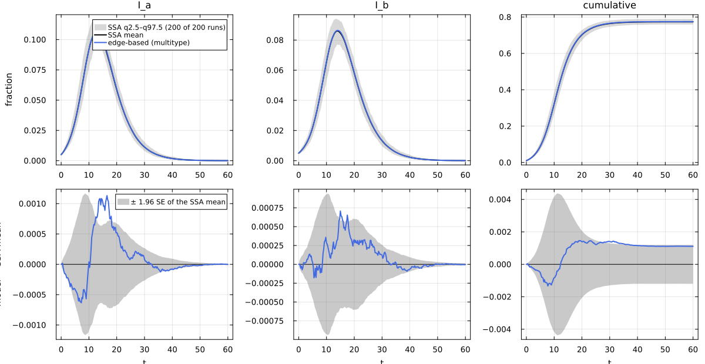
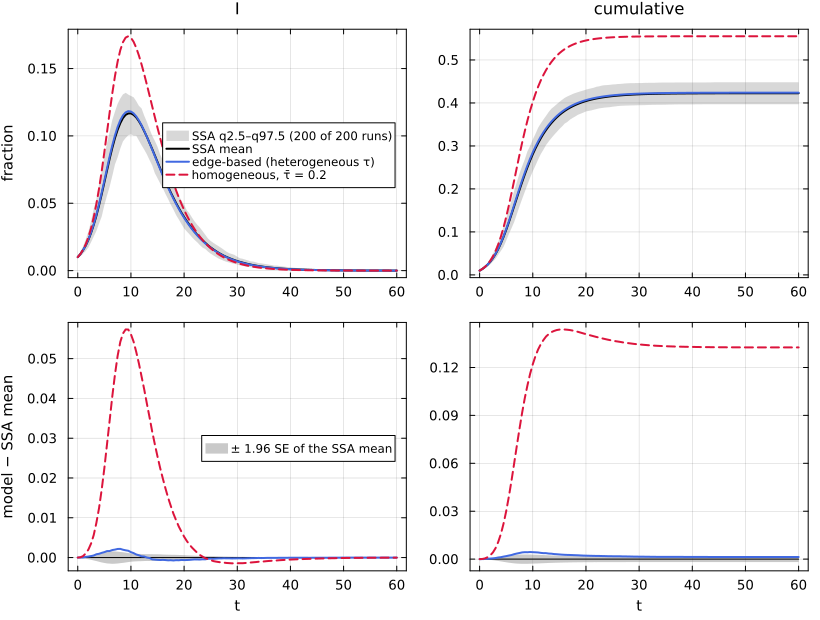
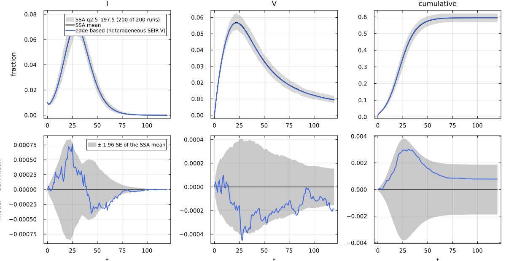

# E10. Multitype populations, stratification and heterogeneous susceptibility


- [What this page shows](#what-this-page-shows)
- [The shared first cell](#the-shared-first-cell)
- [The typed network and its lifted
  equations](#the-typed-network-and-its-lifted-equations)
  - [R₀ from the next-generation
    matrix](#r₀-from-the-next-generation-matrix)
- [Typed EBCM against typed
  simulation](#typed-ebcm-against-typed-simulation)
- [Reciprocity: degree laws that no network
  realises](#reciprocity-degree-laws-that-no-network-realises)
- [The unit law: an unstructured typed
  network](#the-unit-law-an-unstructured-typed-network)
- [Heterogeneous susceptibility](#heterogeneous-susceptibility)
  - [SIR on the bimodal network](#sir-on-the-bimodal-network)
  - [The quotient of the stratified model
    (M10)](#the-quotient-of-the-stratified-model-m10)
  - [SEIR with class-specific latency and
    vaccination](#seir-with-class-specific-latency-and-vaccination)
- [Summary](#summary)
- [Lean](#lean)
- [References](#references)

## What this page shows

A population split into types (age groups, risk groups) is described
twice: in the **model**, by stratifying the reaction network over the
types (`stratify`), and in the **network**, by a `MultitypeNetwork` that
gives each type a joint degree law over partner types. The edge-based
lift then has one θ for every (partner type, own type) pair (Miller and
Volz 2013). This page:

1.  builds the stratified SIR on a two-block Poisson stochastic block
    model (`:sir_sbm2`) twice and compares it with NetworkOutbreaks’
    typed simulation;
2.  shows the error for degree laws that no network can realise (edge
    reciprocity);
3.  checks the unit law: types that the network ignores give back the
    untyped model (`:sir_unstr2` = `:sir_reg6`);
4.  models **heterogeneous susceptibility**: several susceptible classes
    sharing I and R (`:sir_hetsus_bim`, `:seirv_hetsus_pois5`), against
    NetworkOutbreaks.

Its NodeBasedModels mirror is page N04, on the same `:sir_sbm2` summary.

## The shared first cell

``` julia
include(joinpath(@__DIR__, "..", "_shared", "setup.jl"))
using Statistics
using NetworkEpiCore, NetworkOutbreaks, Catalyst, Plots
sir = @reaction_network sir begin
    @parameters τ γ
    τ, S + I --> 2I        # contact: per-contact (per-edge) rate τ; S converted, I unchanged
    γ, I --> R             # node-local transition
end
model = contact_model(sir)          # prints the typing report
st    = strata([:a, :b]; sizes = [0.5, 0.5])
model_ab = stratify(model, st)      # S_a + I_b → I_a + I_b, I_a → R_a, …
sc    = scenario(:sir_sbm2)         # Poisson SBM, mean contacts [6 2; 2 4], τ calibrated to R₀ = 2
@assert isequivalent(model_ab, sc.model)
ref   = scenario_summary(sc)        # committed typed NetworkOutbreaks ensemble
# --- EBM vignette ---------------------------------------------------------------
using EdgeBasedModels
net   = sbm_network(st; mean_contacts = [6.0 2.0; 2.0 4.0])
sys   = edge_based(model_ab, net)                          # low level
sysF  = edge_based(sc)                                     # scenario form (model and network from the registry)
@assert vector_fields_equal(symbolic_ode(sys), symbolic_ode(sysF))
lift_contributions(model_ab, net)                          # per-reaction terms on the typed network
```

    LiftContributions :sir_strat on NetworkEpiCore.MultitypeNetwork([:a, :b], [0.5, 0.5], NetworkEpiCore.MultivariateDegree[NetworkEpiCore.IndependentDegrees(Pair[:a => NetworkEpiCore.PoissonDegree(6.0), :b => NetworkEpiCore.PoissonDegree(2.0)]), NetworkEpiCore.IndependentDegrees(Pair[:a => NetworkEpiCore.PoissonDegree(2.0), :b => NetworkEpiCore.PoissonDegree(4.0)])], Bool[0 0; 0 0])  (multitype closure)
      coordinates  θ_a_a, θ_b_a, ξ_S_a, θ_a_b, θ_b_b, ξ_S_b, φ_I_a_a, φ_I_a_b, φ_I_b_a, φ_I_b_b, φ_R_a_a, φ_R_a_b, φ_R_b_a, φ_R_b_b, pop_I_a, pop_I_b, pop_R_a, pop_R_b
      seed factors q_S_a (initially susceptible fraction of S_a), q_S_b (initially susceptible fraction of S_b)
      [1] S_a + I_a → 2I_a  (τ)   contact
            θ_a_a'    += -φ_I_a_a*τ
            φ_I_a_a'  += -φ_I_a_a*τ
            φ_I_a_a'  += 6*q_S_a*exp(6.0(-1 + θ_a_a))*ξ_S_a*φ_I_a_a*exp(2.0(-1 + θ_b_a))*τ
            φ_I_a_b'  += 6*q_S_a*exp(6.0(-1 + θ_a_a))*ξ_S_a*φ_I_a_a*exp(2.0(-1 + θ_b_a))*τ
            pop_I_a'  += 3.0q_S_a*exp(6.0(-1 + θ_a_a))*ξ_S_a*φ_I_a_a*exp(2.0(-1 + θ_b_a))*τ
      [2] S_a + I_b → I_a + I_b  (τ)   contact
            θ_b_a'    += -φ_I_b_a*τ
            φ_I_b_a'  += -φ_I_b_a*τ
            φ_I_a_a'  += 2*q_S_a*exp(6.0(-1 + θ_a_a))*ξ_S_a*φ_I_b_a*exp(2.0(-1 + θ_b_a))*τ
            φ_I_a_b'  += 2*q_S_a*exp(6.0(-1 + θ_a_a))*ξ_S_a*φ_I_b_a*exp(2.0(-1 + θ_b_a))*τ
            pop_I_a'  += q_S_a*exp(6.0(-1 + θ_a_a))*ξ_S_a*φ_I_b_a*exp(2.0(-1 + θ_b_a))*τ
      [3] S_b + I_a → I_b + I_a  (τ)   contact
            θ_a_b'    += -φ_I_a_b*τ
            φ_I_a_b'  += -φ_I_a_b*τ
            φ_I_b_a'  += 2*q_S_b*exp(4.0(-1 + θ_b_b))*φ_I_a_b*ξ_S_b*exp(2.0(-1 + θ_a_b))*τ
            φ_I_b_b'  += 2*q_S_b*exp(4.0(-1 + θ_b_b))*φ_I_a_b*ξ_S_b*exp(2.0(-1 + θ_a_b))*τ
            pop_I_b'  += q_S_b*exp(4.0(-1 + θ_b_b))*φ_I_a_b*ξ_S_b*exp(2.0(-1 + θ_a_b))*τ
      [4] S_b + I_b → 2I_b  (τ)   contact
            θ_b_b'    += -φ_I_b_b*τ
            φ_I_b_b'  += -φ_I_b_b*τ
            φ_I_b_a'  += 4*q_S_b*φ_I_b_b*exp(4.0(-1 + θ_b_b))*ξ_S_b*exp(2.0(-1 + θ_a_b))*τ
            φ_I_b_b'  += 4*q_S_b*φ_I_b_b*exp(4.0(-1 + θ_b_b))*ξ_S_b*exp(2.0(-1 + θ_a_b))*τ
            pop_I_b'  += 2.0q_S_b*φ_I_b_b*exp(4.0(-1 + θ_b_b))*ξ_S_b*exp(2.0(-1 + θ_a_b))*τ
      [5] I_a → R_a  (γ)   progress
            φ_I_a_a'  += -φ_I_a_a*γ
            φ_R_a_a'  += φ_I_a_a*γ
            φ_I_a_b'  += -φ_I_a_b*γ
            φ_R_a_b'  += φ_I_a_b*γ
            pop_I_a'  += -pop_I_a*γ
            pop_R_a'  += pop_I_a*γ
      [6] I_b → R_b  (γ)   progress
            φ_I_b_a'  += -φ_I_b_a*γ
            φ_R_b_a'  += φ_I_b_a*γ
            φ_I_b_b'  += -φ_I_b_b*γ
            φ_R_b_b'  += φ_I_b_b*γ
            pop_I_b'  += -pop_I_b*γ
            pop_R_b'  += pop_I_b*γ

`stratify` makes one copy of every species per stratum and one contact
for every pair of strata (susceptible of type a, infector of type b).
With the default `contact_rates = :same` every contact keeps the
per-contact rate τ. What differs between the types is the *number* of
contacts, and that lives in the network.

## The typed network and its lifted equations

``` julia
show(stdout, MIME"text/plain"(), net); println()
println("mean contacts of an a-node: ", [mean_degree(net.degrees[1], b) for b in net.types])
println("mean contacts of a b-node: ", [mean_degree(net.degrees[2], b) for b in net.types])
```

    MultitypeNetwork with 2 types
      :a  size 0.5  IndependentDegrees(parts=[:a => PoissonDegree(mean=6), :b => PoissonDegree(mean=2)])
      :b  size 0.5  IndependentDegrees(parts=[:a => PoissonDegree(mean=2), :b => PoissonDegree(mean=4)])
      structural zeros: none
    mean contacts of an a-node: [6.0, 2.0]
    mean contacts of a b-node: [2.0, 4.0]

There are four θ’s. `θ_b_a` belongs to an edge from a b-partner to an
a-node, and the φ’s are indexed the same way (`φ_I_b_a`: the b-partner
is infected and has not yet transmitted). The node variables are per
type:

``` julia
symbolic_ode(sys)
```

    SymbolicODE :edge_based_model_edge_based (16 states)
      dθ_a_a/dt = -φ_I_a_a(t)*τ
      dθ_b_a/dt = -φ_I_b_a(t)*τ
      dθ_a_b/dt = -φ_I_a_b(t)*τ
      dθ_b_b/dt = -φ_I_b_b(t)*τ
      dφ_I_a_a/dt = -φ_I_a_a(t)*γ - φ_I_a_a(t)*τ + (6//1)*q_S_a*exp(6.0(-1 + θ_a_a(t)))*φ_I_a_a(t)*exp(2.0(-1 + θ_b_a(t)))*τ + (2//1)*q_S_a*exp(6.0(-1 + θ_a_a(t)))*φ_I_b_a(t)*exp(2.0(-1 + θ_b_a(t)))*τ
      dφ_I_a_b/dt = -φ_I_a_b(t)*γ - φ_I_a_b(t)*τ + (6//1)*q_S_a*exp(6.0(-1 + θ_a_a(t)))*φ_I_a_a(t)*exp(2.0(-1 + θ_b_a(t)))*τ + (2//1)*q_S_a*exp(6.0(-1 + θ_a_a(t)))*φ_I_b_a(t)*exp(2.0(-1 + θ_b_a(t)))*τ
      dφ_I_b_a/dt = -φ_I_b_a(t)*γ - φ_I_b_a(t)*τ + (4//1)*q_S_b*φ_I_b_b(t)*exp(4.0(-1 + θ_b_b(t)))*exp(2.0(-1 + θ_a_b(t)))*τ + (2//1)*q_S_b*exp(4.0(-1 + θ_b_b(t)))*φ_I_a_b(t)*exp(2.0(-1 + θ_a_b(t)))*τ
      dφ_I_b_b/dt = -φ_I_b_b(t)*γ - φ_I_b_b(t)*τ + (4//1)*q_S_b*φ_I_b_b(t)*exp(4.0(-1 + θ_b_b(t)))*exp(2.0(-1 + θ_a_b(t)))*τ + (2//1)*q_S_b*exp(4.0(-1 + θ_b_b(t)))*φ_I_a_b(t)*exp(2.0(-1 + θ_a_b(t)))*τ
      dφ_R_a_a/dt = φ_I_a_a(t)*γ
      dφ_R_a_b/dt = φ_I_a_b(t)*γ
      dφ_R_b_a/dt = φ_I_b_a(t)*γ
      dφ_R_b_b/dt = φ_I_b_b(t)*γ
      dpop_I_a/dt = -pop_I_a(t)*γ + 3.0q_S_a*exp(6.0(-1 + θ_a_a(t)))*φ_I_a_a(t)*exp(2.0(-1 + θ_b_a(t)))*τ + q_S_a*exp(6.0(-1 + θ_a_a(t)))*φ_I_b_a(t)*exp(2.0(-1 + θ_b_a(t)))*τ
      dpop_I_b/dt = -pop_I_b(t)*γ + 2.0q_S_b*φ_I_b_b(t)*exp(4.0(-1 + θ_b_b(t)))*exp(2.0(-1 + θ_a_b(t)))*τ + q_S_b*exp(4.0(-1 + θ_b_b(t)))*φ_I_a_b(t)*exp(2.0(-1 + θ_a_b(t)))*τ
      dpop_R_a/dt = pop_I_a(t)*γ
      dpop_R_b/dt = pop_I_b(t)*γ
      parameters  τ, γ, q_S_a, q_S_b
      domain      θ_a_a ∈ (0.05, 1.0)
      domain      θ_b_a ∈ (0.05, 1.0)
      domain      θ_a_b ∈ (0.05, 1.0)
      domain      θ_b_b ∈ (0.05, 1.0)

An a-node is still susceptible with probability q\_{S_a} ∏*c
exp(μ*{ac}(θ_c_a − 1)), where μ\_{ac} is its mean number of c-partners.
That factor multiplies the gain terms of `φ_I_a_a` and `φ_I_a_b` alike:
on independent Poisson blocks, the rate at which an a-partner is
infected does not depend on the type of the node at the other end of the
edge.

### R₀ from the next-generation matrix

τ was calibrated so that the spectral radius of the next-generation
matrix is 2. On Poisson blocks the NGM is τ/(τ + γ) times the
mean-contact matrix M, and ρ(M) = 7.236:

``` julia
using LinearAlgebra
M = [6.0 2.0; 2.0 4.0]
T = sc.params[:τ] / (sc.params[:τ] + sc.params[:γ])
(; τ = sc.params[:τ], ρM = maximum(abs.(eigvals(M))), T_ρM = T * maximum(abs.(eigvals(M))),
   NEC = basic_reproduction_number(sc.model, sc.network, sc.params),
   EBCM = basic_reproduction_number(sys; p = sc.params))
```

    (τ = 0.09549150281, ρM = 7.23606797749979, T_ρM = 1.999999999961713, NEC = 1.9999999999617124, EBCM = 1.999999999961713)

## Typed EBCM against typed simulation

``` julia
sol = solve_epidemic(sys, sc)
det = model_curves(sys, sol; t = sc.tgrid, label = "edge-based (multitype)")
comparisonplot(ref, det; observables = [:I_a, :I_b, :cumulative])
```



``` julia
reference_note(sc, ref)
```

NetworkOutbreaks reference `:sir_sbm2`: N = 10000, 200 runs (a fresh
graph per run), conditioned on MajorOutbreak(0.05); 200 major runs,
P(major) = 1.000 (95% CI 0.981–1.000).

``` julia
compare(ref, det)
```

    ComparisonTable :sir_sbm2  (scenario f8e96436; conditioned mean of 200 runs)
      curve                   observable        D∞     t(D∞)       SE∞        z∞       ΔR∞  95% CI                 Δpeak   Δt_peak  coverage
      edge-based (multitype)  S_a          0.00120      9.00   0.00126      1.93   0.00111  [-0.00009,  0.00231]   0.00000      0.00     1.000
      edge-based (multitype)  S_b          0.00089     31.25   0.00105      2.02   0.00111  [-0.00009,  0.00231]   0.00000      0.00     0.975
      edge-based (multitype)  I_a          0.00113     16.50   0.00060      3.31   0.00111  [-0.00009,  0.00231]   0.00078      0.25     0.905
      edge-based (multitype)  I_b          0.00071     15.00   0.00048      2.39   0.00111  [-0.00009,  0.00231]   0.00033      0.00     0.971
      edge-based (multitype)  R_a          0.00091     11.75   0.00099      1.75   0.00111  [-0.00009,  0.00231]   0.00040      0.00     1.000
      edge-based (multitype)  R_b          0.00086     37.50   0.00087      1.98   0.00111  [-0.00009,  0.00231]   0.00072      0.00     0.979
      edge-based (multitype)  infectious   0.00172     15.00   0.00100      3.31   0.00111  [-0.00009,  0.00231]   0.00111      0.25     0.917
      edge-based (multitype)  cumulative   0.00147     19.25   0.00223      2.20   0.00111  [-0.00009,  0.00231]   0.00111      0.00     0.851

Block a has more contacts (6 + 2 against 2 + 4), so its epidemic peaks
higher and earlier:

``` julia
ia, ib = det[:I_a] ./ 0.5, det[:I_b] ./ 0.5          # within-type prevalence
mdtable(["type", "peak within-type prevalence", "time of the peak", "final within-type size"],
        [("a", maximum(ia), sc.tgrid[argmax(ia)], det[:R_a][end] / 0.5),
         ("b", maximum(ib), sc.tgrid[argmax(ib)], det[:R_b][end] / 0.5)])
```

| type | peak within-type prevalence | time of the peak | final within-type size |
|-----:|----------------------------:|-----------------:|-----------------------:|
|    a |                      0.2149 |               13 |                 0.8325 |
|    b |                      0.1728 |               14 |                 0.7171 |

## Reciprocity: degree laws that no network realises

Every edge between the types has one end in each. So the number of a→b
edge ends, N n_a E\[k\_{a→b}\], must equal the number of b→a ends, N n_b
E\[k\_{b→a}\]. A mean-contact matrix that breaks this describes no
network, and the constructor says so:

``` julia
try
    sbm_network(st; mean_contacts = [6.0 3.0; 2.0 4.0])
catch e
    print(sprint(showerror, e))
end
```

    ArgumentError: MultitypeNetwork: edge reciprocity n_a·E[k_{a→b}] = n_b·E[k_{b→a}] fails (rtol = 1.0e-8), so no network realises these degree laws. Mismatches:
      a ↔ b:  n_a·E[k_{a→b}] = 0.5 × 3 = 1.5   vs   n_b·E[k_{b→a}] = 0.5 × 2 = 1

The same matrix is reciprocal for sizes 0.4 and 0.6 (0.4 × 3 = 0.6 × 2).
That is the age-structured scenario `:sir_age2`:

``` julia
st46 = strata([:y, :o]; sizes = [0.4, 0.6])
sbm_network(st46; mean_contacts = [6.0 3.0; 2.0 4.0])
```

    MultitypeNetwork with 2 types
      :y  size 0.4  IndependentDegrees(parts=[:y => PoissonDegree(mean=6), :o => PoissonDegree(mean=3)])
      :o  size 0.6  IndependentDegrees(parts=[:y => PoissonDegree(mean=2), :o => PoissonDegree(mean=4)])
      structural zeros: none

## The unit law: an unstructured typed network

If the types are only labels, so that a node’s partners are of type b
with probability n_b whatever its own type, the typed model must
reproduce the untyped one. This is morphism M10 in DESIGN §D.5.
`unstructured(net, st)` builds that network. `:sir_unstr2` is the
stratified SIR on an unstructured 6-regular network, and its aggregate
should equal `:sir_reg6`:

``` julia
su = scenario(:sir_unstr2)
@assert isequivalent(model_ab, su.model)
refu = scenario_summary(su)
sysu = edge_based(model_ab, unstructured(ConfigurationNetwork(RegularDegree(6)), st))
@assert vector_fields_equal(symbolic_ode(sysu), symbolic_ode(edge_based(su)))
tol = (; reltol = 1e-10, abstol = 1e-12)
solu = solve_epidemic(sysu, su; tol...)
detu = model_curves(sysu, solu; t = su.tgrid, label = "edge-based (typed, unstructured)")

s6 = scenario(:sir_reg6)
@assert isequivalent(model, s6.model)
sys6 = edge_based(model, s6.network)
det6 = model_curves(sys6, solve_epidemic(sys6, s6; tol...); t = s6.tgrid, label = "edge-based (untyped, 6-regular)")
(; max_S = maximum(abs.(detu[:S_a] .+ detu[:S_b] .- det6[:S])),
   max_I = maximum(abs.(detu[:I_a] .+ detu[:I_b] .- det6[:I])),
   max_cumulative = maximum(abs.(detu[:cumulative] .- det6[:cumulative])))
```

    (max_S = 4.901634653720066e-14, max_I = 4.5075054799781356e-14, max_cumulative = 6.994405055138486e-14)

The typed and untyped curves agree to within the solver tolerance (10⁻¹⁰
relative), and both agree with their own ensembles:

``` julia
reference_note(su, refu)
```

NetworkOutbreaks reference `:sir_unstr2`: N = 10000, 200 runs (a fresh
graph per run), conditioned on MajorOutbreak(0.05); 200 major runs,
P(major) = 1.000 (95% CI 0.981–1.000).

``` julia
compare(refu, detu; observables = [:I_a, :I_b, :infectious, :cumulative])
```

    ComparisonTable :sir_unstr2  (scenario 8ae47e8f; conditioned mean of 200 runs)
      curve                             observable        D∞     t(D∞)       SE∞        z∞       ΔR∞  95% CI                 Δpeak   Δt_peak  coverage
      edge-based (typed, unstructured)  I_a          0.00056     11.50   0.00058      1.93  -0.00004  [-0.00061,  0.00052]   0.00034      0.00     1.000
      edge-based (typed, unstructured)  I_b          0.00046      8.50   0.00057      1.38  -0.00004  [-0.00061,  0.00052]   0.00017      0.00     1.000
      edge-based (typed, unstructured)  infectious   0.00093     11.50   0.00111      1.85  -0.00004  [-0.00061,  0.00052]   0.00051      0.00     1.000
      edge-based (typed, unstructured)  cumulative   0.00096      8.50   0.00212      0.97  -0.00004  [-0.00061,  0.00052]  -0.00004      5.75     1.000

``` julia
ref6 = scenario_summary(s6)
reference_note(s6, ref6)
```

NetworkOutbreaks reference `:sir_reg6`: N = 10000, 200 runs (a fresh
graph per run), conditioned on MajorOutbreak(0.05); 200 major runs,
P(major) = 1.000 (95% CI 0.981–1.000).

``` julia
compare(ref6, det6; observables = [:I, :cumulative])
```

    ComparisonTable :sir_reg6  (scenario e5443b54; conditioned mean of 200 runs)
      curve                            observable        D∞     t(D∞)       SE∞        z∞       ΔR∞  95% CI                 Δpeak   Δt_peak  coverage
      edge-based (untyped, 6-regular)  I            0.00171     10.00   0.00117      2.74   0.00026  [-0.00027,  0.00080]   0.00128     -0.25     0.975
      edge-based (untyped, 6-regular)  cumulative   0.00191     11.50   0.00225      1.67   0.00026  [-0.00027,  0.00080]   0.00026      5.50     1.000

## Heterogeneous susceptibility

Susceptibility often varies between people for reasons unrelated to
their contacts (prior immunity, age, genetics). Miller and Volz (2013,
sec. 2.2.2) model it with several susceptible classes sharing the same
network. In NetworkEpiCore the classes are susceptible species labelled
by the strata of `unstructured(net, st)`, and I and R are shared
(unlabelled). EdgeBasedModels lifts them with its *heterogeneous*
closure, which keeps one θ_a and one φ\_{Y,a} per class a (the edge into
a class-a node), not the K² edge types θ\_{b→a} of the full multitype
lift.

### SIR on the bimodal network

`:sir_hetsus_bim` has 40% of nodes with τ = 0.05 and 60% with τ = 0.3,
on the bimodal {2, 10} network of `:sir_bim` (a non-Poisson-type
network). The model is written with the direct constructor, since a
species label is not a Catalyst concept:

``` julia
lab(x, a) = SpeciesLabel(x; stratum = a)
het = ContactModel(:sir_het;
    contacts = [Contact(:S_lo, :I, :I, :τ_lo), Contact(:S_hi, :I, :I, :τ_hi)],
    transitions = [NodeTransition(:I, :R, :γ)],
    labels = Dict(:S_lo => lab(:S, :lo), :S_hi => lab(:S, :hi)))
sh = scenario(:sir_hetsus_bim)
@assert isequivalent(het, sh.model)
refh = scenario_summary(sh)
hs = strata([:lo, :hi]; sizes = [0.4, 0.6])
bim = ConfigurationNetwork(EmpiricalDegree(2 => 5 / 6, 10 => 1 / 6))
sysh = edge_based(het, bim, hs)                            # low level: model, base network, strata
@assert vector_fields_equal(symbolic_ode(sysh), symbolic_ode(edge_based(sh)))   # scenario form
lift_contributions(het, bim, hs)
```

    LiftContributions :sir_het on NetworkEpiCore.MultitypeNetwork([:lo, :hi], [0.4, 0.6], NetworkEpiCore.MultivariateDegree[NetworkEpiCore.SplitDegrees(NetworkEpiCore.EmpiricalDegree([0.0, 0.0, 0.8333333333333334, 0.0, 0.0, 0.0, 0.0, 0.0, 0.0, 0.0, 0.16666666666666666]), [:lo => 0.4, :hi => 0.6]), NetworkEpiCore.SplitDegrees(NetworkEpiCore.EmpiricalDegree([0.0, 0.0, 0.8333333333333334, 0.0, 0.0, 0.0, 0.0, 0.0, 0.0, 0.0, 0.16666666666666666]), [:lo => 0.4, :hi => 0.6])], Bool[0 0; 0 0])  (heterogeneous closure)
      coordinates  θ_lo, ξ_S_lo, θ_hi, ξ_S_hi, φ_I_lo, φ_I_hi, φ_R_lo, φ_R_hi, pop_I, pop_R
      seed factors q_S_lo (initially susceptible fraction of S_lo), q_S_hi (initially susceptible fraction of S_hi)
      [1] S_lo + I → 2I  (τ_lo)   contact
            θ_lo'    += -φ_I_lo*τ_lo
            φ_I_lo'  += -φ_I_lo*τ_lo
            φ_I_lo'  += 0.12000000000000002q_S_lo*ξ_S_lo*(1.6666666666666667 + 15.0(θ_lo^8))*φ_I_lo*τ_lo
            φ_I_hi'  += 0.12000000000000002q_S_lo*ξ_S_lo*(1.6666666666666667 + 15.0(θ_lo^8))*φ_I_lo*τ_lo
            pop_I'   += 0.4q_S_lo*ξ_S_lo*(1.6666666666666667θ_lo + 1.6666666666666665(θ_lo^9))*φ_I_lo*τ_lo
      [2] S_hi + I → 2I  (τ_hi)   contact
            θ_hi'    += -φ_I_hi*τ_hi
            φ_I_hi'  += -φ_I_hi*τ_hi
            φ_I_lo'  += 0.18000000000000002q_S_hi*(1.6666666666666667 + 15.0(θ_hi^8))*ξ_S_hi*φ_I_hi*τ_hi
            φ_I_hi'  += 0.18000000000000002q_S_hi*(1.6666666666666667 + 15.0(θ_hi^8))*ξ_S_hi*φ_I_hi*τ_hi
            pop_I'   += 0.6q_S_hi*(1.6666666666666667θ_hi + 1.6666666666666665(θ_hi^9))*ξ_S_hi*φ_I_hi*τ_hi
      [3] I → R  (γ)   progress
            φ_I_lo'  += -φ_I_lo*γ
            φ_R_lo'  += φ_I_lo*γ
            φ_I_hi'  += -φ_I_hi*γ
            φ_R_hi'  += φ_I_hi*γ
            pop_I'   += -pop_I*γ
            pop_R'   += pop_I*γ

The per-class entry factor is q\_{S_a} ψ′(θ_a)/ψ′(1), and a class-a
susceptible adds its node count n_a q\_{S_a} ψ(θ_a) to S. A **negative
control** is the homogeneous model with the class-averaged rate τ̄ = 0.4
· 0.05 + 0.6 · 0.3 = 0.2:

The shared recipe `comparisonplot` styles every curve by its
representation, so two edge-based curves would come out in the same
colour. `style_curves!` gives each curve of a comparison figure its own
colour and dash, in the order the curves were passed:

``` julia
"""
    style_curves!(p, styles) -> p

Give the model curves of a `comparisonplot` figure `p` their own line colours and styles.
`styles` holds one `(linecolor, linestyle)` pair per curve, in the order the curves were passed.
The recipe draws the curves last in every panel, so they are the last `length(styles)` series of
each subplot; the labels of the first panel are checked against `labels`.
"""
function style_curves!(p, styles, labels)
    n = length(styles)
    first_labels = [s[:label] for s in p.subplots[1].series_list[end-n+1:end]]
    first_labels == collect(labels) ||
        error("style_curves!: the last series of the first panel are $(first_labels), not $(labels)")
    for sp in p.subplots, (k, (lc, ls)) in enumerate(styles)
        s = sp.series_list[end-n+k]
        s[:linecolor] = Plots.plot_color(lc)
        s[:linestyle] = ls
    end
    return p
end
```

    Main.Notebook.style_curves!

``` julia
solh = solve_epidemic(sysh, sh)
deth = model_curves(sysh, solh; t = sh.tgrid, label = "edge-based (heterogeneous τ)")
τbar = 0.4 * sh.params[:τ_lo] + 0.6 * sh.params[:τ_hi]
sysbar = edge_based(model, bim)
solbar = solve_epidemic(sysbar; p = Dict(:τ => τbar, :γ => sh.params[:γ]), initial = sh.initial,
                        tspan = sh.tspan, saveat = sh.tgrid)
detbar = model_curves(sysbar, solbar; t = sh.tgrid, label = "homogeneous, τ̄ = $(τbar)")
p = comparisonplot(refh, deth, detbar; observables = [:I, :cumulative], legend = :right)
style_curves!(p, [(:royalblue, :solid), (:crimson, :dash)], [deth.label, detbar.label])
```



``` julia
reference_note(sh, refh)
```

NetworkOutbreaks reference `:sir_hetsus_bim`: N = 10000, 200 runs (a
fresh graph per run), conditioned on MajorOutbreak(0.05); 200 major
runs, P(major) = 1.000 (95% CI 0.981–1.000).

``` julia
compare(refh, deth; observables = [:S_lo, :S_hi, :I, :cumulative])
```

    ComparisonTable :sir_hetsus_bim  (scenario c0ce2b90; conditioned mean of 200 runs)
      curve                         observable        D∞     t(D∞)       SE∞        z∞       ΔR∞  95% CI                 Δpeak   Δt_peak  coverage
      edge-based (heterogeneous τ)  S_lo         0.00084     10.50   0.00034      2.55   0.00132  [-0.00051,  0.00315]  -0.00005      0.00     0.769
      edge-based (heterogeneous τ)  S_hi         0.00362      9.50   0.00122      3.15   0.00132  [-0.00051,  0.00315]   0.00005      0.00     0.686
      edge-based (heterogeneous τ)  I            0.00218      8.00   0.00080      3.04   0.00132  [-0.00051,  0.00315]   0.00164     -0.50     0.793
      edge-based (heterogeneous τ)  cumulative   0.00444      9.50   0.00150      3.04   0.00132  [-0.00051,  0.00315]   0.00132      0.50     0.694

``` julia
compare(refh, deth, detbar; observables = [:I, :cumulative])
```

    ComparisonTable :sir_hetsus_bim  (scenario c0ce2b90; conditioned mean of 200 runs)
      curve                         observable        D∞     t(D∞)       SE∞        z∞       ΔR∞  95% CI                 Δpeak   Δt_peak  coverage
      edge-based (heterogeneous τ)  I            0.00218      8.00   0.00080      3.04   0.00132  [-0.00051,  0.00315]   0.00164     -0.50     0.793
      edge-based (heterogeneous τ)  cumulative   0.00444      9.50   0.00150      3.04   0.00132  [-0.00051,  0.00315]   0.00132      0.50     0.694
      homogeneous, τ̄ = 0.2          I            0.05734      9.00   0.00080    107.47   0.13255  [ 0.13073,  0.13438]   0.05725     -0.50     0.256
      homogeneous, τ̄ = 0.2          cumulative   0.14381     15.50   0.00150    143.83   0.13255  [ 0.13073,  0.13438]   0.13256      0.50     0.017

With two classes the EBCM follows the simulation (D∞(I) = 0.0022, ΔR∞ =
+0.0013). The mean-susceptibility model misses it (D∞(I) = 0.0573, ΔR∞ =
+0.1326); its R₀ is compared with the heterogeneous one below.

The two R₀’s: the heterogeneous one is κ_ex Σ_a n_a T_a, where T_a =
τ_a/(τ_a + γ), while the homogeneous one is κ_ex T(τ̄):

``` julia
κ = excess_degree(bim)
Tf(τ) = τ / (τ + sh.params[:γ])
(; heterogeneous = κ * (0.4 * Tf(sh.params[:τ_lo]) + 0.6 * Tf(sh.params[:τ_hi])),
   registry = sh.expected[:R0], EBCM = basic_reproduction_number(sysh; p = sh.params),
   homogeneous_mean_τ = κ * Tf(τbar))
```

    (heterogeneous = 1.96969696969697, registry = 1.9696969696969697, EBCM = 1.96969696969697, homogeneous_mean_τ = 2.2222222222222228)

### The quotient of the stratified model (M10)

The heterogeneous model is the quotient of the full multitype lift of
the *stratified* model on the same unstructured network, where I and R
are also split by class. The node totals therefore agree, to within the
solver tolerance:

``` julia
strat = stratify(model, hs; contact_rates = (a, b) -> a === :lo ? :τ_lo : :τ_hi)
sysM = edge_based(strat, unstructured(bim, hs))
solM = solve_epidemic(sysM; p = sh.params, initial = SeedFraction(:I_lo => 0.004, :I_hi => 0.006),
                      tspan = sh.tspan, saveat = sh.tgrid, tol...)
solh2 = solve_epidemic(sysh, sh; tol...)
IM = compartment(sysM, solM, :I_lo) .+ compartment(sysM, solM, :I_hi)
(; max_I = maximum(abs.(IM .- compartment(sysh, solh2, :I))),
   max_S_lo = maximum(abs.(compartment(sysM, solM, :S_lo) .- compartment(sysh, solh2, :S_lo))),
   coordinates_heterogeneous = length(symbolic_ode(sysh).states),
   coordinates_multitype = length(symbolic_ode(sysM).states))
```

    (max_I = 2.607289384393141e-14, max_S_lo = 6.050715484207103e-15, coordinates_heterogeneous = 8, coordinates_multitype = 16)

The 1% shared seeds in I are placed on every type in proportion to its
size (§J.6), hence `:I_lo => 0.004, :I_hi => 0.006` in the stratified
model.

### SEIR with class-specific latency and vaccination

`:seirv_hetsus_pois5` has class-specific latent stages E_lo, E_hi, a
shared I and R, vaccination of the high-susceptibility class S_hi → V at
rate ν, and removal of the vaccinated at rate μ, on Poisson(5):

``` julia
sv = scenario(:seirv_hetsus_pois5)
sv.model
```

    ContactModel :seirv_het  (source: ContactModel constructor; method: explicit; rates: PerContact)
      species       S_lo (Sus)   S_hi (Sus)   E_lo   I   E_hi   R   V
      contacts      [1] S_lo + I → E_lo + I    τ_lo    contact     infector I, entry E_lo
                    [2] S_hi + I → E_hi + I    τ_hi    contact     infector I, entry E_hi
      transitions   [3] E_lo → I               σ_lo    progress
                    [4] E_hi → I               σ_hi    progress
                    [5] I → R                  γ       progress
                    [6] S_hi → V               ν       exit
                    [7] V → ∅                  μ       remove
      typing        T_EB  ⇒  edge_based ✓  s_anchored ✓  pairwise ✓  individual ✓  pair ✓  stochastic ✓  mass_action ✓
      assumptions   Sus inferred as recipients \ contact products = {S_lo, S_hi}

``` julia
refv = scenario_summary(sv)
sysv = edge_based(sv.model, ConfigurationNetwork(PoissonDegree(5)), hs)
@assert vector_fields_equal(symbolic_ode(sysv), symbolic_ode(edge_based(sv)))
detv = model_curves(sysv, solve_epidemic(sysv, sv); t = sv.tgrid, label = "edge-based (heterogeneous SEIR-V)")
comparisonplot(refv, detv; observables = [:I, :V, :cumulative])
```



``` julia
reference_note(sv, refv)
```

NetworkOutbreaks reference `:seirv_hetsus_pois5`: N = 10000, 200 runs (a
fresh graph per run), conditioned on MajorOutbreak(0.05); 200 major
runs, P(major) = 1.000 (95% CI 0.981–1.000).

``` julia
compare(refv, detv; observables = [:S_lo, :S_hi, :E_lo, :E_hi, :I, :V, :cumulative])
```

    ComparisonTable :seirv_hetsus_pois5  (scenario f50b8c3e; conditioned mean of 200 runs)
      curve                              observable        D∞     t(D∞)       SE∞        z∞       ΔR∞  95% CI                 Δpeak   Δt_peak  coverage
      edge-based (heterogeneous SEIR-V)  S_lo         0.00088     35.00   0.00069      1.75   0.00079  [-0.00109,  0.00266]  -0.00005      0.00     1.000
      edge-based (heterogeneous SEIR-V)  S_hi         0.00187     25.00   0.00118      2.11   0.00079  [-0.00109,  0.00266]   0.00005      0.00     0.950
      edge-based (heterogeneous SEIR-V)  E_lo         0.00019     22.00   0.00010      1.85   0.00079  [-0.00109,  0.00266]  -0.00008      0.00     1.000
      edge-based (heterogeneous SEIR-V)  E_hi         0.00091     20.00   0.00036      2.99   0.00079  [-0.00109,  0.00266]   0.00074      0.00     0.876
      edge-based (heterogeneous SEIR-V)  I            0.00077     25.00   0.00044      2.89   0.00079  [-0.00109,  0.00266]   0.00034      0.00     0.926
      edge-based (heterogeneous SEIR-V)  V            0.00045     28.00   0.00021      2.18   0.00079  [-0.00109,  0.00266]  -0.00016      0.00     0.942
      edge-based (heterogeneous SEIR-V)  cumulative   0.00302     31.00   0.00195      1.76   0.00079  [-0.00109,  0.00266]   0.00079      1.00     1.000

The exit from S_hi means there is no final-size fixed point, so R∞ is
read from the ODE at the end of the time span. ΔR∞ above is that value
minus the ensemble’s mean final size.

## Summary

``` julia
rows = map([(ref, det, :I_a), (refu, detu, :I_a), (refh, deth, :I), (refv, detv, :I)]) do (r, c, X)
    row = compare(r, c; observables = [X])[c.label, X]
    (string("`:", r.id, "`"), string(X), row.D∞, row.z∞, row.ΔR∞)
end
mdtable(["scenario", "observable", "D∞", "z∞", "ΔR∞"], rows)
```

|              scenario | observable |        D∞ |    z∞ |        ΔR∞ |
|----------------------:|-----------:|----------:|------:|-----------:|
|           `:sir_sbm2` |        I_a |  0.001132 | 3.311 |   0.001109 |
|         `:sir_unstr2` |        I_a | 0.0005645 | 1.935 | -4.156e-05 |
|     `:sir_hetsus_bim` |          I |  0.002183 | 3.045 |   0.001321 |
| `:seirv_hetsus_pois5` |          I | 0.0007656 | 2.891 |  0.0007853 |

## Lean

None of the multitype statements on this page is formalised.

## References

<div id="refs" class="references csl-bib-body hanging-indent">

<div id="ref-miller2013incorporating" class="csl-entry">

Miller, Joel C., and Erik M. Volz. 2013. “Incorporating Disease and
Population Structure into Models of SIR Disease in Contact Networks.”
*PLoS ONE* 8 (8): e69162.
<https://doi.org/10.1371/journal.pone.0069162>.

</div>

</div>
