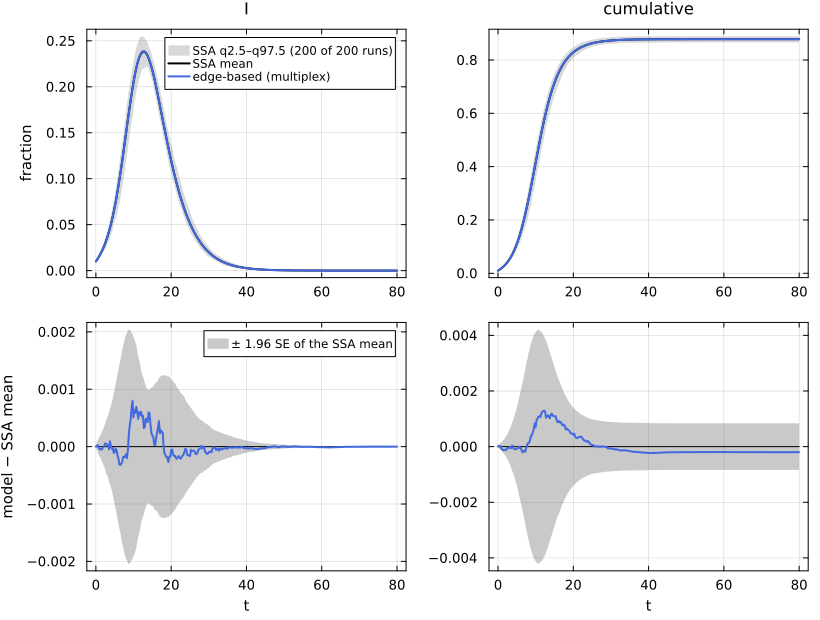
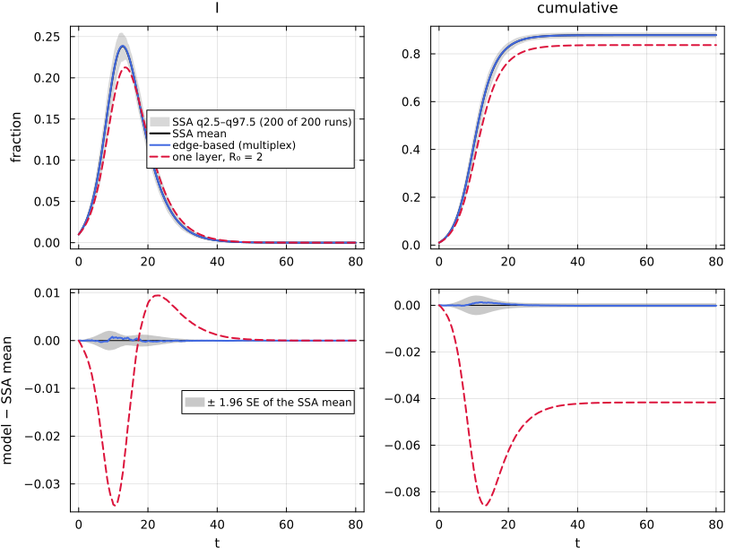

# E11. Multiplex networks


- [What this page shows](#what-this-page-shows)
- [The shared first cell](#the-shared-first-cell)
- [The lifted equations](#the-lifted-equations)
- [R₀ = ρ(K), not the sum of the layer
  R₀’s](#r₀--ρk-not-the-sum-of-the-layer-r₀s)
- [EBCM against the multiplex
  simulation](#ebcm-against-the-multiplex-simulation)
- [Lean](#lean)
- [References](#references)

## What this page shows

People meet at home and in the community, and the two kinds of contact
have different numbers and different transmission rates. A **multiplex**
network puts several independent configuration layers on the same nodes.
The EBCM keeps one θ_ℓ per layer, and a node escapes infection only if
it escapes on every layer, so S = q ∏\_ℓ ψ_ℓ(θ_ℓ). In NetworkEpiCore a
contact names its layer. In Catalyst it is reaction metadata
`[layer = :home]`, and in the direct constructor it is
`Contact(…; layer = :home)`. This page:

1.  builds the two-layer scenario `:sir_mpx` from a Catalyst network
    with layer metadata, and with the factory `build_multiplex_sir`;
2.  shows that the basic reproduction number is the spectral radius ρ(K)
    of a 2 × 2 next-generation matrix, not the sum of the layer R₀’s;
3.  compares the EBCM with NetworkOutbreaks’ multiplex simulation.

## The shared first cell

``` julia
include(joinpath(@__DIR__, "..", "_shared", "setup.jl"))
using Statistics, LinearAlgebra
using NetworkEpiCore, NetworkOutbreaks, Catalyst, Plots
sir_mpx = @reaction_network sir_mpx begin
    @parameters c γ
    3c, S + I --> 2I, [layer = :home]   # household contacts: per-contact rate 3c
    c, S + I --> 2I, [layer = :comm]    # community contacts: per-contact rate c
    γ, I --> R                          # node-local: happens once, on every layer
end
model = contact_model(sir_mpx)      # prints the typing report
sc    = scenario(:sir_mpx)          # home: 3-regular, community: Poisson(5); c calibrated to R₀ = 2
@assert isequivalent(model, sc.model)
ref   = scenario_summary(sc)        # committed NetworkOutbreaks multiplex ensemble
# --- EBM vignette ---------------------------------------------------------------
using EdgeBasedModels
net   = MultiplexNetwork(:home => RegularDegree(3), :comm => PoissonDegree(5))
sys   = edge_based(model, net)                             # low level
sysF  = build_multiplex_sir(:home => (RegularDegree(3), :(3c)), :comm => (PoissonDegree(5), :c); γ = :γ)
@assert vector_fields_equal(symbolic_ode(sys), symbolic_ode(sysF))
lift_contributions(model, net)                             # per-reaction, per-layer terms
```

    LiftContributions :sir_mpx on NetworkEpiCore.MultiplexNetwork(Pair[:home => NetworkEpiCore.ConfigurationNetwork(NetworkEpiCore.RegularDegree(3)), :comm => NetworkEpiCore.ConfigurationNetwork(NetworkEpiCore.PoissonDegree(5.0))])  (multiplex closure)
      coordinates  θ_home, θ_comm, ξ, φ_I_home, φ_I_comm, φ_R_home, φ_R_comm, pop_I, pop_R
      seed factors q_S (initially susceptible fraction of S)
      [1] S + I → 2I  (3c)   contact
            θ_home'    += -3c*φ_I_home
            φ_I_home'  += -3c*φ_I_home
            φ_I_home'  += 6*c*q_S*φ_I_home*θ_home*exp(5.0(-1 + θ_comm))*ξ
            φ_I_comm'  += 9*c*q_S*φ_I_home*(θ_home^2)*exp(5.0(-1 + θ_comm))*ξ
            pop_I'     += 9c*q_S*φ_I_home*(θ_home^2)*exp(5.0(-1 + θ_comm))*ξ
      [2] S + I → 2I  (c)   contact
            θ_comm'    += -c*φ_I_comm
            φ_I_comm'  += -c*φ_I_comm
            φ_I_home'  += 5*c*q_S*φ_I_comm*(θ_home^2)*exp(5.0(-1 + θ_comm))*ξ
            φ_I_comm'  += 5*c*q_S*φ_I_comm*(θ_home^3)*exp(5.0(-1 + θ_comm))*ξ
            pop_I'     += 5.0c*q_S*φ_I_comm*(θ_home^3)*exp(5.0(-1 + θ_comm))*ξ
      [3] I → R  (γ)   progress
            φ_I_home'  += -φ_I_home*γ
            φ_R_home'  += φ_I_home*γ
            φ_I_comm'  += -φ_I_comm*γ
            φ_R_comm'  += φ_I_comm*γ
            pop_I'     += -pop_I*γ
            pop_R'     += pop_I*γ

The scenario:

``` julia
println(sc.title)
println("parameters: c = ", sc.params[:c], ", γ = ", sc.params[:γ],
        "; so τ_home = ", 3sc.params[:c], ", τ_comm = ", sc.params[:c])
println("seeding: ", sc.initial, ";  t ∈ ", sc.tspan)
```

    SIR on a two-layer multiplex (household 3-regular, community Poisson(5))
    parameters: c = 0.05970959492, γ = 0.25; so τ_home = 0.17912878476, τ_comm = 0.05970959492
    seeding: SeedFraction([:I => 0.01], nothing);  t ∈ (0.0, 80.0)

## The lifted equations

Each contact acts only on the edges of its own layer. The progression I
→ R is node-local, so it moves φ\_{I,ℓ} to φ\_{R,ℓ} on every layer:

``` julia
symbolic_ode(sys)
```

    SymbolicODE :edge_based_model_edge_based (8 states)
      dθ_home/dt = -3c*φ_I_home(t)
      dθ_comm/dt = -c*φ_I_comm(t)
      dφ_I_home/dt = -3c*φ_I_home(t) - φ_I_home(t)*γ + (6//1)*c*q_S*φ_I_home(t)*θ_home(t)*exp(5.0(-1 + θ_comm(t))) + (5//1)*c*q_S*φ_I_comm(t)*(θ_home(t)^2)*exp(5.0(-1 + θ_comm(t)))
      dφ_I_comm/dt = -c*φ_I_comm(t) - φ_I_comm(t)*γ + (9//1)*c*q_S*φ_I_home(t)*(θ_home(t)^2)*exp(5.0(-1 + θ_comm(t))) + (5//1)*c*q_S*φ_I_comm(t)*(θ_home(t)^3)*exp(5.0(-1 + θ_comm(t)))
      dφ_R_home/dt = φ_I_home(t)*γ
      dφ_R_comm/dt = φ_I_comm(t)*γ
      dpop_I/dt = -pop_I(t)*γ + 9c*q_S*φ_I_home(t)*(θ_home(t)^2)*exp(5.0(-1 + θ_comm(t))) + 5.0c*q_S*φ_I_comm(t)*(θ_home(t)^3)*exp(5.0(-1 + θ_comm(t)))
      dpop_R/dt = pop_I(t)*γ
      parameters  c, γ, q_S
      domain      θ_home ∈ (0.05, 1.0)
      domain      θ_comm ∈ (0.05, 1.0)

A susceptible node of degrees (k_home, k_comm) is still susceptible with
probability q θ_home^{k_home} θ_comm^{k_comm}. The partner at the end of
a home edge is therefore susceptible with probability φ\_{S,home} = q
ψ_home′(θ_home) ψ_comm(θ_comm)/ψ_home′(1), and the gain terms of
φ\_{I,home} carry ψ_home″(θ_home) ψ_comm(θ_comm)/ψ_home′(1). On the
3-regular home layer that is 6θ_home e^{5(θ_comm − 1)}/3, the factor
printed above. The partner at the end of a home edge carries on
infecting along its community edges too, which is how the layers are
coupled.

## R₀ = ρ(K), not the sum of the layer R₀’s

Linearising at the disease-free state gives a next-generation matrix
over layers (Jacobsen et al. 2018). A case infected along a layer-m edge
produces T_ℓ ψ_ℓ″(1)/ψ_ℓ′(1) new layer-ℓ cases if ℓ = m, and T_ℓ ψ_ℓ′(1)
if ℓ ≠ m, where T_ℓ = τ_ℓ/(τ_ℓ + γ) is the per-edge transmissibility.
With K\_{ℓm} the number of new layer-ℓ cases per layer-m case, K =
\[\[T₁e₁, T₁k₁\], \[T₂k₂, T₂e₂\]\], where e_ℓ = ψ_ℓ″(1)/ψ_ℓ′(1) and k_ℓ
= ψ_ℓ′(1). The 0.1 package returned the sum of the diagonal, the
“additive” R₀. That is wrong unless det K = 0:

``` julia
c, γ = sc.params[:c], sc.params[:γ]
T = [3c / (3c + γ), c / (c + γ)]
d = [RegularDegree(3), PoissonDegree(5)]
k = [mean_degree(x) for x in d]                         # ψ′(1): 3, 5
e = [excess_degree(x) for x in d]                       # ψ″(1)/ψ′(1): 2, 5
K = [T[1] * e[1] T[1] * k[1]; T[2] * k[2] T[2] * e[2]]
(; K, ρK = maximum(abs.(eigvals(K))), additive = T[1] * e[1] + T[2] * e[2], detK = det(K))
```

    (K = [0.8348486101214666 1.2522729151821999; 0.9639610121769616 0.9639610121769616], ρK = 2.0000000000956146, additive = 1.7988096222984282, detK = -0.40238075561360925)

The same numbers come from NetworkEpiCore’s next-generation engine (the
registry value, over (layer, entry) blocks), from the lifted ODE, and
from the legacy `multiplex_R0`, which now also returns ρ(K):

``` julia
mdtable(["source", "R₀"],
        [("ρ(K), by hand", maximum(abs.(eigvals(K)))),
         ("NetworkEpiCore NGM (scenario expected value)", sc.expected[:R0]),
         ("EBCM, `basic_reproduction_number(sys; p)`", basic_reproduction_number(sys; p = sc.params)),
         ("`multiplex_R0` (0.1 tuple form)", multiplex_R0([(:home, RegularDegree(3), 3c, γ), (:comm, PoissonDegree(5), c, γ)])),
         ("additive (sum of layer R₀'s), wrong", sc.expected[:R0_additive])])
```

|                                       source |    R₀ |
|---------------------------------------------:|------:|
|                                ρ(K), by hand |     2 |
| NetworkEpiCore NGM (scenario expected value) |     2 |
|    EBCM, `basic_reproduction_number(sys; p)` |     2 |
|              `multiplex_R0` (0.1 tuple form) |     2 |
|          additive (sum of layer R₀’s), wrong | 1.799 |

The 2 × 2 formula ρ(K) = (K₁₁ + K₂₂ + √((K₁₁ − K₂₂)² + 4K₁₂K₂₁))/2 is
proved in Lean for K₁₁ ≥ 0, K₂₂ ≥ 0 and K₁₂K₂₁ ≥ 0, and applied to the
two-layer matrix K = \[\[T₁e₁, T₁k₁\], \[T₂k₂, T₂e₂\]\], taking that
matrix as given:

``` julia
for n in ("NEP.spectralRadius_fin_two", "NEP.multiplex_r0_of_entries")
    display(lean_cite(n))
end
```

Lean: `NEP.spectralRadius_fin_two`

Lean: `NEP.multiplex_r0_of_entries`

The same Lean file proves, under the same entry conditions, that ρ(K)
equals the additive value T₁e₁ + T₂e₂ if and only if (T₁k₁)(T₂k₂) =
(T₁e₁)(T₂e₂). When T₁T₂ ≠ 0 this is k₁k₂ = e₁e₂, which holds for
independent Poisson layers, where k_ℓ = e_ℓ:

``` julia
lean_cite("NEP.multiplex_r0_eq_sum_iff_of_entries")
```

Lean: `NEP.multiplex_r0_eq_sum_iff_of_entries`

Here k₁k₂ = 15 and e₁e₂ = 10, so the additive value is off:

``` julia
(; k1k2 = k[1] * k[2], e1e2 = e[1] * e[2],
   relative_error_of_additive = (sc.expected[:R0_additive] - sc.expected[:R0]) / sc.expected[:R0])
```

    (k1k2 = 15.0, e1e2 = 10.0, relative_error_of_additive = -0.10059518889378402)

As a check of the “if” direction, take two Poisson layers. The two
values then agree:

``` julia
Kp(τ1, τ2, μ1, μ2) = (T1 = τ1 / (τ1 + γ); T2 = τ2 / (τ2 + γ); [T1 * μ1 T1 * μ1; T2 * μ2 T2 * μ2])
Kpo = Kp(0.3, 0.1, 3.0, 5.0)
(; ρK = maximum(abs.(eigvals(Kpo))), additive = Kpo[1, 1] + Kpo[2, 2])
```

    (ρK = 3.064935064935065, additive = 3.064935064935065)

## EBCM against the multiplex simulation

``` julia
sol = solve_epidemic(sys, sc)
det = model_curves(sys, sol; t = sc.tgrid, label = "edge-based (multiplex)")
comparisonplot(ref, det; observables = [:I, :cumulative])
```



``` julia
reference_note(sc, ref)
```

NetworkOutbreaks reference `:sir_mpx`: N = 10000, 200 runs (a fresh
graph per run), conditioned on MajorOutbreak(0.05); 200 major runs,
P(major) = 1.000 (95% CI 0.981–1.000).

``` julia
tab = compare(ref, det)
```

    ComparisonTable :sir_mpx  (scenario 688c01dd; conditioned mean of 200 runs)
      curve                   observable        D∞     t(D∞)       SE∞        z∞       ΔR∞  95% CI                 Δpeak   Δt_peak  coverage
      edge-based (multiplex)  S            0.00130     12.25   0.00215      1.05  -0.00020  [-0.00104,  0.00064]   0.00000      0.00     1.000
      edge-based (multiplex)  I            0.00080      9.75   0.00104      1.18  -0.00020  [-0.00104,  0.00064]   0.00032      0.00     1.000
      edge-based (multiplex)  R            0.00097     15.50   0.00167      1.19  -0.00020  [-0.00104,  0.00064]  -0.00020      1.75     1.000
      edge-based (multiplex)  infectious   0.00080      9.75   0.00104      1.18  -0.00020  [-0.00104,  0.00064]   0.00032      0.00     1.000
      edge-based (multiplex)  cumulative   0.00129     12.25   0.00215      1.05  -0.00020  [-0.00104,  0.00064]  -0.00020      8.75     1.000

For contrast, take a *single-layer* model with the same total degree
distribution (3 plus a Poisson(5) number of contacts, mean 8), and
choose its one per-contact rate so that its R₀ is also 2:

The shared recipe `comparisonplot` styles every curve by its
representation, so two edge-based curves would come out in the same
colour. `style_curves!` gives each curve of a comparison figure its own
colour and dash, in the order the curves were passed:

``` julia
"""
    style_curves!(p, styles) -> p

Give the model curves of a `comparisonplot` figure `p` their own line colours and styles.
`styles` holds one `(linecolor, linestyle)` pair per curve, in the order the curves were passed.
The recipe draws the curves last in every panel, so they are the last `length(styles)` series of
each subplot; the labels of the first panel are checked against `labels`.
"""
function style_curves!(p, styles, labels)
    n = length(styles)
    first_labels = [s[:label] for s in p.subplots[1].series_list[end-n+1:end]]
    first_labels == collect(labels) ||
        error("style_curves!: the last series of the first panel are $(first_labels), not $(labels)")
    for sp in p.subplots, (k, (lc, ls)) in enumerate(styles)
        s = sp.series_list[end-n+k]
        s[:linecolor] = Plots.plot_color(lc)
        s[:linestyle] = ls
    end
    return p
end
```

    Main.Notebook.style_curves!

``` julia
single = ConfigurationNetwork(EmpiricalDegree(Dict(3 + j => exp(-5.0) * 5.0^j / factorial(big(j)) for j in 0:40)))
κs = excess_degree(single)
τs = 2γ / (κs - 2)          # T κ_ex = 2 with T = τ/(τ + γ)
sys1 = edge_based(sir_model(), single)
det1 = model_curves(sys1, solve_epidemic(sys1; p = Dict(:τ => τs, :γ => γ), initial = sc.initial,
                                         tspan = sc.tspan, saveat = sc.tgrid);
                    t = sc.tgrid, label = "one layer, R₀ = 2")
p = comparisonplot(ref, det, det1; observables = [:I, :cumulative], legend = :right)
style_curves!(p, [(:royalblue, :solid), (:crimson, :dash)], [det.label, det1.label])
```



``` julia
compare(ref, det, det1; observables = [:I, :cumulative])
```

    ComparisonTable :sir_mpx  (scenario 688c01dd; conditioned mean of 200 runs)
      curve                   observable        D∞     t(D∞)       SE∞        z∞       ΔR∞  95% CI                 Δpeak   Δt_peak  coverage
      edge-based (multiplex)  I            0.00080      9.75   0.00104      1.18  -0.00020  [-0.00104,  0.00064]   0.00032      0.00     1.000
      edge-based (multiplex)  cumulative   0.00129     12.25   0.00215      1.05  -0.00020  [-0.00104,  0.00064]  -0.00020      8.75     1.000
      one layer, R₀ = 2       I            0.03454     10.50   0.00104     46.49  -0.04166  [-0.04250, -0.04082]  -0.02579      0.75     0.380
      one layer, R₀ = 2       cumulative   0.08592     13.25   0.00215    100.91  -0.04166  [-0.04250, -0.04082]  -0.04166      8.75     0.003

The one-layer model has the right R₀ and the right total degrees, but it
is not the multiplex epidemic. It has one transmission rate for all
edges, while the household edges transmit three times faster, and it
matches stubs across layers.

The multiplex EBCM has D∞(I) = 0.0008 and ΔR∞ = -0.0002; the one-layer
model has D∞(I) = 0.0345 and ΔR∞ = -0.0417.

## Lean

- `NEP.spectralRadius_fin_two`: the spectral radius of a 2 × 2 matrix
  with non-negative diagonal and K₁₂K₂₁ ≥ 0.
- `NEP.multiplex_r0_of_entries`: the two-layer spectral radius formula
  (the NGM is taken as given; its derivation from the multiplex EB model
  is not formalised).
- `NEP.multiplex_r0_eq_sum_iff_of_entries`: when the spectral radius
  equals the sum of the layer R₀’s.

## References

<div id="refs" class="references csl-bib-body hanging-indent">

<div id="ref-jacobsen2018large" class="csl-entry">

Jacobsen, Karly A., Mark G. Burch, Joseph H. Tien, and Grzegorz A.
Rempała. 2018. “The Large Graph Limit of a Stochastic Epidemic Model on
a Dynamic Multilayer Network.” *Journal of Biological Dynamics* 12 (1):
746–88. <https://doi.org/10.1080/17513758.2018.1515993>.

</div>

</div>
