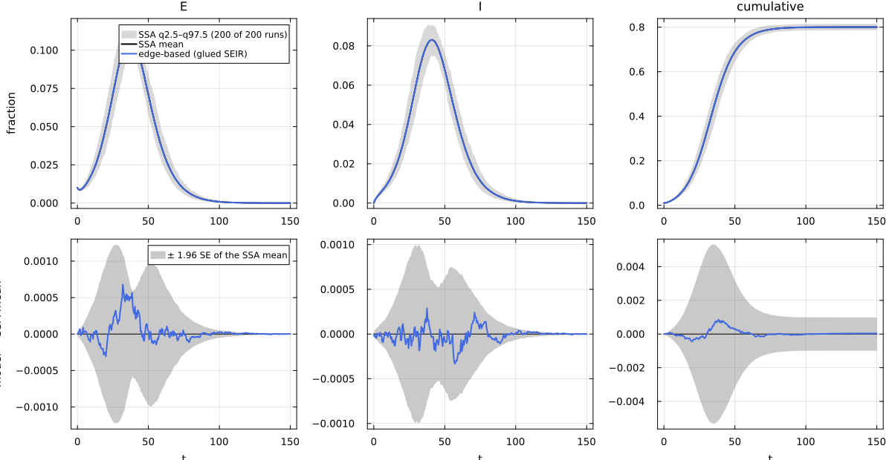

# E12. Composition: open models, gluing, stratification


- [What this page shows](#what-this-page-shows)
- [The shared first cell](#the-shared-first-cell)
- [The glued model against
  simulation](#the-glued-model-against-simulation)
- [H1: the edge-based lift is strict under
  gluing](#h1-the-edge-based-lift-is-strict-under-gluing)
- [H2 and stratification](#h2-and-stratification)
- [Naturality: what commutes with gluing and what does
  not](#naturality-what-commutes-with-gluing-and-what-does-not)
- [F7: Catalyst’s `extend` is not
  gluing](#f7-catalysts-extend-is-not-gluing)
- [Summary of the laws on this page](#summary-of-the-laws-on-this-page)
- [References](#references)

## What this page shows

A model is often assembled from parts: a transmission step, a natural
history, a vaccination programme. NetworkEpiCore composes reaction
networks as **open models** (`open_model`, with legs of exposed species)
glued along shared species (`glue`, a pushout that *concatenates*
reaction lists), and stratifies them over types (`stratify`). The
question for a back end is whether it respects composition: is the model
of the glued network the glued models of the parts? This page:

1.  builds SEIR from a transmission part and a natural-history part, and
    checks that it is the canned SEIR of `:seir_pois5`, both as syntax
    and as an edge-based vector field;
2.  checks law **H1**: the edge-based lift of a gluing is the sum of the
    lifts of the parts. The per-reaction lift is local, so this holds
    exactly;
3.  checks **H2**, stage expansion commuting with gluing and lifting,
    and stratification commuting with gluing on the typed network of
    `:sir_sbm2`;
4.  runs `check_naturality` for two natural transformations: Rempała’s
    mass-action quotient (Rempała 2023) commutes with gluing, while the
    map to the S-anchored pairwise model does not (**F2**: the pairwise
    models are lax);
5.  shows **F7**: Catalyst’s `extend` is a union, not a gluing.

It mirrors NodeBasedModels’ page N08, which shows the pairwise side of
F2.

## The shared first cell

``` julia
include(joinpath(@__DIR__, "..", "_shared", "setup.jl"))
using NetworkEpiCore, NetworkOutbreaks, Catalyst, Plots
transmission = @reaction_network transmission begin
    @parameters τ
    τ, S + I --> E + I     # contact: S converted to E, I unchanged
end
history = @reaction_network history begin
    @parameters σ γ
    σ, E --> I             # latency
    γ, I --> R             # recovery
end
tr = open_model(contact_model(transmission); legs = [[:S], [:E, :I]])
pr = open_model(contact_model(history); legs = [[:E, :I, :R]])
seir = glue(tr, pr; on = [:E, :I])     # pushout along E and I, reactions concatenated
sc   = scenario(:seir_pois5)           # SEIR on Poisson(5), τ = 1/6, σ = 1/5, γ = 1/4, 1% seeds in E
@assert isequivalent(seir, sc.model)
ref  = scenario_summary(sc)
# --- EBM vignette ---------------------------------------------------------------
using EdgeBasedModels
sys  = edge_based(seir, sc.network)                        # low level: the glued open model
sysF = build_seir(PoissonDegree(5), :σ, :τ, :γ)            # factory
@assert vector_fields_equal(symbolic_ode(sys), symbolic_ode(sysF))
seir
```

    OpenContactModel :transmission_history  (source: transform; method: explicit; rates: PerContact)
      species       S (Sus)   E   I   R
      contacts      [1] S + I → E + I    τ    contact     infector I, entry E
      transitions   [2] E → I            σ    progress
                    [3] I → R            γ    progress
      typing        T_EB  ⇒  edge_based ✓  s_anchored ✓  pairwise ✓  individual ✓  pair ✓  stochastic ✓  mass_action ✓
      assumptions   glue of :transmission, :history along E, I: pushout of the species; reactions concatenated, the rates of identical reactions added
                    Sus = the union of the parts' susceptible classes = {S}
                    transmission: Sus inferred as recipients \ contact products = {S}
                    history: Sus inferred as recipients \ contact products = {}
      legs          [[S], [E, I], [E, I, R]]

The history part alone has no susceptible class, so it is not a T_EB
model on its own, and `edge_based` refuses it. Its per-reaction lift
still exists and is what gluing needs. The typing report of each part:

``` julia
contact_model(history)
```

    ContactModel :history  (source: Catalyst.ReactionSystem; method: stoichiometry; rates: PerContact)
      species       E   I   R
      transitions   [1] E → I    σ    progress
                    [2] I → R    γ    progress
      typing        T_EB  ⇒  edge_based ✗  s_anchored ✗  pairwise ✓  individual ✓  pair ✓  stochastic ✓  mass_action ✓
      violations    The model has no susceptible class (no contact converts a susceptible node).
      assumptions   Sus inferred as recipients \ contact products = {}

## The glued model against simulation

``` julia
sol = solve_epidemic(sys, sc)
det = model_curves(sys, sol; t = sc.tgrid, label = "edge-based (glued SEIR)")
comparisonplot(ref, det; observables = [:E, :I, :cumulative])
```



``` julia
reference_note(sc, ref)
```

NetworkOutbreaks reference `:seir_pois5`: N = 10000, 200 runs (a fresh
graph per run), conditioned on MajorOutbreak(0.05); 200 major runs,
P(major) = 1.000 (95% CI 0.981–1.000).

``` julia
compare(ref, det)
```

    ComparisonTable :seir_pois5  (scenario b3d403ab; conditioned mean of 200 runs)
      curve                    observable        D∞     t(D∞)       SE∞        z∞       ΔR∞  95% CI                 Δpeak   Δt_peak  coverage
      edge-based (glued SEIR)  S            0.00086     38.50   0.00271      0.80   0.00003  [-0.00095,  0.00102]   0.00000      0.00     1.000
      edge-based (glued SEIR)  E            0.00068     32.00   0.00063      1.84   0.00003  [-0.00095,  0.00102]   0.00051      0.00     1.000
      edge-based (glued SEIR)  I            0.00033     57.00   0.00051      1.10   0.00003  [-0.00095,  0.00102]  -0.00003      0.00     1.000
      edge-based (glued SEIR)  R            0.00059     44.50   0.00242      0.79   0.00003  [-0.00095,  0.00102]   0.00003      0.00     1.000
      edge-based (glued SEIR)  infectious   0.00033     57.00   0.00051      1.10   0.00003  [-0.00095,  0.00102]  -0.00003      0.00     1.000
      edge-based (glued SEIR)  cumulative   0.00086     38.50   0.00271      0.80   0.00003  [-0.00095,  0.00102]   0.00003      0.50     1.000

## H1: the edge-based lift is strict under gluing

The edge-based field is a sum of per-reaction terms (DESIGN §D.4).
Gluing concatenates reaction lists, so the field of the glued model is
the sum of the parts’ fields. When the gluing renames species, the
parts’ fields are first pushed forward along the inclusions.
`lift_contributions` gives each part’s terms, and `sum_contributions`
adds them:

``` julia
parts = sum_contributions(lift_contributions(tr, sc.network), lift_contributions(pr, sc.network))
```

    LiftContributions :transmission_plus_history on NetworkEpiCore.ConfigurationNetwork(NetworkEpiCore.PoissonDegree(5.0))  (configuration closure)
      coordinates  θ, ξ, φ_E, φ_I, pop_E, pop_I, φ_R, pop_R
      seed factors q_S (initially susceptible fraction of S)
      [1] S + I → E + I  (τ)   contact
            θ'      += -φ_I*τ
            φ_I'    += -φ_I*τ
            φ_E'    += 5*q_S*exp(5.0(-1 + θ))*φ_I*ξ*τ
            pop_E'  += 5.0q_S*exp(5.0(-1 + θ))*φ_I*ξ*τ
      [2] E → I  (σ)   progress
            φ_E'    += -φ_E*σ
            φ_I'    += φ_E*σ
            pop_E'  += -pop_E*σ
            pop_I'  += pop_E*σ
      [3] I → R  (γ)   progress
            φ_I'    += -φ_I*γ
            φ_R'    += φ_I*γ
            pop_I'  += -pop_I*γ
            pop_R'  += pop_I*γ

``` julia
vector_fields_equal(symbolic_ode(sys), symbolic_ode(parts))
```

    true

The law is not special to Poisson networks. On the negative binomial
network of `:sir_nb4` (mean 4, variance 8), where ψ is not exponential:

``` julia
nb = ConfigurationNetwork(NegBinDegree(mean = 4, var = 8))
vector_fields_equal(symbolic_ode(edge_based(seir, nb)),
                    symbolic_ode(sum_contributions(lift_contributions(tr, nb), lift_contributions(pr, nb))))
```

    true

The same holds with an exit. Here vaccination S → V brings in the
survival factor ξ:

``` julia
vax = open_model(ContactModel(:vax; transitions = [NodeTransition(:S, :V, :ν)]); legs = [[:S]])
sirv = glue(open_model(sir_model(); legs = [[:S, :I, :R]]), vax; on = [:S])
@assert isequivalent(sirv, sirv_model())
lhs = symbolic_ode(edge_based(sirv, nb))
rhs = symbolic_ode(sum_contributions(lift_contributions(sir_model(), nb),
                                     lift_contributions(vax, nb; susceptible = [:S])))
(; equal = vector_fields_equal(lhs, rhs), has_ξ = :ξ in state_names(lhs))
```

    (equal = true, has_ξ = true)

In Lean, the lift is additive in the reaction list and natural in
species maps, and together these give the gluing law. The theorems cover
arbitrary ψ, ψ′, ψ″ and every T_EB reaction type (contacts, exits,
progressions, removals):

``` julia
for n in ("NEP.lift_append", "NEP.lift_map", "NEP.lift_glue")
    display(lean_cite(n))
end
```

Lean: `NEP.lift_append`

Lean: `NEP.lift_map`

Lean: `NEP.lift_glue`

## H2 and stratification

**Stage expansion.** `erlang_stages(m, :I, n)` splits I into n stages
with the same mean infectious period. It is a syntax transform, applied
reaction by reaction, so it commutes with gluing: staging the glued
model equals gluing the staged parts. The transmission part gets one
contact per infectious stage.

``` julia
staged = erlang_stages(seir.model, :I, 3)
tr3 = open_model(ContactModel(:tr3; contacts = [Contact(:S, Symbol(:I_, j), :E, :τ) for j in 1:3]);
                 legs = [[:S], [:E, :I_1, :I_2, :I_3]])
pr3 = open_model(erlang_stages(contact_model(history), :I, 3); legs = [[:E, :I_1, :I_2, :I_3, :R]])
glued3 = glue(tr3, pr3; on = [:E, :I_1, :I_2, :I_3])
net = sc.network
(; syntax = isequivalent(staged, glued3),
   lift = vector_fields_equal(symbolic_ode(edge_based(staged, net)),
                              symbolic_ode(sum_contributions(lift_contributions(tr3, net),
                                                             lift_contributions(pr3, net)))))
```

    (syntax = true, lift = true)

**Stratification.** On the two-block network of `:sir_sbm2`, stratifying
a glued SIR gives the stratified model of the scenario. Its multitype
lift is the sum of the lifts of the stratified parts:

``` julia
st = strata([:a, :b]; sizes = [0.5, 0.5])
infect = open_model(ContactModel(:infect; contacts = [Contact(:S, :I, :I, :τ)]); legs = [[:S, :I]])
recover = open_model(ContactModel(:recover; transitions = [NodeTransition(:I, :R, :γ)]); legs = [[:I, :R]])
sir_glued = glue(infect, recover; on = [:I])
sb = scenario(:sir_sbm2)
strat = (; syntax = isequivalent(stratify(sir_glued, st), sb.model),
   commutes = isequivalent(stratify(sir_glued, st), glue(stratify(infect, st), stratify(recover, st); on = [:I_a, :I_b])),
   lift = vector_fields_equal(symbolic_ode(edge_based(stratify(sir_glued, st), sb.network)),
                              symbolic_ode(sum_contributions(lift_contributions(stratify(infect, st), sb.network),
                                                             lift_contributions(stratify(recover, st), sb.network)))))
strat
```

    (syntax = true, commutes = true, lift = true)

The stratified glued model against the typed simulation of `:sir_sbm2`:

``` julia
refb = scenario_summary(sb)
sysb = edge_based(stratify(sir_glued, st), sb.network)
detb = model_curves(sysb, solve_epidemic(sysb, sb); t = sb.tgrid, label = "edge-based (glued, stratified SIR)")
reference_note(sb, refb)
```

NetworkOutbreaks reference `:sir_sbm2`: N = 10000, 200 runs (a fresh
graph per run), conditioned on MajorOutbreak(0.05); 200 major runs,
P(major) = 1.000 (95% CI 0.981–1.000).

``` julia
compare(refb, detb; observables = [:I_a, :I_b, :cumulative])
```

    ComparisonTable :sir_sbm2  (scenario f8e96436; conditioned mean of 200 runs)
      curve                               observable        D∞     t(D∞)       SE∞        z∞       ΔR∞  95% CI                 Δpeak   Δt_peak  coverage
      edge-based (glued, stratified SIR)  I_a          0.00113     16.50   0.00060      3.31   0.00111  [-0.00009,  0.00231]   0.00078      0.25     0.905
      edge-based (glued, stratified SIR)  I_b          0.00071     15.00   0.00048      2.39   0.00111  [-0.00009,  0.00231]   0.00033      0.00     0.971
      edge-based (glued, stratified SIR)  cumulative   0.00147     19.25   0.00223      2.20   0.00111  [-0.00009,  0.00231]   0.00111      0.00     0.851

## Naturality: what commutes with gluing and what does not

A natural transformation between two representations, for example
“edge-based ⇒ mass action” (Rempała’s quotient, morphism M3), commutes
with gluing if its component on the glued model is the glued components.
`check_naturality` checks three things symbolically: every component
verifies; the source and target fields of the glued model are the sums
over the parts; and the maps agree. We glue two strains that compete for
the same susceptibles and share the recovered class:

``` julia
A = open_model(ContactModel(:a; contacts = [Contact(:S, :I1, :I1, :τ1)], transitions = [NodeTransition(:I1, :R, :γ)]);
               legs = [[:S, :R]])
B = open_model(ContactModel(:b; contacts = [Contact(:S, :I2, :I2, :τ2)], transitions = [NodeTransition(:I2, :R, :γ)]);
               legs = [[:S, :R]])
pois5 = ConfigurationNetwork(PoissonDegree(5.0))
check_naturality(transformation(:rempala), A, B; network = pois5, on = [:S, :R])
```

    VerificationResult(ok = true, method = :symbolic, residual = 0.0)
      η = :rempala commutes with this gluing: the components verify, the source and target fields of the glued model are the sums over the parts, and the maps agree

Rempała’s quotient sends the EBCM to a mass-action system, whose field
is additive in the reactions, so it commutes (law H1′ for mass action).
The map to the **S-anchored pairwise** model (M6, `:eb_to_pws`; its
closure is the one of Kiss et al. (2023)) does not:

``` julia
r = check_naturality(transformation(:eb_to_pws), A, B; network = pois5, on = [:S, :R])
@assert !r.ok "EB ⇒ PW^S unexpectedly commutes with this gluing"
r
```

    VerificationResult(ok = false, method = :symbolic, residual = 0.0)
      target: dSI1/dt of the glued model ≠ the sum over the parts (difference (-SI1*SI2*τ2) / S)
      target: dSI2/dt of the glued model ≠ the sum over the parts (difference (-SI1*SI2*τ1) / S)

The check fails in the target (as expected): in the glued pairwise
model, the pair \[S I₁\] is also drained when the S node is infected by
strain 2, through the closed triple \[I₁ S I₂\]. That term, −τ₂\[S
I₁\]\[S I₂\]/\[S\] on Poisson(5), is in neither part’s pairwise system.
This is failure **F2** of DESIGN §D.6: pairwise models are only *lax*
under gluing. Every component still verifies, so for pairwise and
pair-based back ends the right order is to compose the syntax first,
then lift.

No Lean theorem is cited for this failure. It is checked by computation,
not in Lean: the `check_naturality` call above compares the two vector
fields symbolically (`method = :symbolic`) and must fail (the page does
not render otherwise). The NodeBasedModels vignette N08 evaluates a
second witness, SIR glued with the vaccination exit S → V along S, where
the contact drains \[S V\] only in the glued system.

## F7: Catalyst’s `extend` is not gluing

`glue` concatenates reaction lists, so gluing a model with itself along
all species doubles every rate. Catalyst’s `extend` takes a union, so
extending a network by itself returns the same network:

``` julia
part = @network_component part begin
    @parameters τ γ
    τ, S + I --> 2I
    γ, I --> R
end
ext = complete(Catalyst.extend(part, part))
cm_part = contact_model(complete(part))
f7 = isequivalent(contact_model(ext), glue(cm_part, cm_part).model)   # is extend(A, A) the gluing of A with A?
(; catalyst_extend_reactions = length(reactions(ext)),
   extend_is_the_part = isequivalent(contact_model(ext), cm_part),
   glue_rates = [string(c.rate) for c in contacts(glue(cm_part, cm_part).model)],
   extend_is_glue = f7)
```

    (catalyst_extend_reactions = 2, extend_is_the_part = true, glue_rates = ["2τ"], extend_is_glue = false)

``` julia
glue(sir_model(), sir_model())
```

    OpenContactModel :sir_sir  (source: transform; method: explicit; rates: PerContact)
      species       S (Sus)   I   R
      contacts      [1] S + I → I + I    2τ    contact     infector I, entry I
      transitions   [2] I → R            2γ    progress
      typing        T_EB  ⇒  edge_based ✓  s_anchored ✓  pairwise ✓  individual ✓  pair ✓  stochastic ✓  mass_action ✓
      assumptions   glue of :sir, :sir along S, I, R: pushout of the species; reactions concatenated, the rates of identical reactions added
                    Sus = the union of the parts' susceptible classes = {S}
                    identical reactions merged: S + I → I + I (2 copies); I → R (2 copies)
                    sir: Sus inferred as recipients \ contact products = {S}
                    sir: Sus inferred as recipients \ contact products = {S}
      legs          [[S, I, R], [S, I, R]]

Neither is wrong, but they are different operations. The union is right
for merging two descriptions of the same process. The sum is right for
adding two sources of transmission (DESIGN §D.2), and it is the one for
which H1 holds.

## Summary of the laws on this page

``` julia
h2 = isequivalent(staged, glued3) &&
     vector_fields_equal(symbolic_ode(edge_based(staged, net)),
                         symbolic_ode(sum_contributions(lift_contributions(tr3, net), lift_contributions(pr3, net))))
mdtable(["law", "statement", "holds here", "checked by"],
        [("H1", "EB(glue(A, B)) = EB(A) + EB(B)", vector_fields_equal(symbolic_ode(sys), symbolic_ode(parts)), "`vector_fields_equal`; Lean `NEP.lift_glue`"),
         ("H2", "stage expansion commutes with gluing and lifting", h2, "`isequivalent`, `vector_fields_equal`"),
         ("stratification", "stratify commutes with glue, then lift", strat.syntax && strat.commutes && strat.lift, "`isequivalent`, `vector_fields_equal`"),
         ("H1′ (MA)", "Rempała's quotient is natural under gluing", check_naturality(transformation(:rempala), A, B; network = pois5, on = [:S, :R]).ok, "`check_naturality`"),
         ("F2", "EB ⇒ PW^S is natural under gluing", r.ok, "`check_naturality` (symbolic; not Lean)"),
         ("F7", "Catalyst `extend` = `glue`", f7, "`isequivalent` above")])
```

| law | statement | holds here | checked by |
|---:|---:|---:|---:|
| H1 | EB(glue(A, B)) = EB(A) + EB(B) | true | `vector_fields_equal`; Lean `NEP.lift_glue` |
| H2 | stage expansion commutes with gluing and lifting | true | `isequivalent`, `vector_fields_equal` |
| stratification | stratify commutes with glue, then lift | true | `isequivalent`, `vector_fields_equal` |
| H1′ (MA) | Rempała’s quotient is natural under gluing | true | `check_naturality` |
| F2 | EB ⇒ PW^S is natural under gluing | false | `check_naturality` (symbolic; not Lean) |
| F7 | Catalyst `extend` = `glue` | false | `isequivalent` above |

## References

<div id="refs" class="references csl-bib-body hanging-indent">

<div id="ref-kiss2023necessary" class="csl-entry">

Kiss, István Z., Eben Kenah, and Grzegorz A. Rempała. 2023. “Necessary
and Sufficient Conditions for Exact Closures of Epidemic Equations on
Configuration Model Networks.” *Journal of Mathematical Biology* 87 (2):
36. <https://doi.org/10.1007/s00285-023-01967-9>.

</div>

<div id="ref-rempala2023equivalence" class="csl-entry">

Rempała, Grzegorz A. 2023. *Equivalence of Mass Action and Poisson
Network SIR Epidemic Models*.
<https://doi.org/10.48550/arXiv.2310.13866>.

</div>

</div>
