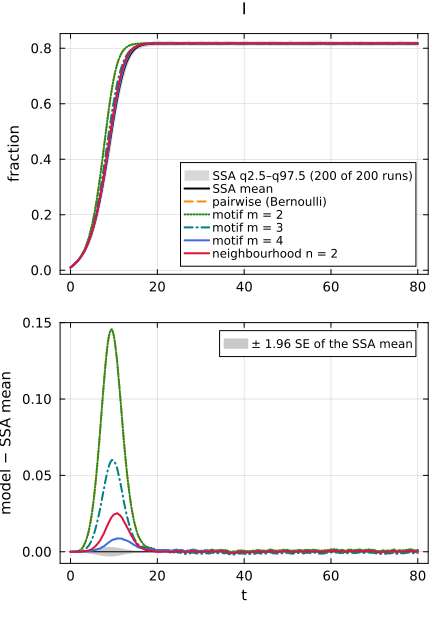
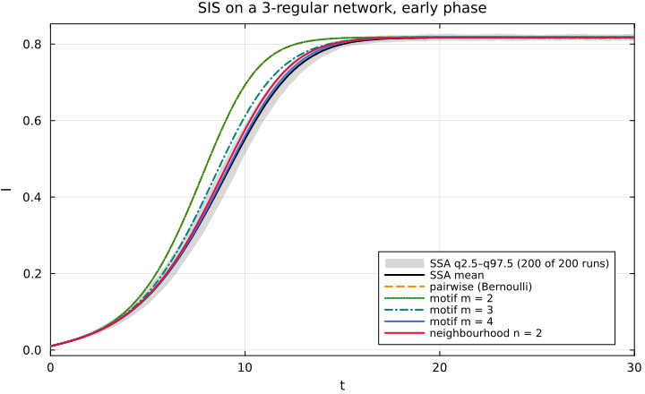
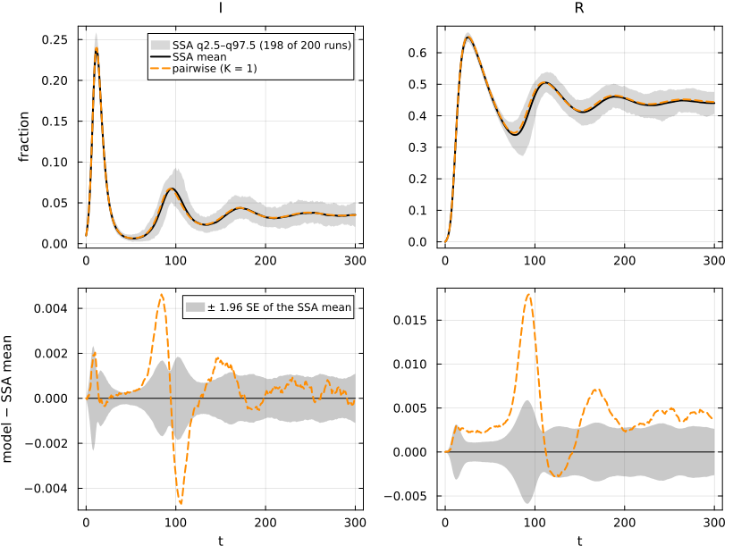

# E13. Where edge-based models stop: SIS and SIRS


- [What this page shows](#what-this-page-shows)
- [The shared first cell](#the-shared-first-cell)
- [SIS: node-based approximations against
  simulation](#sis-node-based-approximations-against-simulation)
- [SIRS: the constant-closure pairwise
  model](#sirs-the-constant-closure-pairwise-model)
- [Where to go instead](#where-to-go-instead)
- [References](#references)

## What this page shows

An edge-based model keeps one number θ per edge: the probability that
the edge has not yet transmitted. That is enough when a node, once
infected, never becomes susceptible again. Then a node is susceptible
exactly when no edge has transmitted to it, so S = q ψ(θ). If recovered
nodes return to S (SIS, SIRS), a node can be susceptible after an edge
*has* transmitted to it, and the edges of a node are no longer
independent. Miller, Slim and Volz state this as the scope of the method
(Miller et al. 2012). The typing layer refuses these models and names
the back ends that accept them. This page:

1.  shows the refusal for `:sis_reg3` and `:sirs_pois5`, with the typing
    reports and the error texts;
2.  compares the node-based (pairwise, motif and neighbourhood)
    approximations of NodeBasedModels with NetworkOutbreaks’ SIS
    simulation, conditioned on survival. This is the same comparison as
    NodeBasedModels’ page N12;
3.  does the same for SIRS with the constant-closure pairwise model.

## The shared first cell

``` julia
include(joinpath(@__DIR__, "..", "_shared", "setup.jl"))
using Statistics
using NetworkEpiCore, NetworkOutbreaks, Catalyst, Plots
sis = @reaction_network sis begin
    @parameters τ γ
    τ, S + I --> 2I        # contact: per-contact (per-edge) rate τ
    γ, I --> S             # recovery back into the susceptible class (type resus)
end
model = contact_model(sis)          # prints the typing report: T_net, not T_EB
sc    = scenario(:sis_reg3)         # 3-regular, τ = 1/2, γ = 1/4, 1% seeds in I, t ∈ [0, 80]
@assert isequivalent(model, sc.model)
ref   = scenario_summary(sc)        # committed NetworkOutbreaks ensemble, conditioned on survival
# --- EBM vignette ---------------------------------------------------------------
using EdgeBasedModels
err = try
    edge_based(model, sc.network)                          # low level: refused
catch e
    e
end
@assert err isa AdmissibilityError
print(sprint(showerror, err))
```

    AdmissibilityError: edge_based(:sis, ConfigurationNetwork(RegularDegree(3))):
      `γ, I --> S` (type resus: node → sus) produces the susceptible species S.
      The edge-based model is exact only when no reaction produces a susceptible class
      (Miller, Slim & Volz 2012, Part I). Back ends that accept this model: node_based
      (pairwise, individual, pair, motif, neighbourhood), simulate, mass_action.
      Try: NodeBasedModels.node_based(model, net; closure = KeelingClosure()).

The factory refuses too, with a migration message:

``` julia
try
    build_sis(RegularDegree(3), :τ, :γ)
catch e
    print(sprint(showerror, e))
end
```

    build_sis returned SIR dynamics relabelled (ebm-core #1, verified issue E01): its θ equation was Miller's SIR equation and its I was the cumulative incidence. SIS has no exact edge-based model (an arrow into the susceptible class breaks the edge-based construction; Miller, Slim & Volz 2012). Use NodeBasedModels.node_based(sis_model(), net) (pairwise closures, reinfection counting with with_reinfection_counting) or NetworkOutbreaks.simulate(sis_model(), net; …) (exact stochastic simulation).

The typing report of the model says why. The reaction `γ, I --> S` has
type `resus`, which is in T_net but not in the edge-based fragment T_EB:

``` julia
model
```

    ContactModel :sis  (source: Catalyst.ReactionSystem; method: stoichiometry; rates: PerContact)
      species       S (Sus)   I
      contacts      [1] S + I → I + I    τ    contact    infector I, entry I
      transitions   [2] I → S            γ    resus
      typing        T_net  ⇒  edge_based ✗  s_anchored ✗  pairwise ✓  individual ✓  pair ✓  stochastic ✓  mass_action ✓
      violations    `γ, I --> S` (type resus: node → sus) produces the susceptible species S.
      assumptions   Sus inferred as recipients \ contact products = {S}

No Lean theorem is cited for this refusal. It is a rule of the typing (a
`resus` reaction is outside T_EB), and it is tested: NetworkEpiCore’s
test set “T_EB and the transition types” (`test/suites/ir_typing.jl`)
checks that T_EB is {contact, exit, progress, remove} and that a `resus`
violation blocks the edge-based back ends, and EdgeBasedModels’ test set
“E19: SIS, SIRS and reinfection-counted models are refused by every
closure” (`test/suites/lift_errors.jl`) checks that `edge_based` refuses
SIS and SIRS on every network type. This is a statement about the syntax
only, not a proof that no edge-based semantics for reinfection can
exist.

SIRS is refused for the same reason (`ε, R --> S`):

``` julia
sirs = @reaction_network sirs begin
    @parameters τ γ ε
    τ, S + I --> 2I
    γ, I --> R
    ε, R --> S             # waning immunity (type resus)
end
sr = scenario(:sirs_pois5)          # Poisson(5), τ = 1/6, γ = 1/4, ε = 1/50, t ∈ [0, 300]
@assert isequivalent(contact_model(sirs), sr.model)
try
    edge_based(contact_model(sirs), sr.network)
catch e
    print(sprint(showerror, e))
end
```

    AdmissibilityError: edge_based(:sirs, ConfigurationNetwork(PoissonDegree(5.0))):
      `ε, R --> S` (type resus: node → sus) produces the susceptible species S.
      The edge-based model is exact only when no reaction produces a susceptible class
      (Miller, Slim & Volz 2012, Part I). Back ends that accept this model: node_based
      (pairwise, individual, pair, motif, neighbourhood), simulate, mass_action.
      Try: NodeBasedModels.node_based(model, net; closure = KeelingClosure()).

## SIS: node-based approximations against simulation

The scenario lists the back ends that accept SIS, each with its status:

``` julia
sort(collect(sc.backends); by = first)
```

    7-element Vector{Pair{Symbol, Symbol}}:
             :edge_based => :inadmissible
                  :motif => :approximate
          :neighbourhood => :approximate
     :pairwise_bernoulli => :approximate
         :pairwise_const => :approximate
            :pgf_closure => :inadmissible
            :reinfection => :approximate

The error message points to `node_based`. NodeBasedModels builds the
population pairwise model (Bernoulli closure on a regular network), the
motif closures of order m = 2, 3, 4 and the neighbourhood model with n =
2 (Keeling 1999). The motif and neighbourhood systems are solved with
their own solvers, and their prevalence is wrapped as `ModelCurves` on
the scenario grid.

The shared recipe `comparisonplot` styles a curve by its representation;
`style_curves!` gives each curve of a comparison figure its own colour
and dash, in the order the curves were passed:

``` julia
"""
    style_curves!(p, styles) -> p

Give the model curves of a `comparisonplot` figure `p` their own line colours and styles.
`styles` holds one `(linecolor, linestyle)` pair per curve, in the order the curves were passed.
The recipe draws the curves last in every panel, so they are the last `length(styles)` series of
each subplot; the labels of the first panel are checked against `labels`.
"""
function style_curves!(p, styles, labels)
    n = length(styles)
    first_labels = [s[:label] for s in p.subplots[1].series_list[end-n+1:end]]
    first_labels == collect(labels) ||
        error("style_curves!: the last series of the first panel are $(first_labels), not $(labels)")
    for sp in p.subplots, (k, (lc, ls)) in enumerate(styles)
        s = sp.series_list[end-n+k]
        s[:linecolor] = Plots.plot_color(lc)
        s[:linestyle] = ls
    end
    return p
end
```

    Main.Notebook.style_curves!

``` julia
import NodeBasedModels as NBM
pw  = NBM.node_based(sc; closure = NBM.BernoulliClosure())
cpw = model_curves(pw, solve_epidemic(pw, sc); t = sc.tgrid, label = "pairwise (Bernoulli)")
function motif_curves(m)
    s = NBM.node_based(sc; level = :motif, closure = NBM.MotifClosure(3, m))
    sol = NBM.solve_motif(s; saveat = sc.tgrid)
    ModelCurves(sc.tgrid, Dict(:I => compartment(s, sol, :I)); label = "motif m = $(m)", representation = :motif)
end
cm2, cm3, cm4 = motif_curves(2), motif_curves(3), motif_curves(4)
nb  = NBM.node_based(sc; level = :neighbourhood, n = 2)
cnb = ModelCurves(sc.tgrid, Dict(:I => NBM.neighbourhood_compartment(nb, NBM.solve_neighbourhood(nb; saveat = sc.tgrid), :I));
                  label = "neighbourhood n = 2", representation = :neighbourhood)
approx = [cpw, cm2, cm3, cm4, cnb]
# one colour and dash per approximation, in both figures of this section (see `style_curves!` below)
styles = [(:darkorange, :dash), (:forestgreen, :dot), (:teal, :dashdot), (:royalblue, :solid), (:crimson, :solid)]
p = comparisonplot(ref, approx...; observables = [:I])
style_curves!(p, styles, [c.label for c in approx])
```



``` julia
reference_note(sc, ref)
```

NetworkOutbreaks reference `:sis_reg3`: N = 10000, 200 runs (a fresh
graph per run), conditioned on Survival(); 200 surviving runs,
P(survival) = 1.000 (95% CI 0.981–1.000).

``` julia
tab = compare(ref, approx; observables = [:I])
```

    ComparisonTable :sis_reg3  (scenario 485d890e; conditioned mean of 200 runs)
      curve                 observable        D∞     t(D∞)       SE∞        z∞       ΔR∞  95% CI                 Δpeak   Δt_peak  coverage
      pairwise (Bernoulli)  I            0.14556      9.50   0.00160     93.69  14.70400  [14.70400, 14.70400]  -0.00023      4.25     0.153
      motif m = 2           I            0.14556      9.50   0.00160     93.69       NaN  [     NaN,      NaN]  -0.00023      1.75     0.153
      motif m = 3           I            0.06009      9.75   0.00160     39.65       NaN  [     NaN,      NaN]  -0.00025    -17.50     0.202
      motif m = 4           I            0.00888     10.75   0.00160     11.27       NaN  [     NaN,      NaN]  -0.00016    -15.50     0.688
      neighbourhood n = 2   I            0.02525     10.75   0.00160     21.41       NaN  [     NaN,      NaN]  -0.00106     37.75     0.769

The ΔR∞ column is meaningless here. It compares cumulative incidence,
which for SIS counts reinfections, and only the pairwise curves carry
it. The transient and the endemic level are the quantities to compare:

``` julia
st = ref.cond[:I]
rows = map(approx) do c
    row = tab[c.label, :I]
    (c.label, row.D∞, row.t_D∞, c[:I][end], c[:I][end] - st.mean[end], row.z∞)
end
push!(rows, ("NetworkOutbreaks (mean of surviving runs)", 0.0, NaN, st.mean[end], 0.0, NaN))
mdtable(["approximation", "D∞(I)", "t at D∞", "I(80)", "I(80) − SSA", "z∞"], rows)
```

| approximation | D∞(I) | t at D∞ | I(80) | I(80) − SSA | z∞ |
|---:|---:|---:|---:|---:|---:|
| pairwise (Bernoulli) | 0.1456 | 9.5 | 0.8182 | 0.001126 | 93.69 |
| motif m = 2 | 0.1456 | 9.5 | 0.8182 | 0.001126 | 93.69 |
| motif m = 3 | 0.06009 | 9.75 | 0.8163 | -0.0007423 | 39.65 |
| motif m = 4 | 0.008878 | 10.75 | 0.8174 | 0.0003262 | 11.27 |
| neighbourhood n = 2 | 0.02525 | 10.75 | 0.8173 | 0.0002934 | 21.41 |
| NetworkOutbreaks (mean of surviving runs) | 0 | NaN | 0.8171 | 0 | NaN |

At t = 80 every approximation is within 0.0011 of the simulated endemic
prevalence 0.8171, whose standard error is 0.00030. They differ in the
transient, where the epidemic takes off: the closest over the whole time
course is motif m = 4 (D∞(I) = 0.0089), and the pairwise curve is up to
0.1456 from the simulated mean. The motif closure with m = 2 *is*
Keeling’s pairwise closure; its curve differs from the pairwise one by
at most 1.7e-09. This page does not establish what causes the transient
gap. Moment-closure error is one candidate, but a timing offset of this
kind can also come from the initial condition (the ODEs start from an
uncorrelated pair state around a small seed, while each simulated run
starts from explicit seeded nodes whose neighbourhoods are not yet
correlated in the same way) or from the comparison itself: the reference
is the mean over surviving runs with no time alignment, so run-to-run
variation in when the epidemic takes off flattens and delays the mean
curve. The endemic level at t = 80 should be insensitive to both, and
there the approximations agree with the simulation to within the values
in the I(80) − SSA column.

The early epidemic, where the approximations differ most:

``` julia
p = plot(ref, :I; median = false, legend = :bottomright, title = "SIS on a 3-regular network, early phase")
for (c, (lc, ls)) in zip(approx, styles)
    plot!(p, c, :I; linecolor = lc, linestyle = ls)
end
xlims!(p, 0, 30)
```



## SIRS: the constant-closure pairwise model

For SIRS on Poisson(5) NodeBasedModels’ default is the pairwise model
with the constant closure K = ⟨k(k−1)⟩/⟨k⟩² = 1, which is exact for SIR
on a Poisson network but only an approximation once immunity wanes:

``` julia
refr = scenario_summary(sr)
pr = NBM.node_based(sr)
cpr = model_curves(pr, solve_epidemic(pr, sr); t = sr.tgrid, label = "pairwise (K = 1)")
comparisonplot(refr, cpr; observables = [:I, :R])
```



``` julia
reference_note(sr, refr)
```

NetworkOutbreaks reference `:sirs_pois5`: N = 10000, 200 runs (a fresh
graph per run), conditioned on Survival(); 198 surviving runs,
P(survival) = 0.990 (95% CI 0.964–0.997).

``` julia
compare(refr, cpr; observables = [:S, :I, :R])
```

    ComparisonTable :sirs_pois5  (scenario c4098584; conditioned mean of 198 runs)
      curve             observable        D∞     t(D∞)       SE∞        z∞       ΔR∞  95% CI                 Δpeak   Δt_peak  coverage
      pairwise (K = 1)  S            0.02032     89.00   0.00345      6.15   2.16161  [ 2.16133,  2.16190]   0.00000      0.00     0.226
      pairwise (K = 1)  I            0.00469    106.00   0.00119      5.43   2.16161  [ 2.16133,  2.16190]   0.00104      0.00     0.688
      pairwise (K = 1)  R            0.01793     94.00   0.00301      6.20   2.16161  [ 2.16133,  2.16190]   0.00238      0.00     0.226

``` julia
str = refr.cond[:I]
mdtable(["quantity", "pairwise (K = 1)", "NetworkOutbreaks (surviving runs)", "SE of the mean"],
        [("I(300)", cpr[:I][end], str.mean[end], str.se[end]),
         ("peak I", maximum(cpr[:I]), maximum(str.mean), NaN),
         ("time of the peak", sr.tgrid[argmax(cpr[:I])], sr.tgrid[argmax(str.mean)], NaN)])
```

| quantity | pairwise (K = 1) | NetworkOutbreaks (surviving runs) | SE of the mean |
|---:|---:|---:|---:|
| I(300) | 0.03513 | 0.03535 | 0.000558 |
| peak I | 0.2399 | 0.2388 | NaN |
| time of the peak | 12 | 12 | NaN |

## Where to go instead

- NodeBasedModels’ pages N09–N12 treat SIS in depth: reinfection
  counting (N09), motif closures (N10), the neighbourhood model (N11)
  and all of them against simulation (N12).
- NetworkOutbreaks simulates any T_net model exactly on explicit graphs.
- For models with waning immunity *and* a large effect of network
  structure, simulation is the reference; the pairwise model above is a
  fast approximation whose error is printed on this page.

## References

<div id="refs" class="references csl-bib-body hanging-indent">

<div id="ref-keeling1999effects" class="csl-entry">

Keeling, M. J. 1999. “The Effects of Local Spatial Structure on
Epidemiological Invasions.” *Proceedings of the Royal Society B* 266:
859–67. <https://doi.org/10.1098/rspb.1999.0716>.

</div>

<div id="ref-miller2012edge" class="csl-entry">

Miller, Joel C., Anja C. Slim, and Erik M. Volz. 2012. “Edge-Based
Compartmental Modelling for Infectious Disease Spread.” *Journal of the
Royal Society Interface* 9 (70): 890–906.
<https://doi.org/10.1098/rsif.2011.0403>.

</div>

</div>
