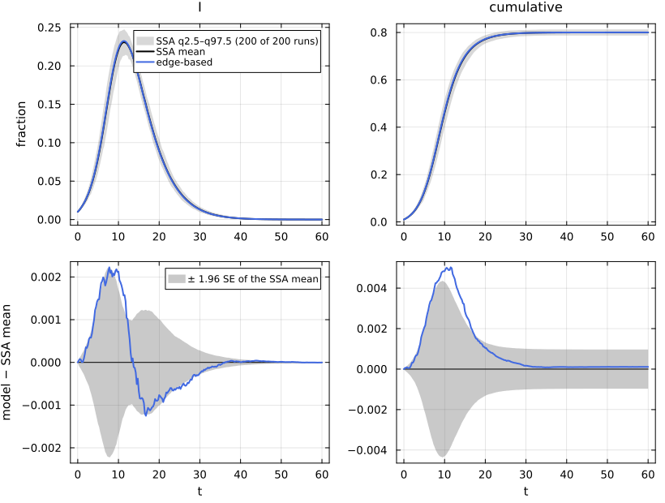
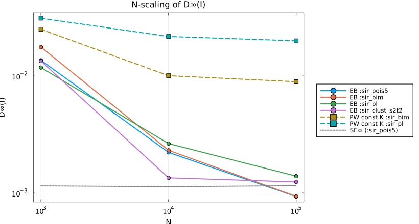

# E14. Validation methodology


- [What this page shows](#what-this-page-shows)
- [The shared first cell](#the-shared-first-cell)
- [1. What a scenario is, and how its ensemble is
  built](#1-what-a-scenario-is-and-how-its-ensemble-is-built)
  - [Hashing and the strict cache](#hashing-and-the-strict-cache)
  - [What a summary holds](#what-a-summary-holds)
- [2. The comparison statistics and the two
  bands](#2-the-comparison-statistics-and-the-two-bands)
- [3. Every exact-limit scenario in one
  table](#3-every-exact-limit-scenario-in-one-table)
- [4. N-scaling: exact in the limit versus
  biased](#4-n-scaling-exact-in-the-limit-versus-biased)
- [Lean](#lean)
- [References](#references)

## What this page shows

Every other page compares an edge-based model with a NetworkOutbreaks
ensemble through the same three calls: `scenario_summary(sc)`,
`comparisonplot(ref, curves...)` and `compare(ref, curves...)`. This
page explains what stands behind them:

1.  how a reference ensemble is defined, run, conditioned, summarised,
    hashed and cached, and why a page cannot silently use a stale one;
2.  what the statistics of `compare` are, and how the two bands of
    `comparisonplot` differ;
3.  the edge-based model against every committed scenario it is declared
    exact for, in one table;
4.  the N-scaling protocol, which separates “exact in the large-N limit”
    from “biased”.

It mirrors NodeBasedModels’ page N13. The simulation side is documented
in NetworkOutbreaks’ validation vignette
(`NetworkOutbreaks.jl/vignettes/05_validation`).

## The shared first cell

``` julia
include(joinpath(@__DIR__, "..", "_shared", "setup.jl"))
using NetworkEpiCore, NetworkOutbreaks, Catalyst, Plots
sir = @reaction_network sir begin
    @parameters τ γ
    τ, S + I --> 2I        # contact: per-contact (per-edge) rate τ; S converted, I unchanged
    γ, I --> R             # node-local transition
end
model = contact_model(sir)          # prints the typing report (B.1)
sc    = scenario(:sir_pois5)        # Poisson(5), τ = 1/6, γ = 1/4, 1% seeds in I, t ∈ [0, 60]
@assert isequivalent(model, sc.model)
ref   = scenario_summary(sc)        # committed NO ensemble: N = 10⁴, 200 runs, a fresh G(N, p) graph per run
# --- EBM vignette ---------------------------------------------------------------
using EdgeBasedModels
sys   = edge_based(model, sc.network)                      # low level
sysF  = build_sir(PoissonDegree(5), :τ, :γ)                # factory (demonstration only; see A.6)
@assert vector_fields_equal(symbolic_ode(sys), symbolic_ode(sysF))
lift_contributions(model, sc.network)                      # table: per-reaction θ̇, φ̇, pop′ terms
# --- both -------------------------------------------------------------------------
sol = solve_epidemic(sys, sc)                              # p, initial, tspan, saveat all from the scenario
det = model_curves(sys, sol; t = sc.tgrid, label = "edge-based")   # back end
comparisonplot(ref, det; observables = [:I, :cumulative])  # top: spread ribbon + mean + curve; bottom: residual ± 1.96 SE
compare(ref, det)                                          # D∞, z∞, ΔR∞ (95% CI), Δpeak, Δt_peak
```

    ComparisonTable :sir_pois5  (scenario 34c89792; conditioned mean of 200 runs)
      curve       observable        D∞     t(D∞)       SE∞        z∞       ΔR∞  95% CI                 Δpeak   Δt_peak  coverage
      edge-based  S            0.00503     11.50   0.00222      2.61   0.00011  [-0.00086,  0.00108]   0.00000      0.00     0.788
      edge-based  I            0.00223      7.75   0.00113      2.59   0.00011  [-0.00086,  0.00108]   0.00157      0.00     0.822
      edge-based  R            0.00387     13.25   0.00168      2.39   0.00011  [-0.00086,  0.00108]   0.00011      0.00     0.784
      edge-based  infectious   0.00223      7.75   0.00113      2.59   0.00011  [-0.00086,  0.00108]   0.00157      0.00     0.822
      edge-based  cumulative   0.00503     11.50   0.00222      2.61   0.00011  [-0.00086,  0.00108]   0.00011      3.50     0.788

## 1. What a scenario is, and how its ensemble is built

A `Scenario` is pure data: model, network, parameters, seeding, time
grid, observables, the simulation settings `SimConfig`, the verdict for
each back end, tags, and expected values that NetworkEpiCore computes
when the registry is built.

``` julia
println(sc.title)
println("sim:      ", sc.sim)
println("backends: ", sort(collect(sc.backends); by = first))
println("expected: ", sort(collect(sc.expected); by = first))
println("tgrid:    ", first(sc.tgrid), ":", step(sc.tgrid), ":", last(sc.tgrid))
```

    SIR on a Poisson(5) configuration network
    sim:      SimConfig(N = 10000, nsims = 200, graphs = :per_run, algorithm = :next_reaction, base_seed = 20260926, condition = MajorOutbreak(0.05), align = NoAlignment())
    backends: [:edge_based => :exact_limit, :pairwise_const => :exact_limit, :pgf_closure => :exact_limit]
    expected: [:R0 => 2.0, :T => 0.4, :closure_constant => 1.0, :excess_degree => 5.0, :final_size => 0.8002039676767992, :mean_degree => 5.0, :r => 0.41666666666666663]
    tgrid:    0.0:0.25:60.0

The simulation settings follow one protocol for every scenario:

- **Population and runs.** N = 10⁴ nodes and 200 runs, with a fresh
  graph for every run. The runs are then independent and identically
  distributed, so the standard error of the mean is sd/√n. The expensive
  dynamic scenarios use N = 5000 and 100 runs.
- **Streams.** Graph r and SSA run r draw from
  `NetworkOutbreaks.stable_rng(base_seed + r)` and
  `stable_rng(base_seed + 2³² + r)`. These are StableRNGs seeded through
  splitmix64, because adjacent raw seeds of a StableRNG are correlated.
  The algorithm is NextReaction, or mass action and fleeting-contact
  SSAs where the scenario says so.
- **Seeding.** Exactly ρN seed nodes, chosen uniformly without
  replacement. The `Scenario` constructor requires ρN to be an integer,
  so the deterministic and stochastic seedings are the same.
- **Conditioning.** SIR-type scenarios keep the *major* runs, those
  whose incidence (excluding seeds) reaches 0.05 N by the end
  (`MajorOutbreak(0.05)`). SIS and SIRS keep the runs still infected at
  the end (`Survival()`). Summaries store both conditioned and
  unconditioned statistics, and P(major) with a 95% Wilson interval.
- **Alignment.** Alignment is off for canonical scenarios: with a fixed
  fraction ρ of seeds the large-N limit is the ODE from the same ρ, with
  no random delay at leading order. The small-seed scenarios shift each
  run to cross 2% incidence at the deterministic crossing time
  (`CumulativeCrossing(0.02)`) and are also stored unaligned (see
  [E07](../E07_final_size/index.md)).

### Hashing and the strict cache

A scenario is hashed from its canonical text: a versioned, line-based
rendering with sorted keys and every real printed to 17 significant
digits. Neither `Base.hash` nor `repr` is used. The cache key is
(scenario hash, `NetworkOutbreaks.ALGORITHM_REVISION`), and both are
stored in the committed file:

``` julia
txt = canonical_text(sc)
println(join(first(split(txt, '\n'), 12), '\n'), "\n… (", length(split(txt, '\n')), " lines)")
```

    scenario_format = 1
    initial = SeedFraction(fractions=[:I => 0.01], default=nothing)
    model = ContactModel(species=[:S, :I, :R], susceptible=[:S], convention=PerContact(), contacts=[Contact(recipient=:S, infector=:I, product=:I, rate=:τ, layer=:all)], transitions=[NodeTransition(from=:I, to=:R, rate=:γ)], labels=[])
    network = ConfigurationNetwork(degrees=PoissonDegree(mean=5))
    observables = [:S, :I, :R, :infectious, :cumulative]
    params = [:γ => 0.25, :τ => 0.16666666666666666]
    sim.N = 10000
    sim.algorithm = :next_reaction
    sim.align = NoAlignment()
    sim.base_seed = 20260926
    sim.condition = MajorOutbreak(threshold=0.050000000000000003)
    sim.graphs = :per_run
    … (16 lines)

``` julia
(; scenario_hash = scenario_hash(sc), in_summary = ref.scenario_hash,
   algorithm_revision = NetworkOutbreaks.ALGORITHM_REVISION, summary_revision = ref.algorithm_revision)
```

    (scenario_hash = "34c89792c3f7f8c0e0f9d4b2ce83aaafac299e4c50c06a7a435e42ec746a421f", in_summary = "34c89792c3f7f8c0e0f9d4b2ce83aaafac299e4c50c06a7a435e42ec746a421f", algorithm_revision = "2", summary_revision = "2")

``` julia
ref.provenance
```

    Dict{String, String} with 10 entries:
      "Graphs"             => "1.14.0"
      "algorithm_revision" => "2"
      "julia_version"      => "1.12.7"
      "NetworkOutbreaks"   => "0.2.0"
      "NetworkEpiCore"     => "0.1.0"
      "StableRNGs"         => "1.0.4"
      "algorithm"          => "NextReaction"
      "summary_digits"     => "mean=6,se=6,sd=5,quantiles=5,times=6"
      "generator"          => "NetworkOutbreaks.summarise(scenario_ensemble(sc))"
      "summary_revision"   => "2"

The pages are rendered with `NETEPI_STRICT_CACHE=1`, so a missing or
stale summary is an error, never a silent fallback to a user cache or a
fresh simulation. Changing anything about the scenario, even only the
number of runs, changes the hash:

``` julia
alt = derive(sc; id = :sir_pois5_demo, nsims = 7)
println("hash of the derived scenario: ", scenario_hash(alt)[1:8], " (was ", scenario_hash(sc)[1:8], ")")
try
    scenario_summary(alt)
catch e
    # print paths relative to the checkout, not the machine it was rendered on
    print(replace(sprint(showerror, e), dirname(pkgdir(NetworkOutbreaks)) * "/" => ""))
end
```

    hash of the derived scenario: 387c303d (was 34c89792)
    ArgumentError: scenario_summary(:sir_pois5_demo): no valid committed summary (hash 387c303d, algorithm revision 2, summary revision 2) in NetworkOutbreaks.jl/data/scenarios: ArgumentError: load_summary: no summary sir_pois5_demo__387c303d for scenario :sir_pois5_demo in NetworkOutbreaks.jl/data/scenarios. Regenerate it with NetworkOutbreaks (scripts/regenerate_scenarios.jl). Regenerate it with NetworkOutbreaks' scripts/regenerate_scenarios.jl, or pass policy = :auto to compute it

### What a summary holds

``` julia
(; id = ref.id, N = ref.N, nsims = ref.nsims, n_major = ref.n_major, p_major = ref.p_major,
   p_major_ci = ref.p_major_ci, observables = ref.observables, grid = length(ref.t),
   statistics = keys(ref.cond[:I]), realised = keys(ref.realised))
```

    (id = :sir_pois5, N = 10000, nsims = 200, n_major = 200, p_major = 1.0, p_major_ci = (0.9811546736227335, 1.0), observables = [:S, :I, :R, :infectious, :cumulative], grid = 241, statistics = (:mean, :sd, :se, :q025, :q25, :q50, :q75, :q975), realised = [:excess_degree, :erased_fraction, :mean_degree, :clustering])

Each run also records the realised degree statistics of its graph. For
the Poisson(5) scenario (Erdős–Rényi graphs):

``` julia
using Statistics
mdtable(["statistic", "nominal", "mean over runs", "sd over runs"],
        [("mean degree", mean_degree(sc.network), mean(ref.realised[:mean_degree]), std(ref.realised[:mean_degree])),
         ("excess degree", excess_degree(sc.network), mean(ref.realised[:excess_degree]), std(ref.realised[:excess_degree]))])
```

|     statistic | nominal | mean over runs | sd over runs |
|--------------:|--------:|---------------:|-------------:|
|   mean degree |       5 |          5.004 |      0.03404 |
| excess degree |       5 |          5.006 |        0.036 |

## 2. The comparison statistics and the two bands

`compare(ref, curves...)` evaluates, for each curve and observable, on
the summary’s grid:

- D∞ = max_t \|x_det(t) − x̄(t)\| and its argmax t(D∞), where x̄ is the
  conditioned mean;
- SE∞, the largest standard error of the mean on the grid, and z∞ =
  max_t \|x_det − x̄\| / max(se, 10⁻⁴);
- ΔR∞ = R_det(t_end) − mean(final size), with its 95% interval ±1.96
  sd/√n;
- Δpeak and Δt_peak, the differences of the peak heights and peak times;
- the coverage, the fraction of the grid where \|x_det − x̄\| ≤ 1.96 se.

``` julia
tab = compare(ref, det)        # `det` is the edge-based curve of the shared first cell
```

    ComparisonTable :sir_pois5  (scenario 34c89792; conditioned mean of 200 runs)
      curve       observable        D∞     t(D∞)       SE∞        z∞       ΔR∞  95% CI                 Δpeak   Δt_peak  coverage
      edge-based  S            0.00503     11.50   0.00222      2.61   0.00011  [-0.00086,  0.00108]   0.00000      0.00     0.788
      edge-based  I            0.00223      7.75   0.00113      2.59   0.00011  [-0.00086,  0.00108]   0.00157      0.00     0.822
      edge-based  R            0.00387     13.25   0.00168      2.39   0.00011  [-0.00086,  0.00108]   0.00011      0.00     0.784
      edge-based  infectious   0.00223      7.75   0.00113      2.59   0.00011  [-0.00086,  0.00108]   0.00157      0.00     0.822
      edge-based  cumulative   0.00503     11.50   0.00222      2.61   0.00011  [-0.00086,  0.00108]   0.00011      3.50     0.788

`comparisonplot` draws two rows. The top row has the **spread** band,
the pointwise q2.5–q97.5 of the individual runs, which says where a
single epidemic lies. The bottom row has the **mean** band ±1.96 SE
around zero, which says how well the ensemble mean is known. A model
that is exact in the large-N limit should stay inside the mean band, up
to the O(1/N) bias. Min–max bands are never drawn.

``` julia
comparisonplot(ref, det; observables = [:I, :cumulative])
```



``` julia
reference_note(sc, ref)
```

NetworkOutbreaks reference `:sir_pois5`: N = 10000, 200 runs (a fresh
graph per run), conditioned on MajorOutbreak(0.05); 200 major runs,
P(major) = 1.000 (95% CI 0.981–1.000).

The spread band is much wider than the mean band:

``` julia
st = ref.cond[:I]
i = argmax(st.mean)
(; t_peak = ref.t[i], spread_width = st.q975[i] - st.q025[i], mean_band_width = 2 * 1.96 * st.se[i],
   ratio = (st.q975[i] - st.q025[i]) / (2 * 1.96 * st.se[i]))
```

    (t_peak = 11.25, spread_width = 0.034019999999999995, mean_band_width = 0.00253232, ratio = 13.434321096859795)

With iid runs the ratio is about 2·1.96·sd/(2·1.96·sd/√n) = √n = √200 ≈
14, if the runs are roughly normal at the peak.

## 3. Every exact-limit scenario in one table

The acceptance rule for back ends declared `:exact_limit` is D∞(I) \<
0.005 and \|ΔR∞\| \< 0.005 (at N = 10⁴ and 200 runs, the Monte Carlo SE
of the mean is about 10⁻³). Here is the edge-based model on every
committed scenario with that verdict, built with `edge_based(sc)` and
solved with `solve_epidemic(sys, sc)`. For typed models the prevalence
is the observable `:infectious`, the sum over infectious compartments:

``` julia
exact = [s for s in scenarios() if get(s.backends, :edge_based, :none) === :exact_limit]
rows = map(exact) do s
    r = scenario_summary(s)
    y = edge_based(s)
    c = model_curves(y, solve_epidemic(y, s); t = s.tgrid, label = "EB")
    row = compare(r, c; observables = [:infectious])["EB", :infectious]
    ok = row.D∞ < 0.005 && abs(row.ΔR∞) < 0.005
    (string("`:", s.id, "`"), r.N, r.nsims, row.D∞, row.z∞, row.ΔR∞, ok ? "yes" : "**no**")
end
mdtable(["scenario", "N", "runs", "D∞(infectious)", "z∞", "ΔR∞", "passes"], rows)
```

|                  scenario |      N | runs | D∞(infectious) |    z∞ |        ΔR∞ | passes |
|--------------------------:|-------:|-----:|---------------:|------:|-----------:|-------:|
|               `:sir_reg6` |  10000 |  200 |       0.001712 | 2.769 |  0.0002613 |    yes |
|              `:sir_pois5` |  10000 |  200 |       0.002226 | 2.587 |  0.0001105 |    yes |
|                `:sir_nb4` |  10000 |  200 |        0.00115 | 1.742 |   0.000338 |    yes |
|                `:sir_bim` |  10000 |  200 |       0.002319 | 3.586 | -0.0003484 |    yes |
|                 `:sir_pl` |  10000 |  200 |       0.002645 | 3.944 |   0.001729 |    yes |
|                `:sir_wm5` |  10000 |  200 |       0.001436 | 2.223 | -0.0004354 |    yes |
|             `:seir_pois5` |  10000 |  200 |      0.0003316 |   1.1 |  3.403e-05 |    yes |
|         `:sir_erl3_pois5` |  10000 |  200 |       0.002282 | 2.263 |  0.0002938 |    yes |
|            `:seair_pois5` |  10000 |  200 |      0.0006045 | 2.905 |  -0.001017 |    yes |
|        `:twostrain_pois5` |  10000 |  200 |        0.00128 | 1.925 | -0.0005612 |    yes |
|          `:sir_vax_pois5` |  10000 |  200 |        0.00191 | 2.258 |   0.002127 |    yes |
|         `:sir_clust_s2t2` |  10000 |  200 |        0.00135 | 2.051 |  0.0002972 |    yes |
|       `:sir_clust_pois12` |  10000 |  200 |      0.0009005 | 1.766 |  -0.000596 |    yes |
|               `:sir_sbm2` |  10000 |  200 |       0.001724 | 3.309 |   0.001109 |    yes |
|             `:sir_unstr2` |  10000 |  200 |      0.0009329 | 1.855 | -5.059e-05 |    yes |
|                `:sir_mpx` |  10000 |  200 |      0.0007965 | 1.181 | -0.0001989 |    yes |
|      `:sir_ne_reg6_eta01` |   5000 |  100 |       0.002161 | 2.616 |   0.002023 |    yes |
|       `:sir_ne_reg6_eta1` |   5000 |  100 |       0.001927 | 1.636 | -0.0002362 |    yes |
|      `:sir_ne_reg6_eta10` |   5000 |  100 |       0.002067 |  3.82 | -0.0007482 |    yes |
|        `:sir_dense_pois5` |  10000 |  200 |      0.0008275 | 2.157 |  -0.001767 |    yes |
|       `:sir_dense_pois20` |  10000 |  200 |      0.0007812 |  1.73 | -0.0005074 |    yes |
|      `:sir_dense_pois100` |  10000 |  200 |       0.001046 | 2.476 |  -5.82e-05 |    yes |
|       `:sir_pois5_5seeds` |  10000 | 1000 |       0.004679 | 12.07 |  0.0001581 |    yes |
|        `:sir_pois5_1seed` |  10000 | 2000 |        0.00472 | 14.91 |  0.0002093 |    yes |
|         `:sir_erl2_pois5` |  10000 |  200 |       0.001866 | 1.852 | -4.993e-05 |    yes |
|         `:sir_erl5_pois5` |  10000 |  200 |       0.001346 | 1.518 | -0.0002892 |    yes |
|        `:sir_pois5_N1000` |   1000 | 2000 |        0.01361 | 14.84 |  0.0007033 | **no** |
|      `:sir_pois5_N100000` | 100000 |   20 |      0.0009335 | 1.526 |   0.000182 |    yes |
|          `:sir_bim_N1000` |   1000 | 2000 |        0.01765 | 21.31 |   0.004343 | **no** |
|        `:sir_bim_N100000` | 100000 |   20 |      0.0009377 | 1.941 | -0.0003429 |    yes |
|           `:sir_pl_N1000` |   1000 | 2000 |         0.0118 | 20.49 |     0.0148 | **no** |
|         `:sir_pl_N100000` | 100000 |   20 |       0.001396 | 2.974 | -0.0002687 |    yes |
|   `:sir_clust_s2t2_N1000` |   1000 | 2000 |        0.01341 | 16.13 |   0.002418 | **no** |
| `:sir_clust_s2t2_N100000` | 100000 |   20 |       0.001245 | 2.335 |  0.0002037 |    yes |
|          `:sir_dc_bim_r0` |  10000 |  200 |       0.002477 | 3.379 |  0.0003819 |    yes |
|         `:sir_dc_bim_r05` |  10000 |  200 |       0.002678 | 3.762 |  5.479e-05 |    yes |
|        `:sir_dc_bim_rn05` |  10000 |  200 |       0.001052 | 1.705 |   0.001586 |    yes |
|        `:sir_dormant_msv` |  10000 |  200 |       0.001585 | 3.086 |    0.00073 |    yes |
|        `:sir_dormant_dvd` |  10000 |  200 |       0.001283 | 2.736 |  0.0004785 |    yes |
|       `:sir_dormant_fast` |  10000 |  200 |       0.002273 | 2.862 |  2.864e-05 |    yes |
|         `:sir_mfsh_pois5` |  10000 |  200 |        0.00251 | 3.628 |  0.0006688 |    yes |
|           `:sir_mfsh_msv` |  10000 |  200 |       0.001449 | 2.027 | -1.058e-05 |    yes |
|     `:sir_ne_pois5_eta10` |   5000 |  100 |       0.002345 | 2.155 |   0.001264 |    yes |
|        `:seir_clust_s2t2` |  10000 |  200 |      0.0007982 |  2.41 |   -0.00114 |    yes |
|       `:seair_clust_s2t2` |  10000 |  200 |      0.0008523 | 3.216 |  -1.76e-05 |    yes |
|               `:sir_age2` |  10000 |  200 |       0.001983 | 3.118 |  0.0004845 |    yes |
|         `:sir_hetsus_bim` |  10000 |  200 |       0.002183 | 3.045 |   0.001321 |    yes |
|     `:seirv_hetsus_pois5` |  10000 |  200 |      0.0007656 | 2.891 |  0.0007853 |    yes |

``` julia
npass = count(r -> r[end] == "yes", rows)
println(npass, " of ", length(rows), " exact-limit scenarios pass D∞ < 0.005 and |ΔR∞| < 0.005.")
failing = [r[1] for r in rows if r[end] != "yes"]
isempty(failing) || println("not passing: ", join(failing, ", "))
```

    44 of 48 exact-limit scenarios pass D∞ < 0.005 and |ΔR∞| < 0.005.
    not passing: `:sir_pois5_N1000`, `:sir_bim_N1000`, `:sir_pl_N1000`, `:sir_clust_s2t2_N1000`

A scenario that misses the rule is not necessarily one where the model
is wrong in the limit. The rule is calibrated for N = 10⁴. At N = 10³
the O(1/N) finite-size bias of the simulation is larger than the
tolerance, and those N = 10³ variants are what the N-scaling protocol
below uses to tell the two cases apart. Several scenarios pass with z∞
above 3. In the small-seed scenarios the 1000 and 2000 runs make the
standard error small, so a gap below 0.005 is many standard errors. The
fleeting-contact scenarios `:sir_mfsh_*` have a known finite-size offset
at N = 10⁴ (see [E16](../E16_dormant_fleeting/index.md)).

## 4. N-scaling: exact in the limit versus biased

Four scenarios are also run at N ∈ {10³, 10⁴, 10⁵} with {2000, 200, 20}
runs, so that N·nsims is constant and the Monte Carlo floor stays
roughly flat. An exact-in-the-limit representation approaches that floor
as N grows (its bias is O(1/N)). A structurally biased one levels off at
its bias. The edge-based model is exact in the limit on all four (Volz
2008; Miller et al. 2012); the fluctuations of the simulated epidemic
about that limit are of order N^(−1/2) (Ball 2021), which is why the
Monte Carlo floor is set by N·nsims. As a biased contrast, the pairwise
model with the constant closure K = ⟨k(k−1)⟩/⟨k⟩² is shown on the
non-Poisson-type networks `:sir_bim` and `:sir_pl`. It is exact only for
Poisson-type degrees (see
[E06](../E06_edge_based_and_pairwise/index.md)).

``` julia
import NodeBasedModels as NBM
bases = [:sir_pois5, :sir_bim, :sir_pl, :sir_clust_s2t2]
variant(id, N) = N == 10_000 ? id : Symbol(id, "_N", N)
Ns = [1_000, 10_000, 100_000]
scaling = Dict{Tuple{Symbol,String},Vector{Float64}}()
rows = []
for id in bases, N in Ns
    s = scenario(variant(id, N))
    r = scenario_summary(s)
    y = edge_based(s)
    c = model_curves(y, solve_epidemic(y, s); t = s.tgrid, label = "EB")
    row = compare(r, c; observables = [:I])["EB", :I]
    push!(get!(scaling, (id, "edge-based"), Float64[]), row.D∞)
    floor = maximum(r.cond[:I].se)
    push!(rows, (string("`:", id, "`"), N, r.nsims, "edge-based", row.D∞, floor, row.ΔR∞))
    if id in (:sir_bim, :sir_pl)
        pw = NBM.node_based(s)
        cp = model_curves(pw, solve_epidemic(pw, s); t = s.tgrid, label = "PW")
        rp = compare(r, cp; observables = [:I])["PW", :I]
        push!(get!(scaling, (id, "pairwise (constant K)"), Float64[]), rp.D∞)
        push!(rows, (string("`:", id, "`"), N, r.nsims, "pairwise (constant K)", rp.D∞, floor, rp.ΔR∞))
    end
end
mdtable(["scenario", "N", "runs", "model", "D∞(I)", "SE∞ (MC floor)", "ΔR∞"], rows)
```

| scenario | N | runs | model | D∞(I) | SE∞ (MC floor) | ΔR∞ |
|---:|---:|---:|---:|---:|---:|---:|
| `:sir_pois5` | 1000 | 2000 | edge-based | 0.01361 | 0.001153 | 0.0007033 |
| `:sir_pois5` | 10000 | 200 | edge-based | 0.002226 | 0.001135 | 0.0001105 |
| `:sir_pois5` | 100000 | 20 | edge-based | 0.0009335 | 0.001157 | 0.000182 |
| `:sir_bim` | 1000 | 2000 | edge-based | 0.01765 | 0.00092 | 0.004343 |
| `:sir_bim` | 1000 | 2000 | pairwise (constant K) | 0.02504 | 0.00092 | 0.03813 |
| `:sir_bim` | 10000 | 200 | edge-based | 0.002319 | 0.001038 | -0.0003484 |
| `:sir_bim` | 10000 | 200 | pairwise (constant K) | 0.01006 | 0.001038 | 0.03344 |
| `:sir_bim` | 100000 | 20 | edge-based | 0.0009377 | 0.000756 | -0.0003429 |
| `:sir_bim` | 100000 | 20 | pairwise (constant K) | 0.00894 | 0.000756 | 0.03344 |
| `:sir_pl` | 1000 | 2000 | edge-based | 0.0118 | 0.000614 | 0.0148 |
| `:sir_pl` | 1000 | 2000 | pairwise (constant K) | 0.03114 | 0.000614 | 0.0832 |
| `:sir_pl` | 10000 | 200 | edge-based | 0.002645 | 0.000743 | 0.001729 |
| `:sir_pl` | 10000 | 200 | pairwise (constant K) | 0.02173 | 0.000743 | 0.07013 |
| `:sir_pl` | 100000 | 20 | edge-based | 0.001396 | 0.000637 | -0.0002687 |
| `:sir_pl` | 100000 | 20 | pairwise (constant K) | 0.01997 | 0.000637 | 0.06814 |
| `:sir_clust_s2t2` | 1000 | 2000 | edge-based | 0.01341 | 0.001097 | 0.002418 |
| `:sir_clust_s2t2` | 10000 | 200 | edge-based | 0.00135 | 0.001179 | 0.0002972 |
| `:sir_clust_s2t2` | 100000 | 20 | edge-based | 0.001245 | 0.001153 | 0.0002037 |

``` julia
p = plot(; xscale = :log10, yscale = :log10, xlabel = "N", ylabel = "D∞(I)", legend = :outerright,
         title = "N-scaling of D∞(I)", size = (820, 440))
for id in bases
    plot!(p, Ns, scaling[(id, "edge-based")]; marker = :circle, label = "EB :$(id)")
end
for id in (:sir_bim, :sir_pl)
    plot!(p, Ns, scaling[(id, "pairwise (constant K)")]; marker = :square, linestyle = :dash,
          label = "PW const K :$(id)")
end
floors = [maximum(scenario_summary(scenario(variant(:sir_pois5, N))).cond[:I].se) for N in Ns]
plot!(p, Ns, floors; color = :gray, linestyle = :dot, label = "SE∞ (:sir_pois5)")
p
```



From N = 10³ to 10⁵ the edge-based D∞(I) goes from 0.0136, 0.0177,
0.0118, 0.0134 to 0.0009, 0.0009, 0.0014, 0.0012 on the four scenarios.
The constant-K pairwise model stays at 0.0089 and 0.0200 on `:sir_bim`
and `:sir_pl` at N = 10⁵, above the edge-based values and the Monte
Carlo floor.

## Lean

The validation protocol is empirical; no Lean statement is involved.

## References

<div id="refs" class="references csl-bib-body hanging-indent">

<div id="ref-ball2021clt" class="csl-entry">

Ball, Frank. 2021. “Central Limit Theorems for SIR Epidemics and
Percolation on Configuration Model Random Graphs.” *The Annals of
Applied Probability* 31 (5): 2091–142.

</div>

<div id="ref-miller2012edge" class="csl-entry">

Miller, Joel C., Anja C. Slim, and Erik M. Volz. 2012. “Edge-Based
Compartmental Modelling for Infectious Disease Spread.” *Journal of the
Royal Society Interface* 9 (70): 890–906.
<https://doi.org/10.1098/rsif.2011.0403>.

</div>

<div id="ref-volz2008sir" class="csl-entry">

Volz, Erik. 2008. “SIR Dynamics in Random Networks with Heterogeneous
Connectivity.” *Journal of Mathematical Biology* 56 (3): 293–310.
<https://doi.org/10.1007/s00285-007-0116-4>.

</div>

</div>
