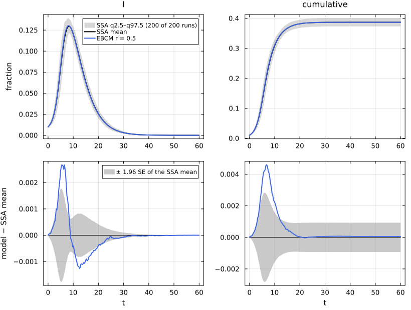
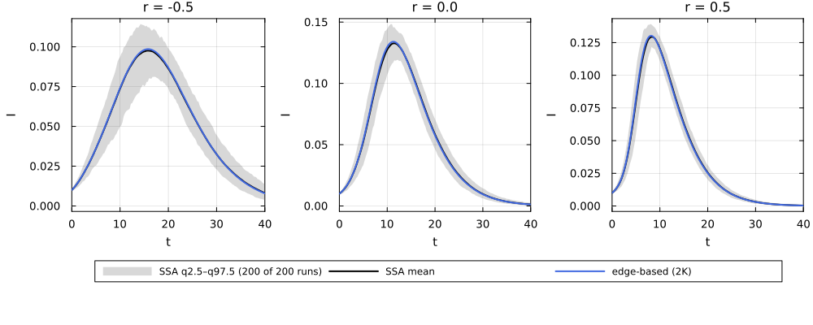
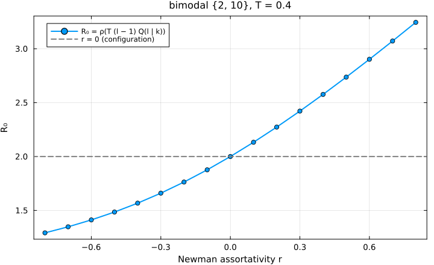

# E15. Degree correlations


- [What this page shows](#what-this-page-shows)
- [The shared first cell](#the-shared-first-cell)
- [The descriptor](#the-descriptor)
- [The lifted equations](#the-lifted-equations)
- [The 2K sampler](#the-2k-sampler)
- [EBCM against simulation for r = −0.5, 0,
  0.5](#ebcm-against-simulation-for-r--05-0-05)
- [R₀ under degree correlation](#r₀-under-degree-correlation)
- [Lean](#lean)
- [References](#references)

## What this page shows

In a configuration network the degrees at the two ends of an edge are
independent. Real contact networks are often **assortative**, with
high-degree people linked to each other, or **disassortative**. A
`DegreeCorrelatedNetwork` gives the degree classes k, their node
fractions p_k and a symmetric edge-end matrix e_kl, the fraction of edge
ends joining degree k to degree l. A degree-k node’s neighbours then
have degree l with probability Q(l \| k) = e_kl / Σ_m e_km.
EdgeBasedModels lifts any T_EB model onto it with one θ_k per degree
class (Wang et al. 2018; Miller and Volz 2013). This page:

1.  builds `degree_correlated(p; r)` from the bimodal degree law of
    `:sir_bim` with Newman’s r-mixing (Newman 2002), and lifts SIR
    twice;
2.  checks NetworkOutbreaks’ 2K sampler: its realised joint-degree
    matrix and assortativity against the targets;
3.  compares the EBCM with simulation at r = −0.5, 0 and 0.5
    (`:sir_dc_bim_*`);
4.  computes R₀ from the next-generation matrix (l − 1)Q(l \| k)T, and
    shows that assortativity raises it.

## The shared first cell

``` julia
include(joinpath(@__DIR__, "..", "_shared", "setup.jl"))
using Statistics, LinearAlgebra
using NetworkEpiCore, NetworkOutbreaks, Catalyst, Plots
sir = @reaction_network sir begin
    @parameters τ γ
    τ, S + I --> 2I        # contact: per-contact (per-edge) rate τ; S converted, I unchanged
    γ, I --> R             # node-local transition
end
model = contact_model(sir)          # prints the typing report
sc    = scenario(:sir_dc_bim_r05)   # bimodal {2: 5/6, 10: 1/6}, Newman r = 0.5, τ = 1/6, γ = 1/4
@assert isequivalent(model, sc.model)
ref   = scenario_summary(sc)        # committed NetworkOutbreaks ensemble on 2K graphs
# --- EBM vignette ---------------------------------------------------------------
using EdgeBasedModels
bimodal = EmpiricalDegree(2 => 5 / 6, 10 => 1 / 6)
net   = degree_correlated(bimodal; r = 0.5)
sys   = edge_based(model, net)                             # low level
sysF  = build_sir(net, :τ, :γ)                             # factory
@assert vector_fields_equal(symbolic_ode(sys), symbolic_ode(sysF))
lift_contributions(model, net)                             # per-reaction, per-degree-class terms
```

    LiftContributions :sir on NetworkEpiCore.DegreeCorrelatedNetwork([2, 10], [0.8333333333333334, 0.16666666666666666], [0.3750000000000001 0.12500000000000003; 0.12500000000000003 0.375])  (degree_correlated closure)
      coordinates  θ_k2, θ_k10, ξ, φ_I_k2, φ_I_k10, φ_R_k2, φ_R_k10, pop_I, pop_R
      seed factors q_S (initially susceptible fraction of S)
      [1] S + I → 2I  (τ)   contact
            θ_k2'     += -φ_I_k2*τ
            φ_I_k2'   += -φ_I_k2*τ
            θ_k10'    += -φ_I_k10*τ
            φ_I_k10'  += -φ_I_k10*τ
            φ_I_k2'   += q_S*(0.75φ_I_k2 + 2.25(θ_k10^8)*φ_I_k10)*ξ*τ
            φ_I_k10'  += q_S*(0.25000000000000006φ_I_k2 + 6.75(θ_k10^8)*φ_I_k10)*ξ*τ
            pop_I'    += q_S*(1.6666666666666667θ_k2*φ_I_k2 + 1.6666666666666665(θ_k10^9)*φ_I_k10)*ξ*τ
      [2] I → R  (γ)   progress
            φ_I_k2'   += -φ_I_k2*γ
            φ_R_k2'   += φ_I_k2*γ
            φ_I_k10'  += -φ_I_k10*γ
            φ_R_k10'  += φ_I_k10*γ
            pop_I'    += -pop_I*γ
            pop_R'    += pop_I*γ

## The descriptor

``` julia
(; degrees = net.degrees, p = net.probabilities, e = net.edge_ends,
   Q = net.edge_ends ./ sum(net.edge_ends; dims = 2), assortativity = degree_assortativity(net),
   mean_degree = mean_degree(net), excess_degree = excess_degree(net))
```

    (degrees = [2, 10], p = [0.8333333333333334, 0.16666666666666666], e = [0.3750000000000001 0.12500000000000003; 0.12500000000000003 0.375], Q = [0.75 0.25; 0.25000000000000006 0.75], assortativity = 0.5, mean_degree = 3.333333333333333, excess_degree = 5.000000000000001)

Newman’s r-mixing takes e = (1 − r) q qᵀ + r diag(q), where q_k = k
p_k/⟨k⟩ is the edge-end distribution. It keeps the degree law and the
edge-end marginals, so the mean degree (10/3) and the excess degree (5)
are those of `:sir_bim` for every r:

``` julia
qk = net.degrees .* net.probabilities ./ mean_degree(net)       # edge-end distribution q_k
maximum(abs.(net.edge_ends .- ((1 - 0.5) .* qk * qk' .+ 0.5 .* Diagonal(qk))))
```

    0.0

## The lifted equations

The partner at the end of an edge into a degree-k node has degree l with
probability Q(l \| k), and it is still susceptible with probability q
θ_l^{l−1}. So

S = q Σ_k p_k θ_k^k, φ\_{S,k} = q Σ_l Q(l \| k) θ_l^{l−1},

and a contact adds τ q Σ_l Q(l \| k)(l − 1) θ_l^{l−2} φ\_{I,l} to
φ\_{I,k}:

``` julia
symbolic_ode(sys)
```

    SymbolicODE :edge_based_model_edge_based (8 states)
      dθ_k2/dt = -φ_I_k2(t)*τ
      dθ_k10/dt = -φ_I_k10(t)*τ
      dφ_I_k2/dt = -φ_I_k2(t)*γ - φ_I_k2(t)*τ + q_S*(0.75φ_I_k2(t) + 2.25(θ_k10(t)^8)*φ_I_k10(t))*τ
      dφ_I_k10/dt = -φ_I_k10(t)*γ - φ_I_k10(t)*τ + q_S*(0.25000000000000006φ_I_k2(t) + 6.75(θ_k10(t)^8)*φ_I_k10(t))*τ
      dφ_R_k2/dt = φ_I_k2(t)*γ
      dφ_R_k10/dt = φ_I_k10(t)*γ
      dpop_I/dt = -pop_I(t)*γ + q_S*(1.6666666666666667θ_k2(t)*φ_I_k2(t) + 1.6666666666666665(θ_k10(t)^9)*φ_I_k10(t))*τ
      dpop_R/dt = pop_I(t)*γ
      parameters  τ, γ, q_S
      domain      θ_k2 ∈ (0.05, 1.0)
      domain      θ_k10 ∈ (0.05, 1.0)

With r = 0, Q(l \| k) = q_l for every k. Then all θ_k are equal and the
lift reduces to the configuration lift of ψ(x) = Σ_k p_k x^k, which is
`:sir_bim`:

``` julia
s0 = scenario(:sir_dc_bim_r0)
y0 = edge_based(model, s0.network)
ybim = edge_based(model, ConfigurationNetwork(bimodal))
tol = (; reltol = 1e-11, abstol = 1e-13)
c0 = model_curves(y0, solve_epidemic(y0, s0; tol...); t = s0.tgrid, label = "r = 0")
cb = model_curves(ybim, solve_epidemic(ybim, s0; tol...); t = s0.tgrid, label = "configuration")
(; max_I = maximum(abs.(c0[:I] .- cb[:I])), max_cumulative = maximum(abs.(c0[:cumulative] .- cb[:cumulative])))
```

    (max_I = 1.1657341758564144e-15, max_cumulative = 2.55351295663786e-15)

## The 2K sampler

NetworkOutbreaks samples a `DegreeCorrelatedNetwork` by assigning the
class sizes N p_k (largest remainders), rounding N⟨k⟩e to an integer
symmetric joint-degree matrix, and matching stubs class pair by class
pair. Self-loops and repeated edges are then erased. One draw at N = 10⁴
for each r:

``` julia
rows = map((:sir_dc_bim_rn05, :sir_dc_bim_r0, :sir_dc_bim_r05)) do id
    s = scenario(id)
    g, info = sample_graph(s.network, 10_000; rng = NetworkOutbreaks.stable_rng(s.sim.base_seed + 1))
    (string("`:", id, "`"), degree_assortativity(s.network), info.assortativity,
     maximum(abs.(info.realised_joint_degree .- s.network.edge_ends)), info.mean_degree,
     info.excess_degree, info.erased_fraction)
end
mdtable(["scenario", "target r", "realised r", "max abs. error in e", "mean degree", "excess degree", "erased fraction"], rows)
```

| scenario | target r | realised r | max abs. error in e | mean degree | excess degree | erased fraction |
|---:|---:|---:|---:|---:|---:|---:|
| `:sir_dc_bim_rn05` | -0.5 | -0.5003 | 0.000165 | 3.332 | 4.997 | 0.00036 |
| `:sir_dc_bim_r0` | 0 | -0.001051 | 0.0003152 | 3.331 | 4.994 | 0.0006599 |
| `:sir_dc_bim_r05` | 0.5 | 0.4987 | 0.0004729 | 3.331 | 4.99 | 0.0008999 |

The committed ensembles draw a fresh 2K graph for every run, and record
the realised statistics:

``` julia
rows = map((:sir_dc_bim_rn05, :sir_dc_bim_r0, :sir_dc_bim_r05)) do id
    r = scenario_summary(scenario(id))
    (string("`:", id, "`"), mean(r.realised[:mean_degree]), std(r.realised[:mean_degree]),
     mean(r.realised[:excess_degree]), std(r.realised[:excess_degree]))
end
mdtable(["scenario", "mean degree (runs)", "sd", "excess degree (runs)", "sd"], rows)
```

| scenario | mean degree (runs) | sd | excess degree (runs) | sd |
|---:|---:|---:|---:|---:|
| `:sir_dc_bim_rn05` | 3.333 | 0.0004319 | 4.998 | 0.001286 |
| `:sir_dc_bim_r0` | 3.332 | 0.0006265 | 4.995 | 0.002258 |
| `:sir_dc_bim_r05` | 3.331 | 0.0007871 | 4.989 | 0.00292 |

## EBCM against simulation for r = −0.5, 0, 0.5

``` julia
ids = [:sir_dc_bim_rn05, :sir_dc_bim_r0, :sir_dc_bim_r05]
res = map(ids) do id
    s = scenario(id)
    @assert isequivalent(model, s.model)
    r = scenario_summary(s)
    y = edge_based(model, s.network)
    c = model_curves(y, solve_epidemic(y, s); t = s.tgrid, label = "EBCM r = $(degree_assortativity(s.network))")
    (; sc = s, ref = r, sys = y, curves = c)
end
comparisonplot(res[3].ref, res[3].curves; observables = [:I, :cumulative])
```



``` julia
reference_note(res[3].sc, res[3].ref)
```

NetworkOutbreaks reference `:sir_dc_bim_r05`: N = 10000, 200 runs (a
fresh graph per run), conditioned on MajorOutbreak(0.05); 200 major
runs, P(major) = 1.000 (95% CI 0.981–1.000).

``` julia
compare(res[3].ref, res[3].curves)
```

    ComparisonTable :sir_dc_bim_r05  (scenario 6efbd6f8; conditioned mean of 200 runs)
      curve         observable        D∞     t(D∞)       SE∞        z∞       ΔR∞  95% CI                 Δpeak   Δt_peak  coverage
      EBCM r = 0.5  S            0.00460      6.75   0.00144      3.36   0.00005  [-0.00087,  0.00098]   0.00000      0.00     0.859
      EBCM r = 0.5  I            0.00268      5.50   0.00090      3.76   0.00005  [-0.00087,  0.00098]   0.00082      0.00     0.768
      EBCM r = 0.5  R            0.00291      8.75   0.00094      3.12   0.00005  [-0.00087,  0.00098]   0.00005      0.25     0.776
      EBCM r = 0.5  infectious   0.00268      5.50   0.00090      3.76   0.00005  [-0.00087,  0.00098]   0.00082      0.00     0.768
      EBCM r = 0.5  cumulative   0.00460      6.75   0.00144      3.36   0.00005  [-0.00087,  0.00098]   0.00005      7.00     0.859

All three values of r, prevalence only (grey: SSA q2.5–q97.5 and mean):

``` julia
plts = map(res) do w
    p = plot(w.ref, :I; median = false, title = "r = $(round(degree_assortativity(w.sc.network); digits = 2))",
             legend = false, xlabel = "t", ylabel = "I")
    plot!(p, w.curves, :I; label = "edge-based (2K)")
    xlims!(p, 0, 40)
end
# one legend for the three panels, in its own strip under them
leg = plot(res[1].ref, :I; median = false, framestyle = :none, legend = :top, legend_columns = 3,
           xlims = (-2, -1), ylims = (-2, -1), xlabel = "", ylabel = "")
plot!(leg, res[1].curves, :I; label = "edge-based (2K)")
plot(plts..., leg; layout = @layout([a b c; d{0.12h}]), size = (1000, 400),
     left_margin = 5Plots.mm, bottom_margin = 4Plots.mm)
```



``` julia
for w in res
    display(reference_note(w.sc, w.ref))
end
```

NetworkOutbreaks reference `:sir_dc_bim_rn05`: N = 10000, 200 runs (a
fresh graph per run), conditioned on MajorOutbreak(0.05); 200 major
runs, P(major) = 1.000 (95% CI 0.981–1.000).

NetworkOutbreaks reference `:sir_dc_bim_r0`: N = 10000, 200 runs (a
fresh graph per run), conditioned on MajorOutbreak(0.05); 200 major
runs, P(major) = 1.000 (95% CI 0.981–1.000).

NetworkOutbreaks reference `:sir_dc_bim_r05`: N = 10000, 200 runs (a
fresh graph per run), conditioned on MajorOutbreak(0.05); 200 major
runs, P(major) = 1.000 (95% CI 0.981–1.000).

``` julia
rows = map(res) do w
    row = compare(w.ref, w.curves; observables = [:I])[w.curves.label, :I]
    (degree_assortativity(w.sc.network), w.sc.expected[:final_size], w.curves[:cumulative][end],
     mean(w.ref.final_size[w.ref.major]), maximum(w.curves[:I]), maximum(w.ref.cond[:I].mean),
     row.D∞, row.z∞, row.ΔR∞)
end
mdtable(["r", "R∞ (NEC registry)", "R∞ (EBCM, end of run)", "R∞ (NO)", "peak I (EBCM)",
         "peak I (NO mean)", "D∞(I)", "z∞", "ΔR∞"], rows)
```

| r | R∞ (NEC registry) | R∞ (EBCM, end of run) | R∞ (NO) | peak I (EBCM) | peak I (NO mean) | D∞(I) | z∞ | ΔR∞ |
|---:|---:|---:|---:|---:|---:|---:|---:|---:|
| -0.5 | 0.5286 | 0.5285 | 0.5269 | 0.09855 | 0.09756 | 0.001052 | 1.705 | 0.001586 |
| 0 | 0.4956 | 0.4956 | 0.4952 | 0.134 | 0.1327 | 0.002477 | 3.379 | 0.0003819 |
| 0.5 | 0.3869 | 0.3869 | 0.3869 | 0.1302 | 0.1294 | 0.002678 | 3.762 | 5.479e-05 |

With assortative mixing the final size is *smaller* (0.387 against 0.496
at r = 0), although R₀ and the early growth rate are larger (next
section). The degree-10 nodes infect each other early, while the
degree-2 nodes, linked mostly to each other, are reached less. The peak
prevalence changes little between r = 0 and r = 0.5. With disassortative
mixing the epidemic grows more slowly, peaks lower and ends larger.

## R₀ under degree correlation

Linearising the φ\_{I,k} equations at the disease-free state gives the
next-generation matrix K_kl = T (l − 1) Q(l \| k), with T = τ/(τ + γ).
An infected degree-l partner passes infection along its l − 1 other
edges. R₀ is its spectral radius. Only the degree classes that have
edges enter, so degree-0 classes must be dropped (the
*support-restricted* matrix).

``` julia
T = sc.params[:τ] / (sc.params[:τ] + sc.params[:γ])
function r0_hand(n)
    ks = n.degrees
    keep = findall(>(0), ks)
    Q = n.edge_ends[keep, keep] ./ sum(n.edge_ends[keep, keep]; dims = 2)
    K = [T * (ks[keep][l] - 1) * Q[k, l] for k in eachindex(keep), l in eachindex(keep)]
    maximum(abs.(eigvals(K)))
end
rows = map(res) do w
    (degree_assortativity(w.sc.network), r0_hand(w.sc.network), w.sc.expected[:R0],
     basic_reproduction_number(w.sys; p = w.sc.params), w.sc.expected[:r])
end
mdtable(["r", "R₀ (by hand)", "R₀ (NetworkEpiCore)", "R₀ (EBCM)", "early growth rate"], rows)
```

|    r | R₀ (by hand) | R₀ (NetworkEpiCore) | R₀ (EBCM) | early growth rate |
|-----:|-------------:|--------------------:|----------:|------------------:|
| -0.5 |        1.485 |               1.485 |     1.485 |             0.202 |
|    0 |            2 |                   2 |         2 |            0.4167 |
|  0.5 |        2.737 |               2.737 |     2.737 |            0.7237 |

At r = 0 the matrix has rank one and R₀ = T κ_ex = 0.4 × 5 = 2.
Assortative mixing concentrates transmission among the degree-10 nodes,
whose excess degree is 9, and raises R₀. A sweep over r:

``` julia
rs = -0.8:0.1:0.8
R0s = [r0_hand(degree_correlated(bimodal; r)) for r in rs]
plot(rs, R0s; xlabel = "Newman assortativity r", ylabel = "R₀", label = "R₀ = ρ(T (l − 1) Q(l | k))",
     marker = :circle, legend = :topleft, title = "bimodal {2, 10}, T = 0.4")
hline!([2.0]; linecolor = :gray, linestyle = :dash, label = "r = 0 (configuration)")
```



``` julia
(; monotone_increasing = issorted(R0s), R0_at_minus08 = first(R0s), R0_at_08 = last(R0s))
```

    (monotone_increasing = true, R0_at_minus08 = 1.2917875251164943, R0_at_08 = 3.2449913494550757)

## Lean

None of the degree-correlation statements on this page is formalised.

## References

<div id="refs" class="references csl-bib-body hanging-indent">

<div id="ref-miller2013incorporating" class="csl-entry">

Miller, Joel C., and Erik M. Volz. 2013. “Incorporating Disease and
Population Structure into Models of SIR Disease in Contact Networks.”
*PLoS ONE* 8 (8): e69162.
<https://doi.org/10.1371/journal.pone.0069162>.

</div>

<div id="ref-newman2002assortative" class="csl-entry">

Newman, M. E. J. 2002. “Assortative Mixing in Networks.” *Physical
Review Letters* 89: 208701.
<https://doi.org/10.1103/PhysRevLett.89.208701>.

</div>

<div id="ref-wang2018edge" class="csl-entry">

Wang, Yi, Junling Ma, Jinde Cao, and Li Li. 2018. “Edge-Based Epidemic
Spreading in Degree-Correlated Complex Networks.” *Journal of
Theoretical Biology* 454: 164–81.
<https://doi.org/10.1016/j.jtbi.2018.06.006>.

</div>

</div>
