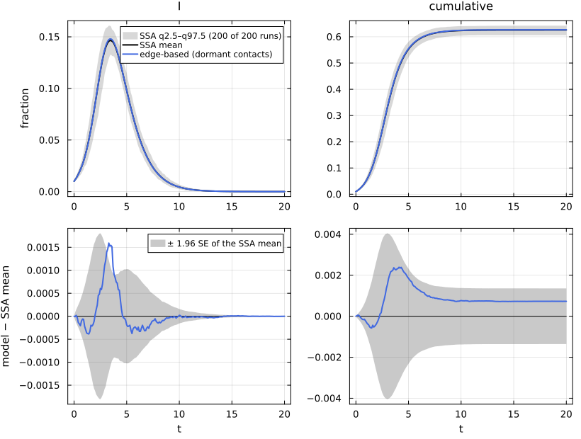
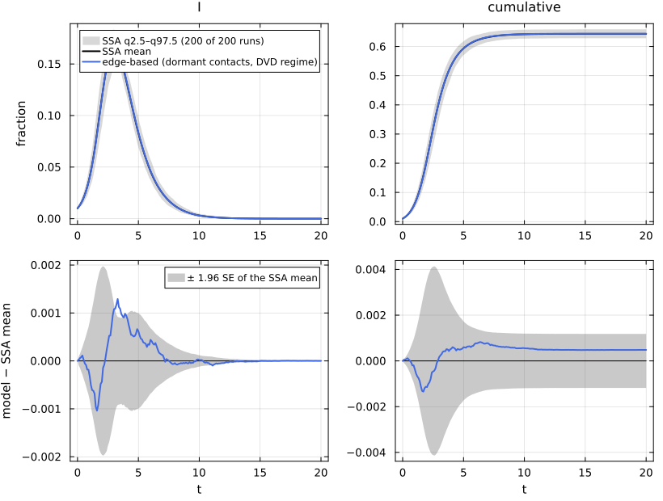
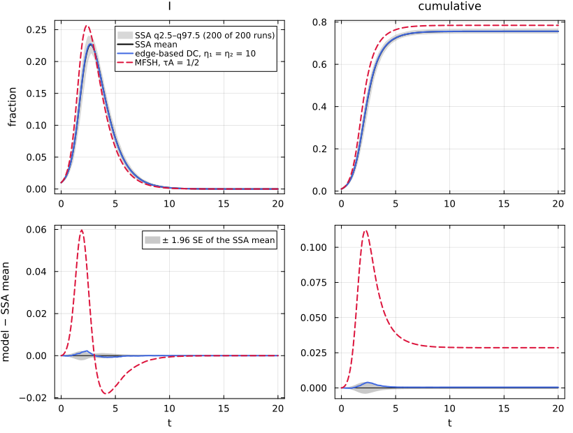
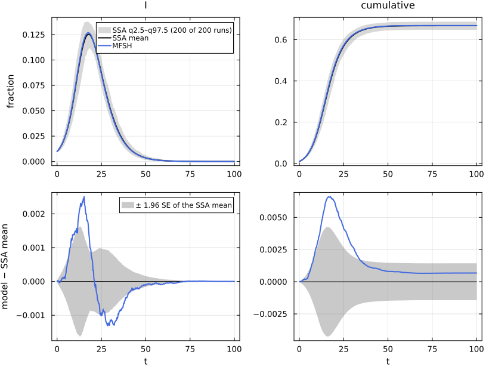
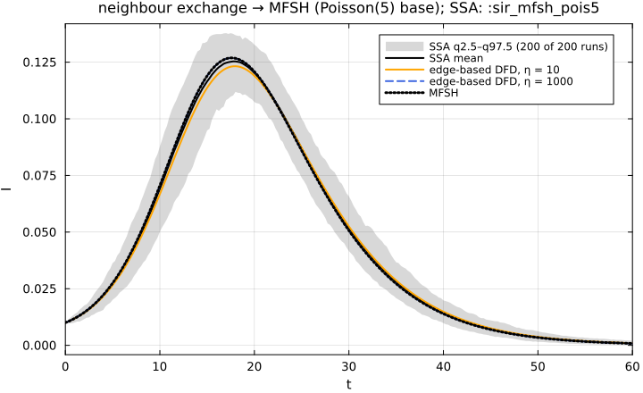

# E16. Dormant contacts and fleeting heterogeneous contacts (DVD, MFSH)


- [What this page shows](#what-this-page-shows)
- [The shared first cell](#the-shared-first-cell)
- [The dormant-contact equations](#the-dormant-contact-equations)
- [Against the dormant-contact
  process](#against-the-dormant-contact-process)
- [The fast limit: dormant contacts →
  MFSH](#the-fast-limit-dormant-contacts--mfsh)
- [Mean-field social heterogeneity](#mean-field-social-heterogeneity)
- [MFSH as the η → ∞ limit of neighbour exchange on a Poisson
  base](#mfsh-as-the-η---limit-of-neighbour-exchange-on-a-poisson-base)
- [Lean](#lean)
- [References](#references)

## What this page shows

In the neighbour-exchange network of
[E09](../E09_dynamic_partnerships/index.md) a broken edge is replaced at
once. In the **dormant-contact** (DC) model of Miller and Volz
(arXiv:1106.6319, Part II §3.2.4) a node has k_m stubs, and each stub is
either *active* (half of an edge) or *dormant*. An active edge breaks at
rate η₂ = η_break and both stubs go dormant. A dormant stub reactivates
at rate η₁ = η_form by pairing with another reactivating stub. In the
limit η₁ → 0, with degrees scaled up, this is the dynamic
variable-degree (DVD) model. When η₁ = η₂ → ∞ every contact is fleeting,
and the model tends to **mean-field social heterogeneity** (MFSH): each
node has an activity k, but meets a new random partner at every contact
\[Miller et al. (2012); arXiv:1106.6320 §3.1\]. EdgeBasedModels lifts
any T_EB model to both:
`DynamicNetwork(base, DormantContacts(η_form, η_break))` and
`MFSHNetwork(d)`. This page:

1.  builds the dormant-contact SIR of MSV’s Figure 5 twice and prints
    its equations;
2.  compares it with NetworkOutbreaks’ `DormantContactProcess` on
    `:sir_dormant_msv` and `:sir_dormant_dvd`;
3.  shows the fast limit `:sir_dormant_fast` → MFSH with per-contact
    rate τA;
4.  compares MFSH with NetworkOutbreaks’ fleeting-contact SSA on
    `:sir_mfsh_pois5` and `:sir_mfsh_msv`, including a residual offset
    at N = 10⁴;
5.  shows MFSH as the η → ∞ limit of neighbour exchange on a Poisson
    base.

## The shared first cell

``` julia
include(joinpath(@__DIR__, "..", "_shared", "setup.jl"))
using Statistics
using NetworkEpiCore, NetworkOutbreaks, Catalyst, Plots
sir = @reaction_network sir begin
    @parameters τ γ
    τ, S + I --> 2I        # contact: per-contact (per-edge) rate τ; S converted, I unchanged
    γ, I --> R             # node-local transition
end
model = contact_model(sir)          # prints the typing report
sc    = scenario(:sir_dormant_msv)  # k_m ∈ {2, 8} (½ each), η_form = η_break = 1, τ = γ = 1
@assert isequivalent(model, sc.model)
ref   = scenario_summary(sc)        # committed NetworkOutbreaks ensemble (DormantContactProcess)
# --- EBM vignette ---------------------------------------------------------------
using EdgeBasedModels
net   = DynamicNetwork(EmpiricalDegree(2 => 0.5, 8 => 0.5), DormantContacts(η_form = 1, η_break = 1))
sys   = edge_based(model, net)                             # low level
sysF  = build_sir(net, :τ, :γ)                             # factory
@assert vector_fields_equal(symbolic_ode(sys), symbolic_ode(sysF))
lift_contributions(model, net)                             # per-reaction terms and the dormant-contact process
```

    LiftContributions :sir on NetworkEpiCore.DynamicNetwork(NetworkEpiCore.ConfigurationNetwork(NetworkEpiCore.EmpiricalDegree([0.0, 0.0, 0.5, 0.0, 0.0, 0.0, 0.0, 0.0, 0.5])), NetworkEpiCore.DormantContacts(1.0, 1.0))  (dormant closure)
      coordinates  θ, θ_A, θ_D, χ, ξ, φ_I, φ_R, α_I, α_R, π_I, π_R, pop_I, pop_R
      seed factors q_S (initially susceptible fraction of S)
      [1] S + I → 2I  (τ)   contact
            θ'      += -0.5φ_I*τ
            θ_A'    += -φ_I*τ
            φ_I'    += -φ_I*τ
            φ_I'    += 0.1q_S*χ*(1 + 28.0(θ^6))*φ_I*ξ*τ
            α_I'    += (1/5)*q_S*(θ + 0.5θ_A*(1 + 28.0(θ^6)) + 4.0(θ^7))*φ_I*ξ*τ
            π_I'    += 0.1q_S*θ_D*(1 + 28.0(θ^6))*φ_I*ξ*τ
            pop_I'  += 0.5q_S*(θ + 4.0(θ^7))*φ_I*ξ*τ
      [2] I → R  (γ)   progress
            φ_I'    += -φ_I*γ
            φ_R'    += φ_I*γ
            α_I'    += -α_I*γ
            α_R'    += α_I*γ
            π_I'    += -π_I*γ
            π_R'    += π_I*γ
            pop_I'  += -pop_I*γ
            pop_R'  += pop_I*γ
      [3] dormant contacts  (η_form = 1.0, η_break = 1.0)   process
            θ_A'    += -θ_A + θ_D
            θ_D'    += θ_A - θ_D
            χ'      += -χ + θ_D^2
            φ_I'    += -φ_I + π_I*θ_D
            α_I'    += π_I - α_I
            π_I'    += -π_I + α_I
            φ_R'    += -φ_R + π_R*θ_D
            α_R'    += π_R - α_R
            π_R'    += -π_R + α_R

## The dormant-contact equations

At stationarity, which the model assumes at t = 0, a stub is active with
probability A = η₁/(η₁ + η₂) and dormant with probability D = η₂/(η₁ +
η₂). The coordinates are:

- θ = Aθ_A + Dθ_D, the probability that a stub has not transmitted to
  its node, given active (θ_A) or dormant (θ_D);
- χ, the partnership memory: φ_S = χ q ψ′(θ)/ψ′(1);
- φ_X, an active stub has not transmitted and is joined to an X node;
- α_X and π_X, the fractions of active and of dormant stubs that belong
  to X nodes.

``` julia
symbolic_ode(sys)
```

    SymbolicODE :edge_based_model_edge_based (12 states)
      dθ/dt = -0.5φ_I(t)*τ
      dθ_A/dt = -θ_A(t) + θ_D(t) - φ_I(t)*τ
      dθ_D/dt = θ_A(t) - θ_D(t)
      dχ/dt = -χ(t) + θ_D(t)^2
      dφ_I/dt = -φ_I(t) + π_I(t)*θ_D(t) - φ_I(t)*γ - φ_I(t)*τ + 0.1q_S*χ(t)*(1 + 28.0(θ(t)^6))*φ_I(t)*τ
      dφ_R/dt = -φ_R(t) + π_R(t)*θ_D(t) + φ_I(t)*γ
      dα_I/dt = π_I(t) - α_I(t) - α_I(t)*γ + (1//5)*q_S*(θ(t) + 0.5θ_A(t)*(1 + 28.0(θ(t)^6)) + 4.0(θ(t)^7))*φ_I(t)*τ
      dα_R/dt = π_R(t) - α_R(t) + α_I(t)*γ
      dπ_I/dt = -π_I(t) + α_I(t) - π_I(t)*γ + 0.1q_S*θ_D(t)*(1 + 28.0(θ(t)^6))*φ_I(t)*τ
      dπ_R/dt = -π_R(t) + α_R(t) + π_I(t)*γ
      dpop_I/dt = -pop_I(t)*γ + 0.5q_S*(θ(t) + 4.0(θ(t)^7))*φ_I(t)*τ
      dpop_R/dt = pop_I(t)*γ
      parameters  τ, q_S, γ
      domain      θ ∈ (0.05, 1.0)

Both rates enter the field. With symbolic η’s the parameters of the
lifted system are:

``` julia
η₁, η₂ = as_parameter(:η₁), as_parameter(:η₂)          # symbolic parameters
syss = edge_based(model, DynamicNetwork(EmpiricalDegree(2 => 0.5, 8 => 0.5), DormantContacts(η₁, η₂)))
symbolic_ode(syss).parameters
```

    5-element Vector{Any}:
      η₁
       τ
      η₂
     q_S
       γ

With η_break = 0 no edge ever breaks, and the model is the static
configuration model:

``` julia
tol = (; reltol = 1e-10, abstol = 1e-12)
grid = sc.tgrid
static_dc = edge_based(model, DynamicNetwork(EmpiricalDegree(2 => 0.5, 8 => 0.5), DormantContacts(η_form = 1, η_break = 0)))
static_cm = edge_based(model, ConfigurationNetwork(EmpiricalDegree(2 => 0.5, 8 => 0.5)))
run(y, s = sc; label = "") = model_curves(y, solve_epidemic(y, s; tol...); t = s.tgrid, label)
maximum(abs.(run(static_dc)[:I] .- run(static_cm)[:I]))
```

    1.3988810110276972e-14

The EdgeBasedModels test suite checks the field symbolically against a
hand transcription of MSV’s DC equations.

## Against the dormant-contact process

``` julia
det = run(sys; label = "edge-based (dormant contacts)")
comparisonplot(ref, det; observables = [:I, :cumulative])
```



``` julia
reference_note(sc, ref)
```

NetworkOutbreaks reference `:sir_dormant_msv`: N = 10000, 200 runs (a
fresh graph per run), conditioned on MajorOutbreak(0.05); 200 major
runs, P(major) = 1.000 (95% CI 0.981–1.000).

``` julia
compare(ref, det)
```

    ComparisonTable :sir_dormant_msv  (scenario 10d932b9; conditioned mean of 200 runs)
      curve                          observable        D∞     t(D∞)       SE∞        z∞       ΔR∞  95% CI                 Δpeak   Δt_peak  coverage
      edge-based (dormant contacts)  S            0.00239      4.10   0.00206      1.60   0.00073  [-0.00063,  0.00209]   0.00000      0.00     1.000
      edge-based (dormant contacts)  I            0.00159      3.30   0.00092      3.06   0.00073  [-0.00063,  0.00209]   0.00153      0.10     0.965
      edge-based (dormant contacts)  R            0.00212      4.70   0.00168      1.45   0.00073  [-0.00063,  0.00209]   0.00073      0.00     1.000
      edge-based (dormant contacts)  infectious   0.00159      3.30   0.00092      3.06   0.00073  [-0.00063,  0.00209]   0.00153      0.10     0.965
      edge-based (dormant contacts)  cumulative   0.00239      4.10   0.00206      1.60   0.00073  [-0.00063,  0.00209]   0.00073      0.40     1.000

The DVD regime, `:sir_dormant_dvd`, has slow reformation (η_form = 0.1,
η_break = 1, so A = 1/11) and stub numbers {11, 44}. A node has on
average k_m A active partners, the degrees {1, 4} of the DVD network in
MSV’s Figure 5:

``` julia
sd = scenario(:sir_dormant_dvd)
@assert isequivalent(model, sd.model)
refd = scenario_summary(sd)
sysd = edge_based(model, sd.network)
detd = run(sysd, sd; label = "edge-based (dormant contacts, DVD regime)")
comparisonplot(refd, detd; observables = [:I, :cumulative])
```



``` julia
reference_note(sd, refd)
```

NetworkOutbreaks reference `:sir_dormant_dvd`: N = 10000, 200 runs (a
fresh graph per run), conditioned on MajorOutbreak(0.05); 200 major
runs, P(major) = 1.000 (95% CI 0.981–1.000).

``` julia
compare(refd, detd; observables = [:S, :I, :R, :cumulative])
```

    ComparisonTable :sir_dormant_dvd  (scenario c781d1f2; conditioned mean of 200 runs)
      curve                                      observable        D∞     t(D∞)       SE∞        z∞       ΔR∞  95% CI                 Δpeak   Δt_peak  coverage
      edge-based (dormant contacts, DVD regime)  S            0.00134      1.70   0.00211      1.20   0.00048  [-0.00070,  0.00166]   0.00000      0.00     1.000
      edge-based (dormant contacts, DVD regime)  I            0.00129      3.30   0.00101      2.75   0.00048  [-0.00070,  0.00166]   0.00108      0.00     0.960
      edge-based (dormant contacts, DVD regime)  R            0.00095      2.60   0.00164      1.07   0.00048  [-0.00070,  0.00166]   0.00048      0.50     1.000
      edge-based (dormant contacts, DVD regime)  cumulative   0.00134      1.70   0.00211      1.20   0.00048  [-0.00070,  0.00166]   0.00048      1.90     1.000

## The fast limit: dormant contacts → MFSH

If both rates grow at the same speed, a stub changes partner infinitely
often and is active a fraction A of the time. The limit is MFSH with
per-contact rate τA. For `:sir_dormant_fast`, η₁ = η₂ = 10, so A = 1/2
and τA = 1/2. That is the MFSH scenario `:sir_mfsh_msv`:

The shared recipe `comparisonplot` styles every curve by its
representation, so two edge-based curves would come out in the same
colour. `style_curves!` gives each curve of a comparison figure its own
colour and dash, in the order the curves were passed:

``` julia
"""
    style_curves!(p, styles) -> p

Give the model curves of a `comparisonplot` figure `p` their own line colours and styles.
`styles` holds one `(linecolor, linestyle)` pair per curve, in the order the curves were passed.
The recipe draws the curves last in every panel, so they are the last `length(styles)` series of
each subplot; the labels of the first panel are checked against `labels`.
"""
function style_curves!(p, styles, labels)
    n = length(styles)
    first_labels = [s[:label] for s in p.subplots[1].series_list[end-n+1:end]]
    first_labels == collect(labels) ||
        error("style_curves!: the last series of the first panel are $(first_labels), not $(labels)")
    for sp in p.subplots, (k, (lc, ls)) in enumerate(styles)
        s = sp.series_list[end-n+k]
        s[:linecolor] = Plots.plot_color(lc)
        s[:linestyle] = ls
    end
    return p
end
```

    Main.Notebook.style_curves!

``` julia
sf = scenario(:sir_dormant_fast)
refF = scenario_summary(sf)
sm = scenario(:sir_mfsh_msv)
@assert sm.network.degrees == sf.network.base.degrees && sm.params[:τ] == sf.params[:τ] / 2
detF = run(edge_based(model, sf.network), sf; label = "edge-based DC, η₁ = η₂ = 10")
detM = run(edge_based(model, sm.network), sm; label = "MFSH, τA = 1/2")
p = comparisonplot(refF, detF, detM; observables = [:I, :cumulative])
style_curves!(p, [(:royalblue, :solid), (:crimson, :dash)], [detF.label, detM.label])
```



``` julia
reference_note(sf, refF)
```

NetworkOutbreaks reference `:sir_dormant_fast`: N = 10000, 200 runs (a
fresh graph per run), conditioned on MajorOutbreak(0.05); 200 major
runs, P(major) = 1.000 (95% CI 0.981–1.000).

``` julia
compare(refF, detF, detM; observables = [:I, :cumulative])
```

    ComparisonTable :sir_dormant_fast  (scenario 9fabc2c3; conditioned mean of 200 runs)
      curve                        observable        D∞     t(D∞)       SE∞        z∞       ΔR∞  95% CI                 Δpeak   Δt_peak  coverage
      edge-based DC, η₁ = η₂ = 10  I            0.00227      2.40   0.00112      2.86   0.00042  [-0.00043,  0.00127]   0.00121      0.00     0.970
      edge-based DC, η₁ = η₂ = 10  cumulative   0.00392      2.40   0.00213      2.02   0.00042  [-0.00043,  0.00127]   0.00042      1.00     0.985
      MFSH, τA = 1/2               I            0.05969      1.90   0.00112     53.46   0.02857  [ 0.02772,  0.02942]   0.03015     -0.30     0.433
      MFSH, τA = 1/2               cumulative   0.11225      2.20   0.00213     75.02   0.02857  [ 0.02772,  0.02942]   0.02857      1.00     0.010

At η = 10 the DC model has not yet reached its limit. Its distance from
MFSH shrinks as both rates grow:

``` julia
basem = EmpiricalDegree(2 => 0.5, 8 => 0.5)
dc_gap(η) = maximum(abs.(run(edge_based(model, DynamicNetwork(basem, DormantContacts(η_form = η, η_break = η))), sf)[:I] .- detM[:I]))
ηs = [1.0, 10.0, 100.0, 1000.0]
gaps = dc_gap.(ηs)
mdtable(["η₁ = η₂", "largest gap in I to MFSH"], collect(zip(ηs, gaps)))
```

| η₁ = η₂ | largest gap in I to MFSH |
|--------:|-------------------------:|
|       1 |                    0.154 |
|      10 |                  0.05805 |
|     100 |                 0.008001 |
|    1000 |                0.0008344 |

``` julia
gaps[1:end-1] ./ gaps[2:end]
```

    3-element Vector{Float64}:
     2.6525462714567176
     7.255451866582568
     9.589319345628583

The ratios approach 10 per decade of η, so the distance to MFSH decays
like 1/η.

## Mean-field social heterogeneity

MFSH needs only θ (the probability that a stub has never transmitted to
its node), π_X (the fraction of stubs belonging to X nodes) and the node
fractions. Every contact is with a fresh random stub, so φ_X = θπ_X:

``` julia
mf = scenario(:sir_mfsh_pois5)       # Poisson(5) activity, τ = 1/12, γ = 1/4
@assert isequivalent(model, mf.model)
refm = scenario_summary(mf)
sysm = edge_based(model, MFSHNetwork(PoissonDegree(5)))
@assert vector_fields_equal(symbolic_ode(sysm), symbolic_ode(build_sir(MFSHNetwork(PoissonDegree(5)), :τ, :γ)))
lift_contributions(model, mf.network)
```

    LiftContributions :sir on NetworkEpiCore.MFSHNetwork(NetworkEpiCore.PoissonDegree(5.0))  (mfsh closure)
      coordinates  θ, ξ, π_I, π_R, pop_I, pop_R
      seed factors q_S (initially susceptible fraction of S)
      [1] S + I → 2I  (τ)   contact
            θ'      += -π_I*θ*τ
            π_I'    += (1/5)*q_S*π_I*θ*(5.0exp(5.0(-1 + θ)) + 25.0θ*exp(5.0(-1 + θ)))*ξ*τ
            pop_I'  += 5.0q_S*π_I*θ*exp(5.0(-1 + θ))*ξ*τ
      [2] I → R  (γ)   progress
            π_I'    += -π_I*γ
            π_R'    += π_I*γ
            pop_I'  += -pop_I*γ
            pop_R'  += pop_I*γ

NetworkOutbreaks simulates it exactly with a *fleeting-contact* SSA
(algorithm `:fleeting`): a node of activity k makes contacts at rate τk,
each with the owner of a uniformly random stub.

``` julia
detm = run(sysm, mf; label = "MFSH")
comparisonplot(refm, detm; observables = [:I, :cumulative])
```



``` julia
reference_note(mf, refm)
```

NetworkOutbreaks reference `:sir_mfsh_pois5`: N = 10000, 200 runs (a
fresh graph per run), conditioned on MajorOutbreak(0.05); 200 major
runs, P(major) = 1.000 (95% CI 0.981–1.000).

``` julia
tabm = compare(refm, detm)
```

    ComparisonTable :sir_mfsh_pois5  (scenario 37bd22d3; conditioned mean of 200 runs)
      curve  observable        D∞     t(D∞)       SE∞        z∞       ΔR∞  95% CI                 Δpeak   Δt_peak  coverage
      MFSH   S            0.00662     17.50   0.00217      3.27   0.00068  [-0.00076,  0.00211]   0.00000      0.00     0.738
      MFSH   I            0.00251     15.25   0.00083      3.63   0.00068  [-0.00076,  0.00211]   0.00155     -0.25     0.751
      MFSH   R            0.00569     20.25   0.00189      3.25   0.00068  [-0.00076,  0.00211]   0.00068      3.00     0.708
      MFSH   infectious   0.00251     15.25   0.00083      3.63   0.00068  [-0.00076,  0.00211]   0.00155     -0.25     0.751
      MFSH   cumulative   0.00662     17.50   0.00217      3.27   0.00068  [-0.00076,  0.00211]   0.00068      0.00     0.738

``` julia
refm2 = scenario_summary(sm)
reference_note(sm, refm2)
```

NetworkOutbreaks reference `:sir_mfsh_msv`: N = 10000, 200 runs (a fresh
graph per run), conditioned on MajorOutbreak(0.05); 200 major runs,
P(major) = 1.000 (95% CI 0.981–1.000).

``` julia
tabm2 = compare(refm2, detM)
```

    ComparisonTable :sir_mfsh_msv  (scenario d208fe11; conditioned mean of 200 runs)
      curve           observable        D∞     t(D∞)       SE∞        z∞       ΔR∞  95% CI                 Δpeak   Δt_peak  coverage
      MFSH, τA = 1/2  S            0.00215      2.10   0.00214      1.20   0.00000  [-0.00083,  0.00084]   0.00000      0.00     1.000
      MFSH, τA = 1/2  I            0.00145      1.80   0.00123      2.03   0.00000  [-0.00083,  0.00084]   0.00082      0.00     0.990
      MFSH, τA = 1/2  R            0.00141      3.20   0.00147      1.14   0.00000  [-0.00083,  0.00084]   0.00000      0.70     1.000
      MFSH, τA = 1/2  infectious   0.00145      1.80   0.00123      2.03   0.00000  [-0.00083,  0.00084]   0.00082      0.00     0.990
      MFSH, τA = 1/2  cumulative   0.00215      2.10   0.00214      1.20   0.00000  [-0.00083,  0.00084]   0.00000      1.10     1.000

Both pass the `:exact_limit` rule (D∞(I) = 0.0025 and 0.0014, ΔR∞ =
+0.00068 and +0.00000). On `:sir_mfsh_pois5`, however, z∞ is 3.63 on I
and 3.27 on S, while the final size agrees within its confidence
interval. This is consistent with a finite-size offset of the
fleeting-contact SSA at N = 10⁴, but this page does not show it:
N-scaled summaries of the `:sir_mfsh_*` scenarios are not committed, so
the N dependence is not demonstrated here. (EdgeBasedModels’ test suite,
`test/suites/mfsh.jl`, reruns this scenario at N = 4·10⁴ with 100 runs
and requires D∞ \< 0.005 and z∞ \< 4 on every observable. Those bounds
are weak evidence for the offset: at N = 10⁴, D∞(I) = 0.0025 and D∞(S) =
0.0066, and z∞(I) = 3.63 is already below 4.)

The threshold and final size of MFSH come from its own next-generation
matrix and fixed point: R₀ = τ(κ_ex + 1)/γ = τ E\[k²\]/(E\[k\]γ):

``` julia
mdtable(["scenario", "R₀ (formula)", "R₀ (EBCM)", "R₀ (registry)", "final size (fixed point)", "R(t_end), ODE", "NO mean final size"],
        [(string("`:", s.id, "`"), s.params[:τ] * (excess_degree(s.network.degrees) + 1) / s.params[:γ],
          basic_reproduction_number(y; p = s.params), s.expected[:R0],
          final_size(y; p = s.params, initial = s.initial), c[:cumulative][end], mean(r.final_size[r.major]))
         for (s, y, c, r) in ((mf, sysm, detm, refm), (sm, edge_based(model, sm.network), detM, refm2))])
```

| scenario | R₀ (formula) | R₀ (EBCM) | R₀ (registry) | final size (fixed point) | R(t_end), ODE | NO mean final size |
|---:|---:|---:|---:|---:|---:|---:|
| `:sir_mfsh_pois5` | 2 | 2 | 2 | 0.6687 | 0.6687 | 0.668 |
| `:sir_mfsh_msv` | 3.4 | 3.4 | 3.4 | 0.7846 | 0.7846 | 0.7846 |

## MFSH as the η → ∞ limit of neighbour exchange on a Poisson base

On a Poisson(5) base, neighbour exchange at rate η (E09) tends to MFSH
with Poisson(5) activity, not to mass action. The committed scenario at
η = 10 is `:sir_ne_pois5_eta10`. Larger η are solved without simulation:

``` julia
pbase = ConfigurationNetwork(PoissonDegree(5))
ne_gap(η) = maximum(abs.(run(edge_based(model, DynamicNetwork(pbase, NeighbourExchange(η))), mf)[:I] .- detm[:I]))
ηn = [1.0, 10.0, 100.0, 1000.0]
gn = ne_gap.(ηn)
mdtable(["η", "largest gap in I to MFSH"], collect(zip(ηn, gn)))
```

|    η | largest gap in I to MFSH |
|-----:|-------------------------:|
|    1 |                  0.03558 |
|   10 |                 0.005429 |
|  100 |                0.0005731 |
| 1000 |                5.763e-05 |

``` julia
gn[1:end-1] ./ gn[2:end]
```

    3-element Vector{Float64}:
     6.55355520015412
     9.472553597937983
     9.9446317356224

Again the gap falls by a factor approaching 10 per decade of η. The
committed η = 10 ensemble follows the finite-η model (see the comparison
table on [E09](../E09_dynamic_partnerships/index.md)).

``` julia
sp = scenario(:sir_ne_pois5_eta10)
refp = scenario_summary(sp)
detp = run(edge_based(model, sp.network), sp; label = "edge-based DFD, η = 10")
detp1000 = run(edge_based(model, DynamicNetwork(pbase, NeighbourExchange(1000.0))), sp; label = "edge-based DFD, η = 1000")
p = plot(refm, :I; median = false, title = "neighbour exchange → MFSH (Poisson(5) base); SSA: :sir_mfsh_pois5")
plot!(p, detp, :I; linecolor = :orange, linestyle = :solid)
plot!(p, detp1000, :I; linecolor = :royalblue, linestyle = :dash)
plot!(p, detm, :I; linecolor = :black, linestyle = :dot, linewidth = 3)
xlims!(p, 0, 60)
```



## Lean

None of the dynamic-network statements on this page is formalised.

## References

<div id="refs" class="references csl-bib-body hanging-indent">

<div id="ref-miller2012edge" class="csl-entry">

Miller, Joel C., Anja C. Slim, and Erik M. Volz. 2012. “Edge-Based
Compartmental Modelling for Infectious Disease Spread.” *Journal of the
Royal Society Interface* 9 (70): 890–906.
<https://doi.org/10.1098/rsif.2011.0403>.

</div>

</div>
